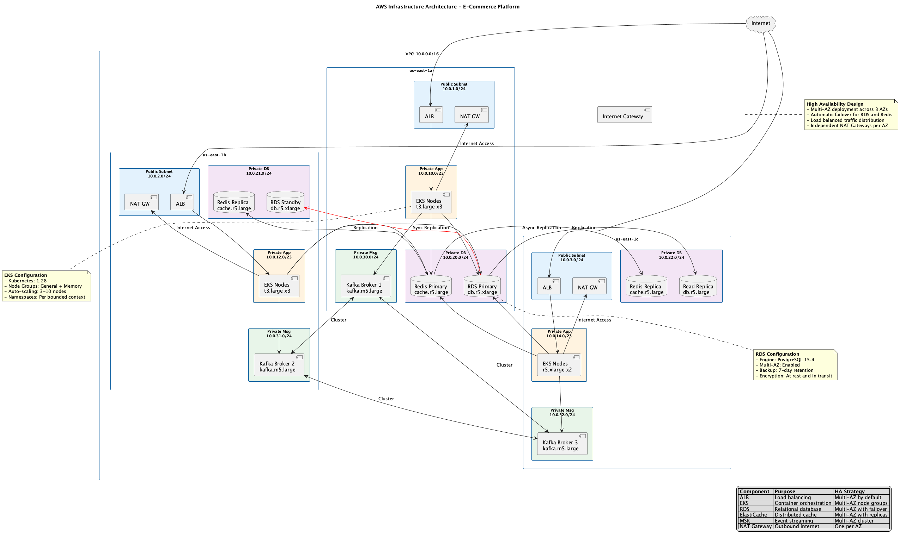

# Physical Architecture

> **Viewpoint**: Deployment  
> **Purpose**: Document the detailed configuration of physical infrastructure components  
> **Audience**: Architects, DevOps Engineers, Operations Team

## Overview

This document provides detailed specifications for all physical infrastructure components of the E-Commerce Platform, including compute, database, caching, and messaging layers.



*Figure 1: AWS infrastructure architecture showing multi-AZ deployment across us-east-1*

## Amazon EKS (Elastic Kubernetes Service)

### Cluster Configuration

**Cluster Details**:
- **Name**: `ecommerce-platform-prod`
- **Version**: Kubernetes 1.28
- **Region**: us-east-1
- **Availability Zones**: us-east-1a, us-east-1b, us-east-1c
- **Endpoint**: Private and public access enabled
- **Logging**: Control plane logging enabled (API, audit, authenticator, controller manager, scheduler)

**Control Plane**:
- **Managed by AWS**: Automatic updates and patching
- **High Availability**: Multi-AZ deployment by default
- **API Server**: Load balanced across multiple AZs
- **etcd**: Managed by AWS with automatic backups

### Node Groups

#### General Purpose Node Group

**Configuration**:
```yaml
Name: general-purpose-nodes
Instance Type: t3.large
  - vCPU: 2
  - Memory: 8 GiB
  - Network: Up to 5 Gbps
  - EBS Bandwidth: Up to 2,780 Mbps

Capacity:
  Desired: 5 nodes
  Minimum: 3 nodes
  Maximum: 10 nodes

Disk:
  Type: gp3
  Size: 100 GB
  IOPS: 3000
  Throughput: 125 MB/s

AMI: Amazon EKS optimized Amazon Linux 2
```

**Use Cases**:
- Stateless microservices (Order, Customer, Product services)
- API gateways
- Background workers

**Labels**:
```yaml
workload-type: general
node-group: general-purpose
```

**Taints**: None (accepts all pods)

#### Memory Optimized Node Group

**Configuration**:
```yaml
Name: memory-optimized-nodes
Instance Type: r5.xlarge
  - vCPU: 4
  - Memory: 32 GiB
  - Network: Up to 10 Gbps
  - EBS Bandwidth: Up to 4,750 Mbps

Capacity:
  Desired: 3 nodes
  Minimum: 2 nodes
  Maximum: 5 nodes

Disk:
  Type: gp3
  Size: 200 GB
  IOPS: 3000
  Throughput: 125 MB/s

AMI: Amazon EKS optimized Amazon Linux 2
```

**Use Cases**:
- Data-intensive services (Analytics, Reporting)
- In-memory caching services
- Search and indexing services

**Labels**:
```yaml
workload-type: memory-intensive
node-group: memory-optimized
```

**Taints**:
```yaml
- key: workload-type
  value: memory-intensive
  effect: NoSchedule
```

### Namespace Organization

```yaml
# System namespaces
- kube-system          # Kubernetes system components
- kube-public          # Public cluster information
- kube-node-lease      # Node heartbeat data

# Application namespaces (by bounded context)
- customer-context     # Customer service and related components
- order-context        # Order service and related components
- product-context      # Product service and related components
- payment-context      # Payment service and related components
- inventory-context    # Inventory service and related components
- notification-context # Notification service and related components

# Infrastructure namespaces
- monitoring           # Prometheus, Grafana
- logging              # Fluentd, Elasticsearch
- ingress-nginx        # Ingress controller
```

### Pod Resource Configuration

**Resource Requests and Limits**:

```yaml
# Example: Order Service
apiVersion: apps/v1
kind: Deployment
metadata:
  name: order-service
  namespace: order-context
spec:
  replicas: 3
  template:
    spec:
      containers:
      - name: order-service
        image: order-service:latest
        resources:
          requests:
            memory: "512Mi"
            cpu: "250m"
          limits:
            memory: "1Gi"
            cpu: "500m"
        livenessProbe:
          httpGet:
            path: /actuator/health/liveness
            port: 8080
          initialDelaySeconds: 60
          periodSeconds: 10
          timeoutSeconds: 5
          failureThreshold: 3
        readinessProbe:
          httpGet:
            path: /actuator/health/readiness
            port: 8080
          initialDelaySeconds: 30
          periodSeconds: 5
          timeoutSeconds: 3
          failureThreshold: 3
```

**Resource Quotas per Namespace**:

```yaml
apiVersion: v1
kind: ResourceQuota
metadata:
  name: order-context-quota
  namespace: order-context
spec:
  hard:
    requests.cpu: "10"
    requests.memory: "20Gi"
    limits.cpu: "20"
    limits.memory: "40Gi"
    pods: "50"
```

### Auto-Scaling Configuration

**Cluster Autoscaler**:
```yaml
# Scales node groups based on pending pods
Configuration:
  - Scale up when pods are pending for > 30 seconds
  - Scale down when node utilization < 50% for > 10 minutes
  - Respect pod disruption budgets
  - Never scale below minimum node count
```

**Horizontal Pod Autoscaler (HPA)**:
```yaml
# Example for Order Service
apiVersion: autoscaling/v2
kind: HorizontalPodAutoscaler
metadata:
  name: order-service-hpa
  namespace: order-context
spec:
  scaleTargetRef:
    apiVersion: apps/v1
    kind: Deployment
    name: order-service
  minReplicas: 3
  maxReplicas: 20
  metrics:
  - type: Resource
    resource:
      name: cpu
      target:
        type: Utilization
        averageUtilization: 70
  - type: Resource
    resource:
      name: memory
      target:
        type: Utilization
        averageUtilization: 80
  - type: Pods
    pods:
      metric:
        name: http_requests_per_second
      target:
        type: AverageValue
        averageValue: "1000"
```

## Amazon RDS (Relational Database Service)

### Primary Instance Configuration

**Instance Details**:
```yaml
Identifier: ecommerce-platform-prod-primary
Engine: PostgreSQL 15.4
Instance Class: db.r5.xlarge
  - vCPU: 4
  - Memory: 32 GiB
  - Network: Up to 10 Gbps
  - EBS Bandwidth: Up to 4,750 Mbps

Storage:
  Type: gp3 (General Purpose SSD)
  Allocated: 500 GB
  Max Allocated: 2000 GB (auto-scaling enabled)
  IOPS: 12,000
  Throughput: 500 MB/s

Deployment:
  Multi-AZ: Enabled
  Primary AZ: us-east-1a
  Standby AZ: us-east-1b
```

**Database Configuration**:
```sql
-- PostgreSQL Parameters
max_connections = 200
shared_buffers = 8GB
effective_cache_size = 24GB
maintenance_work_mem = 2GB
checkpoint_completion_target = 0.9
wal_buffers = 16MB
default_statistics_target = 100
random_page_cost = 1.1
effective_io_concurrency = 200
work_mem = 20MB
min_wal_size = 2GB
max_wal_size = 8GB
max_worker_processes = 4
max_parallel_workers_per_gather = 2
max_parallel_workers = 4
```

### Read Replica Configuration

**Replica 1** (us-east-1c):
```yaml
Identifier: ecommerce-platform-prod-replica-1
Instance Class: db.r5.large
  - vCPU: 2
  - Memory: 16 GiB

Storage:
  Type: gp3
  Allocated: 500 GB
  IOPS: 12,000
  Throughput: 500 MB/s

Replication:
  Source: ecommerce-platform-prod-primary
  Lag: < 1 second (typical)
```

**Replica 2** (us-east-1a):
```yaml
Identifier: ecommerce-platform-prod-replica-2
Instance Class: db.r5.large
  - vCPU: 2
  - Memory: 16 GiB

Storage:
  Type: gp3
  Allocated: 500 GB
  IOPS: 12,000
  Throughput: 500 MB/s

Replication:
  Source: ecommerce-platform-prod-primary
  Lag: < 1 second (typical)
```

### Backup and Maintenance

**Automated Backups**:
```yaml
Backup Retention: 7 days
Backup Window: 03:00-04:00 UTC (off-peak hours)
Copy to Region: us-west-2 (disaster recovery)
Point-in-Time Recovery: Enabled (up to 7 days)
```

**Maintenance Window**:
```yaml
Preferred Window: Sun 04:00-05:00 UTC
Auto Minor Version Upgrade: Enabled
```

**Monitoring**:
```yaml
Enhanced Monitoring: Enabled (60-second granularity)
Performance Insights: Enabled (7-day retention)
CloudWatch Alarms:
  - CPU Utilization > 80%
  - Free Storage Space < 20%
  - Database Connections > 180
  - Replication Lag > 5 seconds
```

## Amazon ElastiCache (Redis)

### Cluster Configuration

**Cluster Details**:
```yaml
Cluster ID: ecommerce-platform-prod-redis
Engine: Redis 7.0
Cluster Mode: Enabled
Node Type: cache.r5.large
  - vCPU: 2
  - Memory: 13.07 GiB
  - Network: Up to 10 Gbps

Shards: 3
Replicas per Shard: 1
Total Nodes: 6 (3 primary + 3 replicas)
```

**Shard Distribution**:
```yaml
Shard 1:
  Primary: us-east-1a
  Replica: us-east-1b
  Slots: 0-5461

Shard 2:
  Primary: us-east-1b
  Replica: us-east-1c
  Slots: 5462-10922

Shard 3:
  Primary: us-east-1c
  Replica: us-east-1a
  Slots: 10923-16383
```

### Redis Configuration

**Parameters**:
```yaml
maxmemory-policy: allkeys-lru
timeout: 300
tcp-keepalive: 300
maxmemory-samples: 5
slowlog-log-slower-than: 10000
slowlog-max-len: 128
notify-keyspace-events: Ex
```

**Persistence**:
```yaml
AOF (Append-Only File): Enabled
AOF Rewrite: Automatic when file grows 100%
Snapshot: Disabled (using AOF for durability)
```

### Backup and Maintenance

**Automated Backups**:
```yaml
Backup Retention: 7 days
Backup Window: 03:00-04:00 UTC
Final Snapshot: Enabled on cluster deletion
```

**Maintenance Window**:
```yaml
Preferred Window: Sun 04:00-05:00 UTC
Auto Minor Version Upgrade: Enabled
```

**Monitoring**:
```yaml
CloudWatch Metrics:
  - CPUUtilization
  - DatabaseMemoryUsagePercentage
  - CurrConnections
  - Evictions
  - CacheHits / CacheMisses
  - ReplicationLag

Alarms:
  - CPU > 75%
  - Memory > 90%
  - Evictions > 1000/min
  - Cache Hit Rate < 80%
```

## Amazon MSK (Managed Streaming for Apache Kafka)

### Cluster Configuration

**Cluster Details**:
```yaml
Cluster Name: ecommerce-platform-prod-kafka
Kafka Version: 3.5.1
Broker Type: kafka.m5.large
  - vCPU: 2
  - Memory: 8 GiB
  - Network: Up to 10 Gbps

Brokers: 3 (one per AZ)
Availability Zones:
  - us-east-1a
  - us-east-1b
  - us-east-1c
```

**Storage Configuration**:
```yaml
Storage per Broker: 1000 GB
Storage Type: EBS (gp3)
IOPS: 3000
Throughput: 250 MB/s
Auto-scaling: Enabled (up to 2000 GB)
```

### Kafka Configuration

**Broker Settings**:
```properties
# Replication
default.replication.factor=3
min.insync.replicas=2
unclean.leader.election.enable=false

# Performance
num.network.threads=8
num.io.threads=16
socket.send.buffer.bytes=102400
socket.receive.buffer.bytes=102400
socket.request.max.bytes=104857600

# Log Retention
log.retention.hours=168  # 7 days
log.retention.bytes=-1   # No size limit
log.segment.bytes=1073741824  # 1 GB
log.cleanup.policy=delete

# Compression
compression.type=snappy
```

### Topic Configuration

**Standard Topics**:
```yaml
# Order Events
order-events:
  Partitions: 12
  Replication Factor: 3
  Min In-Sync Replicas: 2
  Retention: 7 days
  Compression: snappy

# Customer Events
customer-events:
  Partitions: 6
  Replication Factor: 3
  Min In-Sync Replicas: 2
  Retention: 7 days
  Compression: snappy

# Payment Events
payment-events:
  Partitions: 6
  Replication Factor: 3
  Min In-Sync Replicas: 2
  Retention: 7 days
  Compression: snappy

# Notification Events
notification-events:
  Partitions: 12
  Replication Factor: 3
  Min In-Sync Replicas: 2
  Retention: 3 days
  Compression: snappy
```

### Monitoring and Security

**Monitoring**:
```yaml
CloudWatch Metrics:
  - KafkaBytesInPerSec
  - KafkaBytesOutPerSec
  - KafkaMessagesInPerSec
  - PartitionCount
  - UnderReplicatedPartitions
  - OfflinePartitionsCount

Alarms:
  - UnderReplicatedPartitions > 0
  - OfflinePartitionsCount > 0
  - CPU > 75%
  - Disk Usage > 80%
```

**Security**:
```yaml
Encryption:
  In Transit: TLS 1.2
  At Rest: AWS KMS (AWS-managed key)

Authentication:
  Type: SASL/SCRAM
  Secrets Manager: Enabled

Authorization:
  ACLs: Enabled
  Allow Everyone If No ACL: false
```

## Resource Summary

### Compute Resources

| Component | Instance Type | Count | vCPU | Memory | Storage |
|-----------|--------------|-------|------|--------|---------|
| EKS General Nodes | t3.large | 3-10 | 6-20 | 24-80 GB | 300-1000 GB |
| EKS Memory Nodes | r5.xlarge | 2-5 | 8-20 | 64-160 GB | 400-1000 GB |
| RDS Primary | db.r5.xlarge | 1 | 4 | 32 GB | 500-2000 GB |
| RDS Replicas | db.r5.large | 2 | 4 | 32 GB | 1000 GB |
| Redis Nodes | cache.r5.large | 6 | 12 | 78 GB | N/A |
| Kafka Brokers | kafka.m5.large | 3 | 6 | 24 GB | 3000 GB |

### Network Bandwidth

| Component | Network Performance |
|-----------|-------------------|
| EKS Nodes (t3.large) | Up to 5 Gbps |
| EKS Nodes (r5.xlarge) | Up to 10 Gbps |
| RDS (db.r5.xlarge) | Up to 10 Gbps |
| Redis (cache.r5.large) | Up to 10 Gbps |
| Kafka (kafka.m5.large) | Up to 10 Gbps |

### Cost Estimate (Monthly)

| Component | Configuration | Estimated Cost |
|-----------|--------------|----------------|
| EKS Control Plane | 1 cluster | $150 |
| EKS Nodes (General) | 5 x t3.large | $400 |
| EKS Nodes (Memory) | 3 x r5.xlarge | $600 |
| RDS Primary | 1 x db.r5.xlarge | $600 |
| RDS Replicas | 2 x db.r5.large | $600 |
| ElastiCache | 6 x cache.r5.large | $900 |
| MSK | 3 x kafka.m5.large | $600 |
| EBS Storage | ~5 TB | $500 |
| Data Transfer | Estimated | $200 |
| **Total** | | **~$4,550** |

*Note: Costs are estimates and may vary based on actual usage, region, and AWS pricing changes.*

## Related Documentation

- [Deployment Overview](overview.md) - High-level deployment architecture
- [Network Architecture](network-architecture.md) - VPC and network configuration
- [Deployment Process](deployment-process.md) - CI/CD and deployment procedures

---

**Document Version**: 1.0  
**Last Updated**: 2025-10-23  
**Owner**: DevOps Team
