# 開發視點

## 概覽

開發視點關注系統的開發和建置過程，包括模組結構、編碼標準、測試策略和建置系統。

## 利害關係人

- **主要關注者**: 開發者、技術主管、架構師
- **次要關注者**: DevOps 工程師、QA 工程師、專案經理

## 關注點

1. **模組結構設計**: 如何組織程式碼模組和套件
2. **編碼標準**: 程式碼品質和一致性要求
3. **測試策略**: 單元測試、整合測試、端到端測試
4. **建置系統**: 自動化建置和部署流程
5. **開發工具鏈**: IDE、版本控制、CI/CD 工具

## 架構元素

### 模組結構

- **領域層模組**: 核心業務邏輯和領域模型
- **應用層模組**: 用例實現和應用服務
- **基礎設施模組**: 持久化、外部服務整合
- **介面層模組**: REST API、GraphQL、消息處理

#### DDD 分層架構

*完整的 DDD 分層架構設計，展示各層的職責和依賴關係*

#### 六角形架構

*六角形架構實現，展示端口和適配器模式在開發中的應用*

### 開發環境

- **Java**: 21 (啟用預覽功能)
- **Spring Boot**: 3.4.5
- **Gradle**: 8.x (多模組建置)
- **Node.js**: 18+ (前端開發)

### 測試框架

- **單元測試**: JUnit 5 + Mockito + AssertJ
- **BDD 測試**: Cucumber 7 + Gherkin
- **架構測試**: ArchUnit
- **性能測試**: TestPerformanceExtension

### 程式碼品質工具

- **格式化**: Spotless 自動格式化
- **靜態分析**: SonarQube、SpotBugs
- **測試報告**: Allure、JaCoCo

## 品質屬性考量

> 📋 **完整交叉引用**: 查看 [Viewpoint-Perspective 交叉引用矩陣](../../viewpoint-perspective-matrix.md#開發視點-development-viewpoint) 了解所有觀點的詳細影響分析

### 🔴 高影響觀點

#### [安全性觀點](../../perspectives/security/README.md)
- **安全編碼標準**: 遵循 OWASP 安全編碼實踐和指南
- **程式碼安全掃描**: 整合 SonarQube、Snyk 等靜態和動態安全掃描工具
- **依賴管理**: 第三方依賴的安全性檢查和漏洞監控
- **敏感資訊處理**: 密碼、API 金鑰等敏感資訊的安全處理規範
- **相關實現**: \1 | \1

#### [演進性觀點](../../perspectives/evolution/README.md)
- **程式碼品質**: 可維護、可擴展的程式碼設計和實現
- **架構設計**: 模組化、鬆耦合的架構設計原則
- **技術債務管理**: 技術債務的識別、評估和償還策略
- **重構策略**: 持續重構和程式碼改進實踐
- **相關實現**: \1 | [重構指南](../../design/refactoring-guide.md)

#### [成本觀點](../../perspectives/cost/README.md)
- **開發效率**: 開發工具鏈和流程的效率優化
- **維護成本**: 程式碼維護和支援的長期成本考量
- **技術選型**: 技術選擇對開發和維護成本的影響
- **資源使用**: 開發環境和建置資源的成本優化
- **相關實現**: \1 | \1

### 🟡 中影響觀點

#### [性能觀點](../../perspectives/performance/README.md)
- **程式碼優化**: 性能關鍵路徑的程式碼優化技術
- **建置優化**: 建置和部署流程的性能優化
- **測試性能**: 測試執行時間和資源使用的優化
- **相關實現**: \1 | \1

#### [可用性觀點](../../perspectives/availability/README.md)
- **錯誤處理**: 健壯的錯誤處理和異常管理機制
- **測試策略**: 全面的測試覆蓋和品質保證
- **監控整合**: 應用監控和日誌記錄的開發整合
- **相關實現**: \1 | \1

#### [使用性觀點](../../perspectives/usability/README.md)
- **開發者體驗**: 開發工具和 API 的易用性設計
- **文件品質**: 技術文件的完整性、準確性和可讀性
- **API 設計**: RESTful API 的直觀性和一致性
- **相關實現**: \1 | \1

#### [法規觀點](../../perspectives/regulation/README.md)
- **合規開發**: 開發流程的合規要求和標準
- **程式碼稽核**: 程式碼的合規性檢查和稽核軌跡
- **資料處理**: 個人資料處理的開發實踐和合規
- **相關實現**: \1 | \1

### 🟢 低影響觀點

#### [位置觀點](../../perspectives/location/README.md)
- **國際化開發**: 多語言和多地區支援的開發實踐
- **時區處理**: 時間和日期處理的國際化考量
- **相關實現**: \1

## 相關圖表

- ## 六角架構實現

```mermaid
graph TB
    subgraph ACTORS ["External Actors"]
        CUSTOMER[👤 Customer<br/>Web & Mobile Users]
        ADMIN[👨‍💼 Admin<br/>Management Dashboard]
        DELIVERY[🚚 Delivery Person<br/>Logistics Interface]
    end
    
    subgraph EXTERNAL ["External Systems"]
        STRIPE[💳 Stripe Payment<br/>Payment Processing]
        EMAIL[📧 Email Service<br/>SES/SMTP]
        SMS[📱 SMS Service<br/>SNS/Twilio]
        POSTGRES[(🗄️ PostgreSQL<br/>Primary Database)]
        REDIS[(⚡ Redis Cache<br/>Session & Cache)]
        MSK[📊 MSK/Kafka<br/>Event Streaming]
    end
    
    subgraph PRIMARY_ADAPTERS ["Primary Adapters (Driving Side)"]
        WEB_UI[🌐 Web UI<br/>Next.js Frontend]
        MOBILE_UI[📱 Mobile UI<br/>Angular App]
        ADMIN_UI[🖥️ Admin Dashboard<br/>Management Interface]
        REST_API[🔌 REST Controllers<br/>HTTP API Endpoints]
        GRAPHQL[📡 GraphQL API<br/>Query Interface]
    end
    
    subgraph APPLICATION ["Application Layer"]
        CUSTOMER_APP[👤 CustomerApplicationService<br/>Customer Management]
        ORDER_APP[📦 OrderApplicationService<br/>Order Processing]
        PRODUCT_APP[🛍️ ProductApplicationService<br/>Product Management]
        PAYMENT_APP[💰 PaymentApplicationService<br/>Payment Processing]
        CART_APP[🛒 ShoppingCartApplicationService<br/>Cart Management]
        INVENTORY_APP[📊 InventoryApplicationService<br/>Stock Management]
        PRICING_APP[💲 PricingApplicationService<br/>Price Calculation]
        PROMOTION_APP[🎁 PromotionApplicationService<br/>Discount Management]
        NOTIFICATION_APP[🔔 NotificationApplicationService<br/>Message Delivery]
        OBSERVABILITY_APP[📈 ObservabilityApplicationService<br/>Monitoring & Metrics]
        STATS_APP[📊 StatsApplicationService<br/>Analytics & Reports]
        MONITORING_APP[🔍 MonitoringApplicationService<br/>Health Checks]
    end
    
    subgraph DOMAIN_CORE ["Domain Core (Hexagon)"]
        subgraph AGGREGATES ["Aggregate Roots"]
            CUSTOMER_AGG[👤 Customer<br/>@AggregateRoot<br/>Customer Lifecycle]
            ORDER_AGG[📦 Order<br/>@AggregateRoot<br/>Order Management]
            PRODUCT_AGG[🛍️ Product<br/>@AggregateRoot<br/>Product Catalog]
            PAYMENT_AGG[💰 Payment<br/>@AggregateRoot<br/>Payment Processing]
            CART_AGG[🛒 ShoppingCart<br/>@AggregateRoot<br/>Cart State]
            INVENTORY_AGG[📊 Inventory<br/>@AggregateRoot<br/>Stock Control]
            PROMOTION_AGG[🎁 Promotion<br/>@AggregateRoot<br/>Discount Rules]
            DELIVERY_AGG[🚚 Delivery<br/>@AggregateRoot<br/>Shipping Info]
            NOTIFICATION_AGG[🔔 Notification<br/>@AggregateRoot<br/>Message Queue]
            REVIEW_AGG[⭐ Review<br/>@AggregateRoot<br/>Product Reviews]
            SELLER_AGG[🏪 Seller<br/>@AggregateRoot<br/>Vendor Management]
            OBSERVABILITY_AGG[📈 Observability<br/>@AggregateRoot<br/>Metrics Collection]
        end
        
        subgraph DOMAIN_SERVICES ["Domain Services"]
            ORDER_DOMAIN_SVC[📦 OrderDomainService<br/>Complex Order Logic]
            PRICING_DOMAIN_SVC[💲 PricingDomainService<br/>Pricing Algorithms]
            PROMOTION_DOMAIN_SVC[🎁 PromotionDomainService<br/>Discount Calculations]
        end
        
        subgraph REPOSITORY_PORTS ["Repository Ports"]
            CUSTOMER_REPO_PORT[👤 CustomerRepository<br/>Interface]
            ORDER_REPO_PORT[📦 OrderRepository<br/>Interface]
            PRODUCT_REPO_PORT[🛍️ ProductRepository<br/>Interface]
            PAYMENT_REPO_PORT[💰 PaymentRepository<br/>Interface]
            INVENTORY_REPO_PORT[📊 InventoryRepository<br/>Interface]
            PROMOTION_REPO_PORT[🎁 PromotionRepository<br/>Interface]
        end
        
        subgraph SERVICE_PORTS ["Service Ports"]
            PAYMENT_PORT[💳 PaymentPort<br/>Payment Gateway Interface]
            NOTIFICATION_PORT[🔔 NotificationPort<br/>Messaging Interface]
            EVENT_PORT[📡 EventPublisherPort<br/>Event Streaming Interface]
            CACHE_PORT[⚡ CachePort<br/>Caching Interface]
        end
    end
    
    subgraph SECONDARY_ADAPTERS ["Secondary Adapters (Driven Side)"]
        subgraph PERSISTENCE ["Persistence Adapters"]
            JPA_CUSTOMER[👤 JpaCustomerRepository<br/>Customer Data Access]
            JPA_ORDER[📦 JpaOrderRepository<br/>Order Data Access]
            JPA_PRODUCT[🛍️ JpaProductRepository<br/>Product Data Access]
            JPA_PAYMENT[💰 JpaPaymentRepository<br/>Payment Data Access]
            JPA_INVENTORY[📊 JpaInventoryRepository<br/>Inventory Data Access]
            JPA_PROMOTION[🎁 JpaPromotionRepository<br/>Promotion Data Access]
        end
        
        subgraph EXTERNAL_ADAPTERS ["External Service Adapters"]
            STRIPE_ADAPTER[💳 StripePaymentAdapter<br/>Stripe Integration]
            EMAIL_ADAPTER[📧 EmailNotificationAdapter<br/>Email Service Integration]
            SMS_ADAPTER[📱 SmsNotificationAdapter<br/>SMS Service Integration]
        end
        
        subgraph EVENT_ADAPTERS ["Event & Cache Adapters"]
            MSK_ADAPTER[📊 MskEventAdapter<br/>Kafka Event Publishing]
            MEMORY_EVENT_ADAPTER[🧠 InMemoryEventAdapter<br/>Development Events]
            REDIS_ADAPTER[⚡ RedisCacheAdapter<br/>Cache Management]
            OPENSEARCH_ADAPTER[🔍 OpenSearchAdapter<br/>Search & Analytics]
        end
    end
    
    %% Primary Flow (Inbound)
    CUSTOMER --> WEB_UI
    CUSTOMER --> MOBILE_UI
    ADMIN --> ADMIN_UI
    DELIVERY --> REST_API
    
    WEB_UI --> REST_API
    MOBILE_UI --> REST_API
    ADMIN_UI --> REST_API
    REST_API --> GRAPHQL
    
    REST_API --> CUSTOMER_APP
    REST_API --> ORDER_APP
    REST_API --> PRODUCT_APP
    REST_API --> PAYMENT_APP
    REST_API --> CART_APP
    REST_API --> INVENTORY_APP
    REST_API --> PRICING_APP
    REST_API --> PROMOTION_APP
    REST_API --> NOTIFICATION_APP
    REST_API --> OBSERVABILITY_APP
    REST_API --> STATS_APP
    REST_API --> MONITORING_APP
    
    %% Application to Domain
    CUSTOMER_APP --> CUSTOMER_AGG
    ORDER_APP --> ORDER_AGG
    ORDER_APP --> ORDER_DOMAIN_SVC
    PRODUCT_APP --> PRODUCT_AGG
    PAYMENT_APP --> PAYMENT_AGG
    CART_APP --> CART_AGG
    INVENTORY_APP --> INVENTORY_AGG
    PRICING_APP --> PRICING_DOMAIN_SVC
    PROMOTION_APP --> PROMOTION_AGG
    PROMOTION_APP --> PROMOTION_DOMAIN_SVC
    NOTIFICATION_APP --> NOTIFICATION_AGG
    OBSERVABILITY_APP --> OBSERVABILITY_AGG
    
    %% Domain to Repository Ports
    CUSTOMER_APP --> CUSTOMER_REPO_PORT
    ORDER_APP --> ORDER_REPO_PORT
    PRODUCT_APP --> PRODUCT_REPO_PORT
    PAYMENT_APP --> PAYMENT_REPO_PORT
    INVENTORY_APP --> INVENTORY_REPO_PORT
    PROMOTION_APP --> PROMOTION_REPO_PORT
    
    %% Domain to Service Ports
    PAYMENT_APP --> PAYMENT_PORT
    NOTIFICATION_APP --> NOTIFICATION_PORT
    ORDER_APP --> EVENT_PORT
    PRODUCT_APP --> CACHE_PORT
    
    %% Secondary Flow (Outbound) - Repository Implementations
    CUSTOMER_REPO_PORT -.-> JPA_CUSTOMER
    ORDER_REPO_PORT -.-> JPA_ORDER
    PRODUCT_REPO_PORT -.-> JPA_PRODUCT
    PAYMENT_REPO_PORT -.-> JPA_PAYMENT
    INVENTORY_REPO_PORT -.-> JPA_INVENTORY
    PROMOTION_REPO_PORT -.-> JPA_PROMOTION
    
    %% Secondary Flow (Outbound) - Service Implementations
    PAYMENT_PORT -.-> STRIPE_ADAPTER
    NOTIFICATION_PORT -.-> EMAIL_ADAPTER
    NOTIFICATION_PORT -.-> SMS_ADAPTER
    EVENT_PORT -.-> MSK_ADAPTER
    EVENT_PORT -.-> MEMORY_EVENT_ADAPTER
    CACHE_PORT -.-> REDIS_ADAPTER
    CACHE_PORT -.-> OPENSEARCH_ADAPTER
    
    %% External System Connections
    JPA_CUSTOMER --> POSTGRES
    JPA_ORDER --> POSTGRES
    JPA_PRODUCT --> POSTGRES
    JPA_PAYMENT --> POSTGRES
    JPA_INVENTORY --> POSTGRES
    JPA_PROMOTION --> POSTGRES
    
    STRIPE_ADAPTER --> STRIPE
    EMAIL_ADAPTER --> EMAIL
    SMS_ADAPTER --> SMS
    MSK_ADAPTER --> MSK
    REDIS_ADAPTER --> REDIS
    
    %% Styling
    classDef actor fill:#e3f2fd,stroke:#1976d2,stroke-width:2px
    classDef external fill:#ffebee,stroke:#d32f2f,stroke-width:2px
    classDef primary fill:#e8f5e8,stroke:#388e3c,stroke-width:2px
    classDef application fill:#f3e5f5,stroke:#7b1fa2,stroke-width:2px
    classDef domain fill:#fff3e0,stroke:#f57c00,stroke-width:2px
    classDef secondary fill:#fafafa,stroke:#616161,stroke-width:2px
    
    class CUSTOMER,ADMIN,DELIVERY actor
    class STRIPE,EMAIL,SMS,POSTGRES,REDIS,MSK external
    class WEB_UI,MOBILE_UI,ADMIN_UI,REST_API,GRAPHQL primary
    class CUSTOMER_APP,ORDER_APP,PRODUCT_APP,PAYMENT_APP,CART_APP,INVENTORY_APP,PRICING_APP,PROMOTION_APP,NOTIFICATION_APP,OBSERVABILITY_APP,STATS_APP,MONITORING_APP application
    class CUSTOMER_AGG,ORDER_AGG,PRODUCT_AGG,PAYMENT_AGG,CART_AGG,INVENTORY_AGG,PROMOTION_AGG,DELIVERY_AGG,NOTIFICATION_AGG,REVIEW_AGG,SELLER_AGG,OBSERVABILITY_AGG,ORDER_DOMAIN_SVC,PRICING_DOMAIN_SVC,PROMOTION_DOMAIN_SVC,CUSTOMER_REPO_PORT,ORDER_REPO_PORT,PRODUCT_REPO_PORT,PAYMENT_REPO_PORT,INVENTORY_REPO_PORT,PROMOTION_REPO_PORT,PAYMENT_PORT,NOTIFICATION_PORT,EVENT_PORT,CACHE_PORT domain
    class JPA_CUSTOMER,JPA_ORDER,JPA_PRODUCT,JPA_PAYMENT,JPA_INVENTORY,JPA_PROMOTION,STRIPE_ADAPTER,EMAIL_ADAPTER,SMS_ADAPTER,MSK_ADAPTER,MEMORY_EVENT_ADAPTER,REDIS_ADAPTER,OPENSEARCH_ADAPTER secondary
```

- \1
- \1

## 與其他視點的關聯

- **[功能視點](../functional/README.md)**: 領域模型實現和業務邏輯開發
- **[資訊視點](../information/README.md)**: 資料模型實現和事件處理
- **[並發視點](../concurrency/README.md)**: 並發程式設計和執行緒安全
- **[部署視點](../deployment/README.md)**: 建置產物和部署策略
- **[運營視點](../operational/README.md)**: 監控整合和日誌記錄

## 實現指南

### 開發流程

1. **需求分析**: BDD 場景設計和驗收條件定義
2. **領域建模**: DDD 戰術模式實現
3. **TDD 開發**: 測試驅動開發實踐
4. **程式碼審查**: 同儕審查和品質檢查
5. **整合測試**: 端到端功能驗證

### 最佳實踐

- 遵循 SOLID 原則和 DDD 戰術模式
- 實施測試金字塔策略 (80% 單元測試, 15% 整合測試, 5% E2E 測試)
- 使用依賴注入和控制反轉
- 實現適當的錯誤處理和日誌記錄
- 定期重構和技術債務清理

## 驗證標準

- 程式碼覆蓋率 > 80%
- 所有 BDD 場景通過測試
- ArchUnit 架構合規性檢查通過
- 無高風險安全漏洞
- 建置時間 < 10 分鐘

## 文件列表

- [六角架構實現指南](hexagonal-architecture.md) - 六角架構的具體實現
- \1 - 程式碼組織和套件設計
- [編碼標準](../../development/coding-standards.md) - 程式碼品質和風格指南
- \1 - 測試方法和最佳實踐
- \1 - Gradle 建置配置和優化
- [開發工作流程](development-workflow.md) - AI-DLC 開發流程指南

## 適用對象

- 新加入的開發者
- 專案貢獻者
- 技術主管和架構師
- DevOps 和 QA 工程師