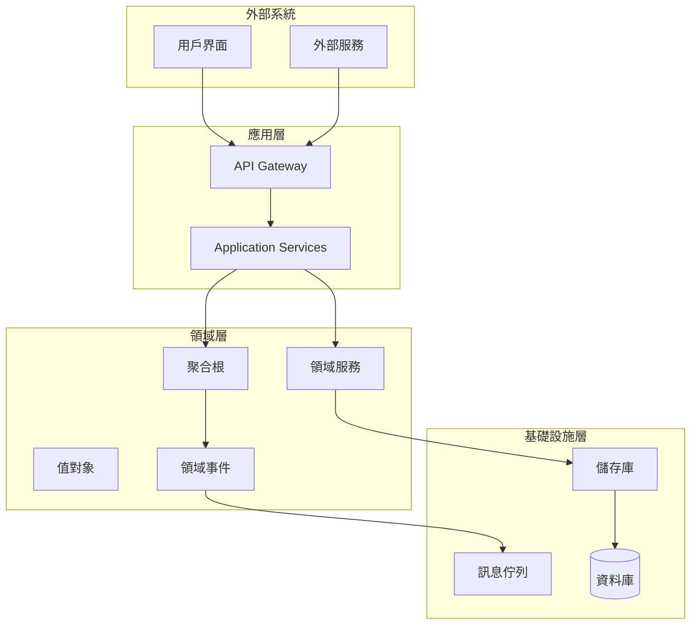

# 架構設計指南

## 概覽

本指南涵蓋了專案中使用的所有架構模式和設計原則，包括 DDD 領域驅動設計、六角架構、微服務架構和 Saga 模式。這些架構模式共同構成了一個可擴展、可維護的企業級系統。

## 🏗️ 架構概覽

我們的系統採用多層架構設計，結合了多種現代軟體架構模式：



## 🎯 DDD 領域驅動設計

### 戰術模式
我們使用 DDD 戰術模式來組織業務邏輯：

- **[@AggregateRoot](ddd-patterns/tactical-patterns.md#aggregateroot)** - 聚合根，業務一致性邊界
- **[@ValueObject](ddd-patterns/tactical-patterns.md#valueobject)** - 值對象，不可變的業務概念
- **[@Entity](ddd-patterns/tactical-patterns.md#entity)** - 實體，有身份的業務對象
- **[@DomainService](ddd-patterns/tactical-patterns.md#domainservice)** - 領域服務，跨聚合的業務邏輯

### 領域事件
- **[Record 實作](ddd-patterns/domain-events.md)** - 使用 Java Record 實作不可變事件
- **[事件收集](ddd-patterns/domain-events.md#event-collection)** - 聚合根中的事件收集機制
- **[事件發布](ddd-patterns/domain-events.md#event-publishing)** - 應用服務中的事件發布

### 實際範例
```java
@AggregateRoot(name = "Customer", description = "客戶聚合根", boundedContext = "Customer", version = "2.0")
public class Customer extends AggregateRoot {
    
    public void updateProfile(CustomerName newName, Email newEmail) {
        // 1. 執行業務邏輯
        validateProfileUpdate(newName, newEmail);
        
        // 2. 更新狀態
        this.name = newName;
        this.email = newEmail;
        
        // 3. 收集領域事件
        collectEvent(CustomerProfileUpdatedEvent.create(this.id, newName, newEmail));
    }
}
```

詳細指南：[DDD 戰術模式](ddd-patterns/README.md)

## 🔵 六角架構 (Hexagonal Architecture)

### 核心概念
六角架構將應用程式分為內部（業務邏輯）和外部（技術細節），通過 Port 和 Adapter 進行解耦：

- **[Port-Adapter 模式](hexagonal-architecture/ports-adapters.md)** - 定義介面和實作分離
- **[依賴反轉](hexagonal-architecture/dependency-inversion.md)** - 業務邏輯不依賴技術細節
- **[分層設計](hexagonal-architecture/layered-design.md)** - 清晰的層次邊界

### 實際應用
```java
// Port (介面)
public interface CustomerRepository {
    Optional<Customer> findById(CustomerId id);
    void save(Customer customer);
}

// Adapter (實作)
@Repository
public class JpaCustomerRepository implements CustomerRepository {
    // JPA 具體實作
}
```

詳細指南：[六角架構實作](hexagonal-architecture/README.md)

## 🌐 微服務架構

### 核心組件
我們的微服務架構包含以下關鍵組件：

- **[API Gateway](microservices/api-gateway.md)** - 統一入口點，路由和認證
- **[Service Discovery](microservices/service-discovery.md)** - 服務註冊和發現
- **[Load Balancing](microservices/load-balancing.md)** - 負載均衡和健康檢查
- **[Circuit Breaker](microservices/circuit-breaker.md)** - 故障隔離和自動恢復

### AWS 基礎設施
```yaml
# Application Load Balancer 配置
LoadBalancer:
  Type: AWS::ElasticLoadBalancingV2::LoadBalancer
  Properties:
    Type: application
    Scheme: internet-facing
    SecurityGroups: [!Ref ALBSecurityGroup]
    Subnets: [!Ref PublicSubnet1, !Ref PublicSubnet2]
```

### 分散式模式
- **[分散式追蹤](microservices/distributed-patterns.md#distributed-tracing)** - AWS X-Ray 整合
- **[配置管理](microservices/distributed-patterns.md#config-management)** - 環境特定配置
- **[服務網格](microservices/distributed-patterns.md#service-mesh)** - 微服務間通訊安全

詳細指南：[微服務架構設計](microservices/README.md)

## 🎭 Saga 模式

### 編排 vs 編舞
我們使用兩種 Saga 模式來處理分散式事務：

- **[編排式 Saga](saga-patterns/orchestration.md)** - 中央協調器控制流程
- **[編舞式 Saga](saga-patterns/choreography.md)** - 事件驅動的去中心化協調

### 實際實作
```java
@Component
public class OrderProcessingSaga {
    
    @TransactionalEventListener
    @Order(1)
    public void on(OrderCreatedEvent event) {
        // 步驟 1: 預留庫存
        inventoryService.reserveItems(event.orderItems());
    }
    
    @TransactionalEventListener
    @Order(2)
    public void on(InventoryReservedEvent event) {
        // 步驟 2: 處理支付
        paymentService.processPayment(event.orderId(), event.amount());
    }
}
```

### 具體 Saga 實作
- **[訂單處理 Saga](saga-patterns/order-processing-saga.md)** - 完整的訂單處理流程
- **[支付 Saga](saga-patterns/payment-saga.md)** - 支付處理和補償機制
- **[Saga 協調](saga-patterns/saga-coordination.md)** - 協調機制和錯誤處理

詳細指南：[Saga 模式實作](saga-patterns/README.md)

## 🎯 SOLID 原則

### 五大原則
我們嚴格遵循 SOLID 原則來確保程式碼品質：

1. **[單一職責原則 (SRP)](design-principles.md#single-responsibility)** - 每個類別只有一個變更理由
2. **[開放封閉原則 (OCP)](design-principles.md#open-closed)** - 對擴展開放，對修改封閉
3. **[里氏替換原則 (LSP)](design-principles.md#liskov-substitution)** - 子類別可以替換父類別
4. **[介面隔離原則 (ISP)](design-principles.md#interface-segregation)** - 不依賴不需要的介面
5. **[依賴反轉原則 (DIP)](design-principles.md#dependency-inversion)** - 依賴抽象而非具體實作

### 設計模式
- **[Factory 模式](design-principles.md#factory-pattern)** - 物件創建的封裝
- **[Builder 模式](design-principles.md#builder-pattern)** - 複雜物件的構建
- **[Strategy 模式](design-principles.md#strategy-pattern)** - 演算法的封裝和替換
- **[Observer 模式](design-principles.md#observer-pattern)** - 事件通知機制

詳細指南：[設計原則與模式](design-principles.md)

## 📊 架構決策記錄 (ADR)

### 重要決策
- **[ADR-001: DDD 戰術模式採用](../../../architecture/adrs/ADR-001-ddd-tactical-patterns.md)**
- **[ADR-002: 六角架構實作](../../../architecture/adrs/ADR-002-hexagonal-architecture.md)**
- **[ADR-003: 微服務架構設計](../../../architecture/adrs/ADR-003-microservices-architecture.md)**
- **[ADR-004: Saga 模式選擇](../../../architecture/adrs/ADR-004-saga-pattern-selection.md)**

## 🔍 架構驗證

### ArchUnit 規則
我們使用 ArchUnit 來自動驗證架構約束：

```java
@ArchTest
static final ArchRule domainLayerRules = classes()
    .that().resideInAPackage("..domain..")
    .should().onlyDependOnClassesThat()
    .resideInAnyPackage("..domain..", "java..", "org.springframework..");

@ArchTest  
static final ArchRule aggregateRootRules = classes()
    .that().areAnnotatedWith(AggregateRoot.class)
    .should().implement(AggregateRootInterface.class);
```

詳細測試：[架構測試指南](../testing/architecture-testing.md)

## 📈 效能考量

### 效能模式
- **快取策略** - Redis 分散式快取
- **資料庫優化** - 連接池和查詢優化
- **非同步處理** - 事件驅動的非同步操作
- **負載均衡** - Application Load Balancer 配置

### 監控指標
- **回應時間** - 95th percentile < 2s
- **吞吐量** - > 1000 req/s
- **錯誤率** - < 0.1%
- **可用性** - > 99.9%

## 🔗 相關資源

### 內部文檔
- [測試策略](../testing/README.md) - 如何測試這些架構模式
- [編碼標準](../coding-standards/README.md) - 實作這些模式的編碼規範
- [工具鏈](../tools-and-environment/README.md) - 支援這些架構的工具

### 外部資源
- [Domain-Driven Design Reference](https://domainlanguage.com/ddd/reference/)
- [Hexagonal Architecture](https://alistair.cockburn.us/hexagonal-architecture/)
- [Microservices Patterns](https://microservices.io/patterns/)
- [Saga Pattern](https://microservices.io/patterns/data/saga.html)

---

**最後更新**: 2025年1月21日  
**維護者**: Architecture Team  
**版本**: 1.0

> 💡 **提示**: 架構是演進的，不是一成不變的。隨著業務需求的變化，我們會持續優化和調整架構設計。