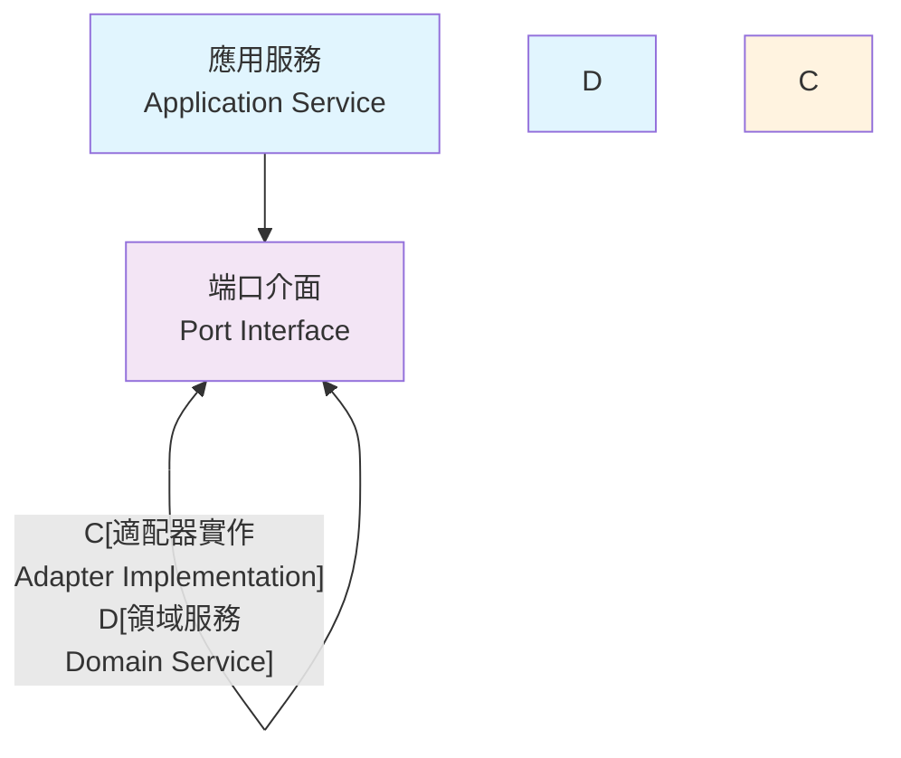

# 六角架構

## 概述

本文檔提供完整的六角架構 (Hexagonal Architecture) 設計指南，包含架構總覽、Port-Adapter 模式、依賴反轉和分層設計的實作方法。

## 🔵 六角架構總覽

### 核心概念

六角架構（也稱為端口和適配器架構）是一種軟體架構模式，旨在將應用程式的核心邏輯與外部關注點分離。

### 架構原則

- **單一職責原則 (SRP)**：每個類別只有一個變更的理由
- **開放封閉原則 (OCP)**：對擴展開放，對修改封閉
- **依賴反轉原則 (DIP)**：依賴抽象而非具體實作

### 架構模式

- **六角架構**：清晰的邊界和依賴方向
- **DDD 戰術模式**：聚合根、實體、值物件
- **事件驅動架構**：鬆耦合的組件通訊

### 程式碼結構

```
src/main/java/
├── domain/                    # 領域層（核心業務邏輯）
│   ├── model/                # 聚合根、實體、值物件
│   │   ├── Customer.java     # 聚合根
│   │   ├── CustomerId.java   # 值對象
│   │   └── CustomerStatus.java
│   ├── events/               # 領域事件
│   │   └── CustomerCreatedEvent.java
│   └── services/             # 領域服務
│       └── CustomerValidationService.java
│
├── application/              # 應用層（用例協調）
│   ├── port/                # 端口定義（抽象）
│   │   ├── in/              # 輸入端口（驅動端口）
│   │   │   └── CustomerUseCase.java
│   │   └── out/             # 輸出端口（被驅動端口）
│   │       ├── CustomerRepository.java
│   │       └── EmailService.java
│   ├── commands/            # 命令處理
│   │   └── CreateCustomerCommand.java
│   ├── queries/             # 查詢處理
│   │   └── GetCustomerQuery.java
│   └── services/            # 應用服務
│       └── CustomerApplicationService.java
│
└── infrastructure/          # 基礎設施層（技術實作）
    ├── adapter/            # 適配器實作
    │   ├── in/            # 輸入適配器
    │   │   ├── web/       # Web 控制器
    │   │   │   └── CustomerController.java
    │   │   └── messaging/ # 訊息處理器
    │   │       └── CustomerEventHandler.java
    │   └── out/           # 輸出適配器
    │       ├── persistence/ # 資料持久化
    │       │   ├── CustomerJpaRepository.java
    │       │   └── CustomerRepositoryAdapter.java
    │       └── external/   # 外部服務
    │           └── EmailServiceAdapter.java
    ├── configuration/      # 配置
    │   └── ApplicationConfiguration.java
    └── persistence/        # JPA 實體
        └── CustomerEntity.java
```

## 🔌 Port-Adapter 模式

### 端口 (Ports) 定義

端口是應用程式核心與外部世界之間的契約，定義了應用程式的邊界。

#### 輸入端口 (Driving Ports)

輸入端口定義應用程式提供的功能：

```java
public interface CustomerUseCase {
    CustomerResponse createCustomer(CreateCustomerCommand command);
    CustomerResponse updateCustomer(UpdateCustomerCommand command);
    CustomerResponse getCustomer(GetCustomerQuery query);
    void deleteCustomer(DeleteCustomerCommand command);
}
```

#### 輸出端口 (Driven Ports)

輸出端口定義應用程式需要的外部服務：

```java
// 儲存庫端口
public interface CustomerRepository {
    void save(Customer customer);
    Optional<Customer> findById(CustomerId customerId);
    Optional<Customer> findByEmail(Email email);
    List<Customer> findByStatus(CustomerStatus status);
    void delete(CustomerId customerId);
}

// 外部服務端口
public interface EmailService {
    void sendWelcomeEmail(Email email, CustomerName name);
    void sendPasswordResetEmail(Email email, String resetToken);
    void sendAccountDeactivationEmail(Email email, CustomerName name);
}

// 事件發布端口
public interface EventPublisher {
    void publish(DomainEvent event);
    void publishAll(List<DomainEvent> events);
}
```

### 適配器 (Adapters) 實作

適配器實作端口定義的契約，連接應用程式核心與外部技術。

#### 輸入適配器

##### Web 控制器適配器

```java
@RestController
@RequestMapping("/../api/v1/customers")
public class CustomerController {
    
    private final CustomerUseCase customerUseCase;
    
    public CustomerController(CustomerUseCase customerUseCase) {
        this.customerUseCase = customerUseCase;
    }
    
    @PostMapping
    public ResponseEntity<CustomerResponse> createCustomer(
            @Valid @RequestBody CreateCustomerRequest request) {
        
        CreateCustomerCommand command = new CreateCustomerCommand(
            request.name(),
            request.email(),
            request.phone()
        );
        
        CustomerResponse response = customerUseCase.createCustomer(command);
        return ResponseEntity.status(HttpStatus.CREATED).body(response);
    }
    
    @GetMapping("/{customerId}")
    public ResponseEntity<CustomerResponse> getCustomer(
            @PathVariable String customerId) {
        
        GetCustomerQuery query = new GetCustomerQuery(CustomerId.of(customerId));
        CustomerResponse response = customerUseCase.getCustomer(query);
        return ResponseEntity.ok(response);
    }
    
    @PutMapping("/{customerId}")
    public ResponseEntity<CustomerResponse> updateCustomer(
            @PathVariable String customerId,
            @Valid @RequestBody UpdateCustomerRequest request) {
        
        UpdateCustomerCommand command = new UpdateCustomerCommand(
            CustomerId.of(customerId),
            request.name(),
            request.email(),
            request.phone()
        );
        
        CustomerResponse response = customerUseCase.updateCustomer(command);
        return ResponseEntity.ok(response);
    }
}
```

##### 訊息處理適配器

```java
@Component
public class CustomerEventMessageHandler {
    
    private final CustomerUseCase customerUseCase;
    
    public CustomerEventMessageHandler(CustomerUseCase customerUseCase) {
        this.customerUseCase = customerUseCase;
    }
    
    @EventListener
    public void handleExternalCustomerUpdate(ExternalCustomerUpdateEvent event) {
        UpdateCustomerCommand command = new UpdateCustomerCommand(
            CustomerId.of(event.getCustomerId()),
            new CustomerName(event.getName()),
            new Email(event.getEmail()),
            new Phone(event.getPhone())
        );
        
        customerUseCase.updateCustomer(command);
    }
}
```

#### 輸出適配器

##### 資料庫適配器

```java
@Repository
public class CustomerRepositoryAdapter implements CustomerRepository {
    
    private final CustomerJpaRepository jpaRepository;
    private final CustomerMapper customerMapper;
    
    public CustomerRepositoryAdapter(
            CustomerJpaRepository jpaRepository,
            CustomerMapper customerMapper) {
        this.jpaRepository = jpaRepository;
        this.customerMapper = customerMapper;
    }
    
    @Override
    public void save(Customer customer) {
        CustomerEntity entity = customerMapper.toEntity(customer);
        jpaRepository.save(entity);
    }
    
    @Override
    public Optional<Customer> findById(CustomerId customerId) {
        return jpaRepository.findById(customerId.getValue())
            .map(customerMapper::toDomain);
    }
    
    @Override
    public Optional<Customer> findByEmail(Email email) {
        return jpaRepository.findByEmail(email.getValue())
            .map(customerMapper::toDomain);
    }
    
    @Override
    public List<Customer> findByStatus(CustomerStatus status) {
        return jpaRepository.findByStatus(status.name())
            .stream()
            .map(customerMapper::toDomain)
            .collect(Collectors.toList());
    }
    
    @Override
    public void delete(CustomerId customerId) {
        jpaRepository.deleteById(customerId.getValue());
    }
}
```

##### 外部服務適配器

```java
@Component
public class EmailServiceAdapter implements EmailService {
    
    private final ExternalEmailClient emailClient;
    private final EmailTemplateService templateService;
    
    public EmailServiceAdapter(
            ExternalEmailClient emailClient,
            EmailTemplateService templateService) {
        this.emailClient = emailClient;
        this.templateService = templateService;
    }
    
    @Override
    public void sendWelcomeEmail(Email email, CustomerName name) {
        try {
            EmailTemplate template = templateService.getWelcomeTemplate(name.getValue());
            ExternalEmailRequest request = new ExternalEmailRequest(
                email.getValue(),
                template.getSubject(),
                template.getBody()
            );
            
            emailClient.sendEmail(request);
            
        } catch (ExternalServiceException e) {
            throw new EmailDeliveryException("Failed to send welcome email", e);
        }
    }
    
    @Override
    public void sendPasswordResetEmail(Email email, String resetToken) {
        try {
            EmailTemplate template = templateService.getPasswordResetTemplate(resetToken);
            ExternalEmailRequest request = new ExternalEmailRequest(
                email.getValue(),
                template.getSubject(),
                template.getBody()
            );
            
            emailClient.sendEmail(request);
            
        } catch (ExternalServiceException e) {
            throw new EmailDeliveryException("Failed to send password reset email", e);
        }
    }
}
```

## 🔄 依賴反轉

### 依賴反轉原則

1. **高層模組不應該依賴低層模組，兩者都應該依賴抽象**
2. **抽象不應該依賴細節，細節應該依賴抽象**

### 在六角架構中的體現



### 實作模式

#### 應用服務使用端口

```java
@Service
@Transactional
public class CustomerApplicationService implements CustomerUseCase {
    
    private final CustomerRepository customerRepository;
    private final EmailService emailService;
    private final EventPublisher eventPublisher;
    private final CustomerValidationService validationService;
    
    public CustomerApplicationService(
            CustomerRepository customerRepository,
            EmailService emailService,
            EventPublisher eventPublisher,
            CustomerValidationService validationService) {
        this.customerRepository = customerRepository;
        this.emailService = emailService;
        this.eventPublisher = eventPublisher;
        this.validationService = validationService;
    }
    
    @Override
    public CustomerResponse createCustomer(CreateCustomerCommand command) {
        // 1. 驗證業務規則
        if (!validationService.isEmailUnique(command.email())) {
            throw new EmailAlreadyExistsException(command.email());
        }
        
        // 2. 創建聚合根
        Customer customer = new Customer(
            CustomerId.generate(),
            command.name(),
            command.email(),
            command.phone()
        );
        
        // 3. 保存聚合根
        customerRepository.save(customer);
        
        // 4. 發布領域事件
        List<DomainEvent> events = customer.getUncommittedEvents();
        eventPublisher.publishAll(events);
        customer.markEventsAsCommitted();
        
        // 5. 發送歡迎郵件
        emailService.sendWelcomeEmail(customer.getEmail(), customer.getName());
        
        return CustomerResponse.from(customer);
    }
    
    @Override
    public CustomerResponse updateCustomer(UpdateCustomerCommand command) {
        // 1. 載入聚合根
        Customer customer = customerRepository.findById(command.customerId())
            .orElseThrow(() -> new CustomerNotFoundException(command.customerId()));
        
        // 2. 執行業務操作
        customer.updateProfile(command.name(), command.email(), command.phone());
        
        // 3. 保存變更
        customerRepository.save(customer);
        
        // 4. 發布事件
        List<DomainEvent> events = customer.getUncommittedEvents();
        eventPublisher.publishAll(events);
        customer.markEventsAsCommitted();
        
        return CustomerResponse.from(customer);
    }
    
    @Override
    public CustomerResponse getCustomer(GetCustomerQuery query) {
        Customer customer = customerRepository.findById(query.customerId())
            .orElseThrow(() -> new CustomerNotFoundException(query.customerId()));
        
        return CustomerResponse.from(customer);
    }
}
```

### 依賴注入配置

```java
@Configuration
public class ApplicationConfiguration {
    
    // 應用服務配置
    @Bean
    public CustomerUseCase customerUseCase(
            CustomerRepository customerRepository,
            EmailService emailService,
            EventPublisher eventPublisher,
            CustomerValidationService validationService) {
        return new CustomerApplicationService(
            customerRepository,
            emailService,
            eventPublisher,
            validationService
        );
    }
    
    // 領域服務配置
    @Bean
    public CustomerValidationService customerValidationService(
            CustomerRepository customerRepository) {
        return new CustomerValidationService(customerRepository);
    }
}

@Configuration
public class InfrastructureConfiguration {
    
    // 儲存庫適配器
    @Bean
    public CustomerRepository customerRepository(
            CustomerJpaRepository jpaRepository,
            CustomerMapper customerMapper) {
        return new CustomerRepositoryAdapter(jpaRepository, customerMapper);
    }
    
    // 外部服務適配器
    @Bean
    public EmailService emailService(
            ExternalEmailClient emailClient,
            EmailTemplateService templateService) {
        return new EmailServiceAdapter(emailClient, templateService);
    }
    
    // 事件發布適配器
    @Bean
    public EventPublisher eventPublisher(ApplicationEventPublisher springEventPublisher) {
        return new SpringEventPublisherAdapter(springEventPublisher);
    }
}
```

## 📚 分層設計

### 分層架構

六角架構可以視為一種特殊的分層架構，但重點在於端口和適配器而非傳統的水平分層。

#### 傳統分層 vs 六角架構

```
傳統分層架構：
┌─────────────────┐
│   Presentation  │ ← 表現層
├─────────────────┤
│    Business     │ ← 業務層
├─────────────────┤
│   Persistence   │ ← 持久層
└─────────────────┘

六角架構：
        ┌─────────────┐
    ┌───│   Adapters  │───┐
    │   │  (Infrastructure) │
    │   └─────────────┘   │
┌───▼───┐           ┌───▼───┐
│ Ports │◄─────────►│ Ports │
└───┬───┘           └───┬───┘
    │   ┌─────────────┐   │
    └───│ Application │───┘
        │   & Domain  │
        └─────────────┘
```

### 層級職責

#### 領域層 (Domain Layer)

```java
// 聚合根
@AggregateRoot(name = "Customer", boundedContext = "Customer")
public class Customer implements AggregateRootInterface {
    // 純業務邏輯，不依賴任何外部技術
    
    public void updateProfile(CustomerName name, Email email, Phone phone) {
        validateProfileUpdate(name, email, phone);
        
        this.name = name;
        this.email = email;
        this.phone = phone;
        
        collectEvent(CustomerProfileUpdatedEvent.create(this.id, name, email, phone));
    }
    
    private void validateProfileUpdate(CustomerName name, Email email, Phone phone) {
        if (name == null || email == null || phone == null) {
            throw new InvalidProfileDataException("所有欄位都是必填的");
        }
    }
}

// 領域服務
@DomainService(name = "CustomerValidationService", boundedContext = "Customer")
@Component
public class CustomerValidationService {
    
    private final CustomerRepository customerRepository;
    
    public CustomerValidationService(CustomerRepository customerRepository) {
        this.customerRepository = customerRepository;
    }
    
    public boolean isEmailUnique(Email email) {
        return customerRepository.findByEmail(email).isEmpty();
    }
    
    public boolean isEmailUnique(Email email, CustomerId excludeCustomerId) {
        return customerRepository.findByEmail(email)
            .map(Customer::getId)
            .filter(id -> !id.equals(excludeCustomerId))
            .isEmpty();
    }
}
```

#### 應用層 (Application Layer)

```java
// 應用服務 - 協調領域物件和基礎設施
@Service
@Transactional
public class CustomerApplicationService implements CustomerUseCase {
    
    // 依賴端口抽象，不依賴具體實作
    private final CustomerRepository customerRepository;
    private final EmailService emailService;
    private final EventPublisher eventPublisher;
    
    // 用例實作 - 協調多個領域物件
    @Override
    public CustomerResponse createCustomer(CreateCustomerCommand command) {
        // 1. 業務驗證
        validateCreateCustomerCommand(command);
        
        // 2. 創建領域物件
        Customer customer = Customer.create(command.name(), command.email(), command.phone());
        
        // 3. 持久化
        customerRepository.save(customer);
        
        // 4. 發布事件
        publishDomainEvents(customer);
        
        // 5. 觸發副作用
        emailService.sendWelcomeEmail(customer.getEmail(), customer.getName());
        
        return CustomerResponse.from(customer);
    }
    
    private void validateCreateCustomerCommand(CreateCustomerCommand command) {
        if (!validationService.isEmailUnique(command.email())) {
            throw new EmailAlreadyExistsException(command.email());
        }
    }
    
    private void publishDomainEvents(Customer customer) {
        List<DomainEvent> events = customer.getUncommittedEvents();
        eventPublisher.publishAll(events);
        customer.markEventsAsCommitted();
    }
}
```

#### 基礎設施層 (Infrastructure Layer)

```java
// 適配器實作 - 連接外部技術
@Repository
public class CustomerRepositoryAdapter implements CustomerRepository {
    
    private final CustomerJpaRepository jpaRepository;
    private final CustomerMapper mapper;
    
    @Override
    public void save(Customer customer) {
        CustomerEntity entity = mapper.toEntity(customer);
        jpaRepository.save(entity);
    }
    
    @Override
    public Optional<Customer> findById(CustomerId customerId) {
        return jpaRepository.findById(customerId.getValue())
            .map(mapper::toDomain);
    }
}

// JPA 實體 - 技術關注點
@Entity
@Table(name = "customers")
public class CustomerEntity {
    
    @Id
    private String id;
    
    @Column(name = "name", nullable = false)
    private String name;
    
    @Column(name = "email", nullable = false, unique = true)
    private String email;
    
    @Column(name = "phone")
    private String phone;
    
    @Enumerated(EnumType.STRING)
    @Column(name = "status")
    private CustomerStatus status;
    
    @CreationTimestamp
    @Column(name = "created_at")
    private LocalDateTime createdAt;
    
    @UpdateTimestamp
    @Column(name = "updated_at")
    private LocalDateTime updatedAt;
    
    // 建構子、getter、setter
}
```

### 層級間通訊規則

1. **領域層**：不依賴任何其他層
2. **應用層**：依賴領域層，通過端口與基礎設施層通訊
3. **基礎設施層**：依賴應用層和領域層，實作端口契約

## 測試策略

### 單元測試

```java
@ExtendWith(MockitoExtension.class)
class CustomerApplicationServiceTest {
    
    @Mock
    private CustomerRepository customerRepository;
    
    @Mock
    private EmailService emailService;
    
    @Mock
    private EventPublisher eventPublisher;
    
    @Mock
    private CustomerValidationService validationService;
    
    @InjectMocks
    private CustomerApplicationService customerApplicationService;
    
    @Test
    void should_create_customer_successfully() {
        // Given
        CreateCustomerCommand command = new CreateCustomerCommand(
            new CustomerName("John Doe"),
            new Email("john@example.com"),
            new Phone("0912345678")
        );
        
        when(validationService.isEmailUnique(command.email())).thenReturn(true);
        
        // When
        CustomerResponse response = customerApplicationService.createCustomer(command);
        
        // Then
        assertThat(response.name()).isEqualTo("John Doe");
        assertThat(response.email()).isEqualTo("john@example.com");
        
        verify(customerRepository).save(any(Customer.class));
        verify(emailService).sendWelcomeEmail(command.email(), command.name());
        verify(eventPublisher).publishAll(anyList());
    }
}
```

### 整合測試

```java
@SpringBootTest
@Transactional
class CustomerApplicationServiceIntegrationTest {
    
    @Autowired
    private CustomerUseCase customerUseCase;
    
    @Autowired
    private CustomerRepository customerRepository;
    
    @MockBean
    private EmailService emailService;
    
    @Test
    void should_integrate_with_real_database() {
        // Given
        CreateCustomerCommand command = new CreateCustomerCommand(
            new CustomerName("Integration Test"),
            new Email("integration@test.com"),
            new Phone("0987654321")
        );
        
        // When
        CustomerResponse response = customerUseCase.createCustomer(command);
        
        // Then
        assertThat(response.id()).isNotNull();
        
        // 驗證資料庫狀態
        Optional<Customer> savedCustomer = customerRepository.findById(
            CustomerId.of(response.id())
        );
        assertThat(savedCustomer).isPresent();
        assertThat(savedCustomer.get().getName().getValue()).isEqualTo("Integration Test");
    }
}
```

### 架構測試

```java
@ArchTest
static final ArchRule domain_should_not_depend_on_infrastructure =
    noClasses()
        .that().resideInAPackage("..domain..")
        .should().dependOnClassesThat()
        .resideInAPackage("..infrastructure..");

@ArchTest
static final ArchRule application_should_only_depend_on_domain_and_ports =
    classes()
        .that().resideInAPackage("..application..")
        .should().onlyDependOnClassesThat()
        .resideInAnyPackage("..domain..", "..application..", "java..", "org.springframework..");

@ArchTest
static final ArchRule ports_should_be_interfaces =
    classes()
        .that().resideInAPackage("..application..port..")
        .should().beInterfaces()
        .because("端口應該是介面，定義抽象契約");

@ArchTest
static final ArchRule adapters_should_implement_ports =
    classes()
        .that().resideInAPackage("..infrastructure..adapter..")
        .and().areNotInterfaces()
        .should().implement(JavaClass.Predicates.resideInAPackage("..application..port.."))
        .because("適配器應該實作端口介面");
```

## 最佳實踐

### 1. 端口設計

- **使用領域語言**：端口方法名稱應該反映業務意圖
- **避免技術洩漏**：端口不應該暴露技術實作細節
- **保持穩定**：端口介面應該相對穩定，避免頻繁變更
- **單一職責**：每個端口應該有明確的職責範圍

### 2. 適配器實作

- **協議轉換**：適配器負責內外部協議的轉換
- **錯誤處理**：適配器應該處理外部系統的異常並轉換為領域異常
- **技術隔離**：將技術細節封裝在適配器內部
- **可替換性**：適配器應該可以輕易替換而不影響核心邏輯

### 3. 依賴管理

- **建構子注入**：優先使用建構子注入，確保依賴的不可變性
- **介面注入**：注入介面而非具體實作
- **配置分離**：將依賴配置與業務邏輯分離
- **循環依賴避免**：設計時避免循環依賴

### 4. 測試策略

- **模擬外部依賴**：在單元測試中模擬所有外部依賴
- **整合測試**：驗證適配器與外部系統的整合
- **架構測試**：使用 ArchUnit 確保依賴方向的正確性
- **端到端測試**：驗證完整的業務流程

通過六角架構，我們實現了：
- 業務邏輯與技術實作的完全分離
- 高度的可測試性和可維護性
- 靈活的技術選擇和替換能力
- 清晰的架構邊界和職責劃分

---

**相關文檔**
- [DDD 領域驅動設計](ddd-domain-driven-design.md)
- 微服務架構
- Saga 模式