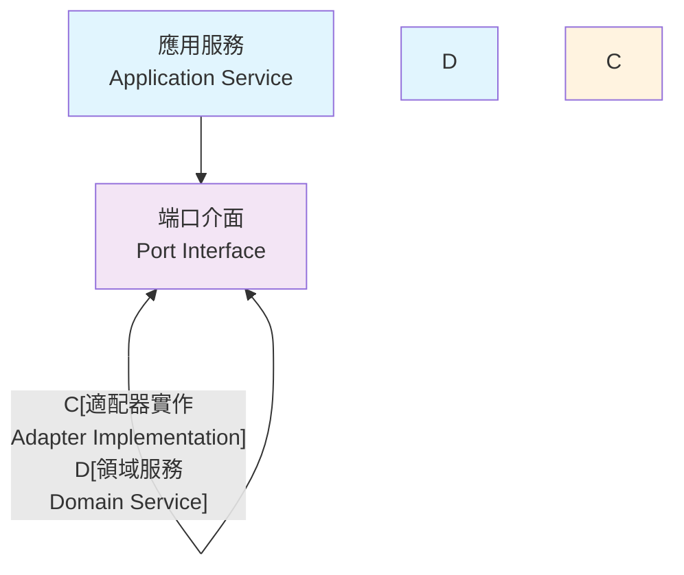

# 依賴反轉原則應用指南

## 概述

依賴反轉原則（Dependency Inversion Principle, DIP）是六角架構的核心原則之一。本指南說明如何在專案中正確應用依賴反轉原則。

## 依賴反轉原則

### 定義

1. **高層模組不應該依賴低層模組，兩者都應該依賴抽象**
2. **抽象不應該依賴細節，細節應該依賴抽象**

### 在六角架構中的體現



## 實作模式

### 1. 儲存庫模式的依賴反轉

#### 錯誤的依賴方向 ❌

```java
// 領域層直接依賴基礎設施層
@Service
public class OrderService {
    private final JpaOrderRepository jpaOrderRepository; // 直接依賴 JPA
    
    public void createOrder(Order order) {
        jpaOrderRepository.save(order); // 洩漏技術細節
    }
}
```

#### 正確的依賴反轉 ✅

```java
// 領域層定義抽象
public interface OrderRepository {
    void save(Order order);
    Optional<Order> findById(OrderId orderId);
    List<Order> findByCustomerId(CustomerId customerId);
}

// 領域服務依賴抽象
@Service
public class OrderService {
    private final OrderRepository orderRepository; // 依賴抽象
    
    public OrderService(OrderRepository orderRepository) {
        this.orderRepository = orderRepository;
    }
    
    public void createOrder(Order order) {
        orderRepository.save(order); // 使用領域語言
    }
}

// 基礎設施層實作抽象
@Repository
public class JpaOrderRepositoryAdapter implements OrderRepository {
    private final JpaOrderRepository jpaOrderRepository;
    private final OrderMapper orderMapper;
    
    @Override
    public void save(Order order) {
        JpaOrderEntity entity = orderMapper.toEntity(order);
        jpaOrderRepository.save(entity);
    }
    
    @Override
    public Optional<Order> findById(OrderId orderId) {
        return jpaOrderRepository.findById(orderId.getValue())
            .map(orderMapper::toDomain);
    }
}
```

### 2. 外部服務的依賴反轉

#### 端口定義（領域層）

```java
public interface PaymentServicePort {
    PaymentResult processPayment(PaymentRequest request);
    PaymentResult processRefund(RefundRequest request);
    PaymentStatus getPaymentStatus(PaymentId paymentId);
}

public interface NotificationServicePort {
    void sendOrderConfirmation(CustomerId customerId, OrderId orderId);
    void sendPaymentNotification(CustomerId customerId, PaymentResult result);
    void sendDeliveryUpdate(CustomerId customerId, DeliveryStatus status);
}
```

#### 應用服務使用端口

```java
@Service
@Transactional
public class OrderApplicationService {
    
    private final OrderRepository orderRepository;
    private final PaymentServicePort paymentServicePort;
    private final NotificationServicePort notificationServicePort;
    
    public OrderApplicationService(
            OrderRepository orderRepository,
            PaymentServicePort paymentServicePort,
            NotificationServicePort notificationServicePort) {
        this.orderRepository = orderRepository;
        this.paymentServicePort = paymentServicePort;
        this.notificationServicePort = notificationServicePort;
    }
    
    public OrderResponse processOrder(ProcessOrderCommand command) {
        // 1. 載入訂單
        Order order = orderRepository.findById(command.orderId())
            .orElseThrow(() -> new OrderNotFoundException(command.orderId()));
        
        // 2. 處理支付
        PaymentRequest paymentRequest = new PaymentRequest(
            order.getId(),
            order.getTotalAmount(),
            command.paymentMethod()
        );
        
        PaymentResult paymentResult = paymentServicePort.processPayment(paymentRequest);
        
        if (paymentResult.isSuccess()) {
            // 3. 更新訂單狀態
            order.markAsPaid(paymentResult.transactionId());
            orderRepository.save(order);
            
            // 4. 發送通知
            notificationServicePort.sendOrderConfirmation(
                order.getCustomerId(), 
                order.getId()
            );
        }
        
        return OrderResponse.from(order);
    }
}
```

#### 適配器實作（基礎設施層）

```java
@Component
public class ExternalPaymentServiceAdapter implements PaymentServicePort {
    
    private final PaymentGatewayClient paymentGatewayClient;
    private final PaymentMapper paymentMapper;
    
    public ExternalPaymentServiceAdapter(
            PaymentGatewayClient paymentGatewayClient,
            PaymentMapper paymentMapper) {
        this.paymentGatewayClient = paymentGatewayClient;
        this.paymentMapper = paymentMapper;
    }
    
    @Override
    public PaymentResult processPayment(PaymentRequest request) {
        try {
            // 轉換為外部系統格式
            ExternalPaymentRequest externalRequest = 
                paymentMapper.toExternalRequest(request);
            
            // 調用外部服務
            ExternalPaymentResponse externalResponse = 
                paymentGatewayClient.processPayment(externalRequest);
            
            // 轉換回內部格式
            return paymentMapper.toPaymentResult(externalResponse);
            
        } catch (ExternalServiceException e) {
            return PaymentResult.failure(e.getMessage());
        }
    }
}

@Component
public class EmailNotificationServiceAdapter implements NotificationServicePort {
    
    private final EmailService emailService;
    private final CustomerRepository customerRepository;
    
    @Override
    public void sendOrderConfirmation(CustomerId customerId, OrderId orderId) {
        Customer customer = customerRepository.findById(customerId)
            .orElseThrow(() -> new CustomerNotFoundException(customerId));
        
        EmailTemplate template = EmailTemplate.orderConfirmation()
            .withCustomerName(customer.getName().getValue())
            .withOrderId(orderId.getValue())
            .build();
        
        emailService.send(customer.getEmail().getValue(), template);
    }
}
```

### 3. 依賴注入配置

#### Spring Configuration

```java
@Configuration
public class ApplicationConfiguration {
    
    // 領域服務配置
    @Bean
    public OrderService orderService(OrderRepository orderRepository) {
        return new OrderService(orderRepository);
    }
    
    // 應用服務配置
    @Bean
    public OrderApplicationService orderApplicationService(
            OrderRepository orderRepository,
            PaymentServicePort paymentServicePort,
            NotificationServicePort notificationServicePort) {
        return new OrderApplicationService(
            orderRepository,
            paymentServicePort,
            notificationServicePort
        );
    }
}

@Configuration
public class InfrastructureConfiguration {
    
    // 儲存庫適配器
    @Bean
    public OrderRepository orderRepository(
            JpaOrderRepository jpaOrderRepository,
            OrderMapper orderMapper) {
        return new JpaOrderRepositoryAdapter(jpaOrderRepository, orderMapper);
    }
    
    // 外部服務適配器
    @Bean
    public PaymentServicePort paymentServicePort(
            PaymentGatewayClient paymentGatewayClient,
            PaymentMapper paymentMapper) {
        return new ExternalPaymentServiceAdapter(paymentGatewayClient, paymentMapper);
    }
    
    @Bean
    public NotificationServicePort notificationServicePort(
            EmailService emailService,
            CustomerRepository customerRepository) {
        return new EmailNotificationServiceAdapter(emailService, customerRepository);
    }
}
```

## 測試中的依賴反轉

### 單元測試

```java
@ExtendWith(MockitoExtension.class)
class OrderApplicationServiceTest {
    
    @Mock
    private OrderRepository orderRepository;
    
    @Mock
    private PaymentServicePort paymentServicePort;
    
    @Mock
    private NotificationServicePort notificationServicePort;
    
    @InjectMocks
    private OrderApplicationService orderApplicationService;
    
    @Test
    void should_process_order_successfully_when_payment_succeeds() {
        // Given
        Order order = createTestOrder();
        PaymentResult successfulPayment = PaymentResult.success("TXN-123");
        
        when(orderRepository.findById(order.getId())).thenReturn(Optional.of(order));
        when(paymentServicePort.processPayment(any(PaymentRequest.class)))
            .thenReturn(successfulPayment);
        
        ProcessOrderCommand command = new ProcessOrderCommand(
            order.getId(),
            PaymentMethod.CREDIT_CARD
        );
        
        // When
        OrderResponse response = orderApplicationService.processOrder(command);
        
        // Then
        assertThat(response.status()).isEqualTo(OrderStatus.PAID);
        verify(orderRepository).save(order);
        verify(notificationServicePort).sendOrderConfirmation(
            order.getCustomerId(), 
            order.getId()
        );
    }
}
```

### 整合測試

```java
@SpringBootTest
@TestConfiguration
class OrderApplicationServiceIntegrationTest {
    
    @MockBean
    private PaymentServicePort paymentServicePort;
    
    @MockBean
    private NotificationServicePort notificationServicePort;
    
    @Autowired
    private OrderApplicationService orderApplicationService;
    
    @Autowired
    private OrderRepository orderRepository;
    
    @Test
    @Transactional
    void should_integrate_with_real_database() {
        // Given
        Order order = createTestOrder();
        orderRepository.save(order);
        
        when(paymentServicePort.processPayment(any(PaymentRequest.class)))
            .thenReturn(PaymentResult.success("TXN-123"));
        
        ProcessOrderCommand command = new ProcessOrderCommand(
            order.getId(),
            PaymentMethod.CREDIT_CARD
        );
        
        // When
        OrderResponse response = orderApplicationService.processOrder(command);
        
        // Then
        assertThat(response.status()).isEqualTo(OrderStatus.PAID);
        
        // 驗證資料庫狀態
        Order savedOrder = orderRepository.findById(order.getId()).orElseThrow();
        assertThat(savedOrder.getStatus()).isEqualTo(OrderStatus.PAID);
    }
}
```

## 架構測試

使用 ArchUnit 驗證依賴方向：

```java
@ArchTest
static final ArchRule domain_should_not_depend_on_infrastructure =
    noClasses()
        .that().resideInAPackage("..domain..")
        .should().dependOnClassesThat()
        .resideInAPackage("..infrastructure..");

@ArchTest
static final ArchRule application_should_only_depend_on_domain_and_ports =
    classes()
        .that().resideInAPackage("..application..")
        .should().onlyDependOnClassesThat()
        .resideInAnyPackage("..domain..", "..application..", "java..", "org.springframework..");

@ArchTest
static final ArchRule ports_should_be_interfaces =
    classes()
        .that().resideInAPackage("..application..port..")
        .should().beInterfaces()
        .because("端口應該是介面，定義抽象契約");

@ArchTest
static final ArchRule adapters_should_implement_ports =
    classes()
        .that().resideInAPackage("..infrastructure..adapter..")
        .and().areNotInterfaces()
        .should().implement(JavaClass.Predicates.resideInAPackage("..application..port.."))
        .because("適配器應該實作端口介面");
```

## 最佳實踐

### 1. 端口設計原則

- **使用領域語言**：端口方法名稱應該反映業務意圖
- **避免技術洩漏**：端口不應該暴露技術實作細節
- **保持穩定**：端口介面應該相對穩定，避免頻繁變更

### 2. 適配器實作原則

- **單一職責**：每個適配器只負責一個外部系統的整合
- **協議轉換**：適配器負責內外部協議的轉換
- **錯誤處理**：適配器應該處理外部系統的異常並轉換為領域異常

### 3. 依賴注入最佳實踐

- **建構子注入**：優先使用建構子注入，確保依賴的不可變性
- **介面注入**：注入介面而非具體實作
- **配置分離**：將依賴配置與業務邏輯分離

### 4. 測試策略

- **模擬外部依賴**：在單元測試中模擬所有外部依賴
- **整合測試**：驗證適配器與外部系統的整合
- **架構測試**：使用 ArchUnit 確保依賴方向的正確性

通過正確應用依賴反轉原則，我們實現了：
- 業務邏輯與技術實作的分離
- 高度的可測試性
- 靈活的技術選擇
- 清晰的架構邊界