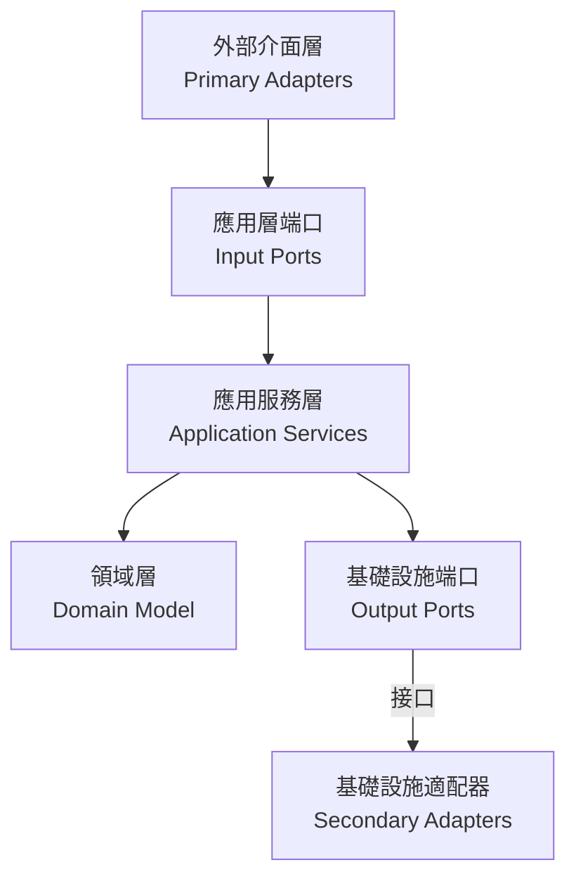

# Port-Adapter 模式實作指南

## 概述

本指南基於專案中的六角架構實作，提供 Port-Adapter 模式的設計原則、實作方式和最佳實踐。

## 架構概述

六角架構將應用程序分為三個主要部分：

1. **核心域（內部）**：包含業務邏輯和領域模型
2. **端口（中間層）**：定義與外部世界交互的接口
3. **適配器（外部）**：連接外部世界與應用程序核心



## 端口設計

### 輸入端口（Primary Ports）

定義系統對外提供的功能接口：

```java
public interface OrderManagementUseCase {
    
    OrderResponse createOrder(CreateOrderCommand command);
    
    OrderResponse addOrderItem(AddOrderItemCommand command);
    
    OrderResponse submitOrder(SubmitOrderCommand command);
    
    OrderResponse cancelOrder(CancelOrderCommand command);
    
    OrderResponse getOrder(OrderId orderId);
    
    List<OrderResponse> getOrdersByCustomer(CustomerId customerId);
}
```

### 輸出端口（Secondary Ports）

定義系統對外部資源的依賴接口：

```java
public interface OrderPersistencePort {
    
    void save(Order order);
    
    Optional<Order> findById(OrderId orderId);
    
    List<Order> findByCustomerId(CustomerId customerId);
    
    void delete(OrderId orderId);
}

public interface PaymentServicePort {
    
    PaymentResult processPayment(UUID orderId, Money amount);
    
    PaymentResult processRefund(UUID orderId, Money amount);
    
    PaymentStatus getPaymentStatus(UUID orderId);
}

public interface LogisticsServicePort {
    
    DeliveryResult scheduleDelivery(DeliveryRequest request);
    
    DeliveryStatus getDeliveryStatus(String deliveryId);
    
    void cancelDelivery(String deliveryId);
}
```

## 適配器實作

### 主級適配器（Primary/Driving Adapters）

處理外部請求並轉發給應用核心：

```java
@RestController
@RequestMapping("/api/v1/orders")
public class OrderController {
    
    private final OrderManagementUseCase orderManagementUseCase;
    
    public OrderController(OrderManagementUseCase orderManagementUseCase) {
        this.orderManagementUseCase = orderManagementUseCase;
    }
    
    @PostMapping
    public ResponseEntity<OrderResponse> createOrder(
            @Valid @RequestBody CreateOrderRequestDto request) {
        
        CreateOrderCommand command = new CreateOrderCommand(
            CustomerId.of(request.customerId()),
            request.items().stream()
                .map(item -> new OrderItem(
                    ProductId.of(item.productId()),
                    item.quantity(),
                    Money.twd(item.unitPrice())
                ))
                .toList()
        );
        
        OrderResponse response = orderManagementUseCase.createOrder(command);
        return ResponseEntity.ok(response);
    }
    
    @PostMapping("/{orderId}/items")
    public ResponseEntity<OrderResponse> addOrderItem(
            @PathVariable String orderId,
            @Valid @RequestBody AddOrderItemRequestDto request) {
        
        AddOrderItemCommand command = new AddOrderItemCommand(
            OrderId.of(orderId),
            ProductId.of(request.productId()),
            request.quantity(),
            Money.twd(request.unitPrice())
        );
        
        OrderResponse response = orderManagementUseCase.addOrderItem(command);
        return ResponseEntity.ok(response);
    }
}
```

### 次級適配器（Secondary/Driven Adapters）

實作輸出端口，連接外部系統：

```java
@Component
public class OrderRepositoryAdapter implements OrderPersistencePort {
    
    private final JpaOrderRepository jpaOrderRepository;
    private final OrderMapper orderMapper;
    
    public OrderRepositoryAdapter(JpaOrderRepository jpaOrderRepository, 
                                 OrderMapper orderMapper) {
        this.jpaOrderRepository = jpaOrderRepository;
        this.orderMapper = orderMapper;
    }
    
    @Override
    public void save(Order order) {
        JpaOrderEntity entity = orderMapper.toEntity(order);
        jpaOrderRepository.save(entity);
    }
    
    @Override
    public Optional<Order> findById(OrderId orderId) {
        return jpaOrderRepository.findById(orderId.getValue())
            .map(orderMapper::toDomain);
    }
    
    @Override
    public List<Order> findByCustomerId(CustomerId customerId) {
        return jpaOrderRepository.findByCustomerId(customerId.getValue())
            .stream()
            .map(orderMapper::toDomain)
            .toList();
    }
}

@Component
public class ExternalPaymentAdapter implements PaymentServicePort {
    
    private final PaymentGatewayClient paymentGatewayClient;
    
    public ExternalPaymentAdapter(PaymentGatewayClient paymentGatewayClient) {
        this.paymentGatewayClient = paymentGatewayClient;
    }
    
    @Override
    public PaymentResult processPayment(UUID orderId, Money amount) {
        try {
            PaymentRequest request = new PaymentRequest(
                orderId.toString(),
                amount.amount(),
                amount.currency().getCode()
            );
            
            PaymentResponse response = paymentGatewayClient.processPayment(request);
            
            return new PaymentResult(
                response.isSuccess(),
                response.getTransactionId(),
                response.getMessage()
            );
        } catch (Exception e) {
            return new PaymentResult(false, null, e.getMessage());
        }
    }
}
```

## 應用服務實作

協調領域對象和外部資源的交互：

```java
@Service
@Transactional
public class OrderApplicationService implements OrderManagementUseCase {
    
    private final OrderRepository orderRepository;
    private final OrderPersistencePort orderPersistencePort;
    private final PaymentServicePort paymentServicePort;
    private final LogisticsServicePort logisticsServicePort;
    private final DomainEventPublisher domainEventPublisher;
    
    public OrderApplicationService(
            OrderRepository orderRepository,
            OrderPersistencePort orderPersistencePort,
            PaymentServicePort paymentServicePort,
            LogisticsServicePort logisticsServicePort,
            DomainEventPublisher domainEventPublisher) {
        this.orderRepository = orderRepository;
        this.orderPersistencePort = orderPersistencePort;
        this.paymentServicePort = paymentServicePort;
        this.logisticsServicePort = logisticsServicePort;
        this.domainEventPublisher = domainEventPublisher;
    }
    
    @Override
    public OrderResponse createOrder(CreateOrderCommand command) {
        // 1. 創建訂單聚合根
        Order order = Order.create(
            OrderId.generate(),
            command.customerId(),
            command.items()
        );
        
        // 2. 保存訂單
        orderPersistencePort.save(order);
        
        // 3. 發布領域事件
        domainEventPublisher.publishEventsFromAggregate(order);
        
        // 4. 返回響應
        return OrderResponse.from(order);
    }
    
    @Override
    public OrderResponse submitOrder(SubmitOrderCommand command) {
        // 1. 載入訂單
        Order order = orderRepository.findById(command.orderId())
            .orElseThrow(() -> new OrderNotFoundException(command.orderId()));
        
        // 2. 提交訂單
        order.submit();
        
        // 3. 保存訂單
        orderPersistencePort.save(order);
        
        // 4. 發布領域事件
        domainEventPublisher.publishEventsFromAggregate(order);
        
        return OrderResponse.from(order);
    }
}
```

## 防腐層（Anti-Corruption Layer）

隔離外部系統的差異和複雜性：

```java
@Component
public class LogisticsAntiCorruptionLayer {
    
    private final ExternalLogisticsClient externalLogisticsClient;
    
    public LogisticsAntiCorruptionLayer(ExternalLogisticsClient externalLogisticsClient) {
        this.externalLogisticsClient = externalLogisticsClient;
    }
    
    public DeliveryResult scheduleDelivery(DeliveryRequest request) {
        // 轉換內部模型到外部系統格式
        ExternalDeliveryRequest externalRequest = convertToExternalFormat(request);
        
        try {
            ExternalDeliveryResponse externalResponse = 
                externalLogisticsClient.scheduleDelivery(externalRequest);
            
            // 轉換外部響應到內部模型
            return convertToInternalFormat(externalResponse);
        } catch (ExternalSystemException e) {
            // 處理外部系統異常
            throw new LogisticsServiceException("配送服務暫時不可用", e);
        }
    }
    
    private ExternalDeliveryRequest convertToExternalFormat(DeliveryRequest request) {
        return ExternalDeliveryRequest.builder()
            .orderId(request.orderId().getValue())
            .recipientName(request.recipientName())
            .address(formatAddress(request.address()))
            .phoneNumber(request.phoneNumber())
            .build();
    }
    
    private DeliveryResult convertToInternalFormat(ExternalDeliveryResponse response) {
        return new DeliveryResult(
            response.isSuccess(),
            response.getDeliveryId(),
            mapToInternalStatus(response.getStatus()),
            response.getMessage()
        );
    }
}
```

## 依賴注入配置

```java
@Configuration
public class HexagonalArchitectureConfiguration {
    
    @Bean
    public OrderManagementUseCase orderManagementUseCase(
            OrderRepository orderRepository,
            OrderPersistencePort orderPersistencePort,
            PaymentServicePort paymentServicePort,
            LogisticsServicePort logisticsServicePort,
            DomainEventPublisher domainEventPublisher) {
        return new OrderApplicationService(
            orderRepository,
            orderPersistencePort,
            paymentServicePort,
            logisticsServicePort,
            domainEventPublisher
        );
    }
    
    @Bean
    public OrderPersistencePort orderPersistencePort(
            JpaOrderRepository jpaOrderRepository,
            OrderMapper orderMapper) {
        return new OrderRepositoryAdapter(jpaOrderRepository, orderMapper);
    }
    
    @Bean
    public PaymentServicePort paymentServicePort(PaymentGatewayClient paymentGatewayClient) {
        return new ExternalPaymentAdapter(paymentGatewayClient);
    }
}
```

## 測試策略

### 端口測試

```java
@ExtendWith(MockitoExtension.class)
class OrderApplicationServiceTest {
    
    @Mock
    private OrderRepository orderRepository;
    
    @Mock
    private OrderPersistencePort orderPersistencePort;
    
    @Mock
    private PaymentServicePort paymentServicePort;
    
    @Mock
    private DomainEventPublisher domainEventPublisher;
    
    @InjectMocks
    private OrderApplicationService orderApplicationService;
    
    @Test
    void should_create_order_successfully() {
        // Given
        CreateOrderCommand command = new CreateOrderCommand(
            CustomerId.of("CUST-001"),
            List.of(new OrderItem(ProductId.of("PROD-001"), 2, Money.twd(100)))
        );
        
        // When
        OrderResponse response = orderApplicationService.createOrder(command);
        
        // Then
        assertThat(response).isNotNull();
        assertThat(response.customerId()).isEqualTo("CUST-001");
        verify(orderPersistencePort).save(any(Order.class));
        verify(domainEventPublisher).publishEventsFromAggregate(any(Order.class));
    }
}
```

### 適配器測試

```java
@DataJpaTest
class OrderRepositoryAdapterTest {
    
    @Autowired
    private TestEntityManager entityManager;
    
    @Autowired
    private JpaOrderRepository jpaOrderRepository;
    
    private OrderRepositoryAdapter orderRepositoryAdapter;
    private OrderMapper orderMapper;
    
    @BeforeEach
    void setUp() {
        orderMapper = new OrderMapper();
        orderRepositoryAdapter = new OrderRepositoryAdapter(jpaOrderRepository, orderMapper);
    }
    
    @Test
    void should_save_and_find_order() {
        // Given
        Order order = createTestOrder();
        
        // When
        orderRepositoryAdapter.save(order);
        Optional<Order> foundOrder = orderRepositoryAdapter.findById(order.getId());
        
        // Then
        assertThat(foundOrder).isPresent();
        assertThat(foundOrder.get().getId()).isEqualTo(order.getId());
    }
}
```

## 最佳實踐

1. **端口設計原則**
   - 端口應該表達業務意圖，而非技術實作
   - 使用領域語言定義端口方法
   - 避免洩漏技術細節到端口定義中

2. **適配器實作原則**
   - 適配器只負責協議轉換，不包含業務邏輯
   - 使用防腐層隔離外部系統的複雜性
   - 適配器應該是可替換的

3. **依賴方向控制**
   - 依賴始終指向內部（領域層）
   - 使用依賴注入實現依賴倒置
   - 避免領域層依賴基礎設施層

4. **測試策略**
   - 端口可以獨立測試，使用模擬的適配器
   - 適配器測試專注於協議轉換的正確性
   - 整合測試驗證端口和適配器的協作

這種架構設計確保了業務邏輯的獨立性、系統的可測試性和技術選擇的靈活性。