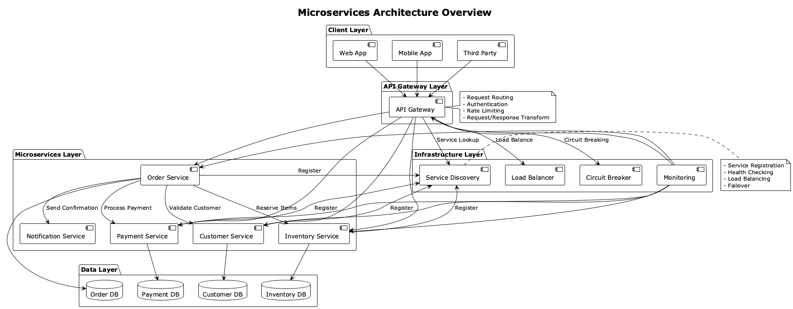
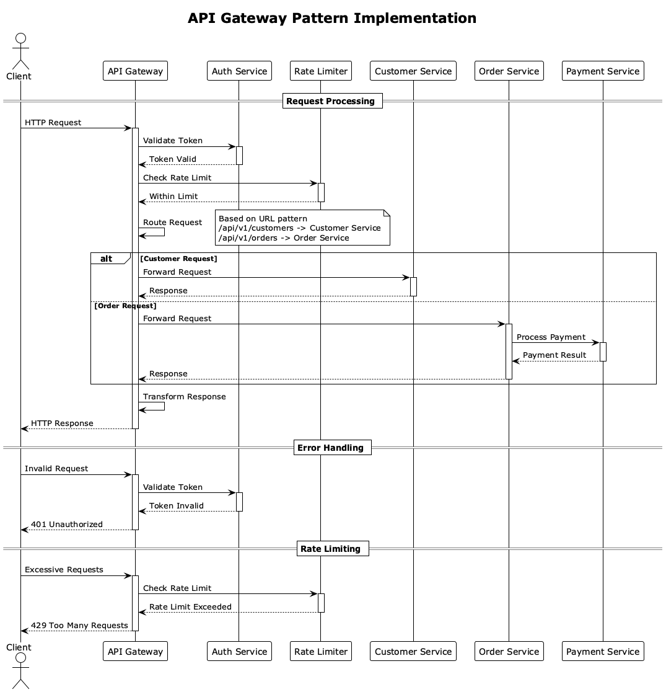
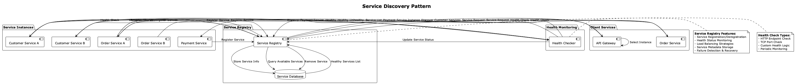
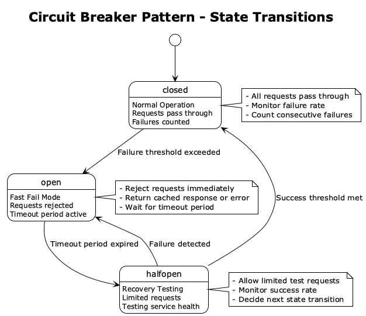
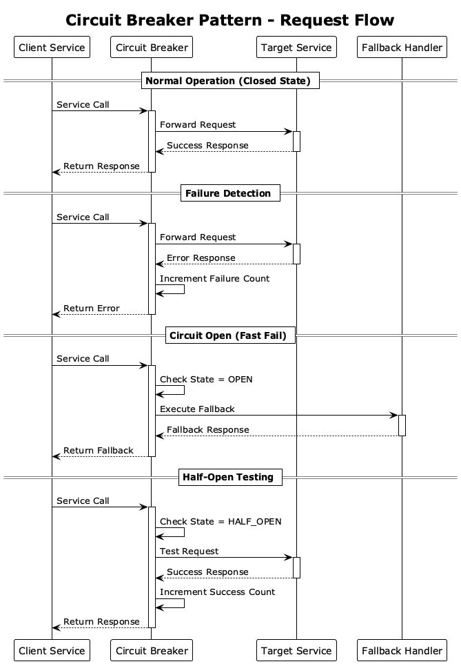

# 微服務架構模式

## 概覽

本文檔提供微服務架構模式的完整實作指南，涵蓋 API Gateway、Service Discovery、Load Balancer、Circuit Breaker 和分散式追蹤等核心組件的設計和實作。



*微服務架構總覽圖展示了各個組件之間的關係和數據流向*

## 微服務架構原則

### 核心原則

1. **單一職責原則**：每個微服務負責單一業務功能
2. **去中心化治理**：每個服務團隊自主決策技術棧和部署策略
3. **故障隔離**：服務間故障不應相互影響
4. **數據獨立性**：每個服務管理自己的數據存儲
5. **API 優先設計**：通過明確定義的 API 進行服務間通信

### 服務邊界設計

```java
// 基於 DDD Bounded Context 定義服務邊界
@Service
@BoundedContext("Customer")
public class CustomerService {
    // 客戶相關的所有業務邏輯
}

@Service
@BoundedContext("Order")
public class OrderService {
    // 訂單相關的所有業務邏輯
}

@Service
@BoundedContext("Payment")
public class PaymentService {
    // 支付相關的所有業務邏輯
}
```

## 微服務組件架構

### 1. API Gateway 模式

API Gateway 作為所有客戶端請求的統一入口點，提供路由、認證、限流等功能。



*API Gateway 請求處理流程，包括認證、限流和路由機制*

#### 核心功能
- **請求路由**：將請求路由到適當的後端服務
- **認證授權**：統一的身份驗證和授權
- **限流控制**：防止服務過載
- **請求/響應轉換**：協議轉換和數據格式化
- **監控和日誌**：統一的請求追蹤和監控

#### 實作範例

詳細的 API Gateway 配置和實作請參考：
- [API Gateway 路由配置](api-gateway.md)
- [認證和授權機制](authentication-authorization.md)
- [限流和熔斷配置](rate-limiting.md)

### 2. Service Discovery 模式

Service Discovery 提供服務註冊和發現機制，讓服務能夠動態找到和通信。



*Service Discovery 完整流程，包括服務註冊、健康檢查和服務發現*

#### 核心功能
- **服務註冊**：服務啟動時自動註冊
- **服務發現**：客戶端動態發現可用服務
- **健康檢查**：監控服務健康狀態
- **負載均衡**：在多個服務實例間分配請求

#### 實作範例

詳細的 Service Discovery 配置請參考：
- [服務註冊與發現](service-discovery.md)
- [健康檢查配置](health-checks.md)

### 3. Load Balancer 模式

Load Balancer 在多個服務實例間分配請求，提高系統可用性和性能。

#### 負載均衡策略
- **Round Robin**：輪詢分配
- **Weighted Round Robin**：加權輪詢
- **Least Connections**：最少連接數
- **IP Hash**：基於客戶端 IP 的一致性哈希

#### 實作範例

詳細的 Load Balancer 配置請參考：
- [負載均衡策略](load-balancing.md)
- [AWS Application Load Balancer 配置](aws-alb-config.md)

### 4. Circuit Breaker 模式

Circuit Breaker 提供故障隔離和自動恢復機制，防止級聯故障。



*Circuit Breaker 的三種狀態及其轉換條件*



*Circuit Breaker 在不同狀態下的請求處理流程*

#### 狀態管理
- **Closed**：正常狀態，請求正常通過
- **Open**：故障狀態，快速失敗
- **Half-Open**：恢復測試狀態

#### 實作範例

詳細的 Circuit Breaker 實作請參考：
- [斷路器模式實作](circuit-breaker.md)
- [故障恢復策略](fault-recovery.md)

### 5. 分散式追蹤

分散式追蹤提供跨服務的請求追蹤和性能監控。

#### 核心概念
- **Trace**：完整的請求鏈路
- **Span**：單個操作的執行時間
- **Context Propagation**：追蹤上下文傳播

#### 實作範例

詳細的分散式追蹤配置請參考：
- [分散式追蹤實作](distributed-tracing.md)
- [AWS X-Ray 整合](aws-xray-integration.md)

## 微服務通信模式

### 同步通信

#### REST API
```java
@RestController
@RequestMapping("/api/v1/orders")
public class OrderController {
    
    private final CustomerServiceClient customerServiceClient;
    private final PaymentServiceClient paymentServiceClient;
    
    @PostMapping
    public ResponseEntity<OrderResponse> createOrder(@RequestBody CreateOrderRequest request) {
        // 同步調用客戶服務驗證客戶
        Customer customer = customerServiceClient.getCustomer(request.getCustomerId());
        
        // 同步調用支付服務處理支付
        PaymentResult payment = paymentServiceClient.processPayment(request.getPaymentInfo());
        
        // 創建訂單
        Order order = orderService.createOrder(request, customer, payment);
        
        return ResponseEntity.ok(OrderResponse.from(order));
    }
}
```

#### GraphQL Federation
```java
@Component
public class OrderDataFetcher implements DataFetcher<Order> {
    
    @Override
    public Order get(DataFetchingEnvironment environment) {
        String orderId = environment.getArgument("id");
        return orderService.findById(orderId);
    }
}
```

### 異步通信

#### 事件驅動架構
```java
@Component
public class OrderEventHandler {
    
    @EventListener
    @Async
    public void handleOrderCreated(OrderCreatedEvent event) {
        // 異步處理訂單創建事件
        inventoryService.reserveItems(event.getOrderItems());
        notificationService.sendOrderConfirmation(event.getCustomerId(), event.getOrderId());
    }
}
```

#### 消息隊列
```java
@Component
public class OrderMessageProducer {
    
    private final RabbitTemplate rabbitTemplate;
    
    public void publishOrderCreated(OrderCreatedEvent event) {
        rabbitTemplate.convertAndSend("order.exchange", "order.created", event);
    }
}
```

## 數據管理模式

### Database per Service

每個微服務管理自己的數據庫，確保數據獨立性。

```java
// 客戶服務的數據庫配置
@Configuration
@EnableJpaRepositories(
    basePackages = "com.example.customer.repository",
    entityManagerFactoryRef = "customerEntityManagerFactory",
    transactionManagerRef = "customerTransactionManager"
)
public class CustomerDatabaseConfig {
    
    @Bean
    @Primary
    @ConfigurationProperties("spring.datasource.customer")
    public DataSource customerDataSource() {
        return DataSourceBuilder.create().build();
    }
}
```

### Saga 模式

跨服務的分散式事務管理，詳細實作請參考：
- [Saga 編排模式](../saga-patterns/orchestration.md)
- [Saga 編舞模式](../saga-patterns/choreography.md)

### CQRS 模式

命令查詢責任分離，優化讀寫性能。

```java
// 命令端
@Component
public class OrderCommandHandler {
    
    public void handle(CreateOrderCommand command) {
        Order order = new Order(command);
        orderRepository.save(order);
        eventPublisher.publish(new OrderCreatedEvent(order));
    }
}

// 查詢端
@Component
public class OrderQueryHandler {
    
    public OrderView getOrderView(String orderId) {
        return orderViewRepository.findById(orderId);
    }
}
```

## 安全模式

### 服務間認證

#### JWT Token 驗證
```java
@Component
public class ServiceAuthenticationFilter implements Filter {
    
    @Override
    public void doFilter(ServletRequest request, ServletResponse response, FilterChain chain) {
        HttpServletRequest httpRequest = (HttpServletRequest) request;
        String token = extractToken(httpRequest);
        
        if (isValidServiceToken(token)) {
            chain.doFilter(request, response);
        } else {
            ((HttpServletResponse) response).setStatus(HttpStatus.UNAUTHORIZED.value());
        }
    }
}
```

#### mTLS (Mutual TLS)
```yaml
# application.yml
server:
  ssl:
    enabled: true
    client-auth: need
    key-store: classpath:service-keystore.p12
    key-store-password: ${SERVICE_KEYSTORE_PASSWORD}
    trust-store: classpath:service-truststore.p12
    trust-store-password: ${SERVICE_TRUSTSTORE_PASSWORD}
```

### API Gateway 安全

#### OAuth 2.0 整合
```java
@Configuration
@EnableWebSecurity
public class GatewaySecurityConfig {
    
    @Bean
    public SecurityFilterChain filterChain(HttpSecurity http) throws Exception {
        http.oauth2ResourceServer(oauth2 -> oauth2
            .jwt(jwt -> jwt
                .jwtAuthenticationConverter(jwtAuthenticationConverter())
            )
        );
        return http.build();
    }
}
```

## 監控和可觀測性

### 指標收集

#### 業務指標
```java
@Component
public class OrderMetrics {
    
    private final Counter ordersCreated;
    private final Timer orderProcessingTime;
    private final Gauge activeOrders;
    
    public OrderMetrics(MeterRegistry meterRegistry) {
        this.ordersCreated = Counter.builder("orders.created")
            .description("Total orders created")
            .register(meterRegistry);
            
        this.orderProcessingTime = Timer.builder("orders.processing.time")
            .description("Order processing time")
            .register(meterRegistry);
            
        this.activeOrders = Gauge.builder("orders.active")
            .description("Active orders count")
            .register(meterRegistry, this, OrderMetrics::getActiveOrderCount);
    }
}
```

#### 技術指標
```java
@Component
public class ServiceHealthIndicator implements HealthIndicator {
    
    @Override
    public Health health() {
        try {
            // 檢查數據庫連接
            checkDatabaseConnection();
            
            // 檢查外部服務依賴
            checkExternalDependencies();
            
            return Health.up()
                .withDetail("database", "UP")
                .withDetail("external-services", "UP")
                .build();
                
        } catch (Exception e) {
            return Health.down()
                .withDetail("error", e.getMessage())
                .build();
        }
    }
}
```

### 日誌聚合

#### 結構化日誌
```java
@Component
public class OrderService {
    
    private final Logger logger = LoggerFactory.getLogger(OrderService.class);
    
    public Order createOrder(CreateOrderCommand command) {
        logger.info("Creating order",
            kv("customerId", command.getCustomerId()),
            kv("orderValue", command.getTotalAmount()),
            kv("itemCount", command.getItems().size()));
            
        try {
            Order order = processOrder(command);
            
            logger.info("Order created successfully",
                kv("orderId", order.getId()),
                kv("processingTimeMs", order.getProcessingTime()));
                
            return order;
            
        } catch (Exception e) {
            logger.error("Order creation failed",
                kv("customerId", command.getCustomerId()),
                kv("error", e.getMessage()),
                e);
            throw e;
        }
    }
}
```

## 部署和運維

### 容器化部署

#### Dockerfile 範例
```dockerfile
FROM openjdk:21-jre-slim

WORKDIR /app

COPY target/order-service.jar app.jar

EXPOSE 8080

HEALTHCHECK --interval=30s --timeout=3s --start-period=5s --retries=3 \
  CMD curl -f http://localhost:8080/actuator/health || exit 1

ENTRYPOINT ["java", "-jar", "app.jar"]
```

#### Kubernetes 部署
```yaml
apiVersion: apps/v1
kind: Deployment
metadata:
  name: order-service
spec:
  replicas: 3
  selector:
    matchLabels:
      app: order-service
  template:
    metadata:
      labels:
        app: order-service
    spec:
      containers:
      - name: order-service
        image: order-service:latest
        ports:
        - containerPort: 8080
        env:
        - name: SPRING_PROFILES_ACTIVE
          value: "production"
        livenessProbe:
          httpGet:
            path: /actuator/health/liveness
            port: 8080
          initialDelaySeconds: 30
          periodSeconds: 10
        readinessProbe:
          httpGet:
            path: /actuator/health/readiness
            port: 8080
          initialDelaySeconds: 10
          periodSeconds: 5
```

### 服務網格

#### Istio 配置
```yaml
apiVersion: networking.istio.io/v1alpha3
kind: VirtualService
metadata:
  name: order-service
spec:
  http:
  - match:
    - uri:
        prefix: /api/v1/orders
    route:
    - destination:
        host: order-service
        subset: v1
      weight: 90
    - destination:
        host: order-service
        subset: v2
      weight: 10
    fault:
      delay:
        percentage:
          value: 0.1
        fixedDelay: 5s
```

## 最佳實踐

### 設計原則

1. **API 版本管理**：使用語義化版本控制
2. **向後兼容性**：保持 API 向後兼容
3. **冪等性設計**：確保操作可重複執行
4. **超時和重試**：合理設置超時和重試策略
5. **優雅降級**：提供降級方案

### 開發實踐

1. **契約測試**：使用 Pact 進行服務間契約測試
2. **混沌工程**：定期進行故障注入測試
3. **性能測試**：持續進行負載和壓力測試
4. **安全掃描**：定期進行安全漏洞掃描
5. **依賴管理**：及時更新和管理依賴版本

### 運維實踐

1. **自動化部署**：使用 CI/CD 管道自動化部署
2. **藍綠部署**：零停機時間部署
3. **金絲雀發布**：漸進式功能發布
4. **監控告警**：完善的監控和告警機制
5. **災難恢復**：制定和測試災難恢復計劃

## 相關文檔

- [API Gateway 詳細配置](api-gateway.md)
- [Service Discovery 實作](service-discovery.md)
- [Load Balancer 配置](load-balancing.md)
- [Circuit Breaker 實作](circuit-breaker.md)
- [分散式追蹤配置](distributed-tracing.md)
- [Saga 模式實作](../saga-patterns/README.md)
- [DDD 戰術模式](../ddd-patterns/tactical-patterns.md)
- [六角架構設計](../hexagonal-architecture/README.md)

## 工具和技術棧

### 核心技術
- **Spring Boot 3.4.5**：微服務框架
- **Spring Cloud Gateway**：API Gateway
- **Eureka/Consul**：Service Discovery
- **Ribbon/LoadBalancer**：客戶端負載均衡
- **Hystrix/Resilience4j**：Circuit Breaker
- **Sleuth/Zipkin**：分散式追蹤

### 基礎設施
- **Kubernetes**：容器編排
- **Istio**：服務網格
- **AWS Application Load Balancer**：負載均衡
- **AWS X-Ray**：分散式追蹤
- **Prometheus + Grafana**：監控和可視化
- **ELK Stack**：日誌聚合和分析

這個微服務架構模式指南提供了完整的設計和實作參考，確保系統的可擴展性、可靠性和可維護性。