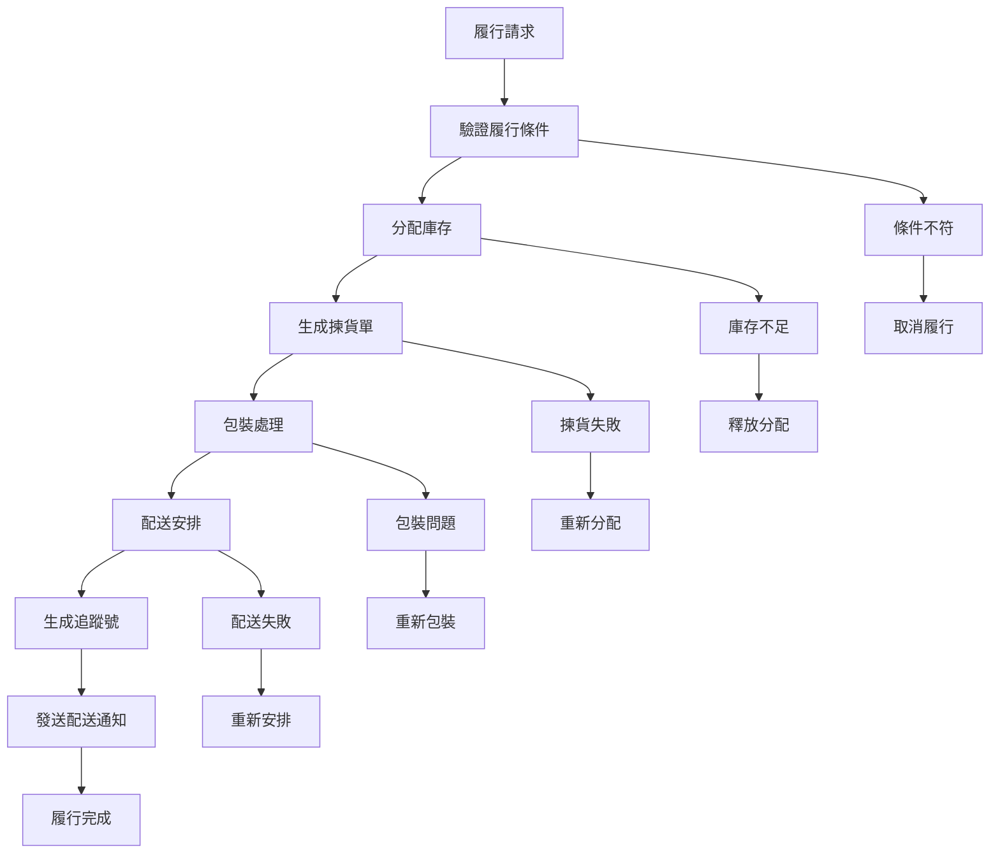
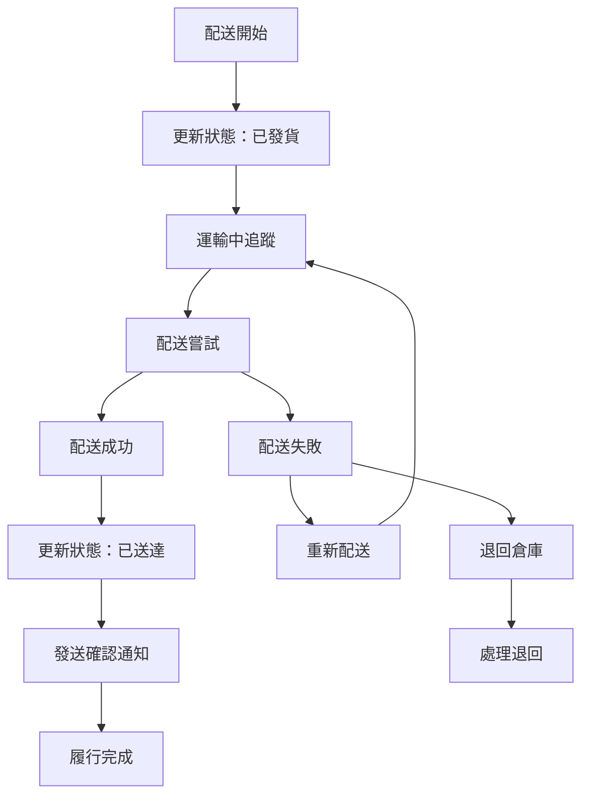

# FulfillmentSaga 實作指南

## 概述

FulfillmentSaga 負責協調訂單履行的完整流程，包括庫存分配、包裝、配送安排、追蹤更新等。本指南詳細說明其設計模式、實作方法和最佳實踐。

## 📦 履行業務流程

### 標準履行流程



### 配送追蹤流程



## 🏗️ 實作架構

### 核心組件

```java
@Component
@Slf4j
public class FulfillmentSaga {
    
    private final FulfillmentService fulfillmentService;
    private final InventoryService inventoryService;
    private final WarehouseService warehouseService;
    private final ShippingService shippingService;
    private final TrackingService trackingService;
    private final NotificationService notificationService;
    private final FulfillmentStateManager stateManager;
    private final EventPublisher eventPublisher;
    
    public FulfillmentSaga(FulfillmentService fulfillmentService,
                          InventoryService inventoryService,
                          WarehouseService warehouseService,
                          ShippingService shippingService,
                          TrackingService trackingService,
                          NotificationService notificationService,
                          FulfillmentStateManager stateManager,
                          EventPublisher eventPublisher) {
        this.fulfillmentService = fulfillmentService;
        this.inventoryService = inventoryService;
        this.warehouseService = warehouseService;
        this.shippingService = shippingService;
        this.trackingService = trackingService;
        this.notificationService = notificationService;
        this.stateManager = stateManager;
        this.eventPublisher = eventPublisher;
    }
}
```

### 履行狀態管理

```java
@Entity
@Table(name = "fulfillment_saga_state")
public class FulfillmentSagaState {
    
    @Id
    private String fulfillmentId;
    
    private String orderId;
    private String customerId;
    private String warehouseId;
    
    @Enumerated(EnumType.STRING)
    private FulfillmentSagaStatus status;
    
    private String currentStep;
    
    @ElementCollection
    @CollectionTable(name = "fulfillment_items")
    private List<FulfillmentItem> items = new ArrayList<>();
    
    private String pickingListId;
    private String packageId;
    private String shippingId;
    private String trackingNumber;
    
    private LocalDateTime startedAt;
    private LocalDateTime lastUpdatedAt;
    private LocalDateTime completedAt;
    
    @ElementCollection
    @CollectionTable(name = "fulfillment_saga_steps")
    private List<FulfillmentStepRecord> completedSteps = new ArrayList<>();
    
    @Column(columnDefinition = "TEXT")
    private String compensationData; // JSON 格式的補償資料
    
    public void addCompletedStep(String stepName, String stepData) {
        completedSteps.add(new FulfillmentStepRecord(
            stepName, 
            stepData, 
            LocalDateTime.now()
        ));
        this.lastUpdatedAt = LocalDateTime.now();
    }
    
    public boolean hasCompletedStep(String stepName) {
        return completedSteps.stream()
            .anyMatch(step -> step.getStepName().equals(stepName));
    }
    
    public boolean isCompensatable() {
        return status == FulfillmentSagaStatus.INVENTORY_ALLOCATED || 
               status == FulfillmentSagaStatus.PICKED ||
               status == FulfillmentSagaStatus.PACKAGED ||
               status == FulfillmentSagaStatus.SHIPPED;
    }
}

public enum FulfillmentSagaStatus {
    STARTED,
    VALIDATING,
    INVENTORY_ALLOCATING,
    INVENTORY_ALLOCATED,
    PICKING,
    PICKED,
    PACKAGING,
    PACKAGED,
    SHIPPING,
    SHIPPED,
    IN_TRANSIT,
    DELIVERED,
    COMPENSATING,
    COMPENSATED,
    FAILED
}
```

## 📝 詳細實作

### 1. 履行請求處理

```java
@TransactionalEventListener(phase = TransactionPhase.AFTER_COMMIT)
@Order(1)
public void handleFulfillmentRequested(FulfillmentRequested event) {
    log.info("Starting fulfillment saga for order: {}", event.getOrderId());
    
    try {
        // 初始化履行 Saga 狀態
        FulfillmentSagaState sagaState = new FulfillmentSagaState(
            event.getFulfillmentId(),
            event.getOrderId(),
            event.getCustomerId(),
            FulfillmentSagaStatus.STARTED,
            "FULFILLMENT_VALIDATION"
        );
        
        // 設置履行項目
        sagaState.setItems(event.getItems().stream()
            .map(item -> new FulfillmentItem(
                item.getProductId(),
                item.getQuantity(),
                item.getWarehouseLocation()
            ))
            .collect(Collectors.toList()));
        
        stateManager.save(sagaState);
        
        // 步驟 1: 驗證履行條件
        validateFulfillmentConditions(event);
        
    } catch (Exception e) {
        log.error("Failed to start fulfillment saga for order: {}", event.getOrderId(), e);
        handleFulfillmentFailure(event.getFulfillmentId(), "FULFILLMENT_VALIDATION", e);
    }
}

private void validateFulfillmentConditions(FulfillmentRequested event) {
    log.info("Validating fulfillment conditions for fulfillment: {}", event.getFulfillmentId());
    
    try {
        // 驗證訂單狀態
        if (!fulfillmentService.isOrderReadyForFulfillment(event.getOrderId())) {
            throw new OrderNotReadyException("Order is not ready for fulfillment");
        }
        
        // 驗證配送地址
        if (!fulfillmentService.isValidShippingAddress(event.getShippingAddress())) {
            throw new InvalidShippingAddressException("Invalid shipping address");
        }
        
        // 選擇最佳倉庫
        String warehouseId = warehouseService.selectOptimalWarehouse(
            event.getItems(), 
            event.getShippingAddress()
        );
        
        if (warehouseId == null) {
            throw new NoAvailableWarehouseException("No warehouse available for fulfillment");
        }
        
        // 驗證成功，更新狀態
        FulfillmentSagaState sagaState = stateManager.findByFulfillmentId(event.getFulfillmentId());
        sagaState.setStatus(FulfillmentSagaStatus.VALIDATING);
        sagaState.setCurrentStep("INVENTORY_ALLOCATION");
        sagaState.setWarehouseId(warehouseId);
        sagaState.addCompletedStep("FULFILLMENT_VALIDATION", 
            "Warehouse selected: " + warehouseId);
        stateManager.save(sagaState);
        
        log.info("Fulfillment validation completed for fulfillment: {}", event.getFulfillmentId());
        
        // 觸發庫存分配
        allocateInventory(event.getFulfillmentId());
        
    } catch (Exception e) {
        log.error("Fulfillment validation failed for fulfillment: {}", event.getFulfillmentId(), e);
        handleFulfillmentFailure(event.getFulfillmentId(), "FULFILLMENT_VALIDATION", e);
    }
}
```

### 2. 庫存分配

```java
private void allocateInventory(String fulfillmentId) {
    log.info("Allocating inventory for fulfillment: {}", fulfillmentId);
    
    try {
        FulfillmentSagaState sagaState = stateManager.findByFulfillmentId(fulfillmentId);
        
        // 分配庫存
        InventoryAllocationRequest request = InventoryAllocationRequest.builder()
            .fulfillmentId(fulfillmentId)
            .warehouseId(sagaState.getWarehouseId())
            .items(sagaState.getItems())
            .build();
        
        InventoryAllocationResult result = inventoryService.allocateInventory(request);
        
        if (result.isSuccess()) {
            handleInventoryAllocationSuccess(fulfillmentId, result);
        } else {
            handleInventoryAllocationFailure(fulfillmentId, result.getFailureReason());
        }
        
    } catch (Exception e) {
        log.error("Inventory allocation failed for fulfillment: {}", fulfillmentId, e);
        handleFulfillmentFailure(fulfillmentId, "INVENTORY_ALLOCATION", e);
    }
}

private void handleInventoryAllocationSuccess(String fulfillmentId, InventoryAllocationResult result) {
    log.info("Inventory allocated successfully for fulfillment: {}", fulfillmentId);
    
    // 更新 Saga 狀態
    FulfillmentSagaState sagaState = stateManager.findByFulfillmentId(fulfillmentId);
    sagaState.setStatus(FulfillmentSagaStatus.INVENTORY_ALLOCATED);
    sagaState.setCurrentStep("PICKING_LIST_GENERATION");
    sagaState.addCompletedStep("INVENTORY_ALLOCATION", 
        "Allocated items: " + result.getAllocatedItems().size());
    
    // 保存補償資料
    FulfillmentCompensationData compensationData = new FulfillmentCompensationData();
    compensationData.setAllocationId(result.getAllocationId());
    compensationData.setAllocatedItems(result.getAllocatedItems());
    sagaState.setCompensationData(JsonUtils.toJson(compensationData));
    
    stateManager.save(sagaState);
    
    // 生成揀貨單
    generatePickingList(fulfillmentId);
}
```

### 3. 揀貨處理

```java
private void generatePickingList(String fulfillmentId) {
    log.info("Generating picking list for fulfillment: {}", fulfillmentId);
    
    try {
        FulfillmentSagaState sagaState = stateManager.findByFulfillmentId(fulfillmentId);
        
        // 生成揀貨單
        PickingListRequest request = PickingListRequest.builder()
            .fulfillmentId(fulfillmentId)
            .warehouseId(sagaState.getWarehouseId())
            .items(sagaState.getItems())
            .priority(calculatePickingPriority(sagaState))
            .build();
        
        PickingListResult result = warehouseService.generatePickingList(request);
        
        if (result.isSuccess()) {
            handlePickingListGenerated(fulfillmentId, result);
        } else {
            handlePickingListFailure(fulfillmentId, result.getFailureReason());
        }
        
    } catch (Exception e) {
        log.error("Picking list generation failed for fulfillment: {}", fulfillmentId, e);
        handleFulfillmentFailure(fulfillmentId, "PICKING_LIST_GENERATION", e);
    }
}

private void handlePickingListGenerated(String fulfillmentId, PickingListResult result) {
    log.info("Picking list generated for fulfillment: {}, list ID: {}", 
        fulfillmentId, result.getPickingListId());
    
    // 更新 Saga 狀態
    FulfillmentSagaState sagaState = stateManager.findByFulfillmentId(fulfillmentId);
    sagaState.setStatus(FulfillmentSagaStatus.PICKING);
    sagaState.setCurrentStep("PICKING_EXECUTION");
    sagaState.setPickingListId(result.getPickingListId());
    sagaState.addCompletedStep("PICKING_LIST_GENERATION", 
        "Picking list ID: " + result.getPickingListId());
    stateManager.save(sagaState);
    
    // 發布揀貨單生成事件（觸發倉庫作業）
    eventPublisher.publish(PickingListGeneratedEvent.create(
        fulfillmentId,
        result.getPickingListId(),
        sagaState.getWarehouseId()
    ));
}

@TransactionalEventListener(phase = TransactionPhase.AFTER_COMMIT)
public void handlePickingCompleted(PickingCompletedEvent event) {
    log.info("Picking completed for fulfillment: {}", event.getFulfillmentId());
    
    try {
        FulfillmentSagaState sagaState = stateManager.findByFulfillmentId(event.getFulfillmentId());
        sagaState.setStatus(FulfillmentSagaStatus.PICKED);
        sagaState.setCurrentStep("PACKAGING");
        sagaState.addCompletedStep("PICKING_EXECUTION", 
            "Picked items: " + event.getPickedItems().size());
        
        // 更新補償資料
        FulfillmentCompensationData compensationData = JsonUtils.fromJson(
            sagaState.getCompensationData(), FulfillmentCompensationData.class);
        compensationData.setPickedItems(event.getPickedItems());
        sagaState.setCompensationData(JsonUtils.toJson(compensationData));
        
        stateManager.save(sagaState);
        
        // 觸發包裝處理
        processPackaging(event.getFulfillmentId());
        
    } catch (Exception e) {
        log.error("Failed to handle picking completion for fulfillment: {}", 
            event.getFulfillmentId(), e);
        handleFulfillmentFailure(event.getFulfillmentId(), "PICKING_EXECUTION", e);
    }
}
```

### 4. 包裝處理

```java
private void processPackaging(String fulfillmentId) {
    log.info("Processing packaging for fulfillment: {}", fulfillmentId);
    
    try {
        FulfillmentSagaState sagaState = stateManager.findByFulfillmentId(fulfillmentId);
        
        // 處理包裝
        PackagingRequest request = PackagingRequest.builder()
            .fulfillmentId(fulfillmentId)
            .pickingListId(sagaState.getPickingListId())
            .items(sagaState.getItems())
            .shippingAddress(getShippingAddress(sagaState.getOrderId()))
            .packagingPreferences(getPackagingPreferences(sagaState.getCustomerId()))
            .build();
        
        PackagingResult result = warehouseService.processPackaging(request);
        
        if (result.isSuccess()) {
            handlePackagingSuccess(fulfillmentId, result);
        } else {
            handlePackagingFailure(fulfillmentId, result.getFailureReason());
        }
        
    } catch (Exception e) {
        log.error("Packaging failed for fulfillment: {}", fulfillmentId, e);
        handleFulfillmentFailure(fulfillmentId, "PACKAGING", e);
    }
}

private void handlePackagingSuccess(String fulfillmentId, PackagingResult result) {
    log.info("Packaging completed for fulfillment: {}, package ID: {}", 
        fulfillmentId, result.getPackageId());
    
    // 更新 Saga 狀態
    FulfillmentSagaState sagaState = stateManager.findByFulfillmentId(fulfillmentId);
    sagaState.setStatus(FulfillmentSagaStatus.PACKAGED);
    sagaState.setCurrentStep("SHIPPING_ARRANGEMENT");
    sagaState.setPackageId(result.getPackageId());
    sagaState.addCompletedStep("PACKAGING", 
        "Package ID: " + result.getPackageId() + ", Weight: " + result.getWeight());
    
    // 更新補償資料
    FulfillmentCompensationData compensationData = JsonUtils.fromJson(
        sagaState.getCompensationData(), FulfillmentCompensationData.class);
    compensationData.setPackageId(result.getPackageId());
    compensationData.setPackageWeight(result.getWeight());
    sagaState.setCompensationData(JsonUtils.toJson(compensationData));
    
    stateManager.save(sagaState);
    
    // 安排配送
    arrangeShipping(fulfillmentId);
}
```

### 5. 配送安排

```java
private void arrangeShipping(String fulfillmentId) {
    log.info("Arranging shipping for fulfillment: {}", fulfillmentId);
    
    try {
        FulfillmentSagaState sagaState = stateManager.findByFulfillmentId(fulfillmentId);
        
        // 安排配送
        ShippingRequest request = ShippingRequest.builder()
            .fulfillmentId(fulfillmentId)
            .orderId(sagaState.getOrderId())
            .packageId(sagaState.getPackageId())
            .fromAddress(getWarehouseAddress(sagaState.getWarehouseId()))
            .toAddress(getShippingAddress(sagaState.getOrderId()))
            .shippingMethod(getShippingMethod(sagaState.getOrderId()))
            .packageWeight(getPackageWeight(sagaState.getPackageId()))
            .build();
        
        ShippingResult result = shippingService.arrangeShipping(request);
        
        if (result.isSuccess()) {
            handleShippingArranged(fulfillmentId, result);
        } else {
            handleShippingFailure(fulfillmentId, result.getFailureReason());
        }
        
    } catch (Exception e) {
        log.error("Shipping arrangement failed for fulfillment: {}", fulfillmentId, e);
        handleFulfillmentFailure(fulfillmentId, "SHIPPING_ARRANGEMENT", e);
    }
}

private void handleShippingArranged(String fulfillmentId, ShippingResult result) {
    log.info("Shipping arranged for fulfillment: {}, tracking: {}", 
        fulfillmentId, result.getTrackingNumber());
    
    // 更新 Saga 狀態
    FulfillmentSagaState sagaState = stateManager.findByFulfillmentId(fulfillmentId);
    sagaState.setStatus(FulfillmentSagaStatus.SHIPPED);
    sagaState.setCurrentStep("IN_TRANSIT_TRACKING");
    sagaState.setShippingId(result.getShippingId());
    sagaState.setTrackingNumber(result.getTrackingNumber());
    sagaState.addCompletedStep("SHIPPING_ARRANGEMENT", 
        "Tracking: " + result.getTrackingNumber() + ", Carrier: " + result.getCarrier());
    
    // 更新補償資料
    FulfillmentCompensationData compensationData = JsonUtils.fromJson(
        sagaState.getCompensationData(), FulfillmentCompensationData.class);
    compensationData.setShippingId(result.getShippingId());
    compensationData.setTrackingNumber(result.getTrackingNumber());
    compensationData.setCarrier(result.getCarrier());
    sagaState.setCompensationData(JsonUtils.toJson(compensationData));
    
    stateManager.save(sagaState);
    
    // 發送配送通知
    notificationService.sendShippingNotification(
        sagaState.getCustomerId(),
        sagaState.getOrderId(),
        result.getTrackingNumber(),
        result.getEstimatedDeliveryDate()
    );
    
    // 發布配送開始事件
    eventPublisher.publish(ShippingStartedEvent.create(
        fulfillmentId,
        sagaState.getOrderId(),
        result.getTrackingNumber(),
        result.getCarrier()
    ));
    
    // 開始追蹤配送狀態
    startDeliveryTracking(fulfillmentId);
}
```

### 6. 配送追蹤

```java
private void startDeliveryTracking(String fulfillmentId) {
    log.info("Starting delivery tracking for fulfillment: {}", fulfillmentId);
    
    FulfillmentSagaState sagaState = stateManager.findByFulfillmentId(fulfillmentId);
    sagaState.setStatus(FulfillmentSagaStatus.IN_TRANSIT);
    sagaState.setCurrentStep("DELIVERY_TRACKING");
    stateManager.save(sagaState);
    
    // 啟動定期追蹤任務
    trackingService.startTracking(
        fulfillmentId,
        sagaState.getTrackingNumber(),
        sagaState.getShippingId()
    );
}

@TransactionalEventListener(phase = TransactionPhase.AFTER_COMMIT)
public void handleDeliveryStatusUpdate(DeliveryStatusUpdateEvent event) {
    log.info("Delivery status update for fulfillment: {}, status: {}", 
        event.getFulfillmentId(), event.getDeliveryStatus());
    
    try {
        FulfillmentSagaState sagaState = stateManager.findByFulfillmentId(event.getFulfillmentId());
        
        // 更新配送狀態
        sagaState.addCompletedStep("DELIVERY_STATUS_UPDATE", 
            "Status: " + event.getDeliveryStatus() + ", Location: " + event.getCurrentLocation());
        stateManager.save(sagaState);
        
        // 根據配送狀態決定後續動作
        switch (event.getDeliveryStatus()) {
            case DELIVERED:
                handleDeliveryCompleted(event.getFulfillmentId());
                break;
            case DELIVERY_FAILED:
                handleDeliveryFailed(event.getFulfillmentId(), event.getFailureReason());
                break;
            case RETURNED_TO_SENDER:
                handlePackageReturned(event.getFulfillmentId());
                break;
            default:
                // 其他狀態只記錄，不需要特殊處理
                log.info("Delivery status updated: {}", event.getDeliveryStatus());
        }
        
    } catch (Exception e) {
        log.error("Failed to handle delivery status update for fulfillment: {}", 
            event.getFulfillmentId(), e);
    }
}

private void handleDeliveryCompleted(String fulfillmentId) {
    log.info("Delivery completed for fulfillment: {}", fulfillmentId);
    
    // 更新 Saga 狀態
    FulfillmentSagaState sagaState = stateManager.findByFulfillmentId(fulfillmentId);
    sagaState.setStatus(FulfillmentSagaStatus.DELIVERED);
    sagaState.setCurrentStep("COMPLETED");
    sagaState.setCompletedAt(LocalDateTime.now());
    sagaState.addCompletedStep("DELIVERY_COMPLETION", "Package delivered successfully");
    stateManager.save(sagaState);
    
    // 更新訂單狀態
    fulfillmentService.markOrderAsDelivered(sagaState.getOrderId());
    
    // 發送配送完成通知
    notificationService.sendDeliveryCompletionNotification(
        sagaState.getCustomerId(),
        sagaState.getOrderId(),
        sagaState.getTrackingNumber()
    );
    
    // 發布履行完成事件
    eventPublisher.publish(FulfillmentCompletedEvent.create(
        fulfillmentId,
        sagaState.getOrderId(),
        sagaState.getTrackingNumber()
    ));
    
    log.info("Fulfillment saga completed successfully for fulfillment: {}", fulfillmentId);
}
```

## 🔄 補償機制

### 履行補償處理器

```java
@Component
public class FulfillmentSagaCompensationHandler {
    
    private final InventoryService inventoryService;
    private final WarehouseService warehouseService;
    private final ShippingService shippingService;
    private final FulfillmentStateManager stateManager;
    private final EventPublisher eventPublisher;
    private final AlertService alertService;
    
    public void startCompensation(String fulfillmentId, String failedStep, Exception cause) {
        log.warn("Starting fulfillment compensation for fulfillment: {}, failed at step: {}", 
            fulfillmentId, failedStep, cause);
        
        FulfillmentSagaState sagaState = stateManager.findByFulfillmentId(fulfillmentId);
        sagaState.setStatus(FulfillmentSagaStatus.COMPENSATING);
        stateManager.save(sagaState);
        
        FulfillmentCompensationData compensationData = JsonUtils.fromJson(
            sagaState.getCompensationData(), FulfillmentCompensationData.class);
        
        // 根據失敗的步驟決定補償範圍
        switch (sagaState.getStatus()) {
            case SHIPPED:
            case IN_TRANSIT:
                // 已配送，需要召回包裹
                recallShipment(fulfillmentId, compensationData);
                // Fall through to compensate packaging and inventory
            case PACKAGED:
                // 已包裝，需要拆包
                unpackageItems(fulfillmentId, compensationData);
                // Fall through to compensate inventory
            case PICKED:
                // 已揀貨，需要歸還庫存
                returnPickedItems(fulfillmentId, compensationData);
                // Fall through to release allocation
            case INVENTORY_ALLOCATED:
                // 已分配庫存，需要釋放分配
                releaseInventoryAllocation(fulfillmentId, compensationData);
                break;
            default:
                log.warn("No compensation needed for status: {}", sagaState.getStatus());
        }
        
        // 最終取消履行
        cancelFulfillment(fulfillmentId, cause.getMessage());
    }
    
    private void recallShipment(String fulfillmentId, FulfillmentCompensationData compensationData) {
        if (compensationData.getShippingId() != null) {
            try {
                log.info("Recalling shipment for fulfillment: {}", fulfillmentId);
                
                ShipmentRecallResult result = shippingService.recallShipment(
                    compensationData.getShippingId(),
                    "Order cancellation"
                );
                
                if (result.isSuccess()) {
                    log.info("Shipment recall initiated for fulfillment: {}", fulfillmentId);
                } else {
                    log.error("Shipment recall failed for fulfillment: {}, reason: {}", 
                        fulfillmentId, result.getFailureReason());
                    // 召回失敗需要人工介入
                    alertService.sendShipmentRecallAlert(fulfillmentId, result.getFailureReason());
                }
                
            } catch (Exception e) {
                log.error("Exception during shipment recall for fulfillment: {}", fulfillmentId, e);
                alertService.sendShipmentRecallAlert(fulfillmentId, e.getMessage());
            }
        }
    }
    
    private void unpackageItems(String fulfillmentId, FulfillmentCompensationData compensationData) {
        if (compensationData.getPackageId() != null) {
            try {
                log.info("Unpackaging items for fulfillment: {}", fulfillmentId);
                
                warehouseService.unpackageItems(compensationData.getPackageId());
                log.info("Items unpackaged for fulfillment: {}", fulfillmentId);
                
            } catch (Exception e) {
                log.error("Exception during unpackaging for fulfillment: {}", fulfillmentId, e);
                // 拆包失敗記錄錯誤但繼續其他補償
            }
        }
    }
    
    private void returnPickedItems(String fulfillmentId, FulfillmentCompensationData compensationData) {
        if (compensationData.getPickedItems() != null && !compensationData.getPickedItems().isEmpty()) {
            try {
                log.info("Returning picked items for fulfillment: {}", fulfillmentId);
                
                warehouseService.returnPickedItems(
                    fulfillmentId,
                    compensationData.getPickedItems()
                );
                
                log.info("Picked items returned for fulfillment: {}", fulfillmentId);
                
            } catch (Exception e) {
                log.error("Exception during picked items return for fulfillment: {}", fulfillmentId, e);
                // 歸還失敗記錄錯誤但繼續其他補償
            }
        }
    }
    
    private void releaseInventoryAllocation(String fulfillmentId, FulfillmentCompensationData compensationData) {
        if (compensationData.getAllocationId() != null) {
            try {
                log.info("Releasing inventory allocation for fulfillment: {}", fulfillmentId);
                
                inventoryService.releaseAllocation(compensationData.getAllocationId());
                log.info("Inventory allocation released for fulfillment: {}", fulfillmentId);
                
            } catch (Exception e) {
                log.error("Exception during inventory allocation release for fulfillment: {}", 
                    fulfillmentId, e);
                // 釋放失敗記錄錯誤但繼續其他補償
            }
        }
    }
    
    private void cancelFulfillment(String fulfillmentId, String reason) {
        try {
            fulfillmentService.cancelFulfillment(fulfillmentId, reason);
            
            // 更新 Saga 狀態
            FulfillmentSagaState sagaState = stateManager.findByFulfillmentId(fulfillmentId);
            sagaState.setStatus(FulfillmentSagaStatus.COMPENSATED);
            sagaState.addCompletedStep("COMPENSATION", "Fulfillment cancelled: " + reason);
            stateManager.save(sagaState);
            
            // 發送取消通知
            notificationService.sendFulfillmentCancellationNotification(
                sagaState.getCustomerId(),
                sagaState.getOrderId(),
                reason
            );
            
            log.info("Fulfillment compensation completed for fulfillment: {}", fulfillmentId);
            
        } catch (Exception e) {
            log.error("Failed to cancel fulfillment during compensation: {}", fulfillmentId, e);
            stateManager.markSagaAsFailed(fulfillmentId, e.getMessage());
        }
    }
}
```

## 📊 監控和指標

### 履行 Saga 指標

```java
@Component
public class FulfillmentSagaMetrics {
    
    private final MeterRegistry meterRegistry;
    
    public FulfillmentSagaMetrics(MeterRegistry meterRegistry) {
        this.meterRegistry = meterRegistry;
    }
    
    public void recordFulfillmentSagaStarted(String warehouseId) {
        Counter.builder("fulfillment.saga.started")
            .description("Number of fulfillment sagas started")
            .tag("warehouse.id", warehouseId)
            .register(meterRegistry)
            .increment();
    }
    
    public void recordFulfillmentSagaCompleted(String warehouseId, Duration duration) {
        Timer.builder("fulfillment.saga.duration")
            .description("Fulfillment saga completion time")
            .tag("warehouse.id", warehouseId)
            .register(meterRegistry)
            .record(duration);
            
        Counter.builder("fulfillment.saga.completed")
            .description("Number of fulfillment sagas completed")
            .tag("warehouse.id", warehouseId)
            .register(meterRegistry)
            .increment();
    }
    
    public void recordFulfillmentSagaFailed(String warehouseId, String failedStep, String reason) {
        Counter.builder("fulfillment.saga.failed")
            .description("Number of fulfillment sagas failed")
            .tag("warehouse.id", warehouseId)
            .tag("failed.step", failedStep)
            .tag("failure.reason", reason)
            .register(meterRegistry)
            .increment();
    }
    
    public void recordDeliveryTime(String carrier, Duration deliveryTime) {
        Timer.builder("fulfillment.delivery.time")
            .description("Time from shipping to delivery")
            .tag("carrier", carrier)
            .register(meterRegistry)
            .record(deliveryTime);
    }
    
    public void recordPackageWeight(String warehouseId, double weight) {
        DistributionSummary.builder("fulfillment.package.weight")
            .description("Package weights")
            .tag("warehouse.id", warehouseId)
            .register(meterRegistry)
            .record(weight);
    }
}
```

## 🧪 測試策略

### 單元測試

```java
@ExtendWith(MockitoExtension.class)
class FulfillmentSagaTest {
    
    @Mock
    private FulfillmentService fulfillmentService;
    
    @Mock
    private InventoryService inventoryService;
    
    @Mock
    private WarehouseService warehouseService;
    
    @Mock
    private ShippingService shippingService;
    
    @Mock
    private FulfillmentStateManager stateManager;
    
    @InjectMocks
    private FulfillmentSaga fulfillmentSaga;
    
    @Test
    void should_complete_fulfillment_saga_successfully() {
        // Given
        FulfillmentRequested event = createFulfillmentRequestedEvent();
        when(fulfillmentService.isOrderReadyForFulfillment(any())).thenReturn(true);
        when(fulfillmentService.isValidShippingAddress(any())).thenReturn(true);
        when(warehouseService.selectOptimalWarehouse(any(), any())).thenReturn("WH-001");
        when(inventoryService.allocateInventory(any()))
            .thenReturn(InventoryAllocationResult.success());
        when(warehouseService.generatePickingList(any()))
            .thenReturn(PickingListResult.success("PL-001"));
        when(warehouseService.processPackaging(any()))
            .thenReturn(PackagingResult.success("PKG-001", 2.5));
        when(shippingService.arrangeShipping(any()))
            .thenReturn(ShippingResult.success("SH-001", "TRK-123", "DHL"));
        
        // When
        fulfillmentSaga.handleFulfillmentRequested(event);
        
        // Then
        verify(stateManager).save(argThat(state -> 
            state.getStatus() == FulfillmentSagaStatus.SHIPPED));
    }
    
    @Test
    void should_compensate_when_shipping_fails() {
        // Given
        FulfillmentRequested event = createFulfillmentRequestedEvent();
        when(fulfillmentService.isOrderReadyForFulfillment(any())).thenReturn(true);
        when(fulfillmentService.isValidShippingAddress(any())).thenReturn(true);
        when(warehouseService.selectOptimalWarehouse(any(), any())).thenReturn("WH-001");
        when(inventoryService.allocateInventory(any()))
            .thenReturn(InventoryAllocationResult.success());
        when(warehouseService.generatePickingList(any()))
            .thenReturn(PickingListResult.success("PL-001"));
        when(warehouseService.processPackaging(any()))
            .thenReturn(PackagingResult.success("PKG-001", 2.5));
        when(shippingService.arrangeShipping(any()))
            .thenReturn(ShippingResult.failure("No carrier available"));
        
        // When
        fulfillmentSaga.handleFulfillmentRequested(event);
        
        // Then
        verify(warehouseService).unpackageItems("PKG-001");
        verify(inventoryService).releaseAllocation(any());
        verify(stateManager).save(argThat(state -> 
            state.getStatus() == FulfillmentSagaStatus.COMPENSATED));
    }
}
```

## 🔗 相關資源

### 內部文檔
- [Saga 模式總覽](README.md)
- [訂單處理 Saga](order-processing-saga.md)
- [付款 Saga 實作](payment-saga.md)
- [Saga 協調機制](saga-coordination.md)

### 外部整合
- [倉庫管理系統整合](../../../infrastructure/warehouse-integration.md)
- [配送服務整合](../../../infrastructure/shipping-integration.md)

---

**最後更新**: 2025年1月21日  
**維護者**: Architecture Team  
**版本**: 1.0

> 💡 **提示**: FulfillmentSaga 涉及複雜的物理操作流程，補償機制需要考慮實際的物理限制。例如，已配送的包裹可能無法立即召回，需要設計適當的處理流程和人工介入機制。