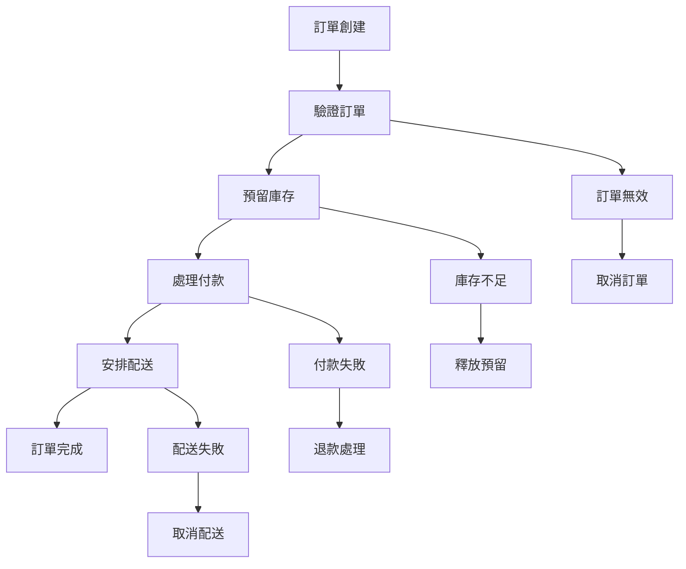
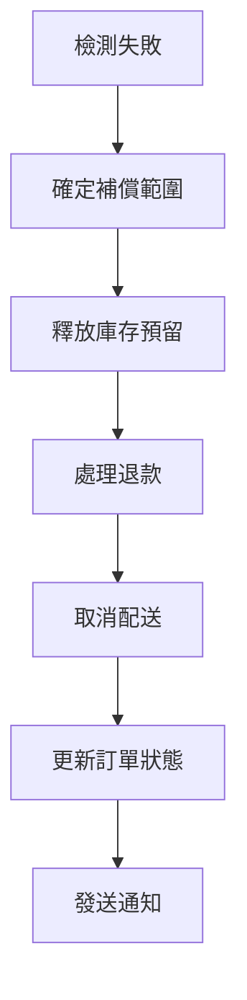

# OrderProcessingSaga 實作指南

## 概述

OrderProcessingSaga 是專案中最重要的 Saga 實作之一，負責協調訂單處理的完整生命週期。本指南詳細說明其設計、實作和最佳實踐。

## 🔄 業務流程

### 訂單處理流程



### 補償流程



## 🏗️ 實作架構

### 核心組件

```java
@Component
@Slf4j
public class OrderProcessingSaga {
    
    private final OrderService orderService;
    private final InventoryService inventoryService;
    private final PaymentService paymentService;
    private final ShippingService shippingService;
    private final NotificationService notificationService;
    private final SagaStateManager sagaStateManager;
    
    // 事件處理方法
    // 補償動作方法
    // 狀態管理方法
}
```

### 狀態管理

```java
@Entity
@Table(name = "order_saga_state")
public class OrderSagaState {
    
    @Id
    private String orderId;
    
    @Enumerated(EnumType.STRING)
    private OrderSagaStatus status;
    
    private String currentStep;
    private LocalDateTime startedAt;
    private LocalDateTime lastUpdatedAt;
    
    @ElementCollection
    @CollectionTable(name = "order_saga_steps")
    private List<SagaStepRecord> completedSteps = new ArrayList<>();
    
    @Column(columnDefinition = "TEXT")
    private String compensationData; // JSON 格式的補償資料
    
    public void addCompletedStep(String stepName, String stepData) {
        completedSteps.add(new SagaStepRecord(
            stepName, 
            stepData, 
            LocalDateTime.now()
        ));
        this.lastUpdatedAt = LocalDateTime.now();
    }
    
    public boolean hasCompletedStep(String stepName) {
        return completedSteps.stream()
            .anyMatch(step -> step.getStepName().equals(stepName));
    }
}
```

## 📝 詳細實作

### 1. 訂單創建處理

```java
@TransactionalEventListener(phase = TransactionPhase.AFTER_COMMIT)
@Order(1)
public void handleOrderCreated(OrderCreatedEvent event) {
    log.info("Starting order processing saga for order: {}", event.getOrderId());
    
    try {
        // 初始化 Saga 狀態
        OrderSagaState sagaState = new OrderSagaState(
            event.getOrderId(),
            OrderSagaStatus.STARTED,
            "ORDER_VALIDATION"
        );
        sagaStateManager.save(sagaState);
        
        // 步驟 1: 驗證訂單
        validateOrder(event);
        
    } catch (Exception e) {
        log.error("Failed to start order processing saga for order: {}", event.getOrderId(), e);
        handleSagaFailure(event.getOrderId(), "ORDER_VALIDATION", e);
    }
}

private void validateOrder(OrderCreatedEvent event) {
    // 驗證訂單基本資訊
    if (event.getOrderItems().isEmpty()) {
        throw new InvalidOrderException("Order must contain at least one item");
    }
    
    // 驗證客戶資訊
    if (!customerService.isValidCustomer(event.getCustomerId())) {
        throw new InvalidCustomerException("Invalid customer: " + event.getCustomerId());
    }
    
    // 驗證付款資訊
    if (!paymentService.isValidPaymentMethod(event.getPaymentInfo())) {
        throw new InvalidPaymentException("Invalid payment method");
    }
    
    // 驗證成功，進入下一步
    log.info("Order validation completed for order: {}", event.getOrderId());
    
    // 更新 Saga 狀態
    OrderSagaState sagaState = sagaStateManager.findByOrderId(event.getOrderId());
    sagaState.setCurrentStep("INVENTORY_RESERVATION");
    sagaState.addCompletedStep("ORDER_VALIDATION", "Order validation completed");
    sagaStateManager.save(sagaState);
    
    // 觸發庫存預留
    eventPublisher.publish(InventoryReservationRequested.create(
        event.getOrderId(),
        event.getOrderItems()
    ));
}
```

### 2. 庫存預留處理

```java
@TransactionalEventListener(phase = TransactionPhase.AFTER_COMMIT)
@Order(2)
public void handleInventoryReservationRequested(InventoryReservationRequested event) {
    log.info("Processing inventory reservation for order: {}", event.getOrderId());
    
    try {
        // 預留庫存
        InventoryReservationResult result = inventoryService.reserveItems(
            event.getOrderId(),
            event.getOrderItems()
        );
        
        if (result.isSuccess()) {
            // 預留成功
            handleInventoryReserved(event.getOrderId(), result);
        } else {
            // 預留失敗
            handleInventoryReservationFailed(event.getOrderId(), result.getFailureReason());
        }
        
    } catch (Exception e) {
        log.error("Failed to reserve inventory for order: {}", event.getOrderId(), e);
        handleSagaFailure(event.getOrderId(), "INVENTORY_RESERVATION", e);
    }
}

private void handleInventoryReserved(String orderId, InventoryReservationResult result) {
    log.info("Inventory reserved successfully for order: {}", orderId);
    
    // 更新 Saga 狀態
    OrderSagaState sagaState = sagaStateManager.findByOrderId(orderId);
    sagaState.setCurrentStep("PAYMENT_PROCESSING");
    sagaState.addCompletedStep("INVENTORY_RESERVATION", 
        "Reserved items: " + result.getReservedItems());
    
    // 保存補償資料
    CompensationData compensationData = new CompensationData();
    compensationData.setReservationId(result.getReservationId());
    compensationData.setReservedItems(result.getReservedItems());
    sagaState.setCompensationData(JsonUtils.toJson(compensationData));
    
    sagaStateManager.save(sagaState);
    
    // 觸發付款處理
    eventPublisher.publish(PaymentRequested.create(
        orderId,
        calculateTotalAmount(result.getReservedItems()),
        getPaymentInfo(orderId)
    ));
}
```

### 3. 付款處理

```java
@TransactionalEventListener(phase = TransactionPhase.AFTER_COMMIT)
@Order(3)
public void handlePaymentRequested(PaymentRequested event) {
    log.info("Processing payment for order: {}", event.getOrderId());
    
    try {
        // 處理付款
        PaymentResult result = paymentService.processPayment(
            event.getOrderId(),
            event.getAmount(),
            event.getPaymentInfo()
        );
        
        if (result.isSuccess()) {
            handlePaymentProcessed(event.getOrderId(), result);
        } else {
            handlePaymentFailed(event.getOrderId(), result.getFailureReason());
        }
        
    } catch (Exception e) {
        log.error("Failed to process payment for order: {}", event.getOrderId(), e);
        handleSagaFailure(event.getOrderId(), "PAYMENT_PROCESSING", e);
    }
}

private void handlePaymentProcessed(String orderId, PaymentResult result) {
    log.info("Payment processed successfully for order: {}", orderId);
    
    // 更新 Saga 狀態
    OrderSagaState sagaState = sagaStateManager.findByOrderId(orderId);
    sagaState.setCurrentStep("SHIPPING_ARRANGEMENT");
    sagaState.addCompletedStep("PAYMENT_PROCESSING", 
        "Payment ID: " + result.getPaymentId());
    
    // 更新補償資料
    CompensationData compensationData = JsonUtils.fromJson(
        sagaState.getCompensationData(), CompensationData.class);
    compensationData.setPaymentId(result.getPaymentId());
    compensationData.setPaymentAmount(result.getAmount());
    sagaState.setCompensationData(JsonUtils.toJson(compensationData));
    
    sagaStateManager.save(sagaState);
    
    // 觸發配送安排
    eventPublisher.publish(ShippingRequested.create(
        orderId,
        getShippingInfo(orderId)
    ));
}
```

### 4. 配送安排

```java
@TransactionalEventListener(phase = TransactionPhase.AFTER_COMMIT)
@Order(4)
public void handleShippingRequested(ShippingRequested event) {
    log.info("Arranging shipping for order: {}", event.getOrderId());
    
    try {
        // 安排配送
        ShippingResult result = shippingService.arrangeShipping(
            event.getOrderId(),
            event.getShippingInfo()
        );
        
        if (result.isSuccess()) {
            handleShippingArranged(event.getOrderId(), result);
        } else {
            handleShippingFailed(event.getOrderId(), result.getFailureReason());
        }
        
    } catch (Exception e) {
        log.error("Failed to arrange shipping for order: {}", event.getOrderId(), e);
        handleSagaFailure(event.getOrderId(), "SHIPPING_ARRANGEMENT", e);
    }
}

private void handleShippingArranged(String orderId, ShippingResult result) {
    log.info("Shipping arranged successfully for order: {}", orderId);
    
    // 更新 Saga 狀態
    OrderSagaState sagaState = sagaStateManager.findByOrderId(orderId);
    sagaState.setCurrentStep("ORDER_COMPLETION");
    sagaState.addCompletedStep("SHIPPING_ARRANGEMENT", 
        "Tracking number: " + result.getTrackingNumber());
    
    // 更新補償資料
    CompensationData compensationData = JsonUtils.fromJson(
        sagaState.getCompensationData(), CompensationData.class);
    compensationData.setShippingId(result.getShippingId());
    compensationData.setTrackingNumber(result.getTrackingNumber());
    sagaState.setCompensationData(JsonUtils.toJson(compensationData));
    
    sagaStateManager.save(sagaState);
    
    // 完成訂單
    completeOrder(orderId);
}
```

### 5. 訂單完成

```java
private void completeOrder(String orderId) {
    log.info("Completing order: {}", orderId);
    
    try {
        // 更新訂單狀態
        orderService.completeOrder(orderId);
        
        // 更新 Saga 狀態
        OrderSagaState sagaState = sagaStateManager.findByOrderId(orderId);
        sagaState.setStatus(OrderSagaStatus.COMPLETED);
        sagaState.setCurrentStep("COMPLETED");
        sagaState.addCompletedStep("ORDER_COMPLETION", "Order completed successfully");
        sagaStateManager.save(sagaState);
        
        // 發送完成通知
        notificationService.sendOrderCompletionNotification(orderId);
        
        // 發布訂單完成事件
        eventPublisher.publish(OrderCompletedEvent.create(orderId));
        
        log.info("Order processing saga completed successfully for order: {}", orderId);
        
    } catch (Exception e) {
        log.error("Failed to complete order: {}", orderId, e);
        // 即使完成步驟失敗，也不需要補償，因為核心業務已經完成
        // 只需要記錄錯誤並可能重試通知
    }
}
```

## 🔄 補償機制

### 補償協調器

```java
@Component
public class OrderSagaCompensationHandler {
    
    public void startCompensation(String orderId, String failedStep, Exception cause) {
        log.warn("Starting compensation for order: {}, failed at step: {}", orderId, failedStep, cause);
        
        OrderSagaState sagaState = sagaStateManager.findByOrderId(orderId);
        sagaState.setStatus(OrderSagaStatus.COMPENSATING);
        sagaStateManager.save(sagaState);
        
        CompensationData compensationData = JsonUtils.fromJson(
            sagaState.getCompensationData(), CompensationData.class);
        
        // 根據失敗的步驟決定補償範圍
        switch (failedStep) {
            case "SHIPPING_ARRANGEMENT":
                compensatePayment(orderId, compensationData);
                // Fall through to compensate inventory
            case "PAYMENT_PROCESSING":
                compensateInventoryReservation(orderId, compensationData);
                break;
            case "INVENTORY_RESERVATION":
                // 庫存預留失敗，無需補償
                break;
            default:
                log.warn("Unknown failed step: {}", failedStep);
        }
        
        // 最終取消訂單
        cancelOrder(orderId, cause.getMessage());
    }
    
    private void compensatePayment(String orderId, CompensationData compensationData) {
        if (compensationData.getPaymentId() != null) {
            try {
                log.info("Compensating payment for order: {}", orderId);
                
                RefundResult result = paymentService.refundPayment(
                    compensationData.getPaymentId(),
                    compensationData.getPaymentAmount()
                );
                
                if (result.isSuccess()) {
                    log.info("Payment compensation completed for order: {}", orderId);
                } else {
                    log.error("Payment compensation failed for order: {}, reason: {}", 
                        orderId, result.getFailureReason());
                    // 付款補償失敗需要人工介入
                    alertService.sendPaymentCompensationAlert(orderId, result.getFailureReason());
                }
                
            } catch (Exception e) {
                log.error("Exception during payment compensation for order: {}", orderId, e);
                alertService.sendPaymentCompensationAlert(orderId, e.getMessage());
            }
        }
    }
    
    private void compensateInventoryReservation(String orderId, CompensationData compensationData) {
        if (compensationData.getReservationId() != null) {
            try {
                log.info("Compensating inventory reservation for order: {}", orderId);
                
                inventoryService.releaseReservation(compensationData.getReservationId());
                log.info("Inventory compensation completed for order: {}", orderId);
                
            } catch (Exception e) {
                log.error("Exception during inventory compensation for order: {}", orderId, e);
                // 庫存補償失敗，記錄錯誤但繼續其他補償
            }
        }
    }
    
    private void cancelOrder(String orderId, String reason) {
        try {
            orderService.cancelOrder(orderId, reason);
            
            // 更新 Saga 狀態
            OrderSagaState sagaState = sagaStateManager.findByOrderId(orderId);
            sagaState.setStatus(OrderSagaStatus.COMPENSATED);
            sagaState.addCompletedStep("COMPENSATION", "Order cancelled: " + reason);
            sagaStateManager.save(sagaState);
            
            // 發送取消通知
            notificationService.sendOrderCancellationNotification(orderId, reason);
            
            log.info("Order compensation completed for order: {}", orderId);
            
        } catch (Exception e) {
            log.error("Failed to cancel order during compensation: {}", orderId, e);
            sagaStateManager.markSagaAsFailed(orderId, e.getMessage());
        }
    }
}
```

## 📊 監控和可觀測性

### Saga 指標收集

```java
@Component
public class OrderSagaMetrics {
    
    private final MeterRegistry meterRegistry;
    
    public OrderSagaMetrics(MeterRegistry meterRegistry) {
        this.meterRegistry = meterRegistry;
    }
    
    public void recordSagaStarted(String orderId) {
        Counter.builder("order.saga.started")
            .description("Number of order sagas started")
            .register(meterRegistry)
            .increment();
    }
    
    public void recordSagaCompleted(String orderId, Duration duration) {
        Timer.builder("order.saga.duration")
            .description("Order saga completion time")
            .register(meterRegistry)
            .record(duration);
            
        Counter.builder("order.saga.completed")
            .description("Number of order sagas completed")
            .register(meterRegistry)
            .increment();
    }
    
    public void recordSagaFailed(String orderId, String failedStep, String reason) {
        Counter.builder("order.saga.failed")
            .description("Number of order sagas failed")
            .tag("failed.step", failedStep)
            .tag("failure.reason", reason)
            .register(meterRegistry)
            .increment();
    }
    
    public void recordCompensationStarted(String orderId) {
        Counter.builder("order.saga.compensation.started")
            .description("Number of order saga compensations started")
            .register(meterRegistry)
            .increment();
    }
}
```

### 分散式追蹤

```java
@Component
public class OrderSagaTracing {
    
    private final Tracer tracer;
    
    public void traceOrderSaga(String orderId, String stepName, Runnable operation) {
        Span span = tracer.nextSpan()
            .name("order-saga-step")
            .tag("order.id", orderId)
            .tag("saga.step", stepName)
            .start();
            
        try (Tracer.SpanInScope ws = tracer.withSpanInScope(span)) {
            operation.run();
            span.tag("saga.step.status", "success");
            
        } catch (Exception e) {
            span.tag("saga.step.status", "failed");
            span.tag("error", e.getMessage());
            throw e;
        } finally {
            span.end();
        }
    }
}
```

## 🧪 測試策略

### 單元測試

```java
@ExtendWith(MockitoExtension.class)
class OrderProcessingSagaTest {
    
    @Mock
    private OrderService orderService;
    
    @Mock
    private InventoryService inventoryService;
    
    @Mock
    private PaymentService paymentService;
    
    @Mock
    private SagaStateManager sagaStateManager;
    
    @InjectMocks
    private OrderProcessingSaga orderProcessingSaga;
    
    @Test
    void should_complete_order_saga_successfully() {
        // Given
        OrderCreatedEvent event = createOrderCreatedEvent();
        when(inventoryService.reserveItems(any(), any()))
            .thenReturn(InventoryReservationResult.success());
        when(paymentService.processPayment(any(), any(), any()))
            .thenReturn(PaymentResult.success());
        when(shippingService.arrangeShipping(any(), any()))
            .thenReturn(ShippingResult.success());
        
        // When
        orderProcessingSaga.handleOrderCreated(event);
        
        // Then
        verify(orderService).completeOrder(event.getOrderId());
        verify(sagaStateManager).save(argThat(state -> 
            state.getStatus() == OrderSagaStatus.COMPLETED));
    }
    
    @Test
    void should_compensate_when_payment_fails() {
        // Given
        OrderCreatedEvent event = createOrderCreatedEvent();
        when(inventoryService.reserveItems(any(), any()))
            .thenReturn(InventoryReservationResult.success());
        when(paymentService.processPayment(any(), any(), any()))
            .thenReturn(PaymentResult.failure("Insufficient funds"));
        
        // When
        orderProcessingSaga.handleOrderCreated(event);
        
        // Then
        verify(inventoryService).releaseReservation(any());
        verify(orderService).cancelOrder(eq(event.getOrderId()), any());
    }
}
```

### 整合測試

```java
@SpringBootTest
@ActiveProfiles("test")
@Transactional
class OrderProcessingSagaIntegrationTest {
    
    @Autowired
    private OrderProcessingSaga orderProcessingSaga;
    
    @Autowired
    private SagaStateManager sagaStateManager;
    
    @Test
    void should_handle_complete_order_flow() {
        // Given
        OrderCreatedEvent event = createOrderCreatedEvent();
        
        // When
        orderProcessingSaga.handleOrderCreated(event);
        
        // Then
        OrderSagaState sagaState = sagaStateManager.findByOrderId(event.getOrderId());
        assertThat(sagaState.getStatus()).isEqualTo(OrderSagaStatus.COMPLETED);
        assertThat(sagaState.getCompletedSteps()).hasSize(4);
    }
}
```

## 🔗 相關資源

### 內部文檔
- [Saga 模式總覽](README.md)
- [付款 Saga 實作](payment-saga.md)
- [Saga 協調機制](saga-coordination.md)

### 配置範例
- [事件配置](../../../infrastructure/event-configuration.md)
- [資料庫配置](../../../infrastructure/database-configuration.md)

---

**最後更新**: 2025年1月21日  
**維護者**: Architecture Team  
**版本**: 1.0

> 💡 **提示**: OrderProcessingSaga 是複雜的分散式事務協調器。在實作時要特別注意錯誤處理和補償邏輯，確保系統在各種異常情況下都能保持資料一致性。