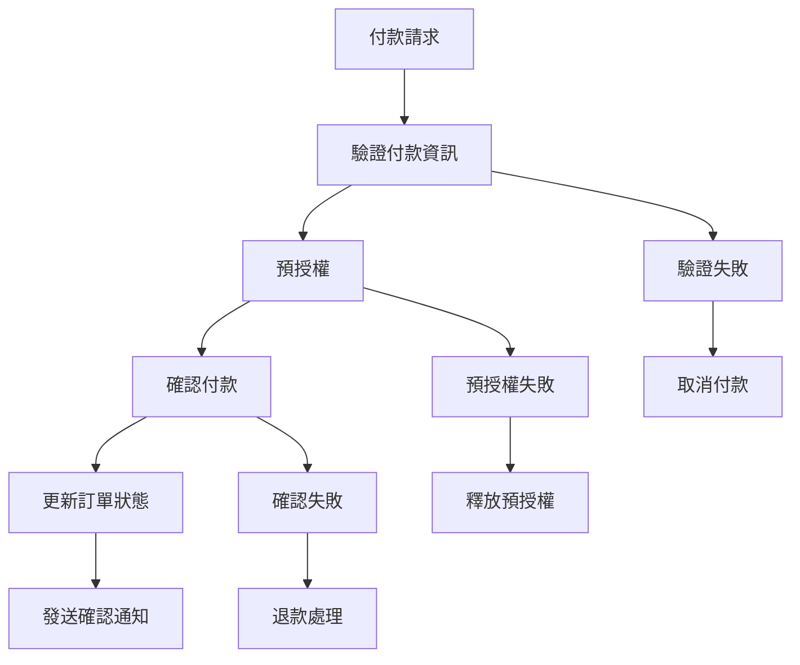
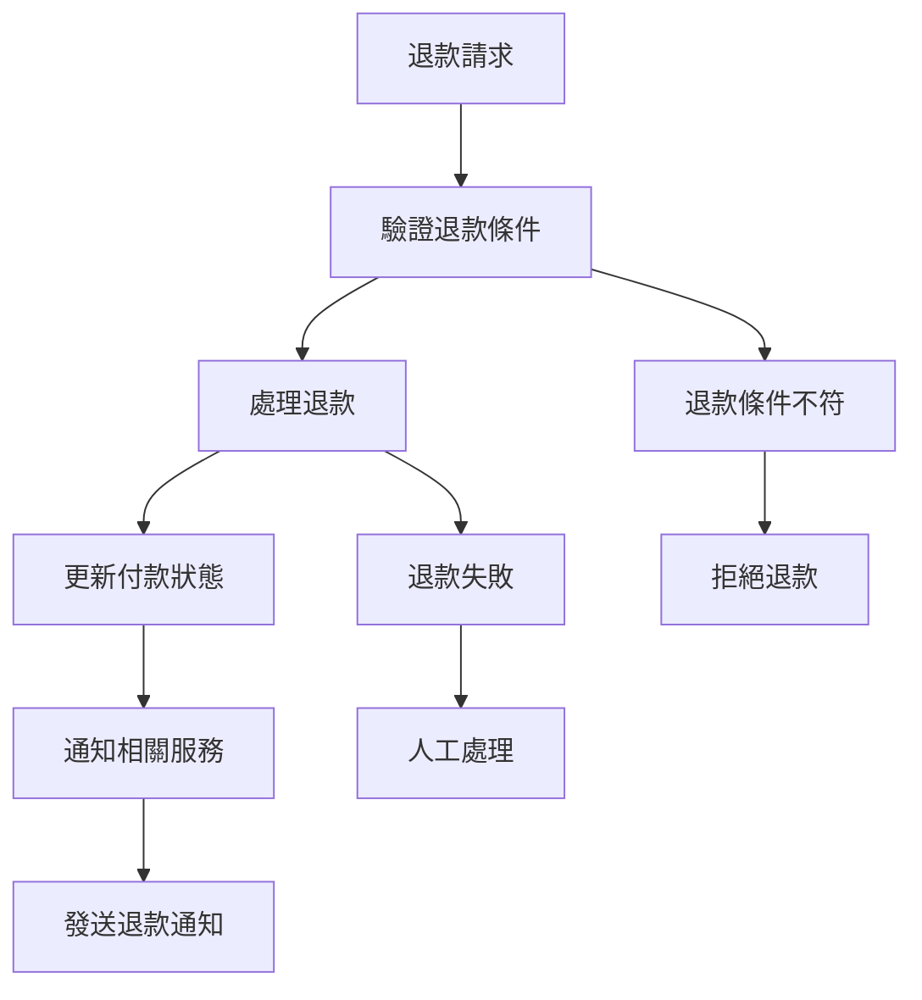

# PaymentProcessingSaga 實作指南

## 概述

PaymentProcessingSaga 負責處理複雜的付款流程，包括預授權、確認付款、退款處理等。本指南詳細說明其設計模式、實作方法和最佳實踐。

## 💳 付款業務流程

### 標準付款流程



### 退款補償流程



## 🏗️ 實作架構

### 核心組件

```java
@Component
@Slf4j
public class PaymentProcessingSaga {
    
    private final PaymentService paymentService;
    private final PaymentGatewayService gatewayService;
    private final OrderService orderService;
    private final NotificationService notificationService;
    private final PaymentStateManager stateManager;
    private final EventPublisher eventPublisher;
    
    public PaymentProcessingSaga(PaymentService paymentService,
                                PaymentGatewayService gatewayService,
                                OrderService orderService,
                                NotificationService notificationService,
                                PaymentStateManager stateManager,
                                EventPublisher eventPublisher) {
        this.paymentService = paymentService;
        this.gatewayService = gatewayService;
        this.orderService = orderService;
        this.notificationService = notificationService;
        this.stateManager = stateManager;
        this.eventPublisher = eventPublisher;
    }
}
```

### 付款狀態管理

```java
@Entity
@Table(name = "payment_saga_state")
public class PaymentSagaState {
    
    @Id
    private String paymentId;
    
    private String orderId;
    private String customerId;
    
    @Enumerated(EnumType.STRING)
    private PaymentSagaStatus status;
    
    private String currentStep;
    private BigDecimal amount;
    private String currency;
    
    @Enumerated(EnumType.STRING)
    private PaymentMethod paymentMethod;
    
    private String gatewayTransactionId;
    private String preAuthorizationId;
    
    private LocalDateTime startedAt;
    private LocalDateTime lastUpdatedAt;
    private LocalDateTime completedAt;
    
    @ElementCollection
    @CollectionTable(name = "payment_saga_steps")
    private List<PaymentStepRecord> completedSteps = new ArrayList<>();
    
    @Column(columnDefinition = "TEXT")
    private String compensationData; // JSON 格式的補償資料
    
    public void addCompletedStep(String stepName, String stepData) {
        completedSteps.add(new PaymentStepRecord(
            stepName, 
            stepData, 
            LocalDateTime.now()
        ));
        this.lastUpdatedAt = LocalDateTime.now();
    }
    
    public boolean hasCompletedStep(String stepName) {
        return completedSteps.stream()
            .anyMatch(step -> step.getStepName().equals(stepName));
    }
    
    public boolean isCompensatable() {
        return status == PaymentSagaStatus.COMPLETED || 
               status == PaymentSagaStatus.PRE_AUTHORIZED;
    }
}

public enum PaymentSagaStatus {
    STARTED,
    VALIDATING,
    PRE_AUTHORIZING,
    PRE_AUTHORIZED,
    CONFIRMING,
    COMPLETED,
    COMPENSATING,
    COMPENSATED,
    FAILED
}
```

## 📝 詳細實作

### 1. 付款請求處理

```java
@TransactionalEventListener(phase = TransactionPhase.AFTER_COMMIT)
@Order(1)
public void handlePaymentRequested(PaymentRequested event) {
    log.info("Starting payment processing saga for order: {}, amount: {}", 
        event.getOrderId(), event.getAmount());
    
    try {
        // 初始化付款 Saga 狀態
        PaymentSagaState sagaState = new PaymentSagaState(
            event.getPaymentId(),
            event.getOrderId(),
            event.getCustomerId(),
            PaymentSagaStatus.STARTED,
            "PAYMENT_VALIDATION",
            event.getAmount(),
            event.getCurrency(),
            event.getPaymentMethod()
        );
        stateManager.save(sagaState);
        
        // 步驟 1: 驗證付款資訊
        validatePaymentInfo(event);
        
    } catch (Exception e) {
        log.error("Failed to start payment processing saga for order: {}", event.getOrderId(), e);
        handlePaymentFailure(event.getPaymentId(), "PAYMENT_VALIDATION", e);
    }
}

private void validatePaymentInfo(PaymentRequested event) {
    log.info("Validating payment info for payment: {}", event.getPaymentId());
    
    try {
        // 驗證付款金額
        if (event.getAmount().compareTo(BigDecimal.ZERO) <= 0) {
            throw new InvalidPaymentAmountException("Payment amount must be positive");
        }
        
        // 驗證付款方式
        if (!paymentService.isValidPaymentMethod(event.getPaymentMethod())) {
            throw new InvalidPaymentMethodException("Invalid payment method: " + event.getPaymentMethod());
        }
        
        // 驗證客戶付款資訊
        if (!paymentService.isValidCustomerPaymentInfo(event.getCustomerId(), event.getPaymentInfo())) {
            throw new InvalidPaymentInfoException("Invalid payment information for customer");
        }
        
        // 驗證成功，更新狀態
        PaymentSagaState sagaState = stateManager.findByPaymentId(event.getPaymentId());
        sagaState.setStatus(PaymentSagaStatus.VALIDATING);
        sagaState.setCurrentStep("PRE_AUTHORIZATION");
        sagaState.addCompletedStep("PAYMENT_VALIDATION", "Payment info validated successfully");
        stateManager.save(sagaState);
        
        log.info("Payment validation completed for payment: {}", event.getPaymentId());
        
        // 觸發預授權
        preAuthorizePayment(event);
        
    } catch (Exception e) {
        log.error("Payment validation failed for payment: {}", event.getPaymentId(), e);
        handlePaymentFailure(event.getPaymentId(), "PAYMENT_VALIDATION", e);
    }
}
```

### 2. 預授權處理

```java
private void preAuthorizePayment(PaymentRequested event) {
    log.info("Pre-authorizing payment: {}", event.getPaymentId());
    
    try {
        // 調用付款閘道進行預授權
        PreAuthorizationRequest request = PreAuthorizationRequest.builder()
            .paymentId(event.getPaymentId())
            .orderId(event.getOrderId())
            .amount(event.getAmount())
            .currency(event.getCurrency())
            .paymentMethod(event.getPaymentMethod())
            .paymentInfo(event.getPaymentInfo())
            .build();
        
        PreAuthorizationResult result = gatewayService.preAuthorize(request);
        
        if (result.isSuccess()) {
            handlePreAuthorizationSuccess(event.getPaymentId(), result);
        } else {
            handlePreAuthorizationFailure(event.getPaymentId(), result.getFailureReason());
        }
        
    } catch (Exception e) {
        log.error("Pre-authorization failed for payment: {}", event.getPaymentId(), e);
        handlePaymentFailure(event.getPaymentId(), "PRE_AUTHORIZATION", e);
    }
}

private void handlePreAuthorizationSuccess(String paymentId, PreAuthorizationResult result) {
    log.info("Pre-authorization successful for payment: {}, auth ID: {}", 
        paymentId, result.getPreAuthorizationId());
    
    // 更新 Saga 狀態
    PaymentSagaState sagaState = stateManager.findByPaymentId(paymentId);
    sagaState.setStatus(PaymentSagaStatus.PRE_AUTHORIZED);
    sagaState.setCurrentStep("PAYMENT_CONFIRMATION");
    sagaState.setPreAuthorizationId(result.getPreAuthorizationId());
    sagaState.setGatewayTransactionId(result.getTransactionId());
    sagaState.addCompletedStep("PRE_AUTHORIZATION", 
        "Pre-auth ID: " + result.getPreAuthorizationId());
    
    // 保存補償資料
    PaymentCompensationData compensationData = new PaymentCompensationData();
    compensationData.setPreAuthorizationId(result.getPreAuthorizationId());
    compensationData.setTransactionId(result.getTransactionId());
    compensationData.setAmount(sagaState.getAmount());
    sagaState.setCompensationData(JsonUtils.toJson(compensationData));
    
    stateManager.save(sagaState);
    
    // 發布預授權成功事件
    eventPublisher.publish(PaymentPreAuthorizedEvent.create(
        paymentId,
        sagaState.getOrderId(),
        result.getPreAuthorizationId(),
        sagaState.getAmount()
    ));
}
```

### 3. 付款確認

```java
@TransactionalEventListener(phase = TransactionPhase.AFTER_COMMIT)
@Order(2)
public void handlePaymentConfirmationRequested(PaymentConfirmationRequested event) {
    log.info("Confirming payment: {}", event.getPaymentId());
    
    try {
        PaymentSagaState sagaState = stateManager.findByPaymentId(event.getPaymentId());
        
        if (sagaState.getStatus() != PaymentSagaStatus.PRE_AUTHORIZED) {
            throw new InvalidPaymentStateException(
                "Payment must be pre-authorized before confirmation");
        }
        
        // 確認付款
        PaymentConfirmationRequest request = PaymentConfirmationRequest.builder()
            .paymentId(event.getPaymentId())
            .preAuthorizationId(sagaState.getPreAuthorizationId())
            .amount(event.getAmount())
            .build();
        
        PaymentConfirmationResult result = gatewayService.confirmPayment(request);
        
        if (result.isSuccess()) {
            handlePaymentConfirmationSuccess(event.getPaymentId(), result);
        } else {
            handlePaymentConfirmationFailure(event.getPaymentId(), result.getFailureReason());
        }
        
    } catch (Exception e) {
        log.error("Payment confirmation failed for payment: {}", event.getPaymentId(), e);
        handlePaymentFailure(event.getPaymentId(), "PAYMENT_CONFIRMATION", e);
    }
}

private void handlePaymentConfirmationSuccess(String paymentId, PaymentConfirmationResult result) {
    log.info("Payment confirmation successful for payment: {}", paymentId);
    
    // 更新 Saga 狀態
    PaymentSagaState sagaState = stateManager.findByPaymentId(paymentId);
    sagaState.setStatus(PaymentSagaStatus.COMPLETED);
    sagaState.setCurrentStep("COMPLETED");
    sagaState.setCompletedAt(LocalDateTime.now());
    sagaState.addCompletedStep("PAYMENT_CONFIRMATION", 
        "Payment confirmed, transaction ID: " + result.getTransactionId());
    
    // 更新補償資料
    PaymentCompensationData compensationData = JsonUtils.fromJson(
        sagaState.getCompensationData(), PaymentCompensationData.class);
    compensationData.setConfirmedTransactionId(result.getTransactionId());
    compensationData.setConfirmedAmount(result.getAmount());
    sagaState.setCompensationData(JsonUtils.toJson(compensationData));
    
    stateManager.save(sagaState);
    
    // 更新訂單付款狀態
    orderService.updatePaymentStatus(sagaState.getOrderId(), PaymentStatus.COMPLETED);
    
    // 發布付款完成事件
    eventPublisher.publish(PaymentCompletedEvent.create(
        paymentId,
        sagaState.getOrderId(),
        sagaState.getCustomerId(),
        result.getTransactionId(),
        result.getAmount()
    ));
    
    // 發送付款確認通知
    notificationService.sendPaymentConfirmationNotification(
        sagaState.getCustomerId(),
        sagaState.getOrderId(),
        result.getAmount()
    );
    
    log.info("Payment processing saga completed successfully for payment: {}", paymentId);
}
```

## 🔄 補償機制

### 付款補償處理器

```java
@Component
public class PaymentSagaCompensationHandler {
    
    private final PaymentGatewayService gatewayService;
    private final PaymentStateManager stateManager;
    private final EventPublisher eventPublisher;
    private final AlertService alertService;
    
    public void startCompensation(String paymentId, String failedStep, Exception cause) {
        log.warn("Starting payment compensation for payment: {}, failed at step: {}", 
            paymentId, failedStep, cause);
        
        PaymentSagaState sagaState = stateManager.findByPaymentId(paymentId);
        sagaState.setStatus(PaymentSagaStatus.COMPENSATING);
        stateManager.save(sagaState);
        
        PaymentCompensationData compensationData = JsonUtils.fromJson(
            sagaState.getCompensationData(), PaymentCompensationData.class);
        
        // 根據失敗的步驟和當前狀態決定補償動作
        switch (sagaState.getStatus()) {
            case COMPLETED:
                // 付款已完成，需要退款
                refundPayment(paymentId, compensationData);
                break;
            case PRE_AUTHORIZED:
                // 預授權已完成，需要取消預授權
                cancelPreAuthorization(paymentId, compensationData);
                break;
            case VALIDATING:
            case STARTED:
                // 還未進行實際付款操作，只需更新狀態
                markPaymentAsCancelled(paymentId, cause.getMessage());
                break;
            default:
                log.warn("Unknown payment state for compensation: {}", sagaState.getStatus());
        }
    }
    
    private void refundPayment(String paymentId, PaymentCompensationData compensationData) {
        try {
            log.info("Processing refund for payment: {}", paymentId);
            
            RefundRequest request = RefundRequest.builder()
                .paymentId(paymentId)
                .transactionId(compensationData.getConfirmedTransactionId())
                .amount(compensationData.getConfirmedAmount())
                .reason("Order cancellation")
                .build();
            
            RefundResult result = gatewayService.refundPayment(request);
            
            if (result.isSuccess()) {
                handleRefundSuccess(paymentId, result);
            } else {
                handleRefundFailure(paymentId, result.getFailureReason());
            }
            
        } catch (Exception e) {
            log.error("Exception during payment refund for payment: {}", paymentId, e);
            handleRefundFailure(paymentId, e.getMessage());
        }
    }
    
    private void cancelPreAuthorization(String paymentId, PaymentCompensationData compensationData) {
        try {
            log.info("Cancelling pre-authorization for payment: {}", paymentId);
            
            CancelPreAuthRequest request = CancelPreAuthRequest.builder()
                .paymentId(paymentId)
                .preAuthorizationId(compensationData.getPreAuthorizationId())
                .build();
            
            CancelPreAuthResult result = gatewayService.cancelPreAuthorization(request);
            
            if (result.isSuccess()) {
                handlePreAuthCancellationSuccess(paymentId);
            } else {
                handlePreAuthCancellationFailure(paymentId, result.getFailureReason());
            }
            
        } catch (Exception e) {
            log.error("Exception during pre-auth cancellation for payment: {}", paymentId, e);
            handlePreAuthCancellationFailure(paymentId, e.getMessage());
        }
    }
    
    private void handleRefundSuccess(String paymentId, RefundResult result) {
        log.info("Refund successful for payment: {}, refund ID: {}", paymentId, result.getRefundId());
        
        PaymentSagaState sagaState = stateManager.findByPaymentId(paymentId);
        sagaState.setStatus(PaymentSagaStatus.COMPENSATED);
        sagaState.addCompletedStep("REFUND", "Refund ID: " + result.getRefundId());
        stateManager.save(sagaState);
        
        // 發布退款完成事件
        eventPublisher.publish(PaymentRefundedEvent.create(
            paymentId,
            sagaState.getOrderId(),
            result.getRefundId(),
            result.getRefundAmount()
        ));
        
        // 發送退款通知
        notificationService.sendRefundNotification(
            sagaState.getCustomerId(),
            sagaState.getOrderId(),
            result.getRefundAmount()
        );
    }
    
    private void handleRefundFailure(String paymentId, String failureReason) {
        log.error("Refund failed for payment: {}, reason: {}", paymentId, failureReason);
        
        PaymentSagaState sagaState = stateManager.findByPaymentId(paymentId);
        sagaState.setStatus(PaymentSagaStatus.FAILED);
        sagaState.addCompletedStep("REFUND_FAILED", "Reason: " + failureReason);
        stateManager.save(sagaState);
        
        // 退款失敗需要人工介入
        alertService.sendRefundFailureAlert(paymentId, failureReason);
        
        // 發布退款失敗事件
        eventPublisher.publish(PaymentRefundFailedEvent.create(
            paymentId,
            sagaState.getOrderId(),
            failureReason
        ));
    }
}
```

## 📊 監控和指標

### 付款 Saga 指標

```java
@Component
public class PaymentSagaMetrics {
    
    private final MeterRegistry meterRegistry;
    
    public PaymentSagaMetrics(MeterRegistry meterRegistry) {
        this.meterRegistry = meterRegistry;
    }
    
    public void recordPaymentSagaStarted(String paymentMethod) {
        Counter.builder("payment.saga.started")
            .description("Number of payment sagas started")
            .tag("payment.method", paymentMethod)
            .register(meterRegistry)
            .increment();
    }
    
    public void recordPaymentSagaCompleted(String paymentMethod, BigDecimal amount, Duration duration) {
        Timer.builder("payment.saga.duration")
            .description("Payment saga completion time")
            .tag("payment.method", paymentMethod)
            .register(meterRegistry)
            .record(duration);
            
        Counter.builder("payment.saga.completed")
            .description("Number of payment sagas completed")
            .tag("payment.method", paymentMethod)
            .register(meterRegistry)
            .increment();
            
        DistributionSummary.builder("payment.amount")
            .description("Payment amounts processed")
            .tag("payment.method", paymentMethod)
            .register(meterRegistry)
            .record(amount.doubleValue());
    }
    
    public void recordPaymentSagaFailed(String paymentMethod, String failedStep, String reason) {
        Counter.builder("payment.saga.failed")
            .description("Number of payment sagas failed")
            .tag("payment.method", paymentMethod)
            .tag("failed.step", failedStep)
            .tag("failure.reason", reason)
            .register(meterRegistry)
            .increment();
    }
    
    public void recordRefundProcessed(String paymentMethod, BigDecimal refundAmount) {
        Counter.builder("payment.refunds.processed")
            .description("Number of refunds processed")
            .tag("payment.method", paymentMethod)
            .register(meterRegistry)
            .increment();
            
        DistributionSummary.builder("payment.refund.amount")
            .description("Refund amounts processed")
            .tag("payment.method", paymentMethod)
            .register(meterRegistry)
            .record(refundAmount.doubleValue());
    }
}
```

### 付款閘道監控

```java
@Component
public class PaymentGatewayMonitor {
    
    private final MeterRegistry meterRegistry;
    
    public void recordGatewayCall(String operation, String gateway, Duration duration, boolean success) {
        Timer.builder("payment.gateway.call.duration")
            .description("Payment gateway call duration")
            .tag("operation", operation)
            .tag("gateway", gateway)
            .tag("success", String.valueOf(success))
            .register(meterRegistry)
            .record(duration);
            
        Counter.builder("payment.gateway.calls")
            .description("Payment gateway calls")
            .tag("operation", operation)
            .tag("gateway", gateway)
            .tag("success", String.valueOf(success))
            .register(meterRegistry)
            .increment();
    }
    
    public void recordGatewayError(String operation, String gateway, String errorType) {
        Counter.builder("payment.gateway.errors")
            .description("Payment gateway errors")
            .tag("operation", operation)
            .tag("gateway", gateway)
            .tag("error.type", errorType)
            .register(meterRegistry)
            .increment();
    }
}
```

## 🧪 測試策略

### 單元測試

```java
@ExtendWith(MockitoExtension.class)
class PaymentProcessingSagaTest {
    
    @Mock
    private PaymentService paymentService;
    
    @Mock
    private PaymentGatewayService gatewayService;
    
    @Mock
    private PaymentStateManager stateManager;
    
    @Mock
    private EventPublisher eventPublisher;
    
    @InjectMocks
    private PaymentProcessingSaga paymentProcessingSaga;
    
    @Test
    void should_complete_payment_saga_successfully() {
        // Given
        PaymentRequested event = createPaymentRequestedEvent();
        when(paymentService.isValidPaymentMethod(any())).thenReturn(true);
        when(paymentService.isValidCustomerPaymentInfo(any(), any())).thenReturn(true);
        when(gatewayService.preAuthorize(any()))
            .thenReturn(PreAuthorizationResult.success("AUTH-123", "TXN-456"));
        when(gatewayService.confirmPayment(any()))
            .thenReturn(PaymentConfirmationResult.success("TXN-789", event.getAmount()));
        
        // When
        paymentProcessingSaga.handlePaymentRequested(event);
        
        // Then
        verify(eventPublisher).publish(any(PaymentCompletedEvent.class));
        verify(stateManager).save(argThat(state -> 
            state.getStatus() == PaymentSagaStatus.COMPLETED));
    }
    
    @Test
    void should_compensate_when_confirmation_fails() {
        // Given
        PaymentRequested event = createPaymentRequestedEvent();
        when(paymentService.isValidPaymentMethod(any())).thenReturn(true);
        when(paymentService.isValidCustomerPaymentInfo(any(), any())).thenReturn(true);
        when(gatewayService.preAuthorize(any()))
            .thenReturn(PreAuthorizationResult.success("AUTH-123", "TXN-456"));
        when(gatewayService.confirmPayment(any()))
            .thenReturn(PaymentConfirmationResult.failure("Gateway timeout"));
        when(gatewayService.cancelPreAuthorization(any()))
            .thenReturn(CancelPreAuthResult.success());
        
        // When
        paymentProcessingSaga.handlePaymentRequested(event);
        
        // Then
        verify(gatewayService).cancelPreAuthorization(any());
        verify(stateManager).save(argThat(state -> 
            state.getStatus() == PaymentSagaStatus.COMPENSATED));
    }
}
```

### 整合測試

```java
@SpringBootTest
@ActiveProfiles("test")
@Transactional
class PaymentProcessingSagaIntegrationTest {
    
    @Autowired
    private PaymentProcessingSaga paymentProcessingSaga;
    
    @Autowired
    private PaymentStateManager stateManager;
    
    @MockBean
    private PaymentGatewayService gatewayService;
    
    @Test
    void should_handle_complete_payment_flow() {
        // Given
        PaymentRequested event = createPaymentRequestedEvent();
        when(gatewayService.preAuthorize(any()))
            .thenReturn(PreAuthorizationResult.success("AUTH-123", "TXN-456"));
        when(gatewayService.confirmPayment(any()))
            .thenReturn(PaymentConfirmationResult.success("TXN-789", event.getAmount()));
        
        // When
        paymentProcessingSaga.handlePaymentRequested(event);
        
        // Then
        PaymentSagaState sagaState = stateManager.findByPaymentId(event.getPaymentId());
        assertThat(sagaState.getStatus()).isEqualTo(PaymentSagaStatus.COMPLETED);
        assertThat(sagaState.getCompletedSteps()).hasSize(3);
        assertThat(sagaState.getPreAuthorizationId()).isEqualTo("AUTH-123");
    }
}
```

## 🔗 相關資源

### 內部文檔
- [Saga 模式總覽](README.md)
- [訂單處理 Saga](order-processing-saga.md)
- [Saga 協調機制](saga-coordination.md)

### 外部整合
- [付款閘道整合指南](../../../infrastructure/payment-gateway-integration.md)
- [事件驅動架構](../../../architecture/event-driven-design.md)

---

**最後更新**: 2025年1月21日  
**維護者**: Architecture Team  
**版本**: 1.0

> 💡 **提示**: PaymentProcessingSaga 處理敏感的金融交易，必須特別注意安全性、冪等性和補償機制。所有付款操作都應該有對應的補償動作，並且要處理各種異常情況。