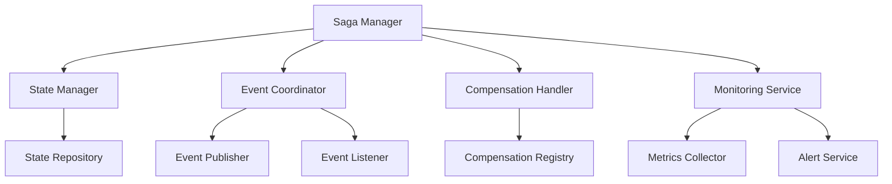

# Saga 協調機制

## 概述

Saga 協調機制是確保分散式事務正確執行的核心組件。本指南詳細說明如何設計和實作有效的 Saga 協調機制，包括狀態管理、事件協調、錯誤處理和監控。

## 🎯 協調機制設計原則

### 核心原則

1. **一致性保證**: 確保 Saga 要麼全部成功，要麼全部補償
2. **可觀測性**: 提供完整的執行追蹤和狀態監控
3. **容錯性**: 能夠處理各種異常情況和系統故障
4. **可擴展性**: 支援複雜的業務流程和多服務協調
5. **冪等性**: 重複執行相同操作應該是安全的

### 設計模式



## 🏗️ 核心組件架構

### 1. Saga Manager

```java
@Component
@Slf4j
public class SagaManager {
    
    private final SagaStateManager stateManager;
    private final SagaEventCoordinator eventCoordinator;
    private final SagaCompensationHandler compensationHandler;
    private final SagaMonitoringService monitoringService;
    private final SagaRegistry sagaRegistry;
    
    public <T extends SagaDefinition> void startSaga(T sagaDefinition, SagaContext context) {
        String sagaId = generateSagaId();
        
        try {
            log.info("Starting saga: {}, type: {}", sagaId, sagaDefinition.getSagaType());
            
            // 初始化 Saga 狀態
            SagaState sagaState = initializeSagaState(sagaId, sagaDefinition, context);
            stateManager.save(sagaState);
            
            // 註冊 Saga
            sagaRegistry.register(sagaId, sagaDefinition);
            
            // 開始監控
            monitoringService.startMonitoring(sagaId, sagaDefinition.getSagaType());
            
            // 執行第一步
            executeNextStep(sagaId);
            
        } catch (Exception e) {
            log.error("Failed to start saga: {}", sagaId, e);
            handleSagaFailure(sagaId, "SAGA_INITIALIZATION", e);
        }
    }
    
    public void executeNextStep(String sagaId) {
        try {
            SagaState sagaState = stateManager.findById(sagaId);
            SagaDefinition sagaDefinition = sagaRegistry.get(sagaId);
            
            SagaStep nextStep = sagaDefinition.getNextStep(sagaState.getCurrentStep());
            
            if (nextStep == null) {
                // Saga 完成
                completeSaga(sagaId);
                return;
            }
            
            log.info("Executing saga step: {} for saga: {}", nextStep.getName(), sagaId);
            
            // 更新狀態
            sagaState.setCurrentStep(nextStep.getName());
            sagaState.setStatus(SagaStatus.EXECUTING);
            stateManager.save(sagaState);
            
            // 執行步驟
            StepExecutionResult result = nextStep.execute(sagaState.getContext());
            
            if (result.isSuccess()) {
                handleStepSuccess(sagaId, nextStep, result);
            } else {
                handleStepFailure(sagaId, nextStep, result.getError());
            }
            
        } catch (Exception e) {
            log.error("Failed to execute saga step for saga: {}", sagaId, e);
            handleSagaFailure(sagaId, "STEP_EXECUTION", e);
        }
    }
}
```

### 2. 狀態管理器

```java
@Component
public class SagaStateManager {
    
    private final SagaStateRepository repository;
    private final SagaStateCache cache;
    private final ObjectMapper objectMapper;
    
    public void save(SagaState sagaState) {
        try {
            // 序列化上下文資料
            String contextJson = objectMapper.writeValueAsString(sagaState.getContext());
            String compensationJson = objectMapper.writeValueAsString(sagaState.getCompensationData());
            
            // 保存到資料庫
            SagaStateEntity entity = SagaStateEntity.builder()
                .sagaId(sagaState.getSagaId())
                .sagaType(sagaState.getSagaType())
                .status(sagaState.getStatus())
                .currentStep(sagaState.getCurrentStep())
                .contextData(contextJson)
                .compensationData(compensationJson)
                .startedAt(sagaState.getStartedAt())
                .lastUpdatedAt(LocalDateTime.now())
                .version(sagaState.getVersion())
                .build();
            
            repository.save(entity);
            
            // 更新快取
            cache.put(sagaState.getSagaId(), sagaState);
            
        } catch (Exception e) {
            log.error("Failed to save saga state: {}", sagaState.getSagaId(), e);
            throw new SagaStateException("Failed to save saga state", e);
        }
    }
    
    public SagaState findById(String sagaId) {
        // 先從快取查找
        SagaState cachedState = cache.get(sagaId);
        if (cachedState != null) {
            return cachedState;
        }
        
        // 從資料庫查找
        Optional<SagaStateEntity> entityOpt = repository.findById(sagaId);
        if (entityOpt.isEmpty()) {
            throw new SagaNotFoundException("Saga not found: " + sagaId);
        }
        
        SagaStateEntity entity = entityOpt.get();
        SagaState sagaState = deserializeSagaState(entity);
        
        // 更新快取
        cache.put(sagaId, sagaState);
        
        return sagaState;
    }
    
    public List<SagaState> findByStatus(SagaStatus status) {
        return repository.findByStatus(status).stream()
            .map(this::deserializeSagaState)
            .collect(Collectors.toList());
    }
    
    public List<SagaState> findStuckSagas(Duration timeout) {
        LocalDateTime cutoff = LocalDateTime.now().minus(timeout);
        return repository.findByLastUpdatedAtBeforeAndStatusIn(
            cutoff, 
            Arrays.asList(SagaStatus.EXECUTING, SagaStatus.COMPENSATING)
        ).stream()
            .map(this::deserializeSagaState)
            .collect(Collectors.toList());
    }
}
```

### 3. 事件協調器

```java
@Component
public class SagaEventCoordinator {
    
    private final EventPublisher eventPublisher;
    private final SagaManager sagaManager;
    private final Map<String, SagaEventHandler> eventHandlers;
    
    @EventListener
    public void handleSagaEvent(SagaEvent event) {
        try {
            log.debug("Handling saga event: {} for saga: {}", 
                event.getEventType(), event.getSagaId());
            
            SagaEventHandler handler = eventHandlers.get(event.getEventType());
            if (handler != null) {
                handler.handle(event);
            } else {
                log.warn("No handler found for saga event type: {}", event.getEventType());
            }
            
        } catch (Exception e) {
            log.error("Failed to handle saga event: {} for saga: {}", 
                event.getEventType(), event.getSagaId(), e);
            
            // 事件處理失敗，可能需要重試或補償
            handleEventProcessingFailure(event, e);
        }
    }
    
    public void publishSagaEvent(SagaEvent event) {
        try {
            eventPublisher.publish(event);
            log.debug("Published saga event: {} for saga: {}", 
                event.getEventType(), event.getSagaId());
                
        } catch (Exception e) {
            log.error("Failed to publish saga event: {} for saga: {}", 
                event.getEventType(), event.getSagaId(), e);
            throw new SagaEventException("Failed to publish saga event", e);
        }
    }
    
    private void handleEventProcessingFailure(SagaEvent event, Exception cause) {
        // 記錄失敗
        log.error("Saga event processing failed: {}", event.getEventType(), cause);
        
        // 根據事件類型決定處理策略
        if (isRetryableEvent(event)) {
            // 可重試的事件，加入重試佇列
            scheduleEventRetry(event, cause);
        } else {
            // 不可重試的事件，觸發 Saga 失敗處理
            sagaManager.handleSagaFailure(event.getSagaId(), "EVENT_PROCESSING", cause);
        }
    }
}
```

### 4. 補償處理器

```java
@Component
public class SagaCompensationHandler {
    
    private final SagaStateManager stateManager;
    private final CompensationRegistry compensationRegistry;
    private final SagaMonitoringService monitoringService;
    
    public void compensate(String sagaId, String failedStep, Exception cause) {
        log.info("Starting compensation for saga: {}, failed step: {}", sagaId, failedStep);
        
        try {
            SagaState sagaState = stateManager.findById(sagaId);
            
            // 獲取需要補償的步驟列表（按逆序）
            List<String> stepsToCompensate = getStepsToCompensate(sagaState, failedStep);
            
            // 執行補償
            for (String stepName : stepsToCompensate) {
                compensateStep(sagaId, stepName, sagaState);
            }
            
            // 標記補償完成
            sagaState.setStatus(SagaStatus.COMPENSATED);
            sagaState.setCompletedAt(LocalDateTime.now());
            stateManager.save(sagaState);
            
            monitoringService.recordSagaCompensated(sagaId, sagaState.getSagaType());
            
            log.info("Compensation completed for saga: {}", sagaId);
            
        } catch (Exception e) {
            log.error("Compensation failed for saga: {}", sagaId, e);
            markSagaAsFailed(sagaId, e);
        }
    }
    
    private void compensateStep(String sagaId, String stepName, SagaState sagaState) {
        log.info("Compensating step: {} for saga: {}", stepName, sagaId);
        
        try {
            CompensationAction action = compensationRegistry.getCompensationAction(stepName);
            if (action == null) {
                log.warn("No compensation action found for step: {}", stepName);
                return;
            }
            
            // 獲取補償資料
            Map<String, Object> compensationData = sagaState.getCompensationData(stepName);
            
            // 執行補償
            CompensationResult result = action.compensate(sagaState.getContext(), compensationData);
            
            if (result.isSuccess()) {
                log.info("Step compensation successful: {} for saga: {}", stepName, sagaId);
                sagaState.addCompensatedStep(stepName, result.getMessage());
            } else {
                log.error("Step compensation failed: {} for saga: {}, reason: {}", 
                    stepName, sagaId, result.getFailureReason());
                
                // 補償失敗的處理策略
                handleCompensationFailure(sagaId, stepName, result.getFailureReason());
            }
            
        } catch (Exception e) {
            log.error("Exception during step compensation: {} for saga: {}", stepName, sagaId, e);
            handleCompensationFailure(sagaId, stepName, e.getMessage());
        }
    }
    
    private void handleCompensationFailure(String sagaId, String stepName, String reason) {
        // 補償失敗的處理策略
        CompensationFailureStrategy strategy = getCompensationFailureStrategy(stepName);
        
        switch (strategy) {
            case RETRY:
                // 重試補償
                scheduleCompensationRetry(sagaId, stepName);
                break;
            case MANUAL_INTERVENTION:
                // 需要人工介入
                alertService.sendCompensationFailureAlert(sagaId, stepName, reason);
                break;
            case IGNORE:
                // 忽略失敗，繼續其他補償
                log.warn("Ignoring compensation failure for step: {} in saga: {}", stepName, sagaId);
                break;
            default:
                // 標記 Saga 為失敗
                markSagaAsFailed(sagaId, new Exception("Compensation failed: " + reason));
        }
    }
}
```

## 🔄 協調模式實作

### 1. 編排式協調

```java
@Component
public class OrchestrationCoordinator implements SagaCoordinator {
    
    private final SagaManager sagaManager;
    private final List<SagaStep> sagaSteps;
    
    @Override
    public void coordinate(String sagaId, SagaContext context) {
        log.info("Starting orchestration coordination for saga: {}", sagaId);
        
        try {
            // 按順序執行步驟
            for (SagaStep step : sagaSteps) {
                StepExecutionResult result = executeStep(sagaId, step, context);
                
                if (!result.isSuccess()) {
                    // 步驟失敗，開始補償
                    startCompensation(sagaId, step.getName(), result.getError());
                    return;
                }
                
                // 更新上下文
                context.merge(result.getContextUpdates());
            }
            
            // 所有步驟完成
            sagaManager.completeSaga(sagaId);
            
        } catch (Exception e) {
            log.error("Orchestration coordination failed for saga: {}", sagaId, e);
            sagaManager.handleSagaFailure(sagaId, "ORCHESTRATION", e);
        }
    }
    
    private StepExecutionResult executeStep(String sagaId, SagaStep step, SagaContext context) {
        log.info("Executing orchestrated step: {} for saga: {}", step.getName(), sagaId);
        
        try {
            // 記錄步驟開始
            recordStepStart(sagaId, step.getName());
            
            // 執行步驟
            StepExecutionResult result = step.execute(context);
            
            // 記錄步驟完成
            recordStepCompletion(sagaId, step.getName(), result);
            
            return result;
            
        } catch (Exception e) {
            log.error("Orchestrated step execution failed: {} for saga: {}", step.getName(), sagaId, e);
            return StepExecutionResult.failure(e);
        }
    }
}
```

### 2. 編舞式協調

```java
@Component
public class ChoreographyCoordinator implements SagaCoordinator {
    
    private final EventPublisher eventPublisher;
    private final SagaStateManager stateManager;
    
    @Override
    public void coordinate(String sagaId, SagaContext context) {
        log.info("Starting choreography coordination for saga: {}", sagaId);
        
        try {
            // 發布 Saga 開始事件
            SagaStartedEvent startEvent = SagaStartedEvent.create(sagaId, context);
            eventPublisher.publish(startEvent);
            
            log.info("Choreography coordination initiated for saga: {}", sagaId);
            
        } catch (Exception e) {
            log.error("Choreography coordination failed for saga: {}", sagaId, e);
            throw new SagaCoordinationException("Failed to start choreography coordination", e);
        }
    }
    
    @EventListener
    public void handleSagaStepCompleted(SagaStepCompletedEvent event) {
        try {
            log.info("Handling step completion in choreography: {} for saga: {}", 
                event.getStepName(), event.getSagaId());
            
            SagaState sagaState = stateManager.findById(event.getSagaId());
            
            // 更新 Saga 狀態
            sagaState.addCompletedStep(event.getStepName(), event.getStepData());
            stateManager.save(sagaState);
            
            // 決定下一步動作
            String nextEventType = determineNextEvent(sagaState, event.getStepName());
            
            if (nextEventType != null) {
                // 發布下一個事件
                SagaEvent nextEvent = createNextEvent(nextEventType, sagaState);
                eventPublisher.publish(nextEvent);
            } else {
                // Saga 完成
                completeSaga(event.getSagaId());
            }
            
        } catch (Exception e) {
            log.error("Failed to handle step completion in choreography for saga: {}", 
                event.getSagaId(), e);
            handleChoreographyFailure(event.getSagaId(), e);
        }
    }
    
    @EventListener
    public void handleSagaStepFailed(SagaStepFailedEvent event) {
        log.warn("Handling step failure in choreography: {} for saga: {}", 
            event.getStepName(), event.getSagaId());
        
        try {
            // 開始補償流程
            startChoreographyCompensation(event.getSagaId(), event.getStepName(), event.getError());
            
        } catch (Exception e) {
            log.error("Failed to handle step failure in choreography for saga: {}", 
                event.getSagaId(), e);
            markSagaAsFailed(event.getSagaId(), e);
        }
    }
}
```

## 📊 監控和可觀測性

### 1. Saga 監控服務

```java
@Component
public class SagaMonitoringService {
    
    private final MeterRegistry meterRegistry;
    private final SagaStateManager stateManager;
    private final AlertService alertService;
    
    public void startMonitoring(String sagaId, String sagaType) {
        // 記錄 Saga 開始
        Counter.builder("saga.started")
            .tag("saga.type", sagaType)
            .register(meterRegistry)
            .increment();
        
        // 開始執行時間計時
        Timer.Sample sample = Timer.start(meterRegistry);
        // 將 sample 與 sagaId 關聯存儲
        timerSamples.put(sagaId, sample);
    }
    
    public void recordSagaCompletion(String sagaId, String sagaType, Duration duration) {
        // 記錄完成
        Counter.builder("saga.completed")
            .tag("saga.type", sagaType)
            .register(meterRegistry)
            .increment();
        
        // 記錄執行時間
        Timer.builder("saga.execution.time")
            .tag("saga.type", sagaType)
            .register(meterRegistry)
            .record(duration);
        
        // 清理計時器
        timerSamples.remove(sagaId);
    }
    
    public void recordSagaFailure(String sagaId, String sagaType, String failureReason) {
        Counter.builder("saga.failed")
            .tag("saga.type", sagaType)
            .tag("failure.reason", failureReason)
            .register(meterRegistry)
            .increment();
        
        // 清理計時器
        timerSamples.remove(sagaId);
    }
    
    @Scheduled(fixedRate = 60000) // 每分鐘檢查一次
    public void checkStuckSagas() {
        try {
            List<SagaState> stuckSagas = stateManager.findStuckSagas(Duration.ofMinutes(30));
            
            for (SagaState sagaState : stuckSagas) {
                log.warn("Detected stuck saga: {}, type: {}, current step: {}", 
                    sagaState.getSagaId(), sagaState.getSagaType(), sagaState.getCurrentStep());
                
                // 發送告警
                alertService.sendStuckSagaAlert(sagaState);
                
                // 記錄指標
                Counter.builder("saga.stuck")
                    .tag("saga.type", sagaState.getSagaType())
                    .register(meterRegistry)
                    .increment();
            }
            
        } catch (Exception e) {
            log.error("Failed to check stuck sagas", e);
        }
    }
}
```

### 2. 分散式追蹤

```java
@Component
public class SagaTracingService {
    
    private final Tracer tracer;
    
    public Span startSagaTrace(String sagaId, String sagaType) {
        return tracer.nextSpan()
            .name("saga-execution")
            .tag("saga.id", sagaId)
            .tag("saga.type", sagaType)
            .start();
    }
    
    public Span startStepTrace(String sagaId, String stepName, Span parentSpan) {
        return tracer.nextSpan(parentSpan.context())
            .name("saga-step")
            .tag("saga.id", sagaId)
            .tag("step.name", stepName)
            .start();
    }
    
    public void recordStepSuccess(Span stepSpan, StepExecutionResult result) {
        stepSpan.tag("step.status", "success");
        stepSpan.tag("step.duration", String.valueOf(result.getExecutionTime().toMillis()));
        stepSpan.event("step.completed");
    }
    
    public void recordStepFailure(Span stepSpan, Exception error) {
        stepSpan.tag("step.status", "failed");
        stepSpan.tag("error.message", error.getMessage());
        stepSpan.tag("error.type", error.getClass().getSimpleName());
        stepSpan.event("step.failed");
    }
}
```

## 🧪 測試策略

### 協調機制測試

```java
@SpringBootTest
@ActiveProfiles("test")
class SagaCoordinationTest {
    
    @Autowired
    private SagaManager sagaManager;
    
    @Autowired
    private SagaStateManager stateManager;
    
    @MockBean
    private EventPublisher eventPublisher;
    
    @Test
    void should_coordinate_saga_execution_successfully() {
        // Given
        TestSagaDefinition sagaDefinition = new TestSagaDefinition();
        SagaContext context = SagaContext.builder()
            .put("orderId", "ORDER-001")
            .put("customerId", "CUSTOMER-001")
            .build();
        
        // When
        sagaManager.startSaga(sagaDefinition, context);
        
        // Then
        // 驗證 Saga 狀態
        List<SagaState> completedSagas = stateManager.findByStatus(SagaStatus.COMPLETED);
        assertThat(completedSagas).hasSize(1);
        
        SagaState sagaState = completedSagas.get(0);
        assertThat(sagaState.getCompletedSteps()).hasSize(3);
        assertThat(sagaState.getSagaType()).isEqualTo("TestSaga");
    }
    
    @Test
    void should_handle_step_failure_with_compensation() {
        // Given
        FailingSagaDefinition sagaDefinition = new FailingSagaDefinition();
        SagaContext context = SagaContext.builder()
            .put("orderId", "ORDER-002")
            .build();
        
        // When
        sagaManager.startSaga(sagaDefinition, context);
        
        // Then
        List<SagaState> compensatedSagas = stateManager.findByStatus(SagaStatus.COMPENSATED);
        assertThat(compensatedSagas).hasSize(1);
        
        SagaState sagaState = compensatedSagas.get(0);
        assertThat(sagaState.getCompensatedSteps()).isNotEmpty();
    }
}
```

## 🔗 相關資源

### 內部文檔
- [Saga 模式總覽](README.md)
- [編排模式詳細指南](orchestration.md)
- [編舞模式詳細指南](choreography.md)
- [訂單處理 Saga 實作](order-processing-saga.md)

### 配置範例
- [事件驅動配置](../../../infrastructure/event-configuration.md)
- [監控配置](../../../infrastructure/monitoring-configuration.md)

---

**最後更新**: 2025年1月21日  
**維護者**: Architecture Team  
**版本**: 1.0

> 💡 **提示**: Saga 協調機制是分散式事務的核心，需要仔細設計狀態管理、錯誤處理和監控機制。選擇編排還是編舞模式時，要考慮系統複雜度、團隊能力和業務需求。