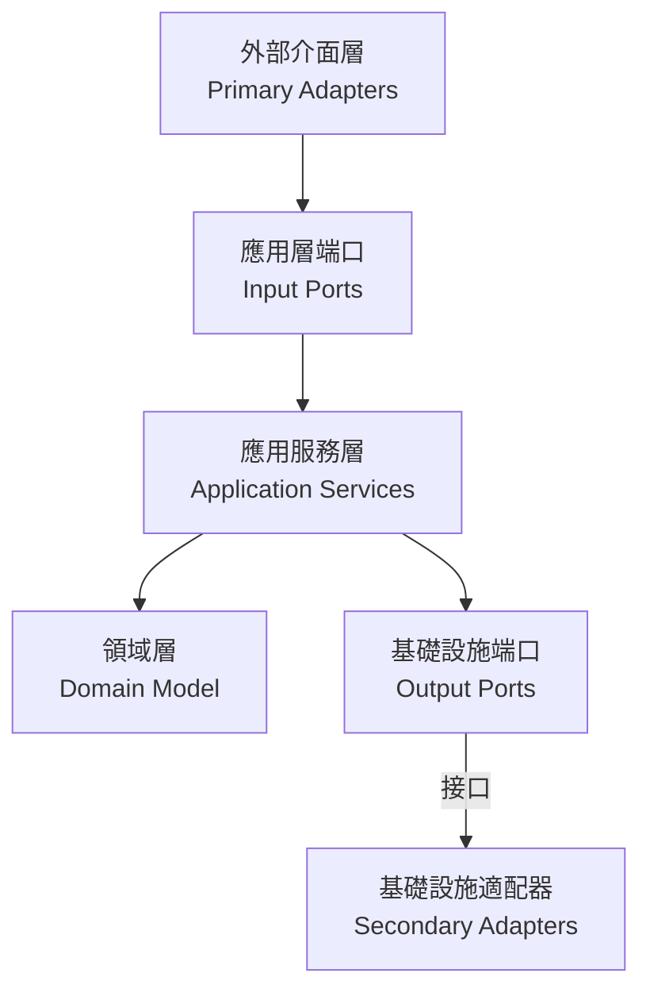

# 六角架構實現指南

## 概覽

六角架構（又稱端口與適配器架構）將應用程序分為三個主要部分：

1. **核心域（內部）**：包含業務邏輯和領域模型
2. **端口（中間層）**：定義與外部世界交互的接口
3. **適配器（外部）**：連接外部世界與應用程序核心

## 界限上下文 (Bounded Contexts)

系統被劃分為六個主要的界限上下文，每個上下文專注於特定的業務領域：

1. **訂單上下文 (Order Context)**
   - 負責訂單的創建、修改和生命週期管理
   - 核心聚合根：`Order`
   - 主要值對象：`OrderId`、`OrderItem`、`OrderStatus`

2. **支付上下文 (Payment Context)**
   - 處理訂單支付、退款和支付狀態管理
   - 核心聚合根：`Payment`
   - 主要值對象：`PaymentId`、`PaymentMethod`、`PaymentStatus`

3. **庫存上下文 (Inventory Context)**
   - 管理產品庫存、預留和釋放
   - 核心聚合根：`Inventory`
   - 主要值對象：`InventoryId`、`ReservationId`、`InventoryStatus`

4. **配送上下文 (Delivery Context)**
   - 處理訂單配送和物流
   - 核心聚合根：`Delivery`
   - 主要值對象：`DeliveryId`、`DeliveryStatus`

5. **通知上下文 (Notification Context)**
   - 管理系統通知的發送和狀態
   - 核心聚合根：`Notification`
   - 主要值對象：`NotificationId`、`NotificationType`、`NotificationChannel`、`NotificationStatus`

6. **工作流上下文 (Workflow Context)**
   - 協調訂單從創建到完成的整個生命週期
   - 核心聚合根：`OrderWorkflow`
   - 主要值對象：`WorkflowId`、`WorkflowStatus`

## 實現細節

### 領域層（Domain Layer）

領域模型實現了核心業務邏輯，完全獨立於外部依賴：

- **聚合根**：
  - `Order`：訂單聚合根，包含訂單狀態控制和業務規則
  - `Inventory`：庫存聚合根，管理產品庫存和預留
  - `Delivery`：配送聚合根，管理訂單的配送流程
  - `Payment`：支付聚合根，處理訂單支付和退款
  - `Notification`：通知聚合根，管理系統通知的發送和狀態
  - `OrderWorkflow`：工作流聚合根，協調訂單處理流程

- **值對象**：
  - `OrderId`、`CustomerId`：唯一標識符
  - `Money`：金額值對象，封裝金額和貨幣
  - `OrderItem`：訂單項值對象
  - `OrderStatus`、`DeliveryStatus`、`PaymentStatus`、`NotificationStatus`、`WorkflowStatus`：狀態枚舉及其轉換規則
  - `PaymentMethod`、`NotificationChannel`、`NotificationType`：業務概念值對象

- **工廠**：
  - `OrderFactory`：負責訂單的創建和重建
  - `DomainFactory`：通用工廠接口

- **領域事件**：
  - `OrderCreatedEvent`：訂單創建事件
  - `OrderItemAddedEvent`：訂單項添加事件
  - `PaymentRequestedEvent`：支付請求事件
  - `PaymentCompletedEvent`：支付完成事件
  - `PaymentFailedEvent`：支付失敗事件

### 端口層（Ports Layer）

定義了應用程序與外部世界交互的接口：

- **輸入端口（Primary Ports）**：
  - `OrderManagementUseCase`：定義系統對外提供的所有訂單管理功能
  - `PaymentManagementUseCase`：定義支付管理功能

- **輸出端口（Secondary Ports）**：
  - `OrderPersistencePort`：定義訂單持久化操作的接口
  - `OrderRepository`：領域層定義的儲存庫接口
  - `PaymentServicePort`：定義支付服務的接口
  - `LogisticsServicePort`：定義物流服務的接口

### 應用服務層（Application Layer）

協調領域對象和外部資源的交互：

- **應用服務**：
  - `OrderApplicationService`：實現訂單管理用例，協調各個端口之間的交互
  - `PaymentApplicationService`：實現支付管理用例

- **DTO**：
  - `CreateOrderRequestDto`：創建訂單的請求數據
  - `AddOrderItemRequestDto`：添加訂單項的請求數據
  - `OrderResponse`：訂單操作的響應數據
  - `PaymentRequestDto`、`PaymentResponseDto`：支付相關的數據傳輸對象

- **命令**：
  - `CreateOrderCommand`：創建訂單命令
  - `AddOrderItemCommand`：添加訂單項命令
  - `ProcessPaymentCommand`：處理支付命令

### 適配器層（Adapters Layer）

連接外部世界與應用核心：

- **主級適配器（Primary/Driving Adapters）**：
  - `OrderController`：處理HTTP請求，並轉發給應用服務
  - `PaymentController`：處理支付相關的HTTP請求

- **次級適配器（Secondary/Driven Adapters）**：
  - `OrderRepositoryAdapter`：實現訂單持久化操作
  - `JpaOrderRepository`：Spring Data JPA 儲存庫
  - `ExternalPaymentAdapter`：實現支付服務整合
  - `ExternalLogisticsAdapter`：實現物流服務整合

- **防腐層（Anti-Corruption Layer）**：
  - `LogisticsAntiCorruptionLayer`：隔離外部物流系統的差異

### 基礎設施層（Infrastructure Layer）

提供技術實現和跨切面關注點：

- **持久化**：
  - `JpaOrderEntity`、`JpaOrderItemEntity`：JPA 實體類
  - `OrderMapper`：領域模型和 JPA 實體之間的轉換

- **事件處理**：
  - `SimpleEventBus`：簡單的事件總線實現

- **Saga 協調器**：
  - `OrderProcessingSaga`：協調訂單處理的各個步驟
  - `SagaDefinition`：Saga 定義接口

## 上下文間的集成

界限上下文之間通過以下方式進行集成：

1. **領域事件**：
   - 訂單上下文發布 `OrderCreatedEvent`，支付上下文訂閱並處理
   - 支付上下文發布 `PaymentCompletedEvent`，訂單上下文訂閱並更新訂單狀態

2. **Saga 協調器**：
   - `OrderProcessingSaga` 協調訂單、支付、庫存和配送上下文之間的交互
   - 實現跨上下文的業務流程和補償邏輯

3. **工作流上下文**：
   - `OrderWorkflow` 聚合根管理訂單從創建到完成的整個生命週期
   - 協調不同上下文之間的狀態轉換

4. **共享內核**：
   - `common` 包中的值對象（如 `Money`、`OrderId`）被多個上下文共享
   - 提供統一的基礎設施服務（如事件發布）

## 依賴方向

六角架構中的一個核心原則是依賴方向始終指向內部：



## 實現優勢

1. **業務邏輯獨立性**：
   - 領域模型不依賴任何外部技術或框架
   - 可以獨立測試核心業務邏輯
   - 例如：`Order` 聚合根不依賴於 Spring 或 JPA

2. **可測試性**：
   - 通過依賴倒置原則，可以輕鬆地模擬外部依賴
   - 可以為每個組件編寫單元測試
   - 例如：可以使用模擬的 `PaymentServicePort` 測試 `OrderApplicationService`

3. **靈活的技術選擇**：
   - 可以替換任何外部依賴而不影響核心業務邏輯
   - 例如：可以從 JPA 切換到 MongoDB，只需實現新的適配器

4. **明確的責任邊界**：
   - 每個組件都有明確定義的職責
   - 簡化系統的理解和維護
   - 例如：`OrderController` 只負責處理 HTTP 請求，不包含業務邏輯

## 項目中的設計模式

1. **工廠模式**：
   - `OrderFactory` 負責創建和重建訂單聚合根
   - 封裝了複雜的對象創建邏輯

2. **適配器模式**：
   - `OrderRepositoryAdapter` 將領域儲存庫接口適配到 JPA 實現
   - `ExternalPaymentAdapter` 將外部支付系統適配到內部接口

3. **命令模式**：
   - 使用命令對象（如 `CreateOrderCommand`）封裝請求
   - 支持操作的參數化和序列化

4. **觀察者模式**：
   - 通過領域事件實現組件間的鬆耦合通信
   - 例如：`OrderCreatedEvent` 通知其他組件訂單已創建

5. **Saga 模式**：
   - `OrderProcessingSaga` 協調跨多個聚合根的複雜業務流程
   - 提供補償機制處理失敗情況

## 模組結構設計

### 套件組織原則

```
src/main/java/
├── domain/                          # 領域層
│   ├── order/                      # 訂單界限上下文
│   │   ├── model/                  # 領域模型
│   │   │   ├── aggregate/          # 聚合根
│   │   │   ├── entity/             # 實體
│   │   │   └── valueobject/        # 值對象
│   │   ├── events/                 # 領域事件
│   │   ├── repository/             # 儲存庫接口
│   │   └── service/                # 領域服務
│   └── common/                     # 共享內核
├── application/                     # 應用層
│   ├── order/                      # 訂單應用服務
│   │   ├── command/                # 命令
│   │   ├── dto/                    # 數據傳輸對象
│   │   └── service/                # 應用服務
│   └── port/                       # 端口定義
│       ├── input/                  # 輸入端口
│       └── output/                 # 輸出端口
├── infrastructure/                  # 基礎設施層
│   ├── persistence/                # 持久化適配器
│   ├── messaging/                  # 消息適配器
│   ├── external/                   # 外部服務適配器
│   └── configuration/              # 配置
└── interfaces/                     # 介面層
    ├── rest/                       # REST 控制器
    ├── graphql/                    # GraphQL 適配器
    └── messaging/                  # 消息監聽器
```

### 依賴管理

```java
// 領域層 - 不依賴任何外部框架
public interface OrderRepository {
    Order save(Order order);
    Optional<Order> findById(OrderId orderId);
}

// 應用層 - 依賴領域層接口
@Service
@Transactional
public class OrderApplicationService {
    private final OrderRepository orderRepository;
    private final PaymentServicePort paymentService;
    
    // 使用依賴注入，但不依賴具體實現
}

// 基礎設施層 - 實現領域層接口
@Repository
public class JpaOrderRepositoryAdapter implements OrderRepository {
    private final JpaOrderRepository jpaRepository;
    private final OrderMapper mapper;
    
    @Override
    public Order save(Order order) {
        JpaOrderEntity entity = mapper.toEntity(order);
        JpaOrderEntity saved = jpaRepository.save(entity);
        return mapper.toDomain(saved);
    }
}
```

## 測試策略

### 1. 單元測試（領域層）

```java
@ExtendWith(MockitoExtension.class)
class OrderTest {
    
    @Test
    void should_create_order_with_valid_items() {
        // Given
        OrderId orderId = OrderId.generate();
        CustomerId customerId = CustomerId.of("CUST-001");
        
        // When
        Order order = new Order(orderId, customerId);
        order.addItem(ProductId.of("PROD-001"), 2, Money.of(100));
        
        // Then
        assertThat(order.getItems()).hasSize(1);
        assertThat(order.getTotalAmount()).isEqualTo(Money.of(200));
    }
}
```

### 2. 整合測試（應用層）

```java
@SpringBootTest
@Transactional
class OrderApplicationServiceIntegrationTest {
    
    @Autowired
    private OrderApplicationService orderService;
    
    @MockBean
    private PaymentServicePort paymentService;
    
    @Test
    void should_create_order_and_process_payment() {
        // Given
        CreateOrderCommand command = new CreateOrderCommand(
            CustomerId.of("CUST-001"),
            List.of(new OrderItemDto("PROD-001", 2, Money.of(100)))
        );
        
        when(paymentService.processPayment(any())).thenReturn(PaymentResult.success());
        
        // When
        OrderResponse response = orderService.createOrder(command);
        
        // Then
        assertThat(response.getOrderId()).isNotNull();
        verify(paymentService).processPayment(any());
    }
}
```

### 3. 架構測試

```java
@ArchTest
static final ArchRule domainLayerRules = classes()
    .that().resideInAPackage("..domain..")
    .should().onlyDependOnClassesThat()
    .resideInAnyPackage("..domain..", "java..", "org.springframework..");

@ArchTest
static final ArchRule applicationLayerRules = classes()
    .that().resideInAPackage("..application..")
    .should().onlyDependOnClassesThat()
    .resideInAnyPackage("..application..", "..domain..", "java..", "org.springframework..");
```

## 相關圖表

- [六角架構概覽圖 (PlantUML)](../../diagrams/viewpoints/functional/hexagonal-architecture-overview.puml)
- [六角架構概覽圖 (Mermaid)](../../diagrams/viewpoints/development/hexagonal-architecture.mmd)
- [系統整體架構圖](../../diagrams/viewpoints/functional/system-overview.mmd)
- [DDD分層架構圖](../../diagrams/viewpoints/development/ddd-layered-architecture.mmd)
- [多環境配置圖](../../diagrams/multi_environment.mmd)
- [可觀測性架構圖](../../diagrams/observability_architecture.mmd)

## 與其他視點的關聯

- **[功能視點](../functional/README.md)**: 領域模型設計和聚合根定義
- **[資訊視點](../information/README.md)**: 資料流和事件驅動架構
- **[並發視點](../concurrency/README.md)**: 交易邊界和並發處理
- **[部署視點](../deployment/README.md)**: 模組化部署和容器化策略

## 進一步改進

以下是可能的後續改進方向：

1. **實現事件驅動架構**：
   - 完善領域事件的發布和訂閱機制
   - 實現基於事件的跨界上下文通信
   - 考慮使用 Apache Kafka 或 RabbitMQ 進行事件傳遞

2. **微服務拆分**：
   - 考慮將訂單、支付、物流等領域拆分為獨立微服務
   - 定義服務間的契約和通信模式
   - 使用 API 網關統一對外接口

3. **CQRS模式引入**：
   - 分離命令和查詢職責
   - 為複雜查詢創建專用的讀模型
   - 優化讀寫性能

4. **添加跨切面關注點**：
   - 實現統一的日誌記錄和監控機制
   - 增強安全控制和認證授權
   - 實現分佈式追蹤，提高系統可觀測性

5. **增強錯誤處理**：
   - 實現更細粒度的業務異常
   - 統一異常處理機制
   - 提供更友好的錯誤響應

6. **優化 Saga 實現**：
   - 實現持久化 Saga 狀態
   - 支持 Saga 恢復和重試
   - 增強補償邏輯的健壯性