# 六角架構實現指南

## 概覽

六角架構（又稱端口與適配器架構）將應用程序分為三個主要部分：

1. **核心域（內部）**：包含業務邏輯和領域模型
2. **端口（中間層）**：定義與外部世界交互的接口
3. **適配器（外部）**：連接外部世界與應用程序核心

## 界限上下文 (Bounded Contexts)

系統被劃分為六個主要的界限上下文，每個上下文專注於特定的業務領域：

1. **訂單上下文 (Order Context)**
   - 負責訂單的創建、修改和生命週期管理
   - 核心聚合根：`Order`
   - 主要值對象：`OrderId`、`OrderItem`、`OrderStatus`

2. **支付上下文 (Payment Context)**
   - 處理訂單支付、退款和支付狀態管理
   - 核心聚合根：`Payment`
   - 主要值對象：`PaymentId`、`PaymentMethod`、`PaymentStatus`

3. **庫存上下文 (Inventory Context)**
   - 管理產品庫存、預留和釋放
   - 核心聚合根：`Inventory`
   - 主要值對象：`InventoryId`、`ReservationId`、`InventoryStatus`

4. **配送上下文 (Delivery Context)**
   - 處理訂單配送和物流
   - 核心聚合根：`Delivery`
   - 主要值對象：`DeliveryId`、`DeliveryStatus`

5. **通知上下文 (Notification Context)**
   - 管理系統通知的發送和狀態
   - 核心聚合根：`Notification`
   - 主要值對象：`NotificationId`、`NotificationType`、`NotificationChannel`、`NotificationStatus`

6. **工作流上下文 (Workflow Context)**
   - 協調訂單從創建到完成的整個生命週期
   - 核心聚合根：`OrderWorkflow`
   - 主要值對象：`WorkflowId`、`WorkflowStatus`

## 實現細節

### 領域層（Domain Layer）

領域模型實現了核心業務邏輯，完全獨立於外部依賴：

- **聚合根**：
  - `Order`：訂單聚合根，包含訂單狀態控制和業務規則
  - `Inventory`：庫存聚合根，管理產品庫存和預留
  - `Delivery`：配送聚合根，管理訂單的配送流程
  - `Payment`：支付聚合根，處理訂單支付和退款
  - `Notification`：通知聚合根，管理系統通知的發送和狀態
  - `OrderWorkflow`：工作流聚合根，協調訂單處理流程

- **值對象**：
  - `OrderId`、`CustomerId`：唯一標識符
  - `Money`：金額值對象，封裝金額和貨幣
  - `OrderItem`：訂單項值對象
  - `OrderStatus`、`DeliveryStatus`、`PaymentStatus`、`NotificationStatus`、`WorkflowStatus`：狀態枚舉及其轉換規則
  - `PaymentMethod`、`NotificationChannel`、`NotificationType`：業務概念值對象

- **工廠**：
  - `OrderFactory`：負責訂單的創建和重建
  - `DomainFactory`：通用工廠接口

- **領域事件**：
  - `OrderCreatedEvent`：訂單創建事件
  - `OrderItemAddedEvent`：訂單項添加事件
  - `PaymentRequestedEvent`：支付請求事件
  - `PaymentCompletedEvent`：支付完成事件
  - `PaymentFailedEvent`：支付失敗事件

### 端口層（Ports Layer）

定義了應用程序與外部世界交互的接口：

- **輸入端口（Primary Ports）**：
  - `OrderManagementUseCase`：定義系統對外提供的所有訂單管理功能
  - `PaymentManagementUseCase`：定義支付管理功能

- **輸出端口（Secondary Ports）**：
  - `OrderPersistencePort`：定義訂單持久化操作的接口
  - `OrderRepository`：領域層定義的儲存庫接口
  - `PaymentServicePort`：定義支付服務的接口
  - `LogisticsServicePort`：定義物流服務的接口

### 應用服務層（Application Layer）

協調領域對象和外部資源的交互：

- **應用服務**：
  - `OrderApplicationService`：實現訂單管理用例，協調各個端口之間的交互
  - `PaymentApplicationService`：實現支付管理用例

- **DTO**：
  - `CreateOrderRequestDto`：創建訂單的請求數據
  - `AddOrderItemRequestDto`：添加訂單項的請求數據
  - `OrderResponse`：訂單操作的響應數據
  - `PaymentRequestDto`、`PaymentResponseDto`：支付相關的數據傳輸對象

- **命令**：
  - `CreateOrderCommand`：創建訂單命令
  - `AddOrderItemCommand`：添加訂單項命令
  - `ProcessPaymentCommand`：處理支付命令

### 適配器層（Adapters Layer）

連接外部世界與應用核心：

- **主級適配器（Primary/Driving Adapters）**：
  - `OrderController`：處理HTTP請求，並轉發給應用服務
  - `PaymentController`：處理支付相關的HTTP請求

- **次級適配器（Secondary/Driven Adapters）**：
  - `OrderRepositoryAdapter`：實現訂單持久化操作
  - `JpaOrderRepository`：Spring Data JPA 儲存庫
  - `ExternalPaymentAdapter`：實現支付服務整合
  - `ExternalLogisticsAdapter`：實現物流服務整合

- **防腐層（Anti-Corruption Layer）**：
  - `LogisticsAntiCorruptionLayer`：隔離外部物流系統的差異

### 基礎設施層（Infrastructure Layer）

提供技術實現和跨切面關注點：

- **持久化**：
  - `JpaOrderEntity`、`JpaOrderItemEntity`：JPA 實體類
  - `OrderMapper`：領域模型和 JPA 實體之間的轉換

- **事件處理**：
  - `SimpleEventBus`：簡單的事件總線實現

- **Saga 協調器**：
  - `OrderProcessingSaga`：協調訂單處理的各個步驟
  - `SagaDefinition`：Saga 定義接口

## 上下文間的集成

界限上下文之間通過以下方式進行集成：

1. **領域事件**：
   - 訂單上下文發布 `OrderCreatedEvent`，支付上下文訂閱並處理
   - 支付上下文發布 `PaymentCompletedEvent`，訂單上下文訂閱並更新訂單狀態

2. **Saga 協調器**：
   - `OrderProcessingSaga` 協調訂單、支付、庫存和配送上下文之間的交互
   - 實現跨上下文的業務流程和補償邏輯

3. **工作流上下文**：
   - `OrderWorkflow` 聚合根管理訂單從創建到完成的整個生命週期
   - 協調不同上下文之間的狀態轉換

4. **共享內核**：
   - `common` 包中的值對象（如 `Money`、`OrderId`）被多個上下文共享
   - 提供統一的基礎設施服務（如事件發布）

## 依賴方向

六角架構中的一個核心原則是依賴方向始終指向內部：

```mermaid
graph TD
    A[外部介面層<br/>Primary Adapters] --> B[應用層端口<br/>Input Ports]
    B --> C[應用服務層<br/>Application Services]
    C --> D[領域層<br/>Domain Model]
    C --> E[基礎設施端口<br/>Output Ports]
    E -- 接口 --> F[基礎設施適配器<br/>Secondary Adapters]
```



## 實現優勢

1. **業務邏輯獨立性**：
   - 領域模型不依賴任何外部技術或框架
   - 可以獨立測試核心業務邏輯
   - 例如：`Order` 聚合根不依賴於 Spring 或 JPA

2. **可測試性**：
   - 通過依賴倒置原則，可以輕鬆地模擬外部依賴
   - 可以為每個組件編寫單元測試
   - 例如：可以使用模擬的 `PaymentServicePort` 測試 `OrderApplicationService`

3. **靈活的技術選擇**：
   - 可以替換任何外部依賴而不影響核心業務邏輯
   - 例如：可以從 JPA 切換到 MongoDB，只需實現新的適配器

4. **明確的責任邊界**：
   - 每個組件都有明確定義的職責
   - 簡化系統的理解和維護
   - 例如：`OrderController` 只負責處理 HTTP 請求，不包含業務邏輯

## 項目中的設計模式

1. **工廠模式**：
   - `OrderFactory` 負責創建和重建訂單聚合根
   - 封裝了複雜的對象創建邏輯

2. **適配器模式**：
   - `OrderRepositoryAdapter` 將領域儲存庫接口適配到 JPA 實現
   - `ExternalPaymentAdapter` 將外部支付系統適配到內部接口

3. **命令模式**：
   - 使用命令對象（如 `CreateOrderCommand`）封裝請求
   - 支持操作的參數化和序列化

4. **觀察者模式**：
   - 通過領域事件實現組件間的鬆耦合通信
   - 例如：`OrderCreatedEvent` 通知其他組件訂單已創建

5. **Saga 模式**：
   - `OrderProcessingSaga` 協調跨多個聚合根的複雜業務流程
   - 提供補償機制處理失敗情況

## 模組結構設計

### 套件組織原則

```
src/main/java/
├── domain/                          # 領域層
│   ├── order/                      # 訂單界限上下文
│   │   ├── model/                  # 領域模型
│   │   │   ├── aggregate/          # 聚合根
│   │   │   ├── entity/             # 實體
│   │   │   └── valueobject/        # 值對象
│   │   ├── events/                 # 領域事件
│   │   ├── repository/             # 儲存庫接口
│   │   └── service/                # 領域服務
│   └── common/                     # 共享內核
├── application/                     # 應用層
│   ├── order/                      # 訂單應用服務
│   │   ├── command/                # 命令
│   │   ├── dto/                    # 數據傳輸對象
│   │   └── service/                # 應用服務
│   └── port/                       # 端口定義
│       ├── input/                  # 輸入端口
│       └── output/                 # 輸出端口
├── infrastructure/                  # 基礎設施層
│   ├── persistence/                # 持久化適配器
│   ├── messaging/                  # 消息適配器
│   ├── external/                   # 外部服務適配器
│   └── configuration/              # 配置
└── interfaces/                     # 介面層
    ├── rest/                       # REST 控制器
    ├── graphql/                    # GraphQL 適配器
    └── messaging/                  # 消息監聽器
```

### 依賴管理

```java
// 領域層 - 不依賴任何外部框架
public interface OrderRepository {
    Order save(Order order);
    Optional<Order> findById(OrderId orderId);
}

// 應用層 - 依賴領域層接口
@Service
@Transactional
public class OrderApplicationService {
    private final OrderRepository orderRepository;
    private final PaymentServicePort paymentService;
    
    // 使用依賴注入，但不依賴具體實現
}

// 基礎設施層 - 實現領域層接口
@Repository
public class JpaOrderRepositoryAdapter implements OrderRepository {
    private final JpaOrderRepository jpaRepository;
    private final OrderMapper mapper;
    
    @Override
    public Order save(Order order) {
        JpaOrderEntity entity = mapper.toEntity(order);
        JpaOrderEntity saved = jpaRepository.save(entity);
        return mapper.toDomain(saved);
    }
}
```

## 測試策略

### 1. 單元測試（領域層）

```java
@ExtendWith(MockitoExtension.class)
class OrderTest {
    
    @Test
    void should_create_order_with_valid_items() {
        // Given
        OrderId orderId = OrderId.generate();
        CustomerId customerId = CustomerId.of("CUST-001");
        
        // When
        Order order = new Order(orderId, customerId);
        order.addItem(ProductId.of("PROD-001"), 2, Money.of(100));
        
        // Then
        assertThat(order.getItems()).hasSize(1);
        assertThat(order.getTotalAmount()).isEqualTo(Money.of(200));
    }
}
```

### 2. 整合測試（應用層）

```java
@SpringBootTest
@Transactional
class OrderApplicationServiceIntegrationTest {
    
    @Autowired
    private OrderApplicationService orderService;
    
    @MockBean
    private PaymentServicePort paymentService;
    
    @Test
    void should_create_order_and_process_payment() {
        // Given
        CreateOrderCommand command = new CreateOrderCommand(
            CustomerId.of("CUST-001"),
            List.of(new OrderItemDto("PROD-001", 2, Money.of(100)))
        );
        
        when(paymentService.processPayment(any())).thenReturn(PaymentResult.success());
        
        // When
        OrderResponse response = orderService.createOrder(command);
        
        // Then
        assertThat(response.getOrderId()).isNotNull();
        verify(paymentService).processPayment(any());
    }
}
```

### 3. 架構測試

```java
@ArchTest
static final ArchRule domainLayerRules = classes()
    .that().resideInAPackage("..domain..")
    .should().onlyDependOnClassesThat()
    .resideInAnyPackage("..domain..", "java..", "org.springframework..");

@ArchTest
static final ArchRule applicationLayerRules = classes()
    .that().resideInAPackage("..application..")
    .should().onlyDependOnClassesThat()
    .resideInAnyPackage("..application..", "..domain..", "java..", "org.springframework..");
```

## 相關圖表

- [六角架構概覽圖 (PlantUML)](../../diagrams/viewpoints/functional/hexagonal-architecture-overview.puml)
- ## 六角架構概覽圖 (Mermaid)


- ## 系統整體架構圖

```mermaid
graph TB
    subgraph USERS ["用戶與角色"]
        CUSTOMER[👤 顧客<br/>購物與下單]
        SELLER[🏪 賣家<br/>商品管理]
        ADMIN[👨‍💼 管理員<br/>系統管理]
        DELIVERY[🚚 配送員<br/>物流配送]
    end
    
    subgraph FRONTEND ["前端應用"]
        WEB_APP[🌐 Web 應用<br/>Next.js 14 + TypeScript<br/>顧客購物界面]
        MOBILE_APP[📱 移動應用<br/>Angular 18 + TypeScript<br/>消費者應用]
        ADMIN_PANEL[🖥️ 管理面板<br/>React Admin Dashboard<br/>後台管理系統]
        SELLER_PORTAL[🏪 賣家門戶<br/>商家管理界面<br/>商品與訂單管理]
    end
    
    subgraph API_GATEWAY ["API 網關層"]
        GATEWAY[🚪 API Gateway<br/>路由與認證<br/>限流與監控]
        LOAD_BALANCER[⚖️ 負載均衡器<br/>流量分發<br/>健康檢查]
    end
    
    subgraph MICROSERVICES ["微服務架構"]
        subgraph CORE_SERVICES ["核心業務服務"]
            CUSTOMER_SVC[👤 Customer Service<br/>客戶管理服務<br/>會員系統與檔案]
            ORDER_SVC[📦 Order Service<br/>訂單管理服務<br/>訂單生命週期]
            PRODUCT_SVC[🛍️ Product Service<br/>商品管理服務<br/>商品目錄與搜尋]
            PAYMENT_SVC[💰 Payment Service<br/>支付處理服務<br/>多種支付方式]
            INVENTORY_SVC[📊 Inventory Service<br/>庫存管理服務<br/>庫存追蹤與預留]
        end
        
        subgraph BUSINESS_SERVICES ["業務支援服務"]
            CART_SVC[🛒 Shopping Cart Service<br/>購物車服務<br/>購物流程管理]
            PRICING_SVC[💲 Pricing Service<br/>定價服務<br/>動態定價與折扣]
            PROMOTION_SVC[🎁 Promotion Service<br/>促銷服務<br/>優惠券與活動]
            DELIVERY_SVC[🚚 Delivery Service<br/>配送服務<br/>物流與追蹤]
            REVIEW_SVC[⭐ Review Service<br/>評價服務<br/>商品評價系統]
        end
        
        subgraph PLATFORM_SERVICES ["平台服務"]
            NOTIFICATION_SVC[🔔 Notification Service<br/>通知服務<br/>多渠道消息推送]
            SEARCH_SVC[🔍 Search Service<br/>搜尋服務<br/>全文搜索與推薦]
            ANALYTICS_SVC[📈 Analytics Service<br/>分析服務<br/>數據統計與報表]
            AUDIT_SVC[📋 Audit Service<br/>審計服務<br/>操作日誌與合規]
        end
    end
    
    subgraph INFRASTRUCTURE ["基礎設施層"]
        subgraph DATABASES ["數據存儲"]
            POSTGRES[(🗄️ PostgreSQL<br/>主資料庫<br/>事務性數據)]
            REDIS[(⚡ Redis<br/>快取資料庫<br/>會話與快取)]
            OPENSEARCH[(🔍 OpenSearch<br/>搜尋引擎<br/>全文搜索)]
            S3[(📁 S3<br/>對象存儲<br/>文件與媒體)]
        end
        
        subgraph MESSAGE_QUEUE ["消息隊列"]
            MSK[📊 Amazon MSK<br/>Kafka 集群<br/>事件流處理]
            SQS[📬 Amazon SQS<br/>消息隊列<br/>異步任務處理]
            SNS[📢 Amazon SNS<br/>通知服務<br/>消息推送]
        end
        
        subgraph EXTERNAL_SERVICES ["外部服務"]
            STRIPE[💳 Stripe<br/>支付網關<br/>信用卡處理]
            PAYPAL[💰 PayPal<br/>支付平台<br/>數字錢包]
            EMAIL_SVC[📧 Email Service<br/>郵件服務<br/>SES/SMTP]
            SMS_SVC[📱 SMS Service<br/>簡訊服務<br/>SNS/Twilio]
            LOGISTICS[🚚 Logistics API<br/>物流服務<br/>第三方配送]
        end
    end
    
    subgraph OBSERVABILITY ["可觀測性"]
        MONITORING[📊 Monitoring<br/>Prometheus + Grafana<br/>指標監控]
        LOGGING[📝 Logging<br/>ELK Stack<br/>日誌聚合]
        TRACING[🔍 Tracing<br/>AWS X-Ray<br/>分布式追蹤]
        ALERTING[🚨 Alerting<br/>CloudWatch Alarms<br/>告警通知]
    end
    
    subgraph SECURITY ["安全與合規"]
        IAM[🔐 Identity & Access<br/>AWS IAM<br/>身份認證授權]
        WAF[🛡️ Web Application Firewall<br/>AWS WAF<br/>應用防護]
        SECRETS[🔑 Secrets Management<br/>AWS Secrets Manager<br/>密鑰管理]
        COMPLIANCE[📋 Compliance<br/>合規監控<br/>GDPR/PCI DSS]
    end
    
    %% User to Frontend Connections
    CUSTOMER --> WEB_APP
    CUSTOMER --> MOBILE_APP
    SELLER --> SELLER_PORTAL
    ADMIN --> ADMIN_PANEL
    DELIVERY --> MOBILE_APP
    
    %% Frontend to API Gateway
    WEB_APP --> GATEWAY
    MOBILE_APP --> GATEWAY
    ADMIN_PANEL --> GATEWAY
    SELLER_PORTAL --> GATEWAY
    
    %% API Gateway to Load Balancer
    GATEWAY --> LOAD_BALANCER
    
    %% Load Balancer to Core Services
    LOAD_BALANCER --> CUSTOMER_SVC
    LOAD_BALANCER --> ORDER_SVC
    LOAD_BALANCER --> PRODUCT_SVC
    LOAD_BALANCER --> PAYMENT_SVC
    LOAD_BALANCER --> INVENTORY_SVC
    
    %% Load Balancer to Business Services
    LOAD_BALANCER --> CART_SVC
    LOAD_BALANCER --> PRICING_SVC
    LOAD_BALANCER --> PROMOTION_SVC
    LOAD_BALANCER --> DELIVERY_SVC
    LOAD_BALANCER --> REVIEW_SVC
    
    %% Load Balancer to Platform Services
    LOAD_BALANCER --> NOTIFICATION_SVC
    LOAD_BALANCER --> SEARCH_SVC
    LOAD_BALANCER --> ANALYTICS_SVC
    LOAD_BALANCER --> AUDIT_SVC
    
    %% Service to Database Connections
    CUSTOMER_SVC --> POSTGRES
    ORDER_SVC --> POSTGRES
    PRODUCT_SVC --> POSTGRES
    PAYMENT_SVC --> POSTGRES
    INVENTORY_SVC --> POSTGRES
    CART_SVC --> REDIS
    PRICING_SVC --> REDIS
    PROMOTION_SVC --> POSTGRES
    DELIVERY_SVC --> POSTGRES
    REVIEW_SVC --> POSTGRES
    SEARCH_SVC --> OPENSEARCH
    ANALYTICS_SVC --> POSTGRES
    AUDIT_SVC --> POSTGRES
    
    %% Service to Cache Connections
    CUSTOMER_SVC --> REDIS
    PRODUCT_SVC --> REDIS
    PRICING_SVC --> REDIS
    SEARCH_SVC --> REDIS
    
    %% Service to Message Queue Connections
    ORDER_SVC --> MSK
    PAYMENT_SVC --> MSK
    INVENTORY_SVC --> MSK
    NOTIFICATION_SVC --> MSK
    NOTIFICATION_SVC --> SQS
    NOTIFICATION_SVC --> SNS
    ANALYTICS_SVC --> MSK
    AUDIT_SVC --> MSK
    
    %% Service to External Service Connections
    PAYMENT_SVC --> STRIPE
    PAYMENT_SVC --> PAYPAL
    NOTIFICATION_SVC --> EMAIL_SVC
    NOTIFICATION_SVC --> SMS_SVC
    DELIVERY_SVC --> LOGISTICS
    
    %% File Storage Connections
    PRODUCT_SVC --> S3
    CUSTOMER_SVC --> S3
    AUDIT_SVC --> S3
    
    %% Observability Connections
    CUSTOMER_SVC --> MONITORING
    ORDER_SVC --> MONITORING
    PRODUCT_SVC --> MONITORING
    PAYMENT_SVC --> MONITORING
    INVENTORY_SVC --> MONITORING
    CART_SVC --> MONITORING
    PRICING_SVC --> MONITORING
    PROMOTION_SVC --> MONITORING
    DELIVERY_SVC --> MONITORING
    REVIEW_SVC --> MONITORING
    NOTIFICATION_SVC --> MONITORING
    SEARCH_SVC --> MONITORING
    ANALYTICS_SVC --> MONITORING
    AUDIT_SVC --> MONITORING
    
    MONITORING --> LOGGING
    MONITORING --> TRACING
    MONITORING --> ALERTING
    
    %% Security Connections
    GATEWAY --> IAM
    GATEWAY --> WAF
    CUSTOMER_SVC --> SECRETS
    PAYMENT_SVC --> SECRETS
    NOTIFICATION_SVC --> SECRETS
    AUDIT_SVC --> COMPLIANCE
    
    %% Inter-Service Communication (Event-Driven)
    ORDER_SVC -.->|OrderCreated| INVENTORY_SVC
    ORDER_SVC -.->|OrderCreated| PAYMENT_SVC
    ORDER_SVC -.->|OrderCreated| NOTIFICATION_SVC
    PAYMENT_SVC -.->|PaymentProcessed| ORDER_SVC
    PAYMENT_SVC -.->|PaymentProcessed| DELIVERY_SVC
    INVENTORY_SVC -.->|StockReserved| ORDER_SVC
    INVENTORY_SVC -.->|StockUpdated| PRODUCT_SVC
    CUSTOMER_SVC -.->|CustomerRegistered| NOTIFICATION_SVC
    REVIEW_SVC -.->|ReviewCreated| PRODUCT_SVC
    DELIVERY_SVC -.->|DeliveryStatusChanged| ORDER_SVC
    DELIVERY_SVC -.->|DeliveryStatusChanged| NOTIFICATION_SVC
    
    %% Styling
    classDef user fill:#e3f2fd,stroke:#1976d2,stroke-width:2px
    classDef frontend fill:#e8f5e8,stroke:#388e3c,stroke-width:2px
    classDef gateway fill:#fff3e0,stroke:#f57c00,stroke-width:2px
    classDef core fill:#f3e5f5,stroke:#7b1fa2,stroke-width:2px
    classDef business fill:#e1f5fe,stroke:#0277bd,stroke-width:2px
    classDef platform fill:#fce4ec,stroke:#c2185b,stroke-width:2px
    classDef database fill:#f1f8e9,stroke:#689f38,stroke-width:2px
    classDef message fill:#fff8e1,stroke:#fbc02d,stroke-width:2px
    classDef external fill:#ffebee,stroke:#d32f2f,stroke-width:2px
    classDef observability fill:#f3e5f5,stroke:#9c27b0,stroke-width:2px
    classDef security fill:#e8eaf6,stroke:#3f51b5,stroke-width:2px
    
    class CUSTOMER,SELLER,ADMIN,DELIVERY user
    class WEB_APP,MOBILE_APP,ADMIN_PANEL,SELLER_PORTAL frontend
    class GATEWAY,LOAD_BALANCER gateway
    class CUSTOMER_SVC,ORDER_SVC,PRODUCT_SVC,PAYMENT_SVC,INVENTORY_SVC core
    class CART_SVC,PRICING_SVC,PROMOTION_SVC,DELIVERY_SVC,REVIEW_SVC business
    class NOTIFICATION_SVC,SEARCH_SVC,ANALYTICS_SVC,AUDIT_SVC platform
    class POSTGRES,REDIS,OPENSEARCH,S3 database
    class MSK,SQS,SNS message
    class STRIPE,PAYPAL,EMAIL_SVC,SMS_SVC,LOGISTICS external
    class MONITORING,LOGGING,TRACING,ALERTING observability
    class IAM,WAF,SECRETS,COMPLIANCE security
```


- ## DDD分層架構圖

```mermaid
graph TB
    subgraph UI ["🖥️ 用戶界面層 (User Interface Layer)"]
        direction LR
        WEB_APP["Web 應用<br/>Next.js 14"]
        MOBILE_APP["移動應用<br/>Angular 18"]
        ADMIN_PANEL["管理面板<br/>React Admin"]
        API_DOCS["API 文檔<br/>Swagger UI"]
    end
    
    subgraph APP ["⚙️ 應用層 (Application Layer)"]
        direction TB
        subgraph CONTROLLERS ["REST Controllers"]
            direction LR
            ORDER_CTRL["OrderController"]
            CUSTOMER_CTRL["CustomerController"]
            PRODUCT_CTRL["ProductController"]
            PAYMENT_CTRL["PaymentController"]
            CART_CTRL["ShoppingCartController"]
            PROMOTION_CTRL["PromotionController"]
        end
        
        subgraph APP_SERVICES ["Application Services"]
            direction LR
            ORDER_APP_SVC["OrderApplicationService"]
            CUSTOMER_APP_SVC["CustomerApplicationService"]
            PRODUCT_APP_SVC["ProductApplicationService"]
            PAYMENT_APP_SVC["PaymentApplicationService"]
            CART_APP_SVC["ShoppingCartApplicationService"]
            INVENTORY_APP_SVC["InventoryApplicationService"]
            PRICING_APP_SVC["PricingApplicationService"]
            PROMOTION_APP_SVC["PromotionApplicationService"]
            NOTIFICATION_APP_SVC["NotificationApplicationService"]
            OBSERVABILITY_APP_SVC["ObservabilityApplicationService"]
            STATS_APP_SVC["StatsApplicationService"]
            MONITORING_APP_SVC["MonitoringApplicationService"]
        end
        
        subgraph DTOS ["DTOs & Event Handling"]
            direction LR
            ORDER_DTO["OrderDTO"]
            CUSTOMER_DTO["CustomerDTO"]
            PRODUCT_DTO["ProductDTO"]
            DTO_MAPPER["DTOMapper"]
            EVENT_HANDLER["DomainEventHandler"]
            EVENT_PUBLISHER["EventPublisher"]
        end
    end
    
    subgraph DOMAIN ["🏛️ 領域層 (Domain Layer)"]
        direction TB
        subgraph AGGREGATES ["Aggregate Roots"]
            direction LR
            ORDER_AGG["Order<br/>@AggregateRoot"]
            CUSTOMER_AGG["Customer<br/>@AggregateRoot"]
            PRODUCT_AGG["Product<br/>@AggregateRoot"]
            PAYMENT_AGG["Payment<br/>@AggregateRoot"]
            CART_AGG["ShoppingCart<br/>@AggregateRoot"]
            INVENTORY_AGG["Inventory<br/>@AggregateRoot"]
            PROMOTION_AGG["Promotion<br/>@AggregateRoot"]
            DELIVERY_AGG["Delivery<br/>@AggregateRoot"]
            NOTIFICATION_AGG["Notification<br/>@AggregateRoot"]
            REVIEW_AGG["Review<br/>@AggregateRoot"]
            SELLER_AGG["Seller<br/>@AggregateRoot"]
            OBSERVABILITY_AGG["Observability<br/>@AggregateRoot"]
        end
        
        subgraph DOMAIN_COMPONENTS ["Domain Components"]
            direction LR
            subgraph ENTITIES ["Entities"]
                ORDER_ITEM["OrderItem"]
                CUSTOMER_PROFILE["CustomerProfile"]
                PRODUCT_VARIANT["ProductVariant"]
                PAYMENT_METHOD["PaymentMethod"]
                CART_ITEM["CartItem"]
            end
            
            subgraph VALUE_OBJECTS ["Value Objects"]
                MONEY["Money"]
                ADDRESS["Address"]
                EMAIL["Email"]
                ORDER_ID["OrderId"]
                CUSTOMER_ID["CustomerId"]
                PRODUCT_ID["ProductId"]
            end
            
            subgraph DOMAIN_EVENTS ["Domain Events"]
                ORDER_CREATED["OrderCreatedEvent"]
                PAYMENT_PROCESSED["PaymentProcessedEvent"]
                CUSTOMER_REGISTERED["CustomerRegisteredEvent"]
                INVENTORY_RESERVED["InventoryReservedEvent"]
                CART_UPDATED["CartUpdatedEvent"]
                PROMOTION_APPLIED["PromotionAppliedEvent"]
            end
        end
        
        subgraph DOMAIN_SERVICES ["Domain Services & Repositories"]
            direction LR
            subgraph DOM_SERVICES ["Domain Services"]
                ORDER_PRICING_SVC["OrderPricingService"]
                PAYMENT_VALIDATION_SVC["PaymentValidationService"]
                PROMOTION_CALCULATION_SVC["PromotionCalculationService"]
                INVENTORY_ALLOCATION_SVC["InventoryAllocationService"]
            end
            
            subgraph REPOSITORIES ["Repository Interfaces"]
                ORDER_REPO_INTF["OrderRepository"]
                CUSTOMER_REPO_INTF["CustomerRepository"]
                PRODUCT_REPO_INTF["ProductRepository"]
                PAYMENT_REPO_INTF["PaymentRepository"]
                INVENTORY_REPO_INTF["InventoryRepository"]
                PROMOTION_REPO_INTF["PromotionRepository"]
            end
            
            subgraph PORTS ["Port Interfaces"]
                PAYMENT_PORT["PaymentPort"]
                NOTIFICATION_PORT["NotificationPort"]
                EVENT_PUBLISHER_PORT["EventPublisherPort"]
                CACHE_PORT["CachePort"]
            end
        end
    end
    
    subgraph INFRA ["🔧 基礎設施層 (Infrastructure Layer)"]
        direction TB
        subgraph PERSISTENCE ["Persistence Layer"]
            direction LR
            JPA_ORDER_REPO["JpaOrderRepository"]
            JPA_CUSTOMER_REPO["JpaCustomerRepository"]
            JPA_PRODUCT_REPO["JpaProductRepository"]
            JPA_PAYMENT_REPO["JpaPaymentRepository"]
            JPA_INVENTORY_REPO["JpaInventoryRepository"]
            JPA_PROMOTION_REPO["JpaPromotionRepository"]
        end
        
        subgraph ADAPTERS ["External Adapters"]
            direction LR
            STRIPE_ADAPTER["StripePaymentAdapter"]
            SES_ADAPTER["SesEmailAdapter"]
            SNS_ADAPTER["SnsNotificationAdapter"]
            SMS_ADAPTER["SmsNotificationService"]
            MSK_EVENT_ADAPTER["MskEventAdapter"]
            REDIS_ADAPTER["RedisCacheAdapter"]
            OPENSEARCH_ADAPTER["OpenSearchAdapter"]
        end
        
        subgraph CONFIG ["Configuration"]
            direction LR
            DEV_CONFIG["DevelopmentConfiguration"]
            PROD_CONFIG["ProductionConfiguration"]
            PROFILE_VALIDATOR["ProfileActivationValidator"]
        end
    end
    
    subgraph STORAGE ["💾 數據存儲層 (Data Storage Layer)"]
        direction LR
        POSTGRESQL[("PostgreSQL<br/>主資料庫")]
        H2_DB[("H2 Database<br/>開發測試")]
        REDIS_CACHE[("Redis<br/>快取")]
        OPENSEARCH_DB[("OpenSearch<br/>搜尋")]
        MSK_STREAM[("MSK<br/>事件流")]
        S3_STORAGE[("S3<br/>對象存儲")]
    end
    
    %% Layer Dependencies
    UI --> APP
    APP --> DOMAIN
    DOMAIN --> INFRA
    INFRA --> STORAGE
    
    %% Key Connections
    WEB_APP --> ORDER_CTRL
    MOBILE_APP --> CART_CTRL
    ADMIN_PANEL --> STATS_APP_SVC
    
    ORDER_CTRL --> ORDER_APP_SVC
    CUSTOMER_CTRL --> CUSTOMER_APP_SVC
    PRODUCT_CTRL --> PRODUCT_APP_SVC
    PAYMENT_CTRL --> PAYMENT_APP_SVC
    CART_CTRL --> CART_APP_SVC
    PROMOTION_CTRL --> PROMOTION_APP_SVC
    
    ORDER_APP_SVC --> ORDER_AGG
    CUSTOMER_APP_SVC --> CUSTOMER_AGG
    PRODUCT_APP_SVC --> PRODUCT_AGG
    PAYMENT_APP_SVC --> PAYMENT_AGG
    CART_APP_SVC --> CART_AGG
    INVENTORY_APP_SVC --> INVENTORY_AGG
    PRICING_APP_SVC --> ORDER_PRICING_SVC
    PROMOTION_APP_SVC --> PROMOTION_AGG
    NOTIFICATION_APP_SVC --> NOTIFICATION_AGG
    OBSERVABILITY_APP_SVC --> OBSERVABILITY_AGG
    
    ORDER_AGG --> ORDER_CREATED
    PAYMENT_AGG --> PAYMENT_PROCESSED
    CUSTOMER_AGG --> CUSTOMER_REGISTERED
    INVENTORY_AGG --> INVENTORY_RESERVED
    CART_AGG --> CART_UPDATED
    PROMOTION_AGG --> PROMOTION_APPLIED
    
    ORDER_CREATED --> EVENT_HANDLER
    PAYMENT_PROCESSED --> EVENT_HANDLER
    CUSTOMER_REGISTERED --> EVENT_HANDLER
    EVENT_HANDLER --> EVENT_PUBLISHER
    
    ORDER_APP_SVC --> ORDER_REPO_INTF
    CUSTOMER_APP_SVC --> CUSTOMER_REPO_INTF
    PRODUCT_APP_SVC --> PRODUCT_REPO_INTF
    PAYMENT_APP_SVC --> PAYMENT_REPO_INTF
    INVENTORY_APP_SVC --> INVENTORY_REPO_INTF
    PROMOTION_APP_SVC --> PROMOTION_REPO_INTF
    
    PAYMENT_APP_SVC --> PAYMENT_PORT
    NOTIFICATION_APP_SVC --> NOTIFICATION_PORT
    ORDER_APP_SVC --> EVENT_PUBLISHER_PORT
    PRODUCT_APP_SVC --> CACHE_PORT
    
    ORDER_REPO_INTF -.-> JPA_ORDER_REPO
    CUSTOMER_REPO_INTF -.-> JPA_CUSTOMER_REPO
    PRODUCT_REPO_INTF -.-> JPA_PRODUCT_REPO
    PAYMENT_REPO_INTF -.-> JPA_PAYMENT_REPO
    INVENTORY_REPO_INTF -.-> JPA_INVENTORY_REPO
    PROMOTION_REPO_INTF -.-> JPA_PROMOTION_REPO
    
    PAYMENT_PORT -.-> STRIPE_ADAPTER
    NOTIFICATION_PORT -.-> SES_ADAPTER
    NOTIFICATION_PORT -.-> SNS_ADAPTER
    EVENT_PUBLISHER_PORT -.-> MSK_EVENT_ADAPTER
    CACHE_PORT -.-> REDIS_ADAPTER
    
    JPA_ORDER_REPO --> POSTGRESQL
    JPA_CUSTOMER_REPO --> POSTGRESQL
    JPA_PRODUCT_REPO --> POSTGRESQL
    JPA_PAYMENT_REPO --> POSTGRESQL
    JPA_INVENTORY_REPO --> POSTGRESQL
    JPA_PROMOTION_REPO --> POSTGRESQL
    
    DEV_CONFIG --> H2_DB
    PROD_CONFIG --> POSTGRESQL
    REDIS_ADAPTER --> REDIS_CACHE
    OPENSEARCH_ADAPTER --> OPENSEARCH_DB
    MSK_EVENT_ADAPTER --> MSK_STREAM
    
    classDef ui fill:#e3f2fd,stroke:#0277bd,stroke-width:2px
    classDef application fill:#f3e5f5,stroke:#7b1fa2,stroke-width:2px
    classDef domain fill:#e8f5e8,stroke:#2e7d32,stroke-width:2px
    classDef infrastructure fill:#fff3e0,stroke:#f57c00,stroke-width:2px
    classDef storage fill:#fafafa,stroke:#616161,stroke-width:2px
    
    class WEB_APP,MOBILE_APP,ADMIN_PANEL,API_DOCS ui
    class ORDER_CTRL,CUSTOMER_CTRL,PRODUCT_CTRL,PAYMENT_CTRL,CART_CTRL,PROMOTION_CTRL,ORDER_APP_SVC,CUSTOMER_APP_SVC,PRODUCT_APP_SVC,PAYMENT_APP_SVC,CART_APP_SVC,INVENTORY_APP_SVC,PRICING_APP_SVC,PROMOTION_APP_SVC,NOTIFICATION_APP_SVC,OBSERVABILITY_APP_SVC,STATS_APP_SVC,MONITORING_APP_SVC,ORDER_DTO,CUSTOMER_DTO,PRODUCT_DTO,DTO_MAPPER,EVENT_HANDLER,EVENT_PUBLISHER application
    class ORDER_AGG,CUSTOMER_AGG,PRODUCT_AGG,PAYMENT_AGG,CART_AGG,INVENTORY_AGG,PROMOTION_AGG,DELIVERY_AGG,NOTIFICATION_AGG,REVIEW_AGG,SELLER_AGG,OBSERVABILITY_AGG,ORDER_ITEM,CUSTOMER_PROFILE,PRODUCT_VARIANT,PAYMENT_METHOD,CART_ITEM,MONEY,ADDRESS,EMAIL,ORDER_ID,CUSTOMER_ID,PRODUCT_ID,ORDER_CREATED,PAYMENT_PROCESSED,CUSTOMER_REGISTERED,INVENTORY_RESERVED,CART_UPDATED,PROMOTION_APPLIED,ORDER_PRICING_SVC,PAYMENT_VALIDATION_SVC,PROMOTION_CALCULATION_SVC,INVENTORY_ALLOCATION_SVC,ORDER_REPO_INTF,CUSTOMER_REPO_INTF,PRODUCT_REPO_INTF,PAYMENT_REPO_INTF,INVENTORY_REPO_INTF,PROMOTION_REPO_INTF,PAYMENT_PORT,NOTIFICATION_PORT,EVENT_PUBLISHER_PORT,CACHE_PORT domain
    class JPA_ORDER_REPO,JPA_CUSTOMER_REPO,JPA_PRODUCT_REPO,JPA_PAYMENT_REPO,JPA_INVENTORY_REPO,JPA_PROMOTION_REPO,STRIPE_ADAPTER,SES_ADAPTER,SNS_ADAPTER,SMS_ADAPTER,MSK_EVENT_ADAPTER,REDIS_ADAPTER,OPENSEARCH_ADAPTER,DEV_CONFIG,PROD_CONFIG,PROFILE_VALIDATOR infrastructure
    class POSTGRESQL,H2_DB,REDIS_CACHE,OPENSEARCH_DB,MSK_STREAM,S3_STORAGE storage
```


- ## 多環境配置圖


- ## 可觀測性架構圖


## 與其他視點的關聯

- **[功能視點](../functional/README.md)**: 領域模型設計和聚合根定義
- **[資訊視點](../information/README.md)**: 資料流和事件驅動架構
- **[並發視點](../concurrency/README.md)**: 交易邊界和並發處理
- **[部署視點](../deployment/README.md)**: 模組化部署和容器化策略

## 進一步改進

以下是可能的後續改進方向：

1. **實現事件驅動架構**：
   - 完善領域事件的發布和訂閱機制
   - 實現基於事件的跨界上下文通信
   - 考慮使用 Apache Kafka 或 RabbitMQ 進行事件傳遞

2. **微服務拆分**：
   - 考慮將訂單、支付、物流等領域拆分為獨立微服務
   - 定義服務間的契約和通信模式
   - 使用 API 網關統一對外接口

3. **CQRS模式引入**：
   - 分離命令和查詢職責
   - 為複雜查詢創建專用的讀模型
   - 優化讀寫性能

4. **添加跨切面關注點**：
   - 實現統一的日誌記錄和監控機制
   - 增強安全控制和認證授權
   - 實現分佈式追蹤，提高系統可觀測性

5. **增強錯誤處理**：
   - 實現更細粒度的業務異常
   - 統一異常處理機制
   - 提供更友好的錯誤響應

6. **優化 Saga 實現**：
   - 實現持久化 Saga 狀態
   - 支持 Saga 恢復和重試
   - 增強補償邏輯的健壯性