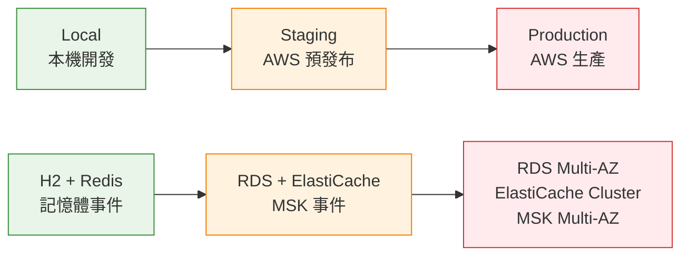
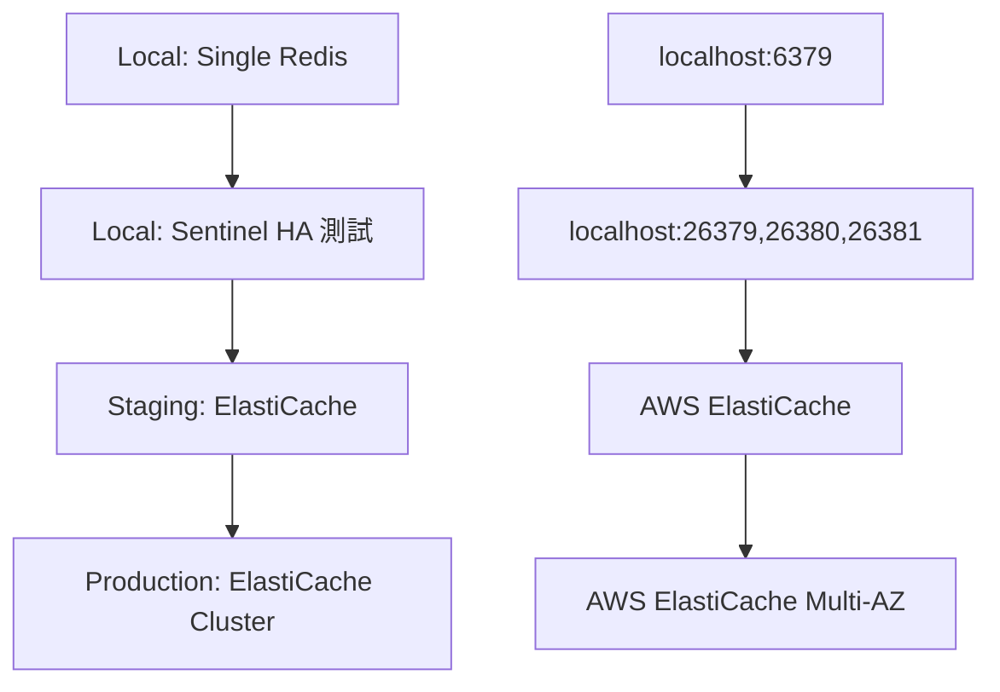

# Profile 管理策略

## 概覽

本文檔描述了系統的三階段 Profile 架構策略，提供從本機開發到生產部署的完整環境管理方案。

## 🎯 **Profile 架構設計**

### **設計原則**

1. **簡化管理**: 減少 profile 數量，避免配置複雜性
2. **實際導向**: 配合真實的開發工作流程
3. **漸進式複雜度**: 從簡單到複雜的環境演進
4. **安全優先**: 生產環境的嚴格安全控制

### **三階段架構**



## 📋 **Profile 配置詳解**

### **1. Local Profile - 本機開發環境**

```yaml
# application-local.yml
spring:
  profiles:
    active: local
  datasource:
    url: jdbc:h2:mem:genaidemo
    driver-class-name: org.h2.Driver
  h2:
    console:
      enabled: true  # 開發工具
  jpa:
    hibernate:
      ddl-auto: create-drop  # 快速重建
    show-sql: true  # 除錯支援

app:
  redis:
    enabled: true
    mode: ${REDIS_MODE:SINGLE}  # 可切換 SENTINEL 測試 HA
  
genai-demo:
  events:
    publisher: in-memory  # 同步事件處理
    async: false
  observability:
    enabled: false  # 最小化監控
```

**特性：**
- ✅ 快速啟動 (< 5 秒)
- ✅ 無外部依賴
- ✅ 支援 Redis HA 測試
- ✅ H2 Console 除錯
- ❌ 資料不持久化

**使用場景：**
- 日常功能開發
- 本機整合測試
- Redis HA 功能驗證
- 快速原型開發

### **2. Test Profile - CI/CD 測試環境**

```yaml
# application-test.yml (src/test/resources)
spring:
  main:
    lazy-initialization: true  # 加速啟動
  datasource:
    url: jdbc:h2:mem:testdb
    hikari:
      maximum-pool-size: 5  # 最小資源
  jpa:
    show-sql: false  # 無除錯輸出

app:
  redis:
    enabled: false  # 完全禁用外部依賴

genai-demo:
  events:
    publisher: in-memory
    async: false
  observability:
    enabled: false  # 禁用所有監控
```

**特性：**
- ✅ 最快啟動 (< 2 秒)
- ✅ 完全隔離
- ✅ 最小資源消耗
- ✅ 自動清理
- ❌ 功能有限

**使用場景：**
- 單元測試執行
- CI/CD 管道
- 快速驗證
- 回歸測試

### **3. Staging Profile - AWS 預發布環境**

```yaml
# application-staging.yml
spring:
  profiles:
    active: staging
  datasource:
    url: jdbc:postgresql://${DB_HOST}:5432/${DB_NAME}
    driver-class-name: org.postgresql.Driver
  jpa:
    hibernate:
      ddl-auto: validate  # 嚴格驗證
  flyway:
    enabled: true  # Schema 版本管理
  kafka:
    bootstrap-servers: ${KAFKA_BOOTSTRAP_SERVERS}

app:
  redis:
    enabled: true
    mode: ${REDIS_MODE:CLUSTER}  # ElastiCache
    
genai-demo:
  events:
    publisher: kafka  # 真實事件處理
    async: true
  observability:
    enabled: true  # 完整監控
    tracing:
      enabled: true
      exporter: xray
```

**特性：**
- ✅ 真實 AWS 環境
- ✅ 完整功能驗證
- ✅ 生產環境模擬
- ✅ 整合測試支援
- ❌ 需要網路連線

**使用場景：**
- 整合測試
- UAT 驗收測試
- 效能測試
- 部署驗證

### **4. Production Profile - AWS 生產環境**

```yaml
# application-production.yml
spring:
  profiles:
    active: production
  datasource:
    url: jdbc:postgresql://${DB_HOST}:5432/${DB_NAME}
    hikari:
      maximum-pool-size: 30  # 生產負載
  jpa:
    hibernate:
      ddl-auto: validate  # 絕不自動修改
    properties:
      hibernate:
        cache:
          use_second_level_cache: true  # 效能優化
  flyway:
    enabled: true
    clean-disabled: true  # 安全措施

app:
  redis:
    enabled: true
    mode: CLUSTER  # ElastiCache Cluster
    
genai-demo:
  events:
    publisher: kafka
    async: true
  observability:
    enabled: true
    metrics:
      sampling:
        business-metrics-sampling-rate: 1.0  # 完整業務指標
```

**特性：**
- ✅ 企業級可靠性
- ✅ 高可用性配置
- ✅ 完整監控告警
- ✅ 安全性強化
- ❌ 複雜配置管理

**使用場景：**
- 正式生產服務
- 企業級應用
- 高可用性需求
- 合規性要求

## 🔄 **開發工作流程**

### **日常開發流程**

```bash
# 1. 本機開發
export SPRING_PROFILES_ACTIVE=local
./scripts/redis-dev.sh start-single
./gradlew bootRun

# 2. 本機測試
./gradlew test  # 自動使用 test profile

# 3. 提交前驗證
./gradlew preCommitTest
```

### **部署流程**

```bash
# 1. Staging 部署
export SPRING_PROFILES_ACTIVE=staging
# 配置 AWS 環境變數
./gradlew bootRun

# 2. Production 部署
export SPRING_PROFILES_ACTIVE=production
# 使用 K8s ConfigMap/Secret
kubectl apply -f k8s/
```

## 🗄️ **資料庫管理策略**

### **Schema 管理策略**

| Profile | DDL Auto | Flyway | Schema 來源 | 變更方式 |
|---------|----------|--------|-------------|----------|
| **Local** | create-drop | 禁用 | JPA 自動生成 | 重啟重建 |
| **Test** | create-drop | 禁用 | JPA 自動生成 | 每次測試重建 |
| **Staging** | validate | 啟用 | Flyway 腳本 | 版本化遷移 |
| **Production** | validate | 啟用 | Flyway 腳本 | 嚴格版本控制 |

### **Migration 腳本管理**

```
src/main/resources/db/migration/
├── postgresql/                    # 生產環境腳本
│   ├── V1__Initial_schema.sql
│   ├── V2__Add_domain_events_table.sql
│   ├── V3__Add_performance_indexes.sql
│   └── V4__Add_audit_and_security.sql
└── h2/                           # 開發環境腳本 (如需要)
    └── V1__Initial_schema.sql
```

### **開發工作流程**

1. **開發階段**: 修改 JPA Entity → 本機測試 (H2 自動建立)
2. **Migration**: 建立對應的 PostgreSQL 腳本
3. **Staging**: Flyway 自動執行 Migration
4. **Production**: Flyway 安全地更新 Schema

## 🔧 **Redis 配置策略**

### **Redis 配置演進**



### **Redis 管理腳本**

```bash
# 本機 Redis 管理
./scripts/redis-dev.sh start-single    # 單機模式
./scripts/redis-dev.sh start-ha        # HA 測試模式
./scripts/redis-dev.sh status          # 檢查狀態
./scripts/redis-dev.sh failover        # 模擬故障轉移
```

## 📊 **監控和可觀測性**

### **監控策略演進**

| Profile | 監控級別 | 追蹤 | 指標 | 日誌 |
|---------|----------|------|------|------|
| **Local** | 基本 | 禁用 | JVM 基本指標 | Console 詳細 |
| **Test** | 禁用 | 禁用 | 禁用 | 最小化 |
| **Staging** | 完整 | AWS X-Ray | CloudWatch + Prometheus | 結構化 |
| **Production** | 企業級 | AWS X-Ray | 完整業務指標 | 結構化 + 告警 |

### **可觀測性配置**

```yaml
# Local - 最小化
genai-demo:
  observability:
    enabled: false

# Staging - 完整監控
genai-demo:
  observability:
    enabled: true
    tracing:
      enabled: true
      sampling-rate: 0.1
    metrics:
      enabled: true

# Production - 企業級
genai-demo:
  observability:
    enabled: true
    metrics:
      sampling:
        business-metrics-sampling-rate: 1.0
        infrastructure-metrics-sampling-rate: 0.5
```

## 🚨 **最佳實踐和注意事項**

### **✅ 最佳實踐**

1. **環境隔離**
   - 每個 profile 使用獨立的資料庫
   - 明確的環境變數管理
   - 適當的資源配置

2. **安全管理**
   - 生產環境禁用除錯功能
   - 敏感資訊使用 Secrets Manager
   - 嚴格的 Flyway 控制

3. **效能優化**
   - 適當的連線池配置
   - 生產環境啟用快取
   - 監控和告警設定

### **🚨 注意事項**

1. **Profile 切換**
   ```bash
   # ✅ 正確：明確指定 profile
   export SPRING_PROFILES_ACTIVE=local
   
   # ❌ 錯誤：依賴預設值
   # 可能導致意外的 profile 載入
   ```

2. **資料庫安全**
   ```yaml
   # ✅ 正確：生產環境嚴格控制
   flyway:
     clean-disabled: true
     validate-on-migrate: true
   
   # ❌ 危險：生產環境允許清理
   flyway:
     clean-disabled: false
   ```

3. **Redis 配置**
   ```bash
   # ✅ 正確：根據環境選擇模式
   REDIS_MODE=SINGLE     # Local
   REDIS_MODE=CLUSTER    # Staging/Production
   
   # ❌ 錯誤：生產環境使用單機
   REDIS_MODE=SINGLE     # Production (不安全)
   ```

## 📋 **故障排除**

### **常見問題**

1. **Profile 未正確載入**
   ```bash
   # 檢查當前 profile
   curl http://localhost:8080/actuator/env | jq '.activeProfiles'
   ```

2. **資料庫連線失敗**
   ```bash
   # 檢查資料庫配置
   curl http://localhost:8080/actuator/configprops | jq '.spring.datasource'
   ```

3. **Redis 連線問題**
   ```bash
   # 檢查 Redis 狀態
   ./scripts/redis-dev.sh status
   ./scripts/redis-dev.sh test
   ```

### **除錯工具**

- **H2 Console**: http://localhost:8080/h2-console (Local)
- **Actuator Endpoints**: http://localhost:8080/actuator (所有環境)
- **Health Checks**: http://localhost:8080/actuator/health (所有環境)

## 🔗 **相關資源**

### **配置文件**
- [📊 Profile 依賴服務矩陣](../../PROFILE_DEPENDENCIES_MATRIX.md)
- [🗄️ 資料庫配置對照表](../../DATABASE_CONFIGURATION_MATRIX.md)
- [🔧 Flyway Migration 指南](../../FLYWAY_MIGRATION_GUIDE.md)
- [📋 簡化 Profile 指南](../../SIMPLIFIED_PROFILE_GUIDE.md)

### **腳本和工具**
- [🔧 Redis 開發腳本](../../../scripts/redis-dev.sh)
- [📝 環境變數範例](../../../.env.example)

### **相關視點**
- [🚀 Deployment Viewpoint](../deployment/README.md) - 部署和基礎設施
- [⚡ Operational Viewpoint](../operational/README.md) - 運營和監控
- [📊 Information Viewpoint](../information/README.md) - 資料管理策略

---

**最後更新**: 2025年9月24日 上午9:20 (台北時間)  
**維護者**: Development Team  
**版本**: 2.0.0  
**狀態**: Active