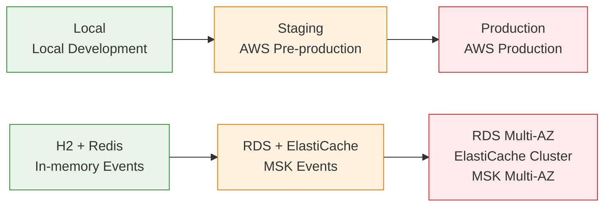
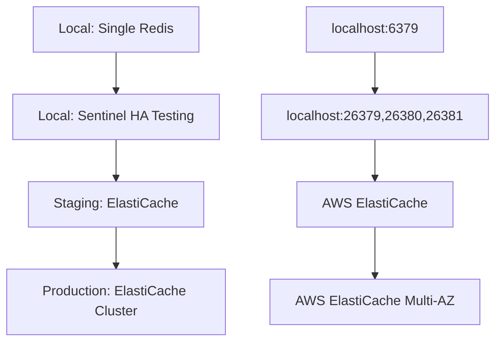

# Profile Management Strategy

## Overview

This document describes the system's three-stage Profile architecture strategy, providing a complete environment management solution from local development to production deployment.

## 🎯 **Profile Architecture Design**

### **Design Principles**

1. **Simplified Management**: Reduce the number of profiles to avoid configuration complexity
2. **Practical Orientation**: Align with real development workflows
3. **Progressive Complexity**: Environment evolution from simple to complex
4. **Security First**: Strict security controls for production environments

### **Three-Stage Architecture**



## 📋 **Profile Configuration Details**

### **1. Local Profile - Local Development Environment**

```yaml
# application-local.yml
spring:
  profiles:
    active: local
  datasource:
    url: jdbc:h2:mem:genaidemo
    driver-class-name: org.h2.Driver
  h2:
    console:
      enabled: true  # Development tools
  jpa:
    hibernate:
      ddl-auto: create-drop  # Quick rebuild
    show-sql: true  # Debug support

app:
  redis:
    enabled: true
    mode: ${REDIS_MODE:SINGLE}  # Can switch to SENTINEL for HA testing
  
genai-demo:
  events:
    publisher: in-memory  # Synchronous event processing
    async: false
  observability:
    enabled: false  # Minimal monitoring
```

**Features:**
- ✅ Fast startup (< 5 seconds)
- ✅ No external dependencies
- ✅ Supports Redis HA testing
- ✅ H2 Console debugging
- ❌ Data not persistent

**Use Cases:**
- Daily feature development
- Local integration testing
- Redis HA functionality verification
- Rapid prototyping

### **2. Test Profile - CI/CD Testing Environment**

```yaml
# application-test.yml (src/test/resources)
spring:
  main:
    lazy-initialization: true  # Accelerate startup
  datasource:
    url: jdbc:h2:mem:testdb
    hikari:
      maximum-pool-size: 5  # Minimal resources
  jpa:
    show-sql: false  # No debug output

app:
  redis:
    enabled: false  # Completely disable external dependencies

genai-demo:
  events:
    publisher: in-memory
    async: false
  observability:
    enabled: false  # Disable all monitoring
```

**Features:**
- ✅ Fastest startup (< 2 seconds)
- ✅ Complete isolation
- ✅ Minimal resource consumption
- ✅ Automatic cleanup
- ❌ Limited functionality

**Use Cases:**
- Unit test execution
- CI/CD pipelines
- Quick verification
- Regression testing

### **3. Staging Profile - AWS Pre-production Environment**

```yaml
# application-staging.yml
spring:
  profiles:
    active: staging
  datasource:
    url: jdbc:postgresql://${DB_HOST}:5432/${DB_NAME}
    driver-class-name: org.postgresql.Driver
  jpa:
    hibernate:
      ddl-auto: validate  # Strict validation
  flyway:
    enabled: true  # Schema version management
  kafka:
    bootstrap-servers: ${KAFKA_BOOTSTRAP_SERVERS}

app:
  redis:
    enabled: true
    mode: ${REDIS_MODE:CLUSTER}  # ElastiCache
    
genai-demo:
  events:
    publisher: kafka  # Real event processing
    async: true
  observability:
    enabled: true  # Complete monitoring
    tracing:
      enabled: true
      exporter: xray
```

**Features:**
- ✅ Real AWS environment
- ✅ Complete functionality verification
- ✅ Production environment simulation
- ✅ Integration testing support
- ❌ Requires network connectivity

**Use Cases:**
- Integration testing
- UAT acceptance testing
- Performance testing
- Deployment verification

### **4. Production Profile - AWS Production Environment**

```yaml
# application-production.yml
spring:
  profiles:
    active: production
  datasource:
    url: jdbc:postgresql://${DB_HOST}:5432/${DB_NAME}
    hikari:
      maximum-pool-size: 30  # Production load
  jpa:
    hibernate:
      ddl-auto: validate  # Never auto-modify
    properties:
      hibernate:
        cache:
          use_second_level_cache: true  # Performance optimization
  flyway:
    enabled: true
    clean-disabled: true  # Security measure

app:
  redis:
    enabled: true
    mode: CLUSTER  # ElastiCache Cluster
    
genai-demo:
  events:
    publisher: kafka
    async: true
  observability:
    enabled: true
    metrics:
      sampling:
        business-metrics-sampling-rate: 1.0  # Complete business metrics
```

**Features:**
- ✅ Enterprise-grade reliability
- ✅ High availability configuration
- ✅ Complete monitoring and alerting
- ✅ Security hardening
- ❌ Complex configuration management

**Use Cases:**
- Official production services
- Enterprise applications
- High availability requirements
- Compliance requirements

## 🔄 **Development Workflow**

### **Daily Development Process**

```bash
# 1. Local development
export SPRING_PROFILES_ACTIVE=local
./scripts/redis-dev.sh start-single
./gradlew bootRun

# 2. Local testing
./gradlew test  # Automatically uses test profile

# 3. Pre-commit verification
./gradlew preCommitTest
```

### **Deployment Process**

```bash
# 1. Staging deployment
export SPRING_PROFILES_ACTIVE=staging
# Configure AWS environment variables
./gradlew bootRun

# 2. Production deployment
export SPRING_PROFILES_ACTIVE=production
# Use K8s ConfigMap/Secret
kubectl apply -f k8s/
```

## 🗄️ **Database Management Strategy**

### **Schema Management Strategy**

| Profile | DDL Auto | Flyway | Schema Source | Change Method |
|---------|----------|--------|---------------|---------------|
| **Local** | create-drop | Disabled | JPA auto-generated | Restart rebuild |
| **Test** | create-drop | Disabled | JPA auto-generated | Rebuild per test |
| **Staging** | validate | Enabled | Flyway scripts | Versioned migration |
| **Production** | validate | Enabled | Flyway scripts | Strict version control |

### **Migration Script Management**

```
src/main/resources/db/migration/
├── postgresql/                    # Production environment scripts
│   ├── V1__Initial_schema.sql
│   ├── V2__Add_domain_events_table.sql
│   ├── V3__Add_performance_indexes.sql
│   └── V4__Add_audit_and_security.sql
└── h2/                           # Development environment scripts (if needed)
    └── V1__Initial_schema.sql
```

### **Development Workflow**

1. **Development Phase**: Modify JPA Entity → Local testing (H2 auto-create)
2. **Migration**: Create corresponding PostgreSQL scripts
3. **Staging**: Flyway automatically executes Migration
4. **Production**: Flyway safely updates Schema

## 🔧 **Redis Configuration Strategy**

### **Redis Configuration Evolution**



### **Redis Management Scripts**

```bash
# Local Redis management
./scripts/redis-dev.sh start-single    # Single mode
./scripts/redis-dev.sh start-ha        # HA testing mode
./scripts/redis-dev.sh status          # Check status
./scripts/redis-dev.sh failover        # Simulate failover
```

## 📊 **Monitoring and Observability**

### **Monitoring Strategy Evolution**

| Profile | Monitoring Level | Tracing | Metrics | Logging |
|---------|------------------|---------|---------|---------|
| **Local** | Basic | Disabled | Basic JVM metrics | Detailed console |
| **Test** | Disabled | Disabled | Disabled | Minimal |
| **Staging** | Complete | AWS X-Ray | CloudWatch + Prometheus | Structured |
| **Production** | Enterprise | AWS X-Ray | Complete business metrics | Structured + Alerting |

### **Observability Configuration**

```yaml
# Local - Minimal
genai-demo:
  observability:
    enabled: false

# Staging - Complete monitoring
genai-demo:
  observability:
    enabled: true
    tracing:
      enabled: true
      sampling-rate: 0.1
    metrics:
      enabled: true

# Production - Enterprise level
genai-demo:
  observability:
    enabled: true
    metrics:
      sampling:
        business-metrics-sampling-rate: 1.0
        infrastructure-metrics-sampling-rate: 0.5
```

## 🚨 **Best Practices and Considerations**

### **✅ Best Practices**

1. **Environment Isolation**
   - Each profile uses independent databases
   - Clear environment variable management
   - Appropriate resource configuration

2. **Security Management**
   - Disable debug features in production
   - Use Secrets Manager for sensitive information
   - Strict Flyway controls

3. **Performance Optimization**
   - Appropriate connection pool configuration
   - Enable caching in production
   - Monitoring and alerting setup

### **🚨 Considerations**

1. **Profile Switching**
   ```bash
   # ✅ Correct: Explicitly specify profile
   export SPRING_PROFILES_ACTIVE=local
   
   # ❌ Wrong: Rely on defaults
   # May cause unexpected profile loading
   ```

2. **Database Security**
   ```yaml
   # ✅ Correct: Strict production controls
   flyway:
     clean-disabled: true
     validate-on-migrate: true
   
   # ❌ Dangerous: Allow cleaning in production
   flyway:
     clean-disabled: false
   ```

3. **Redis Configuration**
   ```bash
   # ✅ Correct: Choose mode based on environment
   REDIS_MODE=SINGLE     # Local
   REDIS_MODE=CLUSTER    # Staging/Production
   
   # ❌ Wrong: Use single mode in production
   REDIS_MODE=SINGLE     # Production (unsafe)
   ```

## 📋 **Troubleshooting**

### **Common Issues**

1. **Profile not loaded correctly**
   ```bash
   # Check current profile
   curl http://localhost:8080/actuator/env | jq '.activeProfiles'
   ```

2. **Database connection failure**
   ```bash
   # Check database configuration
   curl http://localhost:8080/actuator/configprops | jq '.spring.datasource'
   ```

3. **Redis connection issues**
   ```bash
   # Check Redis status
   ./scripts/redis-dev.sh status
   ./scripts/redis-dev.sh test
   ```

### **Debug Tools**

- **H2 Console**: http://localhost:8080/h2-console (Local)
- **Actuator Endpoints**: http://localhost:8080/actuator (All environments)
- **Health Checks**: http://localhost:8080/actuator/health (All environments)

## 🔗 **Related Resources**

### **Configuration Files**
- [📊 Profile Dependencies Matrix](../../PROFILE_DEPENDENCIES_MATRIX.zh-TW.md)
- [🗄️ Database Configuration Matrix](../../DATABASE_CONFIGURATION_MATRIX.zh-TW.md)
- [🔧 Flyway Migration Guide](../../FLYWAY_MIGRATION_GUIDE.zh-TW.md)
- [📋 Simplified Profile Guide](../../SIMPLIFIED_PROFILE_GUIDE.md)

### **Scripts and Tools**
- [🔧 Redis Development Scripts](../../../scripts/redis-dev.sh)
- [📝 Environment Variables Example](../../../.env.example)

### **Related Viewpoints**
- [🚀 Deployment Viewpoint](../deployment/README.md) - Deployment and Infrastructure
- [⚡ Operational Viewpoint](../operational/README.md) - Operations and Monitoring
- [📊 Information Viewpoint](../information/README.md) - Data Management Strategy

---

**Last Updated**: September 24, 2025 9:20 AM (Taipei Time)  
**Maintainer**: Development Team  
**Version**: 2.0.0  
**Status**: Active
