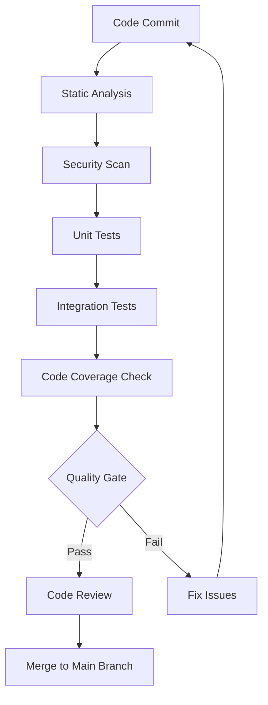

# Quality Assurance

## Overview

This document provides a comprehensive quality assurance guide, including implementation methods and standards for code review, static analysis, security scanning, and performance monitoring.

## 🔍 Quality Assurance

### Quality Standards

#### Code Quality Standards

- **Code Coverage**: > 80%
- **Cyclomatic Complexity**: ≤ 10 per method
- **Code Duplication**: No duplication > 5 lines
- **Technical Debt**: Continuously decreasing, new debt < 5%
- **Code Smells**: No critical or blocker level code smells

#### Security Standards

- **Vulnerability Level**: No high-risk or critical security vulnerabilities
- **Input Validation**: All user inputs are validated and sanitized
- **Data Encryption**: Sensitive data encrypted in transit and at rest
- **Authentication Authorization**: Proper authentication and authorization mechanisms implemented
- **Dependency Security**: Regular dependency updates, no known security vulnerabilities

#### Performance Standards

- **Response Time**: API response time < 2s (95th percentile)
- **Throughput**: System supports > 1000 req/s
- **Resource Usage**: CPU < 70%, Memory < 80%
- **Availability**: System availability > 99.9%

### Quality Process

#### Automated Quality Check Process



## 👀 Code Review

### Code Review Process

#### Pull Request Requirements

- **Title Format**: `[TYPE] Brief description`
  - Types: `FEAT`, `FIX`, `REFACTOR`, `DOCS`, `TEST`, `CHORE`
- **Complete Description**: Detailed explanation of changes and reasons
- **Related Issues**: Reference related Issues or User Stories
- **Testing Evidence**: Provide test results or test plans
- **Breaking Changes**: Clearly mark any breaking changes

#### Review Checklist

##### Functionality Check

```markdown
## Functionality Review Checklist

### Business Logic
- [ ] Code correctly implements business requirements
- [ ] Edge cases handled appropriately
- [ ] Error handling is complete and reasonable
- [ ] Input validation is sufficient

### Code Quality
- [ ] Code is clear and readable
- [ ] Variable and method names are meaningful
- [ ] Method length is appropriate (< 20 lines)
- [ ] Class responsibilities are single and clear

### Architecture Design
- [ ] Follows DDD design principles
- [ ] Dependency direction is correct
- [ ] Clear layering, separation of concerns
- [ ] Interface design is reasonable

### Test Coverage
- [ ] Unit test coverage is sufficient
- [ ] Test cases are meaningful
- [ ] Test naming clearly describes
- [ ] Tests are mutually independent

### Security
- [ ] Input validation and sanitization
- [ ] Authentication and authorization checks
- [ ] Sensitive data protection
- [ ] SQL injection prevention
```

#### Code Review Examples

```java
// ✅ Good code example
@RestController
@RequestMapping("/api/v1/customers")
@Validated
public class CustomerController {
    
    private final CustomerUseCase customerUseCase;
    
    public CustomerController(CustomerUseCase customerUseCase) {
        this.customerUseCase = customerUseCase;
    }
    
    @PostMapping
    public ResponseEntity<CustomerResponse> createCustomer(
            @Valid @RequestBody CreateCustomerRequest request) {
        
        CreateCustomerCommand command = new CreateCustomerCommand(
            request.name(),
            request.email(),
            request.phone()
        );
        
        Customer customer = customerUseCase.createCustomer(command);
        CustomerResponse response = CustomerResponse.from(customer);
        
        return ResponseEntity.status(HttpStatus.CREATED).body(response);
    }
}

// ❌ Code that needs improvement
@RestController
public class CustomerController {
    
    @Autowired
    private CustomerService customerService; // Use constructor injection
    
    @PostMapping("/customers") // Missing API version
    public Customer createCustomer(@RequestBody Map<String, String> request) { // Missing validation
        // Direct use of Map, no type safety
        Customer customer = new Customer();
        customer.setName(request.get("name")); // No validation
        customer.setEmail(request.get("email")); // No validation
        
        return customerService.save(customer); // Direct return of entity
    }
}
```

### Review Feedback Guidelines

#### Feedback Categories

- **Must Fix**: Critical issues blocking merge
- **Should Fix**: Important issues, recommended to fix
- **Consider**: Improvement suggestions
- **Nitpick**: Minor style issues
- **Praise**: Positive feedback

#### Feedback Examples

```markdown
## Must Fix
- **Security Issue**: SQL injection vulnerability on line 45, please use parameterized queries
- **Bug**: Possible null pointer exception on line 23, please add null check

## Should Fix
- **Performance Issue**: N+1 query problem in `getOrderSummaries()` method, consider using JOIN FETCH
- **Error Handling**: Exception handling on line 67 is too broad, please use specific exception types

## Consider
- **Design Suggestion**: Consider extracting this logic into a separate service for better separation of concerns
- **Readability**: This method is quite long, consider breaking it into smaller methods

## Praise
- **Good Practice**: Great use of test data builders, improves test readability
- **Clear Code**: Method has single responsibility, logic is clear and understandable
```

## 🔍 Static Analysis

### SonarQube Configuration

#### Basic Configuration

```gradle
plugins {
    id 'org.sonarqube' version '4.4.1.3373'
    id 'jacoco'
}

sonar {
    properties {
        property "sonar.projectKey", "genai-demo"
        property "sonar.organization", "your-org"
        property "sonar.host.url", "https://sonarcloud.io"
        property "sonar.coverage.jacoco.xmlReportPaths", "build/reports/jacoco/test/jacocoTestReport.xml"
        property "sonar.java.source", "21"
        property "sonar.exclusions", "**/generated/**,**/build/**,**/test/**"
        property "sonar.coverage.exclusions", "**/config/**,**/dto/**,**/entity/**"
        
        // Quality gate settings
        property "sonar.qualitygate.wait", "true"
        property "sonar.qualitygate.timeout", "300"
    }
}

// JaCoCo test coverage
jacoco {
    toolVersion = "0.8.11"
}

jacocoTestReport {
    dependsOn test
    reports {
        xml.required = true
        html.required = true
        csv.required = false
    }
    
    finalizedBy jacocoTestCoverageVerification
}

jacocoTestCoverageVerification {
    violationRules {
        rule {
            limit {
                minimum = 0.80 // 80% coverage requirement
            }
        }
        rule {
            element = 'CLASS'
            excludes = [
                '*.config.*',
                '*.dto.*',
                '*.entity.*',
                '*.*Application'
            ]
            limit {
                counter = 'LINE'
                value = 'COVEREDRATIO'
                minimum = 0.75
            }
        }
    }
}
```

#### Quality Rules Configuration

```xml
<!-- sonar-project.properties -->
sonar.projectKey=genai-demo
sonar.projectName=GenAI Demo
sonar.projectVersion=1.0

# Code analysis
sonar.sources=src/main/java
sonar.tests=src/test/java
sonar.java.binaries=build/classes/java/main
sonar.java.test.binaries=build/classes/java/test

# Quality gate
sonar.qualitygate.wait=true

# Exclusion rules
sonar.exclusions=**/generated/**,**/build/**
sonar.coverage.exclusions=**/config/**,**/dto/**,**/entity/**,**/*Application.java

# Duplicate code detection
sonar.cpd.java.minimumtokens=50

# Complexity threshold
sonar.java.complexity.threshold=10
```

### Checkstyle Configuration

#### Checkstyle Rules

```gradle
plugins {
    id 'checkstyle'
}

checkstyle {
    toolVersion = '10.12.7'
    configFile = file("config/checkstyle/checkstyle.xml")
    maxErrors = 0
    maxWarnings = 0
}

checkstyleMain {
    source = 'src/main/java'
}

checkstyleTest {
    source = 'src/test/java'
}
```

```xml
<!-- config/checkstyle/checkstyle.xml -->
<?xml version="1.0"?>
<!DOCTYPE module PUBLIC
    "-//Checkstyle//DTD Checkstyle Configuration 1.3//EN"
    "https://checkstyle.org/dtds/configuration_1_3.dtd">

<module name="Checker">
    <property name="charset" value="UTF-8"/>
    <property name="severity" value="warning"/>
    <property name="fileExtensions" value="java, properties, xml"/>

    <!-- File size check -->
    <module name="FileLength">
        <property name="max" value="500"/>
    </module>

    <!-- Line length check -->
    <module name="LineLength">
        <property name="max" value="120"/>
        <property name="ignorePattern" value="^package.*|^import.*|a href|href|http://|https://|ftp://"/>
    </module>

    <module name="TreeWalker">
        <!-- Naming conventions -->
        <module name="ConstantName"/>
        <module name="LocalFinalVariableName"/>
        <module name="LocalVariableName"/>
        <module name="MemberName"/>
        <module name="MethodName"/>
        <module name="PackageName"/>
        <module name="ParameterName"/>
        <module name="StaticVariableName"/>
        <module name="TypeName"/>

        <!-- Code complexity -->
        <module name="CyclomaticComplexity">
            <property name="max" value="10"/>
        </module>
        
        <!-- Method length -->
        <module name="MethodLength">
            <property name="max" value="50"/>
        </module>

        <!-- Parameter count -->
        <module name="ParameterNumber">
            <property name="max" value="7"/>
        </module>

        <!-- Code style -->
        <module name="EmptyBlock"/>
        <module name="LeftCurly"/>
        <module name="RightCurly"/>
        <module name="WhitespaceAfter"/>
        <module name="WhitespaceAround"/>
    </module>
</module>
```

### SpotBugs Configuration

```gradle
plugins {
    id 'com.github.spotbugs' version '6.0.7'
}

spotbugs {
    ignoreFailures = false
    showStackTraces = true
    showProgress = true
    effort = 'max'
    reportLevel = 'low'
    
    excludeFilter = file('config/spotbugs/spotbugs-exclude.xml')
}

spotbugsMain {
    reports {
        html {
            required = true
            outputLocation = file("$buildDir/reports/spotbugs/main/spotbugs.html")
            stylesheet = 'fancy-hist.xsl'
        }
        xml {
            required = false
        }
    }
}
```

```xml
<!-- config/spotbugs/spotbugs-exclude.xml -->
<?xml version="1.0" encoding="UTF-8"?>
<FindBugsFilter>
    <!-- Exclude auto-generated code -->
    <Match>
        <Package name="~.*\.generated\..*"/>
    </Match>
    
    <!-- Exclude serialization warnings for DTO classes -->
    <Match>
        <Class name="~.*Dto$"/>
        <Bug pattern="SE_NO_SERIALVERSIONID"/>
    </Match>
    
    <!-- Exclude specific warnings for test classes -->
    <Match>
        <Class name="~.*Test$"/>
        <Bug pattern="UWF_UNWRITTEN_FIELD"/>
    </Match>
</FindBugsFilter>
```

## 🔒 Security Scanning

### OWASP Dependency Check

#### Configuration

```gradle
plugins {
    id 'org.owasp.dependencycheck' version '9.0.7'
}

dependencyCheck {
    format = 'ALL'
    suppressionFile = 'config/dependency-check-suppressions.xml'
    failBuildOnCVSS = 7.0
    
    analyzers {
        // Disable unnecessary analyzers for performance
        assemblyEnabled = false
        nuspecEnabled = false
        nugetconfEnabled = false
        pyDistributionEnabled = false
        pyPackageEnabled = false
        rubygemsEnabled = false
        opensslEnabled = false
        cmakeEnabled = false
        autoconfEnabled = false
        composerEnabled = false
        nodeEnabled = false
        nodeAuditEnabled = false
    }
    
    // Database update settings
    cve {
        urlModified = 'https://nvd.nist.gov/feeds/json/cve/1.1/nvdcve-1.1-modified.json.gz'
        urlBase = 'https://nvd.nist.gov/feeds/json/cve/1.1/nvdcve-1.1-%d.json.gz'
    }
}
```

#### Vulnerability Suppression Configuration

```xml
<!-- config/dependency-check-suppressions.xml -->
<?xml version="1.0" encoding="UTF-8"?>
<suppressions xmlns="https://jeremylong.github.io/DependencyCheck/dependency-suppression.1.3.xsd">
    
    <!-- Suppress known false positives -->
    <suppress>
        <notes>False positive - this vulnerability doesn't apply to our usage</notes>
        <packageUrl regex="true">^pkg:maven/org\.springframework/spring-core@.*$</packageUrl>
        <cve>CVE-2022-22965</cve>
    </suppress>
    
    <!-- Suppress low-risk vulnerabilities in test dependencies -->
    <suppress>
        <notes>Test dependency - not used in production</notes>
        <packageUrl regex="true">^pkg:maven/com\.h2database/h2@.*$</packageUrl>
        <cvssBelow>7.0</cvssBelow>
    </suppress>
    
</suppressions>
```

### Secure Code Scanning

#### Custom Security Rules

```java
// Secure code example
@RestController
@RequestMapping("/api/v1/customers")
@Validated
public class CustomerController {
    
    private final CustomerUseCase customerUseCase;
    
    @PostMapping
    @PreAuthorize("hasRole('USER')")
    public ResponseEntity<CustomerResponse> createCustomer(
            @Valid @RequestBody CreateCustomerRequest request,
            Authentication authentication) {
        
        // Input validation
        validateCreateCustomerRequest(request);
        
        // Business logic
        CreateCustomerCommand command = new CreateCustomerCommand(
            sanitizeInput(request.name()),
            sanitizeEmail(request.email()),
            sanitizePhone(request.phone())
        );
        
        Customer customer = customerUseCase.createCustomer(command);
        
        // Output sanitization
        CustomerResponse response = CustomerResponse.from(customer);
        return ResponseEntity.status(HttpStatus.CREATED).body(response);
    }
    
    private void validateCreateCustomerRequest(CreateCustomerRequest request) {
        if (request.name() == null || request.name().trim().isEmpty()) {
            throw new ValidationException("Customer name is required");
        }
        if (request.email() == null || !isValidEmail(request.email())) {
            throw new ValidationException("Valid email is required");
        }
    }
    
    private String sanitizeInput(String input) {
        if (input == null) return null;
        return input.trim().replaceAll("[<>\"'&]", "");
    }
    
    private String sanitizeEmail(String email) {
        if (email == null) return null;
        return email.toLowerCase().trim();
    }
}
```

## 📊 Performance Monitoring

### Application Performance Monitoring

#### Micrometer Configuration

Micrometer is used for collecting application metrics and monitoring data. For detailed configuration and usage, please refer to:
- Technology Stack - Monitoring Configuration
- [Performance Standards](../../../../.kiro/steering/performance-standards.md)

```java
// Business metrics monitoring
@Component
public class BusinessMetrics {
    
    private final Counter customerCreatedCounter;
    private final Timer orderProcessingTimer;
    private final Gauge activeUsersGauge;
    
    public BusinessMetrics(MeterRegistry meterRegistry) {
        this.customerCreatedCounter = Counter.builder("customers.created")
            .description("Number of customers created")
            .tag("type", "registration")
            .register(meterRegistry);
            
        this.orderProcessingTimer = Timer.builder("orders.processing.time")
            .description("Order processing time")
            .register(meterRegistry);
            
        this.activeUsersGauge = Gauge.builder("users.active")
            .description("Number of active users")
            .register(meterRegistry, this, BusinessMetrics::getActiveUserCount);
    }
    
    public void recordCustomerCreated(String customerType) {
        customerCreatedCounter.increment(Tags.of("customer_type", customerType));
    }
    
    public Timer.Sample startOrderProcessing() {
        return Timer.start(meterRegistry);
    }
    
    public void recordOrderProcessed(Timer.Sample sample, String orderType) {
        sample.stop(Timer.builder("orders.processing.time")
            .tag("order_type", orderType)
            .register(meterRegistry));
    }
    
    private double getActiveUserCount() {
        // Actual active user calculation logic
        return userService.getActiveUserCount();
    }
}
```

#### Performance Monitoring Configuration

```yaml
# application.yml
management:
  endpoints:
    web:
      exposure:
        include: health,info,metrics,prometheus
  endpoint:
    health:
      show-details: when-authorized
      probes:
        enabled: true
    metrics:
      enabled: true
  metrics:
    export:
      prometheus:
        enabled: true
        step: 30s
    distribution:
      percentiles-histogram:
        http.server.requests: true
      percentiles:
        http.server.requests: 0.5, 0.95, 0.99
      slo:
        http.server.requests: 100ms, 500ms, 1s, 2s
```

### Performance Testing

#### JMeter Test Plan

```xml
<?xml version="1.0" encoding="UTF-8"?>
<jmeterTestPlan version="1.2">
  <hashTree>
    <TestPlan testname="Customer API Performance Test">
      <elementProp name="TestPlan.arguments" elementType="Arguments">
        <collectionProp name="Arguments.arguments">
          <elementProp name="baseUrl" elementType="Argument">
            <stringProp name="Argument.name">baseUrl</stringProp>
            <stringProp name="Argument.value">${__P(baseUrl,http://localhost:8080)}</stringProp>
          </elementProp>
          <elementProp name="users" elementType="Argument">
            <stringProp name="Argument.name">users</stringProp>
            <stringProp name="Argument.value">${__P(users,100)}</stringProp>
          </elementProp>
        </collectionProp>
      </elementProp>
    </TestPlan>
    
    <ThreadGroup testname="Customer Operations Load Test">
      <stringProp name="ThreadGroup.num_threads">${users}</stringProp>
      <stringProp name="ThreadGroup.ramp_time">60</stringProp>
      <stringProp name="ThreadGroup.duration">300</stringProp>
      
      <HTTPSamplerProxy testname="Create Customer">
        <stringProp name="HTTPSampler.domain">${baseUrl}</stringProp>
        <stringProp name="HTTPSampler.path">/api/v1/customers</stringProp>
        <stringProp name="HTTPSampler.method">POST</stringProp>
        <stringProp name="HTTPSampler.postBodyRaw">
          {
            "name": "Test Customer ${__threadNum}",
            "email": "test${__threadNum}@example.com",
            "phone": "091234567${__threadNum}"
          }
        </stringProp>
      </HTTPSamplerProxy>
      
      <ResponseAssertion testname="Response Time Assertion">
        <stringProp name="Assertion.test_field">Assertion.response_time</stringProp>
        <stringProp name="Assertion.test_type">Assertion.duration</stringProp>
        <stringProp name="Assertion.test_string">2000</stringProp>
      </ResponseAssertion>
      
      <ResponseAssertion testname="HTTP Status Assertion">
        <stringProp name="Assertion.test_field">Assertion.response_code</stringProp>
        <stringProp name="Assertion.test_type">Assertion.equals</stringProp>
        <stringProp name="Assertion.test_string">201</stringProp>
      </ResponseAssertion>
    </ThreadGroup>
  </hashTree>
</jmeterTestPlan>
```

## Quality Gates and Automation

### Quality Gate Configuration

```yaml
# .github/workflows/quality-gate.yml
name: Quality Gate

on:
  pull_request:
    branches: [ main, develop ]

jobs:
  quality-check:
    runs-on: ubuntu-latest
    
    steps:
      - uses: actions/checkout@v4
        with:
          fetch-depth: 0
      
      - name: Set up JDK 21
        uses: actions/setup-java@v4
        with:
          java-version: '21'
          distribution: 'temurin'
      
      - name: Cache Gradle packages
        uses: actions/cache@v4
        with:
          path: |
            ~/.gradle/caches
            ~/.gradle/wrapper
          key: ${{ runner.os }}-gradle-${{ hashFiles('**/*.gradle*') }}
      
      - name: Run tests with coverage
        run: ./gradlew test jacocoTestReport
      
      - name: Run static analysis
        run: ./gradlew checkstyleMain spotbugsMain
      
      - name: Run security scan
        run: ./gradlew dependencyCheckAnalyze
      
      - name: SonarQube analysis
        env:
          GITHUB_TOKEN: ${{ secrets.GITHUB_TOKEN }}
          SONAR_TOKEN: ${{ secrets.SONAR_TOKEN }}
        run: ./gradlew sonar
      
      - name: Quality Gate Check
        run: |
          # Check test coverage
          COVERAGE=$(grep -o 'Total.*[0-9]\+%' build/reports/jacoco/test/html/index.html | grep -o '[0-9]\+' | tail -1)
          if [ "$COVERAGE" -lt 80 ]; then
            echo "Coverage $COVERAGE% is below threshold 80%"
            exit 1
          fi
          
          # Check Checkstyle results
          if [ -f build/reports/checkstyle/main.xml ]; then
            CHECKSTYLE_ERRORS=$(grep -c '<error' build/reports/checkstyle/main.xml || echo 0)
            if [ "$CHECKSTYLE_ERRORS" -gt 0 ]; then
              echo "Checkstyle found $CHECKSTYLE_ERRORS errors"
              exit 1
            fi
          fi
          
          # Check SpotBugs results
          if [ -f build/reports/spotbugs/main.xml ]; then
            SPOTBUGS_BUGS=$(grep -c '<BugInstance' build/reports/spotbugs/main.xml || echo 0)
            if [ "$SPOTBUGS_BUGS" -gt 0 ]; then
              echo "SpotBugs found $SPOTBUGS_BUGS bugs"
              exit 1
            fi
          fi
          
          echo "All quality checks passed!"
```

### Quality Report Dashboard

```gradle
// Quality report aggregation task
tasks.register('qualityReport') {
    dependsOn 'test', 'jacocoTestReport', 'checkstyleMain', 'spotbugsMain', 'dependencyCheckAnalyze'
    
    doLast {
        println "Quality Report Generated:"
        println "- Test Report: build/reports/tests/test/index.html"
        println "- Coverage Report: build/reports/jacoco/test/html/index.html"
        println "- Checkstyle Report: build/reports/checkstyle/main.html"
        println "- SpotBugs Report: build/reports/spotbugs/main/spotbugs.html"
        println "- Security Report: build/reports/dependency-check-report.html"
    }
}
```

## Best Practices

### Quality Assurance Best Practices

1. **Shift Left Testing**: Perform quality checks early in the development process
2. **Automation First**: Automate quality check processes as much as possible
3. **Continuous Improvement**: Regularly review and update quality standards
4. **Team Consensus**: Ensure team has shared understanding of quality standards

### Code Review Best Practices

1. **Small Batch Reviews**: Keep PR size moderate for easier review
2. **Constructive Feedback**: Provide specific, actionable improvement suggestions
3. **Knowledge Sharing**: Share knowledge and best practices through review process
4. **Timely Response**: Complete reviews within reasonable time

### Security Best Practices

1. **Security Shift Left**: Consider security issues during development phase
2. **Regular Scanning**: Regularly perform dependency and code security scans
3. **Security Training**: Provide security awareness training for development team
4. **Threat Modeling**: Perform threat modeling analysis for new features

---

**Related Documentation**
- Build and Deployment
- Workflow and Collaboration
- Technology Stack and Toolchain