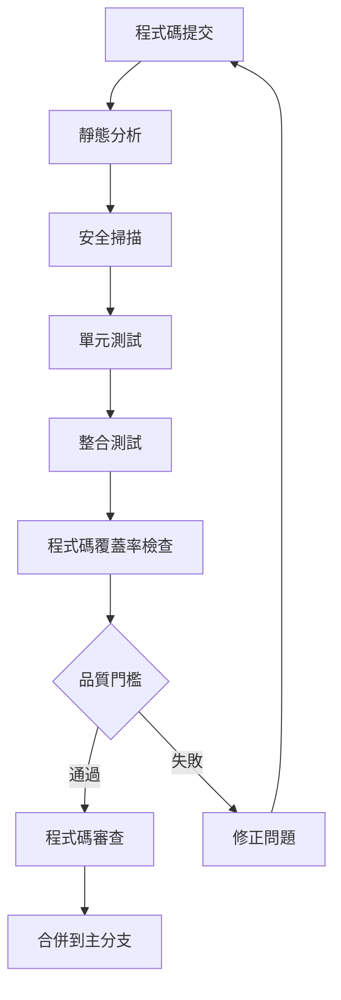

# 品質保證

## 概述

本文檔提供完整的品質保證指南，包含程式碼審查、靜態分析、安全掃描和效能監控的實作方法和標準。

## 🔍 品質保證

### 品質標準

#### 程式碼品質標準

- **程式碼覆蓋率**: > 80%
- **循環複雜度**: ≤ 10 每個方法
- **程式碼重複**: 無重複 > 5 行
- **技術債務**: 持續減少，新增債務 < 5%
- **程式碼異味**: 無關鍵或阻塞級別的程式碼異味

#### 安全標準

- **漏洞等級**: 無高風險或關鍵安全漏洞
- **輸入驗證**: 所有用戶輸入都經過驗證和清理
- **資料加密**: 敏感資料在傳輸和儲存時加密
- **認證授權**: 實作適當的認證和授權機制
- **依賴安全**: 定期更新依賴，無已知安全漏洞

#### 效能標準

- **響應時間**: API 響應時間 < 2s (95th percentile)
- **吞吐量**: 系統支援 > 1000 req/s
- **資源使用**: CPU < 70%, Memory < 80%
- **可用性**: 系統可用性 > 99.9%

### 品質流程

#### 自動化品質檢查流程



## 👀 程式碼審查

### 程式碼審查流程

#### Pull Request 要求

- **標題格式**: `[TYPE] Brief description`
  - 類型: `FEAT`, `FIX`, `REFACTOR`, `DOCS`, `TEST`, `CHORE`
- **描述完整**: 詳細說明變更內容和原因
- **關聯問題**: 引用相關的 Issue 或 User Story
- **測試證明**: 提供測試結果或測試計劃
- **破壞性變更**: 清楚標記任何破壞性變更

#### 審查檢查清單

##### 功能性檢查

```markdown
## 功能性審查檢查清單

### 業務邏輯
- [ ] 程式碼正確實現業務需求
- [ ] 邊界條件處理適當
- [ ] 錯誤處理完整且合理
- [ ] 輸入驗證充分

### 程式碼品質
- [ ] 程式碼清晰易讀
- [ ] 變數和方法命名有意義
- [ ] 方法長度適中 (< 20 行)
- [ ] 類別職責單一且明確

### 架構設計
- [ ] 遵循 DDD 設計原則
- [ ] 依賴方向正確
- [ ] 分層清晰，職責分離
- [ ] 介面設計合理

### 測試覆蓋
- [ ] 單元測試覆蓋充分
- [ ] 測試案例有意義
- [ ] 測試命名清晰描述
- [ ] 測試相互獨立

### 安全性
- [ ] 輸入驗證和清理
- [ ] 認證和授權檢查
- [ ] 敏感資料保護
- [ ] SQL 注入防護
```

#### 程式碼審查範例

```java
// ✅ 好的程式碼範例
@RestController
@RequestMapping("/../api/v1/customers")
@Validated
public class CustomerController {
    
    private final CustomerUseCase customerUseCase;
    
    public CustomerController(CustomerUseCase customerUseCase) {
        this.customerUseCase = customerUseCase;
    }
    
    @PostMapping
    public ResponseEntity<CustomerResponse> createCustomer(
            @Valid @RequestBody CreateCustomerRequest request) {
        
        CreateCustomerCommand command = new CreateCustomerCommand(
            request.name(),
            request.email(),
            request.phone()
        );
        
        Customer customer = customerUseCase.createCustomer(command);
        CustomerResponse response = CustomerResponse.from(customer);
        
        return ResponseEntity.status(HttpStatus.CREATED).body(response);
    }
}

// ❌ 需要改進的程式碼範例
@RestController
public class CustomerController {
    
    @Autowired
    private CustomerService customerService; // 使用建構子注入
    
    @PostMapping("/customers") // 缺少 API 版本
    public Customer createCustomer(@RequestBody Map<String, String> request) { // 缺少驗證
        // 直接使用 Map，沒有型別安全
        Customer customer = new Customer();
        customer.setName(request.get("name")); // 沒有驗證
        customer.setEmail(request.get("email")); // 沒有驗證
        
        return customerService.save(customer); // 直接返回實體
    }
}
```

### 審查反饋指南

#### 反饋分類

- **Must Fix**: 阻塞合併的關鍵問題
- **Should Fix**: 重要問題，建議修正
- **Consider**: 改進建議
- **Nitpick**: 小的風格問題
- **Praise**: 正面反饋

#### 反饋範例

```markdown
## Must Fix
- **安全問題**: 第 45 行存在 SQL 注入漏洞，請使用參數化查詢
- **Bug**: 第 23 行可能出現空指標異常，請添加空值檢查

## Should Fix
- **效能問題**: `getOrderSummaries()` 方法存在 N+1 查詢問題，建議使用 JOIN FETCH
- **錯誤處理**: 第 67 行的異常處理過於寬泛，請使用具體的異常類型

## Consider
- **設計建議**: 考慮將此邏輯提取到獨立的服務中，以提高關注點分離
- **可讀性**: 此方法較長，考慮拆分為更小的方法

## Praise
- **良好實踐**: 測試資料建構器的使用很棒，提高了測試的可讀性
- **清晰程式碼**: 方法職責單一，邏輯清晰易懂
```

## 🔍 靜態分析

### SonarQube 配置

#### 基本配置

```gradle
plugins {
    id 'org.sonarqube' version '4.4.1.3373'
    id 'jacoco'
}

sonar {
    properties {
        property "sonar.projectKey", "genai-demo"
        property "sonar.organization", "your-org"
        property "sonar.host.url", "https://sonarcloud.io"
        property "sonar.coverage.jacoco.xmlReportPaths", "build/reports/jacoco/test/jacocoTestReport.xml"
        property "sonar.java.source", "21"
        property "sonar.exclusions", "**/generated/**,**/build/**,**/test/**"
        property "sonar.coverage.exclusions", "**/config/**,**/dto/**,**/entity/**"
        
        // 品質門檻設定
        property "sonar.qualitygate.wait", "true"
        property "sonar.qualitygate.timeout", "300"
    }
}

// JaCoCo 測試覆蓋率
jacoco {
    toolVersion = "0.8.11"
}

jacocoTestReport {
    dependsOn test
    reports {
        xml.required = true
        html.required = true
        csv.required = false
    }
    
    finalizedBy jacocoTestCoverageVerification
}

jacocoTestCoverageVerification {
    violationRules {
        rule {
            limit {
                minimum = 0.80 // 80% 覆蓋率要求
            }
        }
        rule {
            element = 'CLASS'
            excludes = [
                '*.config.*',
                '*.dto.*',
                '*.entity.*',
                '*.*Application'
            ]
            limit {
                counter = 'LINE'
                value = 'COVEREDRATIO'
                minimum = 0.75
            }
        }
    }
}
```

#### 品質規則配置

```xml
<!-- sonar-project.properties -->
sonar.projectKey=genai-demo
sonar.projectName=GenAI Demo
sonar.projectVersion=1.0

# 程式碼分析
sonar.sources=src/main/java
sonar.tests=src/test/java
sonar.java.binaries=build/classes/java/main
sonar.java.test.binaries=build/classes/java/test

# 品質門檻
sonar.qualitygate.wait=true

# 排除規則
sonar.exclusions=**/generated/**,**/build/**
sonar.coverage.exclusions=**/config/**,**/dto/**,**/entity/**,**/*Application.java

# 重複程式碼檢測
sonar.cpd.java.minimumtokens=50

# 複雜度閾值
sonar.java.complexity.threshold=10
```

### Checkstyle 配置

#### Checkstyle 規則

```gradle
plugins {
    id 'checkstyle'
}

checkstyle {
    toolVersion = '10.12.7'
    configFile = file("config/checkstyle/checkstyle.xml")
    maxErrors = 0
    maxWarnings = 0
}

checkstyleMain {
    source = 'src/main/java'
}

checkstyleTest {
    source = 'src/test/java'
}
```

```xml
<!-- config/checkstyle/checkstyle.xml -->
<?xml version="1.0"?>
<!DOCTYPE module PUBLIC
    "-//Checkstyle//DTD Checkstyle Configuration 1.3//EN"
    "https://checkstyle.org/dtds/configuration_1_3.dtd">

<module name="Checker">
    <property name="charset" value="UTF-8"/>
    <property name="severity" value="warning"/>
    <property name="fileExtensions" value="java, properties, xml"/>

    <!-- 檔案大小檢查 -->
    <module name="FileLength">
        <property name="max" value="500"/>
    </module>

    <!-- 行長度檢查 -->
    <module name="LineLength">
        <property name="max" value="120"/>
        <property name="ignorePattern" value="^package.*|^import.*|a href|href|http://|https://|ftp://"/>
    </module>

    <module name="TreeWalker">
        <!-- 命名規範 -->
        <module name="ConstantName"/>
        <module name="LocalFinalVariableName"/>
        <module name="LocalVariableName"/>
        <module name="MemberName"/>
        <module name="MethodName"/>
        <module name="PackageName"/>
        <module name="ParameterName"/>
        <module name="StaticVariableName"/>
        <module name="TypeName"/>

        <!-- 程式碼複雜度 -->
        <module name="CyclomaticComplexity">
            <property name="max" value="10"/>
        </module>
        
        <!-- 方法長度 -->
        <module name="MethodLength">
            <property name="max" value="50"/>
        </module>

        <!-- 參數數量 -->
        <module name="ParameterNumber">
            <property name="max" value="7"/>
        </module>

        <!-- 程式碼風格 -->
        <module name="EmptyBlock"/>
        <module name="LeftCurly"/>
        <module name="RightCurly"/>
        <module name="WhitespaceAfter"/>
        <module name="WhitespaceAround"/>
    </module>
</module>
```

### SpotBugs 配置

```gradle
plugins {
    id 'com.github.spotbugs' version '6.0.7'
}

spotbugs {
    ignoreFailures = false
    showStackTraces = true
    showProgress = true
    effort = 'max'
    reportLevel = 'low'
    
    excludeFilter = file('config/spotbugs/spotbugs-exclude.xml')
}

spotbugsMain {
    reports {
        html {
            required = true
            outputLocation = file("$buildDir/reports/spotbugs/main/spotbugs.html")
            stylesheet = 'fancy-hist.xsl'
        }
        xml {
            required = false
        }
    }
}
```

```xml
<!-- config/spotbugs/spotbugs-exclude.xml -->
<?xml version="1.0" encoding="UTF-8"?>
<FindBugsFilter>
    <!-- 排除自動生成的程式碼 -->
    <Match>
        <Package name="~.*\.generated\..*"/>
    </Match>
    
    <!-- 排除 DTO 類別的序列化警告 -->
    <Match>
        <Class name="~.*Dto$"/>
        <Bug pattern="SE_NO_SERIALVERSIONID"/>
    </Match>
    
    <!-- 排除測試類別的特定警告 -->
    <Match>
        <Class name="~.*Test$"/>
        <Bug pattern="UWF_UNWRITTEN_FIELD"/>
    </Match>
</FindBugsFilter>
```

## 🔒 安全掃描

### OWASP Dependency Check

#### 配置

```gradle
plugins {
    id 'org.owasp.dependencycheck' version '9.0.7'
}

dependencyCheck {
    format = 'ALL'
    suppressionFile = 'config/dependency-check-suppressions.xml'
    failBuildOnCVSS = 7.0
    
    analyzers {
        // 停用不需要的分析器以提高效能
        assemblyEnabled = false
        nuspecEnabled = false
        nugetconfEnabled = false
        pyDistributionEnabled = false
        pyPackageEnabled = false
        rubygemsEnabled = false
        opensslEnabled = false
        cmakeEnabled = false
        autoconfEnabled = false
        composerEnabled = false
        nodeEnabled = false
        nodeAuditEnabled = false
    }
    
    // 資料庫更新設定
    cve {
        urlModified = 'https://nvd.nist.gov/feeds/json/cve/1.1/nvdcve-1.1-modified.json.gz'
        urlBase = 'https://nvd.nist.gov/feeds/json/cve/1.1/nvdcve-1.1-%d.json.gz'
    }
}
```

#### 漏洞抑制配置

```xml
<!-- config/dependency-check-suppressions.xml -->
<?xml version="1.0" encoding="UTF-8"?>
<suppressions xmlns="https://jeremylong.github.io/DependencyCheck/dependency-suppression.1.3.xsd">
    
    <!-- 抑制已知的誤報 -->
    <suppress>
        <notes>False positive - this vulnerability doesn't apply to our usage</notes>
        <packageUrl regex="true">^pkg:maven/org\.springframework/spring-core@.*$</packageUrl>
        <cve>CVE-2022-22965</cve>
    </suppress>
    
    <!-- 抑制測試依賴的低風險漏洞 -->
    <suppress>
        <notes>Test dependency - not used in production</notes>
        <packageUrl regex="true">^pkg:maven/com\.h2database/h2@.*$</packageUrl>
        <cvssBelow>7.0</cvssBelow>
    </suppress>
    
</suppressions>
```

### 安全程式碼掃描

#### 自定義安全規則

```java
// 安全程式碼範例
@RestController
@RequestMapping("/../api/v1/customers")
@Validated
public class CustomerController {
    
    private final CustomerUseCase customerUseCase;
    
    @PostMapping
    @PreAuthorize("hasRole('USER')")
    public ResponseEntity<CustomerResponse> createCustomer(
            @Valid @RequestBody CreateCustomerRequest request,
            Authentication authentication) {
        
        // 輸入驗證
        validateCreateCustomerRequest(request);
        
        // 業務邏輯
        CreateCustomerCommand command = new CreateCustomerCommand(
            sanitizeInput(request.name()),
            sanitizeEmail(request.email()),
            sanitizePhone(request.phone())
        );
        
        Customer customer = customerUseCase.createCustomer(command);
        
        // 輸出清理
        CustomerResponse response = CustomerResponse.from(customer);
        return ResponseEntity.status(HttpStatus.CREATED).body(response);
    }
    
    private void validateCreateCustomerRequest(CreateCustomerRequest request) {
        if (request.name() == null || request.name().trim().isEmpty()) {
            throw new ValidationException("Customer name is required");
        }
        if (request.email() == null || !isValidEmail(request.email())) {
            throw new ValidationException("Valid email is required");
        }
    }
    
    private String sanitizeInput(String input) {
        if (input == null) return null;
        return input.trim().replaceAll("[<>\"'&]", "");
    }
    
    private String sanitizeEmail(String email) {
        if (email == null) return null;
        return email.toLowerCase().trim();
    }
}
```

## 📊 效能監控

### 應用程式效能監控

#### Micrometer 配置

Micrometer 用於收集應用程式指標和監控資料。詳細的配置和使用方式請參考：
- [技術堆疊 - 監控配置](../tools-and-environment/technology-stack.md#監控與追蹤)
- [效能標準](../../../../.kiro/steering/performance-standards.md)

// 業務指標監控
@Component
public class BusinessMetrics {
    
    private final Counter customerCreatedCounter;
    private final Timer orderProcessingTimer;
    private final Gauge activeUsersGauge;
    
    public BusinessMetrics(MeterRegistry meterRegistry) {
        this.customerCreatedCounter = Counter.builder("customers.created")
            .description("Number of customers created")
            .tag("type", "registration")
            .register(meterRegistry);
            
        this.orderProcessingTimer = Timer.builder("orders.processing.time")
            .description("Order processing time")
            .register(meterRegistry);
            
        this.activeUsersGauge = Gauge.builder("users.active")
            .description("Number of active users")
            .register(meterRegistry, this, BusinessMetrics::getActiveUserCount);
    }
    
    public void recordCustomerCreated(String customerType) {
        customerCreatedCounter.increment(Tags.of("customer_type", customerType));
    }
    
    public Timer.Sample startOrderProcessing() {
        return Timer.start(meterRegistry);
    }
    
    public void recordOrderProcessed(Timer.Sample sample, String orderType) {
        sample.stop(Timer.builder("orders.processing.time")
            .tag("order_type", orderType)
            .register(meterRegistry));
    }
    
    private double getActiveUserCount() {
        // 實際的活躍用戶計算邏輯
        return userService.getActiveUserCount();
    }
}
```

#### 效能監控配置

```yaml
# application.yml
management:
  endpoints:
    web:
      exposure:
        include: health,info,metrics,prometheus
  endpoint:
    health:
      show-details: when-authorized
      probes:
        enabled: true
    metrics:
      enabled: true
  metrics:
    export:
      prometheus:
        enabled: true
        step: 30s
    distribution:
      percentiles-histogram:
        http.server.requests: true
      percentiles:
        http.server.requests: 0.5, 0.95, 0.99
      slo:
        http.server.requests: 100ms, 500ms, 1s, 2s
```

### 效能測試

#### JMeter 測試計劃

```xml
<?xml version="1.0" encoding="UTF-8"?>
<jmeterTestPlan version="1.2">
  <hashTree>
    <TestPlan testname="Customer API Performance Test">
      <elementProp name="TestPlan.arguments" elementType="Arguments">
        <collectionProp name="Arguments.arguments">
          <elementProp name="baseUrl" elementType="Argument">
            <stringProp name="Argument.name">baseUrl</stringProp>
            <stringProp name="Argument.value">${__P(baseUrl,http://localhost:8080)}</stringProp>
          </elementProp>
          <elementProp name="users" elementType="Argument">
            <stringProp name="Argument.name">users</stringProp>
            <stringProp name="Argument.value">${__P(users,100)}</stringProp>
          </elementProp>
        </collectionProp>
      </elementProp>
    </TestPlan>
    
    <ThreadGroup testname="Customer Operations Load Test">
      <stringProp name="ThreadGroup.num_threads">${users}</stringProp>
      <stringProp name="ThreadGroup.ramp_time">60</stringProp>
      <stringProp name="ThreadGroup.duration">300</stringProp>
      
      <HTTPSamplerProxy testname="Create Customer">
        <stringProp name="HTTPSampler.domain">${baseUrl}</stringProp>
        <stringProp name="HTTPSampler.path">/../api/v1/customers</stringProp>
        <stringProp name="HTTPSampler.method">POST</stringProp>
        <stringProp name="HTTPSampler.postBodyRaw">
          {
            "name": "Test Customer ${__threadNum}",
            "email": "test${__threadNum}@example.com",
            "phone": "091234567${__threadNum}"
          }
        </stringProp>
      </HTTPSamplerProxy>
      
      <ResponseAssertion testname="Response Time Assertion">
        <stringProp name="Assertion.test_field">Assertion.response_time</stringProp>
        <stringProp name="Assertion.test_type">Assertion.duration</stringProp>
        <stringProp name="Assertion.test_string">2000</stringProp>
      </ResponseAssertion>
      
      <ResponseAssertion testname="HTTP Status Assertion">
        <stringProp name="Assertion.test_field">Assertion.response_code</stringProp>
        <stringProp name="Assertion.test_type">Assertion.equals</stringProp>
        <stringProp name="Assertion.test_string">201</stringProp>
      </ResponseAssertion>
    </ThreadGroup>
  </hashTree>
</jmeterTestPlan>
```

## 品質門檻與自動化

### 品質門檻配置

```yaml
# .github/workflows/quality-gate.yml
name: Quality Gate

on:
  pull_request:
    branches: [ main, develop ]

jobs:
  quality-check:
    runs-on: ubuntu-latest
    
    steps:
      - uses: actions/checkout@v4
        with:
          fetch-depth: 0
      
      - name: Set up JDK 21
        uses: actions/setup-java@v4
        with:
          java-version: '21'
          distribution: 'temurin'
      
      - name: Cache Gradle packages
        uses: actions/cache@v4
        with:
          path: |
            ~/.gradle/caches
            ~/.gradle/wrapper
          key: ${{ runner.os }}-gradle-${{ hashFiles('**/*.gradle*') }}
      
      - name: Run tests with coverage
        run: ./gradlew test jacocoTestReport
      
      - name: Run static analysis
        run: ./gradlew checkstyleMain spotbugsMain
      
      - name: Run security scan
        run: ./gradlew dependencyCheckAnalyze
      
      - name: SonarQube analysis
        env:
          GITHUB_TOKEN: ${{ secrets.GITHUB_TOKEN }}
          SONAR_TOKEN: ${{ secrets.SONAR_TOKEN }}
        run: ./gradlew sonar
      
      - name: Quality Gate Check
        run: |
          # 檢查測試覆蓋率
          COVERAGE=$(grep -o 'Total.*[0-9]\+%' build/reports/jacoco/test/html/index.html | grep -o '[0-9]\+' | tail -1)
          if [ "$COVERAGE" -lt 80 ]; then
            echo "Coverage $COVERAGE% is below threshold 80%"
            exit 1
          fi
          
          # 檢查 Checkstyle 結果
          if [ -f build/reports/checkstyle/main.xml ]; then
            CHECKSTYLE_ERRORS=$(grep -c '<error' build/reports/checkstyle/main.xml || echo 0)
            if [ "$CHECKSTYLE_ERRORS" -gt 0 ]; then
              echo "Checkstyle found $CHECKSTYLE_ERRORS errors"
              exit 1
            fi
          fi
          
          # 檢查 SpotBugs 結果
          if [ -f build/reports/spotbugs/main.xml ]; then
            SPOTBUGS_BUGS=$(grep -c '<BugInstance' build/reports/spotbugs/main.xml || echo 0)
            if [ "$SPOTBUGS_BUGS" -gt 0 ]; then
              echo "SpotBugs found $SPOTBUGS_BUGS bugs"
              exit 1
            fi
          fi
          
          echo "All quality checks passed!"
```

### 品質報告儀表板

```gradle
// 品質報告聚合任務
tasks.register('qualityReport') {
    dependsOn 'test', 'jacocoTestReport', 'checkstyleMain', 'spotbugsMain', 'dependencyCheckAnalyze'
    
    doLast {
        println "Quality Report Generated:"
        println "- Test Report: build/reports/tests/test/index.html"
        println "- Coverage Report: build/reports/jacoco/test/html/index.html"
        println "- Checkstyle Report: build/reports/checkstyle/main.html"
        println "- SpotBugs Report: build/reports/spotbugs/main/spotbugs.html"
        println "- Security Report: build/reports/dependency-check-report.html"
    }
}
```

## 最佳實踐

### 品質保證最佳實踐

1. **左移測試**: 在開發早期階段進行品質檢查
2. **自動化優先**: 盡可能自動化品質檢查流程
3. **持續改進**: 定期審查和更新品質標準
4. **團隊共識**: 確保團隊對品質標準有共同理解

### 程式碼審查最佳實踐

1. **小批次審查**: 保持 PR 大小適中，便於審查
2. **建設性反饋**: 提供具體、可行的改進建議
3. **知識分享**: 通過審查過程分享知識和最佳實踐
4. **及時響應**: 在合理時間內完成審查

### 安全最佳實踐

1. **安全左移**: 在開發階段就考慮安全問題
2. **定期掃描**: 定期進行依賴和程式碼安全掃描
3. **安全培訓**: 為開發團隊提供安全意識培訓
4. **威脅建模**: 對新功能進行威脅建模分析

---

**相關文檔**
- 建置與部署
- 工作流程與協作
- 技術棧與工具鏈