# IDE Configuration Guide

> **Last Updated**: 2025-10-25

## Overview

This guide provides detailed instructions for configuring your Integrated Development Environment (IDE) for optimal development experience with the Enterprise E-Commerce Platform. We support both IntelliJ IDEA and Visual Studio Code.

## IntelliJ IDEA Configuration

### Installation

#### Download and Install

1. Download IntelliJ IDEA Ultimate from [JetBrains](https://www.jetbrains.com/idea/download/)
2. Install the application
3. Launch IntelliJ IDEA

**Recommended Version**: IntelliJ IDEA 2024.2 or later

### Initial Setup

#### 1. Import Project

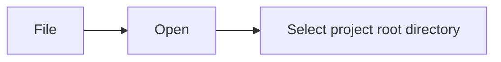

IntelliJ will automatically detect the Gradle project and import it.

#### 2. Configure JDK

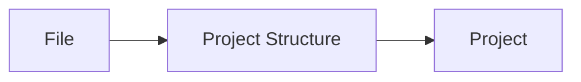

- **Project SDK**: Select Java 21 (or add if not present)
- **Project language level**: 21 - Record patterns, pattern matching for switch
- Click **Apply**

#### 3. Configure Gradle

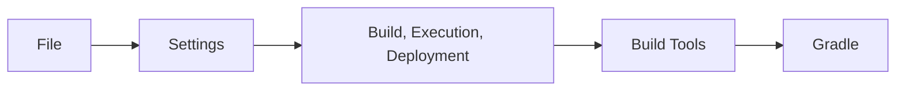

- **Build and run using**: Gradle
- **Run tests using**: Gradle
- **Gradle JVM**: Project SDK (Java 21)
- **Use Gradle from**: 'gradle-wrapper.properties' file

### Essential Plugins

#### Install Required Plugins

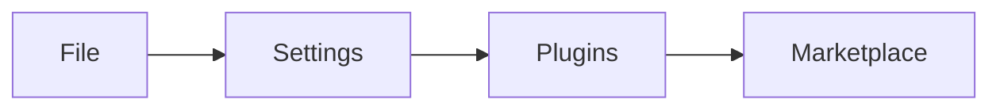

**Required Plugins:**

1. **Lombok**
   - Enables Lombok annotation processing
   - Search: "Lombok"
   - Install and restart IDE

2. **Spring Boot**
   - Enhanced Spring Boot support
   - Usually pre-installed in Ultimate edition

3. **Cucumber for Java**
   - BDD test support
   - Search: "Cucumber for Java"
   - Install and restart IDE

4. **PlantUML Integration**
   - Diagram visualization
   - Search: "PlantUML integration"
   - Install and restart IDE

**Recommended Plugins:**

1. **SonarLint**
   - Real-time code quality analysis
   - Search: "SonarLint"

2. **Rainbow Brackets**
   - Better bracket visualization
   - Search: "Rainbow Brackets"

3. **GitToolBox**
   - Enhanced Git integration
   - Search: "GitToolBox"

4. **Key Promoter X**
   - Learn keyboard shortcuts
   - Search: "Key Promoter X"

### Code Style Configuration

#### 1. Import Code Style

Create `.idea/codeStyles/Project.xml`:

```xml
<component name="ProjectCodeStyleConfiguration">
  <code_scheme name="Project" version="173">
    <JavaCodeStyleSettings>
      <option name="CLASS_COUNT_TO_USE_IMPORT_ON_DEMAND" value="999" />
      <option name="NAMES_COUNT_TO_USE_IMPORT_ON_DEMAND" value="999" />
      <option name="IMPORT_LAYOUT_TABLE">
        <value>
          <package name="" withSubpackages="true" static="false" />
          <emptyLine />
          <package name="java" withSubpackages="true" static="false" />
          <package name="javax" withSubpackages="true" static="false" />
          <emptyLine />
          <package name="org" withSubpackages="true" static="false" />
          <package name="com" withSubpackages="true" static="false" />
          <emptyLine />
          <package name="" withSubpackages="true" static="true" />
        </value>
      </option>
    </JavaCodeStyleSettings>
    <codeStyleSettings language="JAVA">
      <option name="RIGHT_MARGIN" value="120" />
      <option name="KEEP_LINE_BREAKS" value="true" />
      <option name="KEEP_FIRST_COLUMN_COMMENT" value="false" />
      <option name="KEEP_CONTROL_STATEMENT_IN_ONE_LINE" value="false" />
      <option name="KEEP_BLANK_LINES_IN_DECLARATIONS" value="1" />
      <option name="KEEP_BLANK_LINES_IN_CODE" value="1" />
      <option name="KEEP_BLANK_LINES_BEFORE_RBRACE" value="1" />
      <option name="BLANK_LINES_AFTER_CLASS_HEADER" value="1" />
      <option name="ALIGN_MULTILINE_PARAMETERS" value="false" />
      <option name="SPACE_WITHIN_BRACES" value="true" />
      <option name="SPACE_BEFORE_METHOD_CALL_PARENTHESES" value="false" />
      <option name="SPACE_BEFORE_METHOD_PARENTHESES" value="false" />
      <option name="SPACE_BEFORE_IF_PARENTHESES" value="true" />
      <option name="SPACE_BEFORE_WHILE_PARENTHESES" value="true" />
      <option name="SPACE_BEFORE_FOR_PARENTHESES" value="true" />
      <option name="SPACE_BEFORE_CATCH_PARENTHESES" value="true" />
      <option name="SPACE_BEFORE_SWITCH_PARENTHESES" value="true" />
      <indentOptions>
        <option name="INDENT_SIZE" value="4" />
        <option name="CONTINUATION_INDENT_SIZE" value="8" />
        <option name="TAB_SIZE" value="4" />
      </indentOptions>
    </codeStyleSettings>
  </code_scheme>
</component>
```

#### 2. Configure Code Style Settings

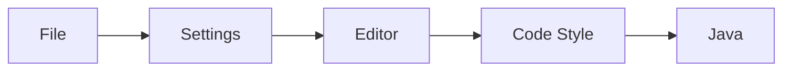

- **Tabs and Indents**:
  - Tab size: 4
  - Indent: 4
  - Continuation indent: 8

- **Wrapping and Braces**:
  - Hard wrap at: 120 columns
  - Keep when reformatting: Line breaks

- **Imports**:
  - Class count to use import with '*': 999
  - Names count to use static import with '*': 999

### Editor Configuration

#### 1. General Settings


- ✅ Ensure line feed at file end on Save
- ✅ Remove trailing spaces on Save: All lines
- ✅ Show whitespaces
- ✅ Show method separators

#### 2. Auto Import

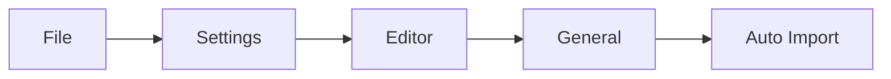

- ✅ Add unambiguous imports on the fly
- ✅ Optimize imports on the fly

#### 3. Inspections

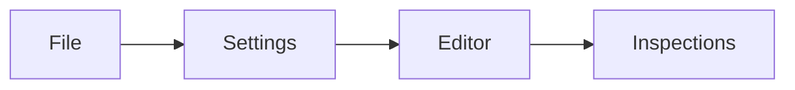

Enable the following inspections:

- ✅ Java → Probable bugs → All
- ✅ Java → Code style issues → All
- ✅ Java → Performance issues → All
- ✅ Spring → All
- ✅ JPA → All

### Run Configurations

#### 1. Spring Boot Application


- **Name**: Enterprise E-Commerce Platform
- **Main class**: `solid.humank.genaidemo.Application`
- **VM options**: `-Dspring.profiles.active=local`
- **Environment variables**: (from `.env` file)
- **Use classpath of module**: `app.main`

#### 2. Gradle Test Configuration


**Unit Tests:**

- **Name**: Unit Tests
- **Gradle project**: Select project root
- **Tasks**: `unitTest`
- **Arguments**: `--info`

**Integration Tests:**

- **Name**: Integration Tests
- **Gradle project**: Select project root
- **Tasks**: `integrationTest`
- **Arguments**: `--info`

#### 3. Cucumber Configuration

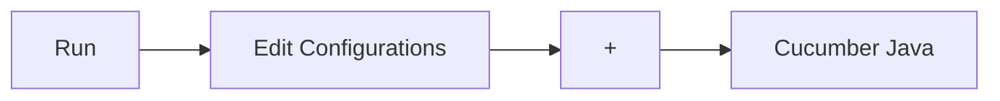

- **Name**: BDD Tests
- **Main class**: `io.cucumber.core.cli.Main`
- **Glue**: `solid.humank.genaidemo.bdd`
- **Feature or folder path**: `src/test/resources/features`

### Keyboard Shortcuts

#### Essential Shortcuts

| Action | Shortcut (Mac) | Shortcut (Windows/Linux) |
|--------|----------------|--------------------------|
| Search Everywhere | Double Shift | Double Shift |
| Find Action | Cmd+Shift+A | Ctrl+Shift+A |
| Navigate to Class | Cmd+O | Ctrl+N |
| Navigate to File | Cmd+Shift+O | Ctrl+Shift+N |
| Navigate to Symbol | Cmd+Alt+O | Ctrl+Alt+Shift+N |
| Recent Files | Cmd+E | Ctrl+E |
| Go to Declaration | Cmd+B | Ctrl+B |
| Find Usages | Alt+F7 | Alt+F7 |
| Refactor This | Ctrl+T | Ctrl+Alt+Shift+T |
| Rename | Shift+F6 | Shift+F6 |
| Extract Method | Cmd+Alt+M | Ctrl+Alt+M |
| Extract Variable | Cmd+Alt+V | Ctrl+Alt+V |
| Optimize Imports | Ctrl+Alt+O | Ctrl+Alt+O |
| Reformat Code | Cmd+Alt+L | Ctrl+Alt+L |
| Run | Ctrl+R | Shift+F10 |
| Debug | Ctrl+D | Shift+F9 |
| Run Tests | Ctrl+Shift+R | Ctrl+Shift+F10 |

### Database Tools

#### Configure Database Connection

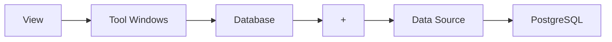

- **Host**: localhost
- **Port**: 5432
- **Database**: ecommerce
- **User**: postgres
- **Password**: postgres
- **Test Connection** to verify

#### Useful Database Features

- **SQL Console**: Write and execute SQL queries
- **Database Diagrams**: Visualize table relationships
- **Data Editor**: View and edit table data
- **Export Data**: Export query results to various formats

## Visual Studio Code Configuration

### Installation

#### Download and Install

1. Download VS Code from [code.visualstudio.com](https://code.visualstudio.com/)
2. Install the application
3. Launch VS Code

### Essential Extensions

#### Install Required Extensions

Press `Cmd+Shift+X` (Mac) or `Ctrl+Shift+X` (Windows/Linux) to open Extensions view.

**Required Extensions:**

1. **Extension Pack for Java**
   - ID: `vscjava.vscode-java-pack`
   - Includes: Language Support, Debugger, Test Runner, Maven, Gradle

2. **Spring Boot Extension Pack**
   - ID: `vmware.vscode-boot-dev-pack`
   - Includes: Spring Boot Tools, Spring Initializr, Spring Dashboard

3. **Lombok Annotations Support**
   - ID: `GabrielBB.vscode-lombok`

4. **Cucumber (Gherkin) Full Support**
   - ID: `alexkrechik.cucumberautocomplete`

5. **PlantUML**
   - ID: `jebbs.plantuml`

**Recommended Extensions:**

1. **SonarLint**
   - ID: `SonarSource.sonarlint-vscode`

2. **GitLens**
   - ID: `eamodio.gitlens`

3. **Docker**
   - ID: `ms-azuretools.vscode-docker`

4. **REST Client**
   - ID: `humao.rest-client`

5. **Prettier - Code formatter**
    - ID: `esbenp.prettier-vscode`

### Workspace Settings

Create `.vscode/settings.json`:

```json
{
  "java.configuration.updateBuildConfiguration": "automatic",
  "java.compile.nullAnalysis.mode": "automatic",
  "java.format.settings.url": ".vscode/java-formatter.xml",
  "java.format.settings.profile": "GoogleStyle",
  "java.saveActions.organizeImports": true,
  "editor.formatOnSave": true,
  "editor.rulers": [120],
  "editor.tabSize": 4,
  "editor.insertSpaces": true,
  "editor.detectIndentation": false,
  "files.trimTrailingWhitespace": true,
  "files.insertFinalNewline": true,
  "files.exclude": {
    "**/.git": true,
    "**/.gradle": true,
    "**/build": true,
    "**/node_modules": true,
    "**/.DS_Store": true
  },
  "java.test.config": {
    "vmArgs": ["-Dspring.profiles.active=test"]
  },
  "spring-boot.ls.java.home": "/Library/Java/JavaVirtualMachines/openjdk-21.jdk/Contents/Home",
  "cucumberautocomplete.steps": [
    "src/test/java/solid/humank/genaidemo/bdd/**/*.java"
  ],
  "cucumberautocomplete.syncfeatures": "src/test/resources/features/**/*.feature",
  "cucumberautocomplete.strictGherkinCompletion": true
}
```

### Launch Configurations

Create `.vscode/launch.json`:

```json
{
  "version": "0.2.0",
  "configurations": [
    {
      "type": "java",
      "name": "Spring Boot App",
      "request": "launch",
      "mainClass": "solid.humank.genaidemo.Application",
      "projectName": "app",
      "args": "",
      "vmArgs": "-Dspring.profiles.active=local",
      "envFile": "${workspaceFolder}/.env"
    },
    {
      "type": "java",
      "name": "Debug Tests",
      "request": "launch",
      "mainClass": "",
      "projectName": "app",
      "vmArgs": "-Dspring.profiles.active=test"
    }
  ]
}
```

### Tasks Configuration

Create `.vscode/tasks.json`:

```json
{
  "version": "2.0.0",
  "tasks": [
    {
      "label": "Build Project",
      "type": "shell",
      "command": "./gradlew build",
      "group": {
        "kind": "build",
        "isDefault": true
      },
      "problemMatcher": []
    },
    {
      "label": "Run Unit Tests",
      "type": "shell",
      "command": "./gradlew unitTest",
      "group": "test",
      "problemMatcher": []
    },
    {
      "label": "Run Integration Tests",
      "type": "shell",
      "command": "./gradlew integrationTest",
      "group": "test",
      "problemMatcher": []
    },
    {
      "label": "Start Docker Services",
      "type": "shell",
      "command": "docker-compose up -d",
      "problemMatcher": []
    },
    {
      "label": "Stop Docker Services",
      "type": "shell",
      "command": "docker-compose down",
      "problemMatcher": []
    }
  ]
}
```

### Keyboard Shortcuts

#### Essential Shortcuts

| Action | Shortcut (Mac) | Shortcut (Windows/Linux) |
|--------|----------------|--------------------------|
| Command Palette | Cmd+Shift+P | Ctrl+Shift+P |
| Quick Open File | Cmd+P | Ctrl+P |
| Go to Symbol | Cmd+Shift+O | Ctrl+Shift+O |
| Go to Definition | F12 | F12 |
| Peek Definition | Alt+F12 | Alt+F12 |
| Find References | Shift+F12 | Shift+F12 |
| Rename Symbol | F2 | F2 |
| Format Document | Shift+Alt+F | Shift+Alt+F |
| Organize Imports | Shift+Alt+O | Shift+Alt+O |
| Toggle Terminal | Ctrl+` | Ctrl+` |
| Run Task | Cmd+Shift+B | Ctrl+Shift+B |
| Debug | F5 | F5 |
| Run Without Debugging | Ctrl+F5 | Ctrl+F5 |

## Common Configuration for Both IDEs

### Git Configuration

#### .gitignore

Ensure the following entries are in `.gitignore`:

```text
# IDE
.idea/
*.iml
.vscode/
*.code-workspace

# Build
build/
target/
out/
*.class

# Gradle
.gradle/
gradle-app.setting

# OS
.DS_Store
Thumbs.db

# Environment
.env
.env.local
```

### EditorConfig

Create `.editorconfig` in project root:

```ini
root = true

[*]
charset = utf-8
end_of_line = lf
insert_final_newline = true
trim_trailing_whitespace = true

[*.{java,kt}]
indent_style = space
indent_size = 4
max_line_length = 120

[*.{js,ts,jsx,tsx,json,yml,yaml}]
indent_style = space
indent_size = 2

[*.md]
trim_trailing_whitespace = false
max_line_length = off

[Makefile]
indent_style = tab
```

## Verification

### Test Your Setup

#### 1. Open Project

- Open the project in your IDE
- Wait for indexing to complete
- Verify no errors in the project structure

#### 2. Build Project

- Run build task
- Verify successful build
- Check for any compilation errors

#### 3. Run Application

- Start the Spring Boot application
- Verify it starts without errors
- Check logs for successful startup

#### 4. Run Tests

- Run unit tests
- Verify all tests pass
- Check test coverage report

#### 5. Debug Application

- Set a breakpoint in a controller method
- Start application in debug mode
- Make an API call
- Verify breakpoint is hit

## Troubleshooting

### IntelliJ IDEA Issues

#### Issue: Lombok Not Working

**Solution:**

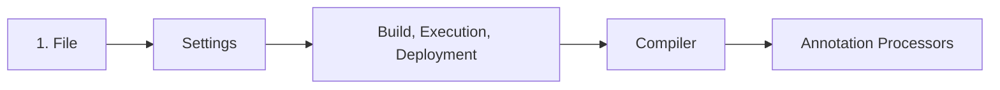

#### Issue: Spring Boot Run Configuration Not Available

**Solution:**

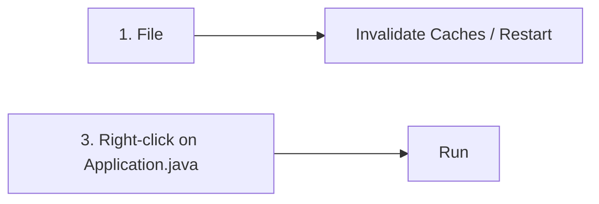

#### Issue: Gradle Sync Failed

**Solution:**

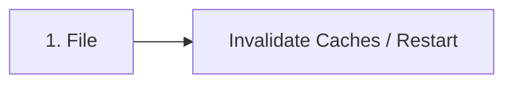

### VS Code Issues

#### Issue: Java Extension Not Working

**Solution:**

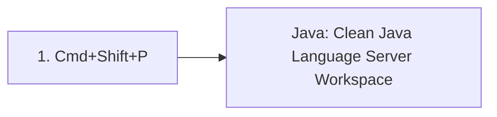

#### Issue: Cannot Run Spring Boot Application

**Solution:**

```text

1. Ensure Extension Pack for Java is installed
2. Ensure Spring Boot Extension Pack is installed
3. Check JAVA_HOME environment variable
4. Reload window

```

## Next Steps

After configuring your IDE:

1. Review the [Coding Standards](../coding-standards/java-standards.md)
2. Follow the [Developer Onboarding Guide](onboarding.md)
3. Try the [Implementation Examples](../examples/creating-aggregate.md)
4. Join the team's pair programming sessions

## Additional Resources

- [IntelliJ IDEA Documentation](https://www.jetbrains.com/help/idea/)
- [VS Code Java Documentation](https://code.visualstudio.com/docs/languages/java)
- [Spring Boot in IntelliJ IDEA](https://www.jetbrains.com/help/idea/spring-boot.html)
- [Spring Boot in VS Code](https://code.visualstudio.com/docs/java/java-spring-boot)

---

**Document Version**: 1.0  
**Last Updated**: 2025-10-25  
**Maintained By**: Development Team
