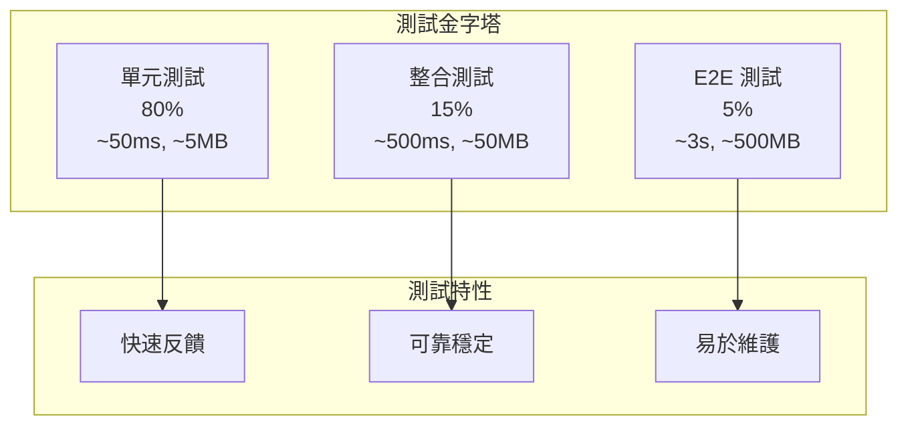
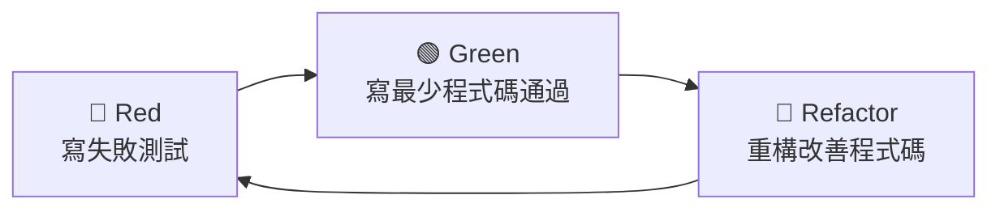

# 測試策略總覽

## 概覽

我們的測試策略基於測試金字塔原則，結合 TDD（測試驅動開發）和 BDD（行為驅動開發）實踐，確保程式碼品質和業務需求的正確實現。本指南涵蓋了所有測試類型、工具和最佳實踐。

## 🏗️ 測試金字塔



### 測試分層策略

#### 單元測試 (80%)
- **目標**: 測試單一組件的業務邏輯
- **特性**: < 50ms, < 5MB, 成功率 > 99%
- **工具**: JUnit 5 + Mockito + AssertJ
- **範圍**: 領域邏輯、工具函數、配置類別

#### 整合測試 (15%)
- **目標**: 測試組件間的互動
- **特性**: < 500ms, < 50MB, 成功率 > 95%
- **工具**: @DataJpaTest, @WebMvcTest, @JsonTest
- **範圍**: 資料庫整合、外部服務、API 端點

#### E2E 測試 (5%)
- **目標**: 測試完整的業務流程
- **特性**: < 3s, < 500MB, 成功率 > 90%
- **工具**: @SpringBootTest, TestContainers
- **範圍**: 完整用戶旅程、系統整合、煙霧測試

## 🔴🟢🔵 TDD 測試驅動開發

### Red-Green-Refactor 循環



### TDD 實踐指南
- **[Red-Green-Refactor 循環](tdd-practices/red-green-refactor.md)** - 完整的 TDD 開發流程
- **[測試金字塔](tdd-practices/test-pyramid.md)** - 測試分層策略和比例
- **[單元測試模式](tdd-practices/unit-testing-patterns.md)** - 常用的測試模式和技巧

### TDD 範例
```java
// 1. Red: 寫失敗測試
@Test
void should_calculate_discount_for_premium_customer() {
    // Given
    Customer customer = createPremiumCustomer();
    Order order = createOrder(100.0);
    
    // When
    BigDecimal discount = customer.calculateDiscount(order);
    
    // Then
    assertThat(discount).isEqualTo(new BigDecimal("10.00"));
}

// 2. Green: 寫最少程式碼通過測試
public BigDecimal calculateDiscount(Order order) {
    if (this.membershipLevel == MembershipLevel.PREMIUM) {
        return order.getTotal().multiply(new BigDecimal("0.10"));
    }
    return BigDecimal.ZERO;
}

// 3. Refactor: 重構改善程式碼品質
```

## 📝 BDD 行為驅動開發

### Given-When-Then 模式

BDD 使用自然語言描述系統行為，讓業務人員和開發人員都能理解：

```gherkin
Feature: Customer Membership Discount
  Scenario: Premium member receives discount
    Given a premium customer with membership level "PREMIUM"
    When the customer makes a purchase of $100
    Then the customer should receive a 10% discount
    And the final amount should be $90
```

### BDD 實踐指南
- **[Gherkin 語法指南](bdd-practices/gherkin-guidelines.md)** - Feature 文件的標準語法
- **[Given-When-Then 模式](bdd-practices/given-when-then.md)** - 場景描述的標準格式
- **[Feature 文件編寫](bdd-practices/feature-writing.md)** - 如何編寫有效的 Feature 文件
- **[場景設計最佳實踐](bdd-practices/scenario-design.md)** - 場景設計的技巧和模式

### BDD 實作範例
```java
@CucumberTest
public class CustomerDiscountSteps {
    
    @Given("a premium customer with membership level {string}")
    public void a_premium_customer(String membershipLevel) {
        customer = Customer.builder()
            .membershipLevel(MembershipLevel.valueOf(membershipLevel))
            .build();
    }
    
    @When("the customer makes a purchase of ${double}")
    public void customer_makes_purchase(double amount) {
        order = Order.builder()
            .total(new BigDecimal(amount))
            .build();
        discount = customer.calculateDiscount(order);
    }
    
    @Then("the customer should receive a {int}% discount")
    public void customer_receives_discount(int expectedPercentage) {
        BigDecimal expectedDiscount = order.getTotal()
            .multiply(new BigDecimal(expectedPercentage))
            .divide(new BigDecimal(100));
        assertThat(discount).isEqualTo(expectedDiscount);
    }
}
```

## 🔗 整合測試

### 資料庫整合測試
```java
@DataJpaTest
@ActiveProfiles("test")
class CustomerRepositoryTest {
    
    @Autowired
    private TestEntityManager entityManager;
    
    @Autowired
    private CustomerRepository repository;
    
    @Test
    void should_find_customers_by_membership_level() {
        // Given
        Customer premiumCustomer = createCustomer(MembershipLevel.PREMIUM);
        Customer regularCustomer = createCustomer(MembershipLevel.REGULAR);
        
        entityManager.persistAndFlush(premiumCustomer);
        entityManager.persistAndFlush(regularCustomer);
        
        // When
        List<Customer> premiumCustomers = repository.findByMembershipLevel(MembershipLevel.PREMIUM);
        
        // Then
        assertThat(premiumCustomers).hasSize(1)
            .extracting(Customer::getMembershipLevel)
            .containsOnly(MembershipLevel.PREMIUM);
    }
}
```

### API 整合測試
```java
@WebMvcTest(CustomerController.class)
class CustomerControllerTest {
    
    @Autowired
    private MockMvc mockMvc;
    
    @MockBean
    private CustomerService customerService;
    
    @Test
    void should_return_customer_when_valid_id_provided() throws Exception {
        // Given
        Customer customer = createCustomer();
        when(customerService.findById("123")).thenReturn(customer);
        
        // When & Then
        mockMvc.perform(get("/api/v1/customers/123"))
            .andExpect(status().isOk())
            .andExpect(jsonPath("$.id").value("123"))
            .andExpect(jsonPath("$.name").value("John Doe"));
    }
}
```

詳細指南：[整合測試指南](integration-testing.md)

## ⚡ 效能測試

### @TestPerformanceExtension 使用

我們使用自定義的效能監控擴展來自動追蹤測試效能：

```java
@TestPerformanceExtension(maxExecutionTimeMs = 10000, maxMemoryIncreaseMB = 100)
@IntegrationTest
public class CustomerServiceIntegrationTest extends BaseIntegrationTest {
    
    @Test
    void should_handle_concurrent_customer_operations() {
        // 測試會自動監控執行時間和記憶體使用
        // 生成效能報告到 build/reports/test-performance/
    }
}
```

### 效能測試特性
- **自動監控**: 測試執行時間和記憶體使用追蹤
- **效能回歸檢測**: 自動檢測效能退化
- **詳細報告**: HTML 和 CSV 格式的效能報告
- **資源管理**: 自動清理和記憶體管理

### 效能基準
- **單元測試**: < 50ms, < 5MB
- **整合測試**: < 500ms, < 50MB  
- **E2E 測試**: < 3s, < 500MB

詳細指南：[效能測試指南](performance-testing.md)

## 🏛️ 架構測試

### ArchUnit 規則驗證

我們使用 ArchUnit 來自動驗證架構約束和 DDD 模式：

```java
@ArchTest
static final ArchRule domainLayerRules = classes()
    .that().resideInAPackage("..domain..")
    .should().onlyDependOnClassesThat()
    .resideInAnyPackage("..domain..", "java..", "org.springframework..");

@ArchTest  
static final ArchRule aggregateRootRules = classes()
    .that().areAnnotatedWith(AggregateRoot.class)
    .should().implement(AggregateRootInterface.class);

@ArchTest
static final ArchRule valueObjectRules = classes()
    .that().areAnnotatedWith(ValueObject.class)
    .should().beRecords();
```

### 架構約束檢查
- **層次依賴**: 確保正確的依賴方向
- **DDD 模式**: 驗證 @AggregateRoot、@ValueObject 等註解使用
- **命名約定**: 檢查類別和套件命名規範
- **設計模式**: 驗證設計模式的正確實作

詳細指南：[架構測試指南](architecture-testing.md)

## 🤖 測試自動化

### Gradle 測試任務

```bash
# 快速開發測試 (< 2 分鐘)
./gradlew quickTest

# 提交前測試 (< 5 分鐘)  
./gradlew preCommitTest

# 完整測試套件 (< 30 分鐘)
./gradlew fullTest

# 特定測試類型
./gradlew unitTest           # 單元測試
./gradlew integrationTest    # 整合測試
./gradlew e2eTest           # E2E 測試
./gradlew cucumber          # BDD 測試
```

### 測試任務配置
- **記憶體優化**: 漸進式記憶體分配 (2g → 6g → 8g)
- **JVM 調優**: G1GC、字串去重、優化堆區域
- **HttpComponents 優化**: HTTP 客戶端測試的專用 JVM 參數
- **超時管理**: 漸進式超時配置 (2m → 30m → 1h)

### CI/CD 整合
```yaml
# GitHub Actions 測試工作流程
name: Test Suite
on: [push, pull_request]

jobs:
  test:
    runs-on: ubuntu-latest
    steps:
      - uses: actions/checkout@v3
      - uses: actions/setup-java@v3
        with:
          java-version: '21'
      - name: Run Tests
        run: ./gradlew preCommitTest
      - name: Generate Performance Report
        run: ./gradlew generatePerformanceReport
```

詳細指南：[測試自動化指南](test-automation.md)

## 📊 測試報告與監控

### 效能報告
```bash
# 生成效能報告
./gradlew generatePerformanceReport

# 查看報告
open build/reports/test-performance/performance-report.html
open build/reports/test-performance/overall-performance-summary.txt
```

### 可用報告類型
- **個別類別報告**: 每個測試類別的詳細執行分析
- **整體效能摘要**: 聚合統計和效能趨勢
- **HTML 報告**: 互動式圖表和視覺化效能分析
- **CSV 資料**: 原始效能資料供自定義分析
- **慢測試分析**: 前 5 名最慢測試和效能回歸檢測

### 品質指標
- **測試覆蓋率**: > 80%
- **測試執行時間**: < 15s (單元測試)
- **測試失敗率**: < 1%
- **架構合規性**: 100%

## 🛠️ 測試工具鏈

### 核心測試框架
- **[JUnit 5](https://junit.org/junit5/)** - 現代 Java 測試框架
- **[Mockito](https://mockito.org/)** - Mock 框架
- **[AssertJ](https://assertj.github.io/doc/)** - 流暢的斷言庫
- **[Cucumber](https://cucumber.io/)** - BDD 測試框架

### 整合測試工具
- **[Spring Boot Test](https://spring.io/guides/gs/testing-web/)** - Spring 整合測試
- **[TestContainers](https://www.testcontainers.org/)** - 容器化測試環境
- **[WireMock](http://wiremock.org/)** - HTTP 服務模擬

### 效能測試工具
- **TestPerformanceExtension** - 自定義效能監控
- **JMeter** - 負載測試工具
- **Gatling** - 高效能負載測試

### 架構測試工具
- **[ArchUnit](https://www.archunit.org/)** - Java 架構測試
- **SonarQube** - 程式碼品質分析
- **SpotBugs** - 靜態程式碼分析

## 📚 最佳實踐

### 測試設計原則
1. **AAA 模式**: Arrange-Act-Assert
2. **單一斷言**: 每個測試只驗證一個行為
3. **獨立性**: 測試間不應有依賴關係
4. **可重複性**: 測試結果應該一致
5. **快速反饋**: 優先編寫快速的單元測試

### Mock 使用指南
```java
// ✅ 好的做法：具體、專注的 Mock
@Test
void should_send_welcome_email_when_customer_created() {
    // Given
    Customer customer = createCustomer();
    when(emailService.sendWelcomeEmail(customer.getEmail()))
        .thenReturn(EmailResult.success());
    
    // When
    customerService.createCustomer(customer);
    
    // Then
    verify(emailService).sendWelcomeEmail(customer.getEmail());
}

// ❌ 不好的做法：過度 Mock，測試實作細節
@Test
void should_create_customer() {
    when(customerRepository.save(any())).thenReturn(customer);
    when(eventPublisher.publish(any())).thenReturn(true);
    when(validator.validate(any())).thenReturn(ValidationResult.valid());
    // ... 太多 Mock
}
```

### 測試資料管理
```java
// 使用 Test Data Builder 模式
public class CustomerTestDataBuilder {
    private String name = "John Doe";
    private String email = "john@example.com";
    private MembershipLevel level = MembershipLevel.REGULAR;
    
    public static CustomerTestDataBuilder aCustomer() {
        return new CustomerTestDataBuilder();
    }
    
    public CustomerTestDataBuilder withName(String name) {
        this.name = name;
        return this;
    }
    
    public CustomerTestDataBuilder premium() {
        this.level = MembershipLevel.PREMIUM;
        return this;
    }
    
    public Customer build() {
        return new Customer(name, email, level);
    }
}

// 使用方式
Customer customer = aCustomer()
    .withName("Jane Smith")
    .premium()
    .build();
```

## 🔗 相關資源

### 內部文檔
- [架構設計](../architecture/README.md) - 了解要測試的架構模式
- [編碼標準](../coding-standards/README.md) - 測試程式碼的編寫規範
- [工具鏈](../tools-and-environment/README.md) - 測試工具的配置和使用

### 外部資源
- [Test-Driven Development](https://martinfowler.com/bliki/TestDrivenDevelopment.html)
- [BDD Introduction](https://cucumber.io/docs/bdd/)
- [Testing Pyramid](https://martinfowler.com/articles/practical-test-pyramid.html)
- [ArchUnit User Guide](https://www.archunit.org/userguide/html/000_Index.html)

---

**最後更新**: 2025年1月21日  
**維護者**: QA Team & Development Team  
**版本**: 1.0

> 💡 **提示**: 好的測試不僅是品質保證，更是活文檔和設計工具。讓測試引導你的設計，讓設計簡化你的測試。