# TDD Test-Driven Development & BDD Behavior-Driven Development

## Overview

This document provides a complete guide to TDD (Test-Driven Development) and BDD (Behavior-Driven Development), including test-driven development, behavior-driven development, test types, and test automation implementation methods.

## 🧪 Testing & Quality Assurance

### Test Pyramid

```
    /\
   /  \
  / E2E \ ← 5%: End-to-end tests (slow, expensive, fragile)
 /______\
/        \
/ Integration \ ← 15%: Integration tests (medium speed, medium cost)
/______________\
/              \
/  Unit Tests   \ ← 80%: Unit tests (fast, cheap, stable)
/________________\
```

### Test Standards

- **Test Coverage**: > 80%
- **Unit Test Execution Time**: < 50ms
- **Integration Test Execution Time**: < 500ms
- **End-to-End Test Execution Time**: < 3s

## TDD Test-Driven Development

### 🔴🟢🔵 Red-Green-Refactor

#### TDD Cycle Process

```mermaid
graph LR
    A[🔴 Red<br/>Write Failing Test] --> B[🟢 Green<br/>Make Test Pass]
    B --> C[🔵 Refactor<br/>Improve Code]
    C --> A
    
    style A fill:#ffebee
    style B fill:#e8f5e8
    style C fill:#e3f2fd
```



#### 1. Red Phase: Write Failing Test

**Principles**:
- Write tests first, then implementation
- Tests should clearly express requirements
- Ensure tests fail (prove tests are effective)

```java
@ExtendWith(MockitoExtension.class)
class CustomerServiceTest {
    
    @Mock
    private CustomerRepository customerRepository;
    
    @Mock
    private EmailService emailService;
    
    @InjectMocks
    private CustomerService customerService;
    
    @Test
    void should_create_customer_and_send_welcome_email() {
        // Given - Prepare test data
        CreateCustomerCommand command = new CreateCustomerCommand(
            "John Doe",
            "john@example.com",
            "0912345678"
        );
        
        Customer expectedCustomer = Customer.builder()
            .id(CustomerId.generate())
            .name(new CustomerName("John Doe"))
            .email(new Email("john@example.com"))
            .phone(new Phone("0912345678"))
            .build();
        
        when(customerRepository.save(any(Customer.class)))
            .thenReturn(expectedCustomer);
        
        // When - Execute the method under test
        Customer result = customerService.createCustomer(command);
        
        // Then - Verify results
        assertThat(result).isNotNull();
        assertThat(result.getName().getValue()).isEqualTo("John Doe");
        assertThat(result.getEmail().getValue()).isEqualTo("john@example.com");
        
        // Verify interactions
        verify(customerRepository).save(any(Customer.class));
        verify(emailService).sendWelcomeEmail(
            eq("john@example.com"), 
            eq("John Doe")
        );
    }
}
```

#### 2. Green Phase: Make Test Pass

**Principles**:
- Write minimal code to make tests pass
- Don't over-engineer
- Focus on satisfying test requirements

```java
@Service
@Transactional
public class CustomerService {
    
    private final CustomerRepository customerRepository;
    private final EmailService emailService;
    
    public CustomerService(CustomerRepository customerRepository, 
                          EmailService emailService) {
        this.customerRepository = customerRepository;
        this.emailService = emailService;
    }
    
    public Customer createCustomer(CreateCustomerCommand command) {
        // Simplest implementation to make tests pass
        Customer customer = Customer.builder()
            .id(CustomerId.generate())
            .name(new CustomerName(command.name()))
            .email(new Email(command.email()))
            .phone(new Phone(command.phone()))
            .build();
        
        Customer savedCustomer = customerRepository.save(customer);
        
        // Send welcome email
        emailService.sendWelcomeEmail(
            savedCustomer.getEmail().getValue(),
            savedCustomer.getName().getValue()
        );
        
        return savedCustomer;
    }
}
```

#### 3. Refactor Phase: Improve Code

**Principles**:
- Improve code structure without changing behavior
- Eliminate duplicate code
- Improve readability and maintainability
- Ensure all tests still pass

```java
@Service
@Transactional
public class CustomerService {
    
    private final CustomerRepository customerRepository;
    private final EmailService emailService;
    private final CustomerFactory customerFactory;
    
    public CustomerService(CustomerRepository customerRepository, 
                          EmailService emailService,
                          CustomerFactory customerFactory) {
        this.customerRepository = customerRepository;
        this.emailService = emailService;
        this.customerFactory = customerFactory;
    }
    
    public Customer createCustomer(CreateCustomerCommand command) {
        // Refactor: Use factory pattern to create customer
        Customer customer = customerFactory.createFromCommand(command);
        
        // Refactor: Extract methods
        Customer savedCustomer = saveCustomer(customer);
        sendWelcomeNotification(savedCustomer);
        
        return savedCustomer;
    }
    
    private Customer saveCustomer(Customer customer) {
        return customerRepository.save(customer);
    }
    
    private void sendWelcomeNotification(Customer customer) {
        emailService.sendWelcomeEmail(
            customer.getEmail().getValue(),
            customer.getName().getValue()
        );
    }
}
```

### 🏗️ Test Pyramid

#### Unit Tests (80%)

**Characteristics**: Fast, isolated, focused on single functionality

```java
@ExtendWith(MockitoExtension.class)
class CustomerTest {
    
    @Test
    void should_calculate_discount_for_vip_customer() {
        // Given
        Customer vipCustomer = CustomerTestBuilder.aCustomer()
            .withMembershipLevel(MembershipLevel.VIP)
            .build();
        
        Order order = OrderTestBuilder.anOrder()
            .withTotalAmount(Money.twd(1000))
            .build();
        
        // When
        Money discount = vipCustomer.calculateDiscount(order);
        
        // Then
        assertThat(discount).isEqualTo(Money.twd(100)); // 10% discount
    }
    
    @Test
    void should_throw_exception_when_email_is_invalid() {
        // Given
        String invalidEmail = "invalid-email";
        
        // When & Then
        assertThatThrownBy(() -> new Email(invalidEmail))
            .isInstanceOf(IllegalArgumentException.class)
            .hasMessage("Invalid email format");
    }
}
```

#### Integration Tests (15%)

**Characteristics**: Test interactions between components

```java
@DataJpaTest
@ActiveProfiles("test")
class CustomerRepositoryTest {
    
    @Autowired
    private TestEntityManager entityManager;
    
    @Autowired
    private CustomerRepository customerRepository;
    
    @Test
    void should_save_and_find_customer_by_email() {
        // Given
        Customer customer = CustomerTestBuilder.aCustomer()
            .withEmail("test@example.com")
            .build();
        
        // When
        Customer savedCustomer = customerRepository.save(customer);
        entityManager.flush();
        entityManager.clear();
        
        Optional<Customer> foundCustomer = customerRepository.findByEmail(
            new Email("test@example.com")
        );
        
        // Then
        assertThat(foundCustomer).isPresent();
        assertThat(foundCustomer.get().getId()).isEqualTo(savedCustomer.getId());
        assertThat(foundCustomer.get().getEmail().getValue()).isEqualTo("test@example.com");
    }
}
```

#### End-to-End Tests (5%)

**Characteristics**: Test complete user journeys

```java
@SpringBootTest(webEnvironment = SpringBootTest.WebEnvironment.RANDOM_PORT)
@ActiveProfiles("test")
class CustomerE2ETest {
    
    @Autowired
    private TestRestTemplate restTemplate;
    
    @LocalServerPort
    private int port;
    
    @Test
    void should_complete_customer_registration_journey() {
        // Given
        CreateCustomerRequest request = new CreateCustomerRequest(
            "John Doe",
            "john@example.com",
            "password123"
        );
        
        // When - Create customer
        ResponseEntity<CustomerResponse> createResponse = restTemplate.postForEntity(
            "http://localhost:" + port + "/api/v1/customers",
            request,
            CustomerResponse.class
        );
        
        // Then - Verify creation success
        assertThat(createResponse.getStatusCode()).isEqualTo(HttpStatus.CREATED);
        assertThat(createResponse.getBody().getName()).isEqualTo("John Doe");
        
        String customerId = createResponse.getBody().getId();
        
        // When - Query customer
        ResponseEntity<CustomerResponse> getResponse = restTemplate.getForEntity(
            "http://localhost:" + port + "/api/v1/customers/" + customerId,
            CustomerResponse.class
        );
        
        // Then - Verify query success
        assertThat(getResponse.getStatusCode()).isEqualTo(HttpStatus.OK);
        assertThat(getResponse.getBody().getName()).isEqualTo("John Doe");
        assertThat(getResponse.getBody().getEmail()).isEqualTo("john@example.com");
    }
}
```

### ⚡ Unit Test Patterns

#### Test Data Builder Pattern

```java
public class CustomerTestBuilder {
    private CustomerId id = CustomerId.generate();
    private CustomerName name = new CustomerName("Test Customer");
    private Email email = new Email("test@example.com");
    private Phone phone = new Phone("0912345678");
    private MembershipLevel membershipLevel = MembershipLevel.STANDARD;
    
    public static CustomerTestBuilder aCustomer() {
        return new CustomerTestBuilder();
    }
    
    public CustomerTestBuilder withId(CustomerId id) {
        this.id = id;
        return this;
    }
    
    public CustomerTestBuilder withName(String name) {
        this.name = new CustomerName(name);
        return this;
    }
    
    public CustomerTestBuilder withEmail(String email) {
        this.email = new Email(email);
        return this;
    }
    
    public CustomerTestBuilder withMembershipLevel(MembershipLevel level) {
        this.membershipLevel = level;
        return this;
    }
    
    public Customer build() {
        return Customer.builder()
            .id(id)
            .name(name)
            .email(email)
            .phone(phone)
            .membershipLevel(membershipLevel)
            .registrationDate(LocalDateTime.now())
            .build();
    }
}
```

#### Test Naming Conventions

```java
// ✅ Good test naming
@Test
void should_create_customer_and_send_welcome_email_when_valid_command_provided() {
    // Test implementation
}

@Test
void should_throw_exception_when_customer_email_is_invalid() {
    // Test implementation
}

@Test
void should_upgrade_customer_to_vip_when_total_spending_exceeds_threshold() {
    // Test implementation
}

// ❌ Bad test naming
@Test
void testCreateCustomer() {
    // Unclear what is being tested
}

@Test
void test1() {
    // Completely meaningless
}
```

## BDD Behavior-Driven Development

### 📝 Gherkin Syntax

#### Basic Syntax Structure

```gherkin
Feature: Customer Management
  As a system administrator
  I want to manage customer data
  So that I can provide better service

  Background:
    Given the system is started
    And the database is initialized

  Scenario: Successfully create new customer
    Given valid customer data
    When I submit customer creation request
    Then the customer should be created successfully
    And the customer should exist in the database
    And a welcome email should be sent

  Scenario Outline: Validate customer data format
    Given customer name is "<name>"
    And customer email is "<email>"
    When I submit customer creation request
    Then it should return "<status>" status
    And error message should contain "<error_message>"

    Examples:
      | name     | email           | status | error_message    |
      |          | john@email.com  | 400    | Name is required |
      | John Doe |                 | 400    | Email is required|
      | John Doe | invalid-email   | 400    | Invalid email    |
```

#### Gherkin Keywords

- **Feature**: Feature description
- **Background**: Common preconditions for each scenario
- **Scenario**: Specific test scenario
- **Scenario Outline**: Parameterized scenario template
- **Given**: Preconditions (prepare test environment)
- **When**: Execute action (trigger behavior under test)
- **Then**: Verify results (check expected results)
- **And**: Connector, improves readability
- **But**: Negative connector
- **Examples**: Provide test data for scenario outlines

### 📋 Given-When-Then

#### Given-When-Then Pattern

```java
@Component
public class CustomerStepDefinitions {
    
    @Autowired
    private TestRestTemplate restTemplate;
    
    @Autowired
    private CustomerRepository customerRepository;
    
    private ResponseEntity<CustomerResponse> lastResponse;
    private CreateCustomerRequest customerRequest;
    
    @Given("valid customer data")
    public void valid_customer_data() {
        customerRequest = new CreateCustomerRequest(
            "John Doe",
            "john@example.com",
            "password123"
        );
    }
    
    @Given("customer name is {string}")
    public void customer_name_is(String name) {
        customerRequest = new CreateCustomerRequest(
            name,
            "john@example.com",
            "password123"
        );
    }
    
    @Given("customer email is {string}")
    public void customer_email_is(String email) {
        customerRequest = new CreateCustomerRequest(
            customerRequest != null ? customerRequest.name() : "John Doe",
            email,
            "password123"
        );
    }
    
    @When("I submit customer creation request")
    public void submit_customer_creation_request() {
        lastResponse = restTemplate.postForEntity(
            "/api/v1/customers",
            customerRequest,
            CustomerResponse.class
        );
    }
    
    @Then("the customer should be created successfully")
    public void should_successfully_create_customer() {
        assertThat(lastResponse.getStatusCode()).isEqualTo(HttpStatus.CREATED);
        assertThat(lastResponse.getBody())
            .isNotNull()
            .satisfies(customer -> {
                assertThat(customer.getName()).isEqualTo("John Doe");
                assertThat(customer.getEmail()).isEqualTo("john@example.com");
            });
    }
    
    @Then("the customer should exist in the database")
    public void customer_should_exist_in_database() {
        String customerId = lastResponse.getBody().getId();
        Optional<Customer> customer = customerRepository.findById(customerId);
        
        assertThat(customer)
            .isPresent()
            .get()
            .satisfies(c -> {
                assertThat(c.getName()).isEqualTo("John Doe");
                assertThat(c.getEmail()).isEqualTo("john@example.com");
            });
    }
    
    @Then("it should return {string} status")
    public void should_return_status(String expectedStatus) {
        int statusCode = Integer.parseInt(expectedStatus);
        assertThat(lastResponse.getStatusCode().value()).isEqualTo(statusCode);
    }
    
    @Then("error message should contain {string}")
    public void error_message_should_contain(String expectedMessage) {
        // Assume error response contains error message
        assertThat(lastResponse.getBody().toString()).contains(expectedMessage);
    }
}
```

### 🎬 Feature File Writing

#### Complete Feature File Example

```gherkin
# src/test/resources/features/customer-management.feature
Feature: Customer Management
  As a system administrator
  I want to manage customer data
  So that I can provide better service

  Background:
    Given the system is started
    And the database is initialized

  @smoke
  Scenario: Successfully create new customer
    Given valid customer data
    When I submit customer creation request
    Then the customer should be created successfully
    And the customer should exist in the database
    And a welcome email should be sent

  @validation
  Scenario Outline: Validate customer data format
    Given customer name is "<name>"
    And customer email is "<email>"
    When I submit customer creation request
    Then it should return "<status>" status
    And error message should contain "<error_message>"

    Examples:
      | name     | email           | status | error_message    |
      |          | john@email.com  | 400    | Name is required |
      | John Doe |                 | 400    | Email is required|
      | John Doe | invalid-email   | 400    | Invalid email    |

  @integration
  Scenario: Query customer list
    Given the system contains the following customers:
      | name     | email           | status |
      | John Doe | john@email.com  | ACTIVE |
      | Jane Doe | jane@email.com  | ACTIVE |
    When I query the customer list
    Then it should return 2 customers
    And the customer list should contain "John Doe"
    And the customer list should contain "Jane Doe"

  @business-rule
  Scenario: VIP customer upgrade
    Given a standard customer "John Doe"
    And the customer's total spending is 50000 TWD
    When the system checks customer level
    Then the customer should be upgraded to VIP
    And an upgrade notification email should be sent
```

### 🎯 Scenario Design

#### Scenario Design Principles

1. **Business Value Oriented**: Each scenario should represent real business value
2. **Independence**: Scenarios should be independent of each other
3. **Readability**: Use business language, avoid technical terms
4. **Maintainability**: Scenarios should be easy to maintain and update

#### Scenario Classification

```gherkin
# Smoke test scenarios
@smoke
Scenario: System basic functionality verification
  Given the system is started
  When I access the health check endpoint
  Then the system should return normal status

# Regression test scenarios
@regression
Scenario: Customer data integrity check
  Given complete customer data
  When I create a customer
  Then all customer data should be saved correctly

# Boundary test scenarios
@boundary
Scenario: Customer name length limit
  Given customer name length is 101 characters
  When I try to create a customer
  Then it should return name too long error

# Security test scenarios
@security
Scenario: Unauthorized access to customer data
  Given an unauthenticated user
  When I try to access the customer list
  Then it should return unauthorized error
```

## 🔗 Test Types

### 🔗 Integration Tests

#### Spring Boot Integration Tests

```java
@SpringBootTest
@ActiveProfiles("test")
@Transactional
class CustomerApplicationServiceIntegrationTest {
    
    @Autowired
    private CustomerApplicationService customerApplicationService;
    
    @Autowired
    private CustomerRepository customerRepository;
    
    @MockBean
    private EmailService emailService;
    
    @Test
    void should_create_customer_and_persist_to_database() {
        // Given
        CreateCustomerCommand command = new CreateCustomerCommand(
            "John Doe", "john@example.com", "0912345678"
        );
        
        // When
        Customer result = customerApplicationService.createCustomer(command);
        
        // Then
        assertThat(result.getId()).isNotNull();
        
        // Verify database persistence
        Optional<Customer> savedCustomer = customerRepository.findById(result.getId());
        assertThat(savedCustomer).isPresent();
        assertThat(savedCustomer.get().getName().getValue()).isEqualTo("John Doe");
        
        // Verify external service calls
        verify(emailService).sendWelcomeEmail("john@example.com", "John Doe");
    }
}
```

#### Database Integration Tests

```java
@DataJpaTest
@ActiveProfiles("test")
class CustomerRepositoryIntegrationTest {
    
    @Autowired
    private TestEntityManager entityManager;
    
    @Autowired
    private CustomerRepository customerRepository;
    
    @Test
    void should_find_customers_by_membership_level() {
        // Given
        Customer vipCustomer = CustomerTestBuilder.aCustomer()
            .withName("VIP Customer")
            .withMembershipLevel(MembershipLevel.VIP)
            .build();
        
        Customer standardCustomer = CustomerTestBuilder.aCustomer()
            .withName("Standard Customer")
            .withMembershipLevel(MembershipLevel.STANDARD)
            .build();
        
        entityManager.persistAndFlush(vipCustomer);
        entityManager.persistAndFlush(standardCustomer);
        entityManager.clear();
        
        // When
        List<Customer> vipCustomers = customerRepository.findByMembershipLevel(MembershipLevel.VIP);
        
        // Then
        assertThat(vipCustomers).hasSize(1);
        assertThat(vipCustomers.get(0).getName().getValue()).isEqualTo("VIP Customer");
    }
}
```

### ⚡ Performance Testing - @TestPerformanceExtension

#### Performance Test Annotations

```java
// Basic performance monitoring
@TestPerformanceExtension(maxExecutionTimeMs = 10000, maxMemoryIncreaseMB = 100)
@IntegrationTest
public class CustomerServicePerformanceTest extends BaseIntegrationTest {
    
    @Autowired
    private CustomerApplicationService customerApplicationService;
    
    @Test
    void should_create_multiple_customers_within_time_limit() {
        // Given
        List<CreateCustomerCommand> commands = IntStream.range(0, 100)
            .mapToObj(i -> new CreateCustomerCommand(
                "Customer " + i,
                "customer" + i + "@example.com",
                "091234567" + i
            ))
            .collect(Collectors.toList());
        
        // When & Then - Automatically monitor execution time and memory usage
        commands.forEach(customerApplicationService::createCustomer);
        
        // Performance report will be automatically generated after test completion
    }
}

// High-demand performance testing
@TestPerformanceExtension(maxExecutionTimeMs = 30000, maxMemoryIncreaseMB = 200)
public class ComplexIntegrationTest extends BaseIntegrationTest {
    
    @Test
    void should_handle_complex_business_scenario() {
        // Complex business scenario testing
        // Automatically monitor performance and generate detailed reports
    }
}
```

#### Performance Test Resource Management

```java
// Use TestPerformanceResourceManager to monitor resources
@TestComponent
public class TestPerformanceResourceManager {
    
    public ResourceUsageStats getResourceUsageStats() {
        // Get current memory and resource usage statistics
        return new ResourceUsageStats(
            getCurrentMemoryUsage(),
            getMaxMemoryAvailable(),
            getMemoryUsagePercentage(),
            getActiveResourceCount()
        );
    }
    
    public void forceCleanup() {
        // Force cleanup of all test resources
        System.gc();
        // Clean temporary resources
        // Reset application state
    }
}

// Use resource management in tests
@Test
void should_manage_resources_during_load_test() {
    ResourceUsageStats initialStats = resourceManager.getResourceUsageStats();
    
    // Perform heavy operations
    performHeavyOperations();
    
    ResourceUsageStats finalStats = resourceManager.getResourceUsageStats();
    
    // Check if memory usage is within acceptable range
    assertThat(finalStats.memoryUsagePercentage()).isLessThan(80.0);
    
    // Force cleanup if needed
    if (finalStats.memoryUsagePercentage() > 70.0) {
        resourceManager.forceCleanup();
    }
}
```

### 🏛️ Architecture Testing - ArchUnit Rules

#### Basic Architecture Rules

```java
@ArchTest
static final ArchRule domain_should_not_depend_on_infrastructure =
    noClasses()
        .that().resideInAPackage("..domain..")
        .should().dependOnClassesThat()
        .resideInAPackage("..infrastructure..");

@ArchTest
static final ArchRule application_should_only_depend_on_domain_and_ports =
    classes()
        .that().resideInAPackage("..application..")
        .should().onlyDependOnClassesThat()
        .resideInAnyPackage("..domain..", "..application..", "java..", "org.springframework..");

@ArchTest
static final ArchRule aggregateRootRules = classes()
    .that().areAnnotatedWith(AggregateRoot.class)
    .should().implement(AggregateRootInterface.class)
    .because("Aggregate roots must implement AggregateRootInterface");

@ArchTest
static final ArchRule valueObjectRules = classes()
    .that().areAnnotatedWith(ValueObject.class)
    .should().beRecords()
    .because("Value objects should be implemented using Records");
```

#### DDD Architecture Rules

```java
@ArchTest
static final ArchRule domainEventRules = classes()
    .that().implement(DomainEvent.class)
    .should().beRecords()
    .and().haveSimpleNameEndingWith("Event")
    .because("Domain events should be implemented using Records and end with Event");

@ArchTest
static final ArchRule eventHandlerRules = classes()
    .that().areAnnotatedWith(Component.class)
    .and().haveSimpleNameEndingWith("EventHandler")
    .should().beAssignableTo(DomainEventHandler.class)
    .because("Event handlers must implement DomainEventHandler interface");

@ArchTest
static final ArchRule repositoryRules = classes()
    .that().haveSimpleNameEndingWith("Repository")
    .and().areNotInterfaces()
    .should().beAnnotatedWith(Repository.class)
    .because("Repository implementation classes should use @Repository annotation");
```

#### Test Architecture Rules

```java
@ArchTest
static final ArchRule test_classes_should_be_in_test_package =
    classes()
        .that().haveSimpleNameEndingWith("Test")
        .should().resideInAPackage("..test..");

@ArchTest
static final ArchRule test_methods_should_be_package_private =
    methods()
        .that().areAnnotatedWith(Test.class)
        .should().bePackagePrivate();

@ArchTest
static final ArchRule integration_tests_should_extend_base_class =
    classes()
        .that().areAnnotatedWith(SpringBootTest.class)
        .should().beAssignableTo(BaseIntegrationTest.class)
        .because("Integration tests should extend BaseIntegrationTest");
```

### 🤖 Test Automation

#### Gradle Test Task Configuration

```gradle
// Test task classification
tasks.register('unitTest', Test) {
    description = 'Fast unit tests (~5MB, ~50ms each)'
    useJUnitPlatform {
        excludeTags 'integration', 'end-to-end', 'slow'
        includeTags 'unit'
    }
    maxHeapSize = '2g'
    maxParallelForks = Runtime.runtime.availableProcessors()
    forkEvery = 0  // No JVM restart for speed
}

tasks.register('integrationTest', Test) {
    description = 'Integration tests (~50MB, ~500ms each)'
    useJUnitPlatform {
        includeTags 'integration'
        excludeTags 'end-to-end', 'slow'
    }
    maxHeapSize = '6g'
    minHeapSize = '2g'
    maxParallelForks = 1
    forkEvery = 5
    timeout = Duration.ofMinutes(30)
    
    // JVM optimization parameters
    jvmArgs += [
        '--enable-preview',
        '-XX:MaxMetaspaceSize=1g',
        '-XX:+UseG1GC',
        '-XX:+UseStringDeduplication',
        '-XX:G1HeapRegionSize=32m'
    ]
}

tasks.register('e2eTest', Test) {
    description = 'End-to-end tests (~500MB, ~3s each)'
    useJUnitPlatform {
        includeTags 'end-to-end'
    }
    maxHeapSize = '8g'
    minHeapSize = '3g'
    maxParallelForks = 1
    forkEvery = 2
    timeout = Duration.ofHours(1)
}

// Cucumber testing
tasks.register('cucumber', JavaExec) {
    mainClass = 'io.cucumber.core.cli.Main'
    classpath = configurations.cucumberRuntime + sourceSets.main.output + sourceSets.test.output
    args = [
        '--plugin', 'pretty',
        '--plugin', 'html:build/reports/cucumber',
        '--plugin', 'json:build/reports/cucumber/cucumber.json',
        '--glue', 'solid.humank.genaidemo.bdd',
        'src/test/resources/features'
    ]
}
```

#### CI/CD Integration

```yaml
# .github/workflows/test.yml
name: Test Pipeline

on:
  push:
    branches: [ main, develop ]
  pull_request:
    branches: [ main ]

jobs:
  unit-tests:
    runs-on: ubuntu-latest
    steps:
      - uses: actions/checkout@v4
      
      - name: Set up JDK 21
        uses: actions/setup-java@v4
        with:
          java-version: '21'
          distribution: 'temurin'
      
      - name: Run unit tests
        run: ./gradlew unitTest
      
      - name: Upload test results
        uses: actions/upload-artifact@v4
        if: always()
        with:
          name: unit-test-results
          path: build/reports/tests/unitTest/

  integration-tests:
    runs-on: ubuntu-latest
    needs: unit-tests
    steps:
      - uses: actions/checkout@v4
      
      - name: Set up JDK 21
        uses: actions/setup-java@v4
        with:
          java-version: '21'
          distribution: 'temurin'
      
      - name: Run integration tests
        run: ./gradlew integrationTest
      
      - name: Generate performance report
        run: ./gradlew generatePerformanceReport
      
      - name: Upload performance reports
        uses: actions/upload-artifact@v4
        with:
          name: performance-reports
          path: build/reports/test-performance/

  e2e-tests:
    runs-on: ubuntu-latest
    needs: integration-tests
    if: github.ref == 'refs/heads/main'
    steps:
      - uses: actions/checkout@v4
      
      - name: Set up JDK 21
        uses: actions/setup-java@v4
        with:
          java-version: '21'
          distribution: 'temurin'
      
      - name: Run E2E tests
        run: ./gradlew e2eTest
      
      - name: Run Cucumber tests
        run: ./gradlew cucumber
```

#### Test Report Generation

```gradle
// Test report configuration
test {
    useJUnitPlatform()
    
    // Test reports
    reports {
        html.required = true
        junitXml.required = true
    }
    
    // Test event listening
    testLogging {
        events "passed", "skipped", "failed"
        exceptionFormat "full"
        showStandardStreams = false
    }
    
    // Continue on failure
    ignoreFailures = false
    
    // Parallel execution
    maxParallelForks = Runtime.runtime.availableProcessors()
}

// JaCoCo test coverage
jacoco {
    toolVersion = "0.8.11"
}

jacocoTestReport {
    dependsOn test
    reports {
        xml.required = true
        html.required = true
        csv.required = false
    }
    
    executionData fileTree(dir: "$buildDir/jacoco", include: "**/*.exec")
}

// Coverage verification
jacocoTestCoverageVerification {
    dependsOn jacocoTestReport
    violationRules {
        rule {
            limit {
                minimum = 0.80 // 80% coverage requirement
            }
        }
        rule {
            element = 'CLASS'
            excludes = [
                '*.config.*',
                '*.dto.*',
                '*.entity.*'
            ]
            limit {
                counter = 'LINE'
                value = 'COVEREDRATIO'
                minimum = 0.75
            }
        }
    }
}
```

## Best Practices Summary

### TDD Best Practices

1. **Test First**: Always write tests first, then implementation
2. **Small Steps**: Only implement minimal code to make tests pass each time
3. **Continuous Refactoring**: Continuously improve code structure under test protection
4. **Test Naming**: Use descriptive test names to express business intent

### BDD Best Practices

1. **Business Language**: Use business domain language to write scenarios
2. **Collaborative Development**: Involve business people in scenario design
3. **Living Documentation**: Use Feature files as living requirements documentation
4. **Scenario Independence**: Ensure scenarios are independent of each other

### Testing Strategy

1. **Test Pyramid**: 80% unit tests, 15% integration tests, 5% end-to-end tests
2. **Fast Feedback**: Prioritize running fast unit tests
3. **Performance Monitoring**: Use @TestPerformanceExtension to monitor test performance
4. **Architecture Guardian**: Use ArchUnit to ensure architecture consistency

### Automation Strategy

1. **Layered Execution**: Execute in layers based on test types
2. **Parallel Processing**: Use parallel execution reasonably to improve efficiency
3. **Report Generation**: Automatically generate detailed test and performance reports
4. **Continuous Integration**: Integrate all test types in CI/CD processes

---

**Related Documentation**
- DDD Domain-Driven Design
- Hexagonal Architecture
- Technology Stack & Toolchain