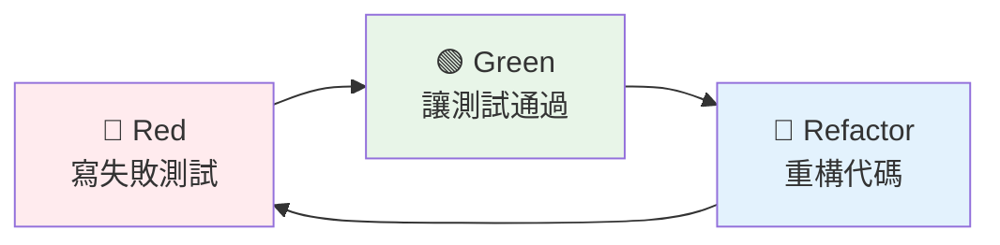

# TDD 測試驅動開發 & BDD 行為驅動開發

## 概述

本文檔提供完整的 TDD (Test-Driven Development) 和 BDD (Behavior-Driven Development) 指南，包含測試驅動開發、行為驅動開發、測試類型和測試自動化的實作方法。

## 🧪 測試與品質保證

### 測試金字塔

```
    /\
   /  \
  / E2E \ ← 5%: 端到端測試 (慢、昂貴、脆弱)
 /______\
/        \
/ Integration \ ← 15%: 整合測試 (中等速度、中等成本)
/______________\
/              \
/  Unit Tests   \ ← 80%: 單元測試 (快速、便宜、穩定)
/________________\
```

### 測試標準

- **測試覆蓋率**: > 80%
- **單元測試執行時間**: < 50ms
- **整合測試執行時間**: < 500ms
- **端到端測試執行時間**: < 3s

## TDD 測試驅動開發

### 🔴🟢🔵 Red-Green-Refactor

#### TDD 循環流程



#### 1. Red 階段：寫失敗測試

**原則**:
- 先寫測試，後寫實作
- 測試應該明確表達需求
- 確保測試會失敗（證明測試有效）

```java
@ExtendWith(MockitoExtension.class)
class CustomerServiceTest {
    
    @Mock
    private CustomerRepository customerRepository;
    
    @Mock
    private EmailService emailService;
    
    @InjectMocks
    private CustomerService customerService;
    
    @Test
    void should_create_customer_and_send_welcome_email() {
        // Given - 準備測試數據
        CreateCustomerCommand command = new CreateCustomerCommand(
            "John Doe",
            "john@example.com",
            "0912345678"
        );
        
        Customer expectedCustomer = Customer.builder()
            .id(CustomerId.generate())
            .name(new CustomerName("John Doe"))
            .email(new Email("john@example.com"))
            .phone(new Phone("0912345678"))
            .build();
        
        when(customerRepository.save(any(Customer.class)))
            .thenReturn(expectedCustomer);
        
        // When - 執行被測試的方法
        Customer result = customerService.createCustomer(command);
        
        // Then - 驗證結果
        assertThat(result).isNotNull();
        assertThat(result.getName().getValue()).isEqualTo("John Doe");
        assertThat(result.getEmail().getValue()).isEqualTo("john@example.com");
        
        // 驗證交互
        verify(customerRepository).save(any(Customer.class));
        verify(emailService).sendWelcomeEmail(
            eq("john@example.com"), 
            eq("John Doe")
        );
    }
}
```

#### 2. Green 階段：讓測試通過

**原則**:
- 寫最少的代碼讓測試通過
- 不要過度設計
- 專注於滿足測試需求

```java
@Service
@Transactional
public class CustomerService {
    
    private final CustomerRepository customerRepository;
    private final EmailService emailService;
    
    public CustomerService(CustomerRepository customerRepository, 
                          EmailService emailService) {
        this.customerRepository = customerRepository;
        this.emailService = emailService;
    }
    
    public Customer createCustomer(CreateCustomerCommand command) {
        // 最簡單的實作讓測試通過
        Customer customer = Customer.builder()
            .id(CustomerId.generate())
            .name(new CustomerName(command.name()))
            .email(new Email(command.email()))
            .phone(new Phone(command.phone()))
            .build();
        
        Customer savedCustomer = customerRepository.save(customer);
        
        // 發送歡迎郵件
        emailService.sendWelcomeEmail(
            savedCustomer.getEmail().getValue(),
            savedCustomer.getName().getValue()
        );
        
        return savedCustomer;
    }
}
```

#### 3. Refactor 階段：重構代碼

**原則**:
- 改善代碼結構，不改變行為
- 消除重複代碼
- 提高可讀性和可維護性
- 確保所有測試仍然通過

```java
@Service
@Transactional
public class CustomerService {
    
    private final CustomerRepository customerRepository;
    private final EmailService emailService;
    private final CustomerFactory customerFactory;
    
    public CustomerService(CustomerRepository customerRepository, 
                          EmailService emailService,
                          CustomerFactory customerFactory) {
        this.customerRepository = customerRepository;
        this.emailService = emailService;
        this.customerFactory = customerFactory;
    }
    
    public Customer createCustomer(CreateCustomerCommand command) {
        // 重構：使用工廠模式創建客戶
        Customer customer = customerFactory.createFromCommand(command);
        
        // 重構：提取方法
        Customer savedCustomer = saveCustomer(customer);
        sendWelcomeNotification(savedCustomer);
        
        return savedCustomer;
    }
    
    private Customer saveCustomer(Customer customer) {
        return customerRepository.save(customer);
    }
    
    private void sendWelcomeNotification(Customer customer) {
        emailService.sendWelcomeEmail(
            customer.getEmail().getValue(),
            customer.getName().getValue()
        );
    }
}
```

### 🏗️ 測試金字塔

#### 單元測試 (80%)

**特點**: 快速、隔離、專注於單一功能

```java
@ExtendWith(MockitoExtension.class)
class CustomerTest {
    
    @Test
    void should_calculate_discount_for_vip_customer() {
        // Given
        Customer vipCustomer = CustomerTestBuilder.aCustomer()
            .withMembershipLevel(MembershipLevel.VIP)
            .build();
        
        Order order = OrderTestBuilder.anOrder()
            .withTotalAmount(Money.twd(1000))
            .build();
        
        // When
        Money discount = vipCustomer.calculateDiscount(order);
        
        // Then
        assertThat(discount).isEqualTo(Money.twd(100)); // 10% 折扣
    }
    
    @Test
    void should_throw_exception_when_email_is_invalid() {
        // Given
        String invalidEmail = "invalid-email";
        
        // When & Then
        assertThatThrownBy(() -> new Email(invalidEmail))
            .isInstanceOf(IllegalArgumentException.class)
            .hasMessage("Invalid email format");
    }
}
```

#### 整合測試 (15%)

**特點**: 測試組件間的互動

```java
@DataJpaTest
@ActiveProfiles("test")
class CustomerRepositoryTest {
    
    @Autowired
    private TestEntityManager entityManager;
    
    @Autowired
    private CustomerRepository customerRepository;
    
    @Test
    void should_save_and_find_customer_by_email() {
        // Given
        Customer customer = CustomerTestBuilder.aCustomer()
            .withEmail("test@example.com")
            .build();
        
        // When
        Customer savedCustomer = customerRepository.save(customer);
        entityManager.flush();
        entityManager.clear();
        
        Optional<Customer> foundCustomer = customerRepository.findByEmail(
            new Email("test@example.com")
        );
        
        // Then
        assertThat(foundCustomer).isPresent();
        assertThat(foundCustomer.get().getId()).isEqualTo(savedCustomer.getId());
        assertThat(foundCustomer.get().getEmail().getValue()).isEqualTo("test@example.com");
    }
}
```

#### 端到端測試 (5%)

**特點**: 測試完整的用戶旅程

```java
@SpringBootTest(webEnvironment = SpringBootTest.WebEnvironment.RANDOM_PORT)
@ActiveProfiles("test")
class CustomerE2ETest {
    
    @Autowired
    private TestRestTemplate restTemplate;
    
    @LocalServerPort
    private int port;
    
    @Test
    void should_complete_customer_registration_journey() {
        // Given
        CreateCustomerRequest request = new CreateCustomerRequest(
            "John Doe",
            "john@example.com",
            "password123"
        );
        
        // When - 創建客戶
        ResponseEntity<CustomerResponse> createResponse = restTemplate.postForEntity(
            "http://localhost:" + port + "/../api/v1/customers",
            request,
            CustomerResponse.class
        );
        
        // Then - 驗證創建成功
        assertThat(createResponse.getStatusCode()).isEqualTo(HttpStatus.CREATED);
        assertThat(createResponse.getBody().getName()).isEqualTo("John Doe");
        
        String customerId = createResponse.getBody().getId();
        
        // When - 查詢客戶
        ResponseEntity<CustomerResponse> getResponse = restTemplate.getForEntity(
            "http://localhost:" + port + "/../api/v1/customers/" + customerId,
            CustomerResponse.class
        );
        
        // Then - 驗證查詢成功
        assertThat(getResponse.getStatusCode()).isEqualTo(HttpStatus.OK);
        assertThat(getResponse.getBody().getName()).isEqualTo("John Doe");
        assertThat(getResponse.getBody().getEmail()).isEqualTo("john@example.com");
    }
}
```

### ⚡ 單元測試模式

#### 測試數據建構器模式

```java
public class CustomerTestBuilder {
    private CustomerId id = CustomerId.generate();
    private CustomerName name = new CustomerName("Test Customer");
    private Email email = new Email("test@example.com");
    private Phone phone = new Phone("0912345678");
    private MembershipLevel membershipLevel = MembershipLevel.STANDARD;
    
    public static CustomerTestBuilder aCustomer() {
        return new CustomerTestBuilder();
    }
    
    public CustomerTestBuilder withId(CustomerId id) {
        this.id = id;
        return this;
    }
    
    public CustomerTestBuilder withName(String name) {
        this.name = new CustomerName(name);
        return this;
    }
    
    public CustomerTestBuilder withEmail(String email) {
        this.email = new Email(email);
        return this;
    }
    
    public CustomerTestBuilder withMembershipLevel(MembershipLevel level) {
        this.membershipLevel = level;
        return this;
    }
    
    public Customer build() {
        return Customer.builder()
            .id(id)
            .name(name)
            .email(email)
            .phone(phone)
            .membershipLevel(membershipLevel)
            .registrationDate(LocalDateTime.now())
            .build();
    }
}
```

#### 測試命名規範

```java
// ✅ 好的測試命名
@Test
void should_create_customer_and_send_welcome_email_when_valid_command_provided() {
    // 測試實作
}

@Test
void should_throw_exception_when_customer_email_is_invalid() {
    // 測試實作
}

@Test
void should_upgrade_customer_to_vip_when_total_spending_exceeds_threshold() {
    // 測試實作
}

// ❌ 不好的測試命名
@Test
void testCreateCustomer() {
    // 不清楚測試什麼
}

@Test
void test1() {
    // 完全沒有意義
}
```

## BDD 行為驅動開發

### 📝 Gherkin 語法

#### 基本語法結構

```gherkin
Feature: 客戶管理
  作為系統管理員
  我想要管理客戶資料
  以便提供更好的服務

  Background:
    Given 系統已經啟動
    And 資料庫已經初始化

  Scenario: 成功創建新客戶
    Given 一個有效的客戶資料
    When 提交客戶創建請求
    Then 應該成功創建客戶
    And 客戶應該存在於資料庫中
    And 應該發送歡迎郵件

  Scenario Outline: 驗證客戶資料格式
    Given 客戶姓名為 "<name>"
    And 客戶電子郵件為 "<email>"
    When 提交客戶創建請求
    Then 應該返回 "<status>" 狀態
    And 錯誤訊息應該包含 "<error_message>"

    Examples:
      | name     | email           | status | error_message    |
      |          | john@email.com  | 400    | Name is required |
      | John Doe |                 | 400    | Email is required|
      | John Doe | invalid-email   | 400    | Invalid email    |
```

#### Gherkin 關鍵字

- **Feature**: 功能描述
- **Background**: 每個場景的共同前置條件
- **Scenario**: 具體的測試場景
- **Scenario Outline**: 參數化場景模板
- **Given**: 前置條件（準備測試環境）
- **When**: 執行動作（觸發被測試的行為）
- **Then**: 驗證結果（檢查預期結果）
- **And**: 連接詞，增加可讀性
- **But**: 否定連接詞
- **Examples**: 提供場景大綱的測試數據

### 📋 Given-When-Then

#### Given-When-Then 模式

```java
@Component
public class CustomerStepDefinitions {
    
    @Autowired
    private TestRestTemplate restTemplate;
    
    @Autowired
    private CustomerRepository customerRepository;
    
    private ResponseEntity<CustomerResponse> lastResponse;
    private CreateCustomerRequest customerRequest;
    
    @Given("一個有效的客戶資料")
    public void a_valid_customer_data() {
        customerRequest = new CreateCustomerRequest(
            "John Doe",
            "john@example.com",
            "password123"
        );
    }
    
    @Given("客戶姓名為 {string}")
    public void customer_name_is(String name) {
        customerRequest = new CreateCustomerRequest(
            name,
            "john@example.com",
            "password123"
        );
    }
    
    @Given("客戶電子郵件為 {string}")
    public void customer_email_is(String email) {
        customerRequest = new CreateCustomerRequest(
            customerRequest != null ? customerRequest.name() : "John Doe",
            email,
            "password123"
        );
    }
    
    @When("提交客戶創建請求")
    public void submit_customer_creation_request() {
        lastResponse = restTemplate.postForEntity(
            "/../api/v1/customers",
            customerRequest,
            CustomerResponse.class
        );
    }
    
    @Then("應該成功創建客戶")
    public void should_successfully_create_customer() {
        assertThat(lastResponse.getStatusCode()).isEqualTo(HttpStatus.CREATED);
        assertThat(lastResponse.getBody())
            .isNotNull()
            .satisfies(customer -> {
                assertThat(customer.getName()).isEqualTo("John Doe");
                assertThat(customer.getEmail()).isEqualTo("john@example.com");
            });
    }
    
    @Then("客戶應該存在於資料庫中")
    public void customer_should_exist_in_database() {
        String customerId = lastResponse.getBody().getId();
        Optional<Customer> customer = customerRepository.findById(customerId);
        
        assertThat(customer)
            .isPresent()
            .get()
            .satisfies(c -> {
                assertThat(c.getName()).isEqualTo("John Doe");
                assertThat(c.getEmail()).isEqualTo("john@example.com");
            });
    }
    
    @Then("應該返回 {string} 狀態")
    public void should_return_status(String expectedStatus) {
        int statusCode = Integer.parseInt(expectedStatus);
        assertThat(lastResponse.getStatusCode().value()).isEqualTo(statusCode);
    }
    
    @Then("錯誤訊息應該包含 {string}")
    public void error_message_should_contain(String expectedMessage) {
        // 假設錯誤響應包含錯誤訊息
        assertThat(lastResponse.getBody().toString()).contains(expectedMessage);
    }
}
```

### 🎬 Feature 文件編寫

#### 完整的 Feature 文件範例

```gherkin
# src/test/resources/features/customer-management.feature
Feature: 客戶管理
  作為系統管理員
  我想要管理客戶資料
  以便提供更好的服務

  Background:
    Given 系統已經啟動
    And 資料庫已經初始化

  @smoke
  Scenario: 成功創建新客戶
    Given 一個有效的客戶資料
    When 提交客戶創建請求
    Then 應該成功創建客戶
    And 客戶應該存在於資料庫中
    And 應該發送歡迎郵件

  @validation
  Scenario Outline: 驗證客戶資料格式
    Given 客戶姓名為 "<name>"
    And 客戶電子郵件為 "<email>"
    When 提交客戶創建請求
    Then 應該返回 "<status>" 狀態
    And 錯誤訊息應該包含 "<error_message>"

    Examples:
      | name     | email           | status | error_message    |
      |          | john@email.com  | 400    | Name is required |
      | John Doe |                 | 400    | Email is required|
      | John Doe | invalid-email   | 400    | Invalid email    |

  @integration
  Scenario: 查詢客戶列表
    Given 系統中存在以下客戶:
      | name     | email           | status |
      | John Doe | john@email.com  | ACTIVE |
      | Jane Doe | jane@email.com  | ACTIVE |
    When 查詢客戶列表
    Then 應該返回 2 個客戶
    And 客戶列表應該包含 "John Doe"
    And 客戶列表應該包含 "Jane Doe"

  @business-rule
  Scenario: VIP 客戶升級
    Given 一個標準客戶 "John Doe"
    And 客戶的總消費金額為 50000 元
    When 系統檢查客戶等級
    Then 客戶應該被升級為 VIP
    And 應該發送升級通知郵件
```

### 🎯 場景設計

#### 場景設計原則

1. **業務價值導向**: 每個場景都應該代表真實的業務價值
2. **獨立性**: 場景之間應該相互獨立
3. **可讀性**: 使用業務語言，避免技術術語
4. **可維護性**: 場景應該易於維護和更新

#### 場景分類

```gherkin
# 冒煙測試場景
@smoke
Scenario: 系統基本功能驗證
  Given 系統已啟動
  When 訪問健康檢查端點
  Then 系統應該返回正常狀態

# 回歸測試場景
@regression
Scenario: 客戶資料完整性檢查
  Given 一個完整的客戶資料
  When 創建客戶
  Then 所有客戶資料應該正確保存

# 邊界測試場景
@boundary
Scenario: 客戶姓名長度限制
  Given 客戶姓名長度為 101 個字符
  When 嘗試創建客戶
  Then 應該返回姓名過長錯誤

# 安全測試場景
@security
Scenario: 未授權訪問客戶資料
  Given 一個未登入的用戶
  When 嘗試訪問客戶列表
  Then 應該返回未授權錯誤
```

## 🔗 測試類型

### 🔗 整合測試

#### Spring Boot 整合測試

```java
@SpringBootTest
@ActiveProfiles("test")
@Transactional
class CustomerApplicationServiceIntegrationTest {
    
    @Autowired
    private CustomerApplicationService customerApplicationService;
    
    @Autowired
    private CustomerRepository customerRepository;
    
    @MockBean
    private EmailService emailService;
    
    @Test
    void should_create_customer_and_persist_to_database() {
        // Given
        CreateCustomerCommand command = new CreateCustomerCommand(
            "John Doe", "john@example.com", "0912345678"
        );
        
        // When
        Customer result = customerApplicationService.createCustomer(command);
        
        // Then
        assertThat(result.getId()).isNotNull();
        
        // 驗證資料庫持久化
        Optional<Customer> savedCustomer = customerRepository.findById(result.getId());
        assertThat(savedCustomer).isPresent();
        assertThat(savedCustomer.get().getName().getValue()).isEqualTo("John Doe");
        
        // 驗證外部服務調用
        verify(emailService).sendWelcomeEmail("john@example.com", "John Doe");
    }
}
```

#### 資料庫整合測試

```java
@DataJpaTest
@ActiveProfiles("test")
class CustomerRepositoryIntegrationTest {
    
    @Autowired
    private TestEntityManager entityManager;
    
    @Autowired
    private CustomerRepository customerRepository;
    
    @Test
    void should_find_customers_by_membership_level() {
        // Given
        Customer vipCustomer = CustomerTestBuilder.aCustomer()
            .withName("VIP Customer")
            .withMembershipLevel(MembershipLevel.VIP)
            .build();
        
        Customer standardCustomer = CustomerTestBuilder.aCustomer()
            .withName("Standard Customer")
            .withMembershipLevel(MembershipLevel.STANDARD)
            .build();
        
        entityManager.persistAndFlush(vipCustomer);
        entityManager.persistAndFlush(standardCustomer);
        entityManager.clear();
        
        // When
        List<Customer> vipCustomers = customerRepository.findByMembershipLevel(MembershipLevel.VIP);
        
        // Then
        assertThat(vipCustomers).hasSize(1);
        assertThat(vipCustomers.get(0).getName().getValue()).isEqualTo("VIP Customer");
    }
}
```

### ⚡ 效能測試 - @TestPerformanceExtension

#### 效能測試註解

```java
// 基本效能監控
@TestPerformanceExtension(maxExecutionTimeMs = 10000, maxMemoryIncreaseMB = 100)
@IntegrationTest
public class CustomerServicePerformanceTest extends BaseIntegrationTest {
    
    @Autowired
    private CustomerApplicationService customerApplicationService;
    
    @Test
    void should_create_multiple_customers_within_time_limit() {
        // Given
        List<CreateCustomerCommand> commands = IntStream.range(0, 100)
            .mapToObj(i -> new CreateCustomerCommand(
                "Customer " + i,
                "customer" + i + "@example.com",
                "091234567" + i
            ))
            .collect(Collectors.toList());
        
        // When & Then - 自動監控執行時間和記憶體使用
        commands.forEach(customerApplicationService::createCustomer);
        
        // 測試完成後會自動生成效能報告
    }
}

// 高要求效能測試
@TestPerformanceExtension(maxExecutionTimeMs = 30000, maxMemoryIncreaseMB = 200)
public class ComplexIntegrationTest extends BaseIntegrationTest {
    
    @Test
    void should_handle_complex_business_scenario() {
        // 複雜的業務場景測試
        // 自動監控效能並生成詳細報告
    }
}
```

#### 效能測試資源管理

```java
// 使用 TestPerformanceResourceManager 監控資源
@TestComponent
public class TestPerformanceResourceManager {
    
    public ResourceUsageStats getResourceUsageStats() {
        // 獲取當前記憶體和資源使用統計
        return new ResourceUsageStats(
            getCurrentMemoryUsage(),
            getMaxMemoryAvailable(),
            getMemoryUsagePercentage(),
            getActiveResourceCount()
        );
    }
    
    public void forceCleanup() {
        // 強制清理所有測試資源
        System.gc();
        // 清理臨時資源
        // 重置應用狀態
    }
}

// 在測試中使用資源管理
@Test
void should_manage_resources_during_load_test() {
    ResourceUsageStats initialStats = resourceManager.getResourceUsageStats();
    
    // 執行大量操作
    performHeavyOperations();
    
    ResourceUsageStats finalStats = resourceManager.getResourceUsageStats();
    
    // 檢查記憶體使用是否在可接受範圍內
    assertThat(finalStats.memoryUsagePercentage()).isLessThan(80.0);
    
    // 如果需要，強制清理資源
    if (finalStats.memoryUsagePercentage() > 70.0) {
        resourceManager.forceCleanup();
    }
}
```

### 🏛️ 架構測試 - ArchUnit 規則

#### 基本架構規則

```java
@ArchTest
static final ArchRule domain_should_not_depend_on_infrastructure =
    noClasses()
        .that().resideInAPackage("..domain..")
        .should().dependOnClassesThat()
        .resideInAPackage("..infrastructure..");

@ArchTest
static final ArchRule application_should_only_depend_on_domain_and_ports =
    classes()
        .that().resideInAPackage("..application..")
        .should().onlyDependOnClassesThat()
        .resideInAnyPackage("..domain..", "..application..", "java..", "org.springframework..");

@ArchTest
static final ArchRule aggregateRootRules = classes()
    .that().areAnnotatedWith(AggregateRoot.class)
    .should().implement(AggregateRootInterface.class)
    .because("聚合根必須實作 AggregateRootInterface");

@ArchTest
static final ArchRule valueObjectRules = classes()
    .that().areAnnotatedWith(ValueObject.class)
    .should().beRecords()
    .because("值對象應該使用 Record 實作");
```

#### DDD 架構規則

```java
@ArchTest
static final ArchRule domainEventRules = classes()
    .that().implement(DomainEvent.class)
    .should().beRecords()
    .and().haveSimpleNameEndingWith("Event")
    .because("領域事件應該使用 Record 實作並以 Event 結尾");

@ArchTest
static final ArchRule eventHandlerRules = classes()
    .that().areAnnotatedWith(Component.class)
    .and().haveSimpleNameEndingWith("EventHandler")
    .should().beAssignableTo(DomainEventHandler.class)
    .because("事件處理器必須實作 DomainEventHandler 介面");

@ArchTest
static final ArchRule repositoryRules = classes()
    .that().haveSimpleNameEndingWith("Repository")
    .and().areNotInterfaces()
    .should().beAnnotatedWith(Repository.class)
    .because("Repository 實作類別應該使用 @Repository 註解");
```

#### 測試架構規則

```java
@ArchTest
static final ArchRule test_classes_should_be_in_test_package =
    classes()
        .that().haveSimpleNameEndingWith("Test")
        .should().resideInAPackage("..test..");

@ArchTest
static final ArchRule test_methods_should_be_package_private =
    methods()
        .that().areAnnotatedWith(Test.class)
        .should().bePackagePrivate();

@ArchTest
static final ArchRule integration_tests_should_extend_base_class =
    classes()
        .that().areAnnotatedWith(SpringBootTest.class)
        .should().beAssignableTo(BaseIntegrationTest.class)
        .because("整合測試應該繼承 BaseIntegrationTest");
```

### 🤖 測試自動化

#### Gradle 測試任務配置

```gradle
// 測試任務分類
tasks.register('unitTest', Test) {
    description = 'Fast unit tests (~5MB, ~50ms each)'
    useJUnitPlatform {
        excludeTags 'integration', 'end-to-end', 'slow'
        includeTags 'unit'
    }
    maxHeapSize = '2g'
    maxParallelForks = Runtime.runtime.availableProcessors()
    forkEvery = 0  // No JVM restart for speed
}

tasks.register('integrationTest', Test) {
    description = 'Integration tests (~50MB, ~500ms each)'
    useJUnitPlatform {
        includeTags 'integration'
        excludeTags 'end-to-end', 'slow'
    }
    maxHeapSize = '6g'
    minHeapSize = '2g'
    maxParallelForks = 1
    forkEvery = 5
    timeout = Duration.ofMinutes(30)
    
    // JVM 優化參數
    jvmArgs += [
        '--enable-preview',
        '-XX:MaxMetaspaceSize=1g',
        '-XX:+UseG1GC',
        '-XX:+UseStringDeduplication',
        '-XX:G1HeapRegionSize=32m'
    ]
}

tasks.register('e2eTest', Test) {
    description = 'End-to-end tests (~500MB, ~3s each)'
    useJUnitPlatform {
        includeTags 'end-to-end'
    }
    maxHeapSize = '8g'
    minHeapSize = '3g'
    maxParallelForks = 1
    forkEvery = 2
    timeout = Duration.ofHours(1)
}

// Cucumber 測試
tasks.register('cucumber', JavaExec) {
    mainClass = 'io.cucumber.core.cli.Main'
    classpath = configurations.cucumberRuntime + sourceSets.main.output + sourceSets.test.output
    args = [
        '--plugin', 'pretty',
        '--plugin', 'html:build/reports/cucumber',
        '--plugin', 'json:build/reports/cucumber/cucumber.json',
        '--glue', 'solid.humank.genaidemo.bdd',
        'src/test/resources/features'
    ]
}
```

#### CI/CD 整合

```yaml
# .github/workflows/test.yml
name: Test Pipeline

on:
  push:
    branches: [ main, develop ]
  pull_request:
    branches: [ main ]

jobs:
  unit-tests:
    runs-on: ubuntu-latest
    steps:
      - uses: actions/checkout@v4
      
      - name: Set up JDK 21
        uses: actions/setup-java@v4
        with:
          java-version: '21'
          distribution: 'temurin'
      
      - name: Run unit tests
        run: ./gradlew unitTest
      
      - name: Upload test results
        uses: actions/upload-artifact@v4
        if: always()
        with:
          name: unit-test-results
          path: build/reports/tests/unitTest/

  integration-tests:
    runs-on: ubuntu-latest
    needs: unit-tests
    steps:
      - uses: actions/checkout@v4
      
      - name: Set up JDK 21
        uses: actions/setup-java@v4
        with:
          java-version: '21'
          distribution: 'temurin'
      
      - name: Run integration tests
        run: ./gradlew integrationTest
      
      - name: Generate performance report
        run: ./gradlew generatePerformanceReport
      
      - name: Upload performance reports
        uses: actions/upload-artifact@v4
        with:
          name: performance-reports
          path: build/reports/test-performance/

  e2e-tests:
    runs-on: ubuntu-latest
    needs: integration-tests
    if: github.ref == 'refs/heads/main'
    steps:
      - uses: actions/checkout@v4
      
      - name: Set up JDK 21
        uses: actions/setup-java@v4
        with:
          java-version: '21'
          distribution: 'temurin'
      
      - name: Run E2E tests
        run: ./gradlew e2eTest
      
      - name: Run Cucumber tests
        run: ./gradlew cucumber
```

#### 測試報告生成

```gradle
// 測試報告配置
test {
    useJUnitPlatform()
    
    // 測試報告
    reports {
        html.required = true
        junitXml.required = true
    }
    
    // 測試事件監聽
    testLogging {
        events "passed", "skipped", "failed"
        exceptionFormat "full"
        showStandardStreams = false
    }
    
    // 失敗時繼續執行
    ignoreFailures = false
    
    // 並行執行
    maxParallelForks = Runtime.runtime.availableProcessors()
}

// JaCoCo 測試覆蓋率
jacoco {
    toolVersion = "0.8.11"
}

jacocoTestReport {
    dependsOn test
    reports {
        xml.required = true
        html.required = true
        csv.required = false
    }
    
    executionData fileTree(dir: "$buildDir/jacoco", include: "**/*.exec")
}

// 覆蓋率驗證
jacocoTestCoverageVerification {
    dependsOn jacocoTestReport
    violationRules {
        rule {
            limit {
                minimum = 0.80 // 80% 覆蓋率要求
            }
        }
        rule {
            element = 'CLASS'
            excludes = [
                '*.config.*',
                '*.dto.*',
                '*.entity.*'
            ]
            limit {
                counter = 'LINE'
                value = 'COVEREDRATIO'
                minimum = 0.75
            }
        }
    }
}
```

## 最佳實踐總結

### TDD 最佳實踐

1. **測試先行**: 始終先寫測試，後寫實作
2. **小步快跑**: 每次只實作讓測試通過的最少代碼
3. **持續重構**: 在測試保護下持續改善代碼結構
4. **測試命名**: 使用描述性的測試名稱表達業務意圖

### BDD 最佳實踐

1. **業務語言**: 使用業務領域的語言編寫場景
2. **協作開發**: 讓業務人員參與場景設計
3. **活文檔**: 將 Feature 文件作為活的需求文檔
4. **場景獨立**: 確保場景之間相互獨立

### 測試策略

1. **測試金字塔**: 80% 單元測試，15% 整合測試，5% 端到端測試
2. **快速反饋**: 優先執行快速的單元測試
3. **效能監控**: 使用 @TestPerformanceExtension 監控測試效能
4. **架構守護**: 使用 ArchUnit 確保架構一致性

### 自動化策略

1. **分層執行**: 根據測試類型分層執行
2. **並行處理**: 合理使用並行執行提高效率
3. **報告生成**: 自動生成詳細的測試和效能報告
4. **持續整合**: 在 CI/CD 流程中整合所有測試類型

---

**相關文檔**
- DDD 領域驅動設計
- 六角架構
- 技術棧與工具鏈