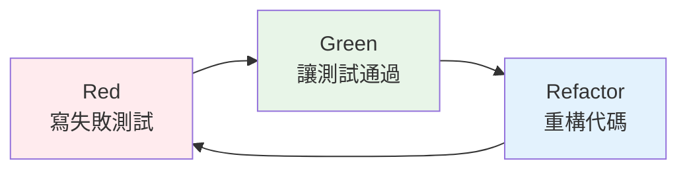

# TDD Red-Green-Refactor 實踐指南

## 概述

本指南基於專案中的 TDD 實踐，提供 Red-Green-Refactor 循環的具體實作方法和最佳實踐。

## TDD 循環

### Red-Green-Refactor 流程



### 1. Red 階段：寫失敗測試

#### 原則
- 先寫測試，後寫實作
- 測試應該明確表達需求
- 確保測試會失敗（證明測試有效）

#### 實作範例

```java
@ExtendWith(MockitoExtension.class)
class CustomerServiceTest {
    
    @Mock
    private CustomerRepository customerRepository;
    
    @Mock
    private EmailService emailService;
    
    @InjectMocks
    private CustomerService customerService;
    
    @Test
    void should_create_customer_and_send_welcome_email() {
        // Given - 準備測試數據
        CreateCustomerCommand command = new CreateCustomerCommand(
            "John Doe",
            "john@example.com",
            "0912345678"
        );
        
        Customer expectedCustomer = Customer.builder()
            .id(CustomerId.generate())
            .name(new CustomerName("John Doe"))
            .email(new Email("john@example.com"))
            .phone(new Phone("0912345678"))
            .build();
        
        when(customerRepository.save(any(Customer.class)))
            .thenReturn(expectedCustomer);
        
        // When - 執行被測試的方法
        Customer result = customerService.createCustomer(command);
        
        // Then - 驗證結果
        assertThat(result).isNotNull();
        assertThat(result.getName().getValue()).isEqualTo("John Doe");
        assertThat(result.getEmail().getValue()).isEqualTo("john@example.com");
        
        // 驗證交互
        verify(customerRepository).save(any(Customer.class));
        verify(emailService).sendWelcomeEmail(
            eq("john@example.com"), 
            eq("John Doe")
        );
    }
}
```

**此時測試會失敗，因為 `CustomerService.createCustomer()` 方法還不存在。**

### 2. Green 階段：讓測試通過

#### 原則
- 寫最少的代碼讓測試通過
- 不要過度設計
- 專注於滿足測試需求

#### 實作範例

```java
@Service
@Transactional
public class CustomerService {
    
    private final CustomerRepository customerRepository;
    private final EmailService emailService;
    
    public CustomerService(CustomerRepository customerRepository, 
                          EmailService emailService) {
        this.customerRepository = customerRepository;
        this.emailService = emailService;
    }
    
    public Customer createCustomer(CreateCustomerCommand command) {
        // 最簡單的實作讓測試通過
        Customer customer = Customer.builder()
            .id(CustomerId.generate())
            .name(new CustomerName(command.name()))
            .email(new Email(command.email()))
            .phone(new Phone(command.phone()))
            .build();
        
        Customer savedCustomer = customerRepository.save(customer);
        
        // 發送歡迎郵件
        emailService.sendWelcomeEmail(
            savedCustomer.getEmail().getValue(),
            savedCustomer.getName().getValue()
        );
        
        return savedCustomer;
    }
}
```

**現在測試應該通過了。**

### 3. Refactor 階段：重構代碼

#### 原則
- 改善代碼結構，不改變行為
- 消除重複代碼
- 提高可讀性和可維護性
- 確保所有測試仍然通過

#### 重構範例

```java
@Service
@Transactional
public class CustomerService {
    
    private final CustomerRepository customerRepository;
    private final EmailService emailService;
    private final CustomerFactory customerFactory;
    
    public CustomerService(CustomerRepository customerRepository, 
                          EmailService emailService,
                          CustomerFactory customerFactory) {
        this.customerRepository = customerRepository;
        this.emailService = emailService;
        this.customerFactory = customerFactory;
    }
    
    public Customer createCustomer(CreateCustomerCommand command) {
        // 重構：使用工廠模式創建客戶
        Customer customer = customerFactory.createFromCommand(command);
        
        // 重構：提取方法
        Customer savedCustomer = saveCustomer(customer);
        sendWelcomeNotification(savedCustomer);
        
        return savedCustomer;
    }
    
    private Customer saveCustomer(Customer customer) {
        return customerRepository.save(customer);
    }
    
    private void sendWelcomeNotification(Customer customer) {
        emailService.sendWelcomeEmail(
            customer.getEmail().getValue(),
            customer.getName().getValue()
        );
    }
}

// 新增的工廠類
@Component
public class CustomerFactory {
    
    public Customer createFromCommand(CreateCustomerCommand command) {
        validateCommand(command);
        
        return Customer.builder()
            .id(CustomerId.generate())
            .name(new CustomerName(command.name()))
            .email(new Email(command.email()))
            .phone(new Phone(command.phone()))
            .membershipLevel(MembershipLevel.STANDARD)
            .registrationDate(LocalDateTime.now())
            .build();
    }
    
    private void validateCommand(CreateCustomerCommand command) {
        if (command.name() == null || command.name().trim().isEmpty()) {
            throw new IllegalArgumentException("Customer name cannot be empty");
        }
        if (command.email() == null || !isValidEmail(command.email())) {
            throw new IllegalArgumentException("Invalid email format");
        }
    }
    
    private boolean isValidEmail(String email) {
        return email.contains("@") && email.contains(".");
    }
}
```

## TDD 最佳實踐

### 1. 測試命名規範

```java
// ✅ 好的測試命名
@Test
void should_create_customer_and_send_welcome_email_when_valid_command_provided() {
    // 測試實作
}

@Test
void should_throw_exception_when_customer_email_is_invalid() {
    // 測試實作
}

@Test
void should_upgrade_customer_to_vip_when_total_spending_exceeds_threshold() {
    // 測試實作
}

// ❌ 不好的測試命名
@Test
void testCreateCustomer() {
    // 不清楚測試什麼
}

@Test
void test1() {
    // 完全沒有意義
}
```

### 2. 測試結構：AAA 模式

```java
@Test
void should_calculate_discount_for_vip_customer() {
    // Arrange - 準備測試數據
    Customer vipCustomer = CustomerTestBuilder.aCustomer()
        .withMembershipLevel(MembershipLevel.VIP)
        .build();
    
    Order order = OrderTestBuilder.anOrder()
        .withTotalAmount(Money.twd(1000))
        .build();
    
    // Act - 執行被測試的行為
    Money discount = vipCustomer.calculateDiscount(order);
    
    // Assert - 驗證結果
    assertThat(discount).isEqualTo(Money.twd(100)); // 10% 折扣
}
```

### 3. 測試數據建構器

```java
public class CustomerTestBuilder {
    private CustomerId id = CustomerId.generate();
    private CustomerName name = new CustomerName("Test Customer");
    private Email email = new Email("test@example.com");
    private Phone phone = new Phone("0912345678");
    private MembershipLevel membershipLevel = MembershipLevel.STANDARD;
    
    public static CustomerTestBuilder aCustomer() {
        return new CustomerTestBuilder();
    }
    
    public CustomerTestBuilder withId(CustomerId id) {
        this.id = id;
        return this;
    }
    
    public CustomerTestBuilder withName(String name) {
        this.name = new CustomerName(name);
        return this;
    }
    
    public CustomerTestBuilder withEmail(String email) {
        this.email = new Email(email);
        return this;
    }
    
    public CustomerTestBuilder withMembershipLevel(MembershipLevel level) {
        this.membershipLevel = level;
        return this;
    }
    
    public Customer build() {
        return Customer.builder()
            .id(id)
            .name(name)
            .email(email)
            .phone(phone)
            .membershipLevel(membershipLevel)
            .registrationDate(LocalDateTime.now())
            .build();
    }
}
```

### 4. 邊界條件測試

```java
@Test
void should_handle_edge_cases_in_discount_calculation() {
    Customer customer = CustomerTestBuilder.aCustomer()
        .withMembershipLevel(MembershipLevel.VIP)
        .build();
    
    // 測試零金額
    Order zeroAmountOrder = OrderTestBuilder.anOrder()
        .withTotalAmount(Money.twd(0))
        .build();
    
    Money discount = customer.calculateDiscount(zeroAmountOrder);
    assertThat(discount).isEqualTo(Money.twd(0));
    
    // 測試負金額
    assertThatThrownBy(() -> {
        Order negativeAmountOrder = OrderTestBuilder.anOrder()
            .withTotalAmount(Money.twd(-100))
            .build();
        customer.calculateDiscount(negativeAmountOrder);
    }).isInstanceOf(IllegalArgumentException.class);
}
```

## 領域驅動的 TDD

### 1. 聚合根測試

```java
@Test
void should_collect_customer_created_event_when_customer_is_created() {
    // Given
    CreateCustomerCommand command = new CreateCustomerCommand(
        "John Doe", "john@example.com", "0912345678"
    );
    
    // When
    Customer customer = Customer.createFromCommand(command);
    
    // Then
    assertThat(customer.hasUncommittedEvents()).isTrue();
    
    List<DomainEvent> events = customer.getUncommittedEvents();
    assertThat(events).hasSize(1);
    assertThat(events.get(0)).isInstanceOf(CustomerCreatedEvent.class);
    
    CustomerCreatedEvent event = (CustomerCreatedEvent) events.get(0);
    assertThat(event.customerId()).isEqualTo(customer.getId());
    assertThat(event.customerName().getValue()).isEqualTo("John Doe");
}
```

### 2. 值對象測試

```java
@Test
void should_create_valid_email_value_object() {
    // Given
    String validEmailString = "test@example.com";
    
    // When
    Email email = new Email(validEmailString);
    
    // Then
    assertThat(email.getValue()).isEqualTo(validEmailString);
}

@Test
void should_throw_exception_for_invalid_email_format() {
    // Given
    String invalidEmail = "invalid-email";
    
    // When & Then
    assertThatThrownBy(() -> new Email(invalidEmail))
        .isInstanceOf(IllegalArgumentException.class)
        .hasMessage("Invalid email format");
}
```

### 3. 領域服務測試

```java
@Test
void should_determine_shipping_cost_based_on_customer_level_and_order_amount() {
    // Given
    Customer vipCustomer = CustomerTestBuilder.aCustomer()
        .withMembershipLevel(MembershipLevel.VIP)
        .build();
    
    Order largeOrder = OrderTestBuilder.anOrder()
        .withTotalAmount(Money.twd(2000))
        .build();
    
    ShippingCostCalculator calculator = new ShippingCostCalculator();
    
    // When
    Money shippingCost = calculator.calculateShippingCost(vipCustomer, largeOrder);
    
    // Then
    assertThat(shippingCost).isEqualTo(Money.twd(0)); // VIP 客戶免運費
}
```

## 整合測試的 TDD

### 1. 儲存庫測試

```java
@DataJpaTest
class CustomerRepositoryTest {
    
    @Autowired
    private TestEntityManager entityManager;
    
    @Autowired
    private CustomerRepository customerRepository;
    
    @Test
    void should_save_and_find_customer_by_email() {
        // Given
        Customer customer = CustomerTestBuilder.aCustomer()
            .withEmail("test@example.com")
            .build();
        
        // When
        Customer savedCustomer = customerRepository.save(customer);
        entityManager.flush();
        entityManager.clear();
        
        Optional<Customer> foundCustomer = customerRepository.findByEmail(
            new Email("test@example.com")
        );
        
        // Then
        assertThat(foundCustomer).isPresent();
        assertThat(foundCustomer.get().getId()).isEqualTo(savedCustomer.getId());
        assertThat(foundCustomer.get().getEmail().getValue()).isEqualTo("test@example.com");
    }
}
```

### 2. 應用服務整合測試

```java
@SpringBootTest
@Transactional
class CustomerApplicationServiceIntegrationTest {
    
    @Autowired
    private CustomerApplicationService customerApplicationService;
    
    @Autowired
    private CustomerRepository customerRepository;
    
    @MockBean
    private EmailService emailService;
    
    @Test
    void should_create_customer_and_persist_to_database() {
        // Given
        CreateCustomerCommand command = new CreateCustomerCommand(
            "John Doe", "john@example.com", "0912345678"
        );
        
        // When
        Customer result = customerApplicationService.createCustomer(command);
        
        // Then
        assertThat(result.getId()).isNotNull();
        
        // 驗證資料庫持久化
        Optional<Customer> savedCustomer = customerRepository.findById(result.getId());
        assertThat(savedCustomer).isPresent();
        assertThat(savedCustomer.get().getName().getValue()).isEqualTo("John Doe");
        
        // 驗證外部服務調用
        verify(emailService).sendWelcomeEmail("john@example.com", "John Doe");
    }
}
```

## TDD 工具和技巧

### 1. 測試執行策略

```bash
# 快速反饋循環
./gradlew test --tests="CustomerServiceTest" --continuous

# 只執行失敗的測試
./gradlew test --rerun-tasks --fail-fast

# 並行執行測試
./gradlew test --parallel --max-workers=4
```

### 2. 測試覆蓋率監控

```gradle
// build.gradle
jacoco {
    toolVersion = "0.8.8"
}

jacocoTestReport {
    reports {
        xml.required = true
        html.required = true
    }
}

jacocoTestCoverageVerification {
    violationRules {
        rule {
            limit {
                minimum = 0.80 // 80% 覆蓋率要求
            }
        }
    }
}
```

### 3. 測試品質檢查

```java
// 使用 ArchUnit 檢查測試品質
@ArchTest
static final ArchRule test_classes_should_be_in_test_package =
    classes()
        .that().haveSimpleNameEndingWith("Test")
        .should().resideInAPackage("..test..");

@ArchTest
static final ArchRule test_methods_should_be_package_private =
    methods()
        .that().areAnnotatedWith(Test.class)
        .should().bePackagePrivate();
```

## 總結

TDD Red-Green-Refactor 循環提供了：

1. **明確的開發節奏**：測試先行，小步快跑
2. **高品質的代碼**：測試驅動確保代碼可測試性
3. **持續的重構**：在測試保護下安全重構
4. **完整的測試覆蓋**：每個功能都有對應測試

通過遵循這些實踐，可以確保代碼的品質、可維護性和可靠性。