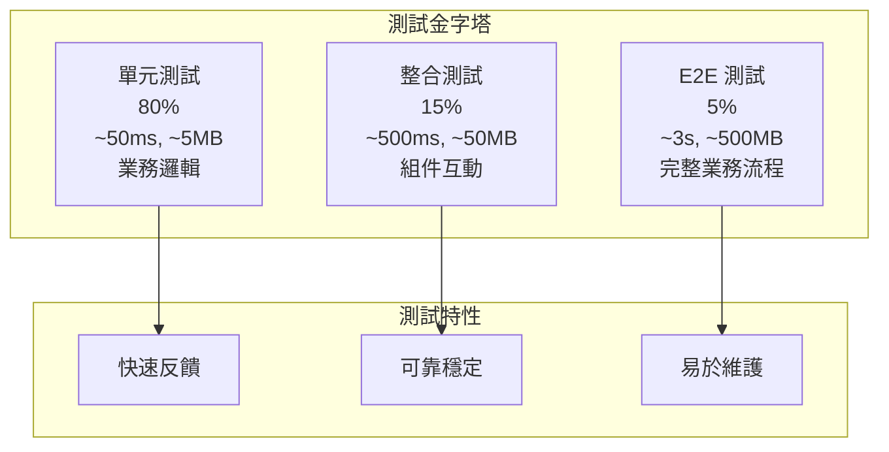

# 測試金字塔策略

## 概述

測試金字塔是一個測試策略模型，指導我們如何分配不同類型測試的比例和重點。本指南詳細說明如何在專案中實施測試金字塔策略。

## 🏗️ 測試金字塔結構

### 金字塔層級



### 各層級詳細說明

#### 單元測試 (80%) - 金字塔底層

**特性**:
- 執行時間: < 50ms
- 記憶體使用: < 5MB
- 成功率: > 99%
- 隔離性: 完全隔離，使用 Mock

**適用場景**:
- 業務邏輯驗證
- 演算法正確性
- 邊界條件測試
- 錯誤處理邏輯

**實作範例**:
```java
@ExtendWith(MockitoExtension.class)
class CustomerServiceUnitTest {
    
    @Mock
    private CustomerRepository customerRepository;
    
    @Mock
    private EmailService emailService;
    
    @InjectMocks
    private CustomerService customerService;
    
    @Test
    void should_calculate_discount_for_premium_customer() {
        // Given
        Customer premiumCustomer = CustomerTestBuilder.aCustomer()
            .withMembershipLevel(MembershipLevel.PREMIUM)
            .build();
        Order order = OrderTestBuilder.anOrder()
            .withTotal(new BigDecimal("100.00"))
            .build();
        
        // When
        BigDecimal discount = customerService.calculateDiscount(premiumCustomer, order);
        
        // Then
        assertThat(discount).isEqualTo(new BigDecimal("10.00"));
    }
    
    @Test
    void should_throw_exception_when_customer_is_null() {
        // Given
        Order order = OrderTestBuilder.anOrder().build();
        
        // When & Then
        assertThatThrownBy(() -> customerService.calculateDiscount(null, order))
            .isInstanceOf(IllegalArgumentException.class)
            .hasMessage("Customer cannot be null");
    }
}
```

#### 整合測試 (15%) - 金字塔中層

**特性**:
- 執行時間: < 500ms
- 記憶體使用: < 50MB
- 成功率: > 95%
- 隔離性: 部分真實依賴

**適用場景**:
- 資料庫互動測試
- API 端點測試
- 外部服務整合
- 組件間協作

**實作範例**:
```java
@DataJpaTest
@ActiveProfiles("test")
class CustomerRepositoryIntegrationTest {
    
    @Autowired
    private TestEntityManager entityManager;
    
    @Autowired
    private CustomerRepository customerRepository;
    
    @Test
    void should_find_customers_by_membership_level() {
        // Given
        Customer premiumCustomer = CustomerTestBuilder.aCustomer()
            .withMembershipLevel(MembershipLevel.PREMIUM)
            .build();
        Customer regularCustomer = CustomerTestBuilder.aCustomer()
            .withMembershipLevel(MembershipLevel.REGULAR)
            .build();
        
        entityManager.persistAndFlush(premiumCustomer);
        entityManager.persistAndFlush(regularCustomer);
        
        // When
        List<Customer> premiumCustomers = customerRepository
            .findByMembershipLevel(MembershipLevel.PREMIUM);
        
        // Then
        assertThat(premiumCustomers).hasSize(1)
            .extracting(Customer::getMembershipLevel)
            .containsOnly(MembershipLevel.PREMIUM);
    }
}

@WebMvcTest(CustomerController.class)
class CustomerControllerIntegrationTest {
    
    @Autowired
    private MockMvc mockMvc;
    
    @MockBean
    private CustomerService customerService;
    
    @Test
    void should_return_customer_when_valid_id_provided() throws Exception {
        // Given
        Customer customer = CustomerTestBuilder.aCustomer().build();
        when(customerService.findById("123")).thenReturn(customer);
        
        // When & Then
        mockMvc.perform(get("/api/v1/customers/123"))
            .andExpect(status().isOk())
            .andExpect(jsonPath("$.id").value("123"))
            .andExpect(jsonPath("$.name").value(customer.getName()));
    }
}
```

#### E2E 測試 (5%) - 金字塔頂層

**特性**:
- 執行時間: < 3s
- 記憶體使用: < 500MB
- 成功率: > 90%
- 隔離性: 真實環境

**適用場景**:
- 完整業務流程
- 關鍵用戶旅程
- 系統整合驗證
- 煙霧測試

**實作範例**:
```java
@SpringBootTest(webEnvironment = SpringBootTest.WebEnvironment.RANDOM_PORT)
@ActiveProfiles("test")
@TestPerformanceExtension(maxExecutionTimeMs = 30000, maxMemoryIncreaseMB = 200)
class CustomerE2ETest extends BaseIntegrationTest {
    
    @Autowired
    private TestRestTemplate restTemplate;
    
    @LocalServerPort
    private int port;
    
    @Test
    void should_complete_customer_registration_journey() {
        // Given
        CreateCustomerRequest request = new CreateCustomerRequest(
            "John Doe", "john@example.com", "password123"
        );
        
        // When - 創建客戶
        ResponseEntity<CustomerResponse> createResponse = restTemplate.postForEntity(
            "http://localhost:" + port + "/api/v1/customers",
            request,
            CustomerResponse.class
        );
        
        // Then - 驗證創建成功
        assertThat(createResponse.getStatusCode()).isEqualTo(HttpStatus.CREATED);
        CustomerResponse customer = createResponse.getBody();
        assertThat(customer).isNotNull();
        assertThat(customer.getName()).isEqualTo("John Doe");
        
        // When - 查詢客戶
        ResponseEntity<CustomerResponse> getResponse = restTemplate.getForEntity(
            "http://localhost:" + port + "/api/v1/customers/" + customer.getId(),
            CustomerResponse.class
        );
        
        // Then - 驗證查詢成功
        assertThat(getResponse.getStatusCode()).isEqualTo(HttpStatus.OK);
        assertThat(getResponse.getBody().getName()).isEqualTo("John Doe");
    }
}
```

## 📊 測試比例分配策略

### 理想比例分配

| 測試類型 | 比例 | 數量範例 | 執行頻率 | 主要目的 |
|----------|------|----------|----------|----------|
| 單元測試 | 80% | 800 個 | 每次提交 | 快速反饋 |
| 整合測試 | 15% | 150 個 | 每次提交 | 組件驗證 |
| E2E 測試 | 5% | 50 個 | 每日/發布前 | 流程驗證 |

### 實際專案調整

根據專案特性調整比例：

#### API 密集型專案
```
單元測試: 70%
整合測試: 25% (更多 API 測試)
E2E 測試: 5%
```

#### 業務邏輯密集型專案
```
單元測試: 85% (更多業務邏輯測試)
整合測試: 10%
E2E 測試: 5%
```

#### 微服務架構專案
```
單元測試: 75%
整合測試: 20% (更多服務間測試)
E2E 測試: 5%
```

## 🎯 測試策略實施

### 1. 測試分類標籤

使用 JUnit 5 標籤進行測試分類：

```java
// 單元測試標籤
@Target(ElementType.TYPE)
@Retention(RetentionPolicy.RUNTIME)
@Tag("unit")
public @interface UnitTest {}

// 整合測試標籤
@Target(ElementType.TYPE)
@Retention(RetentionPolicy.RUNTIME)
@Tag("integration")
public @interface IntegrationTest {}

// E2E 測試標籤
@Target(ElementType.TYPE)
@Retention(RetentionPolicy.RUNTIME)
@Tag("e2e")
public @interface E2ETest {}
```

### 2. Gradle 任務配置

```gradle
// 單元測試任務
task unitTest(type: Test) {
    useJUnitPlatform {
        includeTags 'unit'
    }
    maxHeapSize = '2g'
    maxParallelForks = Runtime.runtime.availableProcessors()
    forkEvery = 0
    
    // 快速反饋配置
    testLogging {
        events "failed"
        exceptionFormat "short"
    }
}

// 整合測試任務
task integrationTest(type: Test) {
    useJUnitPlatform {
        includeTags 'integration'
    }
    maxHeapSize = '4g'
    maxParallelForks = 2
    forkEvery = 10
    
    // 中等詳細度配置
    testLogging {
        events "passed", "failed"
        exceptionFormat "full"
    }
}

// E2E 測試任務
task e2eTest(type: Test) {
    useJUnitPlatform {
        includeTags 'e2e'
    }
    maxHeapSize = '6g'
    maxParallelForks = 1
    forkEvery = 5
    
    // 詳細報告配置
    testLogging {
        events "passed", "skipped", "failed"
        exceptionFormat "full"
        showStandardStreams = true
    }
}
```

### 3. CI/CD 管道整合

```yaml
# GitHub Actions 工作流程
name: Test Pipeline

on: [push, pull_request]

jobs:
  unit-tests:
    runs-on: ubuntu-latest
    steps:
      - uses: actions/checkout@v3
      - name: Setup JDK 21
        uses: actions/setup-java@v3
        with:
          java-version: '21'
      - name: Run Unit Tests
        run: ./gradlew unitTest
      - name: Upload Unit Test Results
        uses: actions/upload-artifact@v3
        with:
          name: unit-test-results
          path: build/reports/tests/unitTest/

  integration-tests:
    runs-on: ubuntu-latest
    needs: unit-tests
    steps:
      - uses: actions/checkout@v3
      - name: Setup JDK 21
        uses: actions/setup-java@v3
        with:
          java-version: '21'
      - name: Run Integration Tests
        run: ./gradlew integrationTest

  e2e-tests:
    runs-on: ubuntu-latest
    needs: integration-tests
    if: github.ref == 'refs/heads/main'
    steps:
      - uses: actions/checkout@v3
      - name: Setup JDK 21
        uses: actions/setup-java@v3
        with:
          java-version: '21'
      - name: Run E2E Tests
        run: ./gradlew e2eTest
```

## 🔍 測試金字塔反模式

### 1. 冰淇淋筒反模式 (避免)

```
    /\
   /  \     E2E 測試 (70%) ❌
  /____\    太多慢速測試
 /      \   
/________\  

   /\
  /  \      整合測試 (20%)
 /____\     
/      \    
\______/    

     /\
    /  \    單元測試 (10%) ❌
   /____\   太少快速測試
  /      \  
 /________\ 
```

**問題**:
- 測試執行緩慢
- 反饋週期長
- 維護成本高
- 除錯困難

### 2. 沙漏反模式 (避免)

```
     /\
    /  \    E2E 測試 (40%) ❌
   /____\   
  /      \  
 /________\ 

   /\
  /  \      整合測試 (10%) ❌
 /____\     太少中層測試
/      \    
\______/    

     /\
    /  \    單元測試 (50%)
   /____\   
  /      \  
 /________\ 
```

**問題**:
- 缺乏組件層級測試
- 單元測試和 E2E 測試間的空隙
- 整合問題難以定位

## 📈 測試金字塔監控

### 1. 測試分佈監控

```bash
#!/bin/bash
# scripts/test-pyramid-analysis.sh

echo "=== Test Pyramid Analysis ==="

# 統計各類型測試數量
unit_tests=$(find src/test -name "*UnitTest.java" | wc -l)
integration_tests=$(find src/test -name "*IntegrationTest.java" | wc -l)
e2e_tests=$(find src/test -name "*E2ETest.java" | wc -l)

total_tests=$((unit_tests + integration_tests + e2e_tests))

# 計算比例
unit_percentage=$(echo "scale=1; $unit_tests * 100 / $total_tests" | bc)
integration_percentage=$(echo "scale=1; $integration_tests * 100 / $total_tests" | bc)
e2e_percentage=$(echo "scale=1; $e2e_tests * 100 / $total_tests" | bc)

echo "Unit Tests: $unit_tests ($unit_percentage%)"
echo "Integration Tests: $integration_tests ($integration_percentage%)"
echo "E2E Tests: $e2e_tests ($e2e_percentage%)"

# 檢查是否符合金字塔原則
if (( $(echo "$unit_percentage >= 70" | bc -l) )); then
    echo "✅ Unit test ratio is healthy"
else
    echo "❌ Unit test ratio is too low (should be >= 70%)"
fi

if (( $(echo "$e2e_percentage <= 10" | bc -l) )); then
    echo "✅ E2E test ratio is healthy"
else
    echo "❌ E2E test ratio is too high (should be <= 10%)"
fi
```

### 2. 執行時間監控

```java
// 測試執行時間監控
@ExtendWith(TestExecutionTimeExtension.class)
public class TestPyramidMonitoringTest {
    
    @Test
    @ExpectedExecutionTime(maxMillis = 50)
    void unit_test_should_be_fast() {
        // 單元測試應該很快
    }
    
    @Test
    @ExpectedExecutionTime(maxMillis = 500)
    void integration_test_should_be_moderate() {
        // 整合測試應該適中
    }
    
    @Test
    @ExpectedExecutionTime(maxMillis = 3000)
    void e2e_test_can_be_slower() {
        // E2E 測試可以較慢
    }
}
```

## 🎯 最佳實踐

### 1. 測試設計原則

#### 單元測試設計
- **快速**: 執行時間 < 50ms
- **隔離**: 使用 Mock 隔離依賴
- **獨立**: 測試間無依賴關係
- **重複**: 結果一致且可重複

#### 整合測試設計
- **真實**: 使用真實的依賴組件
- **有界**: 限制測試範圍
- **穩定**: 減少外部因素影響
- **有意義**: 測試真實的整合場景

#### E2E 測試設計
- **關鍵**: 只測試關鍵業務流程
- **完整**: 涵蓋端到端的用戶旅程
- **穩定**: 使用穩定的測試環境
- **可維護**: 易於理解和維護

### 2. 測試資料策略

#### 測試資料分層

```java
// 單元測試 - 使用 Builder 模式
Customer customer = CustomerTestBuilder.aCustomer()
    .withMembershipLevel(MembershipLevel.PREMIUM)
    .build();

// 整合測試 - 使用資料庫 Fixture
@Sql("/test-data/customers.sql")
class CustomerRepositoryIntegrationTest {
    // 使用預定義的測試資料
}

// E2E 測試 - 使用完整的測試場景資料
@TestDataSet("complete-customer-journey.json")
class CustomerE2ETest {
    // 使用完整的業務場景資料
}
```

### 3. 測試維護策略

#### 定期檢查清單

**每週檢查**:
- [ ] 測試執行時間是否在預期範圍內
- [ ] 測試比例是否符合金字塔原則
- [ ] 是否有新的慢速測試需要優化

**每月檢查**:
- [ ] 分析測試失敗模式
- [ ] 重構重複的測試程式碼
- [ ] 更新測試資料和環境

**每季檢查**:
- [ ] 評估測試策略有效性
- [ ] 調整測試比例分配
- [ ] 更新測試工具和框架

## 🔗 相關資源

### 內部文檔
- [測試策略總覽](../README.md) - 整體測試策略
- [TDD 實踐指南](red-green-refactor.md) - 測試驅動開發
- [單元測試模式](unit-testing-patterns.md) - 單元測試最佳實踐

### 外部資源
- [Test Pyramid - Martin Fowler](https://martinfowler.com/articles/practical-test-pyramid.html)
- [The Testing Trophy](https://kentcdodds.com/blog/the-testing-trophy-and-testing-classifications)
- [Google Testing Blog](https://testing.googleblog.com/)

---

**最後更新**: 2025年1月21日  
**維護者**: QA Team  
**版本**: 1.0

> 💡 **提示**: 測試金字塔不是教條，而是指導原則。根據專案特性調整比例，但始終記住：快速的測試應該佔大多數，慢速的測試應該精挑細選。