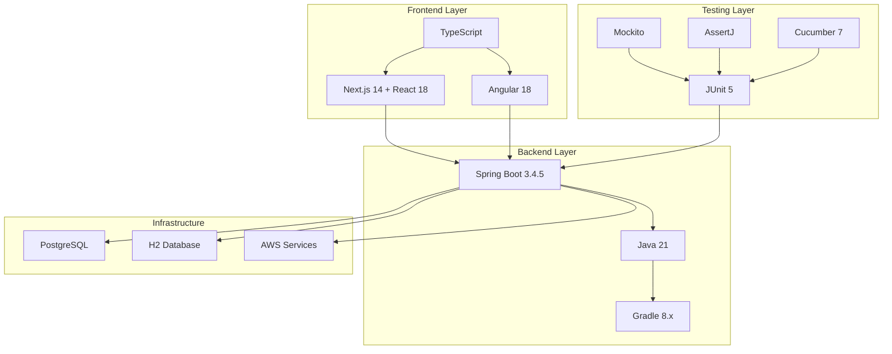

# 技術棧整合指南

## 概述

本指南詳細說明專案中使用的完整技術棧，包括後端、前端、測試框架的整合配置和最佳實踐。確保所有技術組件能夠無縫協作，提供一致的開發體驗。

## 🏗️ 技術棧架構

### 整體架構圖



## 🔧 後端技術棧

### Spring Boot 3.4.5 + Java 21 + Gradle 8.x

#### 核心配置

```gradle
// build.gradle
plugins {
    id 'java'
    id 'org.springframework.boot' version '3.4.5'
    id 'io.spring.dependency-management' version '1.1.6'
    id 'org.graalvm.buildtools.native' version '0.10.3'
}

java {
    toolchain {
        languageVersion = JavaLanguageVersion.of(21)
    }
}

configurations {
    compileOnly {
        extendsFrom annotationProcessor
    }
}

repositories {
    mavenCentral()
}

dependencies {
    // Spring Boot Starters
    implementation 'org.springframework.boot:spring-boot-starter-web'
    implementation 'org.springframework.boot:spring-boot-starter-data-jpa'
    implementation 'org.springframework.boot:spring-boot-starter-security'
    implementation 'org.springframework.boot:spring-boot-starter-validation'
    implementation 'org.springframework.boot:spring-boot-starter-actuator'
    implementation 'org.springframework.boot:spring-boot-starter-cache'
    
    // Database
    runtimeOnly 'org.postgresql:postgresql'
    runtimeOnly 'com.h2database:h2'
    implementation 'org.flywaydb:flyway-core'
    
    // Documentation
    implementation 'org.springdoc:springdoc-openapi-starter-webmvc-ui:2.6.0'
    
    // Monitoring
    implementation 'io.micrometer:micrometer-registry-prometheus'
    implementation 'com.amazonaws:aws-xray-recorder-sdk-spring:2.15.1'
    
    // Testing
    testImplementation 'org.springframework.boot:spring-boot-starter-test'
    testImplementation 'org.springframework.security:spring-security-test'
    testImplementation 'org.testcontainers:junit-jupiter'
    testImplementation 'org.testcontainers:postgresql'
    
    // Development Tools
    developmentOnly 'org.springframework.boot:spring-boot-devtools'
    annotationProcessor 'org.springframework.boot:spring-boot-configuration-processor'
}

tasks.named('test') {
    useJUnitPlatform()
}
```

#### Java 21 特性應用

```java
// 使用 Records 作為 DTO
public record CustomerDto(
    String id,
    String name,
    String email,
    LocalDateTime createdAt
) {
    // 靜態工廠方法
    public static CustomerDto from(Customer customer) {
        return new CustomerDto(
            customer.getId(),
            customer.getName(),
            customer.getEmail(),
            customer.getCreatedAt()
        );
    }
}

// 使用 Pattern Matching for Switch
public class OrderStatusHandler {
    
    public String getStatusMessage(OrderStatus status) {
        return switch (status) {
            case PENDING -> "訂單處理中";
            case CONFIRMED -> "訂單已確認";
            case SHIPPED -> "訂單已發貨";
            case DELIVERED -> "訂單已送達";
            case CANCELLED -> "訂單已取消";
        };
    }
    
    public boolean canTransitionTo(OrderStatus from, OrderStatus to) {
        return switch (from) {
            case PENDING -> to == OrderStatus.CONFIRMED || to == OrderStatus.CANCELLED;
            case CONFIRMED -> to == OrderStatus.SHIPPED || to == OrderStatus.CANCELLED;
            case SHIPPED -> to == OrderStatus.DELIVERED;
            case DELIVERED, CANCELLED -> false;
        };
    }
}

// 使用 Text Blocks
public class SqlQueries {
    
    public static final String FIND_CUSTOMERS_WITH_ORDERS = """
        SELECT c.id, c.name, c.email, COUNT(o.id) as order_count
        FROM customers c
        LEFT JOIN orders o ON c.id = o.customer_id
        WHERE c.created_at >= ?
        GROUP BY c.id, c.name, c.email
        HAVING COUNT(o.id) > 0
        ORDER BY order_count DESC
        """;
}

// 使用 Virtual Threads (Project Loom)
@Configuration
@EnableAsync
public class AsyncConfiguration {
    
    @Bean(name = "virtualThreadExecutor")
    public TaskExecutor virtualThreadExecutor() {
        return new TaskExecutor() {
            @Override
            public void execute(Runnable task) {
                Thread.ofVirtual().start(task);
            }
        };
    }
}

@Service
public class AsyncOrderService {
    
    @Async("virtualThreadExecutor")
    public CompletableFuture<Void> processOrderAsync(String orderId) {
        // 使用 Virtual Threads 處理異步任務
        return CompletableFuture.runAsync(() -> {
            // 處理訂單邏輯
            processOrder(orderId);
        });
    }
}
```

#### Spring Boot 3.4.5 配置

```yaml
# application.yml
spring:
  application:
    name: genai-demo
  
  profiles:
    active: ${SPRING_PROFILES_ACTIVE:development}
  
  datasource:
    url: ${DATABASE_URL:jdbc:postgresql://localhost:5432/genaidemo}
    username: ${DATABASE_USERNAME:genaidemo}
    password: ${DATABASE_PASSWORD:password}
    driver-class-name: org.postgresql.Driver
    hikari:
      maximum-pool-size: 20
      minimum-idle: 5
      idle-timeout: 300000
      max-lifetime: 1200000
      connection-timeout: 20000
  
  jpa:
    hibernate:
      ddl-auto: validate
    show-sql: false
    properties:
      hibernate:
        dialect: org.hibernate.dialect.PostgreSQLDialect
        format_sql: true
        use_sql_comments: true
        jdbc:
          batch_size: 25
        order_inserts: true
        order_updates: true
  
  flyway:
    enabled: true
    locations: classpath:db/migration
    baseline-on-migrate: true
  
  cache:
    type: caffeine
    caffeine:
      spec: maximumSize=1000,expireAfterWrite=10m
  
  security:
    oauth2:
      resourceserver:
        jwt:
          issuer-uri: ${JWT_ISSUER_URI:http://localhost:8080/auth/realms/genaidemo}

# Management endpoints
management:
  endpoints:
    web:
      exposure:
        include: health,info,metrics,prometheus
  endpoint:
    health:
      show-details: when-authorized
  metrics:
    export:
      prometheus:
        enabled: true

# Logging
logging:
  level:
    solid.humank.genaidemo: INFO
    org.springframework.security: DEBUG
    org.hibernate.SQL: DEBUG
    org.hibernate.type.descriptor.sql.BasicBinder: TRACE
  pattern:
    console: "%d{yyyy-MM-dd HH:mm:ss} - %msg%n"
    file: "%d{yyyy-MM-dd HH:mm:ss} [%thread] %-5level %logger{36} - %msg%n"

# Custom application properties
app:
  cors:
    allowed-origins: ${CORS_ALLOWED_ORIGINS:http://localhost:3000,http://localhost:4200}
  jwt:
    secret: ${JWT_SECRET:mySecretKey}
    expiration: ${JWT_EXPIRATION:86400}
```

## 🎨 前端技術棧

### Next.js 14 + React 18 (CMC Management)

#### 專案結構

```
cmc-management/
├── app/                    # App Router (Next.js 14)
│   ├── (dashboard)/       # Route Groups
│   │   ├── customers/
│   │   ├── orders/
│   │   └── analytics/
│   ├── api/               # API Routes
│   ├── globals.css
│   ├── layout.tsx
│   └── page.tsx
├── components/            # Reusable Components
│   ├── ui/               # shadcn/ui components
│   ├── forms/
│   ├── charts/
│   └── layout/
├── lib/                  # Utilities
│   ├── utils.ts
│   ├── api.ts
│   └── auth.ts
├── hooks/                # Custom Hooks
├── types/                # TypeScript Types
├── public/               # Static Assets
├── next.config.js
├── package.json
├── tailwind.config.js
└── tsconfig.json
```

#### 核心配置

```json
// package.json
{
  "name": "cmc-management",
  "version": "1.0.0",
  "private": true,
  "scripts": {
    "dev": "next dev",
    "build": "next build",
    "start": "next start",
    "lint": "next lint",
    "type-check": "tsc --noEmit"
  },
  "dependencies": {
    "next": "14.2.15",
    "react": "^18.3.1",
    "react-dom": "^18.3.1",
    "@radix-ui/react-dialog": "^1.1.2",
    "@radix-ui/react-dropdown-menu": "^2.1.2",
    "@radix-ui/react-select": "^2.1.2",
    "class-variance-authority": "^0.7.1",
    "clsx": "^2.1.1",
    "lucide-react": "^0.451.0",
    "tailwind-merge": "^2.5.4",
    "tailwindcss-animate": "^1.0.7",
    "@tanstack/react-query": "^5.59.16",
    "@tanstack/react-table": "^8.20.5",
    "react-hook-form": "^7.53.1",
    "@hookform/resolvers": "^3.9.1",
    "zod": "^3.23.8",
    "axios": "^1.7.7"
  },
  "devDependencies": {
    "typescript": "^5.6.3",
    "@types/node": "^22.7.5",
    "@types/react": "^18.3.11",
    "@types/react-dom": "^18.3.1",
    "eslint": "^8.57.1",
    "eslint-config-next": "14.2.15",
    "tailwindcss": "^3.4.13",
    "autoprefixer": "^10.4.20",
    "postcss": "^8.4.47"
  }
}
```

```typescript
// next.config.js
/** @type {import('next').NextConfig} */
const nextConfig = {
  experimental: {
    appDir: true,
  },
  env: {
    NEXT_PUBLIC_API_URL: process.env.NEXT_PUBLIC_API_URL || 'http://localhost:8080',
  },
  async rewrites() {
    return [
      {
        source: '/api/:path*',
        destination: `${process.env.NEXT_PUBLIC_API_URL}/api/:path*`,
      },
    ];
  },
};

module.exports = nextConfig;
```

#### React 18 特性應用

```typescript
// 使用 Concurrent Features
import { Suspense, lazy, startTransition } from 'react';
import { ErrorBoundary } from 'react-error-boundary';

// Lazy Loading Components
const CustomerList = lazy(() => import('./components/CustomerList'));
const OrderAnalytics = lazy(() => import('./components/OrderAnalytics'));

// 使用 Suspense 和 Error Boundaries
export default function Dashboard() {
  return (
    <ErrorBoundary fallback={<ErrorFallback />}>
      <Suspense fallback={<LoadingSpinner />}>
        <div className="grid grid-cols-1 md:grid-cols-2 gap-6">
          <CustomerList />
          <OrderAnalytics />
        </div>
      </Suspense>
    </ErrorBoundary>
  );
}

// 使用 startTransition 優化用戶體驗
function SearchComponent() {
  const [query, setQuery] = useState('');
  const [results, setResults] = useState([]);
  
  const handleSearch = (newQuery: string) => {
    setQuery(newQuery);
    
    // 使用 startTransition 標記非緊急更新
    startTransition(() => {
      // 搜索邏輯
      searchCustomers(newQuery).then(setResults);
    });
  };
  
  return (
    <div>
      <input
        value={query}
        onChange={(e) => handleSearch(e.target.value)}
        placeholder="搜索客戶..."
      />
      <CustomerResults results={results} />
    </div>
  );
}
```

### Angular 18 (Consumer App)

#### 專案結構

```
consumer-app/
├── src/
│   ├── app/
│   │   ├── core/              # Core Services
│   │   ├── shared/            # Shared Components
│   │   ├── features/          # Feature Modules
│   │   │   ├── products/
│   │   │   ├── orders/
│   │   │   └── profile/
│   │   ├── app.component.ts
│   │   ├── app.config.ts      # Angular 18 Standalone Config
│   │   └── app.routes.ts
│   ├── assets/
│   ├── environments/
│   └── main.ts
├── angular.json
├── package.json
└── tsconfig.json
```

#### Angular 18 配置

```json
// package.json
{
  "name": "consumer-app",
  "version": "1.0.0",
  "scripts": {
    "ng": "ng",
    "start": "ng serve",
    "build": "ng build",
    "test": "ng test",
    "lint": "ng lint"
  },
  "dependencies": {
    "@angular/animations": "^18.2.8",
    "@angular/common": "^18.2.8",
    "@angular/compiler": "^18.2.8",
    "@angular/core": "^18.2.8",
    "@angular/forms": "^18.2.8",
    "@angular/platform-browser": "^18.2.8",
    "@angular/platform-browser-dynamic": "^18.2.8",
    "@angular/router": "^18.2.8",
    "@angular/material": "^18.2.8",
    "@angular/cdk": "^18.2.8",
    "rxjs": "~7.8.1",
    "tslib": "^2.7.0",
    "zone.js": "~0.15.0"
  },
  "devDependencies": {
    "@angular-devkit/build-angular": "^18.2.8",
    "@angular/cli": "^18.2.8",
    "@angular/compiler-cli": "^18.2.8",
    "@types/jasmine": "~5.1.4",
    "jasmine-core": "~5.3.0",
    "karma": "~6.4.4",
    "karma-chrome-headless": "~3.1.0",
    "karma-coverage": "~2.2.1",
    "karma-jasmine": "~5.1.0",
    "karma-jasmine-html-reporter": "~2.1.0",
    "typescript": "~5.6.2"
  }
}
```

```typescript
// app.config.ts (Angular 18 Standalone Configuration)
import { ApplicationConfig, importProvidersFrom } from '@angular/core';
import { provideRouter } from '@angular/router';
import { provideHttpClient, withInterceptors } from '@angular/common/http';
import { provideAnimations } from '@angular/platform-browser/animations';
import { MatSnackBarModule } from '@angular/material/snack-bar';

import { routes } from './app.routes';
import { authInterceptor } from './core/interceptors/auth.interceptor';
import { errorInterceptor } from './core/interceptors/error.interceptor';

export const appConfig: ApplicationConfig = {
  providers: [
    provideRouter(routes),
    provideHttpClient(
      withInterceptors([authInterceptor, errorInterceptor])
    ),
    provideAnimations(),
    importProvidersFrom(MatSnackBarModule)
  ]
};

// main.ts
import { bootstrapApplication } from '@angular/platform-browser';
import { AppComponent } from './app/app.component';
import { appConfig } from './app/app.config';

bootstrapApplication(AppComponent, appConfig)
  .catch(err => console.error(err));
```

#### Angular 18 特性應用

```typescript
// 使用 Standalone Components
@Component({
  selector: 'app-product-list',
  standalone: true,
  imports: [CommonModule, MatCardModule, MatButtonModule],
  template: `
    <div class="product-grid">
      @for (product of products(); track product.id) {
        <mat-card class="product-card">
          <mat-card-header>
            <mat-card-title>{{ product.name }}</mat-card-title>
          </mat-card-header>
          <mat-card-content>
            <p>{{ product.description }}</p>
            <p class="price">{{ product.price | currency }}</p>
          </mat-card-content>
          <mat-card-actions>
            <button mat-button (click)="addToCart(product)">
              加入購物車
            </button>
          </mat-card-actions>
        </mat-card>
      }
    </div>
  `
})
export class ProductListComponent {
  private productService = inject(ProductService);
  private cartService = inject(CartService);
  
  // 使用 Signals
  products = signal<Product[]>([]);
  
  constructor() {
    // 使用 effect 響應式更新
    effect(() => {
      this.loadProducts();
    });
  }
  
  private async loadProducts() {
    try {
      const products = await this.productService.getProducts();
      this.products.set(products);
    } catch (error) {
      console.error('Failed to load products:', error);
    }
  }
  
  addToCart(product: Product) {
    this.cartService.addItem(product);
  }
}

// 使用新的 Control Flow (@if, @for, @switch)
@Component({
  selector: 'app-order-status',
  standalone: true,
  imports: [CommonModule],
  template: `
    @if (loading()) {
      <div class="loading">載入中...</div>
    } @else if (error()) {
      <div class="error">{{ error() }}</div>
    } @else {
      @switch (order().status) {
        @case ('PENDING') {
          <div class="status pending">訂單處理中</div>
        }
        @case ('CONFIRMED') {
          <div class="status confirmed">訂單已確認</div>
        }
        @case ('SHIPPED') {
          <div class="status shipped">訂單已發貨</div>
        }
        @default {
          <div class="status unknown">未知狀態</div>
        }
      }
    }
  `
})
export class OrderStatusComponent {
  loading = signal(false);
  error = signal<string | null>(null);
  order = signal<Order | null>(null);
}
```

## 🧪 測試框架整合

### JUnit 5 + Mockito + AssertJ + Cucumber 7

#### 測試依賴配置

```gradle
dependencies {
    // JUnit 5
    testImplementation 'org.junit.jupiter:junit-jupiter:5.10.1'
    testImplementation 'org.junit.jupiter:junit-jupiter-params:5.10.1'
    
    // Mockito
    testImplementation 'org.mockito:mockito-core:5.8.0'
    testImplementation 'org.mockito:mockito-junit-jupiter:5.8.0'
    
    // AssertJ
    testImplementation 'org.assertj:assertj-core:3.24.2'
    
    // Cucumber
    testImplementation 'io.cucumber:cucumber-java:7.18.1'
    testImplementation 'io.cucumber:cucumber-junit-platform-engine:7.18.1'
    testImplementation 'io.cucumber:cucumber-spring:7.18.1'
    
    // Spring Boot Test
    testImplementation 'org.springframework.boot:spring-boot-starter-test'
    testImplementation 'org.springframework.security:spring-security-test'
    
    // Testcontainers
    testImplementation 'org.testcontainers:junit-jupiter:1.19.3'
    testImplementation 'org.testcontainers:postgresql:1.19.3'
}

test {
    useJUnitPlatform()
    systemProperty 'cucumber.junit-platform.naming-strategy', 'long'
}
```

#### 整合測試範例

```java
// JUnit 5 + Mockito + AssertJ 整合
@ExtendWith(MockitoExtension.class)
class CustomerServiceTest {
    
    @Mock
    private CustomerRepository customerRepository;
    
    @Mock
    private EmailService emailService;
    
    @InjectMocks
    private CustomerService customerService;
    
    @Test
    @DisplayName("應該成功創建客戶並發送歡迎郵件")
    void should_create_customer_and_send_welcome_email() {
        // Given - 使用 AssertJ 的流暢 API
        CreateCustomerCommand command = new CreateCustomerCommand(
            "John Doe",
            "john@example.com",
            "password123"
        );
        
        Customer expectedCustomer = Customer.builder()
            .id("CUST-001")
            .name("John Doe")
            .email("john@example.com")
            .build();
        
        when(customerRepository.save(any(Customer.class)))
            .thenReturn(expectedCustomer);
        
        // When
        Customer result = customerService.createCustomer(command);
        
        // Then - 使用 AssertJ 進行斷言
        assertThat(result)
            .isNotNull()
            .satisfies(customer -> {
                assertThat(customer.getId()).isEqualTo("CUST-001");
                assertThat(customer.getName()).isEqualTo("John Doe");
                assertThat(customer.getEmail()).isEqualTo("john@example.com");
            });
        
        // 驗證 Mock 互動
        verify(customerRepository).save(argThat(customer -> 
            customer.getName().equals("John Doe") &&
            customer.getEmail().equals("john@example.com")
        ));
        
        verify(emailService).sendWelcomeEmail(
            eq("john@example.com"),
            eq("John Doe")
        );
    }
    
    @ParameterizedTest
    @ValueSource(strings = {"", " ", "invalid-email"})
    @DisplayName("應該拒絕無效的電子郵件地址")
    void should_reject_invalid_email_addresses(String invalidEmail) {
        // Given
        CreateCustomerCommand command = new CreateCustomerCommand(
            "John Doe",
            invalidEmail,
            "password123"
        );
        
        // When & Then
        assertThatThrownBy(() -> customerService.createCustomer(command))
            .isInstanceOf(InvalidEmailException.class)
            .hasMessageContaining("Invalid email format");
    }
}

// Cucumber 7 整合
@CucumberContextConfiguration
@SpringBootTest(webEnvironment = SpringBootTest.WebEnvironment.RANDOM_PORT)
@ActiveProfiles("test")
public class CucumberSpringConfiguration {
    
    @Autowired
    private TestRestTemplate restTemplate;
    
    @LocalServerPort
    private int port;
    
    @BeforeAll
    static void setUp() {
        // 全局測試設置
    }
}

// Cucumber Step Definitions
@Component
public class CustomerStepDefinitions {
    
    @Autowired
    private TestRestTemplate restTemplate;
    
    @Autowired
    private CustomerRepository customerRepository;
    
    private ResponseEntity<CustomerResponse> lastResponse;
    private CreateCustomerRequest customerRequest;
    
    @Given("一個有效的客戶資料")
    public void a_valid_customer_data() {
        customerRequest = new CreateCustomerRequest(
            "John Doe",
            "john@example.com",
            "password123"
        );
    }
    
    @When("提交客戶創建請求")
    public void submit_customer_creation_request() {
        lastResponse = restTemplate.postForEntity(
            "/api/v1/customers",
            customerRequest,
            CustomerResponse.class
        );
    }
    
    @Then("應該成功創建客戶")
    public void should_successfully_create_customer() {
        assertThat(lastResponse.getStatusCode()).isEqualTo(HttpStatus.CREATED);
        assertThat(lastResponse.getBody())
            .isNotNull()
            .satisfies(customer -> {
                assertThat(customer.getName()).isEqualTo("John Doe");
                assertThat(customer.getEmail()).isEqualTo("john@example.com");
            });
    }
    
    @And("客戶應該存在於資料庫中")
    public void customer_should_exist_in_database() {
        String customerId = lastResponse.getBody().getId();
        Optional<Customer> customer = customerRepository.findById(customerId);
        
        assertThat(customer)
            .isPresent()
            .get()
            .satisfies(c -> {
                assertThat(c.getName()).isEqualTo("John Doe");
                assertThat(c.getEmail()).isEqualTo("john@example.com");
            });
    }
}
```

#### Cucumber Feature 文件

```gherkin
# src/test/resources/features/customer-management.feature
Feature: 客戶管理
  作為系統管理員
  我想要管理客戶資料
  以便提供更好的服務

  Background:
    Given 系統已經啟動
    And 資料庫已經初始化

  Scenario: 成功創建新客戶
    Given 一個有效的客戶資料
    When 提交客戶創建請求
    Then 應該成功創建客戶
    And 客戶應該存在於資料庫中
    And 應該發送歡迎郵件

  Scenario Outline: 驗證客戶資料格式
    Given 客戶姓名為 "<name>"
    And 客戶電子郵件為 "<email>"
    When 提交客戶創建請求
    Then 應該返回 "<status>" 狀態
    And 錯誤訊息應該包含 "<error_message>"

    Examples:
      | name     | email           | status | error_message    |
      |          | john@email.com  | 400    | Name is required |
      | John Doe |                 | 400    | Email is required|
      | John Doe | invalid-email   | 400    | Invalid email    |

  Scenario: 查詢客戶列表
    Given 系統中存在以下客戶:
      | name     | email           | status |
      | John Doe | john@email.com  | ACTIVE |
      | Jane Doe | jane@email.com  | ACTIVE |
    When 查詢客戶列表
    Then 應該返回 2 個客戶
    And 客戶列表應該包含 "John Doe"
    And 客戶列表應該包含 "Jane Doe"
```

## 🔗 技術棧整合最佳實踐

### 1. 開發環境統一

```bash
# 使用 Docker Compose 統一開發環境
version: '3.8'
services:
  postgres:
    image: postgres:15
    environment:
      POSTGRES_DB: genaidemo
      POSTGRES_USER: genaidemo
      POSTGRES_PASSWORD: password
    ports:
      - "5432:5432"
    volumes:
      - postgres_data:/var/lib/postgresql/data

  redis:
    image: redis:7-alpine
    ports:
      - "6379:6379"

  backend:
    build: .
    ports:
      - "8080:8080"
    environment:
      SPRING_PROFILES_ACTIVE: development
      DATABASE_URL: jdbc:postgresql://postgres:5432/genaidemo
    depends_on:
      - postgres
      - redis

  frontend-cmc:
    build: ./cmc-management
    ports:
      - "3000:3000"
    environment:
      NEXT_PUBLIC_API_URL: http://backend:8080

  frontend-consumer:
    build: ./consumer-app
    ports:
      - "4200:4200"
    environment:
      API_URL: http://backend:8080

volumes:
  postgres_data:
```

### 2. CI/CD 整合

```yaml
# .github/workflows/ci.yml
name: CI/CD Pipeline

on:
  push:
    branches: [ main, develop ]
  pull_request:
    branches: [ main ]

jobs:
  backend-test:
    runs-on: ubuntu-latest
    steps:
      - uses: actions/checkout@v4
      
      - name: Set up JDK 21
        uses: actions/setup-java@v4
        with:
          java-version: '21'
          distribution: 'temurin'
      
      - name: Cache Gradle packages
        uses: actions/cache@v4
        with:
          path: |
            ~/.gradle/caches
            ~/.gradle/wrapper
          key: ${{ runner.os }}-gradle-${{ hashFiles('**/*.gradle*', '**/gradle-wrapper.properties') }}
      
      - name: Run backend tests
        run: ./gradlew test integrationTest
      
      - name: Generate test report
        run: ./gradlew jacocoTestReport
      
      - name: Upload coverage to Codecov
        uses: codecov/codecov-action@v4

  frontend-cmc-test:
    runs-on: ubuntu-latest
    steps:
      - uses: actions/checkout@v4
      
      - name: Set up Node.js
        uses: actions/setup-node@v4
        with:
          node-version: '20'
          cache: 'npm'
          cache-dependency-path: cmc-management/package-lock.json
      
      - name: Install dependencies
        run: npm ci
        working-directory: cmc-management
      
      - name: Run tests
        run: npm run test:ci
        working-directory: cmc-management
      
      - name: Build application
        run: npm run build
        working-directory: cmc-management

  frontend-consumer-test:
    runs-on: ubuntu-latest
    steps:
      - uses: actions/checkout@v4
      
      - name: Set up Node.js
        uses: actions/setup-node@v4
        with:
          node-version: '20'
          cache: 'npm'
          cache-dependency-path: consumer-app/package-lock.json
      
      - name: Install dependencies
        run: npm ci
        working-directory: consumer-app
      
      - name: Run tests
        run: npm run test:ci
        working-directory: consumer-app
      
      - name: Build application
        run: npm run build
        working-directory: consumer-app
```

### 3. 代碼品質整合

```gradle
// 代碼品質插件
plugins {
    id 'jacoco'
    id 'org.sonarqube' version '4.4.1.3373'
    id 'com.github.spotbugs' version '6.0.7'
    id 'checkstyle'
}

// JaCoCo 配置
jacoco {
    toolVersion = "0.8.11"
}

jacocoTestReport {
    dependsOn test
    reports {
        xml.required = true
        html.required = true
    }
}

// SonarQube 配置
sonar {
    properties {
        property "sonar.projectKey", "genai-demo"
        property "sonar.organization", "your-org"
        property "sonar.host.url", "https://sonarcloud.io"
        property "sonar.coverage.jacoco.xmlReportPaths", "build/reports/jacoco/test/jacocoTestReport.xml"
    }
}

// Checkstyle 配置
checkstyle {
    toolVersion = '10.12.7'
    configFile = file("config/checkstyle/checkstyle.xml")
}

// SpotBugs 配置
spotbugs {
    ignoreFailures = false
    showStackTraces = true
    showProgress = true
}
```

## 🔗 相關資源

### 內部文檔
- [Spring Boot 配置指南](spring-boot-configuration.md)
- [前端開發指南](frontend-development.md)
- [測試策略文檔](testing-strategy.md)

### 外部資源
- [Spring Boot 3.4.5 Documentation](https://docs.spring.io/spring-boot/docs/3.4.5/reference/html/)
- [Next.js 14 Documentation](https://nextjs.org/docs)
- [Angular 18 Documentation](https://angular.io/docs)
- [JUnit 5 User Guide](https://junit.org/junit5/docs/current/user-guide/)

---

**最後更新**: 2025年1月21日  
**維護者**: Development Team  
**版本**: 1.0

> 💡 **提示**: 技術棧整合需要考慮版本相容性、性能優化和開發體驗。定期更新依賴版本，並確保所有組件能夠無縫協作。