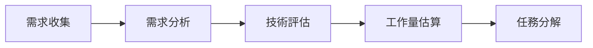
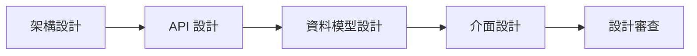
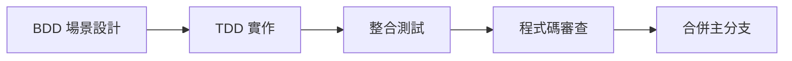
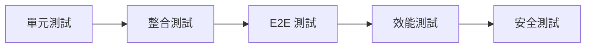
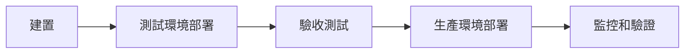

# 開發工作流程總覽

## 概述

本目錄包含專案的開發工作流程和協作指南。這些流程確保團隊能夠高效協作，保持程式碼品質，並順利交付功能。

## 📋 工作流程文檔

### 核心流程
- [開發流程標準](development-workflow.md) - 完整的功能開發流程
- [發布流程管理](release-process.md) - 版本發布和部署流程
- [熱修復流程](hotfix-process.md) - 緊急修復處理流程

### 程式碼管理
- [Git 工作流程](git-workflow.md) - 分支策略和提交規範
- [程式碼審查流程](code-review-process.md) - PR 審查標準和流程
- [重構策略指南](refactoring-strategy.md) - 安全重構的方法和原則

### 團隊協作
- [團隊協作指南](collaboration-guidelines.md) - 溝通和協作最佳實踐
- [會議和決策流程](meeting-decision-process.md) - 高效會議和決策機制
- [知識分享流程](knowledge-sharing.md) - 技術分享和學習機制

## 🔄 標準開發流程

### 1. 需求分析階段


### 2. 設計階段


### 3. 開發階段


### 4. 測試階段


### 5. 部署階段


## 🎯 品質保證流程

### 程式碼品質檢查
- [ ] 編碼標準合規性檢查
- [ ] 單元測試覆蓋率 > 80%
- [ ] 整合測試通過
- [ ] 靜態程式碼分析通過
- [ ] 安全掃描通過

### 審查流程
- [ ] 技術設計審查
- [ ] 程式碼審查 (至少 2 人)
- [ ] 測試審查
- [ ] 文檔審查
- [ ] 安全審查

### 部署前檢查
- [ ] 所有測試通過
- [ ] 效能基準測試通過
- [ ] 安全掃描通過
- [ ] 文檔更新完成
- [ ] 回滾計劃準備完成

## 🚀 敏捷開發實踐

### Sprint 規劃
- **Sprint 長度**: 2 週
- **規劃會議**: Sprint 開始前一天
- **每日站會**: 每天上午 9:30
- **Sprint 回顧**: Sprint 結束當天

### 用戶故事管理
```gherkin
Feature: 用戶故事模板
  As a [角色]
  I want [功能]
  So that [價值]
  
  Scenario: 驗收標準
    Given [前置條件]
    When [觸發動作]
    Then [預期結果]
```

### 任務估算
- **Story Points**: 使用費波納契數列 (1, 2, 3, 5, 8, 13)
- **Planning Poker**: 團隊共同估算
- **歷史數據**: 參考過往 Sprint 的完成情況

## 🔧 工具和自動化

### 開發工具
- **版本控制**: Git + GitHub
- **專案管理**: Jira / GitHub Projects
- **CI/CD**: GitHub Actions
- **程式碼品質**: SonarQube

### 自動化流程
- **自動建置**: 每次提交觸發
- **自動測試**: 單元測試 + 整合測試
- **自動部署**: 測試環境自動部署
- **自動監控**: 效能和錯誤監控

### 通知機制
- **Slack 整合**: 建置狀態通知
- **Email 通知**: 重要事件通知
- **Dashboard**: 即時狀態監控

## 📊 指標和監控

### 開發指標
- **程式碼提交頻率**: 每日提交次數
- **PR 合併時間**: 從創建到合併的時間
- **程式碼審查時間**: 審查回應時間
- **缺陷修復時間**: 從發現到修復的時間

### 品質指標
- **測試覆蓋率**: 單元測試和整合測試覆蓋率
- **程式碼品質分數**: SonarQube 評分
- **技術債務**: 累積的技術債務量
- **安全漏洞**: 發現和修復的安全問題

### 交付指標
- **Sprint 完成率**: 計劃 vs 實際完成的故事點
- **發布頻率**: 生產環境發布頻率
- **部署成功率**: 部署成功 vs 失敗比例
- **回滾頻率**: 需要回滾的部署比例

## 🔗 相關資源

### 內部文檔
- [開發視點總覽](../README.md)
- [編碼標準](../coding-standards/README.md)
- [測試策略](../testing/README.md)
- [品質保證](../quality-assurance/README.md)

### 外部資源
- [Git Flow](https://nvie.com/posts/a-successful-git-branching-model/)
- [Agile Manifesto](https://agilemanifesto.org/)
- [Scrum Guide](https://scrumguides.org/)
- [DevOps Practices](https://aws.amazon.com/devops/what-is-devops/)

---

**最後更新**: 2025年1月21日  
**維護者**: Development Team  
**版本**: 1.0

> 💡 **提示**: 好的工作流程是團隊成功的基石。這些流程會隨著團隊的成長和學習不斷演進和改善。