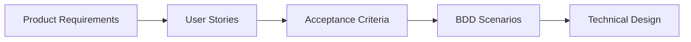
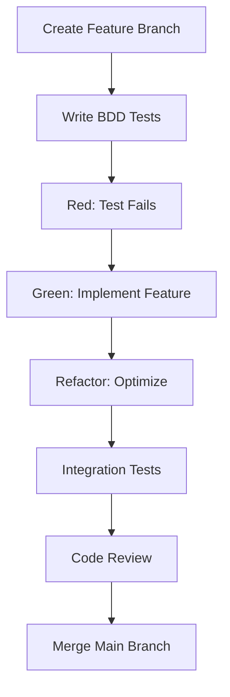
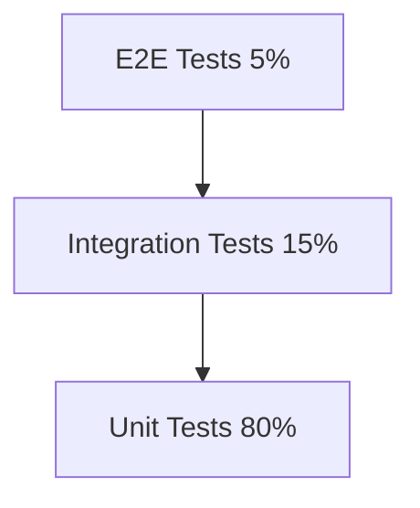
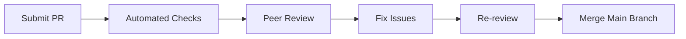
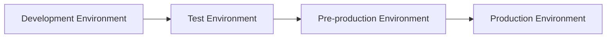
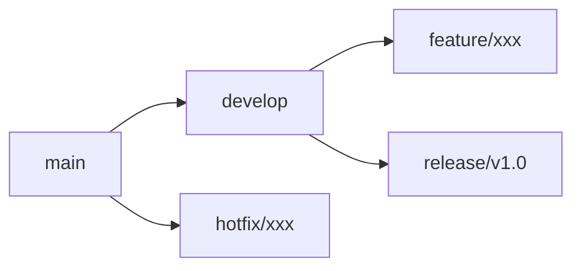
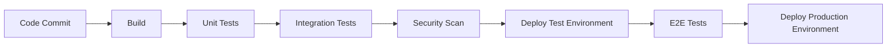
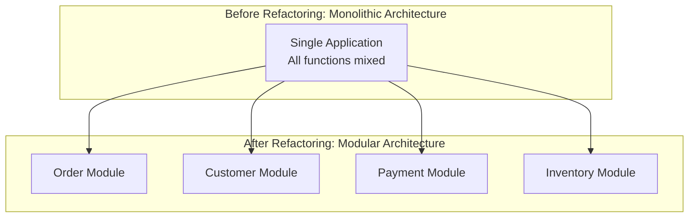

# Workflow and Collaboration Guidelines

## Overview

This document defines the complete development workflow and team collaboration guidelines, covering the entire software development lifecycle from requirements analysis to product release. We adopt agile development methodology, combining AI-DLC (AI-Driven Development Lifecycle) and modern DevOps practices to ensure efficient, high-quality software delivery.

## Core Development Principles

### Development Philosophy
- **Test-Driven Development (TDD)**: Write tests first, then implement functionality
- **Behavior-Driven Development (BDD)**: Use business language to describe system behavior
- **Continuous Integration/Continuous Deployment (CI/CD)**: Automated build, test, and deployment
- **Code Review**: Ensure code quality and knowledge sharing
- **Incremental Delivery**: Small steps, frequent value delivery

### Quality Standards
- **Code Coverage**: Unit tests > 80%, Integration tests > 15%
- **Performance Requirements**: API response time < 2s, Database queries < 100ms
- **Security Standards**: No high-risk vulnerabilities, all input validation, output encoding
- **Maintainability**: Cyclomatic complexity < 10, Method length < 50 lines

## Standard Development Workflow

### Phase 1: Requirements Analysis and Design

#### Requirements Gathering Process


**Detailed Steps**:

1. **Product Requirements Collection**
   - Confirm requirements with product managers and stakeholders
   - Analyze business value and priorities
   - Identify technical risks and dependencies

2. **User Story Writing**
   ```gherkin
   # User Story Template
   As a [role]
   I want [functionality]
   So that [value]
   
   # Example
   As a customer
   I want to register for an account
   So that I can access personalized services
   ```

3. **Acceptance Criteria Definition**
   - Clear Done Definition
   - Testable success criteria
   - Performance and security requirements

4. **BDD Scenario Design**
   ```gherkin
   Feature: Customer Registration
     Scenario: Successful registration
       Given I am a new customer
       When I submit valid registration information
       Then I should receive a confirmation email
       And my account should be created
   ```

5. **Technical Design Assessment**
   - Architecture impact analysis
   - Technical solution design
   - Database design changes
   - API interface design

#### Design Review Checklist
- [ ] Business requirements are complete and clear
- [ ] Technical solution is feasible and optimized
- [ ] Security and performance considerations are included
- [ ] Testing strategy is defined
- [ ] Deployment plan is established

### Phase 2: Development Implementation

#### TDD Development Cycle


**Detailed Practice Steps**:

1. **Create Feature Branch**
   ```bash
   git checkout main
   git pull origin main
   git checkout -b feature/customer-registration
   ```

2. **Write BDD Tests**
   ```gherkin
   # src/test/resources/features/customer-registration.feature
   Feature: Customer Registration
     Scenario: Valid customer registration
       Given I have valid customer information
       When I submit the registration form
       Then I should see a success message
       And I should receive a confirmation email
   ```

3. **Red-Green-Refactor Cycle**
   ```bash
   # Red: Confirm test fails
   ./gradlew cucumber
   
   # Green: Implement functionality
   # Write minimal viable code
   
   # Refactor: Optimize
   ./gradlew test checkstyleMain
   ```

4. **Code Quality Checks**
   ```bash
   # Run all quality checks
   ./gradlew clean build
   ./gradlew jacocoTestReport
   ./gradlew spotbugsMain
   ```

#### Development Best Practices

**Code Organization**:
```java
// ✅ Correct: Clear layered architecture
@RestController
@RequestMapping("/api/v1/customers")
public class CustomerController {
    
    private final CustomerApplicationService customerService;
    
    @PostMapping
    public ResponseEntity<CustomerResponse> createCustomer(
            @Valid @RequestBody CreateCustomerRequest request) {
        
        CreateCustomerCommand command = CreateCustomerCommand.from(request);
        Customer customer = customerService.createCustomer(command);
        CustomerResponse response = CustomerResponse.from(customer);
        
        return ResponseEntity.status(HttpStatus.CREATED).body(response);
    }
}

@Service
@Transactional
public class CustomerApplicationService {
    
    private final CustomerRepository customerRepository;
    private final DomainEventPublisher eventPublisher;
    
    public Customer createCustomer(CreateCustomerCommand command) {
        // 1. Validate business rules
        validateCustomerCreation(command);
        
        // 2. Create aggregate root
        Customer customer = Customer.create(
            command.getName(),
            command.getEmail(),
            command.getPassword()
        );
        
        // 3. Persist
        Customer savedCustomer = customerRepository.save(customer);
        
        // 4. Publish domain events
        eventPublisher.publishEventsFromAggregate(savedCustomer);
        
        return savedCustomer;
    }
}
```

**Testing Strategy**:
```java
// Unit Tests
@ExtendWith(MockitoExtension.class)
class CustomerApplicationServiceTest {
    
    @Test
    void should_create_customer_when_valid_command_provided() {
        // Given
        CreateCustomerCommand command = new CreateCustomerCommand(
            "John Doe", "john@example.com", "password123"
        );
        
        // When
        Customer result = customerService.createCustomer(command);
        
        // Then
        assertThat(result.getName()).isEqualTo("John Doe");
        verify(customerRepository).save(any(Customer.class));
    }
}

// Integration Tests
@SpringBootTest
@Transactional
class CustomerIntegrationTest {
    
    @Test
    void should_create_customer_end_to_end() {
        // Given
        CreateCustomerRequest request = new CreateCustomerRequest(
            "John Doe", "john@example.com", "password123"
        );
        
        // When
        ResponseEntity<CustomerResponse> response = restTemplate.postForEntity(
            "/api/v1/customers", request, CustomerResponse.class
        );
        
        // Then
        assertThat(response.getStatusCode()).isEqualTo(HttpStatus.CREATED);
        assertThat(customerRepository.findByEmail("john@example.com")).isPresent();
    }
}
```

### Phase 3: Quality Assurance

#### Test Pyramid Practice


**Test Execution Strategy**:
```bash
# Daily development - Quick feedback
./gradlew unitTest                    # < 2 minutes

# Pre-commit - Complete verification
./gradlew preCommitTest              # < 5 minutes

# Pre-release - Comprehensive testing
./gradlew fullTest                   # < 30 minutes
```

**Quality Gates**:
- All tests must pass
- Code coverage > 80%
- No high-risk security vulnerabilities
- Performance tests pass
- Code review approved

#### Automated Quality Checks
```yaml
# .github/workflows/quality-check.yml
name: Quality Check
on: [pull_request]

jobs:
  test:
    runs-on: ubuntu-latest
    steps:
      - uses: actions/checkout@v3
      
      - name: Setup Java
        uses: actions/setup-java@v3
        with:
          java-version: '21'
          
      - name: Run Tests
        run: ./gradlew test jacocoTestReport
        
      - name: Security Scan
        run: ./gradlew dependencyCheckAnalyze
        
      - name: Code Quality
        run: ./gradlew sonarqube
```

### Phase 4: Code Review

#### Review Checklist

**Functional Review**:
- [ ] Code correctly implements requirements
- [ ] Edge cases are handled properly
- [ ] Error handling is appropriate
- [ ] Performance considerations are reasonable

**Code Quality Review**:
- [ ] Code readability is good
- [ ] Naming is clear and meaningful
- [ ] Structure organization is reasonable
- [ ] Follows coding standards

**Security Review**:
- [ ] Input validation is complete
- [ ] Output encoding is correct
- [ ] Authentication and authorization are appropriate
- [ ] Sensitive data is protected

**Testing Review**:
- [ ] Test coverage is sufficient
- [ ] Test cases are meaningful
- [ ] Test data is appropriate
- [ ] Tests are maintainable

#### Review Process


**Review Time Requirements**:
- Small PR (< 200 lines): Within 24 hours
- Medium PR (200-500 lines): Within 48 hours
- Large PR (> 500 lines): Within 72 hours

### Phase 5: Deployment and Release

#### Environment Management Strategy


**Environment Configuration**:
- **Development Environment**: Local development, H2 database, mock external services
- **Test Environment**: Automated testing, PostgreSQL, real external services
- **Pre-production Environment**: Production mirror, complete dataset, performance testing
- **Production Environment**: Official service, high availability, monitoring and alerting

#### Deployment Process
```bash
# 1. Build and package
./gradlew clean build
docker build -t genai-demo:latest .

# 2. Deploy to test environment
kubectl apply -f k8s/test/
kubectl rollout status deployment/genai-demo

# 3. Run smoke tests
./scripts/smoke-test.sh test

# 4. Deploy to production environment
kubectl apply -f k8s/prod/
kubectl rollout status deployment/genai-demo

# 5. Verify deployment
./scripts/health-check.sh prod
```

## Team Collaboration Standards

### Communication and Collaboration

#### Communication Channels
- **Real-time Communication**: Slack/Teams (urgent issues, quick discussions)
- **Asynchronous Communication**: GitHub Issues/PR (feature requirements, code reviews)
- **Formal Communication**: Meeting minutes, document updates (decision records, architecture changes)

#### Meeting Standards
- **Daily Standup**: 15 minutes, sync progress and blockers
- **Sprint Planning**: 2 hours, plan next Sprint work
- **Sprint Retrospective**: 1 hour, review improvement points
- **Technical Sharing**: 1 hour weekly, knowledge sharing

### Branch Management Strategy

#### Git Flow Practice


**Branch Naming Conventions**:
- `feature/feature-description`: New feature development
- `fix/issue-description`: Bug fixes
- `docs/documentation-description`: Documentation updates
- `refactor/refactoring-description`: Code refactoring
- `test/testing-description`: Test improvements

**Commit Message Conventions**:
```bash
# Format: type(scope): description
feat(customer): add customer registration validation
fix(order): correct order total calculation
docs(api): update customer API documentation
test(customer): add unit tests for customer service
refactor(order): extract order calculation logic
```

### Knowledge Management

#### Documentation Maintenance
- **Architecture Decision Records (ADR)**: Records of important technical decisions
- **API Documentation**: Auto-generated and maintained API specifications
- **Operations Manual**: Deployment, monitoring, troubleshooting guides
- **Development Guide**: Coding standards, best practices, tool usage

#### Knowledge Sharing Mechanisms
- **Code Reviews**: Transfer knowledge through review process
- **Technical Sharing Sessions**: Regular sharing of new technologies and experiences
- **Mentorship System**: Senior developers guide new members
- **Documentation Contribution**: Encourage team members to improve documentation

## Continuous Improvement

### Performance Monitoring

#### Key Performance Indicators (KPIs)
- **Development Efficiency**: Feature delivery speed, defect rate
- **Code Quality**: Test coverage, code complexity
- **System Performance**: Response time, throughput, error rate
- **Team Collaboration**: Code review time, knowledge sharing frequency

#### Monitoring Tools
```bash
# Code quality monitoring
./gradlew sonarqube

# Performance monitoring
./gradlew performanceTest

# Security scanning
./gradlew dependencyCheckAnalyze

# Test coverage
./gradlew jacocoTestReport
```

### Process Optimization

#### Regular Reviews
- **Weekly Review**: Review workflow issues from the week
- **Sprint Review**: Analyze Sprint execution effectiveness
- **Quarterly Review**: Evaluate overall process improvement results

#### Improvement Implementation
1. **Identify Issues**: Collect team feedback and data analysis
2. **Analyze Causes**: Deep dive into root causes of problems
3. **Develop Solutions**: Design specific improvement measures
4. **Pilot Implementation**: Small-scale trial of improvement solutions
5. **Full Rollout**: Adopt team-wide after validation

## Tools and Automation

### Development Toolchain

#### Essential Tools
- **IDE**: IntelliJ IDEA Ultimate, VS Code
- **Version Control**: Git, GitHub
- **Build Tools**: Gradle, Maven
- **Containerization**: Docker, Docker Compose
- **Cloud Tools**: AWS CLI, CDK

#### Automation Scripts
```bash
# Environment setup
./scripts/setup-dev-environment.sh

# Code quality checks
./scripts/quality-check.sh

# Automated testing
./scripts/run-all-tests.sh

# Deployment scripts
./scripts/deploy.sh [environment]
```

### CI/CD Pipeline

#### Pipeline Stages


#### Automation Configuration
```yaml
# .github/workflows/ci-cd.yml
name: CI/CD Pipeline
on:
  push:
    branches: [main, develop]
  pull_request:
    branches: [main]

jobs:
  build-and-test:
    runs-on: ubuntu-latest
    steps:
      - name: Checkout code
        uses: actions/checkout@v3
        
      - name: Setup Java
        uses: actions/setup-java@v3
        with:
          java-version: '21'
          
      - name: Build application
        run: ./gradlew clean build
        
      - name: Run tests
        run: ./gradlew test integrationTest
        
      - name: Security scan
        run: ./gradlew dependencyCheckAnalyze
        
      - name: Deploy to staging
        if: github.ref == 'refs/heads/develop'
        run: ./scripts/deploy.sh staging
        
      - name: Deploy to production
        if: github.ref == 'refs/heads/main'
        run: ./scripts/deploy.sh production
```

---

**Related Documentation**:
- [Coding Standards](../coding-standards/README.md)
- [Testing Strategy](../testing/README.md)
- [Deployment Guide](../../deployment/README.md)
- [Monitoring Operations](../../../observability/README.md)

**Next Step**: [Quality Assurance Process](../quality-assurance/README.md) →

We adopt a **Git Flow** variant, simplifying branch management:

```mermaid
gitgraph
    commit id: "Initial"
    branch develop
    checkout develop
    commit id: "Feature A"
    branch feature/user-auth
    checkout feature/user-auth
    commit id: "Auth logic"
    commit id: "Auth tests"
    checkout develop
    merge feature/user-auth
    commit id: "Integration"
    branch release/v1.0
    checkout release/v1.0
    commit id: "Release prep"
    checkout main
    merge release/v1.0
    tag: "v1.0.0"
    checkout develop
    merge main
```

#### Branch Strategy
- **main**: Production-ready stable versions
- **develop**: Development integration branch
- **feature/***: Feature development branches
- **release/***: Release preparation branches
- **hotfix/***: Emergency fix branches

#### Branch Naming Conventions
```bash
# Feature branches
feature/JIRA-123-user-authentication
feature/add-payment-gateway

# Release branches
release/v1.2.0
release/2024-Q1-sprint-3

# Hotfix branches
hotfix/critical-security-patch
hotfix/payment-gateway-fix
```

### Release Process

#### 1. Feature Release
```bash
# 1. Create release branch from develop
git checkout develop
git pull origin develop
git checkout -b release/v1.2.0

# 2. Release preparation
./gradlew clean build
./gradlew test
./gradlew integrationTest

# 3. Version tagging
git tag -a v1.2.0 -m "Release version 1.2.0"

# 4. Merge to main and develop
git checkout main
git merge release/v1.2.0
git push origin main --tags

git checkout develop
git merge release/v1.2.0
git push origin develop
```

#### 2. Hotfix Release
```bash
# 1. Create hotfix branch from main
git checkout main
git checkout -b hotfix/critical-bug-fix

# 2. Fix and test
# ... implement fix
./gradlew test

# 3. Merge back to main and develop
git checkout main
git merge hotfix/critical-bug-fix
git tag -a v1.1.1 -m "Hotfix version 1.1.1"
git push origin main --tags

git checkout develop
git merge hotfix/critical-bug-fix
git push origin develop
```

### Release Checklist

#### Pre-release Checks
- [ ] All feature tests pass
- [ ] Code review completed
- [ ] Performance tests pass
- [ ] Security scan shows no high-risk issues
- [ ] Documentation updated
- [ ] Database migration scripts prepared
- [ ] Rollback plan established

#### Post-release Verification
- [ ] Application starts normally
- [ ] Health check endpoints respond normally
- [ ] Key business processes verified
- [ ] Performance metrics monitored
- [ ] Error rate monitored
- [ ] User feedback collected

## 🔥 Emergency Fix Process

### Emergency Situation Classification

#### P0 - System Completely Unavailable
- **Response Time**: Within 15 minutes
- **Resolution Time**: Within 2 hours
- **Notification Scope**: All team members + management

#### P1 - Core Functions Affected
- **Response Time**: Within 1 hour
- **Resolution Time**: Within 4 hours
- **Notification Scope**: Development team + product manager

#### P2 - Partial Function Abnormal
- **Response Time**: Within 4 hours
- **Resolution Time**: Within 1 business day
- **Notification Scope**: Relevant developers

### Emergency Fix Decision Matrix

| Impact Scope | User Impact | Fix Complexity | Recommended Action |
|--------------|-------------|----------------|-------------------|
| Full System | High | Low | Immediate hotfix |
| Full System | High | High | Rollback + planned fix |
| Partial Function | Medium | Low | Hotfix |
| Partial Function | Medium | High | Feature degradation + planned fix |
| Single Function | Low | Any | Planned fix |

### Emergency Fix Execution Steps

#### 1. Problem Assessment (5-15 minutes)
```bash
# Quick diagnosis
kubectl get pods -n production
kubectl logs -f deployment/app-name -n production
curl -f https://api.example.com/health

# Check monitoring metrics
# - Error rate
# - Response time
# - System resource usage
```

#### 2. Decision Making (5-10 minutes)
- Assess impact scope and severity
- Choose fix strategy: hotfix vs rollback vs feature degradation
- Determine fix owner and support team

#### 3. Fix Implementation
```bash
# Option A: Quick rollback
git checkout main
git reset --hard v1.1.0  # Rollback to stable version
./deploy.sh production

# Option B: Hotfix
git checkout -b hotfix/urgent-fix
# Implement minimal fix
./gradlew test
./deploy.sh production

# Option C: Feature degradation
kubectl patch deployment app-name -p '{"spec":{"template":{"spec":{"containers":[{"name":"app","env":[{"name":"FEATURE_X_ENABLED","value":"false"}]}]}}}}'
```

#### 4. Verification and Monitoring
- Confirm fix is effective
- Monitor key metrics
- Collect user feedback
- Record incident timeline

#### 5. Post-incident Review
- Root cause analysis
- Preventive measures development
- Process improvement suggestions
- Documentation updates

## ♻️ Refactoring Strategy

### Refactoring Principles

#### Golden Rules for Safe Refactoring
1. **Small Steps**: Keep each refactoring to minimal changes
2. **Test Protection**: Ensure sufficient test coverage before refactoring
3. **Frequent Commits**: Commit each refactoring step
4. **Continuous Verification**: Run tests at each step to ensure functionality remains unchanged

### Refactoring Types and Strategies

#### 1. Code-level Refactoring
```java
// Before refactoring: Long method
public void processOrder(Order order) {
    // 50+ lines of code mixing multiple responsibilities
    validateOrder(order);
    calculateTotal(order);
    applyDiscounts(order);
    updateInventory(order);
    sendNotification(order);
    logOrderProcessing(order);
}

// After refactoring: Responsibility separation
public void processOrder(Order order) {
    validateOrder(order);
    Money total = calculateOrderTotal(order);
    order.setTotal(total);
    
    inventoryService.updateInventory(order);
    notificationService.sendOrderConfirmation(order);
    auditService.logOrderProcessing(order);
}
```

#### 2. Architecture-level Refactoring


### Refactoring Execution Process

#### 1. Refactoring Preparation Phase
```bash
# Ensure test coverage
./gradlew jacocoTestReport
# Target: Coverage > 80%

# Create refactoring branch
git checkout -b refactor/extract-payment-service

# Run baseline tests
./gradlew test
./gradlew integrationTest
```

#### 2. Refactoring Implementation Phase
```bash
# Each refactoring step
# 1. Small modification
# 2. Run tests
./gradlew test
# 3. Commit changes
git add .
git commit -m "refactor: extract payment validation logic"

# Repeat above steps until refactoring is complete
```

#### 3. Refactoring Verification Phase
```bash
# Complete test suite
./gradlew clean build
./gradlew test integrationTest

# Performance regression testing
./gradlew performanceTest

# Code quality checks
./gradlew checkstyleMain spotbugsMain
```

### Refactoring Checklist

#### Pre-refactoring Checks
- [ ] Identify refactoring goals and scope
- [ ] Ensure sufficient test coverage
- [ ] Create refactoring branch
- [ ] Notify team members of refactoring plan

#### During Refactoring Checks
- [ ] Maintain small-step refactoring
- [ ] Run tests at each step
- [ ] Commit changes frequently
- [ ] Record refactoring decisions

#### Post-refactoring Checks
- [ ] All tests pass
- [ ] No performance regression
- [ ] Code quality improved
- [ ] Documentation updated
- [ ] Team code review

## 🤝 Team Collaboration Guidelines

### Communication Principles

#### 1. Transparent Communication
- **Daily Standup**: Share progress, blockers, and plans
- **Weekly Review**: Review process improvement opportunities
- **Monthly Technical Sharing**: Knowledge sharing and best practices

#### 2. Asynchronous Collaboration
- **Documentation First**: Important decisions and designs must be documented
- **Code Comments**: Complex logic must have clear comments
- **Pull Requests**: Detailed description of changes and impact

#### 3. Constructive Feedback
- **Code Reviews**: Focus on code quality, not personal
- **Technical Discussions**: Based on facts and best practices
- **Learning Oriented**: View mistakes as learning opportunities

### Meeting Management

#### Daily Standup
- **Time**: Every day at 9:30 AM, 15 minutes
- **Format**: 
  - What did you complete yesterday?
  - What do you plan to do today?
  - What blockers are you facing?
- **Principles**: Concise, focused, action-oriented

#### Weekly Retrospective
- **Time**: Every Friday afternoon, 1 hour
- **Format**:
  - What went well (Keep)
  - What needs improvement (Improve)
  - New things to try (Try)
- **Output**: Specific improvement action items

#### Technical Design Review
- **Trigger**: Major features or architecture changes
- **Participants**: Architects, senior developers, related teams
- **Output**: Architecture Decision Records (ADR)

### Knowledge Sharing Mechanisms

#### 1. Technical Sharing Sessions
```markdown
## Technical Sharing Session Agenda Template

**Topic**: Introduction to Spring Boot 3.0 New Features
**Presenter**: John Doe
**Time**: 2024-01-15 14:00-15:00

### Agenda
1. Background and motivation (5 minutes)
2. Main new features introduction (30 minutes)
3. Practical application examples (15 minutes)
4. Q&A discussion (10 minutes)

### Preparation Materials
- Presentation slides
- Code examples
- Related documentation links
```

#### 2. Code Review Learning
- **Pair Reviews**: Senior developers paired with newcomers
- **Review Records**: Record common issues and best practices
- **Knowledge Base**: Build code review knowledge base

#### 3. Documentation Collaboration
- **Technical Wiki**: Jointly maintain technical knowledge base
- **Best Practices**: Record and share best practices
- **Troubleshooting**: Build common problem solution library

### Collaboration Tool Configuration

#### 1. Project Management Tools
- **Jira**: Requirements management and task tracking
- **Confluence**: Documentation collaboration and knowledge management
- **GitHub Projects**: Code-related task management

#### 2. Communication Tools
- **Slack**: Real-time communication and notifications
- **Microsoft Teams**: Video conferencing and file sharing
- **GitHub Discussions**: Technical discussions and Q&A

#### 3. Development Tools
- **GitHub**: Code version control and collaboration
- **SonarQube**: Code quality monitoring
- **Grafana**: System monitoring and alerting

## 📊 Development Metrics and Continuous Improvement

### Key Performance Indicators (KPIs)

#### 1. Development Efficiency Metrics
- **Development Cycle Time**: Average time from requirements to deployment
- **Code Commit Frequency**: Number of commits per day
- **Feature Delivery Speed**: Story points completed per Sprint

#### 2. Quality Metrics
- **Defect Rate**: Number of defects found in production
- **Test Coverage**: Percentage of code test coverage
- **Code Review Efficiency**: Review time and number of issues found

#### 3. Collaboration Metrics
- **Pull Request Response Time**: Time from submission to first response
- **Knowledge Sharing Frequency**: Technical sharing and documentation update frequency
- **Team Satisfaction**: Regular team satisfaction surveys

### Continuous Improvement Process

#### 1. Data Collection
```bash
# Automated metrics collection
./scripts/collect-metrics.sh

# Generate weekly reports
./scripts/generate-weekly-report.sh
```

#### 2. Regular Reviews
- **Weekly**: Review development metrics trends
- **Monthly**: Deep analysis and improvement planning
- **Quarterly**: Process optimization and tool upgrades

#### 3. Improvement Implementation
- **Experimental Improvements**: Small-scale trial of new processes
- **Gradual Rollout**: Gradual promotion after success
- **Effect Evaluation**: Regular evaluation of improvement effects

### Improvement Suggestion Collection

#### 1. Feedback Channels
- **Anonymous Suggestion Box**: Encourage honest feedback
- **Regular Surveys**: Structured opinion collection
- **Open Discussions**: Open discussions in team meetings

#### 2. Improvement Prioritization
```markdown
## Improvement Proposal Evaluation Criteria

### Impact Level (1-5 points)
- 5: Significantly improves team efficiency
- 4: Obviously improves work experience
- 3: Moderate improvement
- 2: Minor improvement
- 1: Minimal improvement

### Implementation Difficulty (1-5 points)
- 1: Very easy to implement
- 2: Easy to implement
- 3: Moderate difficulty
- 4: Difficult to implement
- 5: Very difficult

### Priority = Impact Level × 2 - Implementation Difficulty
```

## AI-DLC Development Workflow

### Overview

AI-DLC (AI-Driven Development Lifecycle) is a software development lifecycle methodology that combines artificial intelligence assistance, covering the complete process from requirements analysis to code implementation.

### Development Phases

#### Inception Phase

##### Intent to User Stories

**Role**: Product Manager Expert

**Task**: Convert system descriptions into clearly defined user stories as contracts for system development.

**Process**:
1. Plan work steps in `aidlc-docs/inception/user_stories_plan.md`
2. Create checkboxes for each step
3. Mark questions needing clarification `[Question]` and blank answers `[Answer]`
4. Request review and approval
5. Execute plan step by step and mark completion

**Example Tasks**: 
- Solution architect registers skills and availability
- Sales manager registers customer opportunities and problem statements
- System matches customer opportunities with solution architects based on skills and availability
- Sales manager selects solution architect from system recommendations

##### Stories to Units

**Role**: Experienced Software Architect

**Task**: Group user stories into work units that can be implemented in parallel, with each unit containing highly cohesive user stories.

**Process**:
1. Understand complete system user stories
2. Group stories into work units (equivalent to bounded contexts in DDD)
3. Create individual md files for each unit in `aidlc-docs/inception/units/` folder
4. Plan steps in `aidlc-docs/inception/units/units_plan.md`

**Principles**:
- Each unit can be built by a single team
- Units correspond to specific subdomains or business roles
- High cohesion, low coupling design

##### BDD Specifications

**Role**: Experienced BDD Practitioner

**Task**: Use Specification by Example method to create concrete examples illustrating behavior of each user story in different scenarios.

**Process**:
1. Create BDD specifications for each unit
2. Use Given-When-Then format
3. Focus on concrete examples, boundary conditions, and error scenarios
4. Store in `aidlc-docs/inception/bdd/` folder

**Focus**:
- Concrete behavior examples
- Boundary conditions and business rules
- Error handling scenarios

##### Shared Data Models

**Role**: Experienced Software Architect

**Task**: Create component models defining core entities and their attributes.

**Process**:
1. Reference `aidlc-docs/inception/dependencies_integration_summary.md`
2. Create component models for core entities
3. Define attributes and relationships
4. Store in `aidlc-docs/inception/units/shared_model.md`

#### Construction Phase

##### BDD to Domain Requirements

**Role**: Experienced Software Engineer

**Task**: Analyze BDD specifications to extract domain requirements and business rules, guiding domain model design.

**Process**:
1. Review all BDD specifications
2. Identify domain behaviors, business rules, constraints, and invariants
3. Document in `aidlc-docs/construction/domain_requirements.md`

##### Domain Modelling

**Role**: Experienced Software Engineer

**Task**: Design domain model to implement all user stories, including components, attributes, behaviors, and interactions.

**Process**:
1. Reference user stories and domain requirements
2. Design component models
3. Define attributes and behaviors
4. Describe component interactions
5. Store in `aidlc-docs/construction/` folder

**Principles**:
- Don't generate architectural components
- Don't generate code
- Strictly reference shared component definitions

##### Domain Model to Code

**Role**: Experienced Software Engineer

**Task**: Convert domain model to simple, intuitive code implementation.

**Process**:
1. Reference `aidlc-docs/construction/domain_model.md`
2. Generate Java implementation (Spring Boot framework)
3. Maintain directory structure conforming to hexagonal architecture
4. Use standard components and tools
5. Implement appropriate persistence mechanisms

**Requirements**:
- Simple, intuitive implementation
- Reuse standard components
- Follow DDD tactical patterns

##### BDD Test Implementation

**Role**: Experienced Test Automation Engineer

**Task**: Implement executable BDD tests to verify implemented domain code.

**Process**:
1. Convert BDD specifications to executable tests
2. Use Cucumber test framework
3. Ensure all Given-When-Then scenarios are covered
4. Create test files in `src/test/resources/features/`

##### Adding Architectural Components

**Role**: Experienced Software Architect

**Task**: Add architectural components to support network access and external integrations.

**Process**:
1. Reference service implementation
2. Design REST API interfaces
3. Implement network access layer
4. Integrate external services

### Development Tools and Technologies

#### Programming Languages and Frameworks
- **Backend**: Java 21 + Spring Boot 3.4.5
- **Frontend**: TypeScript + React + Next.js / Angular
- **Testing**: JUnit 5 + Cucumber + Mockito

#### Development Tools
- **Build Tools**: Gradle 8.x
- **Version Control**: Git
- **IDE**: IntelliJ IDEA / VS Code
- **Containerization**: Docker + Docker Compose

#### Quality Assurance
- **Code Formatting**: Spotless
- **Static Analysis**: SonarQube
- **Architecture Testing**: ArchUnit
- **Test Reporting**: Allure

### Best Practices

#### Planning Phase
1. **Clearly Define Problems**: Ensure all stakeholders understand requirements
2. **Detailed Planning**: Create detailed execution plans for each phase
3. **Risk Identification**: Identify potential issues and dependencies early

#### Implementation Phase
1. **Test-Driven Development**: Write tests first, then implement functionality
2. **Continuous Integration**: Frequent commits and code integration
3. **Code Reviews**: Ensure code quality and knowledge sharing

#### Quality Control
1. **Automated Testing**: Build comprehensive test suites
2. **Continuous Monitoring**: Monitor system performance and errors
3. **Documentation Maintenance**: Keep documentation synchronized with code

---

**Last Updated**: January 21, 2025  
**Maintainer**: Development Team  
**Version**: 2.0

> 💡 **Tip**: These workflows are actively maintained guidelines. Teams should continuously optimize these processes based on project needs and experience.