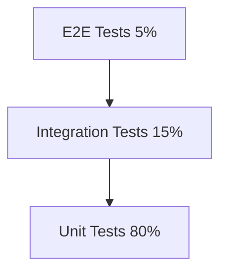
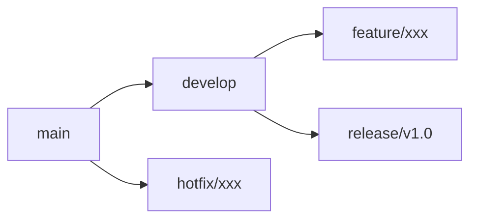

# 工作流程與協作指南

## 概述

本文檔定義了完整的開發工作流程和團隊協作指南，涵蓋從需求分析到產品發布的整個軟體開發生命週期。我們採用敏捷開發方法論，結合 AI-DLC (AI-Driven Development Lifecycle) 和現代 DevOps 實踐，確保高效、高品質的軟體交付。

## 核心開發原則

### 開發理念
- **測試驅動開發 (TDD)**: 先寫測試，再實現功能
- **行為驅動開發 (BDD)**: 使用業務語言描述系統行為
- **持續整合/持續部署 (CI/CD)**: 自動化建置、測試和部署
- **程式碼審查**: 確保程式碼品質和知識分享
- **增量交付**: 小步快跑，頻繁交付價值

### 品質標準
- **程式碼覆蓋率**: 單元測試 > 80%，整合測試 > 15%
- **效能要求**: API 回應時間 < 2秒，資料庫查詢 < 100ms
- **安全標準**: 無高風險漏洞，所有輸入驗證，輸出編碼
- **可維護性**: 循環複雜度 < 10，方法長度 < 50行

## 標準開發工作流程

### 階段 1: 需求分析和設計

#### 需求收集流程

```mermaid
graph LR
    A[產品需求] --> B[使用者故事]
    B --> C[驗收條件]
    C --> D[BDD 場景]
    D --> E[技術設計]
```


**步驟詳解**:

1. **產品需求收集**
   - 與產品經理和利害關係人確認需求
   - 分析業務價值和優先級
   - 識別技術風險和依賴關係

2. **使用者故事編寫**
   ```gherkin
   # 使用者故事範本
   As a [角色]
   I want [功能]
   So that [價值]
   
   # 範例
   As a customer
   I want to register for an account
   So that I can access personalized services
   ```

3. **驗收條件定義**
   - 明確的 Done Definition
   - 可測試的成功標準
   - 效能和安全要求

4. **BDD 場景設計**
   ```gherkin
   Feature: Customer Registration
     Scenario: Successful registration
       Given I am a new customer
       When I submit valid registration information
       Then I should receive a confirmation email
       And my account should be created
   ```

5. **技術設計評估**
   - 架構影響分析
   - 技術方案設計
   - 資料庫設計變更
   - API 介面設計

#### 設計審查檢查清單
- [ ] 業務需求完整且明確
- [ ] 技術方案可行且最佳化
- [ ] 安全和效能考量已納入
- [ ] 測試策略已定義
- [ ] 部署計劃已制定

### 階段 2: 開發實現

#### TDD 開發循環

```mermaid
graph TD
    A[建立功能分支] --> B[編寫 BDD 測試]
    B --> C[Red: 測試失敗]
    C --> D[Green: 實現功能]
    D --> E[Refactor: 重構優化]
    E --> F[整合測試]
    F --> G[程式碼審查]
    G --> H[合併主分支]
```


**詳細實踐步驟**:

1. **建立功能分支**
   ```bash
   git checkout main
   git pull origin main
   git checkout -b feature/customer-registration
   ```

2. **編寫 BDD 測試**
   ```gherkin
   # src/test/resources/features/customer-registration.feature
   Feature: Customer Registration
     Scenario: Valid customer registration
       Given I have valid customer information
       When I submit the registration form
       Then I should see a success message
       And I should receive a confirmation email
   ```

3. **Red-Green-Refactor 循環**
   ```bash
   # Red: 確認測試失敗
   ./gradlew cucumber
   
   # Green: 實現功能
   # 編寫最小可行程式碼
   
   # Refactor: 重構優化
   ./gradlew test checkstyleMain
   ```

4. **程式碼品質檢查**
   ```bash
   # 執行所有品質檢查
   ./gradlew clean build
   ./gradlew jacocoTestReport
   ./gradlew spotbugsMain
   ```

#### 開發最佳實踐

**程式碼組織**:
```java
// ✅ 正確：清晰的分層架構
@RestController
@RequestMapping("/../api/v1/customers")
public class CustomerController {
    
    private final CustomerApplicationService customerService;
    
    @PostMapping
    public ResponseEntity<CustomerResponse> createCustomer(
            @Valid @RequestBody CreateCustomerRequest request) {
        
        CreateCustomerCommand command = CreateCustomerCommand.from(request);
        Customer customer = customerService.createCustomer(command);
        CustomerResponse response = CustomerResponse.from(customer);
        
        return ResponseEntity.status(HttpStatus.CREATED).body(response);
    }
}

@Service
@Transactional
public class CustomerApplicationService {
    
    private final CustomerRepository customerRepository;
    private final DomainEventPublisher eventPublisher;
    
    public Customer createCustomer(CreateCustomerCommand command) {
        // 1. 驗證業務規則
        validateCustomerCreation(command);
        
        // 2. 建立聚合根
        Customer customer = Customer.create(
            command.getName(),
            command.getEmail(),
            command.getPassword()
        );
        
        // 3. 持久化
        Customer savedCustomer = customerRepository.save(customer);
        
        // 4. 發布領域事件
        eventPublisher.publishEventsFromAggregate(savedCustomer);
        
        return savedCustomer;
    }
}
```

**測試策略**:
```java
// 單元測試
@ExtendWith(MockitoExtension.class)
class CustomerApplicationServiceTest {
    
    @Test
    void should_create_customer_when_valid_command_provided() {
        // Given
        CreateCustomerCommand command = new CreateCustomerCommand(
            "John Doe", "john@example.com", "password123"
        );
        
        // When
        Customer result = customerService.createCustomer(command);
        
        // Then
        assertThat(result.getName()).isEqualTo("John Doe");
        verify(customerRepository).save(any(Customer.class));
    }
}

// 整合測試
@SpringBootTest
@Transactional
class CustomerIntegrationTest {
    
    @Test
    void should_create_customer_end_to_end() {
        // Given
        CreateCustomerRequest request = new CreateCustomerRequest(
            "John Doe", "john@example.com", "password123"
        );
        
        // When
        ResponseEntity<CustomerResponse> response = restTemplate.postForEntity(
            "/../api/v1/customers", request, CustomerResponse.class
        );
        
        // Then
        assertThat(response.getStatusCode()).isEqualTo(HttpStatus.CREATED);
        assertThat(customerRepository.findByEmail("john@example.com")).isPresent();
    }
}
```

### 階段 3: 品質保證

#### 測試金字塔實踐


**測試執行策略**:
```bash
# 日常開發 - 快速回饋
./gradlew unitTest                    # < 2 分鐘

# 提交前 - 完整驗證
./gradlew preCommitTest              # < 5 分鐘

# 發布前 - 全面測試
./gradlew fullTest                   # < 30 分鐘
```

**品質門檻**:
- 所有測試必須通過
- 程式碼覆蓋率 > 80%
- 無高風險安全漏洞
- 效能測試通過
- 程式碼審查通過

#### 自動化品質檢查
```yaml
# .github/workflows/quality-check.yml
name: Quality Check
on: [pull_request]

jobs:
  test:
    runs-on: ubuntu-latest
    steps:
      - uses: actions/checkout@v3
      
      - name: Setup Java
        uses: actions/setup-java@v3
        with:
          java-version: '21'
          
      - name: Run Tests
        run: ./gradlew test jacocoTestReport
        
      - name: Security Scan
        run: ./gradlew dependencyCheckAnalyze
        
      - name: Code Quality
        run: ./gradlew sonarqube
```

### 階段 4: 程式碼審查

#### 審查檢查清單

**功能性審查**:
- [ ] 程式碼正確實現需求
- [ ] 邊界條件處理完善
- [ ] 錯誤處理適當
- [ ] 效能考量合理

**程式碼品質審查**:
- [ ] 程式碼可讀性良好
- [ ] 命名清晰有意義
- [ ] 結構組織合理
- [ ] 遵循編碼標準

**安全性審查**:
- [ ] 輸入驗證完整
- [ ] 輸出編碼正確
- [ ] 認證授權適當
- [ ] 敏感資料保護

**測試審查**:
- [ ] 測試覆蓋充分
- [ ] 測試案例有意義
- [ ] 測試資料適當
- [ ] 測試可維護

#### 審查流程

```mermaid
graph LR
    A[提交 PR] --> B[自動檢查]
    B --> C[同儕審查]
    C --> D[修正問題]
    D --> E[再次審查]
    E --> F[合併主分支]
```


**審查時間要求**:
- 小型 PR (< 200 行): 24 小時內
- 中型 PR (200-500 行): 48 小時內
- 大型 PR (> 500 行): 72 小時內

### 階段 5: 部署發布

#### 環境管理策略

```mermaid
graph LR
    A[開發環境] --> B[測試環境]
    B --> C[預生產環境]
    C --> D[生產環境]
```


**環境配置**:
- **開發環境**: 本地開發，H2 資料庫，模擬外部服務
- **測試環境**: 自動化測試，PostgreSQL，真實外部服務
- **預生產環境**: 生產環境鏡像，完整資料集，效能測試
- **生產環境**: 正式服務，高可用性，監控告警

#### 部署流程
```bash
# 1. 建置和打包
./gradlew clean build
docker build -t genai-demo:latest .

# 2. 部署到測試環境
kubectl apply -f k8s/test/
kubectl rollout status deployment/genai-demo

# 3. 執行煙霧測試
./scripts/smoke-test.sh test

# 4. 部署到生產環境
kubectl apply -f k8s/prod/
kubectl rollout status deployment/genai-demo

# 5. 驗證部署
./scripts/health-check.sh prod
```

## 團隊協作規範

### 溝通協作

#### 溝通管道
- **即時溝通**: Slack/Teams (緊急問題、快速討論)
- **異步溝通**: GitHub Issues/PR (功能需求、程式碼審查)
- **正式溝通**: 會議記錄、文檔更新 (決策記錄、架構變更)

#### 會議規範
- **每日站會**: 15 分鐘，同步進度和阻礙
- **Sprint 規劃**: 2 小時，規劃下個 Sprint 工作
- **Sprint 回顧**: 1 小時，檢討改進點
- **技術分享**: 每週 1 小時，知識分享

### 分支管理策略

#### Git Flow 實踐


**分支命名規範**:
- `feature/功能描述`: 新功能開發
- `fix/問題描述`: 錯誤修正
- `docs/文檔描述`: 文檔更新
- `refactor/重構描述`: 程式碼重構
- `test/測試描述`: 測試改進

**提交訊息規範**:
```bash
# 格式: type(scope): description
feat(customer): add customer registration validation
fix(order): correct order total calculation
docs(api): update customer API documentation
test(customer): add unit tests for customer service
refactor(order): extract order calculation logic
```

### 知識管理

#### 文檔維護
- **架構決策記錄 (ADR)**: 重要技術決策的記錄
- **API 文檔**: 自動生成和維護的 API 規格
- **操作手冊**: 部署、監控、故障排除指南
- **開發指南**: 編碼標準、最佳實踐、工具使用

#### 知識分享機制
- **程式碼審查**: 透過審查過程傳遞知識
- **技術分享會**: 定期分享新技術和經驗
- **導師制度**: 資深開發者指導新成員
- **文檔貢獻**: 鼓勵團隊成員改進文檔

## 持續改進

### 效能監控

#### 關鍵指標 (KPI)
- **開發效率**: 功能交付速度、缺陷率
- **程式碼品質**: 測試覆蓋率、程式碼複雜度
- **系統效能**: 回應時間、吞吐量、錯誤率
- **團隊協作**: 程式碼審查時間、知識分享頻率

#### 監控工具
```bash
# 程式碼品質監控
./gradlew sonarqube

# 效能監控
./gradlew performanceTest

# 安全掃描
./gradlew dependencyCheckAnalyze

# 測試覆蓋率
./gradlew jacocoTestReport
```

### 流程優化

#### 定期回顧
- **每週回顧**: 檢討本週工作流程問題
- **Sprint 回顧**: 分析 Sprint 執行效果
- **季度回顧**: 評估整體流程改進成效

#### 改進實施
1. **識別問題**: 收集團隊回饋和數據分析
2. **分析原因**: 深入分析問題根本原因
3. **制定方案**: 設計具體的改進措施
4. **試點實施**: 小範圍試驗改進方案
5. **全面推廣**: 驗證有效後全團隊採用

## 工具和自動化

### 開發工具鏈

#### 必要工具
- **IDE**: IntelliJ IDEA Ultimate, VS Code
- **版本控制**: Git, GitHub
- **建置工具**: Gradle, Maven
- **容器化**: Docker, Docker Compose
- **雲端工具**: AWS CLI, CDK

#### 自動化腳本
```bash
# 環境設置
./scripts/setup-dev-environment.sh

# 程式碼品質檢查
./scripts/quality-check.sh

# 自動化測試
./scripts/run-all-tests.sh

# 部署腳本
./scripts/deploy.sh [environment]
```

### CI/CD 管道

#### 管道階段

```mermaid
graph LR
    A[程式碼提交] --> B[建置]
    B --> C[單元測試]
    C --> D[整合測試]
    D --> E[安全掃描]
    E --> F[部署測試環境]
    F --> G[E2E 測試]
    G --> H[部署生產環境]
```


#### 自動化配置
```yaml
# .github/workflows/ci-cd.yml
name: CI/CD Pipeline
on:
  push:
    branches: [main, develop]
  pull_request:
    branches: [main]

jobs:
  build-and-test:
    runs-on: ubuntu-latest
    steps:
      - name: Checkout code
        uses: actions/checkout@v3
        
      - name: Setup Java
        uses: actions/setup-java@v3
        with:
          java-version: '21'
          
      - name: Build application
        run: ./gradlew clean build
        
      - name: Run tests
        run: ./gradlew test integrationTest
        
      - name: Security scan
        run: ./gradlew dependencyCheckAnalyze
        
      - name: Deploy to staging
        if: github.ref == 'refs/heads/develop'
        run: ./scripts/deploy.sh staging
        
      - name: Deploy to production
        if: github.ref == 'refs/heads/main'
        run: ./scripts/deploy.sh production
```

---

**相關文檔**:
- [編碼標準](../coding-standards/README.md)
- [測試策略](../testing/README.md)
- [部署指南](../../deployment/README.md)
- [監控運維](../../../observability/README.md)

**下一步**: [品質保證流程](../quality-assurance/README.md) →

我們採用 **Git Flow** 變體，簡化分支管理：

```mermaid
gitgraph
    commit id: "Initial"
    branch develop
    checkout develop
    commit id: "Feature A"
    branch feature/user-auth
    checkout feature/user-auth
    commit id: "Auth logic"
    commit id: "Auth tests"
    checkout develop
    merge feature/user-auth
    commit id: "Integration"
    branch release/v1.0
    checkout release/v1.0
    commit id: "Release prep"
    checkout main
    merge release/v1.0
    tag: "v1.0.0"
    checkout develop
    merge main
```

#### 分支策略
- **main**: 生產就緒的穩定版本
- **develop**: 開發整合分支
- **feature/***: 功能開發分支
- **release/***: 發布準備分支
- **hotfix/***: 緊急修復分支

#### 分支命名規範
```bash
# 功能分支
feature/JIRA-123-user-authentication
feature/add-payment-gateway

# 發布分支
release/v1.2.0
release/2024-Q1-sprint-3

# 熱修復分支
hotfix/critical-security-patch
hotfix/payment-gateway-fix
```

### 發布流程

#### 1. 功能發布 (Feature Release)
```bash
# 1. 從 develop 建立發布分支
git checkout develop
git pull origin develop
git checkout -b release/v1.2.0

# 2. 發布準備
./gradlew clean build
./gradlew test
./gradlew integrationTest

# 3. 版本標記
git tag -a v1.2.0 -m "Release version 1.2.0"

# 4. 合併到 main 和 develop
git checkout main
git merge release/v1.2.0
git push origin main --tags

git checkout develop
git merge release/v1.2.0
git push origin develop
```

#### 2. 熱修復發布 (Hotfix Release)
```bash
# 1. 從 main 建立熱修復分支
git checkout main
git checkout -b hotfix/critical-bug-fix

# 2. 修復和測試
# ... 實現修復
./gradlew test

# 3. 合併回 main 和 develop
git checkout main
git merge hotfix/critical-bug-fix
git tag -a v1.1.1 -m "Hotfix version 1.1.1"
git push origin main --tags

git checkout develop
git merge hotfix/critical-bug-fix
git push origin develop
```

### 發布檢查清單

#### 發布前檢查
- [ ] 所有功能測試通過
- [ ] 程式碼審查完成
- [ ] 效能測試通過
- [ ] 安全掃描無高風險問題
- [ ] 文檔更新完成
- [ ] 資料庫遷移腳本準備
- [ ] 回滾計劃制定

#### 發布後驗證
- [ ] 應用程式正常啟動
- [ ] 健康檢查端點回應正常
- [ ] 關鍵業務流程驗證
- [ ] 效能指標監控
- [ ] 錯誤率監控
- [ ] 使用者回饋收集

## 🔥 緊急修復流程

### 緊急情況分類

#### P0 - 系統完全不可用
- **回應時間**: 15 分鐘內
- **解決時間**: 2 小時內
- **通知範圍**: 所有團隊成員 + 管理層

#### P1 - 核心功能受影響
- **回應時間**: 1 小時內
- **解決時間**: 4 小時內
- **通知範圍**: 開發團隊 + 產品經理

#### P2 - 部分功能異常
- **回應時間**: 4 小時內
- **解決時間**: 1 個工作日內
- **通知範圍**: 相關開發人員

### 緊急修復決策矩陣

| 影響範圍 | 用戶影響 | 修復複雜度 | 建議行動 |
|----------|----------|------------|----------|
| 全系統 | 高 | 低 | 立即熱修復 |
| 全系統 | 高 | 高 | 回滾 + 計劃修復 |
| 部分功能 | 中 | 低 | 熱修復 |
| 部分功能 | 中 | 高 | 功能降級 + 計劃修復 |
| 單一功能 | 低 | 任何 | 計劃修復 |

### 緊急修復執行步驟

#### 1. 問題評估 (5-15 分鐘)
```bash
# 快速診斷
kubectl get pods -n production
kubectl logs -f deployment/app-name -n production
curl -f https://api.example.com/health

# 檢查監控指標
# - 錯誤率
# - 回應時間
# - 系統資源使用率
```

#### 2. 決策制定 (5-10 分鐘)
- 評估影響範圍和嚴重程度
- 選擇修復策略：熱修復 vs 回滾 vs 功能降級
- 確定修復負責人和支援團隊

#### 3. 修復實施
```bash
# 選項 A: 快速回滾
git checkout main
git reset --hard v1.1.0  # 回滾到穩定版本
./deploy.sh production

# 選項 B: 熱修復
git checkout -b hotfix/urgent-fix
# 實施最小修復
./gradlew test
./deploy.sh production

# 選項 C: 功能降級
kubectl patch deployment app-name -p '{"spec":{"template":{"spec":{"containers":[{"name":"app","env":[{"name":"FEATURE_X_ENABLED","value":"false"}]}]}}}}'
```

#### 4. 驗證和監控
- 確認修復生效
- 監控關鍵指標
- 收集用戶回饋
- 記錄事件時間線

#### 5. 事後檢討
- 根本原因分析
- 預防措施制定
- 流程改進建議
- 文檔更新

## ♻️ 重構策略

### 重構原則

#### 安全重構的黃金法則
1. **小步前進**: 每次重構保持最小變更
2. **測試保護**: 重構前確保測試覆蓋率充足
3. **頻繁提交**: 每個重構步驟都要提交
4. **持續驗證**: 每步都要執行測試確保功能不變

### 重構類型和策略

#### 1. 程式碼層級重構
```java
// 重構前：長方法
public void processOrder(Order order) {
    // 50+ 行程式碼混合多種職責
    validateOrder(order);
    calculateTotal(order);
    applyDiscounts(order);
    updateInventory(order);
    sendNotification(order);
    logOrderProcessing(order);
}

// 重構後：職責分離
public void processOrder(Order order) {
    validateOrder(order);
    Money total = calculateOrderTotal(order);
    order.setTotal(total);
    
    inventoryService.updateInventory(order);
    notificationService.sendOrderConfirmation(order);
    auditService.logOrderProcessing(order);
}
```

#### 2. 架構層級重構

```mermaid
graph TB
    subgraph "重構前：單體架構"
        A[單一應用程式<br/>所有功能混合]
    end
    
    subgraph "重構後：模組化架構"
        B[訂單模組]
        C[客戶模組]
        D[支付模組]
        E[庫存模組]
    end
    
    A --> B
    A --> C
    A --> D
    A --> E
```


### 重構執行流程

#### 1. 重構準備階段
```bash
# 確保測試覆蓋率
./gradlew jacocoTestReport
# 目標：覆蓋率 > 80%

# 建立重構分支
git checkout -b refactor/extract-payment-service

# 執行基準測試
./gradlew test
./gradlew integrationTest
```

#### 2. 重構實施階段
```bash
# 每個重構步驟
# 1. 小幅修改
# 2. 執行測試
./gradlew test
# 3. 提交變更
git add .
git commit -m "refactor: extract payment validation logic"

# 重複上述步驟直到重構完成
```

#### 3. 重構驗證階段
```bash
# 完整測試套件
./gradlew clean build
./gradlew test integrationTest

# 效能回歸測試
./gradlew performanceTest

# 程式碼品質檢查
./gradlew checkstyleMain spotbugsMain
```

### 重構檢查清單

#### 重構前檢查
- [ ] 識別重構目標和範圍
- [ ] 確保充足的測試覆蓋率
- [ ] 建立重構分支
- [ ] 通知團隊成員重構計劃

#### 重構中檢查
- [ ] 保持小步驟重構
- [ ] 每步都執行測試
- [ ] 頻繁提交變更
- [ ] 記錄重構決策

#### 重構後檢查
- [ ] 所有測試通過
- [ ] 效能無回歸
- [ ] 程式碼品質改善
- [ ] 文檔更新完成
- [ ] 團隊 Code Review

## 🤝 團隊協作指南

### 溝通原則

#### 1. 透明溝通
- **每日站會**: 分享進度、阻礙和計劃
- **週度回顧**: 檢討流程改進機會
- **月度技術分享**: 知識分享和最佳實踐

#### 2. 異步協作
- **文檔優先**: 重要決策和設計都要文檔化
- **程式碼註釋**: 複雜邏輯必須有清楚註釋
- **Pull Request**: 詳細描述變更內容和影響

#### 3. 建設性回饋
- **程式碼審查**: 專注於程式碼品質，不針對個人
- **技術討論**: 基於事實和最佳實踐
- **學習導向**: 將錯誤視為學習機會

### 會議管理

#### 每日站會 (Daily Standup)
- **時間**: 每天上午 9:30，15 分鐘
- **格式**: 
  - 昨天完成了什麼？
  - 今天計劃做什麼？
  - 遇到什麼阻礙？
- **原則**: 簡潔、聚焦、行動導向

#### 週度回顧 (Weekly Retrospective)
- **時間**: 每週五下午，1 小時
- **格式**:
  - 做得好的地方 (Keep)
  - 需要改進的地方 (Improve)
  - 新的嘗試 (Try)
- **輸出**: 具體的改進行動項目

#### 技術設計評審 (Technical Design Review)
- **觸發**: 重大功能或架構變更
- **參與者**: 架構師、資深開發者、相關團隊
- **輸出**: 設計決策記錄 (ADR)

### 知識分享機制

#### 1. 技術分享會
```markdown
## 技術分享會議程範本

**主題**: Spring Boot 3.0 新特性介紹
**分享者**: 張三
**時間**: 2024-01-15 14:00-15:00

### 議程
1. 背景和動機 (5 分鐘)
2. 主要新特性介紹 (30 分鐘)
3. 實際應用範例 (15 分鐘)
4. Q&A 討論 (10 分鐘)

### 準備材料
- 簡報檔案
- 程式碼範例
- 相關文檔連結
```

#### 2. 程式碼審查學習
- **配對審查**: 資深開發者與新手配對
- **審查記錄**: 記錄常見問題和最佳實踐
- **知識庫**: 建立程式碼審查知識庫

#### 3. 文檔協作
- **技術 Wiki**: 共同維護技術知識庫
- **最佳實踐**: 記錄和分享最佳實踐
- **故障排除**: 建立常見問題解決方案庫

### 協作工具配置

#### 1. 專案管理工具
- **Jira**: 需求管理和任務追蹤
- **Confluence**: 文檔協作和知識管理
- **GitHub Projects**: 程式碼相關任務管理

#### 2. 溝通工具
- **Slack**: 即時溝通和通知
- **Microsoft Teams**: 視訊會議和檔案分享
- **GitHub Discussions**: 技術討論和 Q&A

#### 3. 開發工具
- **GitHub**: 程式碼版本控制和協作
- **SonarQube**: 程式碼品質監控
- **Grafana**: 系統監控和告警

## 📊 開發指標和持續改進

### 關鍵績效指標 (KPI)

#### 1. 開發效率指標
- **開發週期時間**: 從需求到部署的平均時間
- **程式碼提交頻率**: 每天的提交次數
- **功能交付速度**: 每個 Sprint 完成的故事點數

#### 2. 品質指標
- **缺陷率**: 生產環境發現的缺陷數量
- **測試覆蓋率**: 程式碼測試覆蓋百分比
- **程式碼審查效率**: 審查時間和發現問題數量

#### 3. 協作指標
- **Pull Request 回應時間**: 從提交到首次回應的時間
- **知識分享頻率**: 技術分享和文檔更新頻率
- **團隊滿意度**: 定期團隊滿意度調查

### 持續改進流程

#### 1. 數據收集
```bash
# 自動化指標收集
./scripts/collect-metrics.sh

# 生成週報
./scripts/generate-weekly-report.sh
```

#### 2. 定期檢討
- **每週**: 檢視開發指標趨勢
- **每月**: 深度分析和改進計劃
- **每季**: 流程優化和工具升級

#### 3. 改進實施
- **實驗性改進**: 小範圍試驗新流程
- **漸進式推廣**: 成功後逐步推廣
- **效果評估**: 定期評估改進效果

### 改進建議收集

#### 1. 回饋管道
- **匿名建議箱**: 鼓勵坦誠回饋
- **定期調查**: 結構化收集意見
- **開放討論**: 團隊會議中的開放討論

#### 2. 改進優先級
```markdown
## 改進提案評估標準

### 影響程度 (1-5 分)
- 5: 顯著提升團隊效率
- 4: 明顯改善工作體驗
- 3: 中等程度改善
- 2: 小幅改善
- 1: 微小改善

### 實施難度 (1-5 分)
- 1: 非常容易實施
- 2: 容易實施
- 3: 中等難度
- 4: 較難實施
- 5: 非常困難

### 優先級 = 影響程度 × 2 - 實施難度
```

## AI-DLC 開發工作流程

### 概述

AI-DLC (AI-Driven Development Lifecycle) 是一個結合人工智慧輔助的軟體開發生命週期方法論，從需求分析到程式碼實現的完整流程。

### 開發階段

#### Inception (啟動階段)

##### Intent to User Stories (意圖轉換為使用者故事)

**角色**: 產品經理專家

**任務**: 將系統描述轉換為明確定義的使用者故事，作為系統開發的契約。

**流程**:
1. 在 `aidlc-docs/inception/user_stories_plan.md` 中規劃工作步驟
2. 為每個步驟建立核取方塊
3. 標記需要澄清的問題 `[Question]` 和空白回答 `[Answer]`
4. 請求審查和批准
5. 逐步執行計劃並標記完成

**範例任務**: 
- 解決方案架構師註冊技能和可用性
- 銷售經理註冊客戶機會和問題陳述
- 系統根據技能和可用性匹配客戶機會與解決方案架構師
- 銷售經理從系統推薦選項中選擇解決方案架構師

##### Stories to Units (故事轉換為工作單元)

**角色**: 經驗豐富的軟體架構師

**任務**: 將使用者故事分組為可並行實現的工作單元，每個單元包含高度內聚的使用者故事。

**流程**:
1. 理解完整系統的使用者故事
2. 將故事分組為工作單元（等同於 DDD 中的界限上下文）
3. 在 `aidlc-docs/inception/units/` 資料夾中為每個單元建立個別的 md 檔案
4. 在 `aidlc-docs/inception/units/units_plan.md` 中規劃步驟

**原則**:
- 每個單元可由單一團隊建置
- 單元對應特定子領域或業務角色
- 高內聚、低耦合的設計

##### BDD Specifications (BDD 規格)

**角色**: 經驗豐富的 BDD 實踐者

**任務**: 使用 Specification by Example 方法建立具體範例，說明每個使用者故事在不同場景下的行為。

**流程**:
1. 為每個單元建立 BDD 規格
2. 使用 Given-When-Then 格式
3. 專注於具體範例、邊界條件和錯誤場景
4. 儲存在 `aidlc-docs/inception/bdd/` 資料夾

**重點**:
- 具體的行為範例
- 邊界條件和業務規則
- 錯誤處理場景

##### Shared Data Models (共享資料模型)

**角色**: 經驗豐富的軟體架構師

**任務**: 建立組件模型，定義核心實體及其屬性。

**流程**:
1. 參考 `aidlc-docs/inception/dependencies_integration_summary.md`
2. 建立核心實體的組件模型
3. 定義屬性和關係
4. 儲存在 `aidlc-docs/inception/units/shared_model.md`

#### Construction (建構階段)

##### BDD to Domain Requirements (BDD 轉換為領域需求)

**角色**: 經驗豐富的軟體工程師

**任務**: 分析 BDD 規格以提取領域需求和業務規則，指導領域模型設計。

**流程**:
1. 審查所有 BDD 規格
2. 識別領域行為、業務規則、約束和不變量
3. 記錄在 `aidlc-docs/construction/domain_requirements.md`

##### Domain Modelling (領域建模)

**角色**: 經驗豐富的軟體工程師

**任務**: 設計領域模型以實現所有使用者故事，包含組件、屬性、行為和互動。

**流程**:
1. 參考使用者故事和領域需求
2. 設計組件模型
3. 定義屬性和行為
4. 描述組件互動
5. 儲存在 `aidlc-docs/construction/` 資料夾

**原則**:
- 不產生架構組件
- 不產生程式碼
- 嚴格參考共享組件定義

##### Domain Model to Code (領域模型轉換為程式碼)

**角色**: 經驗豐富的軟體工程師

**任務**: 將領域模型轉換為簡單直觀的程式碼實現。

**流程**:
1. 參考 `aidlc-docs/construction/domain_model.md`
2. 產生 Java 實現（Spring Boot 框架）
3. 保持目錄結構符合六角架構
4. 使用標準組件和工具
5. 實現適當的持久化機制

**要求**:
- 簡單直觀的實現
- 重用標準組件
- 遵循 DDD 戰術模式

##### BDD Test Implementation (BDD 測試實現)

**角色**: 經驗豐富的測試自動化工程師

**任務**: 實現可執行的 BDD 測試，驗證實現的領域程式碼。

**流程**:
1. 將 BDD 規格轉換為可執行測試
2. 使用 Cucumber 測試框架
3. 確保所有 Given-When-Then 場景覆蓋
4. 建立測試檔案在 `src/test/resources/features/`

##### Adding Architectural Components (新增架構組件)

**角色**: 經驗豐富的軟體架構師

**任務**: 新增架構組件以支援網路存取和外部整合。

**流程**:
1. 參考服務實現
2. 設計 REST API 介面
3. 實現網路存取層
4. 整合外部服務

### 開發工具和技術

#### 程式語言和框架
- **後端**: Java 21 + Spring Boot 3.4.5
- **前端**: TypeScript + React + Next.js / Angular
- **測試**: JUnit 5 + Cucumber + Mockito

#### 開發工具
- **建置工具**: Gradle 8.x
- **版本控制**: Git
- **IDE**: IntelliJ IDEA / VS Code
- **容器化**: Docker + Docker Compose

#### 品質保證
- **程式碼格式化**: Spotless
- **靜態分析**: SonarQube
- **架構測試**: ArchUnit
- **測試報告**: Allure

### 最佳實踐

#### 規劃階段
1. **明確定義問題**: 確保所有利害關係人理解需求
2. **詳細規劃**: 為每個階段建立詳細的執行計劃
3. **風險識別**: 提前識別潛在問題和依賴關係

#### 實現階段
1. **測試驅動開發**: 先寫測試，再實現功能
2. **持續整合**: 頻繁提交和整合程式碼
3. **程式碼審查**: 確保程式碼品質和知識分享

#### 品質控制
1. **自動化測試**: 建立完整的測試套件
2. **持續監控**: 監控系統性能和錯誤
3. **文件維護**: 保持文件與程式碼同步

---

**最後更新**: 2025年1月21日  
**維護者**: Development Team  
**版本**: 2.0

> 💡 **提示**: 這些工作流程是活躍維護的指南。團隊應該根據專案需求和經驗持續優化這些流程。
