# Functional Viewpoint

## Overview

The Functional Viewpoint describes the system's functional elements, responsibilities, and interfaces, showing how the system satisfies functional requirements. This viewpoint focuses on business logic, use case implementation, and system boundary definition.

## Stakeholders

- **Primary Stakeholders**: Business analysts, system analysts, product managers
- **Secondary Stakeholders**: Developers, test engineers, end users

## Concerns

1. **Functional Requirements Implementation**: How the system implements business requirements
2. **System Boundary Definition**: Interfaces between the system and external environment
3. **Business Process Support**: How the system supports business processes
4. **Use Case Implementation**: Specific use case implementation approaches
5. **Functional Decomposition**: Decomposition and organization of complex functions

## Architecture Elements

### Domain Model
- [Domain Model Design](domain-model.md) - DDD tactical patterns implementation
- [Bounded Contexts](bounded-contexts.md) - 13 bounded contexts design
- [Aggregate Root Design](aggregates.md) - Aggregate roots and entity design

#### Functional Architecture Overview

*Overall overview of system functional architecture, showing main functional modules and their relationships*

#### Domain Model Overview

*Complete domain model design, including relationships between all aggregate roots, entities, and value objects*

#### Bounded Contexts Overview

*Division of 13 bounded contexts and their integration relationships*

### Use Case Analysis
-  - System use cases and business processes
-  - User experience flow design
-  - API and system interface design

## Quality Attribute Considerations

> 📋 **Complete Cross-Reference**: See [Viewpoint-Perspective Cross-Reference Matrix](../../viewpoint-perspective-matrix.md) for detailed impact analysis of all viewpoints

### 🔴 High Impact Perspectives

#### [Security Perspective](../../perspectives/security/README.md)
- **Business Logic Security**: All business rules require security validation and authorization checks
- **Access Control**: Function-level permission control, ensuring users can only access authorized functions
- **Input Validation**: Comprehensive security validation of API and user inputs, preventing injection attacks
- **Output Encoding**: Output processing and data sanitization to prevent XSS attacks
- **Related Implementation**: Security Architecture Diagram | Security Standards Documentation

#### [Availability Perspective](../../perspectives/availability/README.md)
- **Critical Function Protection**: Fault-tolerant design and redundancy mechanisms for core business functions
- **Function Degradation**: Graceful degradation strategies when partial functions fail
- **Business Continuity**: Continuous operation guarantee for critical business processes
- **Failure Isolation**: Isolation of function failures to avoid cascading failures
- **Related Implementation**: [Availability Architecture Design](../../perspectives/availability/README.md) | Fault tolerance mechanism implementation

#### [Usability Perspective](../../perspectives/usability/README.md)
- **User Experience**: Function design that meets user expectations and usage habits
- **Interface Design**: Intuitive and user-friendly design of APIs and UIs
- **Error Handling**: User-friendly error messages and handling processes
- **Workflow**: Simplification and optimization of business processes
- **Related Implementation**:  | API Design Standards

### 🟡 Medium Impact Perspectives

#### [Performance Perspective](../../perspectives/performance/README.md)
- **Response Time**: Performance requirements and SLA definitions for core functions
- **Throughput**: Processing capacity and scalability of frequently used functions
- **Resource Usage**: Resource consumption optimization for function execution
- **Related Implementation**: [Performance Monitoring Architecture](../../perspectives/performance/README.md) | Performance Standards Documentation

#### [Evolution Perspective](../../perspectives/evolution/README.md)
- **Function Extension**: Capability to add new functions and backward compatibility
- **Business Rule Flexibility**: Configurability and adaptability of business logic
- **Modular Design**: Independence and reusability of functional modules
- **Related Implementation**:  | [Modular Architecture Guide](bounded-contexts.md)

#### [Regulation Perspective](../../perspectives/regulation/README.md)
- **Compliance Functions**: Implementation and validation of regulatory required functions
- **Audit Trail**: Complete recording and tracking of business operations
- **Data Governance**: Function-level data management and protection
- **Related Implementation**:  | [Compliance Standards Documentation](../../perspectives/regulation/README.md)

#### [Cost Perspective](../../perspectives/cost/README.md)
- **Function Cost**: Cost-benefit analysis of function implementation and maintenance
- **Resource Efficiency**: Resource usage efficiency of function execution
- **Development Cost**: Time and human resource costs for function development
- **Related Implementation**: [Cost Optimization Architecture](../../perspectives/cost/README.md) | 

### 🟢 Low Impact Perspectives

#### [Location Perspective](../../perspectives/location/README.md)
- **Geographic Distribution**: Function availability and localization in different regions
- **Data Sovereignty**: Geographic location requirements for function-related data
- **Related Implementation**: [Multi-Environment Deployment Architecture](../../diagrams/multi_environment.svg)

## System Architecture Overview

### System Overview Diagram

```mermaid
graph TB
    subgraph USERS ["Users & Roles"]
        CUSTOMER[👤 Customer<br/>Shopping & Orders]
        SELLER[🏪 Seller<br/>Product Management]
        ADMIN[👨‍💼 Admin<br/>System Management]
        DELIVERY[🚚 Delivery Person<br/>Logistics Delivery]
    end
    
    subgraph FRONTEND ["Frontend Applications"]
        WEB_APP[🌐 Web App<br/>Next.js 14 + TypeScript<br/>Customer Shopping Interface]
        MOBILE_APP[📱 Mobile App<br/>Angular 18 + TypeScript<br/>Consumer Application]
        ADMIN_PANEL[🖥️ Admin Panel<br/>React Admin Dashboard<br/>Backend Management System]
        SELLER_PORTAL[🏪 Seller Portal<br/>Merchant Management Interface<br/>Product & Order Management]
    end
    
    subgraph API_GATEWAY ["API Gateway Layer"]
        GATEWAY[🚪 API Gateway<br/>Routing & Authentication<br/>Rate Limiting & Monitoring]
        LOAD_BALANCER[⚖️ Load Balancer<br/>Traffic Distribution<br/>Health Checks]
    end
    
    subgraph MICROSERVICES ["Microservices Architecture"]
        subgraph CORE_SERVICES ["Core Business Services"]
            CUSTOMER_SVC[👤 Customer Service<br/>Customer Management Service<br/>Member System & Profiles]
            ORDER_SVC[📦 Order Service<br/>Order Management Service<br/>Order Lifecycle]
            PRODUCT_SVC[🛍️ Product Service<br/>Product Management Service<br/>Product Catalog & Search]
            PAYMENT_SVC[💰 Payment Service<br/>Payment Processing Service<br/>Multiple Payment Methods]
            INVENTORY_SVC[📊 Inventory Service<br/>Inventory Management Service<br/>Stock Tracking & Reservation]
        end
        
        subgraph BUSINESS_SERVICES ["Business Support Services"]
            CART_SVC[🛒 Shopping Cart Service<br/>Shopping Cart Service<br/>Shopping Process Management]
            PRICING_SVC[💲 Pricing Service<br/>Pricing Service<br/>Dynamic Pricing & Discounts]
            PROMOTION_SVC[🎁 Promotion Service<br/>Promotion Service<br/>Coupons & Activities]
            DELIVERY_SVC[🚚 Delivery Service<br/>Delivery Service<br/>Logistics & Tracking]
            REVIEW_SVC[⭐ Review Service<br/>Review Service<br/>Product Review System]
        end
        
        subgraph PLATFORM_SERVICES ["Platform Services"]
            NOTIFICATION_SVC[🔔 Notification Service<br/>Notification Service<br/>Multi-channel Message Push]
            SEARCH_SVC[🔍 Search Service<br/>Search Service<br/>Full-text Search & Recommendations]
            ANALYTICS_SVC[📈 Analytics Service<br/>Analytics Service<br/>Data Statistics & Reports]
            AUDIT_SVC[📋 Audit Service<br/>Audit Service<br/>Operation Logs & Compliance]
        end
    end
    
    %% User to Frontend Connections
    CUSTOMER --> WEB_APP
    CUSTOMER --> MOBILE_APP
    SELLER --> SELLER_PORTAL
    ADMIN --> ADMIN_PANEL
    DELIVERY --> MOBILE_APP
    
    %% Frontend to API Gateway
    WEB_APP --> GATEWAY
    MOBILE_APP --> GATEWAY
    ADMIN_PANEL --> GATEWAY
    SELLER_PORTAL --> GATEWAY
    
    %% API Gateway to Load Balancer
    GATEWAY --> LOAD_BALANCER
    
    %% Load Balancer to Services
    LOAD_BALANCER --> CUSTOMER_SVC
    LOAD_BALANCER --> ORDER_SVC
    LOAD_BALANCER --> PRODUCT_SVC
    LOAD_BALANCER --> PAYMENT_SVC
    LOAD_BALANCER --> INVENTORY_SVC
    LOAD_BALANCER --> CART_SVC
    LOAD_BALANCER --> PRICING_SVC
    LOAD_BALANCER --> PROMOTION_SVC
    LOAD_BALANCER --> DELIVERY_SVC
    LOAD_BALANCER --> REVIEW_SVC
    LOAD_BALANCER --> NOTIFICATION_SVC
    LOAD_BALANCER --> SEARCH_SVC
    LOAD_BALANCER --> ANALYTICS_SVC
    LOAD_BALANCER --> AUDIT_SVC
    
    %% Styling
    classDef user fill:#e3f2fd,stroke:#1976d2,stroke-width:2px
    classDef frontend fill:#e8f5e8,stroke:#388e3c,stroke-width:2px
    classDef gateway fill:#fff3e0,stroke:#f57c00,stroke-width:2px
    classDef core fill:#f3e5f5,stroke:#7b1fa2,stroke-width:2px
    classDef business fill:#e1f5fe,stroke:#0277bd,stroke-width:2px
    classDef platform fill:#fce4ec,stroke:#c2185b,stroke-width:2px
    
    class CUSTOMER,SELLER,ADMIN,DELIVERY user
    class WEB_APP,MOBILE_APP,ADMIN_PANEL,SELLER_PORTAL frontend
    class GATEWAY,LOAD_BALANCER gateway
    class CUSTOMER_SVC,ORDER_SVC,PRODUCT_SVC,PAYMENT_SVC,INVENTORY_SVC core
    class CART_SVC,PRICING_SVC,PROMOTION_SVC,DELIVERY_SVC,REVIEW_SVC business
    class NOTIFICATION_SVC,SEARCH_SVC,ANALYTICS_SVC,AUDIT_SVC platform
```

*Complete system architecture overview showing user roles, frontend applications, API gateway, microservices architecture, infrastructure, observability, and security compliance*

### Hexagonal Architecture Overview

*Port and adapter architecture based on actual code structure*

## Related Diagrams

### System Architecture Overview
- [Event Storming Big Picture](../../diagrams/viewpoints/functional/event-storming-big-picture.puml)
- [Event Storming Process Level](../../diagrams/viewpoints/functional/event-storming-process-level.puml)
- [Domain Events Flow Diagram](../../diagrams/viewpoints/functional/domain-events-flow.puml)
- [Application Services Overview Diagram](../../diagrams/viewpoints/functional/application-services-overview.puml)

### Domain Model Diagrams
-  - DDD aggregate root overview
-  - Bounded context concept design showing all 13 contexts' responsibilities, relationships, and domain events
-  - 13 bounded contexts design

## Relationships with Other Viewpoints

- **[Context Viewpoint](../context/README.md)**: External system integration and boundary definition
- **[Information Viewpoint](../information/README.md)**: Data requirements driven by functional needs
- **[Concurrency Viewpoint](../concurrency/README.md)**: Concurrent execution of business functions
- **[Development Viewpoint](../development/README.md)**: Implementation of functional requirements
- **[Deployment Viewpoint](../deployment/README.md)**: Deployment of functional components
- **[Operational Viewpoint](../operational/README.md)**: Operational support for business functions

## Implementation Guidelines

### Domain-Driven Design Implementation
1. **Bounded Context Design**: Clear context boundaries and integration
2. **Aggregate Root Design**: Business invariant protection and consistency
3. **Domain Event Design**: Event-driven architecture implementation
4. **Application Service Design**: Use case coordination and orchestration

### Functional Testing Strategy
1. **Unit Testing**: Business logic validation
2. **Integration Testing**: Component interaction verification
3. **End-to-End Testing**: Complete business process validation
4. **BDD Testing**: Business scenario verification

### API Design Principles
1. **RESTful Design**: Resource-oriented API design
2. **GraphQL Support**: Flexible query interface
3. **Version Management**: API version control and compatibility
4. **Documentation**: Comprehensive API documentation

## Validation Standards

- [ ] All functional requirements implemented
- [ ] Business rules correctly enforced
- [ ] Use cases properly supported
- [ ] System boundaries clearly defined
- [ ] Integration points working correctly
- [ ] Performance requirements met
- [ ] Security requirements satisfied

---

**Related Documents**:
- [Domain Model Design Guide](domain-model.md)
- [Bounded Contexts Implementation](bounded-contexts.md)
- [Aggregate Root Design Patterns](aggregates.md)