# Functional Viewpoint

## Overview

The Functional Viewpoint describes the system's functional elements, responsibilities, and interfaces, showing how the system satisfies functional requirements. This viewpoint focuses on business logic, use case implementation, and system boundary definition.

## Stakeholders

- **Primary Stakeholders**: Business analysts, system analysts, product managers
- **Secondary Stakeholders**: Developers, test engineers, end users

## Concerns

1. **Functional Requirements Implementation**: How the system implements business requirements
2. **System Boundary Definition**: Interfaces between the system and external environment
3. **Business Process Support**: How the system supports business processes
4. **Use Case Implementation**: Specific use case implementation approaches
5. **Functional Decomposition**: Decomposition and organization of complex functions

## Architecture Elements

### Domain Model
- [Domain Model Design](domain-model.md) - DDD tactical patterns implementation
- [Bounded Contexts](bounded-contexts.md) - 13 bounded contexts design
- [Aggregate Root Design](aggregates.md) - Aggregate roots and entity design

#### Functional Architecture Overview

*Overall overview of system functional architecture, showing main functional modules and their relationships*

#### Domain Model Overview

*Complete domain model design, including relationships between all aggregate roots, entities, and value objects*

#### Bounded Contexts Overview

*Division of 13 bounded contexts and their integration relationships*

### Use Case Analysis
-  - System use cases and business processes
-  - User experience flow design
-  - API and system interface design

## Quality Attribute Considerations

> 📋 **Complete Cross-Reference**: See [Viewpoint-Perspective Cross-Reference Matrix](../../viewpoint-perspective-matrix.md) for detailed impact analysis of all viewpoints

### 🔴 High Impact Perspectives

#### [Security Perspective](../../perspectives/security/README.md)
- **Business Logic Security**: All business rules require security validation and authorization checks
- **Access Control**: Function-level permission control, ensuring users can only access authorized functions
- **Input Validation**: Comprehensive security validation of API and user inputs, preventing injection attacks
- **Output Encoding**: Output processing and data sanitization to prevent XSS attacks
- **Related Implementation**: [Security Architecture Documentation](../../perspectives/security/README.md) | [Security Standards Documentation](../../../.kiro/steering/security-standards.md)
#### [Availability Perspective](../../perspectives/availability/README.md)
- **Critical Function Protection**: Fault-tolerant design and redundancy mechanisms for core business functions
- **Function Degradation**: Graceful degradation strategies when partial functions fail
- **Business Continuity**: Continuous operation guarantee for critical business processes
- **Failure Isolation**: Isolation of function failures to avoid cascading failures
- **Related Implementation**: [Availability Architecture Design](../../perspectives/availability/README.md) | Fault tolerance mechanism implementation

#### [Usability Perspective](../../perspectives/usability/README.md)
- **User Experience**: Function design that meets user expectations and usage habits
- **Interface Design**: Intuitive and user-friendly design of APIs and UIs
- **Error Handling**: User-friendly error messages and handling processes
- **Workflow**: Simplification and optimization of business processes
- **Related Implementation**:  | **API Design Standards** (Please refer to internal project documentation)

### 🟡 Medium Impact Perspectives

#### [Performance Perspective](../../perspectives/performance/README.md)
- **Response Time**: Performance requirements and SLA definitions for core functions
- **Throughput**: Processing capacity and scalability of frequently used functions
- **Resource Usage**: Resource consumption optimization for function execution
- **Related Implementation**: [Performance Monitoring Architecture](../../perspectives/performance/README.md) | **Performance Standards Documentation** (Please refer to internal project documentation)

#### [Evolution Perspective](../../perspectives/evolution/README.md)
- **Function Extension**: Capability to add new functions and backward compatibility
- **Business Rule Flexibility**: Configurability and adaptability of business logic
- **Modular Design**: Independence and reusability of functional modules
- **Related Implementation**:  | [Modular Architecture Guide](bounded-contexts.md)

#### [Regulation Perspective](../../perspectives/regulation/README.md)
- **Compliance Functions**: Implementation and validation of regulatory required functions
- **Audit Trail**: Complete recording and tracking of business operations
- **Data Governance**: Function-level data management and protection
- **Related Implementation**:  | [Compliance Standards Documentation](../../perspectives/regulation/README.md)

#### [Cost Perspective](../../perspectives/cost/README.md)
- **Function Cost**: Cost-benefit analysis of function implementation and maintenance
- **Resource Efficiency**: Resource usage efficiency of function execution
- **Development Cost**: Time and human resource costs for function development
- **Related Implementation**: [Cost Optimization Architecture](../../perspectives/cost/README.md) | 

### 🟢 Low Impact Perspectives

#### [Location Perspective](../../perspectives/location/README.md)
- **Geographic Distribution**: Function availability and localization in different regions
- **Data Sovereignty**: Geographic location requirements for function-related data
- **Related Implementation**: [Multi-Environment Deployment Architecture](../../diagrams/multi_environment.svg)

## Related Diagrams

### System Architecture Overview
- [Event Storming Big Picture](../../diagrams/viewpoints/functional/event-storming-big-picture.puml)
- [Event Storming Process Level](../../diagrams/viewpoints/functional/event-storming-process-level.puml)
- [Domain Events Flow Diagram](../../diagrams/viewpoints/functional/domain-events-flow.puml)
- [Application Services Overview Diagram](../../diagrams/viewpoints/functional/application-services-overview.puml)

### Domain Model Diagrams
-  - DDD aggregate root overview
-  - 13 bounded contexts design

## Relationships with Other Viewpoints

- **[Context Viewpoint](../context/README.md)**: External system integration and boundary definition
- **[Information Viewpoint](../information/README.md)**: Data requirements driven by functional needs
- **[Concurrency Viewpoint](../concurrency/README.md)**: Concurrent execution of business functions
- **[Development Viewpoint](../development/README.md)**: Implementation of functional requirements
- **[Deployment Viewpoint](../deployment/README.md)**: Deployment of functional components
- **[Operational Viewpoint](../operational/README.md)**: Operational support for business functions

## Implementation Guidelines

### Domain-Driven Design Implementation
1. **Bounded Context Design**: Clear context boundaries and integration
2. **Aggregate Root Design**: Business invariant protection and consistency
3. **Domain Event Design**: Event-driven architecture implementation
4. **Application Service Design**: Use case coordination and orchestration

### Functional Testing Strategy
1. **Unit Testing**: Business logic validation
2. **Integration Testing**: Component interaction verification
3. **End-to-End Testing**: Complete business process validation
4. **BDD Testing**: Business scenario verification

### API Design Principles
1. **RESTful Design**: Resource-oriented API design
2. **GraphQL Support**: Flexible query interface
3. **Version Management**: API version control and compatibility
4. **Documentation**: Comprehensive API documentation

## Validation Standards

- [ ] All functional requirements implemented
- [ ] Business rules correctly enforced
- [ ] Use cases properly supported
- [ ] System boundaries clearly defined
- [ ] Integration points working correctly
- [ ] Performance requirements met
- [ ] Security requirements satisfied

---

**Related Documents**:
- [Domain Model Design Guide](domain-model.md)
- [Bounded Contexts Implementation](bounded-contexts.md)
- [Aggregate Root Design Patterns](aggregates.md)

## System Overview Diagram

*Complete system architecture overview, showing user roles, frontend applications, API gateway, microservices architecture, infrastructure, observability and security compliance*-
  - Ports and adapters architecture, based on actual code structure

## Hexagonal Architecture Overview (Mermaid)

```mermaid
graph TB
    subgraph ACTORS ["External Actors"]
        CUSTOMER[👤 Customer<br/>Web & Mobile Users]
        ADMIN[👨‍💼 Admin<br/>Management Dashboard]
        DELIVERY[🚚 Delivery Person<br/>Logistics Interface]
    end
    
    subgraph EXTERNAL ["External Systems"]
        STRIPE[💳 Stripe Payment<br/>Payment Processing]
        EMAIL[📧 Email Service<br/>SES/SMTP]
        SMS[📱 SMS Service<br/>SNS/Twilio]
        POSTGRES[(🗄️ PostgreSQL<br/>Primary Database)]
        REDIS[(⚡ Redis Cache<br/>Session & Cache)]
        MSK[📊 MSK/Kafka<br/>Event Streaming]
    end
    
    subgraph PRIMARY_ADAPTERS ["Primary Adapters (Driving Side)"]
        WEB_UI[🌐 Web UI<br/>Next.js Frontend]
        MOBILE_UI[📱 Mobile UI<br/>Angular App]
        ADMIN_UI[🖥️ Admin Dashboard<br/>Management Interface]
        REST_API[🔌 REST Controllers<br/>HTTP API Endpoints]
        GRAPHQL[📡 GraphQL API<br/>Query Interface]
    end
    
    subgraph APPLICATION ["Application Layer"]
        CUSTOMER_APP[👤 CustomerApplicationService<br/>Customer Management]
        ORDER_APP[📦 OrderApplicationService<br/>Order Processing]
        PRODUCT_APP[🛍️ ProductApplicationService<br/>Product Management]
        PAYMENT_APP[💰 PaymentApplicationService<br/>Payment Processing]
        CART_APP[🛒 ShoppingCartApplicationService<br/>Cart Management]
        INVENTORY_APP[📊 InventoryApplicationService<br/>Stock Management]
        PRICING_APP[💲 PricingApplicationService<br/>Price Calculation]
        PROMOTION_APP[🎁 PromotionApplicationService<br/>Discount Management]
        NOTIFICATION_APP[🔔 NotificationApplicationService<br/>Message Delivery]
        OBSERVABILITY_APP[📈 ObservabilityApplicationService<br/>Monitoring & Metrics]
        STATS_APP[📊 StatsApplicationService<br/>Analytics & Reports]
        MONITORING_APP[🔍 MonitoringApplicationService<br/>Health Checks]
    end
    
    subgraph DOMAIN_CORE ["Domain Core (Hexagon)"]
        subgraph AGGREGATES ["Aggregate Roots"]
            CUSTOMER_AGG[👤 Customer<br/>@AggregateRoot<br/>Customer Lifecycle]
            ORDER_AGG[📦 Order<br/>@AggregateRoot<br/>Order Management]
            PRODUCT_AGG[🛍️ Product<br/>@AggregateRoot<br/>Product Catalog]
            PAYMENT_AGG[💰 Payment<br/>@AggregateRoot<br/>Payment Processing]
            CART_AGG[🛒 ShoppingCart<br/>@AggregateRoot<br/>Cart State]
            INVENTORY_AGG[📊 Inventory<br/>@AggregateRoot<br/>Stock Control]
            PROMOTION_AGG[🎁 Promotion<br/>@AggregateRoot<br/>Discount Rules]
            DELIVERY_AGG[🚚 Delivery<br/>@AggregateRoot<br/>Shipping Info]
            NOTIFICATION_AGG[🔔 Notification<br/>@AggregateRoot<br/>Message Queue]
            REVIEW_AGG[⭐ Review<br/>@AggregateRoot<br/>Product Reviews]
            SELLER_AGG[🏪 Seller<br/>@AggregateRoot<br/>Vendor Management]
            OBSERVABILITY_AGG[📈 Observability<br/>@AggregateRoot<br/>Metrics Collection]
        end
        
        subgraph DOMAIN_SERVICES ["Domain Services"]
            ORDER_DOMAIN_SVC[📦 OrderDomainService<br/>Complex Order Logic]
            PRICING_DOMAIN_SVC[💲 PricingDomainService<br/>Pricing Algorithms]
            PROMOTION_DOMAIN_SVC[🎁 PromotionDomainService<br/>Discount Calculations]
        end
        
        subgraph REPOSITORY_PORTS ["Repository Ports"]
            CUSTOMER_REPO_PORT[👤 CustomerRepository<br/>Interface]
            ORDER_REPO_PORT[📦 OrderRepository<br/>Interface]
            PRODUCT_REPO_PORT[🛍️ ProductRepository<br/>Interface]
            PAYMENT_REPO_PORT[💰 PaymentRepository<br/>Interface]
            INVENTORY_REPO_PORT[📊 InventoryRepository<br/>Interface]
            PROMOTION_REPO_PORT[🎁 PromotionRepository<br/>Interface]
        end
        
        subgraph SERVICE_PORTS ["Service Ports"]
            PAYMENT_PORT[💳 PaymentPort<br/>Payment Gateway Interface]
            NOTIFICATION_PORT[🔔 NotificationPort<br/>Messaging Interface]
            EVENT_PORT[📡 EventPublisherPort<br/>Event Streaming Interface]
            CACHE_PORT[⚡ CachePort<br/>Caching Interface]
        end
    end  
  
    subgraph SECONDARY_ADAPTERS ["Secondary Adapters (Driven Side)"]
        subgraph PERSISTENCE ["Persistence Adapters"]
            JPA_CUSTOMER[👤 JpaCustomerRepository<br/>Customer Data Access]
            JPA_ORDER[📦 JpaOrderRepository<br/>Order Data Access]
            JPA_PRODUCT[🛍️ JpaProductRepository<br/>Product Data Access]
            JPA_PAYMENT[💰 JpaPaymentRepository<br/>Payment Data Access]
            JPA_INVENTORY[📊 JpaInventoryRepository<br/>Inventory Data Access]
            JPA_PROMOTION[🎁 JpaPromotionRepository<br/>Promotion Data Access]
        end
        
        subgraph EXTERNAL_ADAPTERS ["External Service Adapters"]
            STRIPE_ADAPTER[💳 StripePaymentAdapter<br/>Stripe Integration]
            EMAIL_ADAPTER[📧 EmailNotificationAdapter<br/>Email Service Integration]
            SMS_ADAPTER[📱 SmsNotificationAdapter<br/>SMS Service Integration]
        end
        
        subgraph EVENT_ADAPTERS ["Event & Cache Adapters"]
            MSK_ADAPTER[📊 MskEventAdapter<br/>Kafka Event Publishing]
            MEMORY_EVENT_ADAPTER[🧠 InMemoryEventAdapter<br/>Development Events]
            REDIS_ADAPTER[⚡ RedisCacheAdapter<br/>Cache Management]
            OPENSEARCH_ADAPTER[🔍 OpenSearchAdapter<br/>Search & Analytics]
        end
    end
    
    %% Primary Flow (Inbound)
    CUSTOMER --> WEB_UI
    CUSTOMER --> MOBILE_UI
    ADMIN --> ADMIN_UI
    DELIVERY --> REST_API
    
    WEB_UI --> REST_API
    MOBILE_UI --> REST_API
    ADMIN_UI --> REST_API
    REST_API --> GRAPHQL
    
    REST_API --> CUSTOMER_APP
    REST_API --> ORDER_APP
    REST_API --> PRODUCT_APP
    REST_API --> PAYMENT_APP
    REST_API --> CART_APP
    REST_API --> INVENTORY_APP
    REST_API --> PRICING_APP
    REST_API --> PROMOTION_APP
    REST_API --> NOTIFICATION_APP
    REST_API --> OBSERVABILITY_APP
    REST_API --> STATS_APP
    REST_API --> MONITORING_APP
    
    %% Application to Domain
    CUSTOMER_APP --> CUSTOMER_AGG
    ORDER_APP --> ORDER_AGG
    ORDER_APP --> ORDER_DOMAIN_SVC
    PRODUCT_APP --> PRODUCT_AGG
    PAYMENT_APP --> PAYMENT_AGG
    CART_APP --> CART_AGG
    INVENTORY_APP --> INVENTORY_AGG
    PRICING_APP --> PRICING_DOMAIN_SVC
    PROMOTION_APP --> PROMOTION_AGG
    PROMOTION_APP --> PROMOTION_DOMAIN_SVC
    NOTIFICATION_APP --> NOTIFICATION_AGG
    OBSERVABILITY_APP --> OBSERVABILITY_AGG
    
    %% Domain to Repository Ports
    CUSTOMER_APP --> CUSTOMER_REPO_PORT
    ORDER_APP --> ORDER_REPO_PORT
    PRODUCT_APP --> PRODUCT_REPO_PORT
    PAYMENT_APP --> PAYMENT_REPO_PORT
    INVENTORY_APP --> INVENTORY_REPO_PORT
    PROMOTION_APP --> PROMOTION_REPO_PORT
    
    %% Domain to Service Ports
    PAYMENT_APP --> PAYMENT_PORT
    NOTIFICATION_APP --> NOTIFICATION_PORT
    ORDER_APP --> EVENT_PORT
    PRODUCT_APP --> CACHE_PORT
    
    %% Secondary Flow (Outbound) - Repository Implementations
    CUSTOMER_REPO_PORT -.-> JPA_CUSTOMER
    ORDER_REPO_PORT -.-> JPA_ORDER
    PRODUCT_REPO_PORT -.-> JPA_PRODUCT
    PAYMENT_REPO_PORT -.-> JPA_PAYMENT
    INVENTORY_REPO_PORT -.-> JPA_INVENTORY
    PROMOTION_REPO_PORT -.-> JPA_PROMOTION
    
    %% Secondary Flow (Outbound) - Service Implementations
    PAYMENT_PORT -.-> STRIPE_ADAPTER
    NOTIFICATION_PORT -.-> EMAIL_ADAPTER
    NOTIFICATION_PORT -.-> SMS_ADAPTER
    EVENT_PORT -.-> MSK_ADAPTER
    EVENT_PORT -.-> MEMORY_EVENT_ADAPTER
    CACHE_PORT -.-> REDIS_ADAPTER
    CACHE_PORT -.-> OPENSEARCH_ADAPTER
    
    %% External System Connections
    JPA_CUSTOMER --> POSTGRES
    JPA_ORDER --> POSTGRES
    JPA_PRODUCT --> POSTGRES
    JPA_PAYMENT --> POSTGRES
    JPA_INVENTORY --> POSTGRES
    JPA_PROMOTION --> POSTGRES
    
    STRIPE_ADAPTER --> STRIPE
    EMAIL_ADAPTER --> EMAIL
    SMS_ADAPTER --> SMS
    MSK_ADAPTER --> MSK
    REDIS_ADAPTER --> REDIS
    
    %% Styling
    classDef actor fill:#e3f2fd,stroke:#1976d2,stroke-width:2px
    classDef external fill:#ffebee,stroke:#d32f2f,stroke-width:2px
    classDef primary fill:#e8f5e8,stroke:#388e3c,stroke-width:2px
    classDef application fill:#f3e5f5,stroke:#7b1fa2,stroke-width:2px
    classDef domain fill:#fff3e0,stroke:#f57c00,stroke-width:2px
    classDef secondary fill:#fafafa,stroke:#616161,stroke-width:2px
    
    class CUSTOMER,ADMIN,DELIVERY actor
    class STRIPE,EMAIL,SMS,POSTGRES,REDIS,MSK external
    class WEB_UI,MOBILE_UI,ADMIN_UI,REST_API,GRAPHQL primary
    class CUSTOMER_APP,ORDER_APP,PRODUCT_APP,PAYMENT_APP,CART_APP,INVENTORY_APP,PRICING_APP,PROMOTION_APP,NOTIFICATION_APP,OBSERVABILITY_APP,STATS_APP,MONITORING_APP application
    class CUSTOMER_AGG,ORDER_AGG,PRODUCT_AGG,PAYMENT_AGG,CART_AGG,INVENTORY_AGG,PROMOTION_AGG,DELIVERY_AGG,NOTIFICATION_AGG,REVIEW_AGG,SELLER_AGG,OBSERVABILITY_AGG,ORDER_DOMAIN_SVC,PRICING_DOMAIN_SVC,PROMOTION_DOMAIN_SVC,CUSTOMER_REPO_PORT,ORDER_REPO_PORT,PRODUCT_REPO_PORT,PAYMENT_REPO_PORT,INVENTORY_REPO_PORT,PROMOTION_REPO_PORT,PAYMENT_PORT,NOTIFICATION_PORT,EVENT_PORT,CACHE_PORT domain
    class JPA_CUSTOMER,JPA_ORDER,JPA_PRODUCT,JPA_PAYMENT,JPA_INVENTORY,JPA_PROMOTION,STRIPE_ADAPTER,EMAIL_ADAPTER,SMS_ADAPTER,MSK_ADAPTER,MEMORY_EVENT_ADAPTER,REDIS_ADAPTER,OPENSEARCH_ADAPTER secondary
```

*Interactive hexagonal architecture diagram*

### Domain Model Diagrams
-  - DDD aggregate root overview
-  - **New**: Bounded context concept design, showing responsibilities, relationships and domain events for all 13 contexts
-  - 13 bounded contexts design
#
# DDD Layered Architecture

*DDD layered architecture showing clear separation between UI, Application, Domain, and Infrastructure layers*##
# Business Process Diagrams
-  - Complete business process flows
-  - User experience journey design

### Application Services Architecture
-  - Application layer service design
-  - Infrastructure layer implementation

## Functional Requirements Implementation

### Core Business Functions

#### 1. Customer Management
- **Customer Registration**: New customer account creation with validation
- **Profile Management**: Customer information updates and maintenance
- **Authentication**: Secure login and session management
- **Membership System**: Tiered membership levels with benefits

#### 2. Product Catalog
- **Product Management**: Product creation, updates, and lifecycle management
- **Inventory Tracking**: Real-time stock level monitoring and updates
- **Category Management**: Product categorization and organization
- **Search & Discovery**: Product search and recommendation engine

#### 3. Order Processing
- **Shopping Cart**: Cart management and item manipulation
- **Order Creation**: Order placement and validation
- **Order Fulfillment**: Order processing and status tracking
- **Order History**: Customer order history and tracking

#### 4. Payment Processing
- **Payment Methods**: Multiple payment option support
- **Payment Validation**: Secure payment processing and validation
- **Transaction Management**: Payment transaction tracking and reconciliation
- **Refund Processing**: Return and refund management

#### 5. Promotion & Pricing
- **Dynamic Pricing**: Real-time price calculation and adjustments
- **Discount Management**: Coupon and promotion code handling
- **Loyalty Programs**: Reward points and membership benefits
- **Bulk Pricing**: Volume-based pricing strategies

### System Integration Functions

#### 1. Notification System
- **Multi-channel Messaging**: Email, SMS, and push notifications
- **Event-driven Notifications**: Automated notifications based on system events
- **Template Management**: Notification template customization
- **Delivery Tracking**: Notification delivery status monitoring

#### 2. Analytics & Reporting
- **Business Intelligence**: Sales, customer, and product analytics
- **Performance Metrics**: System performance and usage statistics
- **Custom Reports**: Configurable reporting and data export
- **Real-time Dashboards**: Live business metrics visualization

#### 3. Audit & Compliance
- **Activity Logging**: Comprehensive system activity tracking
- **Compliance Monitoring**: Regulatory compliance validation
- **Data Governance**: Data privacy and protection measures
- **Security Auditing**: Security event monitoring and reporting

## Use Case Implementation

### Primary Use Cases

#### Customer Journey Use Cases
1. **Customer Registration & Onboarding**
   - Account creation with email verification
   - Profile setup and preferences configuration
   - Welcome notification and initial offers

2. **Product Discovery & Selection**
   - Product browsing and search
   - Product comparison and reviews
   - Wishlist and favorites management

3. **Purchase Process**
   - Shopping cart management
   - Checkout and payment processing
   - Order confirmation and tracking

4. **Post-Purchase Experience**
   - Order status updates and notifications
   - Delivery tracking and confirmation
   - Review and rating submission

#### Administrative Use Cases
1. **Product Management**
   - Product catalog administration
   - Inventory management and updates
   - Pricing and promotion configuration

2. **Order Management**
   - Order processing and fulfillment
   - Customer service and support
   - Returns and refund processing

3. **Analytics & Reporting**
   - Business performance monitoring
   - Customer behavior analysis
   - System health and performance tracking

### Secondary Use Cases

#### System Administration
1. **User Management**
   - User account administration
   - Role and permission management
   - Access control and security

2. **System Configuration**
   - System settings and parameters
   - Integration configuration
   - Monitoring and alerting setup

3. **Data Management**
   - Data backup and recovery
   - Data migration and synchronization
   - Data quality and validation

## Business Process Support

### E-commerce Business Processes

#### 1. Order-to-Cash Process

#### 2. Customer Lifecycle Management

#### 3. Inventory Management Process

### Process Automation

#### Event-Driven Automation
- **Order Processing**: Automated order validation and processing
- **Inventory Management**: Automatic stock level updates and reordering
- **Customer Communications**: Triggered notifications and follow-ups
- **Pricing Updates**: Dynamic pricing based on market conditions

#### Workflow Management
- **Approval Workflows**: Multi-step approval processes for critical operations
- **Exception Handling**: Automated exception detection and resolution
- **Escalation Procedures**: Automatic escalation for unresolved issues
- **Performance Monitoring**: Continuous process performance tracking

## System Boundaries and Interfaces

### External System Interfaces

#### Payment Gateways
- **Stripe Integration**: Credit card and digital payment processing
- **PayPal Integration**: Alternative payment method support
- **Bank Transfer**: Direct bank transfer capabilities
- **Cryptocurrency**: Digital currency payment options

#### Logistics Partners
- **Shipping Providers**: Integration with multiple shipping carriers
- **Tracking Systems**: Real-time shipment tracking and updates
- **Delivery Scheduling**: Flexible delivery time slot management
- **Returns Processing**: Automated return merchandise authorization

#### Third-party Services
- **Email Services**: Transactional and marketing email delivery
- **SMS Providers**: Text message notifications and alerts
- **Analytics Platforms**: Business intelligence and reporting tools
- **Security Services**: Fraud detection and prevention systems

### Internal System Boundaries

#### Microservice Boundaries
- **Domain-Driven Design**: Clear bounded context separation
- **API Contracts**: Well-defined service interfaces and contracts
- **Data Ownership**: Clear data ownership and responsibility
- **Event Contracts**: Standardized event schemas and protocols

#### Integration Patterns
- **Synchronous Communication**: REST API for real-time interactions
- **Asynchronous Messaging**: Event-driven communication for loose coupling
- **Data Synchronization**: Eventual consistency and data replication
- **Circuit Breakers**: Fault tolerance and resilience patterns

## Quality Attributes Implementation

### Performance Characteristics
- **Response Time**: Sub-second response for critical operations
- **Throughput**: High-volume transaction processing capability
- **Scalability**: Horizontal scaling for increased load handling
- **Resource Efficiency**: Optimized resource utilization and cost management

### Reliability Features
- **Fault Tolerance**: Graceful degradation and error recovery
- **Data Consistency**: ACID properties and eventual consistency
- **Backup & Recovery**: Comprehensive data protection and recovery
- **Monitoring & Alerting**: Proactive issue detection and notification

### Security Implementation
- **Authentication**: Multi-factor authentication and secure login
- **Authorization**: Role-based access control and permissions
- **Data Protection**: Encryption at rest and in transit
- **Audit Logging**: Comprehensive security event tracking

### Usability Enhancements
- **User Interface**: Intuitive and responsive user experience
- **Accessibility**: WCAG compliance and inclusive design
- **Internationalization**: Multi-language and localization support
- **Mobile Optimization**: Mobile-first design and responsive layouts

This functional viewpoint provides a comprehensive overview of the system's functional capabilities, business process support, and implementation approach, ensuring alignment with business requirements and stakeholder expectations.
