# Functional Viewpoint

## Overview

The Functional Viewpoint describes the system's functional elements, responsibilities, and interfaces, showing how the system satisfies functional requirements. This viewpoint focuses on business logic, use case implementation, and system boundary definition.

## Stakeholders

- **Primary Stakeholders**: Business analysts, system analysts, product managers
- **Secondary Stakeholders**: Developers, test engineers, end users

## Concerns

1. **Functional Requirements Implementation**: How the system implements business requirements
2. **System Boundary Definition**: Interfaces between the system and external environment
3. **Business Process Support**: How the system supports business processes
4. **Use Case Implementation**: Specific use case implementation approaches
5. **Functional Decomposition**: Decomposition and organization of complex functions

## Architecture Elements

### Domain Model
- [Domain Model Design](domain-model.md) - DDD tactical patterns implementation
- [Bounded Contexts](bounded-contexts.md) - 13 bounded contexts design
- [Aggregate Root Design](aggregates.md) - Aggregate roots and entity design

#### Functional Architecture Overview

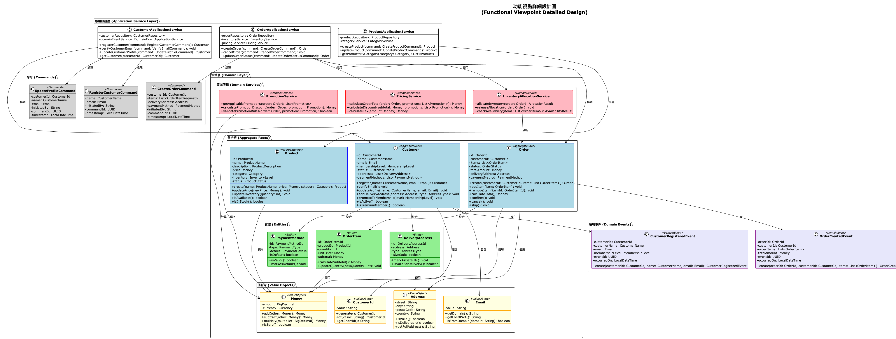

*Overall overview of system functional architecture, showing main functional modules and their relationships*

#### Domain Model Overview

*Complete domain model design, including relationships between all aggregate roots, entities, and value objects*

#### Bounded Contexts Overview

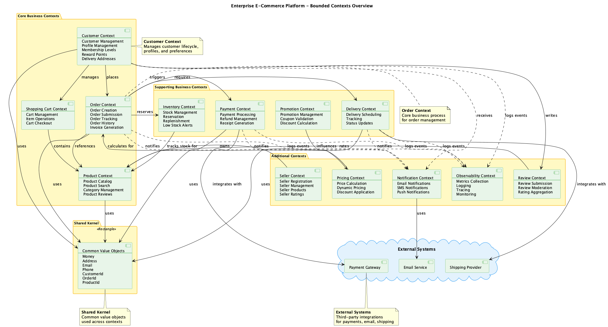

*Division of 13 bounded contexts and their integration relationships*

### Use Case Analysis
-  - System use cases and business processes
- 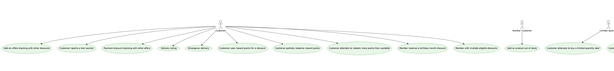 - User experience flow design
-  - API and system interface design

## Quality Attribute Considerations

> 📋 **Complete Cross-Reference**: See [Viewpoint-Perspective Cross-Reference Matrix](../../viewpoint-perspective-matrix.md) for detailed impact analysis of all viewpoints

### 🔴 High Impact Perspectives

#### [Security Perspective](../../perspectives/security/README.md)
- **Business Logic Security**: All business rules require security validation and authorization checks
- **Access Control**: Function-level permission control, ensuring users can only access authorized functions
- **Input Validation**: Comprehensive security validation of API and user inputs, preventing injection attacks
- **Output Encoding**: Output processing and data sanitization to prevent XSS attacks
- **Related Implementation**:  | **Security Standards Documentation** (Please refer to internal project documentation)

#### [Availability Perspective](../../perspectives/availability/README.md)
- **Critical Function Protection**: Fault-tolerant design and redundancy mechanisms for core business functions
- **Function Degradation**: Graceful degradation strategies when partial functions fail
- **Business Continuity**: Continuous operation guarantee for critical business processes
- **Failure Isolation**: Isolation of function failures to avoid cascading failures
- **Related Implementation**: [Availability Architecture Design](../../perspectives/availability/README.md) | Fault tolerance mechanism implementation

#### [Usability Perspective](../../perspectives/usability/README.md)
- **User Experience**: Function design that meets user expectations and usage habits
- **Interface Design**: Intuitive and user-friendly design of APIs and UIs
- **Error Handling**: User-friendly error messages and handling processes
- **Workflow**: Simplification and optimization of business processes
- **Related Implementation**:  | **API Design Standards** (Please refer to internal project documentation)

### 🟡 Medium Impact Perspectives

#### [Performance Perspective](../../perspectives/performance/README.md)
- **Response Time**: Performance requirements and SLA definitions for core functions
- **Throughput**: Processing capacity and scalability of frequently used functions
- **Resource Usage**: Resource consumption optimization for function execution
- **Related Implementation**: [Performance Monitoring Architecture](../../perspectives/performance/README.md) | **Performance Standards Documentation** (Please refer to internal project documentation)

#### [Evolution Perspective](../../perspectives/evolution/README.md)
- **Function Extension**: Capability to add new functions and backward compatibility
- **Business Rule Flexibility**: Configurability and adaptability of business logic
- **Modular Design**: Independence and reusability of functional modules
- **Related Implementation**: 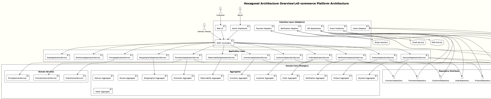 | [Modular Architecture Guide](bounded-contexts.md)

#### [Regulation Perspective](../../perspectives/regulation/README.md)
- **Compliance Functions**: Implementation and validation of regulatory required functions
- **Audit Trail**: Complete recording and tracking of business operations
- **Data Governance**: Function-level data management and protection
- **Related Implementation**:  | [Compliance Standards Documentation](../../perspectives/regulation/README.md)

#### [Cost Perspective](../../perspectives/cost/README.md)
- **Function Cost**: Cost-benefit analysis of function implementation and maintenance
- **Resource Efficiency**: Resource usage efficiency of function execution
- **Development Cost**: Time and human resource costs for function development
- **Related Implementation**: [Cost Optimization Architecture](../../perspectives/cost/README.md) | 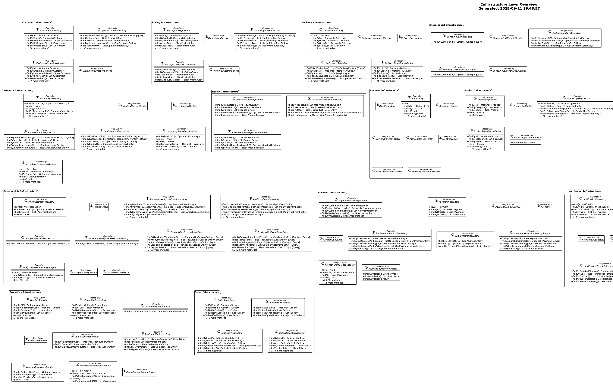

### 🟢 Low Impact Perspectives

#### [Location Perspective](../../perspectives/location/README.md)
- **Geographic Distribution**: Function availability and localization in different regions
- **Data Sovereignty**: Geographic location requirements for function-related data
- **Related Implementation**: [Multi-Environment Deployment Architecture](../../diagrams/multi_environment.svg)

## Related Diagrams

### System Architecture Overview
- ## System Overview Diagram

```mermaid
graph TB
    subgraph USERS ["用戶與角色"]
        CUSTOMER[👤 顧客<br/>購物與下單]
        SELLER[🏪 賣家<br/>商品管理]
        ADMIN[👨‍💼 管理員<br/>系統管理]
        DELIVERY[🚚 配送員<br/>物流配送]
    end
    
    subgraph FRONTEND ["前端應用"]
        WEB_APP[🌐 Web 應用<br/>Next.js 14 + TypeScript<br/>顧客購物界面]
        MOBILE_APP[📱 移動應用<br/>Angular 18 + TypeScript<br/>消費者應用]
        ADMIN_PANEL[🖥️ 管理面板<br/>React Admin Dashboard<br/>後台管理系統]
        SELLER_PORTAL[🏪 賣家門戶<br/>商家管理界面<br/>商品與訂單管理]
    end
    
    subgraph API_GATEWAY ["API 網關層"]
        GATEWAY[🚪 API Gateway<br/>路由與認證<br/>限流與監控]
        LOAD_BALANCER[⚖️ 負載均衡器<br/>流量分發<br/>健康檢查]
    end
    
    subgraph MICROSERVICES ["微服務架構"]
        subgraph CORE_SERVICES ["核心業務服務"]
            CUSTOMER_SVC[👤 Customer Service<br/>客戶管理服務<br/>會員系統與檔案]
            ORDER_SVC[📦 Order Service<br/>訂單管理服務<br/>訂單生命週期]
            PRODUCT_SVC[🛍️ Product Service<br/>商品管理服務<br/>商品目錄與搜尋]
            PAYMENT_SVC[💰 Payment Service<br/>支付處理服務<br/>多種支付方式]
            INVENTORY_SVC[📊 Inventory Service<br/>庫存管理服務<br/>庫存追蹤與預留]
        end
        
        subgraph BUSINESS_SERVICES ["業務支援服務"]
            CART_SVC[🛒 Shopping Cart Service<br/>購物車服務<br/>購物流程管理]
            PRICING_SVC[💲 Pricing Service<br/>定價服務<br/>動態定價與折扣]
            PROMOTION_SVC[🎁 Promotion Service<br/>促銷服務<br/>優惠券與活動]
            DELIVERY_SVC[🚚 Delivery Service<br/>配送服務<br/>物流與追蹤]
            REVIEW_SVC[⭐ Review Service<br/>評價服務<br/>商品評價系統]
        end
        
        subgraph PLATFORM_SERVICES ["平台服務"]
            NOTIFICATION_SVC[🔔 Notification Service<br/>通知服務<br/>多渠道消息推送]
            SEARCH_SVC[🔍 Search Service<br/>搜尋服務<br/>全文搜索與推薦]
            ANALYTICS_SVC[📈 Analytics Service<br/>分析服務<br/>數據統計與報表]
            AUDIT_SVC[📋 Audit Service<br/>審計服務<br/>操作日誌與合規]
        end
    end
    
    subgraph INFRASTRUCTURE ["基礎設施層"]
        subgraph DATABASES ["數據存儲"]
            POSTGRES[(🗄️ PostgreSQL<br/>主資料庫<br/>事務性數據)]
            REDIS[(⚡ Redis<br/>快取資料庫<br/>會話與快取)]
            OPENSEARCH[(🔍 OpenSearch<br/>搜尋引擎<br/>全文搜索)]
            S3[(📁 S3<br/>對象存儲<br/>文件與媒體)]
        end
        
        subgraph MESSAGE_QUEUE ["消息隊列"]
            MSK[📊 Amazon MSK<br/>Kafka 集群<br/>事件流處理]
            SQS[📬 Amazon SQS<br/>消息隊列<br/>異步任務處理]
            SNS[📢 Amazon SNS<br/>通知服務<br/>消息推送]
        end
        
        subgraph EXTERNAL_SERVICES ["外部服務"]
            STRIPE[💳 Stripe<br/>支付網關<br/>信用卡處理]
            PAYPAL[💰 PayPal<br/>支付平台<br/>數字錢包]
            EMAIL_SVC[📧 Email Service<br/>郵件服務<br/>SES/SMTP]
            SMS_SVC[📱 SMS Service<br/>簡訊服務<br/>SNS/Twilio]
            LOGISTICS[🚚 Logistics API<br/>物流服務<br/>第三方配送]
        end
    end
    
    subgraph OBSERVABILITY ["可觀測性"]
        MONITORING[📊 Monitoring<br/>Prometheus + Grafana<br/>指標監控]
        LOGGING[📝 Logging<br/>ELK Stack<br/>日誌聚合]
        TRACING[🔍 Tracing<br/>AWS X-Ray<br/>分布式追蹤]
        ALERTING[🚨 Alerting<br/>CloudWatch Alarms<br/>告警通知]
    end
    
    subgraph SECURITY ["安全與合規"]
        IAM[🔐 Identity & Access<br/>AWS IAM<br/>身份認證授權]
        WAF[🛡️ Web Application Firewall<br/>AWS WAF<br/>應用防護]
        SECRETS[🔑 Secrets Management<br/>AWS Secrets Manager<br/>密鑰管理]
        COMPLIANCE[📋 Compliance<br/>合規監控<br/>GDPR/PCI DSS]
    end
    
    %% User to Frontend Connections
    CUSTOMER --> WEB_APP
    CUSTOMER --> MOBILE_APP
    SELLER --> SELLER_PORTAL
    ADMIN --> ADMIN_PANEL
    DELIVERY --> MOBILE_APP
    
    %% Frontend to API Gateway
    WEB_APP --> GATEWAY
    MOBILE_APP --> GATEWAY
    ADMIN_PANEL --> GATEWAY
    SELLER_PORTAL --> GATEWAY
    
    %% API Gateway to Load Balancer
    GATEWAY --> LOAD_BALANCER
    
    %% Load Balancer to Core Services
    LOAD_BALANCER --> CUSTOMER_SVC
    LOAD_BALANCER --> ORDER_SVC
    LOAD_BALANCER --> PRODUCT_SVC
    LOAD_BALANCER --> PAYMENT_SVC
    LOAD_BALANCER --> INVENTORY_SVC
    
    %% Load Balancer to Business Services
    LOAD_BALANCER --> CART_SVC
    LOAD_BALANCER --> PRICING_SVC
    LOAD_BALANCER --> PROMOTION_SVC
    LOAD_BALANCER --> DELIVERY_SVC
    LOAD_BALANCER --> REVIEW_SVC
    
    %% Load Balancer to Platform Services
    LOAD_BALANCER --> NOTIFICATION_SVC
    LOAD_BALANCER --> SEARCH_SVC
    LOAD_BALANCER --> ANALYTICS_SVC
    LOAD_BALANCER --> AUDIT_SVC
    
    %% Service to Database Connections
    CUSTOMER_SVC --> POSTGRES
    ORDER_SVC --> POSTGRES
    PRODUCT_SVC --> POSTGRES
    PAYMENT_SVC --> POSTGRES
    INVENTORY_SVC --> POSTGRES
    CART_SVC --> REDIS
    PRICING_SVC --> REDIS
    PROMOTION_SVC --> POSTGRES
    DELIVERY_SVC --> POSTGRES
    REVIEW_SVC --> POSTGRES
    SEARCH_SVC --> OPENSEARCH
    ANALYTICS_SVC --> POSTGRES
    AUDIT_SVC --> POSTGRES
    
    %% Service to Cache Connections
    CUSTOMER_SVC --> REDIS
    PRODUCT_SVC --> REDIS
    PRICING_SVC --> REDIS
    SEARCH_SVC --> REDIS
    
    %% Service to Message Queue Connections
    ORDER_SVC --> MSK
    PAYMENT_SVC --> MSK
    INVENTORY_SVC --> MSK
    NOTIFICATION_SVC --> MSK
    NOTIFICATION_SVC --> SQS
    NOTIFICATION_SVC --> SNS
    ANALYTICS_SVC --> MSK
    AUDIT_SVC --> MSK
    
    %% Service to External Service Connections
    PAYMENT_SVC --> STRIPE
    PAYMENT_SVC --> PAYPAL
    NOTIFICATION_SVC --> EMAIL_SVC
    NOTIFICATION_SVC --> SMS_SVC
    DELIVERY_SVC --> LOGISTICS
    
    %% File Storage Connections
    PRODUCT_SVC --> S3
    CUSTOMER_SVC --> S3
    AUDIT_SVC --> S3
    
    %% Observability Connections
    CUSTOMER_SVC --> MONITORING
    ORDER_SVC --> MONITORING
    PRODUCT_SVC --> MONITORING
    PAYMENT_SVC --> MONITORING
    INVENTORY_SVC --> MONITORING
    CART_SVC --> MONITORING
    PRICING_SVC --> MONITORING
    PROMOTION_SVC --> MONITORING
    DELIVERY_SVC --> MONITORING
    REVIEW_SVC --> MONITORING
    NOTIFICATION_SVC --> MONITORING
    SEARCH_SVC --> MONITORING
    ANALYTICS_SVC --> MONITORING
    AUDIT_SVC --> MONITORING
    
    MONITORING --> LOGGING
    MONITORING --> TRACING
    MONITORING --> ALERTING
    
    %% Security Connections
    GATEWAY --> IAM
    GATEWAY --> WAF
    CUSTOMER_SVC --> SECRETS
    PAYMENT_SVC --> SECRETS
    NOTIFICATION_SVC --> SECRETS
    AUDIT_SVC --> COMPLIANCE
    
    %% Inter-Service Communication (Event-Driven)
    ORDER_SVC -.->|OrderCreated| INVENTORY_SVC
    ORDER_SVC -.->|OrderCreated| PAYMENT_SVC
    ORDER_SVC -.->|OrderCreated| NOTIFICATION_SVC
    PAYMENT_SVC -.->|PaymentProcessed| ORDER_SVC
    PAYMENT_SVC -.->|PaymentProcessed| DELIVERY_SVC
    INVENTORY_SVC -.->|StockReserved| ORDER_SVC
    INVENTORY_SVC -.->|StockUpdated| PRODUCT_SVC
    CUSTOMER_SVC -.->|CustomerRegistered| NOTIFICATION_SVC
    REVIEW_SVC -.->|ReviewCreated| PRODUCT_SVC
    DELIVERY_SVC -.->|DeliveryStatusChanged| ORDER_SVC
    DELIVERY_SVC -.->|DeliveryStatusChanged| NOTIFICATION_SVC
    
    %% Styling
    classDef user fill:#e3f2fd,stroke:#1976d2,stroke-width:2px
    classDef frontend fill:#e8f5e8,stroke:#388e3c,stroke-width:2px
    classDef gateway fill:#fff3e0,stroke:#f57c00,stroke-width:2px
    classDef core fill:#f3e5f5,stroke:#7b1fa2,stroke-width:2px
    classDef business fill:#e1f5fe,stroke:#0277bd,stroke-width:2px
    classDef platform fill:#fce4ec,stroke:#c2185b,stroke-width:2px
    classDef database fill:#f1f8e9,stroke:#689f38,stroke-width:2px
    classDef message fill:#fff8e1,stroke:#fbc02d,stroke-width:2px
    classDef external fill:#ffebee,stroke:#d32f2f,stroke-width:2px
    classDef observability fill:#f3e5f5,stroke:#9c27b0,stroke-width:2px
    classDef security fill:#e8eaf6,stroke:#3f51b5,stroke-width:2px
    
    class CUSTOMER,SELLER,ADMIN,DELIVERY user
    class WEB_APP,MOBILE_APP,ADMIN_PANEL,SELLER_PORTAL frontend
    class GATEWAY,LOAD_BALANCER gateway
    class CUSTOMER_SVC,ORDER_SVC,PRODUCT_SVC,PAYMENT_SVC,INVENTORY_SVC core
    class CART_SVC,PRICING_SVC,PROMOTION_SVC,DELIVERY_SVC,REVIEW_SVC business
    class NOTIFICATION_SVC,SEARCH_SVC,ANALYTICS_SVC,AUDIT_SVC platform
    class POSTGRES,REDIS,OPENSEARCH,S3 database
    class MSK,SQS,SNS message
    class STRIPE,PAYPAL,EMAIL_SVC,SMS_SVC,LOGISTICS external
    class MONITORING,LOGGING,TRACING,ALERTING observability
    class IAM,WAF,SECRETS,COMPLIANCE security
```

*完整系統架構概覽，展示用戶角色、前端應用、API網關、微服務架構、基礎設施、可觀測性和安全合規*
- !!!! - 端口和適配器架構，基於實際代碼結構
- ## 六角架構概覽 (Mermaid)

```mermaid
graph TB
    subgraph ACTORS ["External Actors"]
        CUSTOMER[👤 Customer<br/>Web & Mobile Users]
        ADMIN[👨‍💼 Admin<br/>Management Dashboard]
        DELIVERY[🚚 Delivery Person<br/>Logistics Interface]
    end
    
    subgraph EXTERNAL ["External Systems"]
        STRIPE[💳 Stripe Payment<br/>Payment Processing]
        EMAIL[📧 Email Service<br/>SES/SMTP]
        SMS[📱 SMS Service<br/>SNS/Twilio]
        POSTGRES[(🗄️ PostgreSQL<br/>Primary Database)]
        REDIS[(⚡ Redis Cache<br/>Session & Cache)]
        MSK[📊 MSK/Kafka<br/>Event Streaming]
    end
    
    subgraph PRIMARY_ADAPTERS ["Primary Adapters (Driving Side)"]
        WEB_UI[🌐 Web UI<br/>Next.js Frontend]
        MOBILE_UI[📱 Mobile UI<br/>Angular App]
        ADMIN_UI[🖥️ Admin Dashboard<br/>Management Interface]
        REST_API[🔌 REST Controllers<br/>HTTP API Endpoints]
        GRAPHQL[📡 GraphQL API<br/>Query Interface]
    end
    
    subgraph APPLICATION ["Application Layer"]
        CUSTOMER_APP[👤 CustomerApplicationService<br/>Customer Management]
        ORDER_APP[📦 OrderApplicationService<br/>Order Processing]
        PRODUCT_APP[🛍️ ProductApplicationService<br/>Product Management]
        PAYMENT_APP[💰 PaymentApplicationService<br/>Payment Processing]
        CART_APP[🛒 ShoppingCartApplicationService<br/>Cart Management]
        INVENTORY_APP[📊 InventoryApplicationService<br/>Stock Management]
        PRICING_APP[💲 PricingApplicationService<br/>Price Calculation]
        PROMOTION_APP[🎁 PromotionApplicationService<br/>Discount Management]
        NOTIFICATION_APP[🔔 NotificationApplicationService<br/>Message Delivery]
        OBSERVABILITY_APP[📈 ObservabilityApplicationService<br/>Monitoring & Metrics]
        STATS_APP[📊 StatsApplicationService<br/>Analytics & Reports]
        MONITORING_APP[🔍 MonitoringApplicationService<br/>Health Checks]
    end
    
    subgraph DOMAIN_CORE ["Domain Core (Hexagon)"]
        subgraph AGGREGATES ["Aggregate Roots"]
            CUSTOMER_AGG[👤 Customer<br/>@AggregateRoot<br/>Customer Lifecycle]
            ORDER_AGG[📦 Order<br/>@AggregateRoot<br/>Order Management]
            PRODUCT_AGG[🛍️ Product<br/>@AggregateRoot<br/>Product Catalog]
            PAYMENT_AGG[💰 Payment<br/>@AggregateRoot<br/>Payment Processing]
            CART_AGG[🛒 ShoppingCart<br/>@AggregateRoot<br/>Cart State]
            INVENTORY_AGG[📊 Inventory<br/>@AggregateRoot<br/>Stock Control]
            PROMOTION_AGG[🎁 Promotion<br/>@AggregateRoot<br/>Discount Rules]
            DELIVERY_AGG[🚚 Delivery<br/>@AggregateRoot<br/>Shipping Info]
            NOTIFICATION_AGG[🔔 Notification<br/>@AggregateRoot<br/>Message Queue]
            REVIEW_AGG[⭐ Review<br/>@AggregateRoot<br/>Product Reviews]
            SELLER_AGG[🏪 Seller<br/>@AggregateRoot<br/>Vendor Management]
            OBSERVABILITY_AGG[📈 Observability<br/>@AggregateRoot<br/>Metrics Collection]
        end
        
        subgraph DOMAIN_SERVICES ["Domain Services"]
            ORDER_DOMAIN_SVC[📦 OrderDomainService<br/>Complex Order Logic]
            PRICING_DOMAIN_SVC[💲 PricingDomainService<br/>Pricing Algorithms]
            PROMOTION_DOMAIN_SVC[🎁 PromotionDomainService<br/>Discount Calculations]
        end
        
        subgraph REPOSITORY_PORTS ["Repository Ports"]
            CUSTOMER_REPO_PORT[👤 CustomerRepository<br/>Interface]
            ORDER_REPO_PORT[📦 OrderRepository<br/>Interface]
            PRODUCT_REPO_PORT[🛍️ ProductRepository<br/>Interface]
            PAYMENT_REPO_PORT[💰 PaymentRepository<br/>Interface]
            INVENTORY_REPO_PORT[📊 InventoryRepository<br/>Interface]
            PROMOTION_REPO_PORT[🎁 PromotionRepository<br/>Interface]
        end
        
        subgraph SERVICE_PORTS ["Service Ports"]
            PAYMENT_PORT[💳 PaymentPort<br/>Payment Gateway Interface]
            NOTIFICATION_PORT[🔔 NotificationPort<br/>Messaging Interface]
            EVENT_PORT[📡 EventPublisherPort<br/>Event Streaming Interface]
            CACHE_PORT[⚡ CachePort<br/>Caching Interface]
        end
    end
    
    subgraph SECONDARY_ADAPTERS ["Secondary Adapters (Driven Side)"]
        subgraph PERSISTENCE ["Persistence Adapters"]
            JPA_CUSTOMER[👤 JpaCustomerRepository<br/>Customer Data Access]
            JPA_ORDER[📦 JpaOrderRepository<br/>Order Data Access]
            JPA_PRODUCT[🛍️ JpaProductRepository<br/>Product Data Access]
            JPA_PAYMENT[💰 JpaPaymentRepository<br/>Payment Data Access]
            JPA_INVENTORY[📊 JpaInventoryRepository<br/>Inventory Data Access]
            JPA_PROMOTION[🎁 JpaPromotionRepository<br/>Promotion Data Access]
        end
        
        subgraph EXTERNAL_ADAPTERS ["External Service Adapters"]
            STRIPE_ADAPTER[💳 StripePaymentAdapter<br/>Stripe Integration]
            EMAIL_ADAPTER[📧 EmailNotificationAdapter<br/>Email Service Integration]
            SMS_ADAPTER[📱 SmsNotificationAdapter<br/>SMS Service Integration]
        end
        
        subgraph EVENT_ADAPTERS ["Event & Cache Adapters"]
            MSK_ADAPTER[📊 MskEventAdapter<br/>Kafka Event Publishing]
            MEMORY_EVENT_ADAPTER[🧠 InMemoryEventAdapter<br/>Development Events]
            REDIS_ADAPTER[⚡ RedisCacheAdapter<br/>Cache Management]
            OPENSEARCH_ADAPTER[🔍 OpenSearchAdapter<br/>Search & Analytics]
        end
    end
    
    %% Primary Flow (Inbound)
    CUSTOMER --> WEB_UI
    CUSTOMER --> MOBILE_UI
    ADMIN --> ADMIN_UI
    DELIVERY --> REST_API
    
    WEB_UI --> REST_API
    MOBILE_UI --> REST_API
    ADMIN_UI --> REST_API
    REST_API --> GRAPHQL
    
    REST_API --> CUSTOMER_APP
    REST_API --> ORDER_APP
    REST_API --> PRODUCT_APP
    REST_API --> PAYMENT_APP
    REST_API --> CART_APP
    REST_API --> INVENTORY_APP
    REST_API --> PRICING_APP
    REST_API --> PROMOTION_APP
    REST_API --> NOTIFICATION_APP
    REST_API --> OBSERVABILITY_APP
    REST_API --> STATS_APP
    REST_API --> MONITORING_APP
    
    %% Application to Domain
    CUSTOMER_APP --> CUSTOMER_AGG
    ORDER_APP --> ORDER_AGG
    ORDER_APP --> ORDER_DOMAIN_SVC
    PRODUCT_APP --> PRODUCT_AGG
    PAYMENT_APP --> PAYMENT_AGG
    CART_APP --> CART_AGG
    INVENTORY_APP --> INVENTORY_AGG
    PRICING_APP --> PRICING_DOMAIN_SVC
    PROMOTION_APP --> PROMOTION_AGG
    PROMOTION_APP --> PROMOTION_DOMAIN_SVC
    NOTIFICATION_APP --> NOTIFICATION_AGG
    OBSERVABILITY_APP --> OBSERVABILITY_AGG
    
    %% Domain to Repository Ports
    CUSTOMER_APP --> CUSTOMER_REPO_PORT
    ORDER_APP --> ORDER_REPO_PORT
    PRODUCT_APP --> PRODUCT_REPO_PORT
    PAYMENT_APP --> PAYMENT_REPO_PORT
    INVENTORY_APP --> INVENTORY_REPO_PORT
    PROMOTION_APP --> PROMOTION_REPO_PORT
    
    %% Domain to Service Ports
    PAYMENT_APP --> PAYMENT_PORT
    NOTIFICATION_APP --> NOTIFICATION_PORT
    ORDER_APP --> EVENT_PORT
    PRODUCT_APP --> CACHE_PORT
    
    %% Secondary Flow (Outbound) - Repository Implementations
    CUSTOMER_REPO_PORT -.-> JPA_CUSTOMER
    ORDER_REPO_PORT -.-> JPA_ORDER
    PRODUCT_REPO_PORT -.-> JPA_PRODUCT
    PAYMENT_REPO_PORT -.-> JPA_PAYMENT
    INVENTORY_REPO_PORT -.-> JPA_INVENTORY
    PROMOTION_REPO_PORT -.-> JPA_PROMOTION
    
    %% Secondary Flow (Outbound) - Service Implementations
    PAYMENT_PORT -.-> STRIPE_ADAPTER
    NOTIFICATION_PORT -.-> EMAIL_ADAPTER
    NOTIFICATION_PORT -.-> SMS_ADAPTER
    EVENT_PORT -.-> MSK_ADAPTER
    EVENT_PORT -.-> MEMORY_EVENT_ADAPTER
    CACHE_PORT -.-> REDIS_ADAPTER
    CACHE_PORT -.-> OPENSEARCH_ADAPTER
    
    %% External System Connections
    JPA_CUSTOMER --> POSTGRES
    JPA_ORDER --> POSTGRES
    JPA_PRODUCT --> POSTGRES
    JPA_PAYMENT --> POSTGRES
    JPA_INVENTORY --> POSTGRES
    JPA_PROMOTION --> POSTGRES
    
    STRIPE_ADAPTER --> STRIPE
    EMAIL_ADAPTER --> EMAIL
    SMS_ADAPTER --> SMS
    MSK_ADAPTER --> MSK
    REDIS_ADAPTER --> REDIS
    
    %% Styling
    classDef actor fill:#e3f2fd,stroke:#1976d2,stroke-width:2px
    classDef external fill:#ffebee,stroke:#d32f2f,stroke-width:2px
    classDef primary fill:#e8f5e8,stroke:#388e3c,stroke-width:2px
    classDef application fill:#f3e5f5,stroke:#7b1fa2,stroke-width:2px
    classDef domain fill:#fff3e0,stroke:#f57c00,stroke-width:2px
    classDef secondary fill:#fafafa,stroke:#616161,stroke-width:2px
    
    class CUSTOMER,ADMIN,DELIVERY actor
    class STRIPE,EMAIL,SMS,POSTGRES,REDIS,MSK external
    class WEB_UI,MOBILE_UI,ADMIN_UI,REST_API,GRAPHQL primary
    class CUSTOMER_APP,ORDER_APP,PRODUCT_APP,PAYMENT_APP,CART_APP,INVENTORY_APP,PRICING_APP,PROMOTION_APP,NOTIFICATION_APP,OBSERVABILITY_APP,STATS_APP,MONITORING_APP application
    class CUSTOMER_AGG,ORDER_AGG,PRODUCT_AGG,PAYMENT_AGG,CART_AGG,INVENTORY_AGG,PROMOTION_AGG,DELIVERY_AGG,NOTIFICATION_AGG,REVIEW_AGG,SELLER_AGG,OBSERVABILITY_AGG,ORDER_DOMAIN_SVC,PRICING_DOMAIN_SVC,PROMOTION_DOMAIN_SVC,CUSTOMER_REPO_PORT,ORDER_REPO_PORT,PRODUCT_REPO_PORT,PAYMENT_REPO_PORT,INVENTORY_REPO_PORT,PROMOTION_REPO_PORT,PAYMENT_PORT,NOTIFICATION_PORT,EVENT_PORT,CACHE_PORT domain
    class JPA_CUSTOMER,JPA_ORDER,JPA_PRODUCT,JPA_PAYMENT,JPA_INVENTORY,JPA_PROMOTION,STRIPE_ADAPTER,EMAIL_ADAPTER,SMS_ADAPTER,MSK_ADAPTER,MEMORY_EVENT_ADAPTER,REDIS_ADAPTER,OPENSEARCH_ADAPTER secondary
```

*互動式六角架構圖表*

### 領域模型圖表
- !!!! - DDD 聚合根總覽
- !!!! - **New**: 界限上下文概念設計，展示所有13個上下文的職責、關係和領域事件
- !!!! - 13個界限上下文設計
- ## DDD分層架構

```mermaid
graph TB
    subgraph UI ["🖥️ 用戶界面層 (User Interface Layer)"]
        direction LR
        WEB_APP["Web 應用<br/>Next.js 14"]
        MOBILE_APP["移動應用<br/>Angular 18"]
        ADMIN_PANEL["管理面板<br/>React Admin"]
        API_DOCS["API 文檔<br/>Swagger UI"]
    end
    
    subgraph APP ["⚙️ 應用層 (Application Layer)"]
        direction TB
        subgraph CONTROLLERS ["REST Controllers"]
            direction LR
            ORDER_CTRL["OrderController"]
            CUSTOMER_CTRL["CustomerController"]
            PRODUCT_CTRL["ProductController"]
            PAYMENT_CTRL["PaymentController"]
            CART_CTRL["ShoppingCartController"]
            PROMOTION_CTRL["PromotionController"]
        end
        
        subgraph APP_SERVICES ["Application Services"]
            direction LR
            ORDER_APP_SVC["OrderApplicationService"]
            CUSTOMER_APP_SVC["CustomerApplicationService"]
            PRODUCT_APP_SVC["ProductApplicationService"]
            PAYMENT_APP_SVC["PaymentApplicationService"]
            CART_APP_SVC["ShoppingCartApplicationService"]
            INVENTORY_APP_SVC["InventoryApplicationService"]
            PRICING_APP_SVC["PricingApplicationService"]
            PROMOTION_APP_SVC["PromotionApplicationService"]
            NOTIFICATION_APP_SVC["NotificationApplicationService"]
            OBSERVABILITY_APP_SVC["ObservabilityApplicationService"]
            STATS_APP_SVC["StatsApplicationService"]
            MONITORING_APP_SVC["MonitoringApplicationService"]
        end
        
        subgraph DTOS ["DTOs & Event Handling"]
            direction LR
            ORDER_DTO["OrderDTO"]
            CUSTOMER_DTO["CustomerDTO"]
            PRODUCT_DTO["ProductDTO"]
            DTO_MAPPER["DTOMapper"]
            EVENT_HANDLER["DomainEventHandler"]
            EVENT_PUBLISHER["EventPublisher"]
        end
    end
    
    subgraph DOMAIN ["🏛️ 領域層 (Domain Layer)"]
        direction TB
        subgraph AGGREGATES ["Aggregate Roots"]
            direction LR
            ORDER_AGG["Order<br/>@AggregateRoot"]
            CUSTOMER_AGG["Customer<br/>@AggregateRoot"]
            PRODUCT_AGG["Product<br/>@AggregateRoot"]
            PAYMENT_AGG["Payment<br/>@AggregateRoot"]
            CART_AGG["ShoppingCart<br/>@AggregateRoot"]
            INVENTORY_AGG["Inventory<br/>@AggregateRoot"]
            PROMOTION_AGG["Promotion<br/>@AggregateRoot"]
            DELIVERY_AGG["Delivery<br/>@AggregateRoot"]
            NOTIFICATION_AGG["Notification<br/>@AggregateRoot"]
            REVIEW_AGG["Review<br/>@AggregateRoot"]
            SELLER_AGG["Seller<br/>@AggregateRoot"]
            OBSERVABILITY_AGG["Observability<br/>@AggregateRoot"]
        end
        
        subgraph DOMAIN_COMPONENTS ["Domain Components"]
            direction LR
            subgraph ENTITIES ["Entities"]
                ORDER_ITEM["OrderItem"]
                CUSTOMER_PROFILE["CustomerProfile"]
                PRODUCT_VARIANT["ProductVariant"]
                PAYMENT_METHOD["PaymentMethod"]
                CART_ITEM["CartItem"]
            end
            
            subgraph VALUE_OBJECTS ["Value Objects"]
                MONEY["Money"]
                ADDRESS["Address"]
                EMAIL["Email"]
                ORDER_ID["OrderId"]
                CUSTOMER_ID["CustomerId"]
                PRODUCT_ID["ProductId"]
            end
            
            subgraph DOMAIN_EVENTS ["Domain Events"]
                ORDER_CREATED["OrderCreatedEvent"]
                PAYMENT_PROCESSED["PaymentProcessedEvent"]
                CUSTOMER_REGISTERED["CustomerRegisteredEvent"]
                INVENTORY_RESERVED["InventoryReservedEvent"]
                CART_UPDATED["CartUpdatedEvent"]
                PROMOTION_APPLIED["PromotionAppliedEvent"]
            end
        end
        
        subgraph DOMAIN_SERVICES ["Domain Services & Repositories"]
            direction LR
            subgraph DOM_SERVICES ["Domain Services"]
                ORDER_PRICING_SVC["OrderPricingService"]
                PAYMENT_VALIDATION_SVC["PaymentValidationService"]
                PROMOTION_CALCULATION_SVC["PromotionCalculationService"]
                INVENTORY_ALLOCATION_SVC["InventoryAllocationService"]
            end
            
            subgraph REPOSITORIES ["Repository Interfaces"]
                ORDER_REPO_INTF["OrderRepository"]
                CUSTOMER_REPO_INTF["CustomerRepository"]
                PRODUCT_REPO_INTF["ProductRepository"]
                PAYMENT_REPO_INTF["PaymentRepository"]
                INVENTORY_REPO_INTF["InventoryRepository"]
                PROMOTION_REPO_INTF["PromotionRepository"]
            end
            
            subgraph PORTS ["Port Interfaces"]
                PAYMENT_PORT["PaymentPort"]
                NOTIFICATION_PORT["NotificationPort"]
                EVENT_PUBLISHER_PORT["EventPublisherPort"]
                CACHE_PORT["CachePort"]
            end
        end
    end
    
    subgraph INFRA ["🔧 基礎設施層 (Infrastructure Layer)"]
        direction TB
        subgraph PERSISTENCE ["Persistence Layer"]
            direction LR
            JPA_ORDER_REPO["JpaOrderRepository"]
            JPA_CUSTOMER_REPO["JpaCustomerRepository"]
            JPA_PRODUCT_REPO["JpaProductRepository"]
            JPA_PAYMENT_REPO["JpaPaymentRepository"]
            JPA_INVENTORY_REPO["JpaInventoryRepository"]
            JPA_PROMOTION_REPO["JpaPromotionRepository"]
        end
        
        subgraph ADAPTERS ["External Adapters"]
            direction LR
            STRIPE_ADAPTER["StripePaymentAdapter"]
            SES_ADAPTER["SesEmailAdapter"]
            SNS_ADAPTER["SnsNotificationAdapter"]
            SMS_ADAPTER["SmsNotificationService"]
            MSK_EVENT_ADAPTER["MskEventAdapter"]
            REDIS_ADAPTER["RedisCacheAdapter"]
            OPENSEARCH_ADAPTER["OpenSearchAdapter"]
        end
        
        subgraph CONFIG ["Configuration"]
            direction LR
            DEV_CONFIG["DevelopmentConfiguration"]
            PROD_CONFIG["ProductionConfiguration"]
            PROFILE_VALIDATOR["ProfileActivationValidator"]
        end
    end
    
    subgraph STORAGE ["💾 數據存儲層 (Data Storage Layer)"]
        direction LR
        POSTGRESQL[("PostgreSQL<br/>主資料庫")]
        H2_DB[("H2 Database<br/>開發測試")]
        REDIS_CACHE[("Redis<br/>快取")]
        OPENSEARCH_DB[("OpenSearch<br/>搜尋")]
        MSK_STREAM[("MSK<br/>事件流")]
        S3_STORAGE[("S3<br/>對象存儲")]
    end
    
    %% Layer Dependencies
    UI --> APP
    APP --> DOMAIN
    DOMAIN --> INFRA
    INFRA --> STORAGE
    
    %% Key Connections
    WEB_APP --> ORDER_CTRL
    MOBILE_APP --> CART_CTRL
    ADMIN_PANEL --> STATS_APP_SVC
    
    ORDER_CTRL --> ORDER_APP_SVC
    CUSTOMER_CTRL --> CUSTOMER_APP_SVC
    PRODUCT_CTRL --> PRODUCT_APP_SVC
    PAYMENT_CTRL --> PAYMENT_APP_SVC
    CART_CTRL --> CART_APP_SVC
    PROMOTION_CTRL --> PROMOTION_APP_SVC
    
    ORDER_APP_SVC --> ORDER_AGG
    CUSTOMER_APP_SVC --> CUSTOMER_AGG
    PRODUCT_APP_SVC --> PRODUCT_AGG
    PAYMENT_APP_SVC --> PAYMENT_AGG
    CART_APP_SVC --> CART_AGG
    INVENTORY_APP_SVC --> INVENTORY_AGG
    PRICING_APP_SVC --> ORDER_PRICING_SVC
    PROMOTION_APP_SVC --> PROMOTION_AGG
    NOTIFICATION_APP_SVC --> NOTIFICATION_AGG
    OBSERVABILITY_APP_SVC --> OBSERVABILITY_AGG
    
    ORDER_AGG --> ORDER_CREATED
    PAYMENT_AGG --> PAYMENT_PROCESSED
    CUSTOMER_AGG --> CUSTOMER_REGISTERED
    INVENTORY_AGG --> INVENTORY_RESERVED
    CART_AGG --> CART_UPDATED
    PROMOTION_AGG --> PROMOTION_APPLIED
    
    ORDER_CREATED --> EVENT_HANDLER
    PAYMENT_PROCESSED --> EVENT_HANDLER
    CUSTOMER_REGISTERED --> EVENT_HANDLER
    EVENT_HANDLER --> EVENT_PUBLISHER
    
    ORDER_APP_SVC --> ORDER_REPO_INTF
    CUSTOMER_APP_SVC --> CUSTOMER_REPO_INTF
    PRODUCT_APP_SVC --> PRODUCT_REPO_INTF
    PAYMENT_APP_SVC --> PAYMENT_REPO_INTF
    INVENTORY_APP_SVC --> INVENTORY_REPO_INTF
    PROMOTION_APP_SVC --> PROMOTION_REPO_INTF
    
    PAYMENT_APP_SVC --> PAYMENT_PORT
    NOTIFICATION_APP_SVC --> NOTIFICATION_PORT
    ORDER_APP_SVC --> EVENT_PUBLISHER_PORT
    PRODUCT_APP_SVC --> CACHE_PORT
    
    ORDER_REPO_INTF -.-> JPA_ORDER_REPO
    CUSTOMER_REPO_INTF -.-> JPA_CUSTOMER_REPO
    PRODUCT_REPO_INTF -.-> JPA_PRODUCT_REPO
    PAYMENT_REPO_INTF -.-> JPA_PAYMENT_REPO
    INVENTORY_REPO_INTF -.-> JPA_INVENTORY_REPO
    PROMOTION_REPO_INTF -.-> JPA_PROMOTION_REPO
    
    PAYMENT_PORT -.-> STRIPE_ADAPTER
    NOTIFICATION_PORT -.-> SES_ADAPTER
    NOTIFICATION_PORT -.-> SNS_ADAPTER
    EVENT_PUBLISHER_PORT -.-> MSK_EVENT_ADAPTER
    CACHE_PORT -.-> REDIS_ADAPTER
    
    JPA_ORDER_REPO --> POSTGRESQL
    JPA_CUSTOMER_REPO --> POSTGRESQL
    JPA_PRODUCT_REPO --> POSTGRESQL
    JPA_PAYMENT_REPO --> POSTGRESQL
    JPA_INVENTORY_REPO --> POSTGRESQL
    JPA_PROMOTION_REPO --> POSTGRESQL
    
    DEV_CONFIG --> H2_DB
    PROD_CONFIG --> POSTGRESQL
    REDIS_ADAPTER --> REDIS_CACHE
    OPENSEARCH_ADAPTER --> OPENSEARCH_DB
    MSK_EVENT_ADAPTER --> MSK_STREAM
    
    classDef ui fill:#e3f2fd,stroke:#0277bd,stroke-width:2px
    classDef application fill:#f3e5f5,stroke:#7b1fa2,stroke-width:2px
    classDef domain fill:#e8f5e8,stroke:#2e7d32,stroke-width:2px
    classDef infrastructure fill:#fff3e0,stroke:#f57c00,stroke-width:2px
    classDef storage fill:#fafafa,stroke:#616161,stroke-width:2px
    
    class WEB_APP,MOBILE_APP,ADMIN_PANEL,API_DOCS ui
    class ORDER_CTRL,CUSTOMER_CTRL,PRODUCT_CTRL,PAYMENT_CTRL,CART_CTRL,PROMOTION_CTRL,ORDER_APP_SVC,CUSTOMER_APP_SVC,PRODUCT_APP_SVC,PAYMENT_APP_SVC,CART_APP_SVC,INVENTORY_APP_SVC,PRICING_APP_SVC,PROMOTION_APP_SVC,NOTIFICATION_APP_SVC,OBSERVABILITY_APP_SVC,STATS_APP_SVC,MONITORING_APP_SVC,ORDER_DTO,CUSTOMER_DTO,PRODUCT_DTO,DTO_MAPPER,EVENT_HANDLER,EVENT_PUBLISHER application
    class ORDER_AGG,CUSTOMER_AGG,PRODUCT_AGG,PAYMENT_AGG,CART_AGG,INVENTORY_AGG,PROMOTION_AGG,DELIVERY_AGG,NOTIFICATION_AGG,REVIEW_AGG,SELLER_AGG,OBSERVABILITY_AGG,ORDER_ITEM,CUSTOMER_PROFILE,PRODUCT_VARIANT,PAYMENT_METHOD,CART_ITEM,MONEY,ADDRESS,EMAIL,ORDER_ID,CUSTOMER_ID,PRODUCT_ID,ORDER_CREATED,PAYMENT_PROCESSED,CUSTOMER_REGISTERED,INVENTORY_RESERVED,CART_UPDATED,PROMOTION_APPLIED,ORDER_PRICING_SVC,PAYMENT_VALIDATION_SVC,PROMOTION_CALCULATION_SVC,INVENTORY_ALLOCATION_SVC,ORDER_REPO_INTF,CUSTOMER_REPO_INTF,PRODUCT_REPO_INTF,PAYMENT_REPO_INTF,INVENTORY_REPO_INTF,PROMOTION_REPO_INTF,PAYMENT_PORT,NOTIFICATION_PORT,EVENT_PUBLISHER_PORT,CACHE_PORT domain
    class JPA_ORDER_REPO,JPA_CUSTOMER_REPO,JPA_PRODUCT_REPO,JPA_PAYMENT_REPO,JPA_INVENTORY_REPO,JPA_PROMOTION_REPO,STRIPE_ADAPTER,SES_ADAPTER,SNS_ADAPTER,SMS_ADAPTER,MSK_EVENT_ADAPTER,REDIS_ADAPTER,OPENSEARCH_ADAPTER,DEV_CONFIG,PROD_CONFIG,PROFILE_VALIDATOR infrastructure
    class POSTGRESQL,H2_DB,REDIS_CACHE,OPENSEARCH_DB,MSK_STREAM,S3_STORAGE storage
```

*完整的DDD分層架構實現*

### 業務流程圖表
- [Event Storming Big Picture](../../diagrams/viewpoints/functional/event-storming-big-picture.puml) - 事件風暴全景圖
- [業務流程圖](../../diagrams/viewpoints/functional/business-process-flows.puml) - 電商核心業務流程
- [領域事件流程](../../diagrams/viewpoints/functional/domain-events-flow.puml) - 領域事件驅動的業務流程

### 環境與基礎設施
- ## 多環境配置

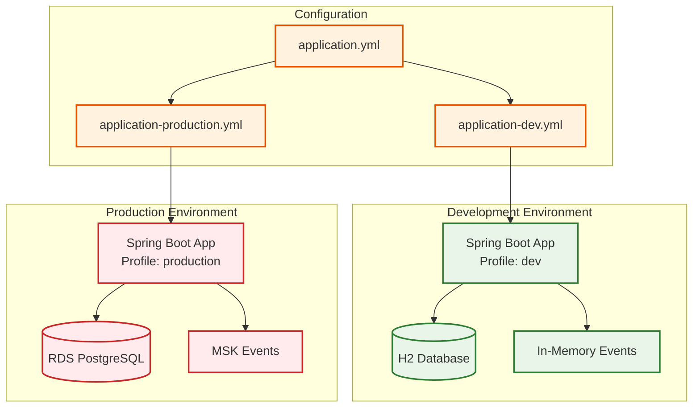

*開發、測試、生產環境配置*
- ## 可觀測性架構

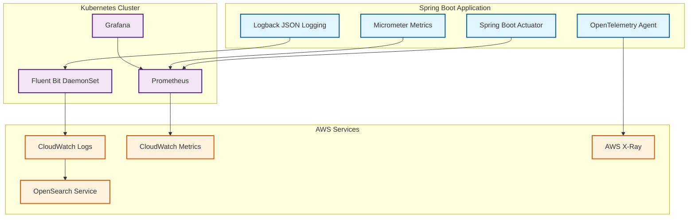

*監控、日誌、追蹤系統架構*

## 與其他視點的關聯

- **[情境視點](../context/README.md)**: 外部系統整合的功能需求
- **[資訊視點](../information/README.md)**: 功能需求驅動資料模型設計
- **[並發視點](../concurrency/README.md)**: 功能執行的並發需求
- **[開發視點](../development/README.md)**: 功能實現的模組結構
- **[部署視點](../deployment/README.md)**: 功能分佈和部署需求
- **[運營視點](../operational/README.md)**: 功能監控和維護需求

## 實現指南

### DDD 戰術模式應用
1. **聚合根識別**: 基於業務不變性識別聚合邊界
2. **實體和值對象**: 根據身份和生命週期區分
3. **領域服務**: 跨聚合的業務邏輯實現
4. **領域事件**: 業務事件的建模和處理

### 用例實現策略
1. **應用服務**: 用例的協調和編排
2. **命令查詢分離**: 讀寫操作的分離
3. **業務規則驗證**: 領域層的規則實現
4. **異常處理**: 業務異常的處理策略

## 驗證標準

- [ ] 所有功能需求都有對應的實現
- [ ] 業務規則在領域層正確實現
- [ ] 聚合邊界設計合理
- [ ] 用例實現完整且可測試
- [ ] 系統邊界清晰定義
- [ ] 介面設計符合業務需求

---

**相關文件**:
- [領域驅動設計指南](domain-model.md)
- [界限上下文設計](bounded-contexts.md)
- [聚合根實現](aggregates.md)
!!!!!
!!!!!
!!!!!
!!!!!
!!!!!


