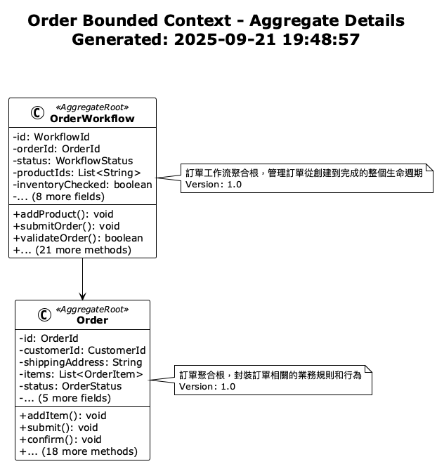
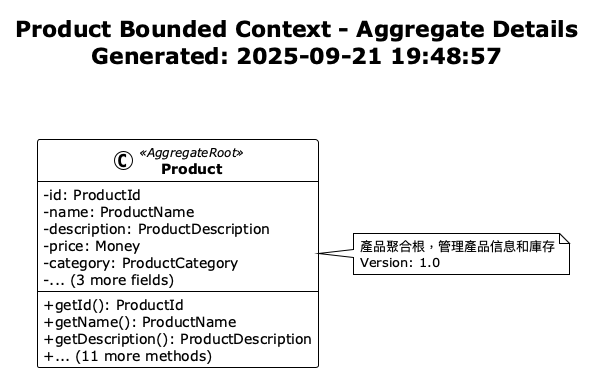
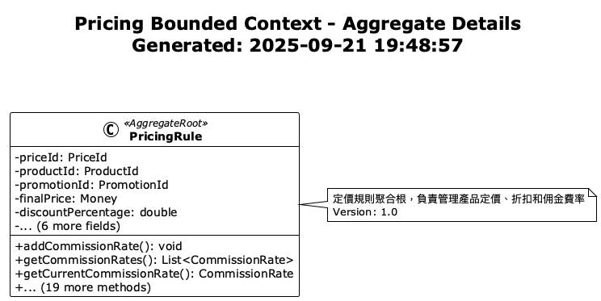
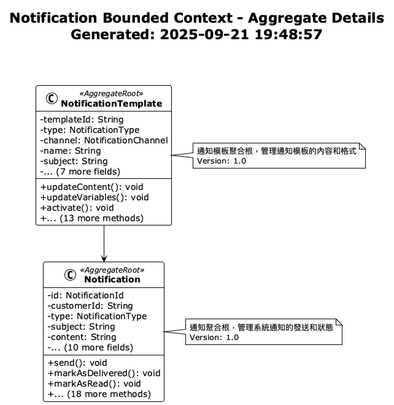

# Aggregate Root Design Guide

## Overview

This guide provides best practices and concrete examples for aggregate root design based on actual implementation experience with 15 aggregate roots in the project. The project adopts a hybrid implementation pattern, supporting two aggregate root implementation approaches and providing unified aggregate root management through annotation-driven design.

## Current Project Aggregate Root Overview

### Aggregate Root Distribution Statistics

| Bounded Context | Aggregate Count | Main Aggregates | Implementation Pattern | Version |
|-----------------|----------------|-----------------|----------------------|---------|
| Customer | 1 | Customer | Interface | 2.0 |
| Order | 1 | Order | Interface | 1.0 |
| Product | 1 | Product | Inheritance | 1.0 |
| Inventory | 1 | Inventory | Inheritance | 1.0 |
| Payment | 1 | Payment | Inheritance | 1.0 |
| Delivery | 1 | Delivery | Inheritance | 1.0 |
| Review | 1 | ProductReview | Interface | 2.0 |
| Seller | 1 | Seller | Interface | 2.0 |
| ShoppingCart | 1 | ShoppingCart | Inheritance | 1.0 |
| Promotion | 1 | Promotion | Inheritance | 1.0 |
| Pricing | 1 | PricingRule | Inheritance | 1.0 |
| Notification | 1 | Notification | Interface | 1.0 |
| Observability | 2 | ObservabilitySession, AnalyticsSession | Interface | 1.0 |

**Total**: 15 aggregate roots across 13 bounded contexts

## Aggregate Root Implementation Patterns

### Pattern Selection Guide

| Implementation Pattern | Use Case | Advantages | Disadvantages | Project Usage |
|----------------------|----------|------------|---------------|---------------|
| **Interface Pattern** | New aggregate roots | Zero override, type safety, automatic validation | Requires understanding interface design | 7 aggregate roots |
| **Inheritance Pattern** | Legacy system integration | Traditional OOP pattern, easy to understand | Requires method override | 8 aggregate roots |

### Pattern A: Interface Implementation Pattern (Recommended)

Based on the actual `Customer` aggregate root implementation in the project:

```java
@AggregateRoot(
    name = "Customer", 
    description = "Enhanced customer aggregate root with complete consumer functionality", 
    boundedContext = "Customer", 
    version = "2.0"
)
public class Customer implements AggregateRootInterface {
    
    private final CustomerId id;
    private final AggregateStateTracker<Customer> stateTracker = new AggregateStateTracker<>(this);
    private CustomerName name;
    private Email email;
    private Phone phone;
    private Address address;
    private MembershipLevel membershipLevel;
    private LocalDate birthDate;
    private LocalDateTime registrationDate;
    private RewardPoints rewardPoints;
    private CustomerStatus status;
    private Money totalSpending;
    
    // Entity collections
    private final List<DeliveryAddress> deliveryAddresses;
    private CustomerPreferences preferences;
    private final List<PaymentMethod> paymentMethods;
    
    // Main constructor
    public Customer(
            CustomerId id,
            CustomerName name,
            Email email,
            Phone phone,
            Address address,
            MembershipLevel membershipLevel,
            LocalDate birthDate,
            LocalDateTime registrationDate) {
        this.id = id;
        this.name = name;
        this.email = email;
        this.phone = phone;
        this.address = address;
        this.membershipLevel = membershipLevel;
        this.birthDate = birthDate;
        this.registrationDate = registrationDate != null ? registrationDate : LocalDateTime.now();
        this.rewardPoints = RewardPoints.empty();
        this.status = CustomerStatus.ACTIVE;
        this.totalSpending = Money.twd(0);
        this.deliveryAddresses = new ArrayList<>();
        this.preferences = new CustomerPreferences(CustomerPreferencesId.generate());
        this.paymentMethods = new ArrayList<>();

        // Publish customer created event
        collectEvent(CustomerCreatedEvent.create(id, name, email, membershipLevel));
    }
    
    // Business methods
    
    /** Update profile */
    public void updateProfile(CustomerName newName, Email newEmail, Phone newPhone) {
        // Validate business rules
        validateProfileUpdate(newName, newEmail, newPhone);

        // Check if there are any changes
        boolean hasChanges = !Objects.equals(this.name, newName) ||
                !Objects.equals(this.email, newEmail) ||
                !Objects.equals(this.phone, newPhone);

        if (hasChanges) {
            // Use state tracker to track changes (without generating events)
            stateTracker.trackChange("name", this.name, newName);
            stateTracker.trackChange("email", this.email, newEmail);
            stateTracker.trackChange("phone", this.phone, newPhone);

            // Update values
            this.name = newName;
            this.email = newEmail;
            this.phone = newPhone;

            // Generate single profile update event
            collectEvent(CustomerProfileUpdatedEvent.create(this.id, newName, newEmail, newPhone));
        }
    }
    
    /** Add delivery address */
    public DeliveryAddressId addDeliveryAddress(Address address, String label) {
        if (address == null) {
            throw new IllegalArgumentException("Address cannot be null");
        }
        if (deliveryAddresses.size() >= 10) {
            throw new IllegalArgumentException("Cannot have more than 10 delivery addresses");
        }

        // Check if same address already exists
        boolean addressExists = deliveryAddresses.stream()
                .anyMatch(da -> da.isSameAddress(address));
        if (addressExists) {
            throw new IllegalArgumentException("Address already exists");
        }

        DeliveryAddress deliveryAddress = new DeliveryAddress(
                DeliveryAddressId.generate(), address, label);

        // If first address, automatically set as default
        if (deliveryAddresses.isEmpty()) {
            deliveryAddress.setAsDefault();
        }

        deliveryAddresses.add(deliveryAddress);

        // Publish delivery address added event
        collectEvent(DeliveryAddressAddedEvent.create(this.id, address, deliveryAddresses.size()));

        return deliveryAddress.getId();
    }
    
    /** Upgrade membership level */
    public void upgradeMembershipLevel(MembershipLevel newLevel) {
        // Validate business rules
        validateMembershipUpgrade(newLevel);

        // Use state tracker to track changes and automatically generate events
        stateTracker.trackChange("membershipLevel", this.membershipLevel, newLevel,
                (oldValue, newValue) -> new MembershipLevelUpgradedEvent(this.id, oldValue, newValue));

        this.membershipLevel = newLevel;

        // Cross-aggregate operation: notify promotion system to update customer discount eligibility
        CrossAggregateOperation.publishEventIf(this,
                newLevel == MembershipLevel.VIP,
                () -> new CustomerVipUpgradedEvent(this.id, this.membershipLevel, newLevel));
    }
    
    /** Add reward points */
    public void addRewardPoints(int points, String reason) {
        this.rewardPoints = this.rewardPoints.add(points);

        // Publish reward points earned event
        collectEvent(RewardPointsEarnedEvent.create(this.id, points, this.rewardPoints.balance(), reason));
    }
    
    /** Redeem reward points */
    public void redeemPoints(int points, String reason) {
        this.rewardPoints = this.rewardPoints.redeem(points);

        // Publish reward points redeemed event
        collectEvent(RewardPointsRedeemedEvent.create(
                this.id, points, this.rewardPoints.balance(), reason));
    }
    
    // Query methods
    public boolean isVip() {
        return membershipLevel == MembershipLevel.VIP;
    }
    
    public boolean canRedeemPoints(int points) {
        return rewardPoints.getPoints() >= points && points > 0;
    }
    
    public Optional<DeliveryAddress> getPrimaryAddress() {
        return addresses.stream()
            .filter(DeliveryAddress::isPrimary)
            .findFirst();
    }
    
    // Private helper methods
    private void validateProfileUpdate(CustomerName name, Email email, Phone phone) {
        Objects.requireNonNull(name, "Customer name cannot be null");
        Objects.requireNonNull(email, "Email cannot be null");
        // phone can be null
    }
    
    private boolean canUpgradeTo(MembershipLevel newLevel) {
        return newLevel.ordinal() > membershipLevel.ordinal();
    }
    
    // Getters
    public CustomerId getId() { return id; }
    public CustomerName getName() { return name; }
    public Email getEmail() { return email; }
    public Phone getPhone() { return phone; }
    public MembershipLevel getMembershipLevel() { return membershipLevel; }
    public List<DeliveryAddress> getAddresses() { return List.copyOf(addresses); }
    public RewardPoints getRewardPoints() { return rewardPoints; }
}
```

### Pattern B: Base Class Inheritance Pattern

Based on the actual `Product` aggregate root implementation in the project:

```java
@AggregateRoot(
    name = "Product", 
    description = "Product aggregate root managing product information and inventory", 
    boundedContext = "Product", 
    version = "1.0"
)
public class Product extends solid.humank.genaidemo.domain.common.aggregate.AggregateRoot {
    
    private final ProductId id;
    private ProductName name;
    private ProductDescription description;
    private Money price;
    private final ProductCategory category;
    private StockQuantity stockQuantity;
    private boolean inStock;
    private boolean isActive;
    
    public Product(
            ProductId id,
            ProductName name,
            ProductDescription description,
            Money price,
            ProductCategory category,
            StockQuantity stockQuantity) {
        this.id = id;
        this.name = name;
        this.description = description;
        this.price = price;
        this.category = category;
        this.stockQuantity = stockQuantity;
        this.inStock = stockQuantity.getValue() > 0;
        this.isActive = true;

        // Publish product created event
        collectEvent(ProductCreatedEvent.create(id, name, price, category));
    }
    
    /** Update product price */
    public void updatePrice(Money newPrice) {
        if (newPrice == null) {
            throw new IllegalArgumentException("Product price cannot be null");
        }

        Money oldPrice = this.price;
        this.price = newPrice;

        // Publish product price changed event
        collectEvent(new ProductPriceChangedEvent(this.id, oldPrice, newPrice));
    }

    /** Update stock */
    public void updateStock(StockQuantity newStock) {
        if (newStock == null) {
            throw new IllegalArgumentException("Stock quantity cannot be null");
        }

        StockQuantity oldStock = this.stockQuantity;
        this.stockQuantity = newStock;
        this.inStock = newStock.getValue() > 0;

        // Publish product stock updated event
        collectEvent(new ProductStockUpdatedEvent(this.id, oldStock, newStock));
    }

    /** Discontinue product */
    public void discontinue(String reason) {
        if (!this.isActive) {
            throw new IllegalStateException("Product is already discontinued");
        }

        this.isActive = false;

        // Publish product discontinued event
        collectEvent(new ProductDiscontinuedEvent(this.id, reason));
    }

    /** Reactivate product */
    public void activate() {
        if (this.isActive) {
            throw new IllegalStateException("Product is already active");
        }

        this.isActive = true;

        // Publish product activated event
        collectEvent(ProductActivatedEvent.create(this.id));
    }
    
    private void validatePrice(Money price) {
        if (price.isNegativeOrZero()) {
            throw new IllegalArgumentException("Product price must be greater than 0");
        }
    }
    
    private void validateCanActivate() {
        if (name == null || description == null || price == null) {
            throw new IllegalStateException("Product information incomplete, cannot activate");
        }
    }
    
    // Getters
    public ProductId getId() { return id; }
    public ProductName getName() { return name; }
    public Money getPrice() { return price; }
    public ProductStatus getStatus() { return status; }
}
```

## Core Architecture Features

### 1. Annotation-Driven Design

All aggregate roots must use the `@AggregateRoot` annotation, providing unified metadata management:

```java
@AggregateRoot(
    name = "Aggregate Root Name",        // Required: Aggregate root identifier
    description = "Aggregate Description", // Required: Business description
    boundedContext = "Context Name",     // Required: Bounded context
    version = "Version Number",          // Required: Aggregate root version
    enableEventCollection = true        // Optional: Enable event collection (default true)
)
```

### 2. Zero Override Design

Interface pattern aggregate roots require no method overrides, all event management functionality is provided by `AggregateRootInterface` default methods:

```java
public interface AggregateRootInterface {
    // Automatic event collection
    default void collectEvent(DomainEvent event) { ... }
    
    // Automatic event management
    default List<DomainEvent> getUncommittedEvents() { ... }
    default void markEventsAsCommitted() { ... }
    default boolean hasUncommittedEvents() { ... }
    
    // Automatic metadata management
    default String getAggregateRootName() { ... }
    default String getBoundedContext() { ... }
    default String getVersion() { ... }
}
```

### 3. State Tracker (AggregateStateTracker)

The `Customer` aggregate root in the project uses an advanced state tracker pattern:

```java
public class Customer implements AggregateRootInterface {
    private final AggregateStateTracker<Customer> stateTracker = new AggregateStateTracker<>(this);
    
    public void upgradeMembershipLevel(MembershipLevel newLevel) {
        // Use state tracker to track changes and automatically generate events
        stateTracker.trackChange("membershipLevel", this.membershipLevel, newLevel,
                (oldValue, newValue) -> new MembershipLevelUpgradedEvent(this.id, oldValue, newValue));
        
        this.membershipLevel = newLevel;
    }
}
```

### 4. Cross-Aggregate Operations (CrossAggregateOperation)

Supports conditional cross-aggregate event publishing:

```java
// Cross-aggregate operation: notify promotion system to update customer discount eligibility
CrossAggregateOperation.publishEventIf(this,
        newLevel == MembershipLevel.VIP,
        () -> new CustomerVipUpgradedEvent(this.id, this.membershipLevel, newLevel));
```

### 5. Aggregate Reconstruction Support (AggregateReconstruction)

Supports rebuilding aggregate roots from persistent state without generating domain events:

```java
@AggregateReconstruction.ReconstructionConstructor("Rebuild customer aggregate root from persistent state")
protected Customer(CustomerId id, CustomerName name, ...) {
    // Reconstruction logic, no events published
}
```

## Aggregate Root Design Principles

### 1. Single Responsibility Principle

Each aggregate root should only be responsible for the integrity of one business concept:

```java
// ✅ Good design: ShoppingCart aggregate root only manages shopping cart related logic
@AggregateRoot(name = "ShoppingCart", description = "Shopping cart aggregate root managing consumer cart state and items", 
               boundedContext = "ShoppingCart", version = "1.0")
public class ShoppingCart extends AggregateRoot {
    
    public void addItem(ProductId productId, int quantity, Money unitPrice) {
        // Shopping cart item management logic
        if (quantity <= 0) {
            throw new InvalidQuantityException("Product quantity must be greater than 0");
        }
        
        Optional<CartItem> existingItem = findItemOptional(productId);
        if (existingItem.isPresent()) {
            CartItem updatedItem = existingItem.get().increaseQuantity(quantity);
            replaceItem(existingItem.get(), updatedItem);
        } else {
            CartItem newItem = new CartItem(productId, quantity, unitPrice);
            items.add(newItem);
        }
        
        collectEvent(CartItemAddedEvent.create(this.id, this.consumerId, productId, quantity, unitPrice));
    }
    
    public void checkout() {
        // Shopping cart checkout logic
        if (isEmpty()) {
            throw new IllegalStateException("Cannot checkout empty cart");
        }
        
        updateStatus(ShoppingCartStatus.CHECKED_OUT);
        collectEvent(CartCheckedOutEvent.create(this.id, this.consumerId, items, calculateTotal(), getTotalQuantity()));
    }
}

// ❌ Bad design: mixing multiple business concepts
public class OrderAndPaymentAndDelivery {
    // Managing order, payment, and delivery simultaneously - violates single responsibility
}
```

### 2. Consistency Boundaries

Aggregate roots define strong consistency boundaries, based on the actual `Customer` aggregate root implementation:

```java
@AggregateRoot(name = "Customer", description = "Enhanced customer aggregate root with complete consumer functionality", 
               boundedContext = "Customer", version = "2.0")
public class Customer implements AggregateRootInterface {
    
    private final List<DeliveryAddress> deliveryAddresses;
    private final List<PaymentMethod> paymentMethods;
    private RewardPoints rewardPoints;
    private Money totalSpending;
    
    public DeliveryAddressId addDeliveryAddress(Address address, String label) {
        // Business rule validation - maintain consistency
        if (deliveryAddresses.size() >= 10) {
            throw new IllegalArgumentException("Cannot have more than 10 delivery addresses");
        }
        
        boolean addressExists = deliveryAddresses.stream()
                .anyMatch(da -> da.isSameAddress(address));
        if (addressExists) {
            throw new IllegalArgumentException("Address already exists");
        }

        DeliveryAddress deliveryAddress = new DeliveryAddress(
                DeliveryAddressId.generate(), address, label);

        // If first address, automatically set as default - maintain consistency
        if (deliveryAddresses.isEmpty()) {
            deliveryAddress.setAsDefault();
        }

        deliveryAddresses.add(deliveryAddress);
        
        // Publish event
        collectEvent(DeliveryAddressAddedEvent.create(this.id, address, deliveryAddresses.size()));
        
        return deliveryAddress.getId();
    }
    
    public void updateSpending(Money amount, String orderId, String spendingType) {
        // Validate business rules
        validateSpendingUpdate(amount, orderId, spendingType);

        Money oldTotalSpending = this.totalSpending;
        this.totalSpending = this.totalSpending.add(amount);

        // Use state tracker to maintain consistency
        stateTracker.trackChange("totalSpending", oldTotalSpending, this.totalSpending,
                (oldValue, newValue) -> CustomerSpendingUpdatedEvent.create(
                        this.id, amount, newValue, orderId, spendingType));

        // Check membership upgrade eligibility - cross-property consistency
        checkMembershipUpgradeEligibility();
    }
}
```

### 3. Invariant Maintenance

Aggregate roots are responsible for maintaining business invariants, based on the actual `Product` aggregate root implementation:

```java
@AggregateRoot(name = "Product", description = "Product aggregate root managing product information and inventory", 
               boundedContext = "Product", version = "1.0")
public class Product extends AggregateRoot {
    
    private StockQuantity stockQuantity;
    private boolean inStock;
    private boolean isActive;
    
    public void updateStock(StockQuantity newStock) {
        // Business invariant: stock quantity cannot be null
        if (newStock == null) {
            throw new IllegalArgumentException("Stock quantity cannot be null");
        }

        StockQuantity oldStock = this.stockQuantity;
        this.stockQuantity = newStock;
        
        // Maintain invariant: stock status consistent with quantity
        this.inStock = newStock.getValue() > 0;

        // Publish product stock updated event
        collectEvent(new ProductStockUpdatedEvent(this.id, oldStock, newStock));
    }
    
    public void discontinue(String reason) {
        // Business invariant: only active products can be discontinued
        if (!this.isActive) {
            throw new IllegalStateException("Product is already discontinued");
        }

        this.isActive = false;

        // Publish product discontinued event
        collectEvent(new ProductDiscontinuedEvent(this.id, reason));
    }
    
    public boolean canBePurchased() {
        // Business invariant: purchasable = active + in stock
        return isActive && inStock;
    }
}
```

## Aggregate Root Lifecycle Management

### 1. Creation Phase

```java
public class Customer implements AggregateRootInterface {
    
    // Factory method
    public static Customer createNew(CustomerName name, Email email) {
        CustomerId id = CustomerId.generate();
        return new Customer(id, name, email, MembershipLevel.STANDARD);
    }
    
    // Reconstruction method (loading from persistence)
    public static Customer reconstruct(CustomerId id, CustomerName name, Email email, 
                                     MembershipLevel membershipLevel, List<DeliveryAddress> addresses) {
        Customer customer = new Customer(id, name, email, membershipLevel);
        customer.addresses.addAll(addresses);
        // No events published during reconstruction
        customer.markEventsAsCommitted();
        return customer;
    }
}
```

### 2. State Transitions

```java
public class Order implements AggregateRootInterface {
    
    private OrderStatus status;
    
    public void submit() {
        validateCanSubmit();
        
        OrderStatus oldStatus = this.status;
        this.status = OrderStatus.SUBMITTED;
        
        collectEvent(OrderSubmittedEvent.create(getId(), getCustomerId(), getTotalAmount(), getItemCount()));
    }
    
    public void confirm() {
        if (status != OrderStatus.SUBMITTED) {
            throw new IllegalStateException("Only submitted orders can be confirmed");
        }
        
        this.status = OrderStatus.CONFIRMED;
        
        collectEvent(OrderConfirmedEvent.create(getId(), getCustomerId(), status, getTotalAmount()));
    }
    
    public void cancel(String reason) {
        if (!canCancel()) {
            throw new IllegalStateException("Order cannot be cancelled");
        }
        
        this.status = OrderStatus.CANCELLED;
        
        collectEvent(OrderCancelledEvent.create(getId(), reason));
    }
    
    private boolean canCancel() {
        return status == OrderStatus.DRAFT || 
               status == OrderStatus.SUBMITTED || 
               status == OrderStatus.CONFIRMED;
    }
}
```

### 3. Aggregate Internal Entity Management

```java
public class Seller implements AggregateRootInterface {
    
    private final List<SellerRating> ratings;
    private SellerProfile profile;
    private ContactInfo contactInfo;
    
    public void addRating(CustomerId customerId, int rating, String comment) {
        // Business rule: same customer can only rate once
        if (hasRatingFromCustomer(customerId)) {
            throw new DuplicateRatingException("Customer has already rated this seller");
        }
        
        SellerRating newRating = new SellerRating(
            SellerRatingId.generate(),
            customerId,
            rating,
            comment
        );
        
        this.ratings.add(newRating);
        
        collectEvent(SellerRatingAddedEvent.create(getId(), newRating.getId(), rating));
    }
    
    public void updateContactInfo(String email, String phone) {
        this.contactInfo.updateContactInfo(email, phone);
        
        collectEvent(SellerContactInfoUpdatedEvent.create(getId(), email, phone));
    }
    
    public double calculateAverageRating() {
        return ratings.stream()
            .filter(SellerRating::isVisible)
            .mapToInt(SellerRating::getRating)
            .average()
            .orElse(0.0);
    }
    
    private boolean hasRatingFromCustomer(CustomerId customerId) {
        return ratings.stream()
            .anyMatch(rating -> rating.getCustomerId().equals(customerId) && rating.isVisible());
    }
}
```

## Inter-Aggregate Collaboration

### 1. Collaboration Through Domain Events

```java
// Order aggregate root publishes events
public class Order implements AggregateRootInterface {
    
    public void submit() {
        // ... state change logic
        
        // Publish event to trigger processing by other aggregate roots
        collectEvent(OrderSubmittedEvent.create(getId(), getCustomerId(), getItems()));
    }
}

// Event handler coordinates other aggregate roots
@Component
public class OrderSubmittedEventHandler extends AbstractDomainEventHandler<OrderSubmittedEvent> {
    
    @Override
    protected void handleEvent(OrderSubmittedEvent event) {
        // Reserve inventory
        inventoryService.reserveStock(event.orderId(), event.items());
        
        // Process payment
        paymentService.processPayment(event.orderId(), event.totalAmount());
        
        // Update customer statistics
        customerService.updateOrderStatistics(event.customerId());
    }
}
```

### 2. Collaboration Through Domain Services

```java
@DomainService(name = "OrderProcessingService", boundedContext = "Order")
public class OrderProcessingService {
    
    private final OrderRepository orderRepository;
    private final InventoryService inventoryService;
    private final PaymentService paymentService;
    
    @Transactional
    public void processOrder(OrderId orderId) {
        // Load order aggregate root
        Order order = orderRepository.findById(orderId)
            .orElseThrow(() -> new OrderNotFoundException(orderId));
        
        // Check inventory
        boolean stockAvailable = inventoryService.checkAvailability(order.getItems());
        if (!stockAvailable) {
            order.markAsOutOfStock();
            return;
        }
        
        // Reserve inventory
        inventoryService.reserveStock(orderId, order.getItems());
        
        // Confirm order
        order.confirm();
        
        // Save changes
        orderRepository.save(order);
    }
}
```

## Aggregate Root Testing Strategy

### 1. Unit Testing

```java
@ExtendWith(MockitoExtension.class)
class CustomerTest {
    
    @Test
    void should_collect_customer_created_event_when_customer_is_created() {
        // Given
        CustomerId customerId = CustomerId.generate();
        CustomerName name = new CustomerName("John Doe");
        Email email = new Email("john@example.com");
        
        // When
        Customer customer = new Customer(customerId, name, email, MembershipLevel.STANDARD);
        
        // Then
        assertThat(customer.hasUncommittedEvents()).isTrue();
        List<DomainEvent> events = customer.getUncommittedEvents();
        assertThat(events).hasSize(1);
        assertThat(events.get(0)).isInstanceOf(CustomerCreatedEvent.class);
    }
    
    @Test
    void should_upgrade_membership_when_conditions_are_met() {
        // Given
        Customer customer = createStandardCustomer();
        
        // When
        customer.upgradeMembership(MembershipLevel.PREMIUM);
        
        // Then
        assertThat(customer.getMembershipLevel()).isEqualTo(MembershipLevel.PREMIUM);
        assertThat(customer.getUncommittedEvents())
            .anyMatch(event -> event instanceof MembershipLevelUpgradedEvent);
    }
    
    @Test
    void should_throw_exception_when_upgrading_to_lower_level() {
        // Given
        Customer customer = createPremiumCustomer();
        
        // When & Then
        assertThatThrownBy(() -> customer.upgradeMembership(MembershipLevel.STANDARD))
            .isInstanceOf(InvalidMembershipUpgradeException.class);
    }
}
```

### 2. Integration Testing

```java
@SpringBootTest
@Transactional
class CustomerIntegrationTest {
    
    @Autowired
    private CustomerRepository customerRepository;
    
    @Autowired
    private DomainEventApplicationService domainEventService;
    
    @Test
    void should_persist_customer_and_publish_events() {
        // Given
        Customer customer = Customer.createNew(
            new CustomerName("John Doe"),
            new Email("john@example.com")
        );
        
        // When
        customerRepository.save(customer);
        domainEventService.publishEventsFromAggregate(customer);
        
        // Then
        Customer savedCustomer = customerRepository.findById(customer.getId()).orElseThrow();
        assertThat(savedCustomer.getName()).isEqualTo(customer.getName());
        assertThat(savedCustomer.hasUncommittedEvents()).isFalse();
    }
}
```

### 3. BDD Testing

```gherkin
Feature: Customer membership level management
  
  Scenario: Standard member upgrades to premium member
    Given a standard member customer
    When customer upgrades membership level to premium
    Then customer's membership level should be premium
    And membership level upgraded event should be published
  
  Scenario: Attempt to downgrade membership level
    Given a premium member customer
    When customer attempts to downgrade membership level to standard
    Then invalid upgrade exception should be thrown
    And customer's membership level should remain unchanged
```

## Performance Considerations

### 1. Aggregate Root Size Control

```java
// ✅ Good design: control aggregate root size
public class Order implements AggregateRootInterface {
    
    private static final int MAX_ITEMS = 100;
    private final List<OrderItem> items;
    
    public void addItem(ProductId productId, int quantity, Money unitPrice) {
        if (items.size() >= MAX_ITEMS) {
            throw new TooManyItemsException("Order cannot have more than " + MAX_ITEMS + " items");
        }
        
        // ... add logic
    }
}

// ❌ Bad design: unlimited aggregate root
public class Customer {
    private final List<Order> allOrders; // Could contain thousands of orders
}
```

### 2. Lazy Loading

```java
public class Seller implements AggregateRootInterface {
    
    // Avoid loading all ratings at once
    public List<SellerRating> getRecentRatings(int days) {
        LocalDateTime cutoff = LocalDateTime.now().minusDays(days);
        return ratings.stream()
            .filter(rating -> rating.getRatedAt().isAfter(cutoff))
            .filter(SellerRating::isVisible)
            .sorted((r1, r2) -> r2.getRatedAt().compareTo(r1.getRatedAt()))
            .limit(10) // Limit quantity
            .toList();
    }
}
```

## Related Diagrams

- 
- 
- 
- 
- 
- 
- 
- 
- 
- 
- 
- 
- 
- 

## Relationships with Other Viewpoints

- **[Information Viewpoint](../information/README.md)**: Domain event design and inter-aggregate communication
- **[Concurrency Viewpoint](../concurrency/README.md)**: Aggregate root transaction boundaries and concurrency control
- **[Development Viewpoint](../development/README.md)**: Aggregate root testing strategies and code organization

## Best Practices Summary

1. **Clear Boundaries**: Each aggregate root has clear business boundaries and responsibilities
2. **Keep Small**: Control aggregate root size to avoid performance issues
3. **Strong Consistency**: Maintain strong consistency within aggregate roots
4. **Event-Driven**: Achieve inter-aggregate collaboration through domain events
5. **Invariant Maintenance**: Ensure business rules and invariants are maintained
6. **Test Coverage**: Complete unit and integration testing
7. **Version Management**: Support aggregate root structure evolution
8. **Performance Optimization**: Consider loading strategies and query optimization

This aggregate root design guide ensures domain model correctness, maintainability, and high performance.
