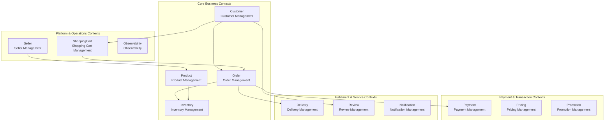
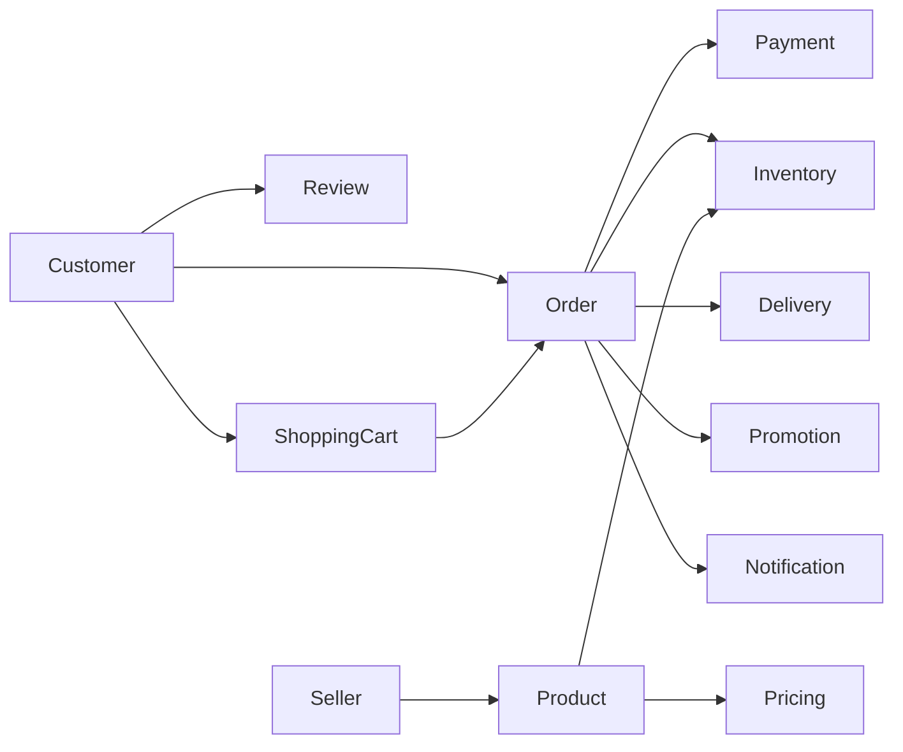
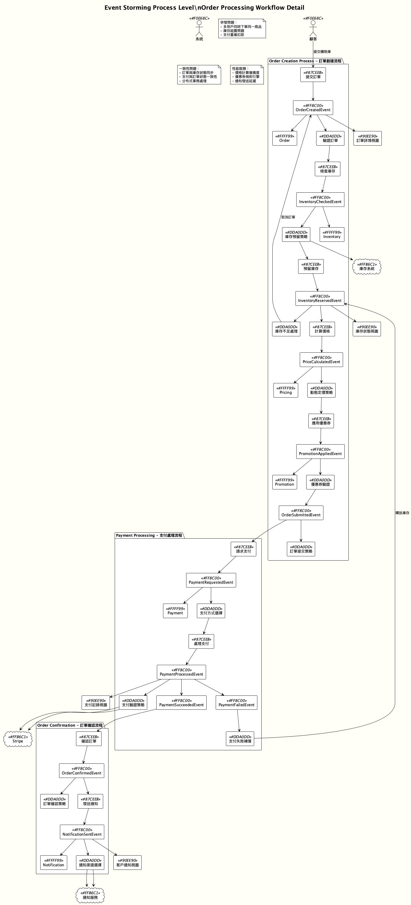

# Bounded Context Design

## Overview

This project implements 13 bounded contexts, each with clear business boundaries and responsibility divisions. The bounded context design follows DDD strategic patterns, ensuring high cohesion and low coupling in the domain model.

## Bounded Context Architecture Diagram

## Detailed Bounded Context Descriptions

### 1. Customer Context

**Responsibility**: Manage customer lifecycle, membership levels, personal profiles, and preference settings

**Aggregate Roots**: 
- `Customer` (v2.0) - Enhanced customer aggregate root supporting complete consumer functionality

**Core Entities**:
- `DeliveryAddress` - Delivery addresses
- `PaymentMethod` - Payment method configurations
- `CustomerPreferences` - Customer preference settings

**Main Business Capabilities**:
- Customer registration and authentication
- Membership level management (STANDARD, PREMIUM, VIP)
- Personal profile maintenance
- Delivery address management
- Notification preference settings
- Reward points accumulation and redemption

**Domain Services**:
- `RewardPointsService` - Reward points service
- `CustomerDiscountService` - Customer discount service

### 2. Order Context

**Responsibility**: Manage order lifecycle, order processing workflows, and workflow states

**Aggregate Roots**:
- `Order` (v1.0) - Order aggregate root encapsulating order-related business rules and behaviors
- `OrderWorkflow` (v1.0) - Order workflow aggregate root managing the complete lifecycle from creation to completion

**Core Entities**:
- `OrderItem` - Order items
- `OrderStatus` - Order status
- `WorkflowStep` - Workflow steps

**Main Business Capabilities**:
- Order creation and confirmation
- Order item management
- Order status tracking
- Workflow process control
- Order cancellation and refunds

### 3. Product Context

**Responsibility**: Manage product information, product categories, and product lifecycle

**Aggregate Roots**:
- `Product` (v1.0) - Product aggregate root managing product information and inventory

**Core Entities**:
- `ProductCategory` - Product categories
- `ProductSpecification` - Product specifications
- `ProductImage` - Product images

**Main Business Capabilities**:
- Product information management
- Product category maintenance
- Product listing/delisting control
- Product specification management
- Product image management

**Domain Services**:
- `BundleService` - Bundle sales service

### 4. Inventory Context

**Responsibility**: Manage product inventory, inventory reservations, and inventory adjustments

**Aggregate Roots**:
- `Inventory` (v1.0) - Inventory aggregate root managing product inventory and reservations

**Core Entities**:
- `StockReservation` - Inventory reservations
- `StockMovement` - Inventory movement records

**Main Business Capabilities**:
- Inventory quantity management
- Inventory reservation and release
- Inventory adjustment recording
- Safety stock monitoring

**Domain Services**:
- `InventoryService` - Inventory service interface
- `InventoryDomainService` - Inventory domain service

### 5. Payment Context

**Responsibility**: Manage payment processes, payment methods, and payment status

**Aggregate Roots**:
- `Payment` (v1.0) - Payment aggregate root managing payment processes and status
- `PaymentMethod` (v1.0) - Payment method aggregate root managing customer payment method configurations

**Core Entities**:
- `PaymentTransaction` - Payment transactions
- `PaymentStatus` - Payment status
- `RefundRecord` - Refund records

**Main Business Capabilities**:
- Payment processing workflows
- Multiple payment method support
- Payment status tracking
- Refund processing
- Payment security verification

**Domain Services**:
- `PaymentDomainService` - Payment domain service

### 6. Delivery Context

**Responsibility**: Manage delivery processes, delivery status, and delivery tracking

**Aggregate Roots**:
- `Delivery` (v1.0) - Delivery aggregate root managing order delivery processes and status

**Core Entities**:
- `DeliveryRoute` - Delivery routes
- `DeliveryStatus` - Delivery status
- `TrackingInfo` - Tracking information

**Main Business Capabilities**:
- Delivery task creation
- Delivery status tracking
- Delivery route planning
- Delivery completion confirmation

**Domain Services**:
- `DeliveryManagementService` - Delivery management service

### 7. Review Context

**Responsibility**: Manage product reviews, review moderation, and review display

**Aggregate Roots**:
- `ProductReview` (v2.0) - Product review aggregate root managing consumer product reviews and ratings

**Core Entities**:
- `ReviewImage` - Review images
- `ModerationRecord` - Moderation records
- `ReviewRating` - Review ratings

**Main Business Capabilities**:
- Product review creation
- Review content moderation
- Review image management
- Review statistics analysis

**Domain Services**:
- `ReviewModerationService` - Review moderation domain service

### 8. Seller Context

**Responsibility**: Manage seller information, seller verification, and seller ratings

**Aggregate Roots**:
- `Seller` (v2.0) - Seller aggregate root managing seller basic information and status

**Core Entities**:
- `SellerProfile` - Seller profiles
- `SellerRating` - Seller ratings
- `SellerVerification` - Seller verification
- `ContactInfo` - Contact information

**Main Business Capabilities**:
- Seller registration and verification
- Seller profile management
- Seller rating system
- Seller status management

**Domain Services**:
- `SellerDomainService` - Seller domain service

### 9. ShoppingCart Context

**Responsibility**: Manage shopping cart state, cart items, and cart operations

**Aggregate Roots**:
- `ShoppingCart` (v1.0) - Shopping cart aggregate root managing consumer cart state and product items

**Core Entities**:
- `CartItem` - Shopping cart items
- `CartStatus` - Shopping cart status

**Main Business Capabilities**:
- Shopping cart item management
- Shopping cart state maintenance
- Shopping cart checkout processing
- Shopping cart persistence

**Domain Services**:
- `ShoppingCartDomainService` - Shopping cart domain service

### 10. Promotion Context

**Responsibility**: Manage promotional activities, coupons, and promotion rules

**Aggregate Roots**:
- `Promotion` (v1.0) - Promotion aggregate root managing various promotional activity rules
- `Voucher` (v1.0) - Convenience store voucher aggregate root managing complete voucher lifecycle

**Core Entities**:
- `PromotionRule` - Promotion rules
- `VoucherCode` - Voucher codes
- `DiscountCalculation` - Discount calculations

**Main Business Capabilities**:
- Promotional activity management
- Coupon distribution and usage
- Discount rule calculations
- Promotion effectiveness tracking

### 11. Pricing Context

**Responsibility**: Manage product pricing, discount rules, and commission calculations

**Aggregate Roots**:
- `PricingRule` (v1.0) - Pricing rule aggregate root responsible for managing product pricing, discounts, and commission rates

**Core Entities**:
- `PriceRule` - Price rules
- `DiscountRule` - Discount rules
- `CommissionRate` - Commission rates

**Main Business Capabilities**:
- Dynamic pricing management
- Discount rule configuration
- Commission rate calculations
- Pricing strategy execution

**Domain Services**:
- `CommissionService` - Commission service

### 12. Notification Context

**Responsibility**: Manage system notifications, notification templates, and notification delivery

**Aggregate Roots**:
- `Notification` (v1.0) - Notification aggregate root managing system notification delivery and status
- `NotificationTemplate` (v1.0) - Notification template aggregate root managing notification template content and format

**Core Entities**:
- `NotificationChannel` - Notification channels
- `NotificationStatus` - Notification status
- `TemplateVariable` - Template variables

**Main Business Capabilities**:
- Multi-channel notification delivery
- Notification template management
- Notification status tracking
- Notification preference settings

**Domain Services**:
- `NotificationService` - Notification service

### 13. Observability Context

**Responsibility**: Manage system monitoring, analytics data, and observability sessions

**Aggregate Roots**:
- `ObservabilitySession` (v1.0) - Observability session aggregate root
- `AnalyticsSession` (v1.0) - Analytics session aggregate root

**Core Entities**:
- `MetricData` - Metric data
- `TraceInfo` - Trace information
- `LogEntry` - Log entries

**Main Business Capabilities**:
- System monitoring data collection
- Business analytics data processing
- Observability session management
- Performance metric tracking

## Inter-Context Relationships

### Core Dependencies

### Event-Driven Communication

Bounded contexts communicate asynchronously through domain events:

- **Customer Context** publishes customer-related events (CustomerCreated, CustomerProfileUpdated, etc.)
- **Order Context** publishes order-related events (OrderCreated, OrderConfirmed, etc.)
- **Payment Context** publishes payment-related events (PaymentProcessed, PaymentFailed, etc.)
- **Inventory Context** publishes inventory-related events (StockReserved, StockAdded, etc.)

## Context Evolution Strategy

### Version Management

- **v1.0**: Basic functionality implementation
- **v2.0**: Enhanced features and optimization (Customer, ProductReview, Seller)

### Future Evolution Directions

1. **Microservices Decomposition**: Each bounded context can be independently deployed as microservices
2. **Event Sourcing**: Critical contexts (Order, Payment) can introduce event sourcing
3. **CQRS**: Read-write separation to optimize query performance
4. **New Contexts**: Add new bounded contexts based on business development needs

## Related Diagrams

-  - **New**: Comprehensive bounded contexts concept diagram showing all 13 contexts with their relationships, responsibilities, and domain events
- 
- 
- 
-  - **Recently Updated**: Comprehensive e-commerce core processes including customer shopping journey, order processing workflow, coupon management, inventory management, and customer notifications
- 

## Relationships with Other Viewpoints

- **[Information Viewpoint](../information/README.md)**: Inter-context event communication and data flows
- **[Development Viewpoint](../development/README.md)**: Modular architecture and code organization
- **[Deployment Viewpoint](../deployment/README.md)**: Microservices deployment strategies

## Design Principles

1. **High Cohesion**: Functions within each context are closely related
2. **Low Coupling**: Contexts communicate through events and interfaces
3. **Business-Oriented**: Context division based on business capabilities rather than technical considerations
4. **Evolution-Friendly**: Supports independent evolution and version management
5. **Test Isolation**: Each context can be independently tested and verified

This bounded context design ensures system maintainability, scalability, and business alignment.