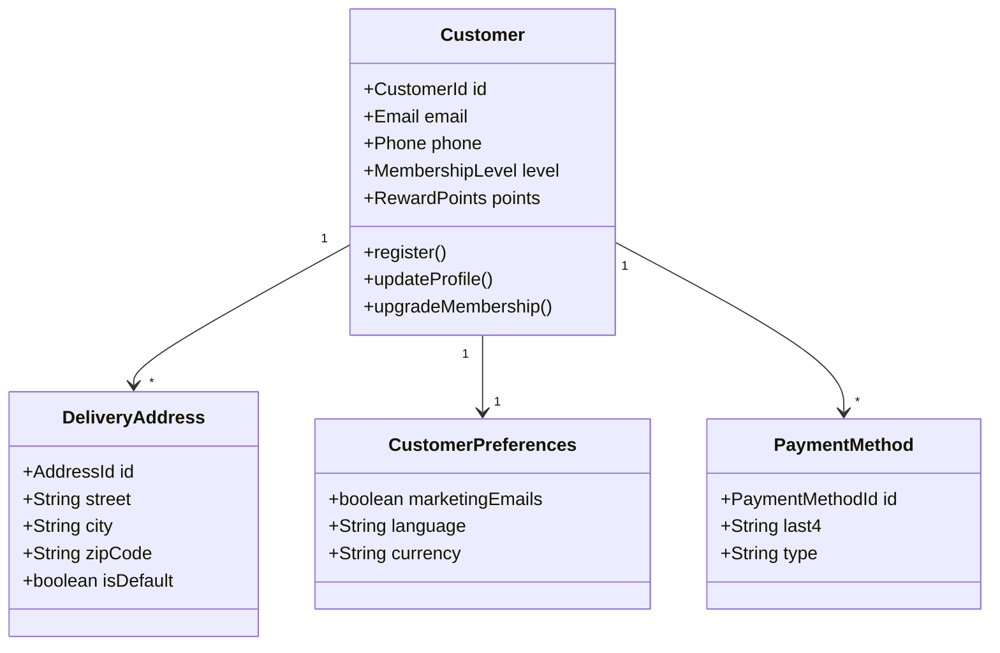
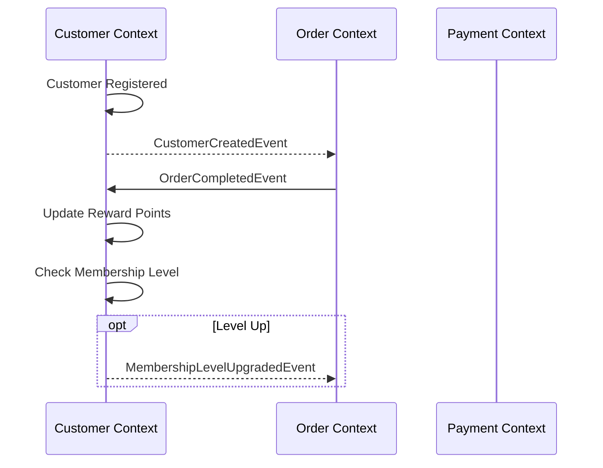

# Customer Context

> **Responsibility**: Manage customer lifecycle, profiles, preferences, and membership

## Overview

The Customer Context is responsible for managing all customer-related information, including profiles, preferences, delivery addresses, and membership status. It serves as the central source of truth for customer identity within the platform.

## Domain Model

**Core Aggregate**: `Customer`

**Key Entities**:
- `Customer` (Aggregate Root)
- `CustomerPreferences`
- `DeliveryAddress`
- `PaymentMethod`

**Key Value Objects**:
- `CustomerId`
- `CustomerName`
- `Email`
- `Phone`
- `Address`
- `MembershipLevel` (STANDARD, SILVER, GOLD, PLATINUM)
- `CustomerStatus` (ACTIVE, INACTIVE, SUSPENDED)
- `RewardPoints`
- `NotificationPreferences`

### Domain Model Diagram

## Events

### Event Flow

**Domain Events Published**:
- `CustomerCreatedEvent`
- `CustomerProfileUpdatedEvent`
- `CustomerStatusChangedEvent`
- `MembershipLevelUpgradedEvent`
- `CustomerVipUpgradedEvent`
- `DeliveryAddressAddedEvent`
- `DeliveryAddressRemovedEvent`
- `NotificationPreferencesUpdatedEvent`
- `RewardPointsEarnedEvent`
- `RewardPointsRedeemedEvent`
- `CustomerSpendingUpdatedEvent`

**Domain Events Consumed**:
- `OrderCompletedEvent` (from Order Context) → Update spending, reward points
- `PaymentCompletedEvent` (from Payment Context) → Update customer statistics

## API Interface

**REST API Endpoints**:
- `POST /api/v1/customers` - Register new customer
- `GET /api/v1/customers/{id}` - Get customer details
- `PUT /api/v1/customers/{id}` - Update customer profile
- `POST /api/v1/customers/{id}/addresses` - Add delivery address
- `PUT /api/v1/customers/{id}/preferences` - Update preferences
- `GET /api/v1/customers/{id}/reward-points` - Get reward points balance

## Business Rules

- Email must be unique across all customers
- Membership level upgrades based on spending thresholds
- Reward points earned: 1 point per $10 spent
- VIP status requires PLATINUM membership + $10,000 annual spending
