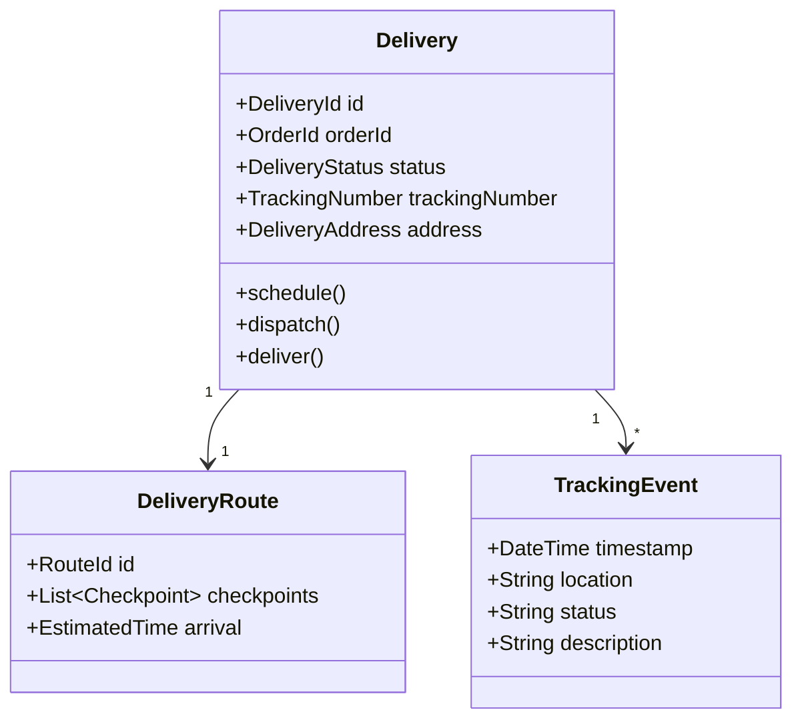
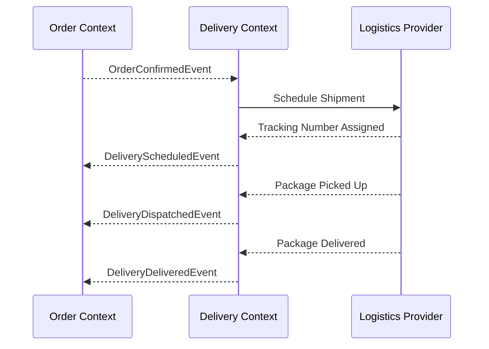

# Delivery Context

> **Responsibility**: Manage order delivery and logistics

## Overview

The Delivery Context manages the logistics of getting orders to customers. It handles shipping schedules, tracking, and delivery status updates. It integrates with external logistics providers.

## Domain Model

**Core Aggregate**: `Delivery`

**Key Entities**:
- `Delivery` (Aggregate Root)
- `DeliveryRoute`
- `TrackingEvent`

**Key Value Objects**:
- `DeliveryId`
- `OrderId`
- `TrackingNumber`
- `DeliveryStatus` (SCHEDULED, IN_TRANSIT, OUT_FOR_DELIVERY, DELIVERED, FAILED)
- `DeliveryAddress`
- `EstimatedDeliveryDate`

### Domain Model Diagram

## Events

### Event Flow

**Domain Events Published**:
- `DeliveryScheduledEvent`
- `DeliveryDispatchedEvent`
- `DeliveryInTransitEvent`
- `DeliveryDeliveredEvent`
- `DeliveryFailedEvent`

**Domain Events Consumed**:
- `OrderConfirmedEvent` (from Order Context) → Schedule delivery
- `PaymentCompletedEvent` (from Payment Context) → Confirm delivery

## API Interface

**REST API Endpoints**:
- `GET /api/v1/deliveries/{orderId}` - Get delivery status
- `GET /api/v1/deliveries/track/{trackingNumber}` - Track delivery
- `POST /api/v1/deliveries/{id}/update-status` - Update status (logistics)

## Business Rules

- Delivery can only be scheduled for confirmed orders
- Tracking number must be unique
- Estimated delivery: 3-5 business days for standard shipping
- Failed deliveries trigger customer notification
