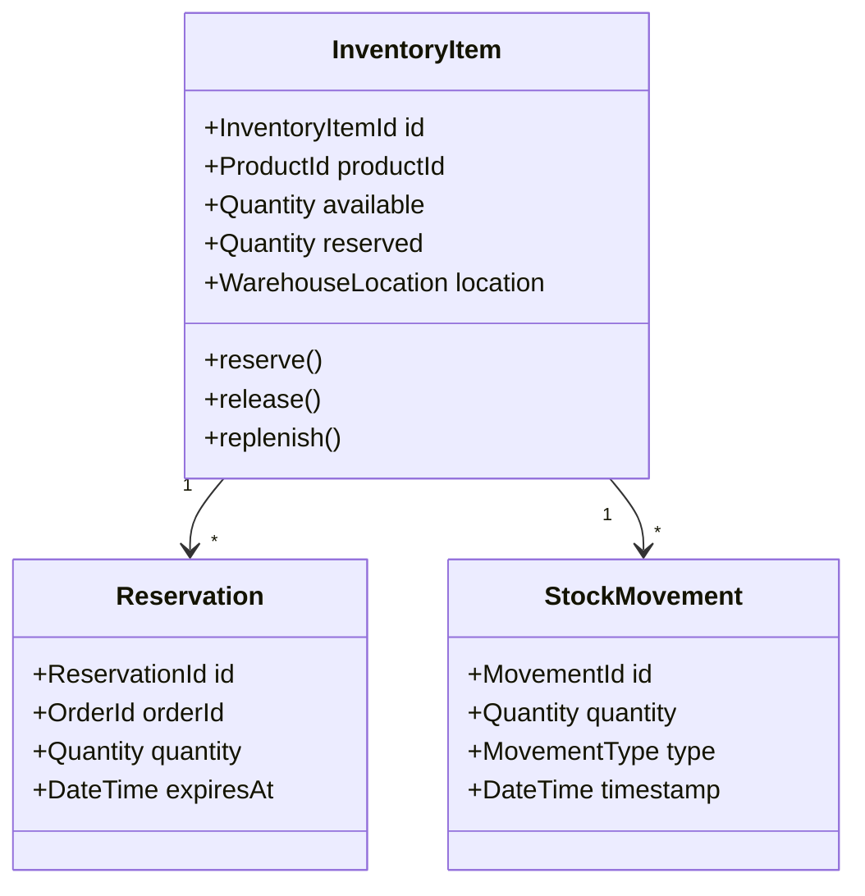
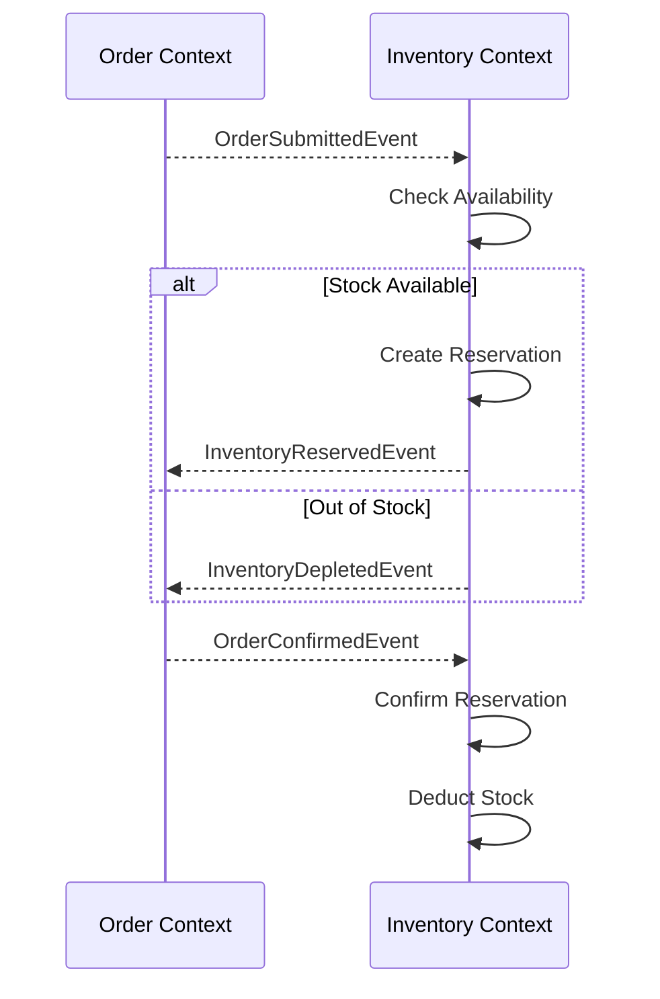

# Inventory Context

> **Responsibility**: Manage product stock levels and inventory operations

## Overview

The Inventory Context tracks the physical stock of products. It manages reservations during the ordering process and handles stock replenishment. It ensures that the platform does not sell more items than are available.

## Domain Model

**Core Aggregate**: `InventoryItem`

**Key Entities**:
- `InventoryItem` (Aggregate Root)
- `StockMovement`
- `Reservation`

**Key Value Objects**:
- `InventoryItemId`
- `ProductId`
- `Quantity`
- `ReservationId`
- `WarehouseLocation`

### Domain Model Diagram

## Events

### Event Flow

**Domain Events Published**:
- `InventoryReservedEvent`
- `InventoryReleasedEvent`
- `InventoryReplenishedEvent`
- `InventoryDepletedEvent`
- `StockLevelChangedEvent`

**Domain Events Consumed**:
- `OrderSubmittedEvent` (from Order Context) → Reserve inventory
- `OrderCancelledEvent` (from Order Context) → Release reservation
- `OrderDeliveredEvent` (from Order Context) → Commit reservation

## API Interface

**REST API Endpoints**:
- `GET /api/v1/inventory/{productId}` - Get stock level
- `POST /api/v1/inventory/{productId}/replenish` - Add stock (admin)
- `GET /api/v1/inventory/low-stock` - List low stock items (admin)

## Business Rules

- Stock level cannot be negative
- Reservations expire after 15 minutes if order not confirmed
- Low stock alert when quantity < 10
- Automatic reorder when quantity < 5
