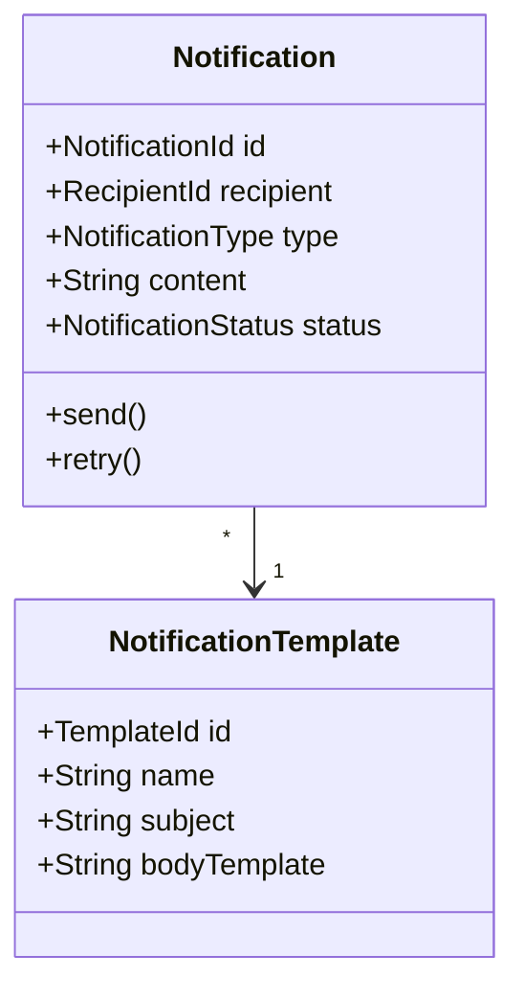
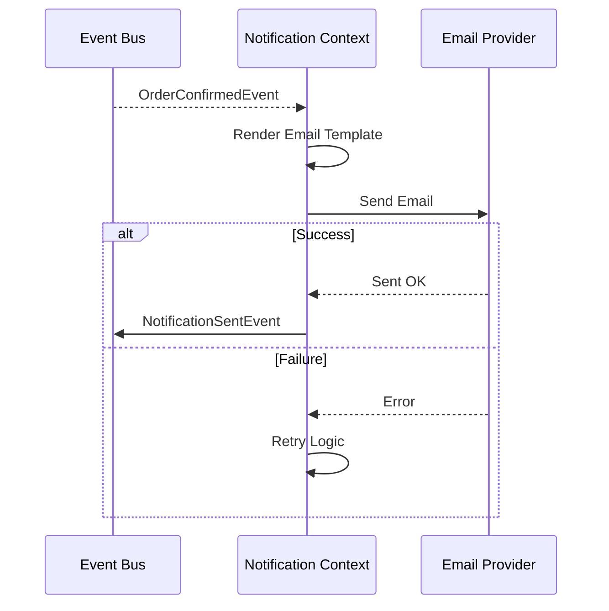

# Notification Context

> **Responsibility**: Send notifications to customers via multiple channels

## Overview

The Notification Context is a centralized service for sending messages to users. It supports various channels like email, SMS, and push notifications. It manages templates and delivery status.

## Domain Model

**Core Aggregate**: `Notification`

**Key Entities**:
- `Notification` (Aggregate Root)
- `NotificationTemplate`

**Key Value Objects**:
- `NotificationId`
- `NotificationType` (EMAIL, SMS, PUSH)
- `NotificationStatus` (PENDING, SENT, FAILED)
- `RecipientId`

### Domain Model Diagram

## Events

### Event Flow

**Domain Events Published**:
- `NotificationSentEvent`
- `NotificationFailedEvent`

**Domain Events Consumed**:
- `CustomerCreatedEvent` → Send welcome email
- `OrderConfirmedEvent` → Send order confirmation
- `OrderShippedEvent` → Send shipping notification
- `PaymentCompletedEvent` → Send payment receipt
- `DeliveryDeliveredEvent` → Send delivery confirmation

## API Interface

**REST API Endpoints**:
- `GET /api/v1/notifications/{customerId}` - Get customer notifications
- `POST /api/v1/notifications/send` - Send notification (internal)

## Business Rules

- Respect customer notification preferences
- Failed notifications retry up to 3 times
- Email notifications include unsubscribe link
- Critical notifications (payment, security) cannot be disabled
