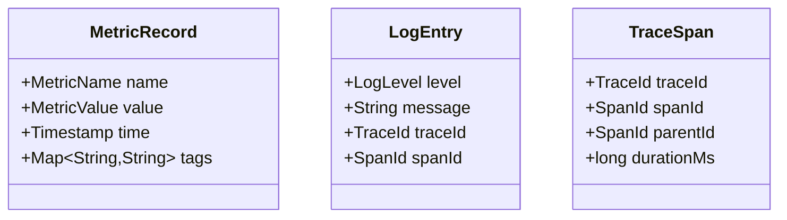
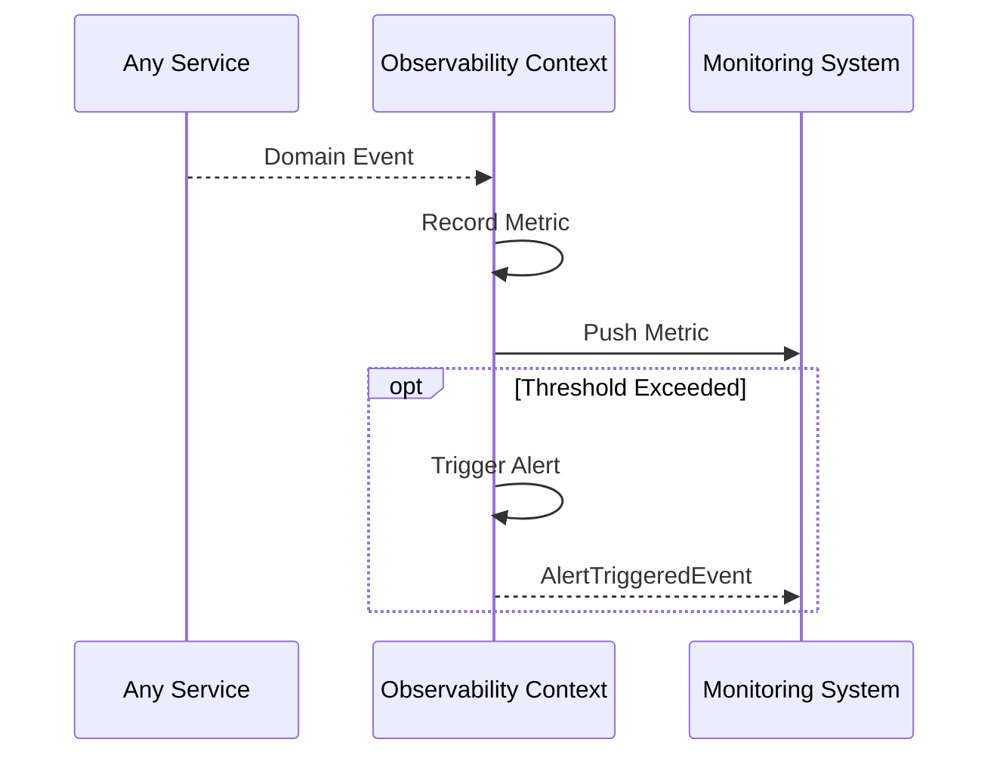

# Observability Context (Cross-Cutting)

> **Responsibility**: Collect and aggregate system metrics, logs, and traces

## Overview

The Observability Context is a cross-cutting concern that collects telemetry data from all other contexts. It provides visibility into system health, performance, and behavior.

## Domain Model

**Core Aggregate**: `MetricRecord`

**Key Entities**:
- `MetricRecord` (Aggregate Root)
- `LogEntry`
- `TraceSpan`

**Key Value Objects**:
- `MetricName`
- `MetricValue`
- `Timestamp`
- `TraceId`
- `SpanId`

### Domain Model Diagram

## Events

### Event Flow

**Domain Events Published**:
- `MetricRecordedEvent`
- `AlertTriggeredEvent`

**Domain Events Consumed**:
- All domain events from all contexts → Record metrics

## API Interface

**REST API Endpoints**:
- `GET /api/v1/metrics` - Get system metrics (admin)
- `GET /api/v1/health` - Health check endpoint

## Business Rules

- Metrics retained for 90 days
- Logs retained for 30 days
- Traces retained for 7 days
- Alerts triggered based on threshold rules
