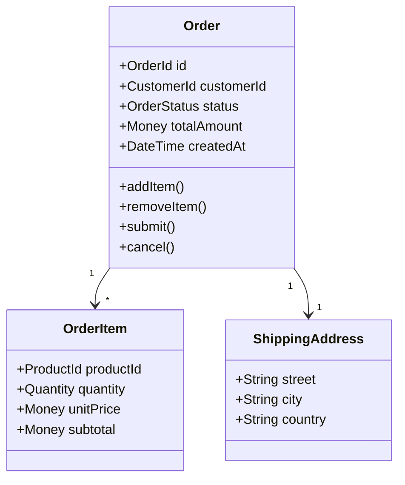
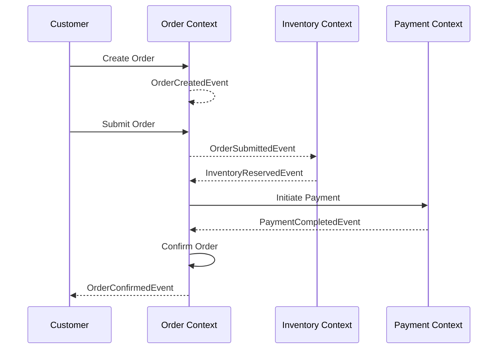

# Order Context

> **Responsibility**: Manage order lifecycle from creation to completion

## Overview

The Order Context handles the entire lifecycle of an order, from placement to fulfillment and completion. It orchestrates interactions with Inventory, Payment, and Delivery contexts to ensure orders are processed correctly.

## Domain Model

**Core Aggregate**: `Order`

**Key Entities**:
- `Order` (Aggregate Root)
- `OrderItem`
- `OrderHistory`

**Key Value Objects**:
- `OrderId`
- `OrderStatus` (CREATED, PENDING, CONFIRMED, SHIPPED, DELIVERED, CANCELLED)
- `OrderItem`
- `ShippingAddress`
- `Money`
- `Quantity`

### Domain Model Diagram

## Events

### Event Flow

**Domain Events Published**:
- `OrderCreatedEvent`
- `OrderSubmittedEvent`
- `OrderConfirmedEvent`
- `OrderCancelledEvent`
- `OrderShippedEvent`
- `OrderDeliveredEvent`
- `OrderCompletedEvent`
- `OrderItemAddedEvent`
- `OrderItemRemovedEvent`

**Domain Events Consumed**:
- `InventoryReservedEvent` (from Inventory Context) → Confirm order
- `PaymentCompletedEvent` (from Payment Context) → Proceed with fulfillment
- `PaymentFailedEvent` (from Payment Context) → Cancel order
- `DeliveryScheduledEvent` (from Delivery Context) → Update order status

## API Interface

**REST API Endpoints**:
- `POST /api/v1/orders` - Create new order
- `GET /api/v1/orders/{id}` - Get order details
- `POST /api/v1/orders/{id}/submit` - Submit order for processing
- `POST /api/v1/orders/{id}/cancel` - Cancel order
- `GET /api/v1/orders?customerId={id}` - List customer orders
- `GET /api/v1/orders/{id}/history` - Get order history

## Business Rules

- Order must have at least one item
- Order can only be cancelled if status is CREATED or PENDING
- Total amount must match sum of item prices plus shipping
- Order confirmation requires successful inventory reservation and payment
