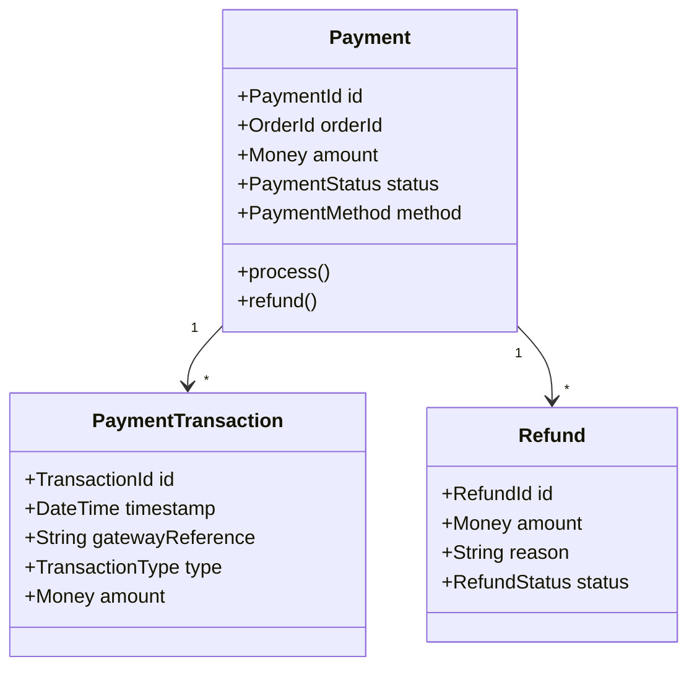
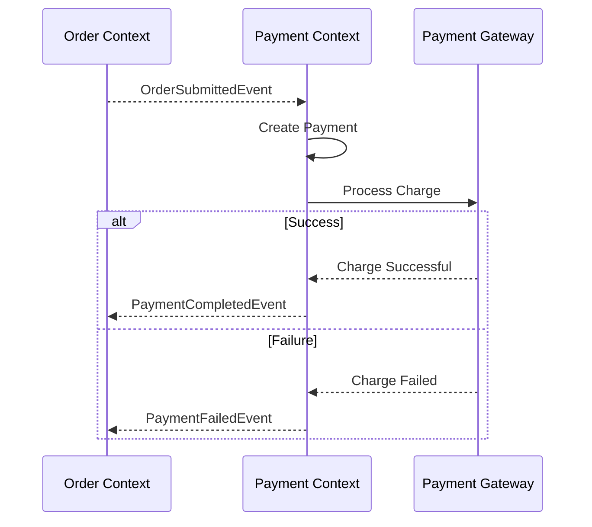

# Payment Context

> **Responsibility**: Process payments and manage payment transactions

## Overview

The Payment Context handles all financial transactions. It integrates with external payment gateways, manages payment status, and handles refunds. It ensures secure and reliable processing of customer payments.

## Domain Model

**Core Aggregate**: `Payment`

**Key Entities**:
- `Payment` (Aggregate Root)
- `PaymentTransaction`
- `Refund`

**Key Value Objects**:
- `PaymentId`
- `OrderId`
- `Money`
- `PaymentMethod` (CREDIT_CARD, DEBIT_CARD, PAYPAL, BANK_TRANSFER)
- `PaymentStatus` (PENDING, COMPLETED, FAILED, REFUNDED)
- `TransactionId`

### Domain Model Diagram

## Events

### Event Flow

**Domain Events Published**:
- `PaymentInitiatedEvent`
- `PaymentCompletedEvent`
- `PaymentFailedEvent`
- `RefundProcessedEvent`

**Domain Events Consumed**:
- `OrderSubmittedEvent` (from Order Context) → Initiate payment
- `OrderCancelledEvent` (from Order Context) → Process refund

## API Interface

**REST API Endpoints**:
- `POST /api/v1/payments` - Initiate payment
- `GET /api/v1/payments/{id}` - Get payment status
- `POST /api/v1/payments/{id}/refund` - Process refund (admin)

## Business Rules

- Payment amount must match order total
- Failed payments trigger automatic retry (max 3 attempts)
- Refunds can only be processed for completed payments
- Partial refunds allowed for order cancellations
