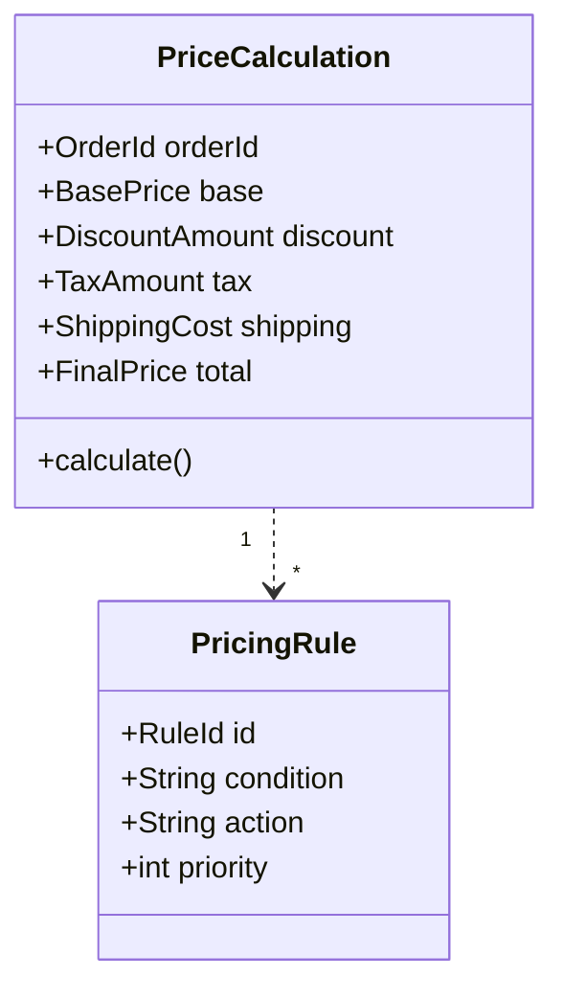
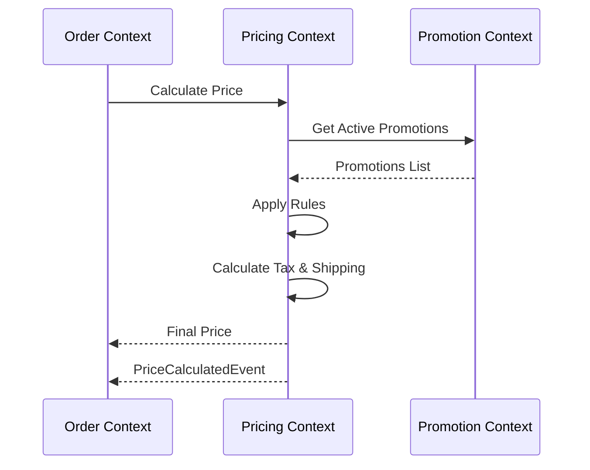

# Pricing Context

> **Responsibility**: Calculate prices with discounts, taxes, and shipping

## Overview

The Pricing Context is responsible for all price calculations. It applies pricing rules, discounts, taxes, and shipping costs to determine the final amount for an order.

## Domain Model

**Core Aggregate**: `PriceCalculation`

**Key Entities**:
- `PriceCalculation` (Aggregate Root)
- `PricingRule`

**Key Value Objects**:
- `BasePrice`
- `DiscountAmount`
- `TaxAmount`
- `ShippingCost`
- `FinalPrice`
- `PricingStrategy`

### Domain Model Diagram

## Events

### Event Flow

**Domain Events Published**:
- `PriceCalculatedEvent`
- `PricingRuleAppliedEvent`

**Domain Events Consumed**:
- `PromotionActivatedEvent` (from Promotion Context) → Update pricing rules
- `OrderSubmittedEvent` (from Order Context) → Calculate final price

## API Interface

**REST API Endpoints**:
- `POST /api/v1/pricing/calculate` - Calculate price for order
- `GET /api/v1/pricing/shipping-cost` - Get shipping cost estimate

## Business Rules

- Tax rate varies by delivery location
- Free shipping for orders > $100
- Volume discounts for bulk purchases
- Member discounts based on membership level
