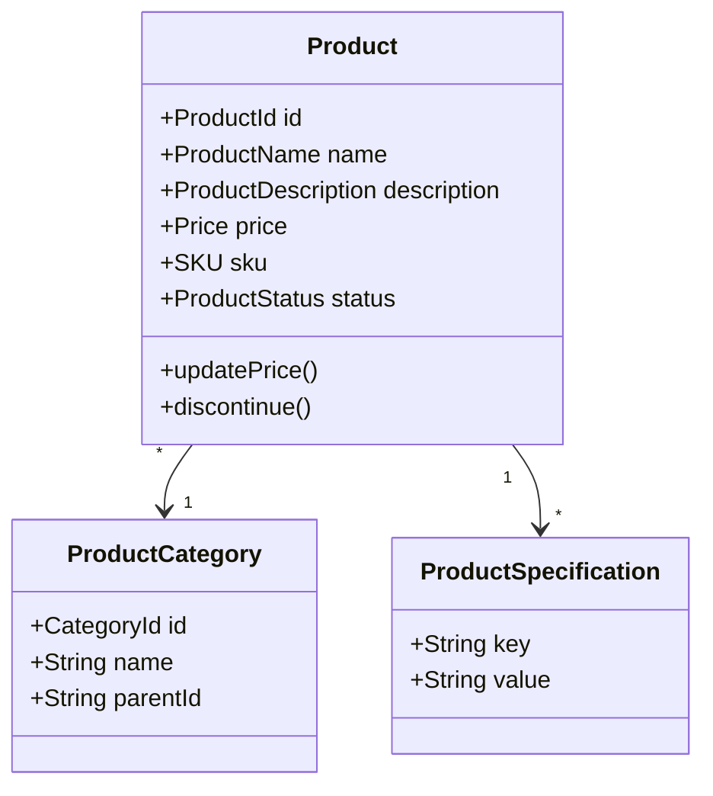
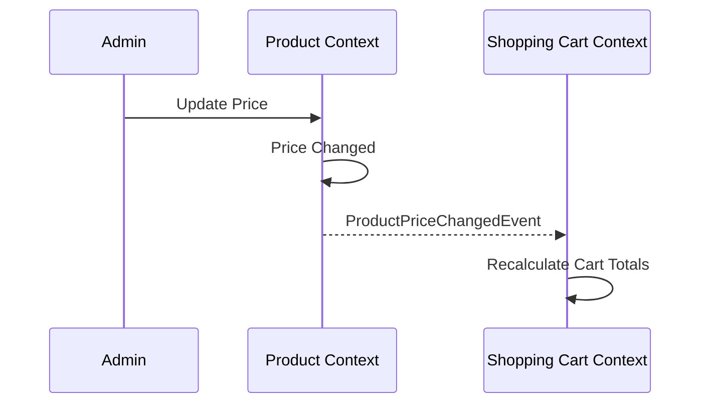

# Product Context

> **Responsibility**: Manage product catalog, categories, and product information

## Overview

The Product Context manages the catalog of items available for sale. It handles product details, categorization, specifications, and status. It serves as the source of product information for the entire platform.

## Domain Model

**Core Aggregate**: `Product`

**Key Entities**:
- `Product` (Aggregate Root)
- `ProductCategory`
- `ProductSpecification`

**Key Value Objects**:
- `ProductId`
- `ProductName`
- `ProductDescription`
- `Price`
- `SKU`
- `ProductStatus` (ACTIVE, INACTIVE, DISCONTINUED)
- `CategoryId`

### Domain Model Diagram

## Events

### Event Flow

**Domain Events Published**:
- `ProductCreatedEvent`
- `ProductUpdatedEvent`
- `ProductPriceChangedEvent`
- `ProductStatusChangedEvent`
- `ProductDiscontinuedEvent`

**Domain Events Consumed**:
- `ReviewSubmittedEvent` (from Review Context) → Update product rating
- `InventoryDepletedEvent` (from Inventory Context) → Mark as out of stock

## API Interface

**REST API Endpoints**:
- `GET /api/v1/products` - List products with filtering
- `GET /api/v1/products/{id}` - Get product details
- `POST /api/v1/products` - Create new product (admin)
- `PUT /api/v1/products/{id}` - Update product (admin)
- `GET /api/v1/products/search?q={query}` - Search products
- `GET /api/v1/products/categories` - List categories

## Business Rules

- SKU must be unique across all products
- Price must be positive
- Product cannot be deleted if referenced in active orders
- Discontinued products cannot be added to new orders
