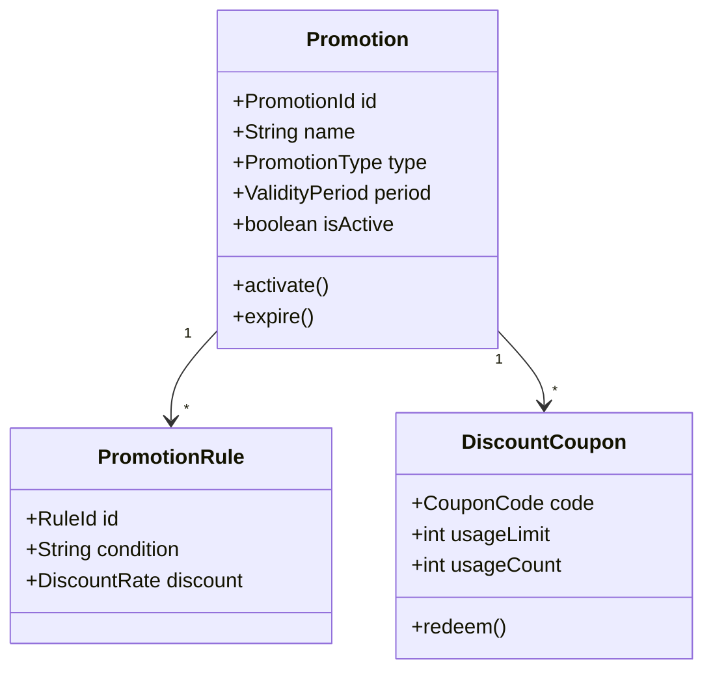
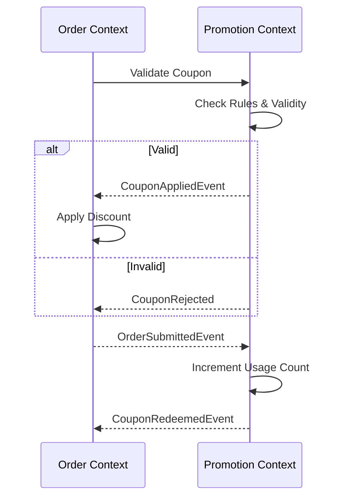

# Promotion Context

> **Responsibility**: Manage promotional campaigns and discount rules

## Overview

The Promotion Context handles marketing campaigns, coupons, and discounts. It defines rules for applying promotions to orders and validates coupon codes.

## Domain Model

**Core Aggregate**: `Promotion`

**Key Entities**:
- `Promotion` (Aggregate Root)
- `PromotionRule`
- `DiscountCoupon`

**Key Value Objects**:
- `PromotionId`
- `PromotionType` (PERCENTAGE, FIXED_AMOUNT, BUY_X_GET_Y)
- `DiscountRate`
- `ValidityPeriod`
- `CouponCode`

### Domain Model Diagram

## Events

### Event Flow

**Domain Events Published**:
- `PromotionCreatedEvent`
- `PromotionActivatedEvent`
- `PromotionExpiredEvent`
- `CouponAppliedEvent`
- `CouponRedeemedEvent`

**Domain Events Consumed**:
- `OrderSubmittedEvent` (from Order Context) → Apply promotions

## API Interface

**REST API Endpoints**:
- `GET /api/v1/promotions/active` - List active promotions
- `POST /api/v1/promotions/validate-coupon` - Validate coupon code
- `POST /api/v1/promotions` - Create promotion (admin)

## Business Rules

- Promotions have start and end dates
- Coupons can have usage limits (per customer or total)
- Multiple promotions can be combined unless explicitly restricted
- Expired promotions cannot be applied
