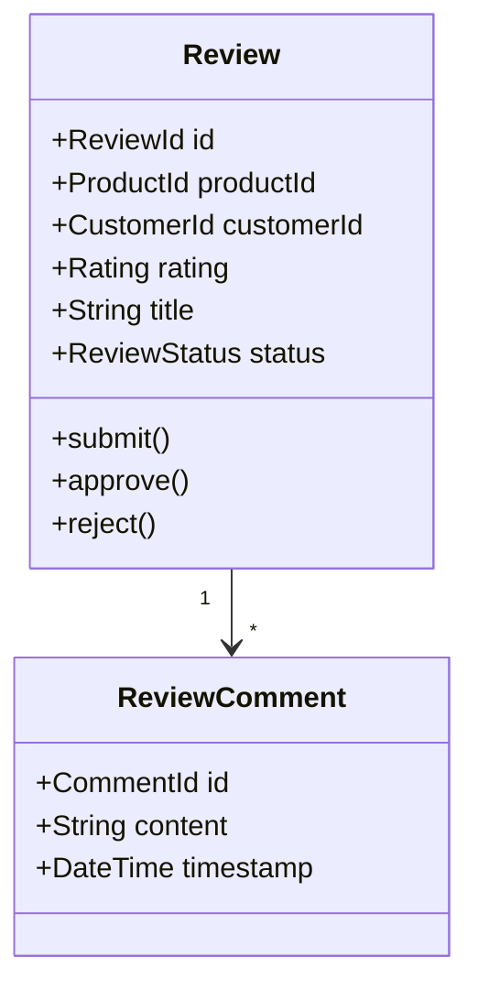
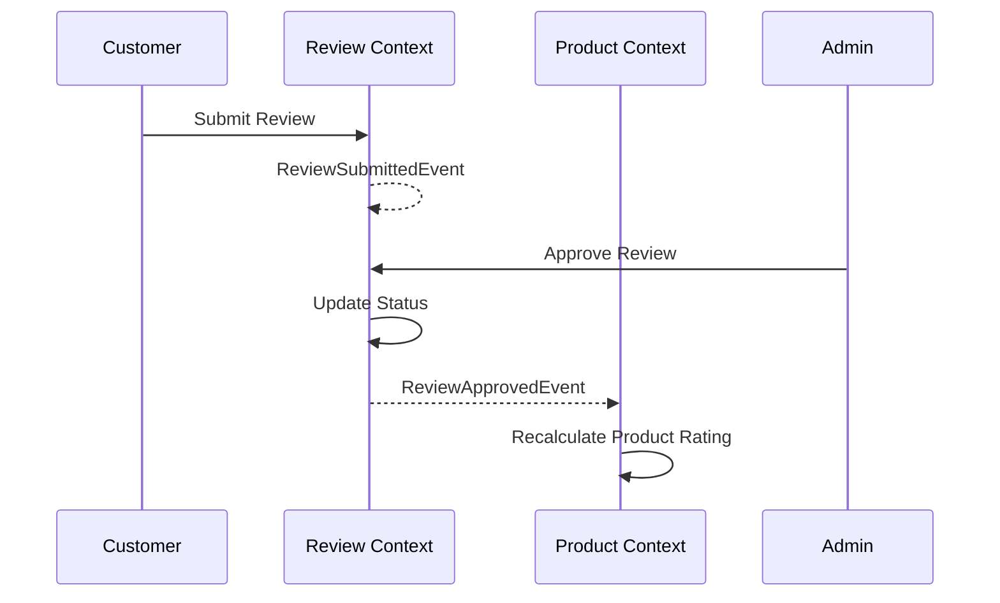

# Review Context

> **Responsibility**: Manage product reviews and ratings

## Overview

The Review Context allows customers to provide feedback on products they have purchased. It manages ratings, comments, and moderation workflows.

## Domain Model

**Core Aggregate**: `Review`

**Key Entities**:
- `Review` (Aggregate Root)
- `ReviewComment`

**Key Value Objects**:
- `ReviewId`
- `ProductId`
- `CustomerId`
- `Rating` (1-5 stars)
- `ReviewStatus` (PENDING, APPROVED, REJECTED)

### Domain Model Diagram

## Events

### Event Flow

**Domain Events Published**:
- `ReviewSubmittedEvent`
- `ReviewApprovedEvent`
- `ReviewRejectedEvent`
- `ReviewUpdatedEvent`

**Domain Events Consumed**:
- `OrderDeliveredEvent` (from Order Context) → Enable review submission

## API Interface

**REST API Endpoints**:
- `GET /api/v1/reviews?productId={id}` - Get product reviews
- `POST /api/v1/reviews` - Submit review
- `PUT /api/v1/reviews/{id}` - Update review
- `POST /api/v1/reviews/{id}/approve` - Approve review (admin)

## Business Rules

- Customer can only review products they purchased
- One review per customer per product
- Reviews require moderation before publication
- Rating must be between 1 and 5 stars
