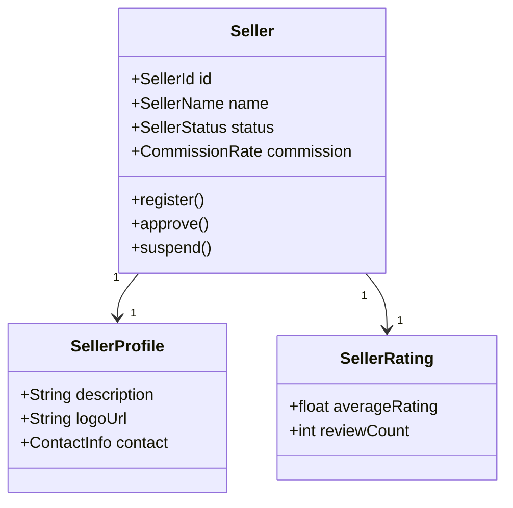
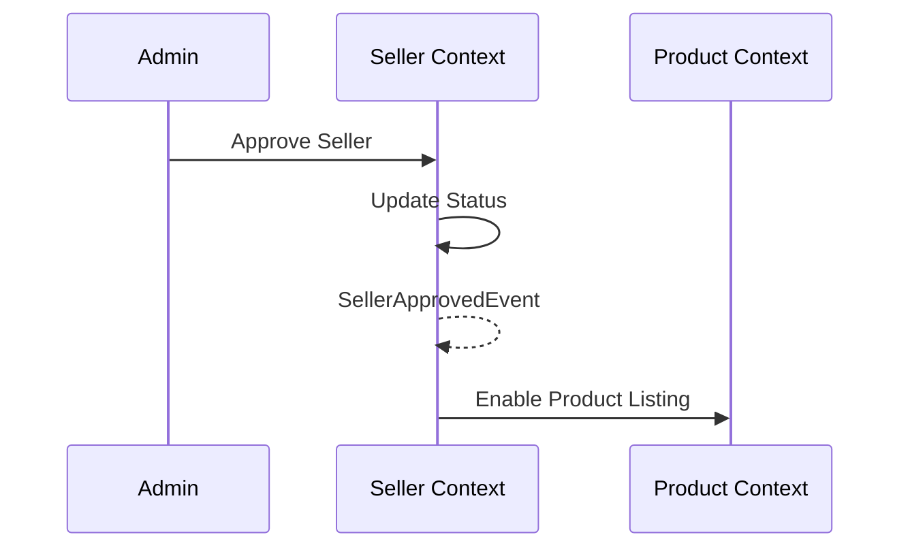

# Seller Context

> **Responsibility**: Manage seller accounts and seller operations

## Overview

The Seller Context manages the marketplace aspect of the platform. It handles seller registration, profile management, and performance monitoring.

## Domain Model

**Core Aggregate**: `Seller`

**Key Entities**:
- `Seller` (Aggregate Root)
- `SellerProfile`
- `SellerRating`

**Key Value Objects**:
- `SellerId`
- `SellerName`
- `SellerStatus` (ACTIVE, SUSPENDED, INACTIVE)
- `CommissionRate`

### Domain Model Diagram

## Events

### Event Flow

**Domain Events Published**:
- `SellerRegisteredEvent`
- `SellerApprovedEvent`
- `SellerSuspendedEvent`
- `SellerRatingUpdatedEvent`

**Domain Events Consumed**:
- `OrderCompletedEvent` (from Order Context) → Update seller statistics
- `ReviewSubmittedEvent` (from Review Context) → Update seller rating

## API Interface

**REST API Endpoints**:
- `POST /api/v1/sellers` - Register seller
- `GET /api/v1/sellers/{id}` - Get seller profile
- `PUT /api/v1/sellers/{id}` - Update seller profile
- `GET /api/v1/sellers/{id}/products` - List seller products

## Business Rules

- Sellers must be approved before listing products
- Commission rate: 10-20% based on seller tier
- Suspended sellers cannot list new products
- Seller rating based on customer reviews and order fulfillment
