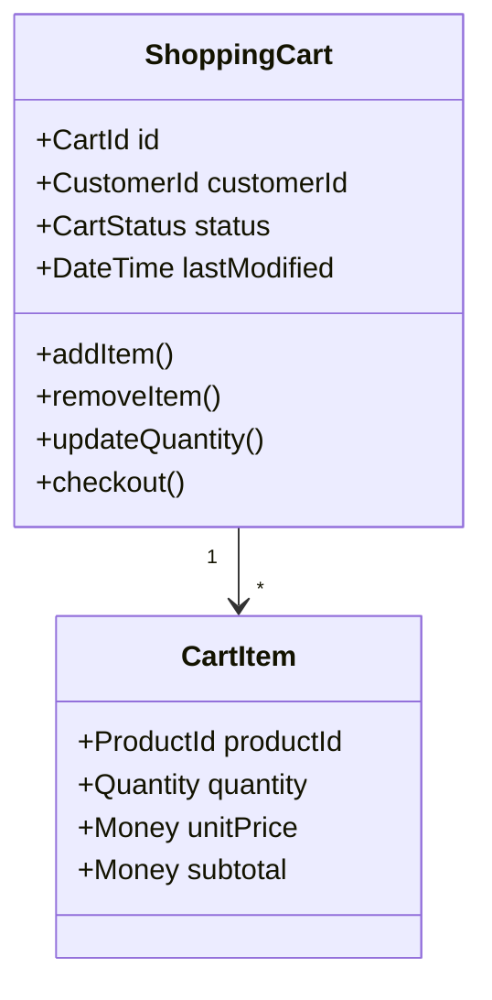
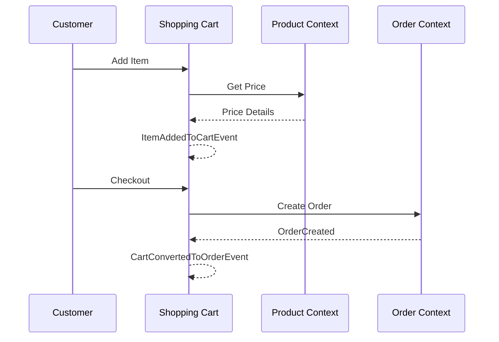

# Shopping Cart Context

> **Responsibility**: Manage customer shopping carts and cart operations

## Overview

The Shopping Cart Context manages the temporary storage of items that customers intend to purchase. It handles cart creation, item addition/removal, and conversion to orders.

## Domain Model

**Core Aggregate**: `ShoppingCart`

**Key Entities**:
- `ShoppingCart` (Aggregate Root)
- `CartItem`

**Key Value Objects**:
- `CartId`
- `CustomerId`
- `ProductId`
- `Quantity`
- `CartStatus` (ACTIVE, ABANDONED, CONVERTED)

### Domain Model Diagram

## Events

### Event Flow

**Domain Events Published**:
- `CartCreatedEvent`
- `ItemAddedToCartEvent`
- `ItemRemovedFromCartEvent`
- `CartAbandonedEvent`
- `CartConvertedToOrderEvent`

**Domain Events Consumed**:
- `ProductPriceChangedEvent` (from Product Context) → Update cart prices
- `InventoryDepletedEvent` (from Inventory Context) → Remove unavailable items

## API Interface

**REST API Endpoints**:
- `GET /api/v1/carts/{customerId}` - Get customer cart
- `POST /api/v1/carts/{customerId}/items` - Add item to cart
- `DELETE /api/v1/carts/{customerId}/items/{productId}` - Remove item
- `PUT /api/v1/carts/{customerId}/items/{productId}` - Update quantity
- `POST /api/v1/carts/{customerId}/checkout` - Convert cart to order

## Business Rules

- Cart items expire after 24 hours
- Quantity cannot exceed available inventory
- Cart total recalculated when prices change
- Abandoned carts trigger reminder email after 1 hour
