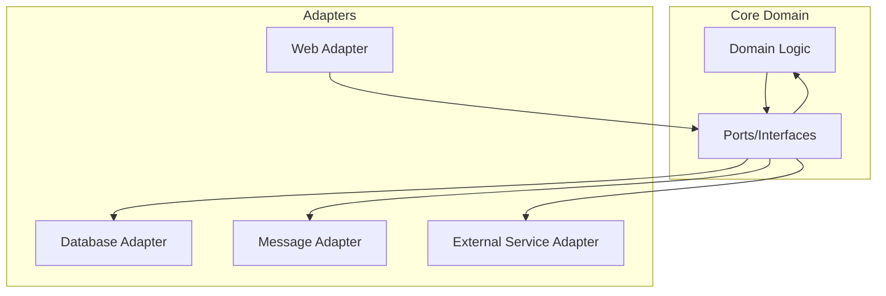

# Domain Model Design Guide

## Overview

This guide provides best practices for designing and implementing DDD domain models in the project, based on actual implementation experience. The project adopts complete DDD tactical patterns, including 15 aggregate roots distributed across 13 bounded contexts, implementing a modern domain-driven design architecture.

## Current Project Aggregate Root Overview

### Aggregate Root Distribution Statistics

| Bounded Context | Aggregate Count | Main Aggregates | Version |
|-----------------|----------------|-----------------|---------|
| Customer | 1 | Customer | 2.0 |
| Order | 2 | Order, OrderWorkflow | 1.0 |
| Product | 1 | Product | 1.0 |
| Inventory | 1 | Inventory | 1.0 |
| Payment | 2 | Payment, PaymentMethod | 1.0 |
| Delivery | 1 | Delivery | 1.0 |
| Review | 1 | ProductReview | 2.0 |
| Seller | 1 | Seller | 2.0 |
| ShoppingCart | 1 | ShoppingCart | 1.0 |
| Promotion | 2 | Promotion, Voucher | 1.0 |
| Pricing | 1 | PricingRule | 1.0 |
| Notification | 2 | Notification, NotificationTemplate | 1.0 |
| Observability | 2 | ObservabilitySession, AnalyticsSession | 1.0 |

**Total**: 15 aggregate roots across 13 bounded contexts

## Aggregate Root Design Patterns

### 1. Hybrid Implementation Pattern

The project adopts two aggregate root implementation patterns:

#### Pattern A: Annotation + Interface Pattern (Recommended)
```java
@AggregateRoot(name = "Customer", description = "Enhanced customer aggregate root with complete consumer functionality", 
               boundedContext = "Customer", version = "2.0")
public class Customer implements AggregateRootInterface {
    // Zero override implementation, all methods have default implementations
    // Automatic event collection and aggregate root metadata management
}
```

#### Pattern B: Base Class Inheritance Pattern
```java
@AggregateRoot(name = "Product", description = "Product aggregate root managing product information and inventory", 
               boundedContext = "Product", version = "1.0")
public class Product extends solid.humank.genaidemo.domain.common.aggregate.AggregateRoot {
    // Base class inheritance implementation
}
```

### 2. Aggregate Root Annotation Standards

All aggregate roots must use the `@AggregateRoot` annotation:

```java
@AggregateRoot(
    name = "Aggregate Root Name",        // Required: Aggregate root identifier
    description = "Aggregate Description", // Required: Business description
    boundedContext = "Context Name",     // Required: Bounded context
    version = "Version Number"           // Required: Aggregate root version
)
```

## Entity Design Principles

### 1. Business-Oriented Design

Entities should focus on domain logic rather than technical abstractions:

```java
@Entity(name = "SellerRating", description = "Seller rating entity")
public class SellerRating {
    // Business logic methods
    public boolean isPositive() {
        return rating >= 4; // 4 or above considered positive
    }
    
    public boolean isRecent() {
        return ChronoUnit.DAYS.between(ratedAt, LocalDateTime.now()) <= 30;
    }
    
    public void hide() {
        this.status = RatingStatus.HIDDEN;
    }
}
```

### 2. Strongly Typed IDs

Each Entity should have a strongly typed ID Value Object:

```java
@ValueObject(name = "SellerRatingId", description = "Seller rating ID")
public record SellerRatingId(UUID value) {
    public SellerRatingId {
        Objects.requireNonNull(value, "SellerRating ID cannot be null");
    }
    
    public static SellerRatingId generate() {
        return new SellerRatingId(UUID.randomUUID());
    }
    
    public static SellerRatingId of(UUID uuid) {
        return new SellerRatingId(uuid);
    }
}
```

### 3. State Management

Use Enum Value Objects to manage Entity states:

```java
@ValueObject(name = "RatingStatus", description = "Rating status")
public enum RatingStatus {
    ACTIVE("Active"),
    HIDDEN("Hidden"),
    DELETED("Deleted");
    
    private final String description;
    
    RatingStatus(String description) {
        this.description = description;
    }
    
    public String getDescription() {
        return description;
    }
}
```

## Entity Implementation Patterns

### 1. Basic Structure

```java
@Entity(name = "EntityName", description = "Entity description")
public class EntityName {
    private final EntityNameId id;
    private String businessField;
    private EntityStatus status;
    private LocalDateTime createdAt;
    private LocalDateTime updatedAt;
    
    // Constructor
    public EntityName(EntityNameId id, String businessField) {
        this.id = Objects.requireNonNull(id);
        this.businessField = Objects.requireNonNull(businessField);
        this.status = EntityStatus.ACTIVE;
        this.createdAt = LocalDateTime.now();
        this.updatedAt = LocalDateTime.now();
    }
    
    // Business logic methods
    public void updateBusinessField(String newValue) {
        this.businessField = newValue;
        this.updatedAt = LocalDateTime.now();
    }
    
    public boolean isValid() {
        return status == EntityStatus.ACTIVE && businessField != null;
    }
    
    // Getters
    public EntityNameId getId() { return id; }
    public String getBusinessField() { return businessField; }
    public EntityStatus getStatus() { return status; }
    
    // equals and hashCode based on ID
    @Override
    public boolean equals(Object obj) {
        if (this == obj) return true;
        if (obj == null || getClass() != obj.getClass()) return false;
        EntityName that = (EntityName) obj;
        return Objects.equals(id, that.id);
    }
    
    @Override
    public int hashCode() {
        return Objects.hash(id);
    }
}
```

### 2. Lifecycle Management

```java
public class ContactInfo {
    private boolean emailVerified;
    private boolean phoneVerified;
    private LocalDateTime lastUpdated;
    
    public void verifyEmail() {
        this.emailVerified = true;
        this.lastUpdated = LocalDateTime.now();
    }
    
    public void verifyPhone() {
        this.phoneVerified = true;
        this.lastUpdated = LocalDateTime.now();
    }
    
    public boolean isFullyVerified() {
        return emailVerified && phoneVerified;
    }
    
    public void updateContactInfo(String email, String phone) {
        this.email = email;
        this.phone = phone;
        this.lastUpdated = LocalDateTime.now();
        // Re-verification required
        this.emailVerified = false;
        this.phoneVerified = false;
    }
}
```

### 3. State Transitions

```java
public class StockReservation {
    private ReservationStatus status;
    private LocalDateTime expiresAt;
    
    public void confirm() {
        if (status != ReservationStatus.ACTIVE) {
            throw new IllegalStateException("Only active reservations can be confirmed");
        }
        this.status = ReservationStatus.CONFIRMED;
    }
    
    public void release() {
        if (status == ReservationStatus.RELEASED) {
            throw new IllegalStateException("Reservation already released");
        }
        this.status = ReservationStatus.RELEASED;
    }
    
    public boolean isExpired() {
        return LocalDateTime.now().isAfter(expiresAt);
    }
    
    public void extend(Duration duration) {
        if (status != ReservationStatus.ACTIVE) {
            throw new IllegalStateException("Only active reservations can be extended");
        }
        this.expiresAt = this.expiresAt.plus(duration);
    }
}
```

## Entity Relationships Within Aggregates

### 1. One-to-Many Relationships

```java
@AggregateRoot(name = "Seller", description = "Seller aggregate root")
public class Seller implements AggregateRootInterface {
    private final SellerId sellerId;
    private final List<SellerRating> ratings;
    
    public void addRating(CustomerId customerId, int rating, String comment) {
        SellerRating newRating = new SellerRating(
            SellerRatingId.generate(),
            customerId,
            rating,
            comment
        );
        this.ratings.add(newRating);
        
        // Collect domain event
        collectEvent(SellerRatingAddedEvent.create(sellerId, newRating.getId(), rating));
    }
    
    public double calculateAverageRating() {
        return ratings.stream()
            .filter(SellerRating::isVisible)
            .mapToInt(SellerRating::getRating)
            .average()
            .orElse(0.0);
    }
}
```

### 2. One-to-One Relationships

```java
@AggregateRoot(name = "Seller", description = "Seller aggregate root")
public class Seller implements AggregateRootInterface {
    private SellerProfile profile;
    private ContactInfo contactInfo;
    private SellerVerification verification;
    
    public void updateContactInfo(String email, String phone) {
        this.contactInfo.updateContactInfo(email, phone);
        collectEvent(SellerContactInfoUpdatedEvent.create(sellerId, email, phone));
    }
    
    public boolean canAcceptOrders() {
        return isActive() && 
               contactInfo.isFullyVerified() && 
               verification.isVerified() &&
               profile.isProfileComplete();
    }
}
```

## Validation and Business Rules

### 1. Input Validation

```java
public class SellerRating {
    public SellerRating(SellerRatingId id, CustomerId customerId, int rating, String comment) {
        this.id = Objects.requireNonNull(id, "ID cannot be null");
        this.customerId = Objects.requireNonNull(customerId, "Customer ID cannot be null");
        this.rating = validateRating(rating);
        this.comment = comment;
        this.ratedAt = LocalDateTime.now();
        this.status = RatingStatus.ACTIVE;
    }
    
    private int validateRating(int rating) {
        if (rating < 1 || rating > 5) {
            throw new IllegalArgumentException("Rating must be between 1-5");
        }
        return rating;
    }
}
```

### 2. Business Rule Validation

```java
public class SellerVerification {
    private static final Set<String> REQUIRED_DOCUMENTS = Set.of(
        "business_license", "tax_certificate", "identity_document"
    );
    
    public void approve(String verifierUserId, LocalDateTime expiresAt) {
        if (!hasAllRequiredDocuments()) {
            throw new IllegalStateException("All required documents must be submitted for verification approval");
        }
        
        this.status = VerificationStatus.APPROVED;
        this.verifierUserId = verifierUserId;
        this.approvedAt = LocalDateTime.now();
        this.expiresAt = expiresAt;
    }
    
    public boolean hasAllRequiredDocuments() {
        return submittedDocuments.containsAll(REQUIRED_DOCUMENTS);
    }
}
```

## Testing Strategy

### 1. BDD Test Coverage

All Entity business logic should be covered by BDD tests:

```gherkin
Scenario: Seller rating status management
  Given an active seller rating
  When admin hides the rating
  Then rating status should become hidden
  And rating should not appear in public listings
```

### 2. Architecture Testing

Use ArchUnit to ensure Entity design compliance:

```java
@Test
void entitiesShouldBeProperlyAnnotatedAndLocated() {
    ArchRule rule = classes()
        .that().areAnnotatedWith(Entity.class)
        .should().resideInAPackage("..domain.*.model.entity..")
        .because("Entities must be located in entity packages");
    
    rule.check(classes);
}
```

## Common Patterns and Best Practices

### 1. Factory Methods

```java
public class ReviewImage {
    public static ReviewImage createFromUpload(String originalUrl, String fileName, long fileSize) {
        ReviewImage image = new ReviewImage(
            ReviewImageId.generate(),
            originalUrl,
            fileName,
            fileSize
        );
        
        if (!image.isValidImage()) {
            throw new IllegalArgumentException("Invalid image format");
        }
        
        return image;
    }
}
```

### 2. Query Methods

```java
public class Seller {
    public List<SellerRating> getRecentRatings(int days) {
        LocalDateTime cutoff = LocalDateTime.now().minusDays(days);
        return ratings.stream()
            .filter(rating -> rating.getRatedAt().isAfter(cutoff))
            .filter(SellerRating::isVisible)
            .sorted((r1, r2) -> r2.getRatedAt().compareTo(r1.getRatedAt()))
            .toList();
    }
    
    public Optional<SellerRating> findRatingByCustomer(CustomerId customerId) {
        return ratings.stream()
            .filter(rating -> rating.getCustomerId().equals(customerId))
            .filter(SellerRating::isVisible)
            .findFirst();
    }
}
```

### 3. Aggregate Operations

```java
public class ProductReview {
    public void addModerationRecord(String moderatorId, ModerationAction action, String reason) {
        ModerationRecord record = new ModerationRecord(
            ModerationRecordId.generate(),
            moderatorId,
            action,
            reason
        );
        
        this.moderations.add(record);
        
        // Update review status based on moderation result
        if (action == ModerationAction.APPROVE) {
            this.status = ReviewStatus.APPROVED;
        } else if (action == ModerationAction.REJECT) {
            this.status = ReviewStatus.REJECTED;
        }
        
        collectEvent(ReviewModerationCompletedEvent.create(this.id, action, reason));
    }
}
```

## Performance Considerations

### 1. Lazy Loading

```java
public class Seller {
    // Avoid loading all ratings at once
    public List<SellerRating> getTopRatings(int limit) {
        return ratings.stream()
            .filter(SellerRating::isVisible)
            .sorted((r1, r2) -> Integer.compare(r2.getRating(), r1.getRating()))
            .limit(limit)
            .toList();
    }
}
```

### 2. Cache-Friendly Design

```java
public class SellerProfile {
    private String businessInfoSummary; // Cache calculated result
    
    public String getBusinessInfoSummary() {
        if (businessInfoSummary == null) {
            businessInfoSummary = calculateBusinessInfoSummary();
        }
        return businessInfoSummary;
    }
    
    public void updateBusinessInfo(String name, String address, String description) {
        this.businessName = name;
        this.businessAddress = address;
        this.description = description;
        this.businessInfoSummary = null; // Clear cache
        this.lastProfileUpdate = LocalDateTime.now();
    }
}
```

## Related Diagrams

- 
- 
- 
- 

## Hexagonal Architecture Diagram



## Relationships with Other Viewpoints

- **[Information Viewpoint](../information/README.md)**: Domain event design and data consistency strategies
- **[Development Viewpoint](../development/README.md)**: Testing strategies and code organization
- **[Concurrency Viewpoint](../concurrency/README.md)**: Aggregate root transaction boundary design

## Summary

Good Entity design should:

1. **Business-Oriented**: Focus on domain logic rather than technical implementation
2. **Type-Safe**: Use strongly typed IDs and state Enums
3. **Well-Encapsulated**: Maintain invariants through methods rather than direct property access
4. **Test-Friendly**: Design interfaces and behaviors that are easy to test
5. **Performance-Conscious**: Avoid unnecessary data loading and computation

Following these principles creates maintainable, testable Entity designs that comply with DDD principles.