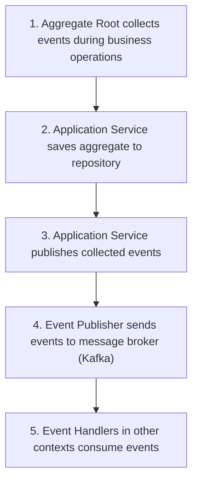
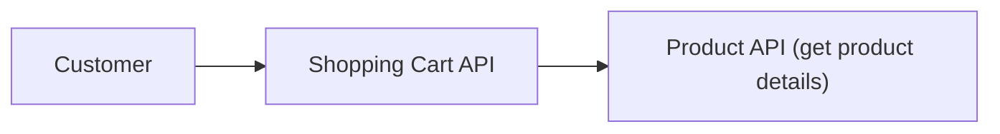

# Functional Interfaces

> **Status**: ✅ Active  
> **Last Updated**: 2025-10-22  
> **Owner**: API Team

## Overview

This document describes the functional interfaces of the Enterprise E-Commerce Platform. The system exposes two primary types of interfaces:

1. **REST APIs**: Synchronous request-response interfaces for real-time operations
2. **Domain Events**: Asynchronous event-driven interfaces for cross-context communication

All interfaces follow consistent design principles and are documented with OpenAPI 3.0 specifications.

## Interface Design Principles

### REST API Principles

- **RESTful Design**: Follow REST architectural constraints
- **Resource-Oriented**: URLs represent resources, not actions
- **HTTP Semantics**: Proper use of HTTP methods and status codes
- **Versioning**: URL-based versioning (`/api/v1/`)
- **Consistency**: Consistent naming, error handling, and response formats

### Domain Event Principles

- **Event Sourcing**: Events are immutable records of what happened
- **Past Tense**: Event names use past tense (e.g., `OrderSubmitted`)
- **Self-Contained**: Events contain all necessary data
- **Idempotent Handling**: Event handlers can process events multiple times safely
- **Schema Evolution**: Events support backward-compatible schema changes

---

## REST API Interfaces

### API Base URL

- **Development**: `http://localhost:8080/api/v1`
- **Staging**: `https://staging-api.example.com/api/v1`
- **Production**: `https://api.example.com/api/v1`

### Authentication

All API endpoints (except public endpoints) require JWT authentication:

```http
Authorization: Bearer {jwt_token}
```

**Public Endpoints** (no authentication required):

- `GET /api/v1/products` - List products
- `GET /api/v1/products/{id}` - Get product details
- `GET /api/v1/products/search` - Search products
- `POST /api/v1/customers` - Register customer

### Common Response Format

#### Success Response

```json
{
  "data": {
    "id": "resource-id",
    "...": "resource fields"
  },
  "meta": {
    "timestamp": "2025-10-22T10:00:00Z",
    "version": "1.0"
  }
}
```

#### Error Response

```json
{
  "error": {
    "code": "ERROR_CODE",
    "message": "Human-readable error message",
    "details": {
      "field": "fieldName",
      "reason": "Validation failure reason"
    }
  },
  "meta": {
    "timestamp": "2025-10-22T10:00:00Z",
    "traceId": "trace-id-for-debugging"
  }
}
```

### API Endpoints by Bounded Context

#### Customer Context APIs

| Method | Endpoint | Description | Auth Required |
|--------|----------|-------------|---------------|
| POST | `/api/v1/customers` | Register new customer | No |
| GET | `/api/v1/customers/{id}` | Get customer details | Yes |
| PUT | `/api/v1/customers/{id}` | Update customer profile | Yes |
| GET | `/api/v1/customers/{id}/orders` | List customer orders | Yes |
| POST | `/api/v1/customers/{id}/addresses` | Add delivery address | Yes |
| PUT | `/api/v1/customers/{id}/addresses/{addressId}` | Update address | Yes |
| DELETE | `/api/v1/customers/{id}/addresses/{addressId}` | Remove address | Yes |
| GET | `/api/v1/customers/{id}/reward-points` | Get reward points | Yes |
| PUT | `/api/v1/customers/{id}/preferences` | Update preferences | Yes |

**Detailed Documentation**: [Customer API Reference](../../api/rest/endpoints/customers.md)

#### Order Context APIs

| Method | Endpoint | Description | Auth Required |
|--------|----------|-------------|---------------|
| POST | `/api/v1/orders` | Create new order | Yes |
| GET | `/api/v1/orders/{id}` | Get order details | Yes |
| GET | `/api/v1/orders` | List orders (with filters) | Yes |
| POST | `/api/v1/orders/{id}/submit` | Submit order for processing | Yes |
| POST | `/api/v1/orders/{id}/cancel` | Cancel order | Yes |
| GET | `/api/v1/orders/{id}/history` | Get order history | Yes |
| GET | `/api/v1/orders/{id}/invoice` | Download invoice | Yes |

**Detailed Documentation**: [Order API Reference](../../api/rest/endpoints/orders.md)

#### Product Context APIs

| Method | Endpoint | Description | Auth Required |
|--------|----------|-------------|---------------|
| GET | `/api/v1/products` | List products | No |
| GET | `/api/v1/products/{id}` | Get product details | No |
| GET | `/api/v1/products/search` | Search products | No |
| GET | `/api/v1/products/categories` | List categories | No |
| POST | `/api/v1/products` | Create product | Yes (Admin) |
| PUT | `/api/v1/products/{id}` | Update product | Yes (Admin/Seller) |
| DELETE | `/api/v1/products/{id}` | Delete product | Yes (Admin) |
| GET | `/api/v1/products/{id}/reviews` | Get product reviews | No |

**Detailed Documentation**: [Product API Reference](../../api/rest/endpoints/products.md)

#### Shopping Cart Context APIs

| Method | Endpoint | Description | Auth Required |
|--------|----------|-------------|---------------|
| GET | `/api/v1/carts/{customerId}` | Get customer cart | Yes |
| POST | `/api/v1/carts/{customerId}/items` | Add item to cart | Yes |
| PUT | `/api/v1/carts/{customerId}/items/{productId}` | Update item quantity | Yes |
| DELETE | `/api/v1/carts/{customerId}/items/{productId}` | Remove item | Yes |
| DELETE | `/api/v1/carts/{customerId}` | Clear cart | Yes |
| POST | `/api/v1/carts/{customerId}/checkout` | Checkout cart | Yes |

#### Payment Context APIs

| Method | Endpoint | Description | Auth Required |
|--------|----------|-------------|---------------|
| POST | `/api/v1/payments` | Initiate payment | Yes |
| GET | `/api/v1/payments/{id}` | Get payment status | Yes |
| POST | `/api/v1/payments/{id}/refund` | Process refund | Yes (Admin) |
| GET | `/api/v1/payments/{id}/receipt` | Download receipt | Yes |

**Detailed Documentation**: [Payment API Reference](../../api/rest/endpoints/payments.md)

#### Delivery Context APIs

| Method | Endpoint | Description | Auth Required |
|--------|----------|-------------|---------------|
| GET | `/api/v1/deliveries/{orderId}` | Get delivery status | Yes |
| GET | `/api/v1/deliveries/track/{trackingNumber}` | Track delivery | No |
| POST | `/api/v1/deliveries/{id}/update-status` | Update status | Yes (Logistics) |

#### Inventory Context APIs

| Method | Endpoint | Description | Auth Required |
|--------|----------|-------------|---------------|
| GET | `/api/v1/inventory/{productId}` | Get stock level | Yes (Admin/Seller) |
| POST | `/api/v1/inventory/{productId}/replenish` | Add stock | Yes (Admin/Seller) |
| GET | `/api/v1/inventory/low-stock` | List low stock items | Yes (Admin) |

**Detailed Documentation**: [Inventory API Reference](../../api/rest/endpoints/inventory.md)

#### Promotion Context APIs

| Method | Endpoint | Description | Auth Required |
|--------|----------|-------------|---------------|
| GET | `/api/v1/promotions/active` | List active promotions | No |
| POST | `/api/v1/promotions/validate-coupon` | Validate coupon code | Yes |
| POST | `/api/v1/promotions` | Create promotion | Yes (Admin) |
| PUT | `/api/v1/promotions/{id}` | Update promotion | Yes (Admin) |
| DELETE | `/api/v1/promotions/{id}` | Delete promotion | Yes (Admin) |

**Detailed Documentation**: [Promotion API Reference](../../api/rest/endpoints/promotions.md)

#### Review Context APIs

| Method | Endpoint | Description | Auth Required |
|--------|----------|-------------|---------------|
| GET | `/api/v1/reviews` | List reviews (by product) | No |
| POST | `/api/v1/reviews` | Submit review | Yes |
| PUT | `/api/v1/reviews/{id}` | Update review | Yes |
| DELETE | `/api/v1/reviews/{id}` | Delete review | Yes |
| POST | `/api/v1/reviews/{id}/approve` | Approve review | Yes (Admin) |
| POST | `/api/v1/reviews/{id}/reject` | Reject review | Yes (Admin) |

#### Seller Context APIs

| Method | Endpoint | Description | Auth Required |
|--------|----------|-------------|---------------|
| POST | `/api/v1/sellers` | Register seller | No |
| GET | `/api/v1/sellers/{id}` | Get seller profile | No |
| PUT | `/api/v1/sellers/{id}` | Update seller profile | Yes (Seller) |
| GET | `/api/v1/sellers/{id}/products` | List seller products | No |
| POST | `/api/v1/sellers/{id}/approve` | Approve seller | Yes (Admin) |

---

## Domain Event Interfaces

### Event Structure

All domain events follow a consistent structure:

```java
public record CustomerCreatedEvent(
    CustomerId customerId,           // Aggregate ID
    CustomerName customerName,       // Event data
    Email email,                     // Event data
    MembershipLevel membershipLevel, // Event data
    UUID eventId,                    // Event metadata
    LocalDateTime occurredOn         // Event metadata
) implements DomainEvent {
    
    @Override
    public String getEventType() {
        return "CustomerCreated";
    }
    
    @Override
    public String getAggregateId() {
        return customerId.getValue();
    }
}
```

### Event Publishing Flow



### Domain Events by Context

#### Customer Context Events

| Event Name | Trigger | Consumers |
|------------|---------|-----------|
| `CustomerCreatedEvent` | Customer registration | Notification, Observability |
| `CustomerProfileUpdatedEvent` | Profile update | Notification, Observability |
| `CustomerStatusChangedEvent` | Status change | Notification, Order |
| `MembershipLevelUpgradedEvent` | Spending threshold reached | Notification, Pricing |
| `DeliveryAddressAddedEvent` | Address added | Observability |
| `RewardPointsEarnedEvent` | Order completed | Notification |
| `RewardPointsRedeemedEvent` | Points used | Notification, Pricing |

**Detailed Documentation**: [Customer Events Reference](../../api/events/contexts/customer-events.md)

#### Order Context Events

| Event Name | Trigger | Consumers |
|------------|---------|-----------|
| `OrderCreatedEvent` | Order created | Observability |
| `OrderSubmittedEvent` | Order submitted | Inventory, Payment, Pricing, Notification |
| `OrderConfirmedEvent` | Payment & inventory confirmed | Delivery, Notification, Customer |
| `OrderCancelledEvent` | Order cancelled | Inventory, Payment, Notification |
| `OrderShippedEvent` | Order shipped | Notification, Customer |
| `OrderDeliveredEvent` | Order delivered | Review, Customer, Notification |
| `OrderCompletedEvent` | Order completed | Customer, Seller, Observability |

**Detailed Documentation**: [Order Events Reference](../../api/events/contexts/order-events.md)

#### Product Context Events

| Event Name | Trigger | Consumers |
|------------|---------|-----------|
| `ProductCreatedEvent` | Product created | Inventory, Observability |
| `ProductUpdatedEvent` | Product updated | Shopping Cart, Observability |
| `ProductPriceChangedEvent` | Price changed | Shopping Cart, Pricing, Notification |
| `ProductStatusChangedEvent` | Status changed | Shopping Cart, Inventory |
| `ProductDiscontinuedEvent` | Product discontinued | Shopping Cart, Inventory |

**Detailed Documentation**: [Product Events Reference](../../api/events/contexts/product-events.md)

#### Inventory Context Events

| Event Name | Trigger | Consumers |
|------------|---------|-----------|
| `InventoryReservedEvent` | Stock reserved | Order, Observability |
| `InventoryReleasedEvent` | Reservation released | Order, Observability |
| `InventoryReplenishedEvent` | Stock added | Product, Notification |
| `InventoryDepletedEvent` | Stock depleted | Product, Shopping Cart, Notification |
| `StockLevelChangedEvent` | Stock level changed | Product, Observability |

**Detailed Documentation**: [Inventory Events Reference](../../api/events/contexts/inventory-events.md)

#### Payment Context Events

| Event Name | Trigger | Consumers |
|------------|---------|-----------|
| `PaymentInitiatedEvent` | Payment started | Observability |
| `PaymentCompletedEvent` | Payment successful | Order, Customer, Delivery, Notification |
| `PaymentFailedEvent` | Payment failed | Order, Notification |
| `RefundProcessedEvent` | Refund completed | Customer, Notification |

**Detailed Documentation**: [Payment Events Reference](../../api/events/contexts/payment-events.md)

#### Delivery Context Events

| Event Name | Trigger | Consumers |
|------------|---------|-----------|
| `DeliveryScheduledEvent` | Delivery scheduled | Order, Notification |
| `DeliveryDispatchedEvent` | Package dispatched | Order, Notification |
| `DeliveryInTransitEvent` | In transit | Order, Notification |
| `DeliveryDeliveredEvent` | Delivered | Order, Review, Customer, Notification |
| `DeliveryFailedEvent` | Delivery failed | Order, Notification |

**Detailed Documentation**: [Delivery Events Reference](../../api/events/contexts/delivery-events.md)

#### Promotion Context Events

| Event Name | Trigger | Consumers |
|------------|---------|-----------|
| `PromotionCreatedEvent` | Promotion created | Pricing, Observability |
| `PromotionActivatedEvent` | Promotion activated | Pricing, Notification |
| `PromotionExpiredEvent` | Promotion expired | Pricing |
| `CouponAppliedEvent` | Coupon applied | Pricing, Observability |
| `CouponRedeemedEvent` | Coupon redeemed | Pricing, Observability |

**Detailed Documentation**: [Promotion Events Reference](../../api/events/contexts/promotion-events.md)

#### Review Context Events

| Event Name | Trigger | Consumers |
|------------|---------|-----------|
| `ReviewSubmittedEvent` | Review submitted | Product, Seller, Notification |
| `ReviewApprovedEvent` | Review approved | Product, Notification |
| `ReviewRejectedEvent` | Review rejected | Notification |
| `ReviewUpdatedEvent` | Review updated | Product, Observability |

**Detailed Documentation**: [Review Events Reference](../../api/events/contexts/review-events.md)

#### Seller Context Events

| Event Name | Trigger | Consumers |
|------------|---------|-----------|
| `SellerRegisteredEvent` | Seller registered | Notification, Observability |
| `SellerApprovedEvent` | Seller approved | Notification |
| `SellerSuspendedEvent` | Seller suspended | Product, Notification |
| `SellerRatingUpdatedEvent` | Rating updated | Observability |

**Detailed Documentation**: [Seller Events Reference](../../api/events/contexts/seller-events.md)

---

## Interface Contracts

### REST API Contracts

#### Request Validation

- All request bodies validated using Bean Validation annotations
- Invalid requests return `400 Bad Request` with field-level errors
- Required fields enforced at API layer

#### Response Guarantees

- Successful operations return appropriate 2xx status codes
- Failed operations return appropriate 4xx/5xx status codes
- All responses include timestamp and trace ID for debugging

#### Idempotency

- POST operations with idempotency keys supported
- PUT operations are naturally idempotent
- DELETE operations are idempotent (deleting non-existent resource returns 404)

### Domain Event Contracts

#### Event Schema Stability

- Event schemas are versioned
- New fields added as optional to maintain backward compatibility
- Breaking changes require new event type

#### Delivery Guarantees

- **At-least-once delivery**: Events may be delivered multiple times
- **Ordering**: Events from same aggregate are ordered
- **Durability**: Events are persisted before publishing

#### Event Handling

- Handlers must be idempotent
- Handlers must not throw exceptions (use dead letter queue)
- Handlers process events asynchronously

---

## API Versioning Strategy

### URL Versioning

- Current version: `/api/v1/`
- Future versions: `/api/v2/`, `/api/v3/`

### Deprecation Policy

- Minimum 6 months notice before deprecation
- Deprecation headers included in responses:

  ```http
  Deprecation: true
  Sunset: 2026-04-22T23:59:59Z
  Link: </api/v2/customers>; rel="successor-version"
  ```

### Backward Compatibility

- Additive changes (new fields, new endpoints) in same version
- Breaking changes require new version
- Old versions supported for at least 12 months

---

## Rate Limiting

### Rate Limit Rules

| Endpoint Type | Limit | Window |
|---------------|-------|--------|
| Public endpoints | 100 requests | per minute |
| Authenticated endpoints | 1000 requests | per minute |
| Admin endpoints | 5000 requests | per minute |
| Search endpoints | 50 requests | per minute |

### Rate Limit Headers

```http
X-RateLimit-Limit: 1000
X-RateLimit-Remaining: 999
X-RateLimit-Reset: 1640000000
```

### Rate Limit Exceeded Response

```http
HTTP/1.1 429 Too Many Requests
Retry-After: 60

{
  "error": {
    "code": "RATE_LIMIT_EXCEEDED",
    "message": "Rate limit exceeded. Please try again later."
  }
}
```

---

## Error Handling

### Standard Error Codes

| Error Code | HTTP Status | Description |
|------------|-------------|-------------|
| `VALIDATION_ERROR` | 400 | Request validation failed |
| `AUTHENTICATION_REQUIRED` | 401 | Authentication required |
| `AUTHORIZATION_FAILED` | 403 | Insufficient permissions |
| `RESOURCE_NOT_FOUND` | 404 | Resource not found |
| `CONFLICT` | 409 | Business rule violation |
| `RATE_LIMIT_EXCEEDED` | 429 | Too many requests |
| `INTERNAL_ERROR` | 500 | Internal server error |
| `SERVICE_UNAVAILABLE` | 503 | Service temporarily unavailable |

### Error Response Examples

#### Validation Error

```json
{
  "error": {
    "code": "VALIDATION_ERROR",
    "message": "Request validation failed",
    "details": {
      "fieldErrors": [
        {
          "field": "email",
          "message": "Email format is invalid"
        },
        {
          "field": "password",
          "message": "Password must be at least 8 characters"
        }
      ]
    }
  },
  "meta": {
    "timestamp": "2025-10-22T10:00:00Z",
    "traceId": "abc-123-def"
  }
}
```

#### Business Rule Violation

```json
{
  "error": {
    "code": "INSUFFICIENT_INVENTORY",
    "message": "Cannot complete order due to insufficient inventory",
    "details": {
      "productId": "prod-123",
      "requested": 10,
      "available": 5
    }
  },
  "meta": {
    "timestamp": "2025-10-22T10:00:00Z",
    "traceId": "abc-123-def"
  }
}
```

---

## Integration Patterns

### Synchronous Integration (REST API)

**When to Use**:

- Real-time queries requiring immediate response
- User-initiated operations
- Operations within same bounded context

**Example**:



### Asynchronous Integration (Domain Events)

**When to Use**:

- Cross-context workflows
- Operations that can be eventually consistent
- Notification and audit trails

**Example**:

```text
Order Context publishes OrderSubmittedEvent
  → Inventory Context reserves stock
  → Payment Context processes payment
  → Notification Context sends confirmation
```

### Hybrid Integration

Some workflows use both patterns:

**Example: Order Submission**:

1. **Synchronous**: Customer submits order via REST API
2. **Asynchronous**: Order publishes events for inventory, payment, delivery
3. **Synchronous**: Customer polls order status via REST API

---

## API Documentation Tools

### OpenAPI/Swagger

**Swagger UI**: `http://localhost:8080/swagger-ui.html`

**OpenAPI Spec**: `http://localhost:8080/v3/api-docs`

### Postman Collection

**Location**: `docs/api/rest/postman/ecommerce-api.json`

**Import Instructions**:

1. Open Postman
2. Click "Import"
3. Select `ecommerce-api.json`
4. Configure environment variables (base URL, auth token)

### Code Examples

**Location**: `docs/api/rest/examples/`

**Languages**:

- cURL
- JavaScript/TypeScript
- Java
- Python

---

## Security Considerations

### Authentication

- JWT tokens with 1-hour expiration
- Refresh tokens with 24-hour expiration
- Token rotation on refresh

### Authorization

- Role-based access control (RBAC)
- Resource-level permissions
- Admin, Seller, Customer roles

### Data Protection

- Sensitive data encrypted in transit (TLS 1.3)
- Sensitive data encrypted at rest (AES-256)
- PII masked in logs and error messages

**Detailed Documentation**: [Security Perspective](../../perspectives/security/overview.md)

---

## Performance Considerations

### Response Time Targets

- **Critical APIs** (auth, payment): ≤ 500ms (95th percentile)
- **Business APIs** (orders, customers): ≤ 1000ms (95th percentile)
- **Search APIs**: ≤ 2000ms (95th percentile)

### Caching Strategy

- Product catalog: 15 minutes TTL
- Customer profile: 5 minutes TTL
- Inventory levels: 1 minute TTL

### Pagination

- Default page size: 20 items
- Maximum page size: 100 items
- Cursor-based pagination for large datasets

**Detailed Documentation**: [Performance Perspective](../../perspectives/performance/overview.md)

---

## Quick Links

- [Back to Functional Viewpoint](overview.md)
- [Bounded Contexts](bounded-contexts.md)
- [Use Cases](use-cases.md)
- [REST API Documentation](../../api/rest/README.md)
- [Domain Events Documentation](../../api/events/README.md)
- [Main Documentation](../../README.md)

## Change History

| Date | Version | Author | Changes |
|------|---------|--------|---------|
| 2025-10-22 | 1.0 | API Team | Initial version with REST APIs and domain events |

---

**Document Version**: 1.0  
**Last Updated**: 2025-10-22
