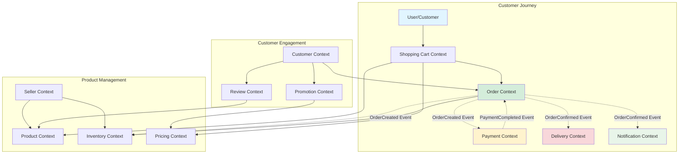

# Functional Viewpoint

> **Status**: ✅ Active
> **Last Updated**: 2025-10-22
> **Owner**: Architecture Team

## Overview

The Functional Viewpoint describes **what the system does** - its functional capabilities, business logic, and how it delivers value to users. This viewpoint is organized around **Domain-Driven Design (DDD)** principles, with the system decomposed into 13 bounded contexts, each representing a distinct business capability.

The Enterprise E-Commerce Platform is built using **Hexagonal Architecture** (Ports and Adapters) combined with **Event-Driven Architecture**, enabling loose coupling between bounded contexts while maintaining strong consistency within each context.

## Purpose

This viewpoint answers the following key questions:

- What are the core business capabilities of the system?
- How is the system organized into bounded contexts?
- What are the key use cases and user journeys?
- How do different parts of the system communicate?
- What are the functional interfaces (APIs and events)?

## Stakeholders

### Primary Stakeholders

- **Business Analysts**: Understand business capabilities and requirements
- **Product Managers**: Validate feature completeness and business value
- **Developers**: Implement business logic and features
- **Architects**: Design system structure and integration patterns

### Secondary Stakeholders

- **QA Engineers**: Design functional tests and validation scenarios
- **Technical Writers**: Document user-facing features
- **Support Teams**: Understand system capabilities for customer support

## Contents

### 📄 Documents

- [Bounded Contexts](bounded-contexts.md) - Detailed description of all 13 bounded contexts
- [Use Cases](use-cases.md) - Key user journeys and business processes
- [Functional Interfaces](interfaces.md) - REST APIs and domain events

### 📊 Diagrams

- [Bounded Contexts Overview](../../diagrams/generated/functional/bounded-contexts-overview.png) - High-level context map
- Context-specific diagrams for each bounded context (see bounded-contexts.md)

## Key Concerns

### Concern 1: Business Capability Organization

**Description**: The system must be organized around business capabilities to enable independent development and deployment of features.

**Why it matters**: Clear boundaries between business capabilities reduce coupling, enable team autonomy, and allow the system to evolve independently in different areas.

**How it's addressed**: The system is decomposed into 13 bounded contexts using DDD strategic design:

- Customer Context
- Order Context
- Product Context
- Inventory Context
- Payment Context
- Delivery Context
- Promotion Context
- Notification Context
- Review Context
- Shopping Cart Context
- Pricing Context
- Seller Context
- Observability Context (cross-cutting)

### Concern 2: Context Integration

**Description**: Bounded contexts must communicate effectively while maintaining loose coupling.

**Why it matters**: Tight coupling between contexts would negate the benefits of bounded context separation and make the system harder to evolve.

**Context Integration Pattern**:



**How it's addressed**:

- **Domain Events**: Asynchronous communication via domain events for cross-context workflows
- **REST APIs**: Synchronous communication for real-time queries
- **Shared Kernel**: Minimal shared value objects in `domain/shared/`
- **Anti-Corruption Layer**: Each context translates external data to its own domain model

### Concern 3: Business Rule Consistency

**Description**: Business rules must be enforced consistently within each bounded context.

**Why it matters**: Inconsistent business rule enforcement leads to data integrity issues and unpredictable system behavior.

**How it's addressed**:

- **Aggregate Roots**: Enforce invariants and business rules
- **Domain Services**: Implement complex business logic spanning multiple aggregates
- **Validation**: Multi-layer validation (value objects, aggregates, application services)
- **Event Sourcing**: Maintain audit trail of all business state changes

## Architectural Models

### Model 1: Bounded Context Architecture

Each bounded context follows the Hexagonal Architecture pattern:

```text
Bounded Context
├── Domain Layer (Core Business Logic)
│   ├── model/
│   │   ├── aggregate/     # Aggregate roots
│   │   ├── entity/        # Entities
│   │   └── valueobject/   # Value objects
│   ├── events/            # Domain events
│   ├── repository/        # Repository interfaces
│   ├── service/           # Domain services
│   └── validation/        # Business rules
│
├── Application Layer (Use Case Orchestration)
│   ├── {UseCase}ApplicationService.java
│   ├── command/           # Command objects
│   ├── query/             # Query objects
│   └── dto/               # Data transfer objects
│
├── Infrastructure Layer (Technical Implementation)
│   ├── persistence/       # Repository implementations
│   ├── messaging/         # Event publishers
│   └── external/          # External service adapters
│
└── Interfaces Layer (External Communication)
    └── rest/              # REST controllers
```

**Key Elements**:

- **Domain Layer**: Contains pure business logic with no infrastructure dependencies
- **Application Layer**: Orchestrates use cases, manages transactions, publishes events
- **Infrastructure Layer**: Implements technical concerns (database, messaging, external APIs)
- **Interfaces Layer**: Exposes functionality via REST APIs

### Model 2: Event-Driven Communication

Bounded contexts communicate asynchronously via domain events:

```text
Order Context                    Inventory Context
     |                                 |
     | OrderSubmittedEvent             |
     |-------------------------------->|
     |                                 | Reserve items
     |                                 |
     | InventoryReservedEvent          |
     |<--------------------------------|
     |                                 |
```

**Event Flow**:

1. Aggregate root collects domain events during business operations
2. Application service publishes events after successful transaction
3. Event handlers in other contexts react to events
4. Each context maintains its own data consistency

## Design Decisions

### Decision 1: Domain-Driven Design with Bounded Contexts

**Context**: Need to manage complexity in a large e-commerce system with multiple business capabilities

**Decision**: Adopt DDD strategic design with 13 bounded contexts

**Rationale**:

- Aligns software structure with business organization
- Enables independent evolution of different business capabilities
- Reduces cognitive load by creating clear boundaries
- Supports team autonomy and parallel development

**Consequences**:

- Requires careful context boundary definition
- Need for cross-context communication patterns
- Potential data duplication across contexts
- Eventual consistency between contexts


### Decision 2: Event-Driven Architecture for Context Integration

**Context**: Need loose coupling between bounded contexts while maintaining business process integrity

**Decision**: Use domain events for cross-context communication

**Rationale**:

- Decouples bounded contexts (no direct dependencies)
- Enables asynchronous processing for better scalability
- Provides audit trail of business events
- Supports eventual consistency model

**Consequences**:

- Increased system complexity (distributed transactions)
- Need for event versioning and schema evolution
- Requires robust event delivery guarantees
- Debugging distributed workflows is more complex


## Key Concepts

### Bounded Context

A bounded context is a logical boundary within which a particular domain model is defined and applicable. Each context has its own ubiquitous language and is responsible for a specific business capability.

### Aggregate Root

An aggregate root is the entry point to a cluster of domain objects that must be treated as a single unit for data changes. It enforces business invariants and collects domain events.

### Domain Event

A domain event represents something significant that happened in the business domain. Events are immutable records of past occurrences and are used for cross-context communication.

### Use Case

A use case represents a specific way a user interacts with the system to achieve a goal. Each use case is implemented as an application service that orchestrates domain objects.

## Constraints and Assumptions

### Constraints

- Each bounded context must be independently deployable
- Domain layer must have no dependencies on infrastructure
- Cross-context communication must be asynchronous (except for queries)
- Each context owns its own data (no shared databases)

### Assumptions

- Business capabilities are relatively stable (context boundaries don't change frequently)
- Eventual consistency is acceptable for cross-context workflows
- Domain events are delivered reliably (at-least-once delivery)
- Each context can scale independently based on load

## Related Documentation

### Related Viewpoints

- [Information Viewpoint](../information/overview.md) - Data models and ownership within each context
- [Development Viewpoint](../development/overview.md) - Code organization and module structure
- [Context Viewpoint](../context/overview.md) - External system integrations and boundaries

### Related Perspectives

- [Security Perspective](../../perspectives/security/overview.md) - Authentication and authorization across contexts
- [Performance Perspective](../../perspectives/performance/overview.md) - Performance considerations for each context
- [Evolution Perspective](../../perspectives/evolution/README.md) - How contexts evolve independently

### Related Architecture Decisions


### Related Guides

- [Development Guide](../../development/README.md) - How to implement features in bounded contexts
- [API Documentation](../../api/README.md) - REST API reference for each context

## Implementation Guidelines

### For Developers

1. **Identify the Bounded Context**: Determine which context your feature belongs to
2. **Follow DDD Tactical Patterns**: Use aggregates, value objects, and domain events
3. **Respect Context Boundaries**: Never directly access another context's database or domain objects
4. **Use Domain Events**: Communicate with other contexts via events, not direct calls
5. **Test in Isolation**: Each context should be testable independently

### For Architects

1. **Define Clear Boundaries**: Ensure each context has a well-defined responsibility
2. **Minimize Context Coupling**: Limit dependencies between contexts
3. **Design Event Contracts**: Define stable event schemas for cross-context communication
4. **Plan for Evolution**: Design contexts to evolve independently
5. **Monitor Context Health**: Track metrics for each context separately

### For Operations

1. **Deploy Independently**: Each context can be deployed without affecting others
2. **Monitor Separately**: Track metrics and logs for each context
3. **Scale Independently**: Scale contexts based on their individual load patterns
4. **Handle Failures**: Implement circuit breakers and fallbacks for cross-context calls

## Verification and Validation

### How to Verify

- Review bounded context boundaries with domain experts
- Validate that each context has a clear, single responsibility
- Ensure domain events capture all significant business occurrences
- Verify that use cases are implemented correctly in application services

### Validation Criteria

- Each bounded context is independently deployable
- Domain layer has no infrastructure dependencies (verified by ArchUnit)
- All cross-context communication uses domain events
- Business rules are enforced within aggregate roots

### Testing Approach

- **Unit Tests**: Test domain logic in isolation (aggregates, value objects, domain services)
- **Integration Tests**: Test repository implementations and event publishing
- **BDD Tests**: Validate use cases with Cucumber scenarios
- **Contract Tests**: Verify event schemas between contexts

## Known Issues and Limitations

### Current Limitations

- **Eventual Consistency**: Cross-context workflows may have temporary inconsistencies
  - *Mitigation*: Design UX to handle eventual consistency, provide status updates
- **Distributed Transactions**: No ACID transactions across contexts
  - *Mitigation*: Use Saga pattern for complex workflows, implement compensating transactions

### Technical Debt

- **Context Boundary Refinement**: Some contexts may need to be split or merged as the domain understanding evolves
  - *Plan*: Conduct quarterly context boundary reviews with domain experts
- **Event Versioning**: Need better tooling for event schema evolution
  - *Plan*: Implement event upcasting mechanism in Q2 2025

## Future Considerations

### Planned Improvements

- **Context Map Visualization**: Interactive diagram showing context relationships and dependencies (Q1 2025)
- **Event Catalog**: Searchable catalog of all domain events with schemas (Q2 2025)
- **Context Health Dashboard**: Real-time monitoring of each context's health metrics (Q2 2025)

### Evolution Strategy

- Contexts will evolve independently based on business needs
- New contexts may be extracted from existing ones as business grows
- Context boundaries will be reviewed quarterly with domain experts
- Event schemas will be versioned to support backward compatibility

## Quick Links

- [Back to All Viewpoints](../README.md)
- [Bounded Contexts Details](bounded-contexts.md)
- [Use Cases](use-cases.md)
- [Functional Interfaces](interfaces.md)
- [Architecture Overview](../../architecture/README.md)
- [Main Documentation](../../README.md)

## Appendix

### Glossary

- **Bounded Context**: A logical boundary within which a domain model is defined
- **Aggregate Root**: Entry point to a cluster of domain objects
- **Domain Event**: Immutable record of a significant business occurrence
- **Ubiquitous Language**: Shared vocabulary between developers and domain experts
- **Anti-Corruption Layer**: Translation layer protecting domain model from external systems
- **Hexagonal Architecture**: Architecture pattern separating business logic from technical concerns

### References

- [Domain-Driven Design by Eric Evans](https://www.domainlanguage.com/ddd/)
- [Implementing Domain-Driven Design by Vaughn Vernon](https://vaughnvernon.com/)
- [Rozanski & Woods Software Systems Architecture](https://www.viewpoints-and-perspectives.info/)

### Change History

| Date | Version | Author | Changes |
|------|---------|--------|---------|
| 2025-10-22 | 1.0 | Architecture Team | Initial version |

---

**Template Version**: 1.0
**Last Template Update**: 2025-01-17
