# Information Viewpoint

## Overview

The Information Viewpoint describes how the system stores, manipulates, manages, and distributes information. This viewpoint focuses on data structures, information flow, data consistency, and data lifecycle management.

## Stakeholders

- **Primary Concerns**: Data Architects, Database Administrators, Data Engineers
- **Secondary Concerns**: Developers, Business Analysts, Compliance Officers

## Concerns

1. **Data Model Design**: Data structure and relationship definitions
2. **Information Flow Management**: Data flow within the system
3. **Data Consistency**: Data integrity and consistency guarantees
4. **Event-Driven Architecture**: Domain events and event processing
5. **Data Persistence**: Data storage and retrieval strategies

## Architecture Elements

### Data Model
- [Data Model](data-model.md) - Entity relationships and data structures
- [Architecture Elements](architecture-elements.md) - Consistency guarantee mechanisms

### Event-Driven Architecture
- [Domain Events](domain-events.md) - Event design and implementation
- [Event Sourcing](event-sourcing.md) - Event storming modeling
- [MSK Data Flow Architecture](msk-data-flow-architecture.md) - Data flow and transformation

#### Event-Driven Architecture Diagram



*Complete event-driven architecture showing domain event generation, publishing, processing, and listening flows, including Saga pattern coordination mechanisms*

#### Information Viewpoint Detailed Architecture


*Detailed architecture design of the Information Viewpoint, including complete implementation of data models, information flow, and event processing*

## Quality Attribute Considerations

> 📋 **Complete Cross-Reference**: See [Viewpoint-Perspective Cross-Reference Matrix](../../viewpoint-perspective-matrix.md) for detailed impact analysis across all perspectives

### 🔴 High Impact Perspectives

#### [Security Perspective](../../perspectives/security/README.md)
- **Data Encryption**: Static encryption (AES-256) and transmission encryption (TLS 1.3) for sensitive data
- **Access Control**: Fine-grained permission management and role control at the data layer
- **Data Masking**: Dynamic masking and anonymization of sensitive data
- **Audit Trail**: Complete records of all data access and modifications
- **Related Implementation**: [Data Governance Architecture](data-governance-architecture.md) | Security Implementation

#### [Performance Perspective](../../perspectives/performance/README.md)
- **Query Optimization**: Database query indexing strategies and execution plan optimization
- **Caching Strategy**: Multi-tier caching architecture and cache invalidation strategies
- **Data Partitioning**: Horizontal and vertical partitioning strategies supporting large-scale data processing
- **Connection Pooling**: Database connection pool configuration and monitoring
- **Related Implementation**: Performance Optimization | Database Performance

#### [Availability Perspective](../../perspectives/availability/README.md)
- **Data Backup**: Automated backup strategies and multi-region backup
- **Data Replication**: Master-slave and multi-master replication configuration
- **Disaster Recovery**: Recovery objectives of RTO ≤ 5 minutes, RPO ≤ 1 minute
- **Data Consistency**: Data consistency guarantees in distributed environments
- **Related Implementation**: Availability Architecture | Disaster Recovery

#### [Regulation Perspective](../../perspectives/regulation/README.md)
- **Data Governance**: Data classification, labeling, and lifecycle management
- **Privacy Protection**: Compliance implementation for GDPR, CCPA, and other privacy regulations
- **Data Retention**: Data retention and deletion policies required by regulations
- **Compliance Auditing**: Compliance auditing and reporting of data processing activities
- **Related Implementation**: [Data Governance Architecture](data-governance-architecture.md) | Compliance Framework

### 🟡 Medium Impact Perspectives

#### [Evolution Perspective](../../perspectives/evolution/README.md)
- **Data Model Evolution**: Database schema version management and migration strategies
- **Backward Compatibility**: Compatibility guarantees for data format changes
- **Migration Strategy**: Zero-downtime data migration and transformation
- **Related Implementation**: Evolution Strategy | Migration Planning

#### [Usability Perspective](../../perspectives/usability/README.md)
- **Data Presentation**: Data visualization and report display
- **Search Experience**: Full-text search and intelligent filtering capabilities
- **Data Export**: User-friendly data export and download functionality
- **Related Implementation**: Usability Design | User Experience

#### [Location Perspective](../../perspectives/location/README.md)
- **Data Localization**: Geographic distribution and localized storage of data
- **Data Sovereignty**: Legal jurisdiction and compliance requirements for data storage
- **Cross-Region Synchronization**: Data synchronization strategies for multi-region data centers
- **Related Implementation**: Location Strategy | Geographic Distribution

#### [Cost Perspective](../../perspectives/cost/README.md)
- **Storage Costs**: Cost optimization and tiered storage strategies for data storage
- **Transfer Costs**: Cost control for data transfer and network bandwidth
- **Query Costs**: Cost optimization for database queries and computational resources
- **Related Implementation**: Cost Optimization | Resource Management

## Related Diagrams

- [Event Storming Big Picture](../../diagrams/viewpoints/functional/event-storming-big-picture.puml)
- [Event Storming Process Level](../../diagrams/viewpoints/functional/event-storming-process-level.puml)
- [Domain Events Flow Diagram](../../diagrams/viewpoints/functional/domain-events-flow.puml)

## Event-Driven Architecture Diagram

```mermaid
graph LR
    subgraph Domain Events [\"Domain Events\"]
        OCE[OrderCreatedEvent]
        OIAE[OrderItemAddedEvent]
        PRE[PaymentRequestedEvent]
        PFE[PaymentFailedEvent]
    end
    
    subgraph Event Processing [\"Event Processing\"]
        EP[DomainEventPublisherService]
        EB[DomainEventBus]
        OS[OrderProcessingSaga]
    end
    
    subgraph Event Listeners [\"Event Listeners\"]
        PS[PaymentService]
        LS[LogisticsService]
    end
    
    AGG[Order<br>Aggregate Root] -->|Generates| OCE
    AGG -->|Generates| OIAE
    OCE -->|Publishes to| EP
    OIAE -->|Publishes to| EP
    EP -->|Sends to| EB
    EB -->|Distributes| OS
    EB -->|Distributes| PS
    EB -->|Distributes| LS
    OS -->|Coordinates| PS
    OS -->|Coordinates| LS
    PS -->|Generates| PRE
    PS -->|Generates| PFE
    PRE -->|Publishes to| EP
    PFE -->|Publishes to| EP
    
    classDef event fill:#ffcc99,stroke:#333,stroke-width:2px
    classDef publisher fill:#99ccff,stroke:#333,stroke-width:2px
    classDef handler fill:#cc99ff,stroke:#333,stroke-width:2px
    classDef aggregateRoot fill:#bbf,stroke:#333,stroke-width:2px
    
    class OCE,OIAE,PRE,PFE event
    class EP,EB publisher
    class OS,PS,LS handler
    class AGG aggregateRoot
```

- [Application Services Overview Diagram](../../diagrams/viewpoints/functional/application-services-overview.puml)

## Relationships with Other Viewpoints

- **[Context Viewpoint](../context/README.md)**: External data exchange and integration protocols
- **[Functional Viewpoint](../functional/README.md)**: Business functions drive data requirements
- **[Concurrency Viewpoint](../concurrency/README.md)**: Concurrency control for data access
- **[Development Viewpoint](../development/README.md)**: Data access layer implementation
- **[Deployment Viewpoint](../deployment/README.md)**: Database deployment and configuration
- **[Operational Viewpoint](../operational/README.md)**: Data monitoring and maintenance

## Implementation Guidelines

### Event-Driven Architecture Implementation
1. **Domain Event Design**: Use Record implementation for immutable events
2. **Event Publishing**: Aggregate roots collect events, application services publish
3. **Event Processing**: Use @TransactionalEventListener
4. **Event Storage**: Support Event Sourcing pattern

### Data Consistency Strategy
1. **Strong Consistency**: ACID guarantees within the same aggregate
2. **Eventual Consistency**: Event-driven consistency across aggregates
3. **Compensation Mechanisms**: Saga pattern for distributed transaction handling
4. **Conflict Resolution**: Optimistic locking and version control

### Data Model Design Principles
1. **Normalization**: Avoid data duplication and anomalies
2. **Denormalization**: Query performance optimization
3. **Sharding Strategy**: Horizontal scaling support
4. **Index Design**: Query performance optimization

## Data Architecture Patterns

### Event Sourcing Implementation
```java
@Entity
@Table(name = \"event_store\")
public class StoredEvent {
    @Id
    private String eventId;
    
    @Column(name = \"event_type\")
    private String eventType;
    
    @Column(name = \"aggregate_id\")
    private String aggregateId;
    
    @Column(name = \"event_data\", columnDefinition = \"TEXT\")
    private String eventData;
    
    @Column(name = \"occurred_on\")
    private LocalDateTime occurredOn;
    
    @Column(name = \"version\")
    private Long version;
}
```

### CQRS Pattern Implementation
```java
// Command Side - Write Model
@Service
@Transactional
public class OrderCommandService {
    
    public void createOrder(CreateOrderCommand command) {
        Order order = new Order(command);
        orderRepository.save(order);
        
        // Publish domain events
        domainEventPublisher.publishEventsFromAggregate(order);
    }
}

// Query Side - Read Model
@Service
@Transactional(readOnly = true)
public class OrderQueryService {
    
    public OrderView getOrderView(String orderId) {
        return orderViewRepository.findById(orderId);
    }
    
    public List<OrderSummary> getOrderSummaries(String customerId) {
        return orderSummaryRepository.findByCustomerId(customerId);
    }
}
```

### Data Consistency Patterns
```java
// Saga Pattern for Distributed Transactions
@Component
public class OrderProcessingSaga {
    
    @SagaOrchestrationStart
    @EventHandler
    public void handle(OrderCreatedEvent event) {
        // Step 1: Reserve inventory
        commandGateway.send(new ReserveInventoryCommand(event.getOrderId()));
    }
    
    @SagaOrchestrationStep
    @EventHandler
    public void handle(InventoryReservedEvent event) {
        // Step 2: Process payment
        commandGateway.send(new ProcessPaymentCommand(event.getOrderId()));
    }
    
    @SagaOrchestrationStep
    @EventHandler
    public void handle(PaymentProcessedEvent event) {
        // Step 3: Confirm order
        commandGateway.send(new ConfirmOrderCommand(event.getOrderId()));
    }
    
    @SagaOrchestrationStep
    @EventHandler
    public void handle(PaymentFailedEvent event) {
        // Compensation: Release inventory
        commandGateway.send(new ReleaseInventoryCommand(event.getOrderId()));
    }
}
```

## Data Governance Framework

### Data Classification
- **Public Data**: Non-sensitive information available to all users
- **Internal Data**: Information restricted to internal users
- **Confidential Data**: Sensitive business information with restricted access
- **Restricted Data**: Highly sensitive data requiring special handling

### Data Lifecycle Management
1. **Data Creation**: Validation, classification, and initial storage
2. **Data Usage**: Access control, monitoring, and audit logging
3. **Data Archival**: Long-term storage and compliance requirements
4. **Data Deletion**: Secure deletion and compliance with retention policies

### Privacy and Compliance
```java
@Component
public class DataPrivacyService {
    
    @EventListener
    public void handleDataSubjectRequest(DataSubjectRequestEvent event) {
        switch (event.getRequestType()) {
            case ACCESS -> provideDataAccess(event.getSubjectId());
            case RECTIFICATION -> updatePersonalData(event.getSubjectId(), event.getData());
            case ERASURE -> deletePersonalData(event.getSubjectId());
            case PORTABILITY -> exportPersonalData(event.getSubjectId());
        }
    }
    
    private void deletePersonalData(String subjectId) {
        // Anonymize rather than delete to maintain referential integrity
        customerService.anonymizeCustomer(subjectId);
        auditService.logDataDeletion(subjectId);
    }
}
```

## Validation Standards

- [ ] Data model supports all business requirements
- [ ] Data consistency mechanisms are correctly implemented
- [ ] Domain event design is reasonable
- [ ] Data access performance meets requirements
- [ ] Data security and privacy protection are in place
- [ ] Data backup and recovery mechanisms are complete
- [ ] Event sourcing implementation is correct
- [ ] CQRS pattern is properly implemented
- [ ] Data governance policies are enforced
- [ ] Compliance requirements are met

## Performance Monitoring

### Data Access Metrics
```java
@Component
public class DataAccessMetrics {
    
    private final Timer queryTimer;
    private final Counter slowQueryCounter;
    private final Gauge connectionPoolUsage;
    
    @EventListener
    public void recordDatabaseQuery(DatabaseQueryEvent event) {
        queryTimer.record(event.getDuration());
        
        if (event.getDuration().toMillis() > 100) {
            slowQueryCounter.increment(
                Tags.of(\"query_type\", event.getQueryType())
            );
        }
    }
}
```

### Event Processing Metrics
```java
@Component
public class EventProcessingMetrics {
    
    @EventListener
    public void recordEventProcessing(DomainEventProcessedEvent event) {
        Timer.builder(\"domain.events.processing.time\")
            .tag(\"event.type\", event.getEventType())
            .register(meterRegistry)
            .record(event.getProcessingTime(), TimeUnit.MILLISECONDS);
    }
}
```

---

**Related Documents**:
- [Domain Events Implementation Guide](domain-events.md)
- [Data Model Documentation](data-model.md)
- [Event Sourcing Implementation](event-sourcing.md)
- [MSK Data Flow Architecture](msk-data-flow-architecture.md)

**Target Audience**: Data Architects and Data Engineers, System Integration Engineers and API Designers


