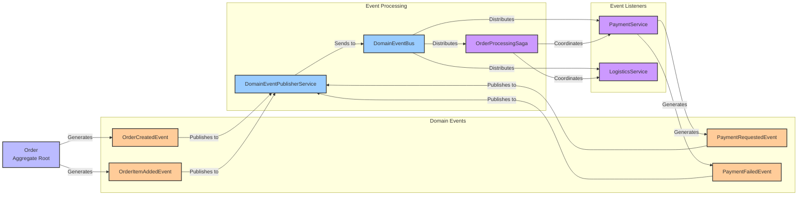

# Information Viewpoint

## Overview

The Information Viewpoint describes how the system stores, manipulates, manages, and distributes information. This viewpoint focuses on data structures, information flow, data consistency, and data lifecycle management.

## Stakeholders

- **Primary Concerns**: Data Architects, Database Administrators, Data Engineers
- **Secondary Concerns**: Developers, Business Analysts, Compliance Officers

## Concerns

1. **Data Model Design**: Data structure and relationship definitions
2. **Information Flow Management**: Data flow within the system
3. **Data Consistency**: Data integrity and consistency guarantees
4. **Event-Driven Architecture**: Domain events and event processing
5. **Data Persistence**: Data storage and retrieval strategies

## Architecture Elements

### Data Model
- [Data Model](data-model.md) - Entity relationships and data structures
- [Event Sourcing](event-sourcing.md) - Consistency guarantee mechanisms

### Event-Driven Architecture
- [Domain Events](domain-events.md) - Event design and implementation
- [Architecture Elements](architecture-elements.md) - Event storming modeling
- [Event Sourcing](event-sourcing.md) - Data flow and transformation

#### Event-Driven Architecture Diagram

*Complete event-driven architecture showing domain event generation, publishing, processing, and listening flows, including Saga pattern coordination mechanisms*

#### Information Viewpoint Detailed Architecture

*Detailed architecture design of the information viewpoint, including complete implementation of data models, information flow, and event processing*

## Quality Attribute Considerations

> 📋 **Complete Cross-Reference**: See [Viewpoint-Perspective Cross-Reference Matrix](../../viewpoint-perspective-matrix.md) for detailed impact analysis of all viewpoints

### 🔴 High Impact Perspectives

#### [Security Perspective](../../perspectives/security/README.md)
- **Data Encryption**: Static encryption (AES-256) and transmission encryption (TLS 1.3) for sensitive data
- **Access Control**: Fine-grained permission management and role control at data layer
- **Data Masking**: Dynamic masking and anonymization of sensitive data
- **Audit Trail**: Complete records of all data access and modifications
- **Related Implementations**: [Security Standards](../../perspectives/security/README.md) | [Data Protection Guide](../../perspectives/security/data-protection.md)

#### [Performance Perspective](../../perspectives/performance/README.md)
- **Query Optimization**: Database query indexing strategies and execution plan optimization
- **Caching Strategy**: Multi-layer caching architecture and cache invalidation strategies
- **Data Partitioning**: Horizontal and vertical partitioning strategies supporting large-scale data processing
- **Connection Pooling**: Database connection pool configuration and monitoring
- **Related Implementations**: [Performance Standards](../../perspectives/performance/README.md) | [Database Optimization](../../perspectives/performance/database-optimization.md)

#### [Availability Perspective](../../perspectives/availability/README.md)
- **Data Backup**: Automated backup strategies and multi-region backup
- **Data Replication**: Master-slave and multi-master replication configuration
- **Disaster Recovery**: Recovery objectives of RTO ≤ 5 minutes, RPO ≤ 1 minute
- **Data Consistency**: Data consistency guarantees in distributed environments
- **Related Implementations**: [Availability Standards](../../perspectives/availability/README.md) | [Disaster Recovery Plan](../../perspectives/availability/disaster-recovery.md)

#### [Regulation Perspective](../../perspectives/regulation/README.md)
- **Data Governance**: Data classification, labeling, and lifecycle management
- **Privacy Protection**: Compliance implementation for GDPR, CCPA, and other privacy regulations
- **Data Retention**: Data retention and deletion policies required by regulations
- **Compliance Audit**: Compliance auditing and reporting of data processing activities
- **Related Implementations**: [Regulation Standards](../../perspectives/regulation/README.md) | [Privacy Compliance](../../perspectives/regulation/privacy-compliance.md)

### 🟡 Medium Impact Perspectives

#### [Evolution Perspective](../../perspectives/evolution/README.md)
- **Data Model Evolution**: Database schema version management and migration strategies
- **Backward Compatibility**: Compatibility guarantees for data format changes
- **Migration Strategy**: Zero-downtime data migration and transformation
- **Related Implementations**: [Evolution Standards](../../perspectives/evolution/README.md) | [Migration Guide](../../perspectives/evolution/migration-guide.md)

#### [Usability Perspective](../../perspectives/usability/README.md)
- **Data Presentation**: Data visualization and report display
- **Search Experience**: Full-text search and intelligent filtering functionality
- **Data Export**: User-friendly data export and download functionality
- **Related Implementations**: [Usability Standards](../../perspectives/usability/README.md) | [User Experience Guide](../../perspectives/usability/user-experience.md)

#### [Location Perspective](../../perspectives/location/README.md)
- **Data Localization**: Geographic distribution and localized storage of data
- **Data Sovereignty**: Legal jurisdiction and compliance requirements for data storage
- **Cross-Region Synchronization**: Data synchronization strategies for multi-region data centers
- **Related Implementations**: [Location Standards](../../perspectives/location/README.md) | [Geographic Distribution](../../perspectives/location/geographic-distribution.md)

#### [Cost Perspective](../../perspectives/cost/README.md)
- **Storage Costs**: Cost optimization and tiered storage strategies for data storage
- **Transfer Costs**: Cost control for data transfer and network bandwidth
- **Query Costs**: Cost optimization for database queries and computing resources
- **Related Implementations**: [Cost Standards](../../perspectives/cost/README.md) | [Cost Optimization](../../perspectives/cost/cost-optimization.md)

## Related Diagrams

- [Event Storming Big Picture](../../diagrams/viewpoints/functional/event-storming-big-picture.puml)
- [Event Storming Process Level](../../diagrams/viewpoints/functional/event-storming-process-level.puml)
- [Domain Events Flow Diagram](../../diagrams/viewpoints/functional/domain-events-flow.puml)

## Event-Driven Architecture Diagram

- [Application Services Overview Diagram](../../diagrams/viewpoints/functional/application-services-overview.puml)

## Relationships with Other Viewpoints

- **[Context Viewpoint](../context/README.md)**: External data exchange and integration protocols
- **[Functional Viewpoint](../functional/README.md)**: Business functions drive data requirements
- **[Concurrency Viewpoint](../concurrency/README.md)**: Concurrency control for data access
- **[Development Viewpoint](../development/README.md)**: Data access layer implementation
- **[Deployment Viewpoint](../deployment/README.md)**: Database deployment and configuration
- **[Operational Viewpoint](../operational/README.md)**: Data monitoring and maintenance

## Implementation Guidelines

### Event-Driven Architecture Implementation
1. **Domain Event Design**: Use Records to implement immutable events
2. **Event Publishing**: Aggregate roots collect events, application services publish
3. **Event Processing**: Use @TransactionalEventListener
4. **Event Storage**: Support Event Sourcing pattern

### Data Consistency Strategies
1. **Strong Consistency**: ACID guarantees within the same aggregate
2. **Eventual Consistency**: Event-driven consistency across aggregates
3. **Compensation Mechanisms**: Saga pattern for distributed transaction handling
4. **Conflict Resolution**: Optimistic locking and version control

### Data Model Design Principles
1. **Normalization**: Avoid data duplication and anomalies
2. **Denormalization**: Query performance optimization
3. **Sharding Strategy**: Horizontal scaling support
4. **Index Design**: Query performance optimization

## Validation Criteria

- [ ] Data model supports all business requirements
- [ ] Data consistency mechanisms correctly implemented
- [ ] Domain event design is reasonable
- [ ] Data access performance meets requirements
- [ ] Data security and privacy protection in place
- [ ] Data backup and recovery mechanisms complete

---

**Related Documents**:
- [Domain Events Implementation Guide](domain-events.md)
- [Data Model Design](data-model.md)
- [Event Sourcing Implementation](event-sourcing.md)

